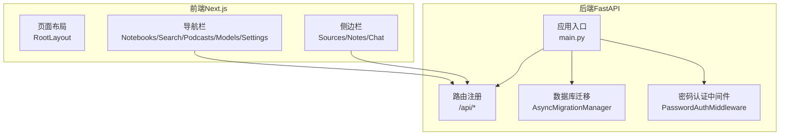
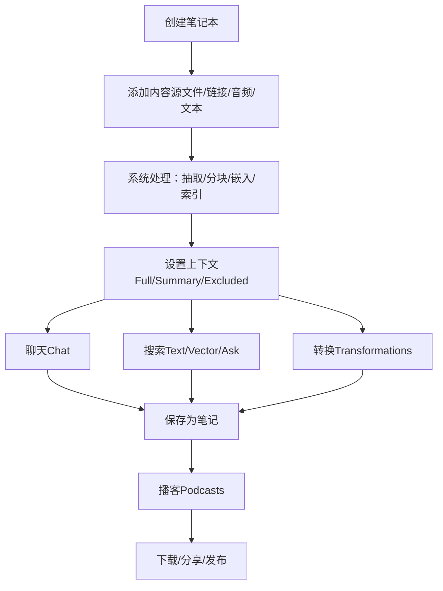
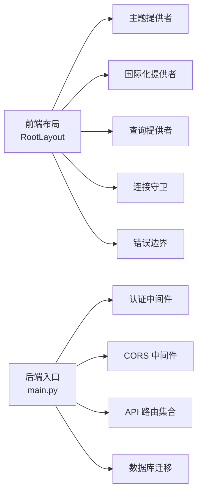

# 用户指南

<cite>
**本文引用的文件**
- [README.md](file://README.md)
- [docs/index.md](file://docs/index.md)
- [docs/3-USER-GUIDE/index.md](file://docs/3-USER-GUIDE/index.md)
- [docs/3-USER-GUIDE/interface-overview.md](file://docs/3-USER-GUIDE/interface-overview.md)
- [docs/3-USER-GUIDE/adding-sources.md](file://docs/3-USER-GUIDE/adding-sources.md)
- [docs/3-USER-GUIDE/working-with-notes.md](file://docs/3-USER-GUIDE/working-with-notes.md)
- [docs/3-USER-GUIDE/chat-effectively.md](file://docs/3-USER-GUIDE/chat-effectively.md)
- [docs/3-USER-GUIDE/search.md](file://docs/3-USER-GUIDE/search.md)
- [docs/3-USER-GUIDE/creating-podcasts.md](file://docs/3-USER-GUIDE/creating-podcasts.md)
- [docs/3-USER-GUIDE/transformations.md](file://docs/3-USER-GUIDE/transformations.md)
- [docs/3-USER-GUIDE/citations.md](file://docs/3-USER-GUIDE/citations.md)
- [docs/3-USER-GUIDE/api-configuration.md](file://docs/3-USER-GUIDE/api-configuration.md)
- [frontend/src/app/layout.tsx](file://frontend/src/app/layout.tsx)
- [api/main.py](file://api/main.py)
</cite>

## 目录
1. [简介](#简介)
2. [项目结构](#项目结构)
3. [核心组件](#核心组件)
4. [架构总览](#架构总览)
5. [详细组件分析](#详细组件分析)
6. [依赖关系分析](#依赖关系分析)
7. [性能考虑](#性能考虑)
8. [故障排查指南](#故障排查指南)
9. [结论](#结论)
10. [附录](#附录)

## 简介
本指南面向所有使用者，帮助你从零开始掌握 Open Notebook 的完整工作流：从笔记本创建、内容源添加与处理，到笔记生成、AI 聊天、智能搜索、内容转换（批量提取）、播客生成，再到 API 配置与安全设置。文档同时覆盖界面导航、常用快捷键、效率提升技巧，并提供不同使用场景下的实用案例与最佳实践，解释各功能之间的关联性与典型工作流程。

## 项目结构
Open Notebook 采用前后端分离架构：
- 前端基于 Next.js/React，提供三栏式布局（左侧资源、中间笔记、右侧聊天），并支持移动端折叠体验。
- 后端基于 FastAPI，提供 REST API，负责认证、数据库迁移、路由注册与异常处理。
- 文档位于 docs 目录，覆盖安装、核心概念、用户指南、配置、故障排查与开发参考。

图表来源
- [frontend/src/app/layout.tsx](file://frontend/src/app/layout.tsx#L19-L45)
- [api/main.py](file://api/main.py#L99-L180)

章节来源
- [README.md](file://README.md#L1-L358)
- [docs/index.md](file://docs/index.md#L1-L290)

## 核心组件
- 笔记本（Notebook）：研究项目的容器，承载多个内容源与笔记。
- 内容源（Source）：支持 PDF、网页链接、音频/视频、文本等多种类型；系统自动抽取、分块、嵌入并索引。
- 笔记（Note）：手动或由 AI 生成的洞察，可保存为结构化知识。
- 聊天（Chat）：基于检索增强生成（RAG），在可控上下文中与 AI 对话，支持引用与验证。
- 搜索（Search/Ask）：提供关键词搜索与向量语义搜索，Ask 自动综合多源回答。
- 内容转换（Transformations）：定义模板对多个源进行批量提取，输出结构化笔记。
- 播客（Podcasts）：将研究内容转化为多说话人音频，支持自定义角色与 TTS 提供商。
- API 配置（Settings/API Keys）：通过加密凭证管理多种 AI 提供商，支持本地与云端模型。

章节来源
- [docs/3-USER-GUIDE/index.md](file://docs/3-USER-GUIDE/index.md#L1-L209)
- [docs/3-USER-GUIDE/interface-overview.md](file://docs/3-USER-GUIDE/interface-overview.md#L1-L378)

## 架构总览
下图展示用户在界面中完成“添加源 → 设置上下文 → 聊天/搜索/转换 → 生成笔记/播客”的典型闭环流程。

图表来源
- [docs/3-USER-GUIDE/adding-sources.md](file://docs/3-USER-GUIDE/adding-sources.md#L82-L106)
- [docs/3-USER-GUIDE/chat-effectively.md](file://docs/3-USER-GUIDE/chat-effectively.md#L24-L94)
- [docs/3-USER-GUIDE/search.md](file://docs/3-USER-GUIDE/search.md#L24-L110)
- [docs/3-USER-GUIDE/transformations.md](file://docs/3-USER-GUIDE/transformations.md#L133-L166)
- [docs/3-USER-GUIDE/creating-podcasts.md](file://docs/3-USER-GUIDE/creating-podcasts.md#L24-L68)

## 详细组件分析

### 界面导航与布局
- 顶部导航：Notebooks、Search、Podcasts、Models、Settings。
- 左侧 Sources：列出当前笔记本中的内容源，支持添加、编辑、转换、删除。
- 中间 Notes：显示已生成的笔记，支持新建、编辑、导出、发布。
- 右侧 Chat：会话式对话，支持上下文选择、消息历史、保存为笔记、引用验证。
- Podcasts 标签页：在笔记本内生成播客，选择内容、角色与音色，生成后可下载或分享。
- Settings 页面：处理引擎、嵌入、文件清理、YouTube 语言偏好等。
- Models 页面：配置与选择语言模型、嵌入模型、TTS 提供商。

章节来源
- [docs/3-USER-GUIDE/interface-overview.md](file://docs/3-USER-GUIDE/interface-overview.md#L1-L378)

### 添加内容源（Sources）
- 支持类型：PDF、Word、PowerPoint、Excel、EPUB、Markdown、HTML、音频（MP3/WAV/M4A/OGG/FLAC）、视频（MP4/AVI/MOV/MKV/WebM）、YouTube、RSS。
- 处理流程：抽取文本 → 分块（约 500 字）→ 嵌入向量 → 索引存储。
- 上下文级别：Full Content（完整文本）、Summary Only（摘要）、Not in Context（排除）。
- 最佳实践：命名清晰、及时打标签、避免超大文件、优先拆分长文档以提升精度与速度。

章节来源
- [docs/3-USER-GUIDE/adding-sources.md](file://docs/3-USER-GUIDE/adding-sources.md#L1-L430)

### 笔记（Notes）与知识管理
- 来源：手动撰写、从 Chat/Ask/Transformations 保存。
- 结构：标题、正文（支持 Markdown）、元数据（标签、相关源、日期）。
- 组织：命名规范（日期/主题/类型/来源组合）、标签体系、跨笔记引用。
- 导出：复制、导出 Markdown、集合导出、发布链接。
- 使用：在 Chat 中引用、作为转换输入、进入播客内容。

章节来源
- [docs/3-USER-GUIDE/working-with-notes.md](file://docs/3-USER-GUIDE/working-with-notes.md#L1-L582)

### 聊天（Chat）与上下文控制
- 上下文三档：Full（精确引用与高成本）、Summary（背景参考）、Excluded（隐私/无关）。
- 问题模式：Factual/Analysis/Synthesis/Actionable；SPECIFIC 公式（Scope/Specificity/Constraint/Verification）。
- 成本优化：缩小上下文、选择更便宜模型、短问题、Tiered 策略。
- 引用与验证：点击引用定位原文，请求更精确引用，发现错误时要求纠正。

章节来源
- [docs/3-USER-GUIDE/chat-effectively.md](file://docs/3-USER-GUIDE/chat-effectively.md#L1-L555)

### 搜索与 Ask（Search/Ask）
- 文本搜索：关键词匹配，适合精确查找与引用。
- 向量搜索：语义相似度，适合探索性发现。
- Ask：自动理解问题、并行搜索、合成答案，适合综合性比较与总结。
- 流程建议：先文本搜索缩小范围，再用 Ask 获取综述，最后回到具体源深挖。

章节来源
- [docs/3-USER-GUIDE/search.md](file://docs/3-USER-GUIDE/search.md#L1-L476)

### 内容转换（Transformations）
- 批量处理：同一模板对多个源执行，输出结构化笔记。
- 内置模板：Summary、Key Concepts、Methodology、Takeaways、Questions。
- 自定义模板：明确格式、请求引用、限定长度，先单源测试再批量应用。
- 输出管理：按源命名、自动打标签、可编辑修正。

章节来源
- [docs/3-USER-GUIDE/transformations.md](file://docs/3-USER-GUIDE/transformations.md#L1-L403)

### 播客（Podcasts）生成
- 内容选择：在笔记本中挑选源与笔记，建议 3–5 个源。
- 角色与音色：预设角色或自定义，选择 TTS 提供商（OpenAI/Google/ElevenLabs/Local）。
- 生成流程：内容分析 → 大纲 → 对话 → 合成 → 混音 → 下载。
- 质量优化：选择合适角色与音色、聚焦主题、减少冗余内容、检查转写与语速。

章节来源
- [docs/3-USER-GUIDE/creating-podcasts.md](file://docs/3-USER-GUIDE/creating-podcasts.md#L1-L677)

### 引用与可信度（Citations）
- 自动生成：AI 回答中包含引用标记，点击跳转至源片段。
- 验证流程：读取 → 点击引用 → 核对事实与上下文 → 信任或要求更正。
- 保存与导出：引用随笔记保存，导出时保留链接或纯文本引用。

章节来源
- [docs/3-USER-GUIDE/citations.md](file://docs/3-USER-GUIDE/citations.md#L1-L300)

### API 配置与安全（Settings/API Keys）
- 凭证系统：加密存储于数据库，支持多凭证与多模型注册。
- 加密密钥：OPEN_NOTEBOOK_ENCRYPTION_KEY 必须设置，丢失则无法读取已存密钥。
- 连接测试：低成本模型验证连通性与可用性。
- 多提供商：OpenAI、Anthropic、Google、Groq、Mistral、DeepSeek、xAI、OpenRouter、ElevenLabs、Ollama、Azure OpenAI、OpenAI-Compatible、Vertex AI。
- 迁移：支持从环境变量与旧配置系统迁移至数据库凭证。

章节来源
- [docs/3-USER-GUIDE/api-configuration.md](file://docs/3-USER-GUIDE/api-configuration.md#L1-L391)

## 依赖关系分析
- 前端布局与全局提供者：RootLayout 注入主题、国际化、查询缓存、连接守卫与错误边界。
- 后端应用：FastAPI 应用启动时执行数据库迁移，注册认证中间件与 CORS，挂载全部 API 路由。

图表来源
- [frontend/src/app/layout.tsx](file://frontend/src/app/layout.tsx#L19-L45)
- [api/main.py](file://api/main.py#L99-L180)

章节来源
- [frontend/src/app/layout.tsx](file://frontend/src/app/layout.tsx#L1-L46)
- [api/main.py](file://api/main.py#L1-L190)

## 性能考虑
- 上下文控制：优先使用 Summary Only 或排除不必要源，降低 token 消耗与成本。
- 搜索策略：先文本搜索快速定位，再用 Ask 获取综述，最后回源精读。
- 转换批量化：一次定义模板，批量应用，减少重复交互。
- 播客内容聚焦：3–5 个高质量源，避免冗长导致质量下降。
- 处理时间：大文件与长音频需耐心等待，必要时拆分或优化质量参数。

## 故障排查指南
- 聊天无结果或质量差：检查上下文是否包含相关源、问题是否具体、是否请求引用。
- 搜索无结果：确认内容已处理、尝试向量搜索、缩小关键词或切换搜索类型。
- 转换输出不一致：调整提示词格式、明确引用与字数限制、先单源测试。
- 播客音质不佳：更换 TTS 提供商或音色、缩短句子、检查转写准确性。
- 凭证无法保存/测试失败：确认加密密钥设置、网络连通性、API Key 格式与权限。
- 数据库迁移失败：检查版本状态与日志，确保服务重启后迁移完成。

章节来源
- [docs/3-USER-GUIDE/chat-effectively.md](file://docs/3-USER-GUIDE/chat-effectively.md#L474-L495)
- [docs/3-USER-GUIDE/search.md](file://docs/3-USER-GUIDE/search.md#L266-L301)
- [docs/3-USER-GUIDE/transformations.md](file://docs/3-USER-GUIDE/transformations.md#L334-L364)
- [docs/3-USER-GUIDE/creating-podcasts.md](file://docs/3-USER-GUIDE/creating-podcasts.md#L421-L484)
- [docs/3-USER-GUIDE/api-configuration.md](file://docs/3-USER-GUIDE/api-configuration.md#L324-L358)

## 结论
Open Notebook 将“隐私优先、多模态内容、多模型支持”与“研究型工作流”深度融合。通过合理的笔记本组织、严谨的上下文控制、高效的搜索与转换、以及可复用的播客输出，你可以构建可持续的知识资产。建议从“添加源 → 设置上下文 → Chat/Ask/Transformations → 生成笔记/播客”的闭环开始，逐步引入更复杂的策略与模板，持续优化你的研究效率与产出质量。

## 附录

### 快速入门清单（15 分钟）
- 创建笔记本并命名描述。
- 添加 1–2 个源（PDF/链接/文本），等待处理完成。
- 在聊天中设置上下文，提出具体问题，保存优质回答为笔记。
- 探索更多源，进行对比与追问。
- 用 Transformations 批量生成摘要，或用 Ask 获取综述。
- 生成播客，导出或分享。

章节来源
- [docs/3-USER-GUIDE/index.md](file://docs/3-USER-GUIDE/index.md#L142-L172)

### 常用快捷键
- Enter：发送聊天消息
- Shift + Enter：聊天输入换行
- Escape：关闭对话框
- Ctrl/Cmd + F：浏览器内查找

章节来源
- [docs/3-USER-GUIDE/interface-overview.md](file://docs/3-USER-GUIDE/interface-overview.md#L332-L341)

### 不同场景的实用案例
- 学术研究：用 Chat 深挖论文，Ask 比较方法，Transformations 生成文献综述条目，Notes 记录要点，Podcast 用于汇报与分享。
- 商业分析：用 Transformations 批量分析竞品文档，Notes 归纳优劣势，Ask 得到综合建议，Podcast 用于团队分享。
- 学习教学：用 Vector 搜索学习资料，Chat 解答疑问，Notes 建立知识卡片，Podcast 便于通勤学习。

章节来源
- [docs/3-USER-GUIDE/creating-podcasts.md](file://docs/3-USER-GUIDE/creating-podcasts.md#L597-L631)
- [docs/3-USER-GUIDE/transformations.md](file://docs/3-USER-GUIDE/transformations.md#L169-L253)