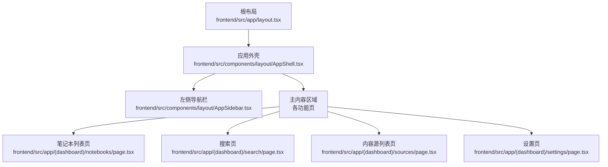
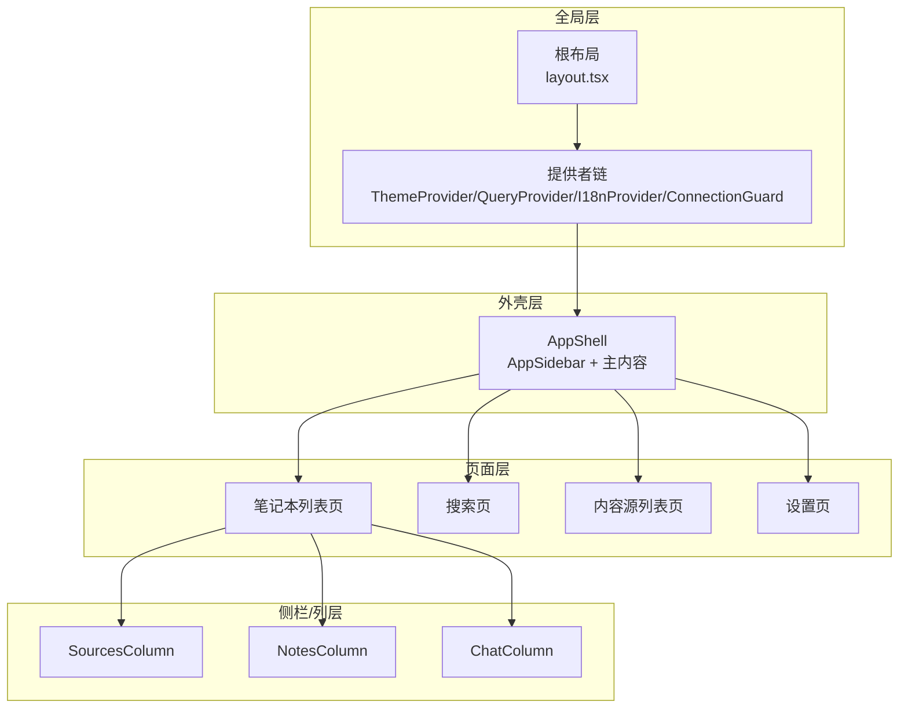
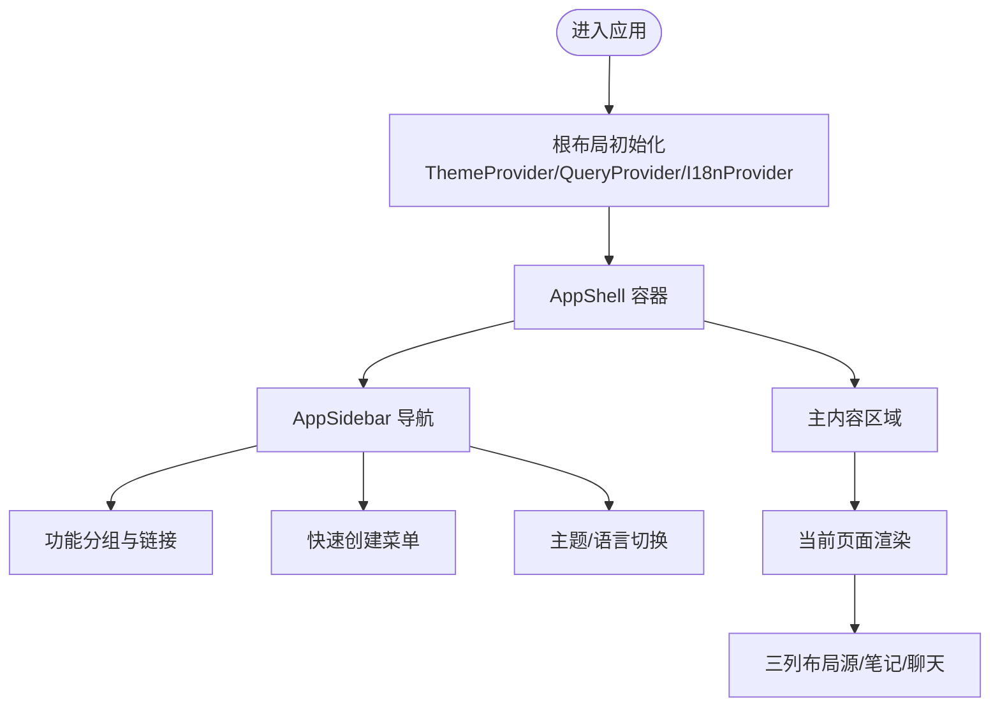
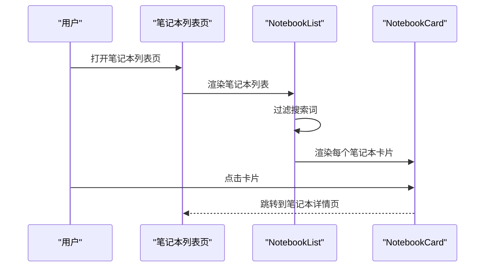
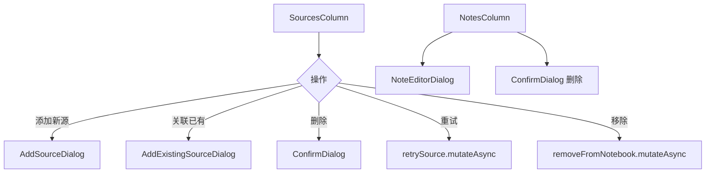
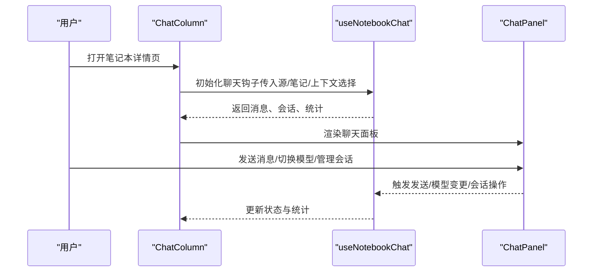
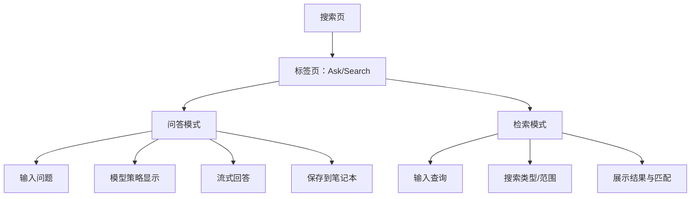
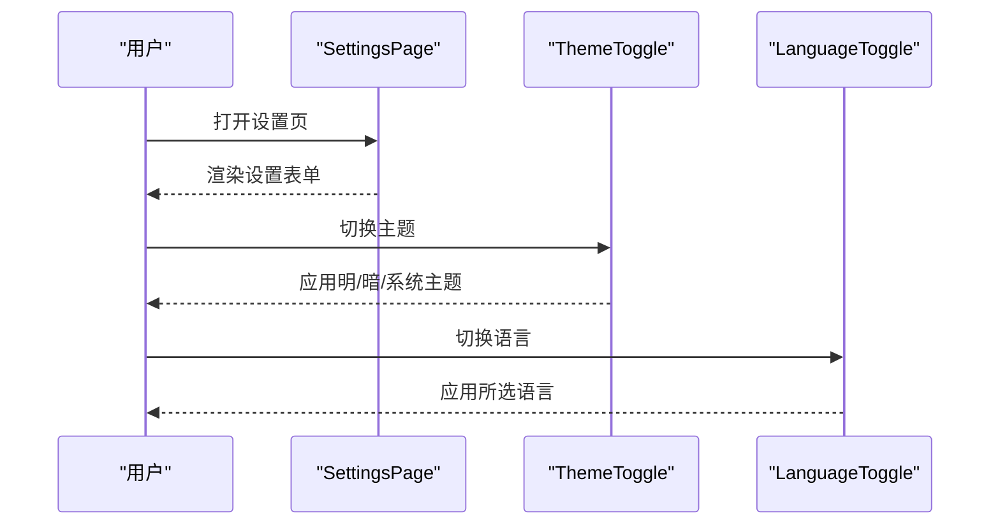
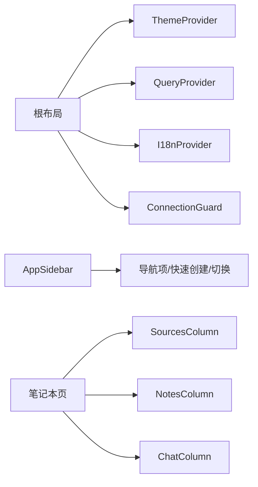

# 界面概览

<cite>
**本文引用的文件**
- [frontend/src/app/layout.tsx](file://frontend/src/app/layout.tsx)
- [frontend/src/components/layout/AppShell.tsx](file://frontend/src/components/layout/AppShell.tsx)
- [frontend/src/components/layout/AppSidebar.tsx](file://frontend/src/components/layout/AppSidebar.tsx)
- [frontend/src/app/(dashboard)/page.tsx](file://frontend/src/app/(dashboard)/page.tsx)
- [frontend/src/app/(dashboard)/notebooks/page.tsx](file://frontend/src/app/(dashboard)/notebooks/page.tsx)
- [frontend/src/app/(dashboard)/notebooks/components/NotebookList.tsx](file://frontend/src/app/(dashboard)/notebooks/components/NotebookList.tsx)
- [frontend/src/app/(dashboard)/notebooks/components/NotebookCard.tsx](file://frontend/src/app/(dashboard)/notebooks/components/NotebookCard.tsx)
- [frontend/src/app/(dashboard)/notebooks/components/ChatColumn.tsx](file://frontend/src/app/(dashboard)/notebooks/components/ChatColumn.tsx)
- [frontend/src/app/(dashboard)/notebooks/components/SourcesColumn.tsx](file://frontend/src/app/(dashboard)/notebooks/components/SourcesColumn.tsx)
- [frontend/src/app/(dashboard)/notebooks/components/NotesColumn.tsx](file://frontend/src/app/(dashboard)/notebooks/components/NotesColumn.tsx)
- [frontend/src/app/(dashboard)/search/page.tsx](file://frontend/src/app/(dashboard)/search/page.tsx)
- [frontend/src/app/(dashboard)/sources/page.tsx](file://frontend/src/app/(dashboard)/sources/page.tsx)
- [frontend/src/components/common/ThemeToggle.tsx](file://frontend/src/components/common/ThemeToggle.tsx)
- [frontend/src/components/common/LanguageToggle.tsx](file://frontend/src/components/common/LanguageToggle.tsx)
- [frontend/src/app/(dashboard)/settings/page.tsx](file://frontend/src/app/(dashboard)/settings/page.tsx)
</cite>

## 目录
1. [简介](#简介)
2. [项目结构](#项目结构)
3. [核心组件](#核心组件)
4. [架构总览](#架构总览)
5. [详细组件分析](#详细组件分析)
6. [依赖关系分析](#依赖关系分析)
7. [性能考量](#性能考量)
8. [故障排查指南](#故障排查指南)
9. [结论](#结论)
10. [附录](#附录)

## 简介
本文件为 Open Notebook 前端界面的概览文档，聚焦“三面板”设计布局与各界面元素职责，涵盖：
- 左侧导航栏：功能分组、快速创建、主题与语言切换、登出
- 主内容区域：笔记本列表、内容源卡片、笔记编辑器、聊天界面、搜索页
- 右侧侧边栏（在笔记本详情页中出现）：上下文选择、会话管理、模型切换
- 导航最佳实践：模块间切换、快捷键、响应式适配
- 个性化配置：主题切换、语言切换、设置入口
- 截图说明与常见操作流程演示

## 项目结构
Open Notebook 前端采用 Next.js App Router 结构，页面按功能域组织在 `(dashboard)` 下，全局布局通过根布局与应用外壳(AppShell)统一承载。

图表来源
- [frontend/src/app/layout.tsx](file://frontend/src/app/layout.tsx#L19-L45)
- [frontend/src/components/layout/AppShell.tsx](file://frontend/src/components/layout/AppShell.tsx#L10-L20)
- [frontend/src/components/layout/AppSidebar.tsx](file://frontend/src/components/layout/AppSidebar.tsx#L79-L381)
- [frontend/src/app/(dashboard)/notebooks/page.tsx](file://frontend/src/app/(dashboard)/notebooks/page.tsx#L14-L110)
- [frontend/src/app/(dashboard)/search/page.tsx](file://frontend/src/app/(dashboard)/search/page.tsx#L27-L500)
- [frontend/src/app/(dashboard)/sources/page.tsx](file://frontend/src/app/(dashboard)/sources/page.tsx#L21-L432)
- [frontend/src/app/(dashboard)/settings/page.tsx](file://frontend/src/app/(dashboard)/settings/page.tsx#L10-L32)

章节来源
- [frontend/src/app/layout.tsx](file://frontend/src/app/layout.tsx#L1-L46)
- [frontend/src/components/layout/AppShell.tsx](file://frontend/src/components/layout/AppShell.tsx#L1-L21)

## 核心组件
- 应用外壳 AppShell：统一三栏容器，左侧为导航，中间为主内容，顶部为引导横幅
- 左侧导航 AppSidebar：分组导航、快速创建、主题/语言切换、登出
- 笔记本列表页：笔记本检索、新建、归档/恢复、空态处理
- 源/笔记侧栏：内容源卡片、笔记列表、上下文模式切换、删除确认
- 聊天列：基于笔记本上下文的对话面板、会话管理、模型覆盖
- 搜索页：问答与检索双模式、高级模型配置、结果展开查看
- 设置页：系统设置表单、刷新重载
- 主题/语言切换：下拉菜单，支持明暗与系统主题、多语言

章节来源
- [frontend/src/components/layout/AppShell.tsx](file://frontend/src/components/layout/AppShell.tsx#L10-L20)
- [frontend/src/components/layout/AppSidebar.tsx](file://frontend/src/components/layout/AppSidebar.tsx#L79-L381)
- [frontend/src/app/(dashboard)/notebooks/page.tsx](file://frontend/src/app/(dashboard)/notebooks/page.tsx#L14-L110)
- [frontend/src/app/(dashboard)/notebooks/components/NotebookList.tsx](file://frontend/src/app/(dashboard)/notebooks/components/NotebookList.tsx#L23-L89)
- [frontend/src/app/(dashboard)/notebooks/components/NotebookCard.tsx](file://frontend/src/app/(dashboard)/notebooks/components/NotebookCard.tsx#L25-L137)
- [frontend/src/app/(dashboard)/notebooks/components/SourcesColumn.tsx](file://frontend/src/app/(dashboard)/notebooks/components/SourcesColumn.tsx#L41-L263)
- [frontend/src/app/(dashboard)/notebooks/components/NotesColumn.tsx](file://frontend/src/app/(dashboard)/notebooks/components/NotesColumn.tsx#L36-L224)
- [frontend/src/app/(dashboard)/notebooks/components/ChatColumn.tsx](file://frontend/src/app/(dashboard)/notebooks/components/ChatColumn.tsx#L19-L114)
- [frontend/src/app/(dashboard)/search/page.tsx](file://frontend/src/app/(dashboard)/search/page.tsx#L27-L500)
- [frontend/src/app/(dashboard)/settings/page.tsx](file://frontend/src/app/(dashboard)/settings/page.tsx#L10-L32)
- [frontend/src/components/common/ThemeToggle.tsx](file://frontend/src/components/common/ThemeToggle.tsx#L18-L62)
- [frontend/src/components/common/LanguageToggle.tsx](file://frontend/src/components/common/LanguageToggle.tsx#L17-L76)

## 架构总览
Open Notebook 的界面采用“根布局 -> 应用外壳 -> 页面”的层级结构，页面内部再细分为若干列式布局（如笔记本详情页的三列：源/笔记/聊天）。导航由 AppSidebar 统一管理，主题与语言切换通过独立组件提供。

图表来源
- [frontend/src/app/layout.tsx](file://frontend/src/app/layout.tsx#L19-L45)
- [frontend/src/components/layout/AppShell.tsx](file://frontend/src/components/layout/AppShell.tsx#L10-L20)
- [frontend/src/components/layout/AppSidebar.tsx](file://frontend/src/components/layout/AppSidebar.tsx#L79-L381)
- [frontend/src/app/(dashboard)/notebooks/page.tsx](file://frontend/src/app/(dashboard)/notebooks/page.tsx#L50-L109)
- [frontend/src/app/(dashboard)/notebooks/components/SourcesColumn.tsx](file://frontend/src/app/(dashboard)/notebooks/components/SourcesColumn.tsx#L148-L263)
- [frontend/src/app/(dashboard)/notebooks/components/NotesColumn.tsx](file://frontend/src/app/(dashboard)/notebooks/components/NotesColumn.tsx#L75-L224)
- [frontend/src/app/(dashboard)/notebooks/components/ChatColumn.tsx](file://frontend/src/app/(dashboard)/notebooks/components/ChatColumn.tsx#L19-L114)

## 详细组件分析

### 三面板布局与导航
- 左侧导航栏（AppSidebar）
  - 功能分组：采集、处理、创作、管理
  - 快速创建：支持创建内容源、笔记本、播客
  - 个性化：主题切换（明/暗/系统）、语言切换（多语种）、登出
  - 响应式：折叠状态下的图标提示与快捷键提示
- 主内容区域（AppShell）
  - 统一容器，承载页面内容与顶部引导横幅
- 右侧侧边栏（在笔记本详情页）
  - 源/笔记/聊天三列，支持折叠与上下文模式切换

图表来源
- [frontend/src/app/layout.tsx](file://frontend/src/app/layout.tsx#L19-L45)
- [frontend/src/components/layout/AppShell.tsx](file://frontend/src/components/layout/AppShell.tsx#L10-L20)
- [frontend/src/components/layout/AppSidebar.tsx](file://frontend/src/components/layout/AppSidebar.tsx#L79-L381)

章节来源
- [frontend/src/components/layout/AppSidebar.tsx](file://frontend/src/components/layout/AppSidebar.tsx#L46-L75)
- [frontend/src/components/layout/AppSidebar.tsx](file://frontend/src/components/layout/AppSidebar.tsx#L95-L105)
- [frontend/src/components/layout/AppSidebar.tsx](file://frontend/src/components/layout/AppSidebar.tsx#L302-L317)
- [frontend/src/components/layout/AppSidebar.tsx](file://frontend/src/components/layout/AppSidebar.tsx#L344-L376)

### 笔记本列表与卡片
- 列表组件 NotebookList
  - 支持加载态、空态、可折叠分组（活动/归档）
  - 搜索过滤：输入即查，区分大小写无关
- 卡片组件 NotebookCard
  - 展示名称、描述、更新时间、源/笔记数量徽标
  - 操作：归档/恢复、删除、点击跳转详情

图表来源
- [frontend/src/app/(dashboard)/notebooks/page.tsx](file://frontend/src/app/(dashboard)/notebooks/page.tsx#L21-L48)
- [frontend/src/app/(dashboard)/notebooks/components/NotebookList.tsx](file://frontend/src/app/(dashboard)/notebooks/components/NotebookList.tsx#L23-L89)
- [frontend/src/app/(dashboard)/notebooks/components/NotebookCard.tsx](file://frontend/src/app/(dashboard)/notebooks/components/NotebookCard.tsx#L39-L41)

章节来源
- [frontend/src/app/(dashboard)/notebooks/page.tsx](file://frontend/src/app/(dashboard)/notebooks/page.tsx#L14-L110)
- [frontend/src/app/(dashboard)/notebooks/components/NotebookList.tsx](file://frontend/src/app/(dashboard)/notebooks/components/NotebookList.tsx#L23-L89)
- [frontend/src/app/(dashboard)/notebooks/components/NotebookCard.tsx](file://frontend/src/app/(dashboard)/notebooks/components/NotebookCard.tsx#L25-L137)

### 内容源卡片与笔记编辑器
- 源列 SourcesColumn
  - 支持添加新源或关联已有源、删除、重试、从笔记本移除
  - 支持无限滚动加载、上下文模式切换（洞察/全文）
- 笔记列 NotesColumn
  - 新增/编辑笔记、删除确认、上下文开关、类型徽标（AI/人类）
- 编辑器
  - 通过弹窗进行笔记的新增与编辑，支持保存后刷新列表

图表来源
- [frontend/src/app/(dashboard)/notebooks/components/SourcesColumn.tsx](file://frontend/src/app/(dashboard)/notebooks/components/SourcesColumn.tsx#L97-L142)
- [frontend/src/app/(dashboard)/notebooks/components/NotesColumn.tsx](file://frontend/src/app/(dashboard)/notebooks/components/NotesColumn.tsx#L58-L73)

章节来源
- [frontend/src/app/(dashboard)/notebooks/components/SourcesColumn.tsx](file://frontend/src/app/(dashboard)/notebooks/components/SourcesColumn.tsx#L41-L263)
- [frontend/src/app/(dashboard)/notebooks/components/NotesColumn.tsx](file://frontend/src/app/(dashboard)/notebooks/components/NotesColumn.tsx#L36-L224)

### 聊天界面
- ChatColumn
  - 基于笔记本上下文的聊天面板，聚合源与笔记
  - 支持会话管理（创建/切换/更新/删除）、模型覆盖、上下文统计
- 上下文指示器
  - 显示洞察/全文/令牌计数等统计信息

图表来源
- [frontend/src/app/(dashboard)/notebooks/components/ChatColumn.tsx](file://frontend/src/app/(dashboard)/notebooks/components/ChatColumn.tsx#L19-L114)

章节来源
- [frontend/src/app/(dashboard)/notebooks/components/ChatColumn.tsx](file://frontend/src/app/(dashboard)/notebooks/components/ChatColumn.tsx#L19-L114)

### 搜索界面
- 模式切换：问答（Ask）与检索（Search）
- 问答模式
  - 输入问题、模型策略显示、流式输出、保存到笔记本
- 检索模式
  - 文本/向量搜索、限定范围（源/笔记）、结果展开匹配
- 高级模型配置：自定义策略/答案/最终回答模型

图表来源
- [frontend/src/app/(dashboard)/search/page.tsx](file://frontend/src/app/(dashboard)/search/page.tsx#L159-L500)

章节来源
- [frontend/src/app/(dashboard)/search/page.tsx](file://frontend/src/app/(dashboard)/search/page.tsx#L27-L500)

### 设置与个性化
- 设置页
  - 展示设置表单，支持刷新重载
- 主题切换
  - 明/暗/系统三种模式，支持图标/文本两种形态
- 语言切换
  - 多语言支持（英语、简/繁中文、葡萄牙语、日语、俄语）

图表来源
- [frontend/src/app/(dashboard)/settings/page.tsx](file://frontend/src/app/(dashboard)/settings/page.tsx#L10-L32)
- [frontend/src/components/common/ThemeToggle.tsx](file://frontend/src/components/common/ThemeToggle.tsx#L18-L62)
- [frontend/src/components/common/LanguageToggle.tsx](file://frontend/src/components/common/LanguageToggle.tsx#L17-L76)

章节来源
- [frontend/src/app/(dashboard)/settings/page.tsx](file://frontend/src/app/(dashboard)/settings/page.tsx#L10-L32)
- [frontend/src/components/common/ThemeToggle.tsx](file://frontend/src/components/common/ThemeToggle.tsx#L18-L62)
- [frontend/src/components/common/LanguageToggle.tsx](file://frontend/src/components/common/LanguageToggle.tsx#L17-L76)

## 依赖关系分析
- 全局提供者链
  - 根布局注入主题、查询缓存、国际化、连接守卫
- 页面与列组件
  - 笔记本详情页组合 SourcesColumn、NotesColumn、ChatColumn
- 导航与路由
  - AppSidebar 使用 Next.js Link/Navigate 实现页面跳转
- 国际化与主题
  - 通过独立组件与存储实现动态切换

图表来源
- [frontend/src/app/layout.tsx](file://frontend/src/app/layout.tsx#L19-L45)
- [frontend/src/components/layout/AppSidebar.tsx](file://frontend/src/components/layout/AppSidebar.tsx#L79-L381)
- [frontend/src/app/(dashboard)/notebooks/page.tsx](file://frontend/src/app/(dashboard)/notebooks/page.tsx#L50-L109)

章节来源
- [frontend/src/app/layout.tsx](file://frontend/src/app/layout.tsx#L19-L45)
- [frontend/src/components/layout/AppSidebar.tsx](file://frontend/src/components/layout/AppSidebar.tsx#L79-L381)

## 性能考量
- 列表与表格
  - 无限滚动：内容源列表与笔记本列表均采用滚动触底加载，减少一次性渲染压力
  - 分页参数：固定每页条数，避免大数据集阻塞
- 搜索与问答
  - 流式响应：问答采用流式输出，提升交互体验
  - 条件禁用：在请求进行时禁用相关按钮，避免重复提交
- 图标与提示
  - 折叠导航仅显示图标，减少布局宽度；悬停显示提示，兼顾可用性与性能

[本节为通用指导，不直接分析具体文件]

## 故障排查指南
- 连接与错误
  - 根布局包含连接守卫与错误边界，确保异常被统一捕获与提示
- 数据加载失败
  - 源/笔记/聊天列在数据加载失败时显示错误提示，建议刷新页面重试
- 删除确认
  - 删除源/笔记前弹出确认对话框，防止误删
- 搜索无结果
  - 检索模式无结果时显示空态提示，建议调整关键词或切换为文本搜索

章节来源
- [frontend/src/app/layout.tsx](file://frontend/src/app/layout.tsx#L30-L41)
- [frontend/src/app/(dashboard)/notebooks/components/ChatColumn.tsx](file://frontend/src/app/(dashboard)/notebooks/components/ChatColumn.tsx#L78-L91)
- [frontend/src/app/(dashboard)/notebooks/components/SourcesColumn.tsx](file://frontend/src/app/(dashboard)/notebooks/components/SourcesColumn.tsx#L240-L260)
- [frontend/src/app/(dashboard)/notebooks/components/NotesColumn.tsx](file://frontend/src/app/(dashboard)/notebooks/components/NotesColumn.tsx#L212-L221)

## 结论
Open Notebook 的界面以“三面板”为核心，结合统一的导航与外壳，实现了从内容采集、知识检索到创作与管理的完整工作流。通过可折叠导航、上下文模式、流式交互与多语言/主题支持，既保证了专业性也兼顾了易用性。后续可在以下方面持续优化：
- 更丰富的键盘快捷键与无障碍支持
- 更细粒度的上下文统计与可视化
- 更灵活的布局切换（如双列/三列自由组合）

[本节为总结性内容，不直接分析具体文件]

## 附录

### 导航最佳实践
- 在不同功能模块间切换
  - 使用左侧导航分组直达：采集（内容源）、处理（笔记本/搜索）、创作（播客）、管理（设置/高级）
  - 快速创建：在导航顶部的创建菜单中一键新增
- 快捷键使用
  - 命令调色板：在折叠导航下显示“⌘K 或 Ctrl+K”提示，快速打开命令调色板
  - 搜索页：问答模式支持“Cmd/Ctrl+Enter”提交
  - 源列表：支持方向键导航与回车打开
- 响应式设计适配
  - 导航可折叠，窄屏下优先显示图标与提示
  - 列布局随屏幕尺寸自动调整，移动端建议使用横向滑动或折叠列

章节来源
- [frontend/src/components/layout/AppSidebar.tsx](file://frontend/src/components/layout/AppSidebar.tsx#L302-L317)
- [frontend/src/app/(dashboard)/search/page.tsx](file://frontend/src/app/(dashboard)/search/page.tsx#L197-L203)
- [frontend/src/app/(dashboard)/sources/page.tsx](file://frontend/src/app/(dashboard)/sources/page.tsx#L100-L145)

### 个性化配置
- 主题切换
  - 在导航底部提供主题切换菜单，支持明/暗/系统三种模式
- 语言切换
  - 提供多语言菜单，覆盖英语、简/繁中文、葡萄牙语、日语、俄语
- 设置入口
  - “管理/设置”分组进入设置页，支持刷新重载

章节来源
- [frontend/src/components/layout/AppSidebar.tsx](file://frontend/src/components/layout/AppSidebar.tsx#L344-L376)
- [frontend/src/components/common/ThemeToggle.tsx](file://frontend/src/components/common/ThemeToggle.tsx#L18-L62)
- [frontend/src/components/common/LanguageToggle.tsx](file://frontend/src/components/common/LanguageToggle.tsx#L17-L76)
- [frontend/src/app/(dashboard)/settings/page.tsx](file://frontend/src/app/(dashboard)/settings/page.tsx#L10-L32)

### 常见操作流程演示
- 创建笔记本
  - 在笔记本列表页点击“新建笔记本”，填写信息后创建
- 添加内容源
  - 在笔记本详情页的“内容源”列点击“添加源”，选择“新建”或“关联已有”
- 编辑笔记
  - 在“笔记”列点击“写笔记”，在弹窗中编辑并保存
- 与笔记本对话
  - 在“聊天”列中输入消息，选择模型与上下文模式后发送
- 搜索知识库
  - 在“搜索”页选择“问答”或“检索”，输入查询并查看结果

章节来源
- [frontend/src/app/(dashboard)/notebooks/page.tsx](file://frontend/src/app/(dashboard)/notebooks/page.tsx#L72-L76)
- [frontend/src/app/(dashboard)/notebooks/components/SourcesColumn.tsx](file://frontend/src/app/(dashboard)/notebooks/components/SourcesColumn.tsx#L169-L178)
- [frontend/src/app/(dashboard)/notebooks/components/NotesColumn.tsx](file://frontend/src/app/(dashboard)/notebooks/components/NotesColumn.tsx#L88-L98)
- [frontend/src/app/(dashboard)/notebooks/components/ChatColumn.tsx](file://frontend/src/app/(dashboard)/notebooks/components/ChatColumn.tsx#L94-L112)
- [frontend/src/app/(dashboard)/search/page.tsx](file://frontend/src/app/(dashboard)/search/page.tsx#L179-L308)