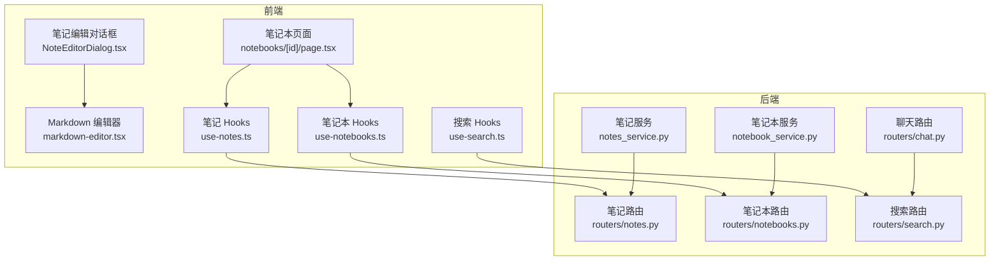
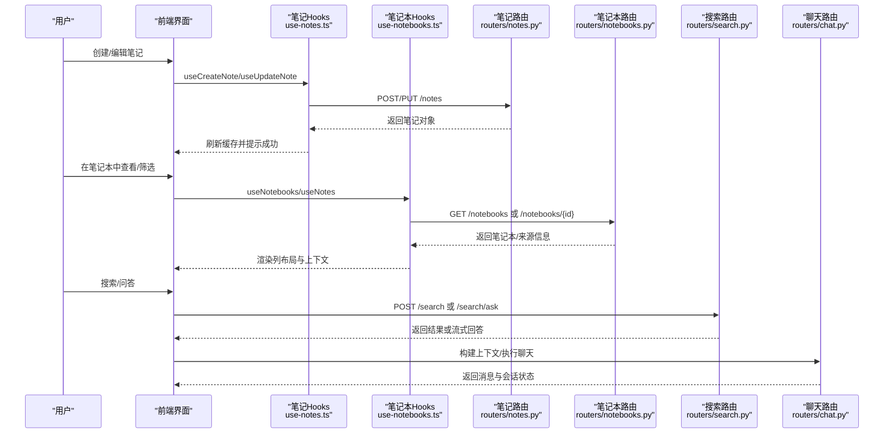
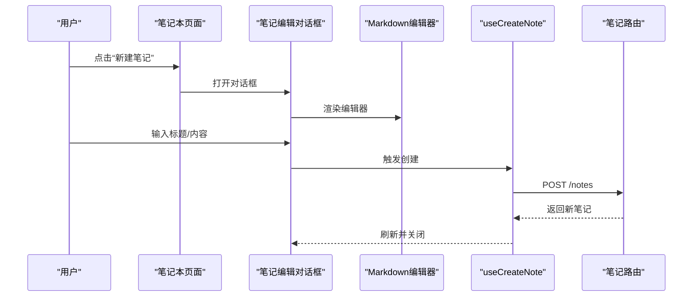
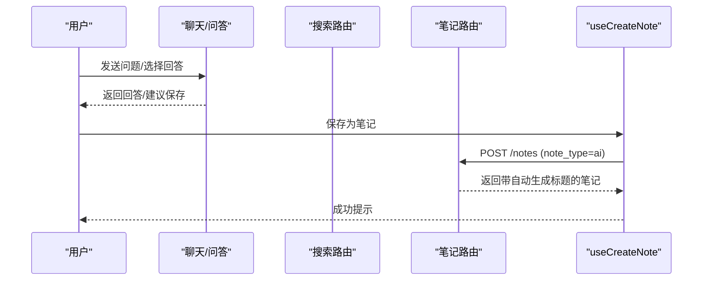
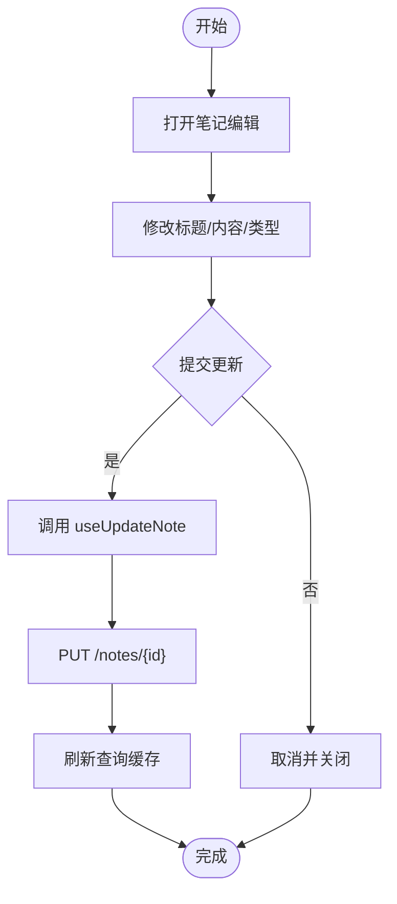
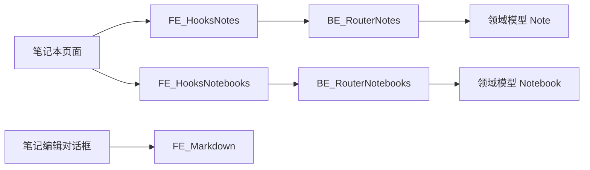

# 笔记管理

<cite>
**本文引用的文件**
- [api/routers/notes.py](file://api/routers/notes.py)
- [api/routers/notebooks.py](file://api/routers/notebooks.py)
- [api/routers/search.py](file://api/routers/search.py)
- [api/routers/chat.py](file://api/routers/chat.py)
- [api/notes_service.py](file://api/notes_service.py)
- [api/notebook_service.py](file://api/notebook_service.py)
- [frontend/src/app/(dashboard)/notebooks/[id]/page.tsx](file://frontend/src/app/(dashboard)/notebooks/[id]/page.tsx)
- [frontend/src/app/(dashboard)/notebooks/components/NoteEditorDialog.tsx](file://frontend/src/app/(dashboard)/notebooks/components/NoteEditorDialog.tsx)
- [frontend/src/components/ui/markdown-editor.tsx](file://frontend/src/components/ui/markdown-editor.tsx)
- [frontend/src/lib/hooks/use-notes.ts](file://frontend/src/lib/hooks/use-notes.ts)
- [frontend/src/lib/hooks/use-notebooks.ts](file://frontend/src/lib/hooks/use-notebooks.ts)
- [frontend/src/lib/hooks/use-search.ts](file://frontend/src/lib/hooks/use-search.ts)
- [docs/3-USER-GUIDE/working-with-notes.md](file://docs/3-USER-GUIDE/working-with-notes.md)
- [docs/3-USER-GUIDE/index.md](file://docs/3-USER-GUIDE/index.md)
</cite>

## 目录
1. [简介](#简介)
2. [项目结构](#项目结构)
3. [核心组件](#核心组件)
4. [架构总览](#架构总览)
5. [详细组件分析](#详细组件分析)
6. [依赖分析](#依赖分析)
7. [性能考虑](#性能考虑)
8. [故障排查指南](#故障排查指南)
9. [结论](#结论)
10. [附录](#附录)

## 简介
本指南围绕“笔记管理”功能，系统讲解从创建到组织、从编辑到分享的完整工作流，覆盖以下能力：
- 手动笔记创建与富文本编辑（Markdown 支持）
- AI 生成笔记保存（来自聊天、问答、转换）
- 笔记编辑与修改、版本与历史（基于更新时间）
- 组织方式：按笔记本分类、标签管理、命名规范
- 内容与来源关联：引用与交叉链接
- 高级功能：搜索（关键词/语义）、导出、分享
- 模板与批量处理：转换（Transformations）批量生成笔记
- 版本控制与历史记录：通过更新时间与查询缓存实现

## 项目结构
后端采用 FastAPI 路由层，前端使用 Next.js 应用，配合 React Query 进行数据请求与缓存；笔记与笔记本服务分别封装在 API 层与前端 Hook 中。

图表来源
- [frontend/src/app/(dashboard)/notebooks/[id]/page.tsx](file://frontend/src/app/(dashboard)/notebooks/[id]/page.tsx#L28-L244)
- [frontend/src/app/(dashboard)/notebooks/components/NoteEditorDialog.tsx](file://frontend/src/app/(dashboard)/notebooks/components/NoteEditorDialog.tsx#L31-L197)
- [frontend/src/components/ui/markdown-editor.tsx](file://frontend/src/components/ui/markdown-editor.tsx#L23-L44)
- [frontend/src/lib/hooks/use-notes.ts](file://frontend/src/lib/hooks/use-notes.ts#L9-L101)
- [frontend/src/lib/hooks/use-notebooks.ts](file://frontend/src/lib/hooks/use-notebooks.ts#L9-L111)
- [frontend/src/lib/hooks/use-search.ts](file://frontend/src/lib/hooks/use-search.ts#L8-L34)
- [api/routers/notes.py](file://api/routers/notes.py#L13-L187)
- [api/routers/notebooks.py](file://api/routers/notebooks.py#L20-L327)
- [api/routers/search.py](file://api/routers/search.py#L17-L214)
- [api/routers/chat.py](file://api/routers/chat.py#L96-L516)
- [api/notes_service.py](file://api/notes_service.py#L13-L103)
- [api/notebook_service.py](file://api/notebook_service.py#L13-L87)

章节来源
- [frontend/src/app/(dashboard)/notebooks/[id]/page.tsx](file://frontend/src/app/(dashboard)/notebooks/[id]/page.tsx#L28-L244)
- [frontend/src/app/(dashboard)/notebooks/components/NoteEditorDialog.tsx](file://frontend/src/app/(dashboard)/notebooks/components/NoteEditorDialog.tsx#L31-L197)
- [frontend/src/components/ui/markdown-editor.tsx](file://frontend/src/components/ui/markdown-editor.tsx#L23-L44)
- [frontend/src/lib/hooks/use-notes.ts](file://frontend/src/lib/hooks/use-notes.ts#L9-L101)
- [frontend/src/lib/hooks/use-notebooks.ts](file://frontend/src/lib/hooks/use-notebooks.ts#L9-L111)
- [frontend/src/lib/hooks/use-search.ts](file://frontend/src/lib/hooks/use-search.ts#L8-L34)
- [api/routers/notes.py](file://api/routers/notes.py#L13-L187)
- [api/routers/notebooks.py](file://api/routers/notebooks.py#L20-L327)
- [api/routers/search.py](file://api/routers/search.py#L17-L214)
- [api/routers/chat.py](file://api/routers/chat.py#L96-L516)
- [api/notes_service.py](file://api/notes_service.py#L13-L103)
- [api/notebook_service.py](file://api/notebook_service.py#L13-L87)

## 核心组件
- 笔记服务与路由
  - 后端提供笔记的增删改查接口，支持自动标题生成（AI 类型且无标题时），并可选择性加入笔记本。
  - 前端通过 React Query 的 useNotes/useCreateNote/useUpdateNote/useDeleteNote 管理笔记状态与缓存。
- 笔记本服务与路由
  - 提供笔记本列表、详情、创建、更新、删除及删除预览（统计将被删除的笔记与来源数量）。
  - 支持将来源添加/移除至笔记本，形成“来源-笔记本”的引用关系。
- 富文本编辑器
  - 使用 @uiw/react-md-editor，支持实时预览、占位符、高度配置等。
- 搜索与问答
  - 文本搜索与向量搜索（需要嵌入模型），支持流式问答与简单问答两种模式。
- 聊天与上下文
  - 支持会话管理、构建上下文（来源与笔记），用于聊天时的 AI 推理。

章节来源
- [api/routers/notes.py](file://api/routers/notes.py#L13-L187)
- [api/routers/notebooks.py](file://api/routers/notebooks.py#L20-L327)
- [api/routers/search.py](file://api/routers/search.py#L17-L214)
- [api/routers/chat.py](file://api/routers/chat.py#L96-L516)
- [frontend/src/components/ui/markdown-editor.tsx](file://frontend/src/components/ui/markdown-editor.tsx#L23-L44)
- [frontend/src/lib/hooks/use-notes.ts](file://frontend/src/lib/hooks/use-notes.ts#L9-L101)
- [frontend/src/lib/hooks/use-notebooks.ts](file://frontend/src/lib/hooks/use-notebooks.ts#L9-L111)

## 架构总览
下图展示从用户操作到后端处理与返回的关键交互路径。

图表来源
- [frontend/src/lib/hooks/use-notes.ts](file://frontend/src/lib/hooks/use-notes.ts#L26-L76)
- [frontend/src/lib/hooks/use-notebooks.ts](file://frontend/src/lib/hooks/use-notebooks.ts#L9-L81)
- [api/routers/notes.py](file://api/routers/notes.py#L13-L187)
- [api/routers/notebooks.py](file://api/routers/notebooks.py#L20-L327)
- [api/routers/search.py](file://api/routers/search.py#L17-L214)
- [api/routers/chat.py](file://api/routers/chat.py#L96-L516)

## 详细组件分析

### 手动笔记创建与富文本编辑
- 创建流程
  - 在笔记本页面打开“新建笔记”对话框，输入标题与内容，点击保存。
  - 前端调用 useCreateNote，发送创建请求；成功后刷新该笔记本下的笔记列表。
- 富文本编辑
  - 使用 Markdown 编辑器组件，支持实时预览、占位符、自定义高度。
  - 支持全屏编辑模式，编辑器状态变化时动态调整对话框尺寸。
- 标题与类型
  - 当笔记类型为 AI 且未提供标题时，后端会根据内容自动生成标题。

图表来源
- [frontend/src/app/(dashboard)/notebooks/components/NoteEditorDialog.tsx](file://frontend/src/app/(dashboard)/notebooks/components/NoteEditorDialog.tsx#L31-L197)
- [frontend/src/components/ui/markdown-editor.tsx](file://frontend/src/components/ui/markdown-editor.tsx#L23-L44)
- [frontend/src/lib/hooks/use-notes.ts](file://frontend/src/lib/hooks/use-notes.ts#L26-L50)
- [api/routers/notes.py](file://api/routers/notes.py#L49-L106)

章节来源
- [frontend/src/app/(dashboard)/notebooks/components/NoteEditorDialog.tsx](file://frontend/src/app/(dashboard)/notebooks/components/NoteEditorDialog.tsx#L31-L197)
- [frontend/src/components/ui/markdown-editor.tsx](file://frontend/src/components/ui/markdown-editor.tsx#L23-L44)
- [frontend/src/lib/hooks/use-notes.ts](file://frontend/src/lib/hooks/use-notes.ts#L26-L50)
- [api/routers/notes.py](file://api/routers/notes.py#L49-L106)

### AI 生成笔记保存
- 来源
  - 聊天对话中的回答可直接保存为笔记。
  - 问答（Ask）功能生成综合答案后可保存为笔记。
  - 转换（Transformations）批量处理来源生成笔记。
- 自动标题
  - 若笔记类型为 AI 且未提供标题，后端会基于内容生成标题。
- 上下文构建
  - 聊天路由支持构建上下文（来源与笔记），用于推理时携带更丰富的背景信息。

图表来源
- [api/routers/notes.py](file://api/routers/notes.py#L49-L106)
- [api/routers/search.py](file://api/routers/search.py#L110-L214)
- [api/routers/chat.py](file://api/routers/chat.py#L411-L516)
- [frontend/src/lib/hooks/use-notes.ts](file://frontend/src/lib/hooks/use-notes.ts#L26-L50)

章节来源
- [api/routers/notes.py](file://api/routers/notes.py#L49-L106)
- [api/routers/search.py](file://api/routers/search.py#L110-L214)
- [api/routers/chat.py](file://api/routers/chat.py#L411-L516)
- [frontend/src/lib/hooks/use-notes.ts](file://frontend/src/lib/hooks/use-notes.ts#L26-L50)

### 笔记编辑与修改
- 更新流程
  - 打开现有笔记进行编辑，提交后调用 useUpdateNote，仅更新提供的字段。
  - 更新成功后刷新相关查询缓存，确保界面显示最新内容。
- 删除流程
  - 通过 useDeleteNote 删除笔记，同时失效相关查询以保持一致性。

图表来源
- [frontend/src/lib/hooks/use-notes.ts](file://frontend/src/lib/hooks/use-notes.ts#L52-L76)
- [api/routers/notes.py](file://api/routers/notes.py#L132-L170)

章节来源
- [frontend/src/lib/hooks/use-notes.ts](file://frontend/src/lib/hooks/use-notes.ts#L52-L76)
- [api/routers/notes.py](file://api/routers/notes.py#L132-L170)

### 组织方式：笔记本、标签与命名规范
- 按笔记本分类
  - 笔记本作为容器，笔记可归属到指定笔记本；删除笔记本时可选择是否删除独享来源。
- 标签管理
  - 用户指南建议在创建笔记时立即打标签，便于后续筛选与工作流管理。
- 命名规范
  - 提供日期、主题、类型、来源等多种命名策略，推荐组合使用以提升可检索性与可追溯性。
- 引用与交叉链接
  - 可在笔记内容中引用来源与其它笔记，便于建立知识网络。

章节来源
- [api/routers/notebooks.py](file://api/routers/notebooks.py#L218-L291)
- [docs/3-USER-GUIDE/working-with-notes.md](file://docs/3-USER-GUIDE/working-with-notes.md#L260-L334)

### 搜索、导出与分享
- 搜索
  - 文本搜索：精确匹配关键词。
  - 向量搜索：语义相似度检索，需配置嵌入模型。
  - 问答：支持流式与非流式两种模式，适合不同场景。
- 导出与分享
  - 支持复制到剪贴板、导出为 Markdown 文件、创建笔记集合、发布为可分享链接等。
- 版本与历史
  - 通过“更新时间”字段体现版本演进；React Query 缓存失效机制保证视图一致性。

章节来源
- [api/routers/search.py](file://api/routers/search.py#L17-L214)
- [docs/3-USER-GUIDE/working-with-notes.md](file://docs/3-USER-GUIDE/working-with-notes.md#L372-L427)

### 模板与批量操作
- 转换（Transformations）
  - 提供内置模板（摘要、关键概念、方法论、要点等），也可自定义模板。
  - 将模板应用于单个或多个来源，系统自动生成结构化笔记，便于批量整理与复用。
- 批量处理技巧
  - 先定义好模板，再一次性应用到多个来源，最后集中审阅与编辑。

章节来源
- [docs/3-USER-GUIDE/working-with-notes.md](file://docs/3-USER-GUIDE/working-with-notes.md#L192-L256)

## 依赖分析
- 前端依赖
  - 页面组件依赖 Hooks 管理状态与副作用；Markdown 编辑器组件负责渲染与交互。
- 后端依赖
  - 笔记路由依赖领域模型与异常处理；笔记本路由提供引用关系维护与删除预览。
- 查询与缓存
  - React Query 负责查询键、失效与重取，确保前后端状态一致。

图表来源
- [frontend/src/app/(dashboard)/notebooks/[id]/page.tsx](file://frontend/src/app/(dashboard)/notebooks/[id]/page.tsx#L35-L44)
- [frontend/src/app/(dashboard)/notebooks/components/NoteEditorDialog.tsx](file://frontend/src/app/(dashboard)/notebooks/components/NoteEditorDialog.tsx#L31-L197)
- [frontend/src/components/ui/markdown-editor.tsx](file://frontend/src/components/ui/markdown-editor.tsx#L23-L44)
- [frontend/src/lib/hooks/use-notes.ts](file://frontend/src/lib/hooks/use-notes.ts#L9-L101)
- [frontend/src/lib/hooks/use-notebooks.ts](file://frontend/src/lib/hooks/use-notebooks.ts#L9-L111)
- [api/routers/notes.py](file://api/routers/notes.py#L13-L187)
- [api/routers/notebooks.py](file://api/routers/notebooks.py#L20-L327)

章节来源
- [frontend/src/app/(dashboard)/notebooks/[id]/page.tsx](file://frontend/src/app/(dashboard)/notebooks/[id]/page.tsx#L35-L44)
- [frontend/src/app/(dashboard)/notebooks/components/NoteEditorDialog.tsx](file://frontend/src/app/(dashboard)/notebooks/components/NoteEditorDialog.tsx#L31-L197)
- [frontend/src/components/ui/markdown-editor.tsx](file://frontend/src/components/ui/markdown-editor.tsx#L23-L44)
- [frontend/src/lib/hooks/use-notes.ts](file://frontend/src/lib/hooks/use-notes.ts#L9-L101)
- [frontend/src/lib/hooks/use-notebooks.ts](file://frontend/src/lib/hooks/use-notebooks.ts#L9-L111)
- [api/routers/notes.py](file://api/routers/notes.py#L13-L187)
- [api/routers/notebooks.py](file://api/routers/notebooks.py#L20-L327)

## 性能考虑
- 查询缓存与失效
  - 使用 React Query 的查询键与失效策略，避免重复请求，提升响应速度。
- 分页与懒加载
  - 源列表支持分页与“加载更多”，减少一次性渲染压力。
- 流式问答
  - 搜索路由提供流式响应，改善长回答的等待体验。
- 向量搜索前置校验
  - 在执行向量搜索前检查嵌入模型可用性，避免无效请求。

章节来源
- [frontend/src/lib/hooks/use-notes.ts](file://frontend/src/lib/hooks/use-notes.ts#L31-L49)
- [frontend/src/lib/hooks/use-search.ts](file://frontend/src/lib/hooks/use-search.ts#L8-L34)
- [api/routers/search.py](file://api/routers/search.py#L17-L59)

## 故障排查指南
- 笔记创建失败
  - 检查内容长度与必填项；查看错误提示并重试。
- 笔记本删除影响范围未知
  - 使用删除预览接口查看将被删除的笔记与来源数量，确认后再执行删除。
- 搜索无结果或质量不佳
  - 文本搜索适用于精确词；语义搜索需配置嵌入模型；尝试调整关键词或扩大范围。
- 聊天上下文不准确
  - 明确选择来源与笔记的上下文模式（短/长），必要时重新构建上下文。

章节来源
- [frontend/src/lib/hooks/use-notes.ts](file://frontend/src/lib/hooks/use-notes.ts#L42-L49)
- [frontend/src/lib/hooks/use-notebooks.ts](file://frontend/src/lib/hooks/use-notebooks.ts#L74-L80)
- [api/routers/search.py](file://api/routers/search.py#L17-L59)
- [api/routers/chat.py](file://api/routers/chat.py#L411-L516)

## 结论
本指南梳理了从创建、编辑到组织与分享的笔记管理全流程，结合后端路由与前端 Hooks 的协作，实现了高效、可扩展的知识沉淀与复用。通过合理的命名与标签策略、引用与交叉链接、以及搜索与转换工具，用户可以构建高质量的个人知识库。

## 附录
- 快速上手清单
  - 创建笔记本 → 添加来源 → 聊天探索 → 保存为笔记 → 组织与导出
- 常用任务映射
  - 探索主题：聊天 + 选择上下文
  - 获取综合答案：搜索/问答
  - 批量提取：转换（模板）+ 应用到多来源
  - 快速分享：复制/导出/发布

章节来源
- [docs/3-USER-GUIDE/index.md](file://docs/3-USER-GUIDE/index.md#L142-L172)
- [docs/3-USER-GUIDE/index.md](file://docs/3-USER-GUIDE/index.md#L112-L138)