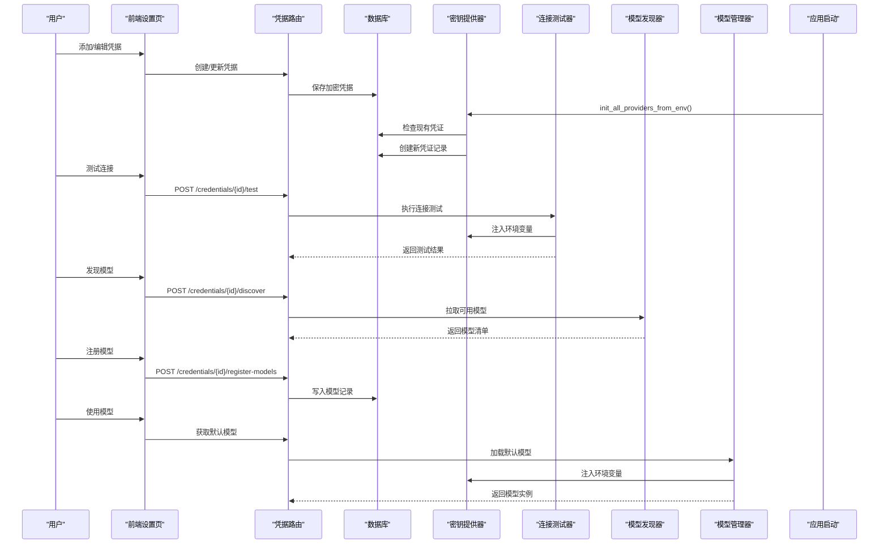
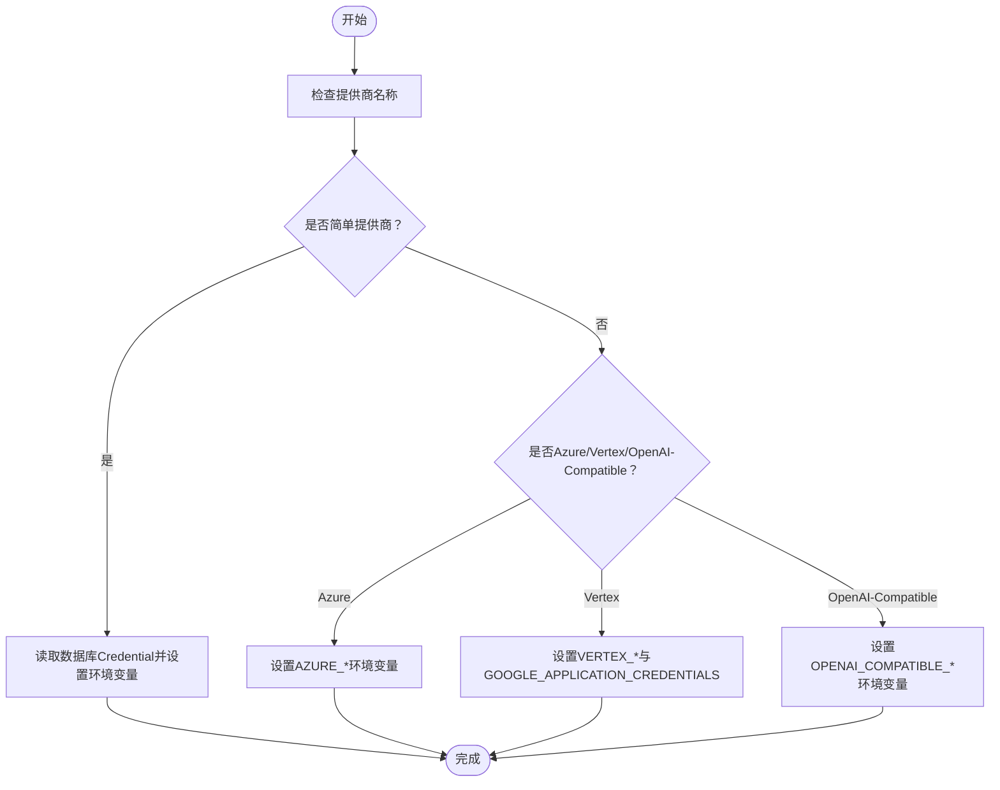
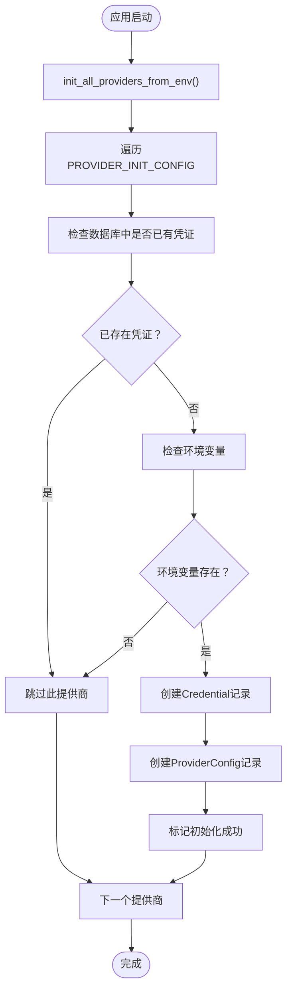
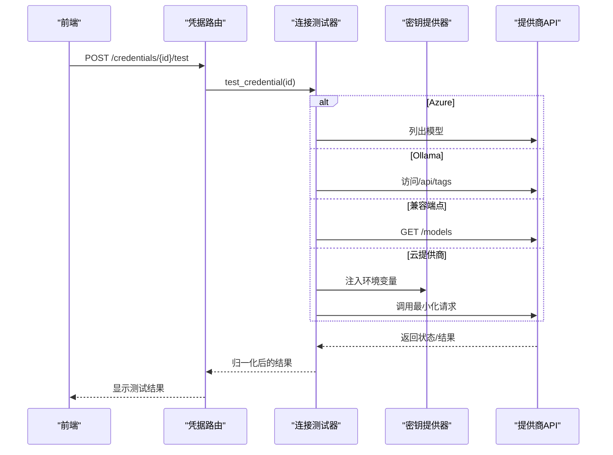
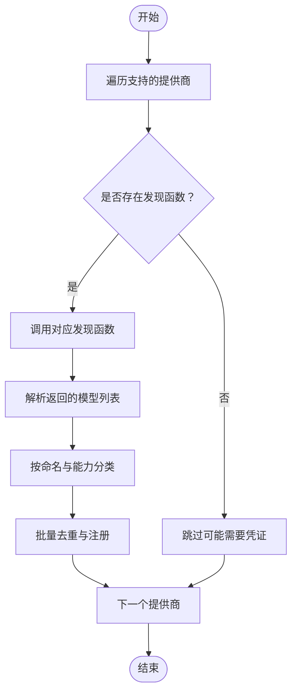
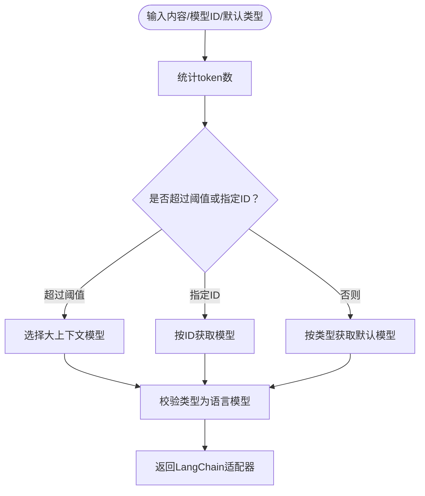
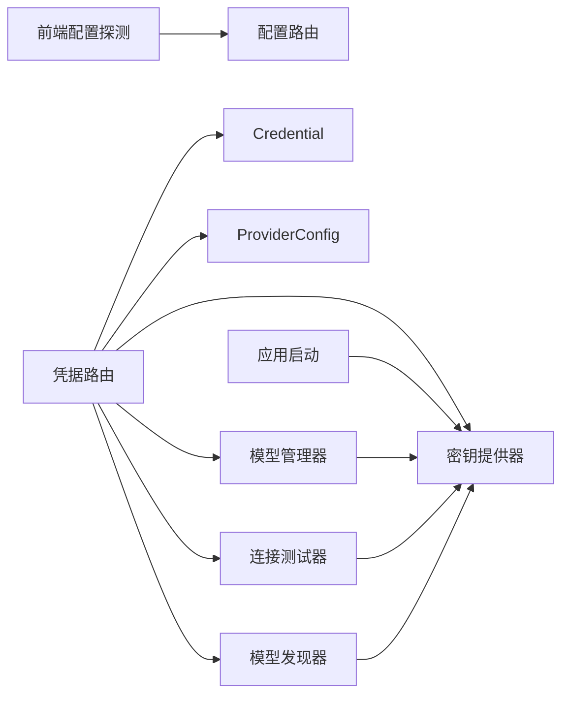

# AI提供商配置

<cite>
**本文引用的文件**
- [open_notebook/ai/key_provider.py](file://open_notebook/ai/key_provider.py)
- [open_notebook/ai/model_discovery.py](file://open_notebook/ai/model_discovery.py)
- [open_notebook/ai/connection_tester.py](file://open_notebook/ai/connection_tester.py)
- [open_notebook/ai/provision.py](file://open_notebook/ai/provision.py)
- [open_notebook/ai/models.py](file://open_notebook/ai/models.py)
- [open_notebook/domain/credential.py](file://open_notebook/domain/credential.py)
- [open_notebook/domain/provider_config.py](file://open_notebook/domain/provider_config.py)
- [api/routers/credentials.py](file://api/routers/credentials.py)
- [api/routers/config.py](file://api/routers/config.py)
- [api/main.py](file://api/main.py)
- [docs/5-CONFIGURATION/ai-providers.md](file://docs/5-CONFIGURATION/ai-providers.md)
- [docs/4-AI-PROVIDERS/index.md](file://docs/4-AI-PROVIDERS/index.md)
- [frontend/src/lib/config.ts](file://frontend/src/lib/config.ts)
</cite>

## 更新摘要
**所做更改**
- 新增AI提供商自动初始化功能章节，介绍init_all_providers_from_env()函数
- 更新密钥提供器章节，包含新的环境变量到数据库初始化功能
- 新增自动配置最佳实践和部署建议
- 更新故障排除指南，包含自动初始化相关问题

## 目录
1. [简介](#简介)
2. [项目结构](#项目结构)
3. [核心组件](#核心组件)
4. [架构总览](#架构总览)
5. [详细组件分析](#详细组件分析)
6. [依赖关系分析](#依赖关系分析)
7. [性能考量](#性能考量)
8. [故障排除指南](#故障排除指南)
9. [结论](#结论)
10. [附录](#附录)

## 简介
本指南面向需要在系统中配置与使用多种AI提供商（OpenAI、Anthropic、Google Gemini、Groq、Ollama、Azure OpenAI、OpenRouter、Mistral、DeepSeek、xAI、ElevenLabs、Voyage等）的用户与开发者，覆盖从API密钥设置、连接测试、模型发现到多提供商配置与切换的完整流程。**新增**了AI提供商自动初始化功能，允许通过环境变量自动配置DeepSeek、Qwen、Moonshot等提供商，简化了部署流程。

## 项目结构
围绕AI提供商配置的关键模块分布于后端Python服务与前端Next.js应用之间，通过FastAPI路由暴露管理能力，数据库持久化凭证与模型元数据，前端负责用户交互与运行时配置探测。**新增**了自动初始化功能，在应用启动时自动检测并配置环境变量中的提供商。

```mermaid
graph TB
subgraph "前端"
FE_Config["前端配置探测<br/>frontend/src/lib/config.ts"]
end
subgraph "后端API"
API_Router["凭据路由<br/>api/routers/credentials.py"]
API_Config["配置路由<br/>api/routers/config.py"]
API_Main["应用启动<br/>api/main.py"]
end
subgraph "AI配置层"
KeyProv["密钥提供器<br/>open_notebook/ai/key_provider.py"]
ConnTest["连接测试器<br/>open_notebook/ai/connection_tester.py"]
ModelDisc["模型发现器<br/>open_notebook/ai/model_discovery.py"]
Provision["模型供应器<br/>open_notebook/ai/provision.py"]
ModelMgr["模型管理器<br/>open_notebook/ai/models.py"]
End
subgraph "领域模型"
Cred["Credential 凭证<br/>open_notebook/domain/credential.py"]
ProvCfg["ProviderConfig 多配置<br/>open_notebook/domain/provider_config.py"]
end
FE_Config --> API_Config
API_Router --> KeyProv
API_Router --> ConnTest
API_Router --> ModelDisc
API_Router --> ModelMgr
API_Router --> Cred
API_Router --> ProvCfg
API_Main --> KeyProv
ModelMgr --> KeyProv
ConnTest --> KeyProv
ModelDisc --> KeyProv
```

**图表来源**
- [frontend/src/lib/config.ts](file://frontend/src/lib/config.ts#L1-L149)
- [api/routers/credentials.py](file://api/routers/credentials.py#L1-L387)
- [api/routers/config.py](file://api/routers/config.py#L1-L161)
- [api/main.py](file://api/main.py#L90-L99)
- [open_notebook/ai/key_provider.py](file://open_notebook/ai/key_provider.py#L425-L450)

**章节来源**
- [frontend/src/lib/config.ts](file://frontend/src/lib/config.ts#L1-L149)
- [api/routers/credentials.py](file://api/routers/credentials.py#L1-L387)
- [api/routers/config.py](file://api/routers/config.py#L1-L161)
- [api/main.py](file://api/main.py#L90-L99)

## 核心组件
- 密钥提供器：统一从数据库凭证或环境变量读取API密钥与基础URL，支持简单与复杂提供商（如Azure、Vertex、OpenAI-Compatible）的多字段配置注入。**新增**了环境变量到数据库的自动初始化功能。
- 连接测试器：针对各提供商进行最小化连通性验证，支持动态模型检测与错误消息归一化。
- 模型发现器：按提供商拉取可用模型列表，自动分类语言/嵌入/语音模型类型，并批量注册到数据库。
- 模型供应器：根据内容长度与显式指定模型ID选择最优模型实例，确保类型正确并返回LangChain适配器。
- 模型管理器：从数据库加载默认模型配置，按需合并凭证配置，创建具体模型实例。
- 领域模型：Credential单条凭证记录；ProviderConfig多配置集合（历史遗留，现以Credential为主）。

**章节来源**
- [open_notebook/ai/key_provider.py](file://open_notebook/ai/key_provider.py#L1-L298)
- [open_notebook/ai/connection_tester.py](file://open_notebook/ai/connection_tester.py#L1-L439)
- [open_notebook/ai/model_discovery.py](file://open_notebook/ai/model_discovery.py#L1-L757)
- [open_notebook/ai/provision.py](file://open_notebook/ai/provision.py#L1-L61)
- [open_notebook/ai/models.py](file://open_notebook/ai/models.py#L1-L267)
- [open_notebook/domain/credential.py](file://open_notebook/domain/credential.py#L1-L200)
- [open_notebook/domain/provider_config.py](file://open_notebook/domain/provider_config.py#L1-L445)

## 架构总览
下图展示从用户在设置页面添加凭据，到测试连接、发现与注册模型，再到运行时按需供应模型的全链路。**新增**了应用启动时的自动初始化流程。



**图表来源**
- [api/routers/credentials.py](file://api/routers/credentials.py#L313-L358)
- [open_notebook/ai/connection_tester.py](file://open_notebook/ai/connection_tester.py#L170-L300)
- [open_notebook/ai/model_discovery.py](file://open_notebook/ai/model_discovery.py#L608-L696)
- [open_notebook/ai/models.py](file://open_notebook/ai/models.py#L97-L176)
- [open_notebook/ai/key_provider.py](file://open_notebook/ai/key_provider.py#L236-L271)
- [api/main.py](file://api/main.py#L90-L99)

## 详细组件分析

### 密钥提供器（Key Provider）
- 支持的提供商映射：OpenAI、Anthropic、Google、Groq、Mistral、DeepSeek、xAI、OpenRouter、Voyage、ElevenLabs、Ollama（URL型）。
- **新增**的自动初始化配置：init_all_providers_from_env()函数支持DeepSeek、Qwen、Moonshot等提供商的环境变量自动配置。
- 复杂提供商配置：
  - Azure：注入多个端点与版本参数。
  - Vertex：注入项目、位置与服务账号路径。
  - OpenAI-Compatible：注入通用API Key与Base URL。
- 提供"按提供商"与"全部"两种注入方式，优先从数据库Credential读取，回退至环境变量。



**图表来源**
- [open_notebook/ai/key_provider.py](file://open_notebook/ai/key_provider.py#L236-L271)
- [open_notebook/ai/key_provider.py](file://open_notebook/ai/key_provider.py#L105-L208)
- [open_notebook/ai/key_provider.py](file://open_notebook/ai/key_provider.py#L211-L233)

**章节来源**
- [open_notebook/ai/key_provider.py](file://open_notebook/ai/key_provider.py#L29-L65)
- [open_notebook/ai/key_provider.py](file://open_notebook/ai/key_provider.py#L105-L208)
- [open_notebook/ai/key_provider.py](file://open_notebook/ai/key_provider.py#L211-L233)
- [open_notebook/ai/key_provider.py](file://open_notebook/ai/key_provider.py#L236-L271)
- [open_notebook/ai/key_provider.py](file://open_notebook/ai/key_provider.py#L306-L338)
- [open_notebook/ai/key_provider.py](file://open_notebook/ai/key_provider.py#L425-L450)

### 自动初始化功能（Environment Variable Auto-Initialization）

**新增**系统支持通过环境变量自动配置AI提供商，无需手动在设置界面添加凭证。该功能在应用启动时自动执行。

#### 支持的提供商
- DeepSeek：DEEPSEEK_API_KEY、DEEPSEEK_BASE_URL
- Qwen（通义千问）：DASHSCOPE_API_KEY、DASHSCOPE_BASE_URL  
- Moonshot：MOONSHOT_API_KEY、MOONSHOT_BASE_URL
- OpenAI：OPENAI_API_KEY、OPENAI_BASE_URL
- Anthropic：ANTHROPIC_API_KEY、ANTHROPIC_BASE_URL

#### 工作原理
1. 应用启动时调用init_all_providers_from_env()
2. 遍历支持的提供商配置
3. 检查数据库中是否已存在该提供商的凭证
4. 如果不存在，则检查环境变量中对应的API密钥
5. 自动创建Credential和ProviderConfig记录
6. 将提供商标记为"自动配置"



**图表来源**
- [open_notebook/ai/key_provider.py](file://open_notebook/ai/key_provider.py#L425-L450)
- [open_notebook/ai/key_provider.py](file://open_notebook/ai/key_provider.py#L341-L423)

**章节来源**
- [open_notebook/ai/key_provider.py](file://open_notebook/ai/key_provider.py#L306-L338)
- [open_notebook/ai/key_provider.py](file://open_notebook/ai/key_provider.py#L341-L423)
- [open_notebook/ai/key_provider.py](file://open_notebook/ai/key_provider.py#L425-L450)
- [api/main.py](file://api/main.py#L90-L99)

### 连接测试器（Connection Tester）
- 测试策略：
  - 云提供商：使用最小化测试模型调用一次推理/嵌入/TTS，验证密钥有效性。
  - Azure：列出模型接口，避免部署名差异导致的调用失败。
  - Ollama：访问本地标签接口，确认服务可达与模型存在。
  - OpenAI-Compatible：访问/models接口，确认兼容端点可用。
- 错误消息归一化：将HTTP状态码、超时、网络错误等转换为用户可理解的消息。



**图表来源**
- [open_notebook/ai/connection_tester.py](file://open_notebook/ai/connection_tester.py#L170-L300)
- [open_notebook/ai/connection_tester.py](file://open_notebook/ai/connection_tester.py#L40-L95)
- [open_notebook/ai/connection_tester.py](file://open_notebook/ai/connection_tester.py#L97-L130)
- [open_notebook/ai/connection_tester.py](file://open_notebook/ai/connection_tester.py#L132-L169)

**章节来源**
- [open_notebook/ai/connection_tester.py](file://open_notebook/ai/connection_tester.py#L21-L37)
- [open_notebook/ai/connection_tester.py](file://open_notebook/ai/connection_tester.py#L170-L300)
- [open_notebook/ai/connection_tester.py](file://open_notebook/ai/connection_tester.py#L367-L439)

### 模型发现器（Model Discovery）
- 支持提供商：OpenAI、Anthropic、Google Gemini、Groq、Mistral、DeepSeek、xAI、OpenRouter、Voyage、ElevenLabs、Ollama、OpenAI-Compatible（部分需要凭证）。
- 自动分类：基于命名模式与能力字段将模型归类为语言/嵌入/语音模型。
- 并行同步：一次性为所有支持的提供商执行发现与注册，避免重复查询。



**图表来源**
- [open_notebook/ai/model_discovery.py](file://open_notebook/ai/model_discovery.py#L589-L605)
- [open_notebook/ai/model_discovery.py](file://open_notebook/ai/model_discovery.py#L608-L630)
- [open_notebook/ai/model_discovery.py](file://open_notebook/ai/model_discovery.py#L632-L696)

**章节来源**
- [open_notebook/ai/model_discovery.py](file://open_notebook/ai/model_discovery.py#L135-L166)
- [open_notebook/ai/model_discovery.py](file://open_notebook/ai/model_discovery.py#L589-L605)
- [open_notebook/ai/model_discovery.py](file://open_notebook/ai/model_discovery.py#L608-L696)

### 模型供应器与管理器（Provision & Model Manager）
- 供应器：根据输入内容token数与显式model_id选择大上下文模型或默认模型，确保返回LangChain适配器。
- 管理器：从数据库加载默认模型配置，按需合并凭证配置，创建具体模型实例；支持按类型获取默认模型。



**图表来源**
- [open_notebook/ai/provision.py](file://open_notebook/ai/provision.py#L9-L61)
- [open_notebook/ai/models.py](file://open_notebook/ai/models.py#L97-L176)

**章节来源**
- [open_notebook/ai/provision.py](file://open_notebook/ai/provision.py#L9-L61)
- [open_notebook/ai/models.py](file://open_notebook/ai/models.py#L97-L176)

### 前端配置与运行时探测
- 前端通过运行时端点与构建期环境变量确定API地址，优先使用相对路径以避免CORS与端口映射问题。
- 后端配置端点返回版本信息与数据库健康状态，便于前端显示与诊断。

**章节来源**
- [frontend/src/lib/config.ts](file://frontend/src/lib/config.ts#L22-L54)
- [api/routers/config.py](file://api/routers/config.py#L123-L161)

## 依赖关系分析
- 路由层（api/routers/credentials.py）协调业务逻辑：凭据CRUD、连接测试、模型发现与注册。
- 领域模型（domain/credential.py、domain/provider_config.py）负责凭证存储与多配置管理。
- AI配置层（key_provider、connection_tester、model_discovery、provision、models）实现配置注入、连通性验证与模型供应。
- 前端（frontend/src/lib/config.ts）负责运行时API地址探测与UI展示。
- **新增**应用启动层（api/main.py）负责调用自动初始化功能。



**图表来源**
- [api/routers/credentials.py](file://api/routers/credentials.py#L1-L387)
- [open_notebook/domain/credential.py](file://open_notebook/domain/credential.py#L1-L200)
- [open_notebook/domain/provider_config.py](file://open_notebook/domain/provider_config.py#L1-L445)
- [open_notebook/ai/key_provider.py](file://open_notebook/ai/key_provider.py#L1-L298)
- [open_notebook/ai/connection_tester.py](file://open_notebook/ai/connection_tester.py#L1-L439)
- [open_notebook/ai/model_discovery.py](file://open_notebook/ai/model_discovery.py#L1-L757)
- [open_notebook/ai/models.py](file://open_notebook/ai/models.py#L1-L267)
- [api/main.py](file://api/main.py#L90-L99)

**章节来源**
- [api/routers/credentials.py](file://api/routers/credentials.py#L1-L387)
- [open_notebook/domain/credential.py](file://open_notebook/domain/credential.py#L1-L200)
- [open_notebook/domain/provider_config.py](file://open_notebook/domain/provider_config.py#L1-L445)
- [api/main.py](file://api/main.py#L90-L99)

## 性能考量
- 模型发现并行化：并发拉取多个提供商模型，减少等待时间。
- 缓存与去重：批量查询现有模型，使用集合进行O(1)查找，避免N+1写入。
- 运行时配置探测：前端优先使用相对路径代理，降低跨域与端口问题带来的额外延迟。
- 大上下文模型选择：当输入token数超过阈值时自动切换，避免超上下文限制导致的失败重试。
- **新增**自动初始化性能：仅在应用启动时执行一次，检查数据库中现有凭证，避免重复创建。

**章节来源**
- [open_notebook/ai/model_discovery.py](file://open_notebook/ai/model_discovery.py#L708-L724)
- [open_notebook/ai/model_discovery.py](file://open_notebook/ai/model_discovery.py#L656-L696)
- [frontend/src/lib/config.ts](file://frontend/src/lib/config.ts#L22-L54)
- [open_notebook/ai/provision.py](file://open_notebook/ai/provision.py#L22-L33)
- [open_notebook/ai/key_provider.py](file://open_notebook/ai/key_provider.py#L425-L450)

## 故障排除指南
- API密钥无效
  - 现象：连接测试返回"无效API密钥"。
  - 排查：确认密钥前缀与提供商要求一致，重新测试连接。
- 权限不足
  - 现象：返回"API密钥缺少所需权限"。
  - 排查：检查账户配额、模型白名单与API权限范围。
- 速率限制
  - 现象：返回"速率限制"但连接成功。
  - 排查：降低请求频率或升级账户额度。
- 网络/超时
  - 现象：连接超时或网络错误。
  - 排查：检查网络连通性、代理与防火墙设置。
- 模型不可用
  - 现象：测试通过但提示"未找到模型"。
  - 排查：重新发现并注册模型，或更换测试模型。
- Ollama未运行
  - 现象：提示"Ollama未运行"。
  - 排查：确认Ollama服务已启动且端口可达，模型已下载。
- Azure端点错误
  - 现象：返回端点状态码。
  - 排查：核对Endpoint、API版本与密钥，确保部署存在。
- **新增**自动初始化失败
  - 现象：应用启动时出现"Provider auto-initialization failed"警告。
  - 排查：检查OPEN_NOTEBOOK_ENCRYPTION_KEY是否正确设置，确认环境变量格式正确，查看日志获取详细错误信息。

**章节来源**
- [open_notebook/ai/connection_tester.py](file://open_notebook/ai/connection_tester.py#L275-L299)
- [open_notebook/ai/connection_tester.py](file://open_notebook/ai/connection_tester.py#L89-L95)
- [open_notebook/ai/connection_tester.py](file://open_notebook/ai/connection_tester.py#L124-L130)
- [open_notebook/ai/connection_tester.py](file://open_notebook/ai/connection_tester.py#L163-L169)
- [api/main.py](file://api/main.py#L97-L98)

## 结论
通过凭证驱动的配置体系、完善的连接测试与模型发现机制，系统能够灵活支持多家AI提供商，并在本地与云端之间自由切换。**新增**的自动初始化功能进一步简化了部署流程，允许通过环境变量自动配置DeepSeek、Qwen、Moonshot等提供商。建议优先采用数据库凭证管理，配合定期模型发现与测试，确保稳定高效的AI服务能力。

## 附录

### 不同提供商的配置要点与最佳实践
- OpenAI
  - 设置API Key；推荐使用gpt-4o或gpt-4o-mini；定期测试连接与发现模型。
- Anthropic（Claude）
  - 设置API Key；Claude-3.5系列适合长文本与推理；注意"过载"提示。
- Google Gemini
  - 设置API Key；gemini-2.0-flash-exp适合最新体验；注意配额限制。
- Groq
  - 设置API Key；适合批处理与快速推理；模型选择有限。
- Ollama
  - 设置Base URL；确保Ollama服务运行与模型已下载；按硬件选择合适模型。
- Azure OpenAI
  - 设置Endpoint、API Key与API版本；按服务需求配置LLM/Embedding端点。
- OpenRouter
  - 设置API Key；统一计费与模型比较；注意模型ID拼写。
- **新增**DeepSeek、Qwen、Moonshot
  - 通过环境变量自动配置：DEEPSEEK_API_KEY、DASHSCOPE_API_KEY、MOONSHOT_API_KEY
  - 支持自定义Base URL：DEEPSEEK_BASE_URL、DASHSCOPE_BASE_URL、MOONSHOT_BASE_URL
  - 应用启动时自动初始化，无需手动添加凭证

**章节来源**
- [docs/5-CONFIGURATION/ai-providers.md](file://docs/5-CONFIGURATION/ai-providers.md#L25-L468)
- [docs/4-AI-PROVIDERS/index.md](file://docs/4-AI-PROVIDERS/index.md#L9-L200)
- [open_notebook/ai/key_provider.py](file://open_notebook/ai/key_provider.py#L306-L338)

### 多提供商配置与切换
- 在设置页面为每个提供商创建独立凭证，支持多套配置并存。
- 通过模型管理器按类型获取默认模型，或在运行时传入显式model_id进行切换。
- 复杂提供商（Azure、Vertex、OpenAI-Compatible）通过凭证字段注入多参数，无需手动维护环境变量。
- **新增**自动初始化功能：应用启动时自动检测环境变量并创建凭证，简化部署流程。

**章节来源**
- [open_notebook/ai/models.py](file://open_notebook/ai/models.py#L101-L176)
- [open_notebook/ai/key_provider.py](file://open_notebook/ai/key_provider.py#L166-L208)
- [open_notebook/ai/key_provider.py](file://open_notebook/ai/key_provider.py#L211-L233)
- [open_notebook/ai/key_provider.py](file://open_notebook/ai/key_provider.py#L425-L450)

### 自动配置最佳实践
- **生产环境部署**：建议使用设置界面手动添加凭证，确保安全性和可追溯性
- **开发环境部署**：可以使用环境变量自动初始化功能，快速启动测试环境
- **混合部署**：部分提供商使用自动初始化，部分使用手动配置
- **迁移策略**：从旧版本环境变量迁移到新凭证系统时，使用设置界面的迁移工具

**章节来源**
- [open_notebook/ai/key_provider.py](file://open_notebook/ai/key_provider.py#L306-L338)
- [open_notebook/ai/key_provider.py](file://open_notebook/ai/key_provider.py#L425-L450)
- [docs/5-CONFIGURATION/ai-providers.md](file://docs/5-CONFIGURATION/ai-providers.md#L450-L468)