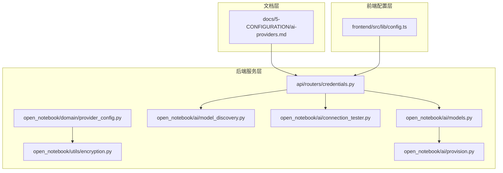
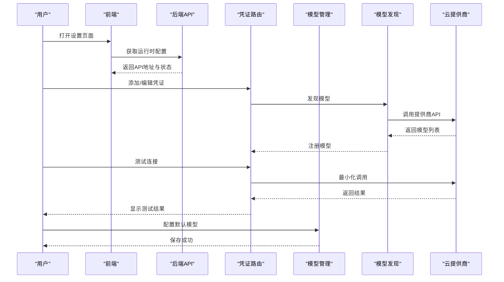
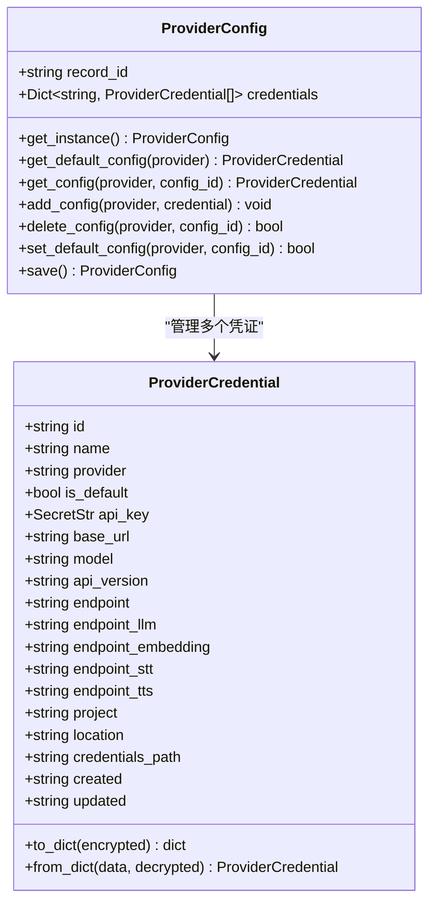
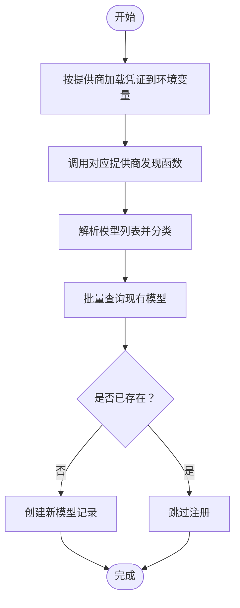
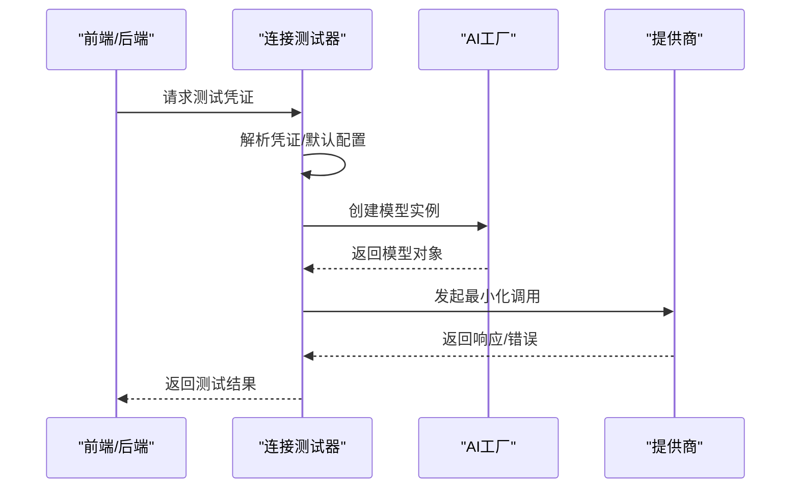
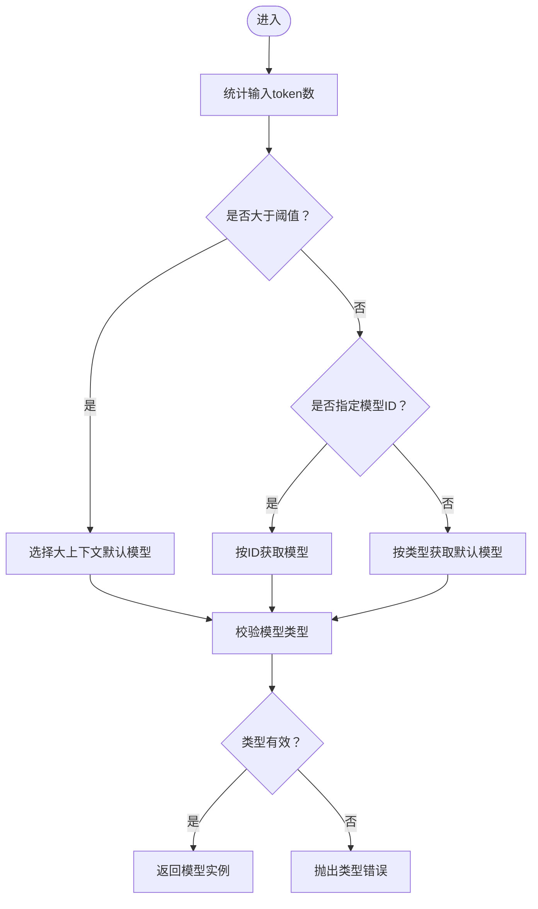
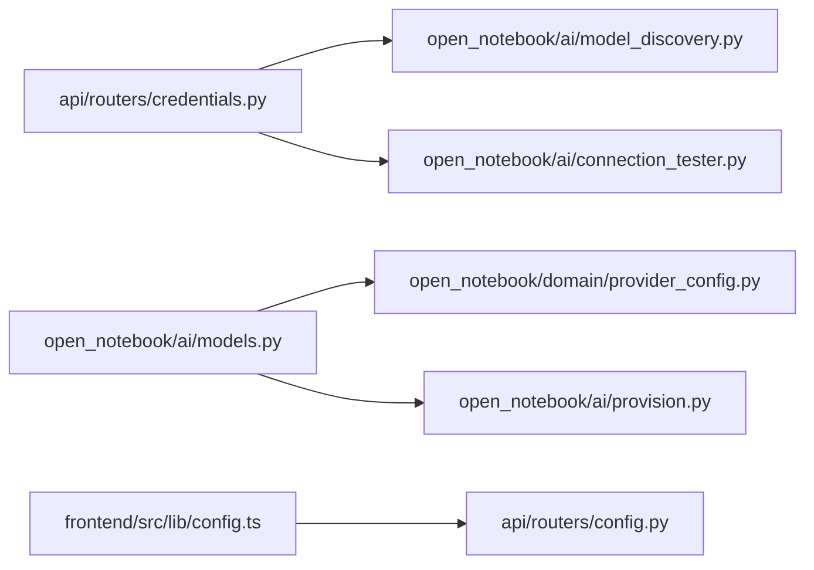

# 云提供商配置

<cite>
**本文档引用的文件**
- [docs/5-CONFIGURATION/ai-providers.md](file://docs/5-CONFIGURATION/ai-providers.md)
- [open_notebook/ai/provision.py](file://open_notebook/ai/provision.py)
- [open_notebook/domain/provider_config.py](file://open_notebook/domain/provider_config.py)
- [open_notebook/ai/connection_tester.py](file://open_notebook/ai/connection_tester.py)
- [open_notebook/ai/model_discovery.py](file://open_notebook/ai/model_discovery.py)
- [open_notebook/ai/models.py](file://open_notebook/ai/models.py)
- [open_notebook/utils/encryption.py](file://open_notebook/utils/encryption.py)
- [api/routers/credentials.py](file://api/routers/credentials.py)
- [api/models.py](file://api/models.py)
- [frontend/src/lib/config.ts](file://frontend/src/lib/config.ts)
</cite>

## 目录
1. [简介](#简介)
2. [项目结构](#项目结构)
3. [核心组件](#核心组件)
4. [架构总览](#架构总览)
5. [详细组件分析](#详细组件分析)
6. [依赖关系分析](#依赖关系分析)
7. [性能考量](#性能考量)
8. [故障排除指南](#故障排除指南)
9. [结论](#结论)
10. [附录](#附录)

## 简介
本指南面向需要在系统中配置和使用多家云AI提供商（OpenAI、Anthropic Claude、Google Gemini、Groq、OpenRouter等）的用户与运维人员。内容覆盖从API密钥获取、配置参数设置、连接测试，到模型选择建议、成本估算与性能对比，并提供提供商切换、多提供商并行使用及最佳实践指导。

## 项目结构
围绕“云提供商配置”的关键模块包括：
- 文档层：提供完整的配置步骤与建议
- 后端服务层：凭证管理、模型发现与注册、连接测试、默认模型选择
- 前端配置层：运行时配置解析与API地址优先级

**图表来源**
- [docs/5-CONFIGURATION/ai-providers.md](file://docs/5-CONFIGURATION/ai-providers.md#L1-L468)
- [api/routers/credentials.py](file://api/routers/credentials.py#L1-L387)
- [open_notebook/ai/models.py](file://open_notebook/ai/models.py#L1-L267)
- [open_notebook/ai/model_discovery.py](file://open_notebook/ai/model_discovery.py#L1-L757)
- [open_notebook/ai/connection_tester.py](file://open_notebook/ai/connection_tester.py#L1-L439)
- [open_notebook/domain/provider_config.py](file://open_notebook/domain/provider_config.py#L1-L445)
- [open_notebook/utils/encryption.py](file://open_notebook/utils/encryption.py#L1-L199)
- [open_notebook/ai/provision.py](file://open_notebook/ai/provision.py#L1-L61)
- [frontend/src/lib/config.ts](file://frontend/src/lib/config.ts#L1-L149)

**章节来源**
- [docs/5-CONFIGURATION/ai-providers.md](file://docs/5-CONFIGURATION/ai-providers.md#L1-L468)
- [api/routers/credentials.py](file://api/routers/credentials.py#L1-L387)
- [open_notebook/ai/models.py](file://open_notebook/ai/models.py#L1-L267)
- [open_notebook/ai/model_discovery.py](file://open_notebook/ai/model_discovery.py#L1-L757)
- [open_notebook/ai/connection_tester.py](file://open_notebook/ai/connection_tester.py#L1-L439)
- [open_notebook/domain/provider_config.py](file://open_notebook/domain/provider_config.py#L1-L445)
- [open_notebook/utils/encryption.py](file://open_notebook/utils/encryption.py#L1-L199)
- [open_notebook/ai/provision.py](file://open_notebook/ai/provision.py#L1-L61)
- [frontend/src/lib/config.ts](file://frontend/src/lib/config.ts#L1-L149)

## 核心组件
- 凭证与配置管理：通过数据库记录存储加密后的API密钥与端点配置，支持多提供商、多凭证并存，且可设置默认凭证。
- 模型发现与注册：自动从各提供商API拉取可用模型清单，按类型分类并批量注册为系统内可选模型。
- 连接测试：对指定凭证或默认凭证进行最小化调用测试，验证连通性与权限。
- 默认模型选择：根据上下文大小、显式指定模型ID或默认类型，动态选择合适的模型实例。
- 加密存储：基于对称加密的密钥存储与解密，确保敏感信息安全。

**章节来源**
- [open_notebook/domain/provider_config.py](file://open_notebook/domain/provider_config.py#L22-L445)
- [open_notebook/ai/model_discovery.py](file://open_notebook/ai/model_discovery.py#L1-L757)
- [open_notebook/ai/connection_tester.py](file://open_notebook/ai/connection_tester.py#L1-L439)
- [open_notebook/ai/provision.py](file://open_notebook/ai/provision.py#L1-L61)
- [open_notebook/utils/encryption.py](file://open_notebook/utils/encryption.py#L1-L199)

## 架构总览
系统采用“凭证驱动 + 模型注册 + 动态选择”的架构模式。前端通过运行时配置确定API地址；后端通过凭证路由管理API密钥与端点；模型发现模块负责拉取并注册可用模型；默认模型选择模块根据上下文与配置返回最优模型实例。

**图表来源**
- [frontend/src/lib/config.ts](file://frontend/src/lib/config.ts#L59-L140)
- [api/routers/credentials.py](file://api/routers/credentials.py#L313-L387)
- [open_notebook/ai/model_discovery.py](file://open_notebook/ai/model_discovery.py#L608-L725)
- [open_notebook/ai/connection_tester.py](file://open_notebook/ai/connection_tester.py#L170-L300)
- [open_notebook/ai/models.py](file://open_notebook/ai/models.py#L220-L264)

## 详细组件分析

### 凭证与配置管理（ProviderConfig）
- 支持多提供商、多凭证并存，每个凭证包含名称、提供商、是否默认、API密钥、基础URL、端点、项目/区域/凭据路径等字段。
- 数据库存储时对API密钥进行加密，读取时自动解密；若未配置加密密钥则以明文警告方式处理。
- 提供默认凭证查询、新增、删除、设置默认等功能，保证配置变更的原子性与一致性。

**图表来源**
- [open_notebook/domain/provider_config.py](file://open_notebook/domain/provider_config.py#L22-L445)

**章节来源**
- [open_notebook/domain/provider_config.py](file://open_notebook/domain/provider_config.py#L175-L445)
- [open_notebook/utils/encryption.py](file://open_notebook/utils/encryption.py#L128-L199)

### 模型发现与注册（ModelDiscovery）
- 针对不同提供商实现专用发现函数，如OpenAI、Anthropic、Google Gemini、Groq、Mistral、DeepSeek、xAI、OpenRouter、ElevenLabs等。
- 对模型进行类型分类（语言模型、嵌入、语音识别、文本转语音），并批量注册到数据库。
- 支持同步所有提供商模型，避免重复注册，提升效率。

**图表来源**
- [open_notebook/ai/model_discovery.py](file://open_notebook/ai/model_discovery.py#L608-L725)

**章节来源**
- [open_notebook/ai/model_discovery.py](file://open_notebook/ai/model_discovery.py#L1-L757)

### 连接测试（ConnectionTester）
- 针对不同提供商执行最小化调用测试，包括语言模型、嵌入、文本转语音等类型。
- 对常见错误进行归一化提示（如无效密钥、速率限制、网络超时、模型不存在等）。
- 特殊提供商（如Azure、Ollama、OpenAI兼容）采用专门的探测逻辑。

**图表来源**
- [open_notebook/ai/connection_tester.py](file://open_notebook/ai/connection_tester.py#L170-L300)

**章节来源**
- [open_notebook/ai/connection_tester.py](file://open_notebook/ai/connection_tester.py#L1-L439)

### 默认模型选择（ModelManager）
- 根据内容长度（超过阈值时选择大上下文模型）、显式指定模型ID或默认类型，动态选择最合适的模型实例。
- 在模型类型不匹配或未配置时抛出明确错误，便于用户定位问题。

**图表来源**
- [open_notebook/ai/provision.py](file://open_notebook/ai/provision.py#L9-L61)

**章节来源**
- [open_notebook/ai/provision.py](file://open_notebook/ai/provision.py#L1-L61)
- [open_notebook/ai/models.py](file://open_notebook/ai/models.py#L97-L267)

### 前端运行时配置（Frontend Config）
- 优先从后端配置端点获取API地址，其次回退到构建时环境变量，最终使用相对路径重写策略。
- 该机制确保同一镜像可在不同环境中工作，避免硬编码导致的部署复杂度。

**章节来源**
- [frontend/src/lib/config.ts](file://frontend/src/lib/config.ts#L1-L149)

## 依赖关系分析
- 凭证路由（credentials.py）依赖模型发现（model_discovery.py）与连接测试（connection_tester.py）实现“发现模型”和“测试连接”功能。
- 模型管理（models.py）依赖凭证（domain/provider_config.py）与密钥提供（ai/key_provider.py）以构建期望的模型实例。
- 前端配置（frontend/config.ts）依赖后端配置端点（api/routers/config.py）以决定API访问地址。

**图表来源**
- [api/routers/credentials.py](file://api/routers/credentials.py#L1-L387)
- [open_notebook/ai/model_discovery.py](file://open_notebook/ai/model_discovery.py#L1-L757)
- [open_notebook/ai/connection_tester.py](file://open_notebook/ai/connection_tester.py#L1-L439)
- [open_notebook/ai/models.py](file://open_notebook/ai/models.py#L1-L267)
- [open_notebook/domain/provider_config.py](file://open_notebook/domain/provider_config.py#L1-L445)
- [open_notebook/ai/provision.py](file://open_notebook/ai/provision.py#L1-L61)
- [frontend/src/lib/config.ts](file://frontend/src/lib/config.ts#L1-L149)

**章节来源**
- [api/routers/credentials.py](file://api/routers/credentials.py#L1-L387)
- [open_notebook/ai/models.py](file://open_notebook/ai/models.py#L1-L267)
- [open_notebook/ai/model_discovery.py](file://open_notebook/ai/model_discovery.py#L1-L757)
- [open_notebook/ai/connection_tester.py](file://open_notebook/ai/connection_tester.py#L1-L439)
- [open_notebook/domain/provider_config.py](file://open_notebook/domain/provider_config.py#L1-L445)
- [open_notebook/ai/provision.py](file://open_notebook/ai/provision.py#L1-L61)
- [frontend/src/lib/config.ts](file://frontend/src/lib/config.ts#L1-L149)

## 性能考量
- 大上下文模型选择：当输入token数超过阈值时自动切换至大上下文模型，避免截断影响质量。
- 并行模型发现：系统支持并发发现多个提供商的模型，缩短初始化时间。
- 缓存与延迟：模型实例由底层工厂缓存，减少重复创建开销；凭证与默认模型每次从数据库读取，确保最新配置生效。
- 网络与超时：连接测试与模型发现均设置了合理的超时时间，避免阻塞。

[本节为通用性能讨论，无需特定文件引用]

## 故障排除指南
- “无效API密钥”：检查密钥前缀与提供商要求一致，并在设置中重新测试连接。
- “速率限制”：提供商限流时会返回相应状态，需等待或升级账户。
- “模型不可用”：尝试切换到其他模型或重新发现模型；对于特定提供商（如Azure）需确认部署名称正确。
- “连接失败/超时”：检查网络连通性、代理设置与端点URL。
- “数据库离线”：查看后端健康检查状态，确认数据库可达。

**章节来源**
- [open_notebook/ai/connection_tester.py](file://open_notebook/ai/connection_tester.py#L275-L300)
- [api/routers/config.py](file://api/routers/config.py#L102-L121)

## 结论
通过统一的凭证管理、自动化的模型发现与注册、完善的连接测试与默认模型选择机制，系统为OpenAI、Anthropic、Google Gemini、Groq、OpenRouter等主流云提供商提供了标准化的配置流程。结合多提供商并行使用与加密存储策略，既能满足不同场景下的质量与成本需求，又能保障安全性与可维护性。

[本节为总结性内容，无需特定文件引用]

## 附录

### 各提供商配置要点与建议
- OpenAI
  - 成本：约$0.03–0.15/1K tokens
  - 推荐模型：gpt-4o（平衡）、gpt-4o-mini（测试/便宜）、o1/o1-mini（复杂推理）
  - 配置步骤：在设置中添加凭证，测试连接，发现并注册模型
- Anthropic（Claude）
  - 成本：约$0.80–3.00/1M tokens（长上下文优势）
  - 推荐模型：claude-sonnet-4-5（最新最佳）、claude-3-5-haiku（便宜）、claude-opus-4-5（最强）
- Google Gemini
  - 成本：约$0.075–0.30/1K tokens
  - 推荐模型：gemini-2.0-flash-exp（最新最快）、gemini-2.0-flash（稳定）、gemini-1.5-pro（长上下文）
- Groq
  - 成本：约$0.05/1M tokens（极快但模型有限）
  - 推荐模型：llama-3.3-70b-versatile（质量）、gemma2-9b-it（超快）
- OpenRouter
  - 成本：随模型变化（$0.05–15/1M）
  - 推荐模型：anthropic/claude-sonnet-4.5、google/gemini-2.0-flash-exp、meta-llama/llama-3.3-70b-instruct

**章节来源**
- [docs/5-CONFIGURATION/ai-providers.md](file://docs/5-CONFIGURATION/ai-providers.md#L25-L250)

### 多提供商并行使用与切换
- 可同时维护多个提供商凭证，按项目或团队成员分别配置。
- 通过设置默认模型与显式指定模型ID实现灵活切换。
- 使用“发现模型”和“注册模型”功能快速启用新模型。

**章节来源**
- [api/routers/credentials.py](file://api/routers/credentials.py#L319-L358)
- [open_notebook/ai/models.py](file://open_notebook/ai/models.py#L220-L264)

### 安全与合规建议
- 必须设置加密密钥以启用数据库中的API密钥加密存储。
- 生产环境建议使用Docker secrets文件方式注入密钥。
- 定期轮换API密钥并清理不再使用的凭证。

**章节来源**
- [open_notebook/utils/encryption.py](file://open_notebook/utils/encryption.py#L29-L101)
- [open_notebook/domain/provider_config.py](file://open_notebook/domain/provider_config.py#L1-L445)