# 企业级提供商配置

<cite>
**本文档引用的文件**
- [ai-providers.md](file://docs/5-CONFIGURATION/ai-providers.md)
- [security.md](file://docs/5-CONFIGURATION/security.md)
- [reverse-proxy.md](file://docs/5-CONFIGURATION/reverse-proxy.md)
- [environment-reference.md](file://docs/5-CONFIGURATION/environment-reference.md)
- [advanced.md](file://docs/5-CONFIGURATION/advanced.md)
- [provider_config.py](file://open_notebook/domain/provider_config.py)
- [encryption.py](file://open_notebook/utils/encryption.py)
- [credentials.py](file://api/routers/credentials.py)
</cite>

## 目录
1. [简介](#简介)
2. [项目结构](#项目结构)
3. [核心组件](#核心组件)
4. [架构概览](#架构概览)
5. [详细组件分析](#详细组件分析)
6. [依赖关系分析](#依赖关系分析)
7. [性能考虑](#性能考虑)
8. [故障排除指南](#故障排除指南)
9. [结论](#结论)
10. [附录](#附录)

## 简介

本指南专注于企业级AI提供商配置，特别是Azure OpenAI的完整配置流程。文档涵盖了从Azure门户服务创建到模型部署和凭证配置的全过程，详细解释了企业级特性如VPC集成、合规性支持（HIPAA、SOC2等）和安全配置。

## 项目结构

Open Notebook采用模块化架构，主要包含以下关键组件：

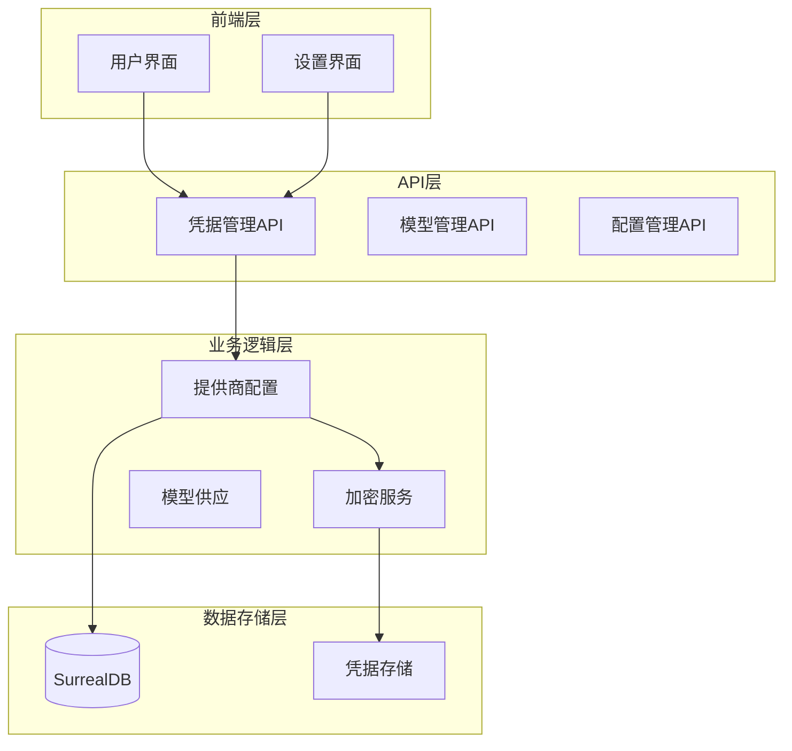

**图表来源**
- [provider_config.py](file://open_notebook/domain/provider_config.py#L175-L445)
- [credentials.py](file://api/routers/credentials.py#L1-L387)

**章节来源**
- [provider_config.py](file://open_notebook/domain/provider_config.py#L1-L445)
- [credentials.py](file://api/routers/credentials.py#L1-L387)

## 核心组件

### 凭据管理系统

系统使用基于数据库的凭据管理系统，支持多种AI提供商：

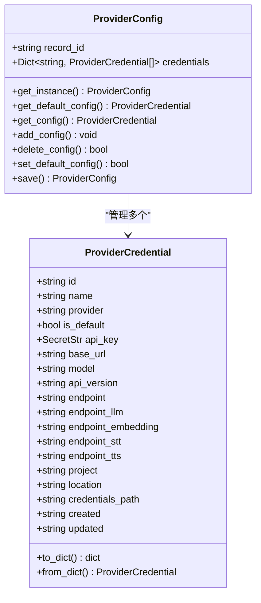

**图表来源**
- [provider_config.py](file://open_notebook/domain/provider_config.py#L22-L445)

### 加密机制

系统采用Fernet对称加密确保凭据安全存储：

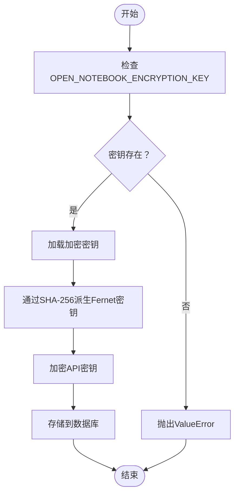

**图表来源**
- [encryption.py](file://open_notebook/utils/encryption.py#L62-L126)

**章节来源**
- [provider_config.py](file://open_notebook/domain/provider_config.py#L1-L445)
- [encryption.py](file://open_notebook/utils/encryption.py#L1-L199)

## 架构概览

### Azure OpenAI企业级配置架构

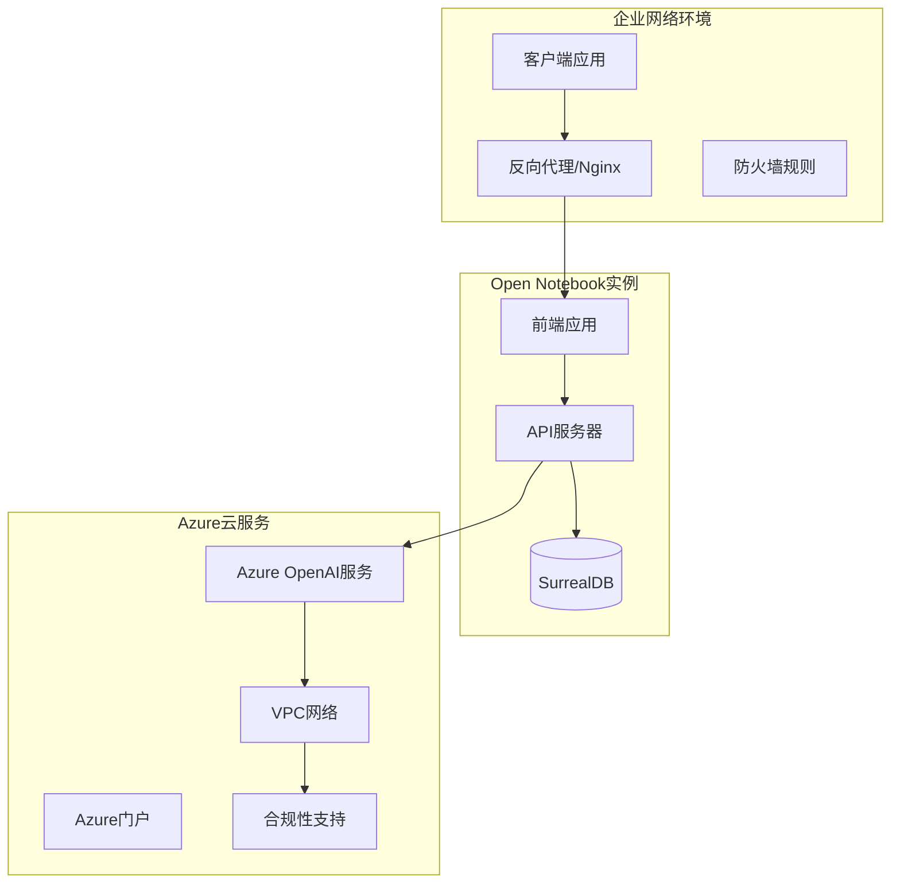

**图表来源**
- [ai-providers.md](file://docs/5-CONFIGURATION/ai-providers.md#L374-L398)
- [reverse-proxy.md](file://docs/5-CONFIGURATION/reverse-proxy.md#L1-L50)

## 详细组件分析

### Azure OpenAI配置流程

#### Azure门户服务创建

1. **服务注册**
   - 登录Azure门户
   - 创建新的Azure OpenAI服务实例
   - 配置资源组和位置选择

2. **模型部署**
   - 在Azure门户中部署GPT-4/3.5-turbo模型
   - 配置模型版本和容量
   - 设置访问限制和配额

3. **凭证获取**
   - 获取API端点URL
   - 生成API密钥
   - 记录API版本信息

#### Open Notebook配置步骤

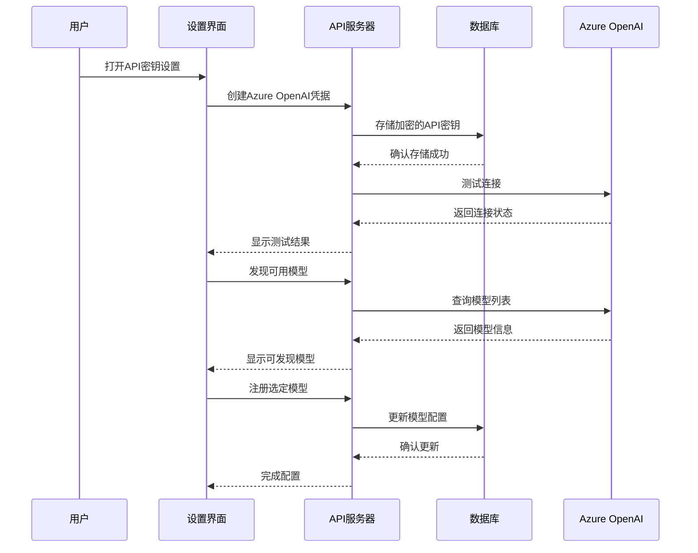

**图表来源**
- [ai-providers.md](file://docs/5-CONFIGURATION/ai-providers.md#L378-L387)
- [credentials.py](file://api/routers/credentials.py#L313-L358)

#### 企业级特性配置

**VPC集成配置**

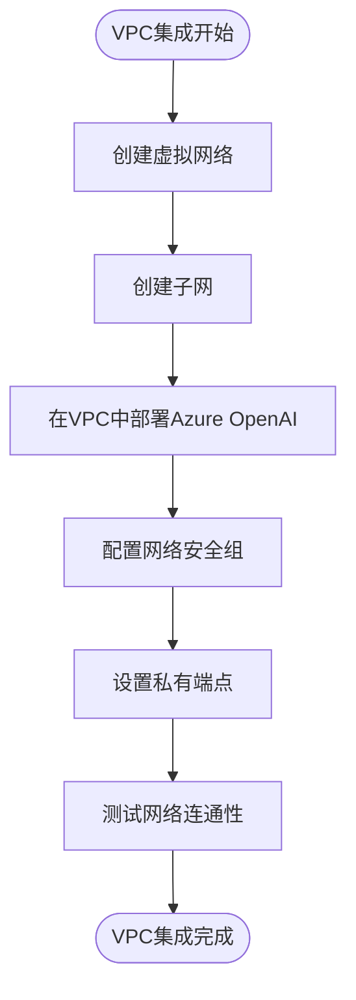

**图表来源**
- [ai-providers.md](file://docs/5-CONFIGURATION/ai-providers.md#L389-L392)

**合规性支持配置**

企业级Azure OpenAI支持以下合规性标准：
- HIPAA合规性：数据加密、访问控制、审计日志
- SOC2类型2：安全、可用性、处理完整性、保密性和隐私性
- GDPR合规：数据保护影响评估、数据主体权利
- ISO 27001：信息安全管理体系

#### 安全配置最佳实践

**密码保护配置**

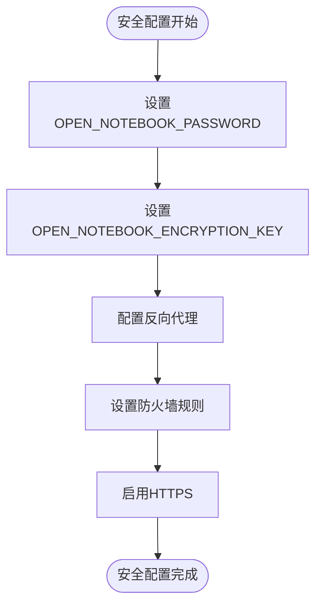

**图表来源**
- [security.md](file://docs/5-CONFIGURATION/security.md#L8-L104)

**章节来源**
- [ai-providers.md](file://docs/5-CONFIGURATION/ai-providers.md#L374-L398)
- [security.md](file://docs/5-CONFIGURATION/security.md#L1-L397)

### 企业网络环境配置

#### 代理配置

**企业代理设置**

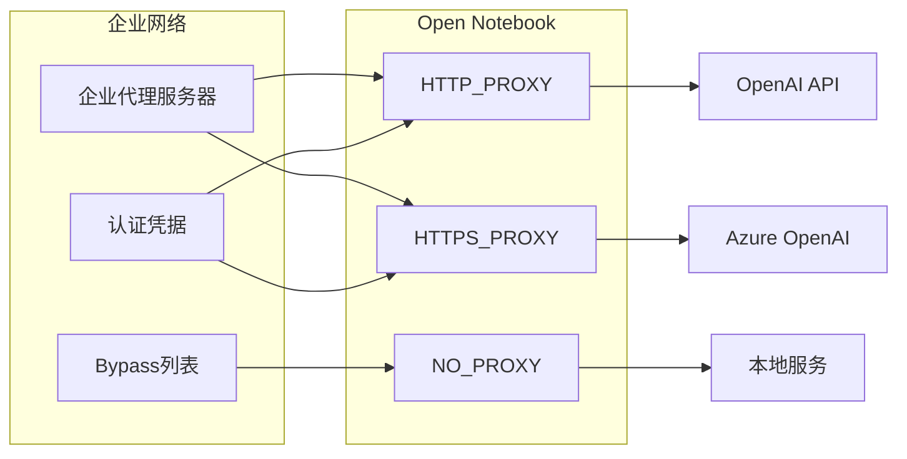

**图表来源**
- [environment-reference.md](file://docs/5-CONFIGURATION/environment-reference.md#L85-L117)

**SSL证书管理**

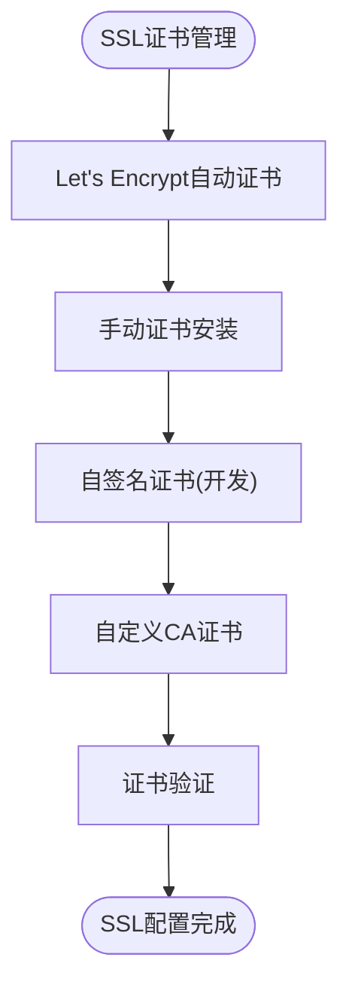

**图表来源**
- [reverse-proxy.md](file://docs/5-CONFIGURATION/reverse-proxy.md#L472-L500)

#### 防火墙规则设置

**企业防火墙配置**

| 端口 | 协议 | 源地址 | 目标 | 描述 |
|------|------|--------|------|------|
| 80 | TCP | 0.0.0.0/0 | 反向代理 | HTTP重定向 |
| 443 | TCP | 0.0.0.0/0 | 反向代理 | HTTPS访问 |
| 8502 | TCP | 10.0.0.0/24 | Open Notebook | 前端访问 |
| 5055 | TCP | 10.0.0.0/24 | Open Notebook | API访问 |
| 8000 | TCP | 10.0.0.0/24 | SurrealDB | 数据库访问 |

**章节来源**
- [reverse-proxy.md](file://docs/5-CONFIGURATION/reverse-proxy.md#L266-L283)
- [environment-reference.md](file://docs/5-CONFIGURATION/environment-reference.md#L85-L117)

### 多租户环境配置

#### 权限管理

**多租户权限架构**

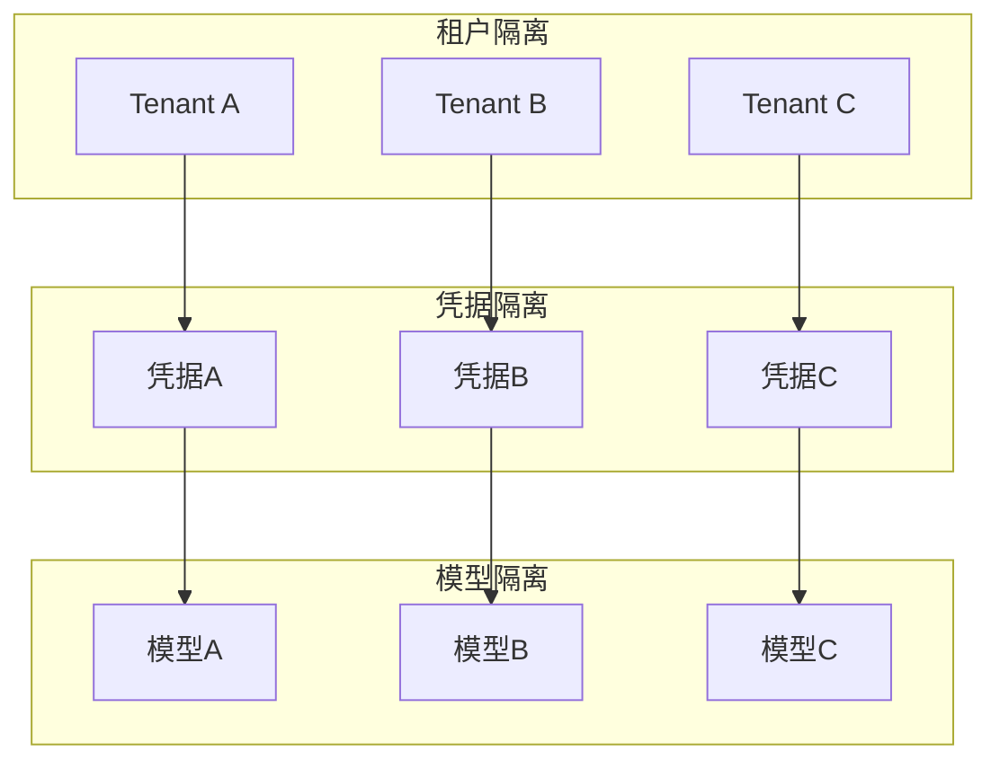

**多租户配置策略**

1. **凭据分离**：每个租户使用独立的API密钥
2. **模型隔离**：为不同租户配置不同的模型访问权限
3. **资源配额**：为每个租户设置使用限额
4. **审计日志**：记录所有租户的API调用

#### 成本控制策略

**成本监控和控制**

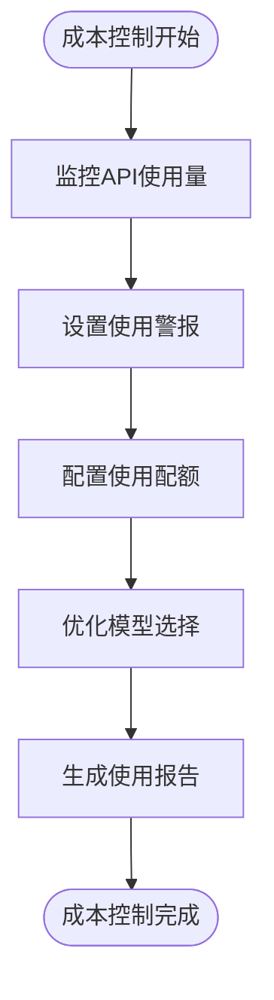

**图表来源**
- [advanced.md](file://docs/5-CONFIGURATION/advanced.md#L356-L397)

**章节来源**
- [provider_config.py](file://open_notebook/domain/provider_config.py#L326-L410)
- [advanced.md](file://docs/5-CONFIGURATION/advanced.md#L1-L545)

### 企业级提供商与公共云提供商对比

#### 架构差异

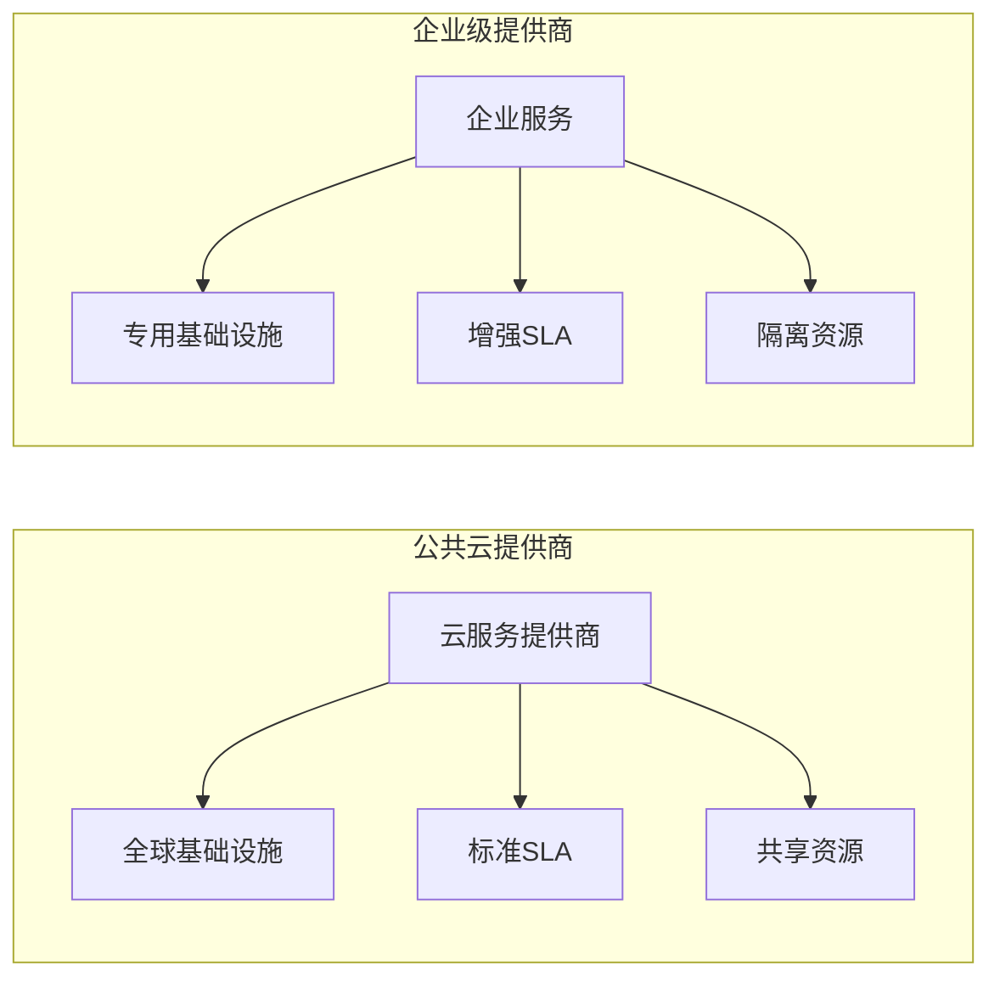

#### 迁移注意事项

**从公共云迁移到企业级提供商**

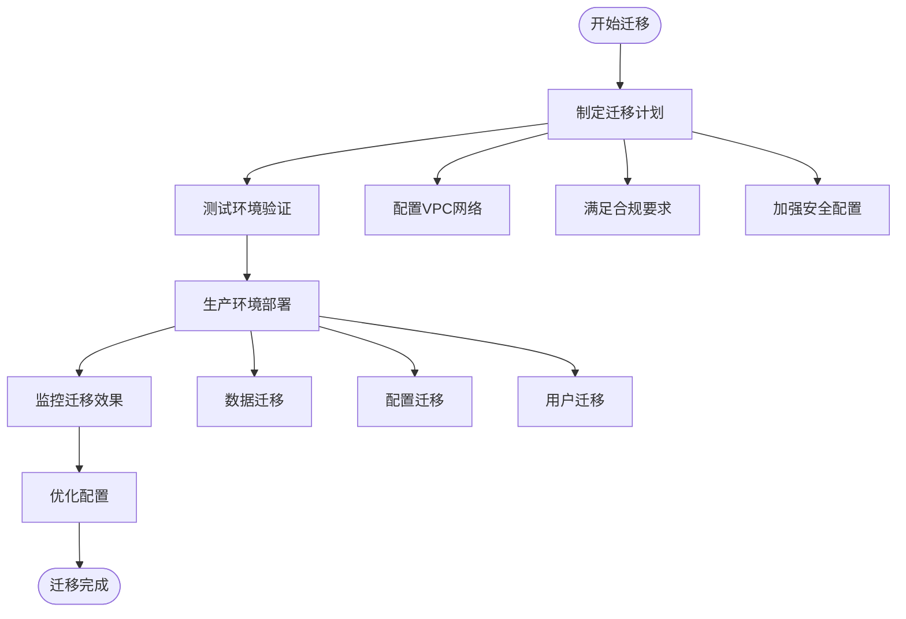

**章节来源**
- [ai-providers.md](file://docs/5-CONFIGURATION/ai-providers.md#L427-L431)
- [advanced.md](file://docs/5-CONFIGURATION/advanced.md#L196-L216)

## 依赖关系分析

### 组件耦合度分析

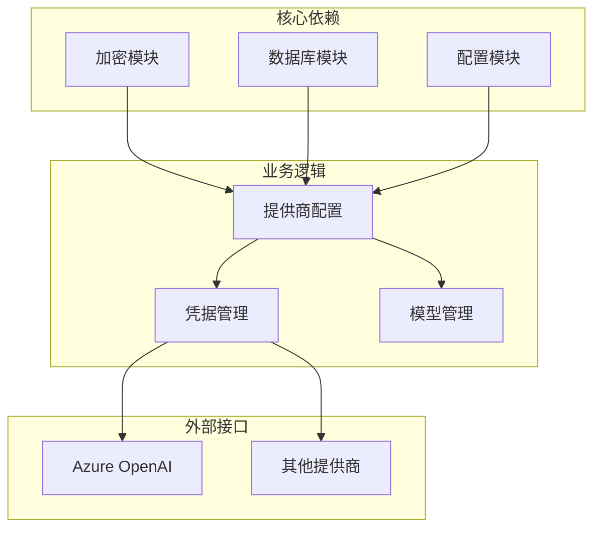

**图表来源**
- [provider_config.py](file://open_notebook/domain/provider_config.py#L175-L445)
- [encryption.py](file://open_notebook/utils/encryption.py#L1-L199)

**章节来源**
- [provider_config.py](file://open_notebook/domain/provider_config.py#L1-L445)
- [credentials.py](file://api/routers/credentials.py#L1-L387)

## 性能考虑

### 企业级性能优化

**高并发配置**

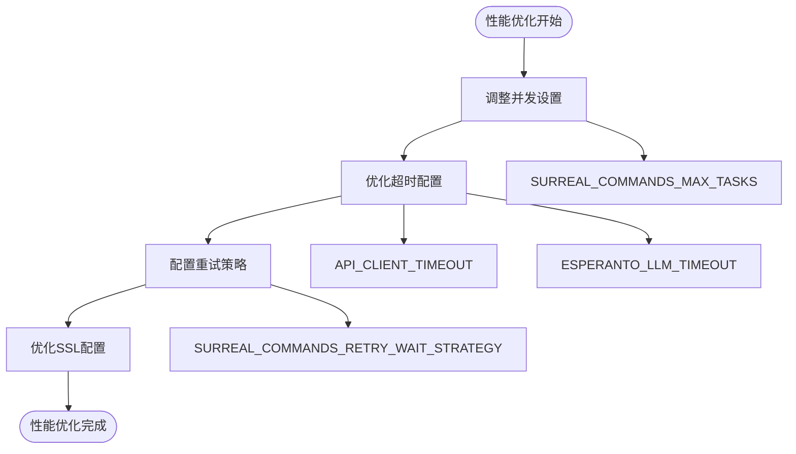

**图表来源**
- [advanced.md](file://docs/5-CONFIGURATION/advanced.md#L7-L57)

**章节来源**
- [advanced.md](file://docs/5-CONFIGURATION/advanced.md#L1-L545)

## 故障排除指南

### 常见问题解决

**Azure OpenAI连接问题**

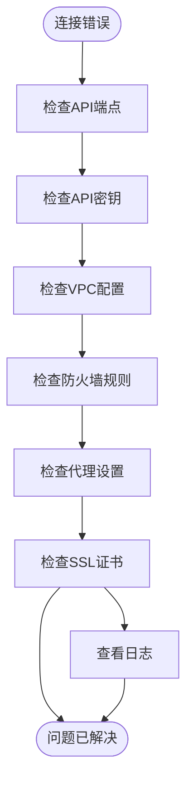

**章节来源**
- [security.md](file://docs/5-CONFIGURATION/security.md#L330-L378)
- [reverse-proxy.md](file://docs/5-CONFIGURATION/reverse-proxy.md#L502-L590)

## 结论

企业级AI提供商配置需要综合考虑安全性、合规性、性能和成本控制等多个方面。Azure OpenAI提供了企业所需的高级功能，但需要正确配置才能发挥最大价值。

关键要点包括：
- 使用基于数据库的凭据管理系统确保安全性
- 配置VPC集成实现网络隔离
- 满足HIPAA、SOC2等合规性要求
- 实施严格的防火墙和代理配置
- 建立多租户权限管理体系
- 制定有效的成本控制策略

通过遵循本指南中的配置流程和最佳实践，可以构建一个既安全又高效的企业级AI应用平台。

## 附录

### 快速参考清单

**Azure OpenAI配置检查清单**
- [ ] 创建Azure OpenAI服务实例
- [ ] 部署所需模型
- [ ] 配置VPC网络
- [ ] 设置API密钥和端点
- [ ] 配置合规性设置
- [ ] 测试连接和性能
- [ ] 验证安全配置

**企业安全配置检查清单**
- [ ] 设置强密码保护
- [ ] 配置HTTPS和SSL证书
- [ ] 设置防火墙规则
- [ ] 配置代理服务器
- [ ] 启用审计日志
- [ ] 设置备份策略
- [ ] 制定灾难恢复计划