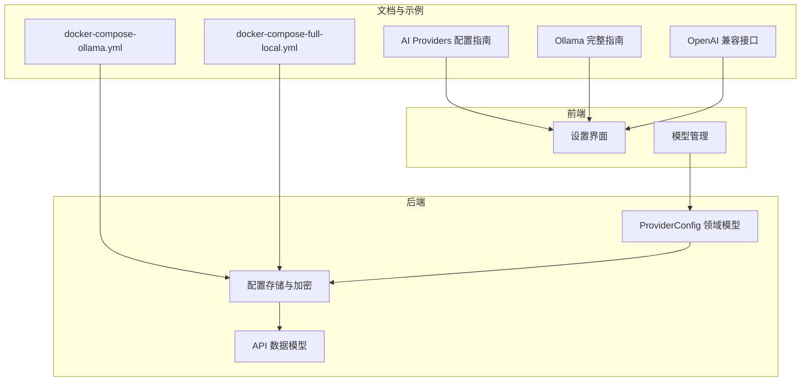
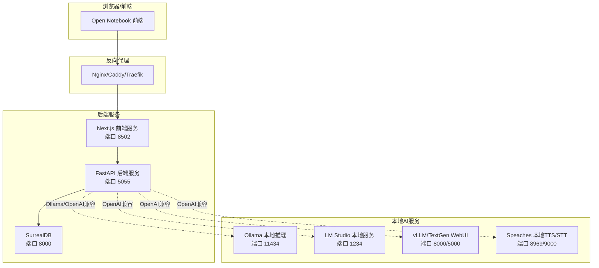
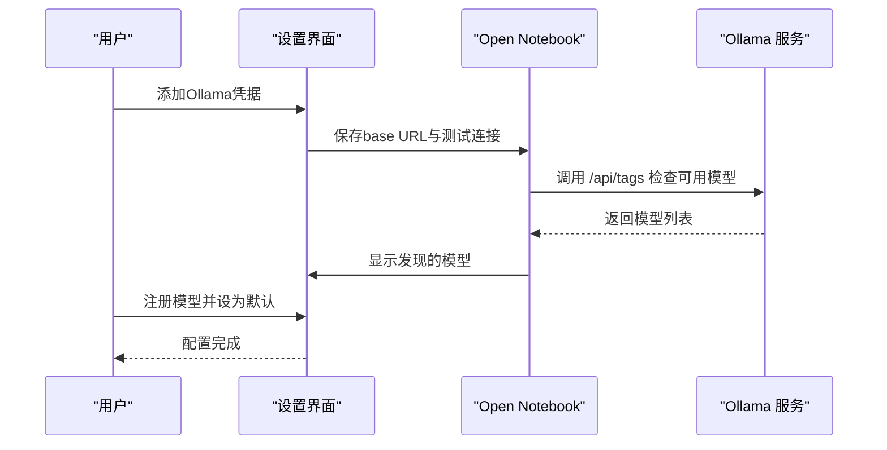
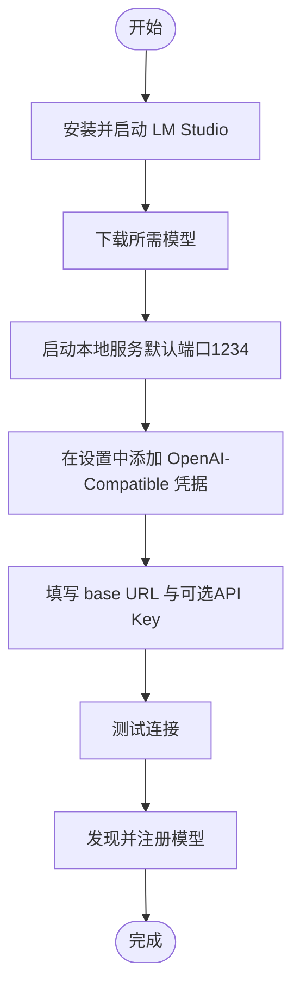
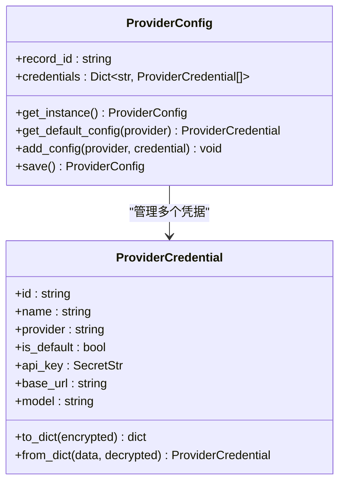
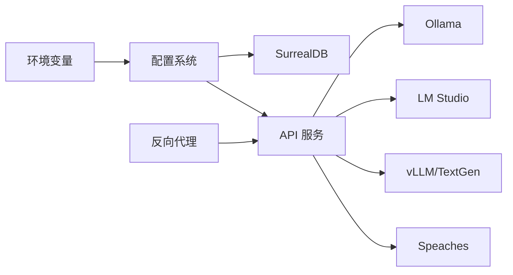

# 本地提供商配置

<cite>
**本文档引用的文件**
- [docs/5-CONFIGURATION/ai-providers.md](file://docs/5-CONFIGURATION/ai-providers.md)
- [docs/5-CONFIGURATION/ollama.md](file://docs/5-CONFIGURATION/ollama.md)
- [docs/5-CONFIGURATION/openai-compatible.md](file://docs/5-CONFIGURATION/openai-compatible.md)
- [docs/5-CONFIGURATION/environment-reference.md](file://docs/5-CONFIGURATION/environment-reference.md)
- [docs/5-CONFIGURATION/advanced.md](file://docs/5-CONFIGURATION/advanced.md)
- [docs/5-CONFIGURATION/reverse-proxy.md](file://docs/5-CONFIGURATION/reverse-proxy.md)
- [docs/5-CONFIGURATION/local-stt.md](file://docs/5-CONFIGURATION/local-stt.md)
- [docs/6-TROUBLESHOOTING/quick-fixes.md](file://docs/6-TROUBLESHOOTING/quick-fixes.md)
- [docker-compose.yml](file://docker-compose.yml)
- [examples/docker-compose-ollama.yml](file://examples/docker-compose-ollama.yml)
- [examples/docker-compose-full-local.yml](file://examples/docker-compose-full-local.yml)
- [open_notebook/domain/provider_config.py](file://open_notebook/domain/provider_config.py)
- [open_notebook/config.py](file://open_notebook/config.py)
- [api/models.py](file://api/models.py)
</cite>

## 目录
1. [简介](#简介)
2. [项目结构](#项目结构)
3. [核心组件](#核心组件)
4. [架构总览](#架构总览)
5. [详细组件分析](#详细组件分析)
6. [依赖关系分析](#依赖关系分析)
7. [性能考虑](#性能考虑)
8. [故障排除指南](#故障排除指南)
9. [结论](#结论)
10. [附录](#附录)

## 简介
本指南面向需要在本地部署和配置AI提供商的用户，重点覆盖以下三类本地方案：
- Ollama：开源本地推理引擎，适合隐私优先与离线场景
- LM Studio：桌面GUI本地推理服务，便于模型管理与可视化
- OpenAI兼容接口：通过任意OpenAI API格式的服务（如Text Generation WebUI、vLLM等）接入本地模型

内容涵盖模型下载与运行、网络配置、Docker容器化部署、主机网络与端口映射、硬件要求与GPU加速、性能优化、与云端提供商的差异对比，以及常见问题的诊断与修复。

## 项目结构
Open Notebook 提供了完整的本地AI提供商配置文档与示例，配合Docker编排实现一键部署。关键目录与文件包括：
- 文档：docs/5-CONFIGURATION 下的各主题文档（AI Providers、Ollama、OpenAI-Compatible、环境变量、高级配置、反向代理等）
- 示例：examples/ 下的 docker-compose 模板（单机Ollama、全本地部署等）
- 后端：open_notebook/ 下的领域模型与配置（ProviderConfig、配置存储等）
- 前端：frontend/ 下的设置界面与模型管理UI
- API：api/ 下的模型与凭证相关数据模型

图表来源
- [docs/5-CONFIGURATION/ai-providers.md](file://docs/5-CONFIGURATION/ai-providers.md#L1-L468)
- [docs/5-CONFIGURATION/ollama.md](file://docs/5-CONFIGURATION/ollama.md#L1-L741)
- [docs/5-CONFIGURATION/openai-compatible.md](file://docs/5-CONFIGURATION/openai-compatible.md#L1-L401)
- [examples/docker-compose-ollama.yml](file://examples/docker-compose-ollama.yml#L1-L64)
- [examples/docker-compose-full-local.yml](file://examples/docker-compose-full-local.yml#L1-L198)
- [open_notebook/domain/provider_config.py](file://open_notebook/domain/provider_config.py#L1-L445)
- [api/models.py](file://api/models.py#L441-L685)

章节来源
- [docs/5-CONFIGURATION/ai-providers.md](file://docs/5-CONFIGURATION/ai-providers.md#L1-L468)
- [docs/5-CONFIGURATION/ollama.md](file://docs/5-CONFIGURATION/ollama.md#L1-L741)
- [docs/5-CONFIGURATION/openai-compatible.md](file://docs/5-CONFIGURATION/openai-compatible.md#L1-L401)
- [examples/docker-compose-ollama.yml](file://examples/docker-compose-ollama.yml#L1-L64)
- [examples/docker-compose-full-local.yml](file://examples/docker-compose-full-local.yml#L1-L198)
- [open_notebook/domain/provider_config.py](file://open_notebook/domain/provider_config.py#L1-L445)
- [api/models.py](file://api/models.py#L441-L685)

## 核心组件
- 凭证系统（ProviderConfig）：以数据库记录形式存储多个提供商的凭据，支持加密与默认配置切换
- 设置界面（Settings UI）：通过“API Keys”添加/测试/迁移凭据；通过“Models”注册模型
- Docker编排：提供单容器与多服务模板，支持Ollama、SurrealDB、Speaches等组合
- 反向代理与端口：支持Nginx/Caddy/Traefik等，自动处理前端到后端的路由转发

章节来源
- [open_notebook/domain/provider_config.py](file://open_notebook/domain/provider_config.py#L175-L445)
- [api/models.py](file://api/models.py#L441-L685)
- [docs/5-CONFIGURATION/ai-providers.md](file://docs/5-CONFIGURATION/ai-providers.md#L9-L447)
- [docs/5-CONFIGURATION/reverse-proxy.md](file://docs/5-CONFIGURATION/reverse-proxy.md#L1-L800)

## 架构总览
下图展示了三种本地提供商的典型部署拓扑与交互流程：

图表来源
- [docs/5-CONFIGURATION/reverse-proxy.md](file://docs/5-CONFIGURATION/reverse-proxy.md#L1-L800)
- [docs/5-CONFIGURATION/ollama.md](file://docs/5-CONFIGURATION/ollama.md#L58-L159)
- [docs/5-CONFIGURATION/openai-compatible.md](file://docs/5-CONFIGURATION/openai-compatible.md#L113-L143)
- [examples/docker-compose-full-local.yml](file://examples/docker-compose-full-local.yml#L28-L95)

## 详细组件分析

### Ollama 配置与部署
- 安装与启动：支持Linux/macOS/Windows安装方式；推荐使用守护进程方式运行
- 模型拉取：建议同时准备语言模型与嵌入模型，满足搜索与对话需求
- 网络配置：根据部署形态选择正确的base URL
  - 同机直连：http://localhost:11434 或 http://127.0.0.1:11434
  - Docker宿主机访问：http://host.docker.internal:11434，并确保Ollama绑定0.0.0.0:11434
  - 同Compose容器：http://ollama:11434
  - 远程服务器：http://<IP>:11434（需信任网络）
  - 自定义端口：启动时指定端口并在设置中同步
- 模型名称严格匹配：必须与`ollama list`输出完全一致，否则会报“发送消息失败”
- Docker Compose示例：包含SurrealDB、Ollama与Open Notebook的完整编排
- 性能优化：预加载模型、调整并发与队列、资源限制、文件句柄上限等
- GPU加速：NVIDIA（CUDA）、Apple Silicon（Metal）、AMD（ROCm）支持情况不同
- 安全与SSL：可配置自定义CA或禁用验证（开发环境）

图表来源
- [docs/5-CONFIGURATION/ollama.md](file://docs/5-CONFIGURATION/ollama.md#L39-L741)
- [examples/docker-compose-ollama.yml](file://examples/docker-compose-ollama.yml#L13-L64)

章节来源
- [docs/5-CONFIGURATION/ollama.md](file://docs/5-CONFIGURATION/ollama.md#L14-L741)
- [examples/docker-compose-ollama.yml](file://examples/docker-compose-ollama.yml#L1-L64)

### LM Studio 本地推理
- 启动流程：下载模型后在“Local Server”标签页启动本地服务（默认端口1234）
- 配置方式：通过“OpenAI-Compatible”类型添加凭据，base URL形如 http://host.docker.internal:1234/v1 或 http://localhost:1234/v1
- 模型注册：在“Models”中添加模型，名称需与LM Studio显示一致
- 适用场景：桌面端GUI、模型管理直观、隐私友好、离线可用

图表来源
- [docs/5-CONFIGURATION/openai-compatible.md](file://docs/5-CONFIGURATION/openai-compatible.md#L34-L66)

章节来源
- [docs/5-CONFIGURATION/openai-compatible.md](file://docs/5-CONFIGURATION/openai-compatible.md#L1-L401)

### OpenAI 兼容接口（通用）
- 适配范围：LM Studio、Text Generation WebUI、vLLM、LocalAI、llama.cpp server等
- 配置要点：base URL遵循 /v1 路径；可按服务类型分别配置LLM/Embedding/TTS/STT端点
- Docker网络：macOS/Windows使用 host.docker.internal；Linux需配置extra_hosts或host网络模式
- 模型名称：必须与服务器返回的名称完全一致（含tag），否则出现“模型未找到”

章节来源
- [docs/5-CONFIGURATION/openai-compatible.md](file://docs/5-CONFIGURATION/openai-compatible.md#L1-L401)

### 凭证与模型管理（后端）
- ProviderConfig：支持多凭据、默认凭据、加密存储、数据库持久化
- API数据模型：SetApiKeyRequest、CredentialResponse、DiscoveredModelResponse等
- 配置迁移：从环境变量迁移到数据库凭据系统

图表来源
- [open_notebook/domain/provider_config.py](file://open_notebook/domain/provider_config.py#L175-L445)
- [api/models.py](file://api/models.py#L441-L685)

章节来源
- [open_notebook/domain/provider_config.py](file://open_notebook/domain/provider_config.py#L1-L445)
- [api/models.py](file://api/models.py#L441-L685)

### Docker 容器化与端口映射
- 单容器部署：Open Notebook + SurrealDB，端口8502（前端）、5055（API）、8000（数据库）
- 多服务部署：Ollama、Speaches（TTS/STT）、SurrealDB组合
- 端口变更：可通过环境变量与docker-compose修改，默认端口见示例文件
- 端口映射注意事项：确保外部可访问时正确暴露端口，避免端口冲突

章节来源
- [docker-compose.yml](file://docker-compose.yml#L1-L37)
- [examples/docker-compose-ollama.yml](file://examples/docker-compose-ollama.yml#L1-L64)
- [examples/docker-compose-full-local.yml](file://examples/docker-compose-full-local.yml#L1-L198)

### 反向代理与HTTPS
- 单端口代理：Nginx/Caddy/Traefik仅需代理前端端口8502，内部自动转发至API端口5055
- API_URL：建议显式设置为公网域名（带https://），避免自动检测导致的协议不一致
- WebSocket与长超时：确保代理支持WebSocket升级并配置足够读写超时
- 文件上传限制：针对413错误需在代理层增加body大小限制与CORS头透传

章节来源
- [docs/5-CONFIGURATION/reverse-proxy.md](file://docs/5-CONFIGURATION/reverse-proxy.md#L1-L800)

### 本地语音（TTS/STT）集成
- Speaches：提供本地TTS与STT能力，支持多种Whisper模型与GPU加速
- 模型选择：根据速度/精度/显存需求选择合适模型
- GPU加速：NVIDIA GPU可显著提升转录速度
- 集成方式：通过OpenAI-Compatible凭据配置TTS/STT端点

章节来源
- [docs/5-CONFIGURATION/local-stt.md](file://docs/5-CONFIGURATION/local-stt.md#L107-L160)
- [examples/docker-compose-full-local.yml](file://examples/docker-compose-full-local.yml#L59-L166)

## 依赖关系分析
- 环境变量：OPEN_NOTEBOOK_ENCRYPTION_KEY（凭据加密）、SURREAL_*（数据库连接）、API_URL（反向代理）、ESPERANTO_*（SSL/超时）等
- Docker依赖：SurrealDB、Ollama、Speaches、Nginx/Caddy/Traefik
- 网络依赖：host.docker.internal解析（Linux需extra_hosts）、防火墙放通、端口映射

图表来源
- [docs/5-CONFIGURATION/environment-reference.md](file://docs/5-CONFIGURATION/environment-reference.md#L7-L275)
- [docs/5-CONFIGURATION/reverse-proxy.md](file://docs/5-CONFIGURATION/reverse-proxy.md#L117-L157)

章节来源
- [docs/5-CONFIGURATION/environment-reference.md](file://docs/5-CONFIGURATION/environment-reference.md#L1-L275)
- [docs/5-CONFIGURATION/reverse-proxy.md](file://docs/5-CONFIGURATION/reverse-proxy.md#L1-L800)

## 性能考虑
- 并发与重试：SURREAL_COMMANDS_MAX_TASKS、RETRY策略与等待时间
- 超时设置：API_CLIENT_TIMEOUT、ESPERANTO_LLM_TIMEOUT
- 批量与并发：TTS_BATCH_SIZE（播客生成）
- 硬件与GPU：内存、存储、GPU显存与驱动版本
- 系统优化：文件句柄、CPU亲和度、容器资源限制

章节来源
- [docs/5-CONFIGURATION/advanced.md](file://docs/5-CONFIGURATION/advanced.md#L7-L545)
- [docs/5-CONFIGURATION/ollama.md](file://docs/5-CONFIGURATION/ollama.md#L216-L243)

## 故障排除指南
- “无法连接到服务器”：检查服务状态、端口可达性、API_URL配置
- “无效API密钥/模型不可用”：确认凭据有效、模型已注册、名称匹配
- “端口占用”：查找占用进程并更换端口或停止冲突服务
- “文件上传失败（413）”：在反向代理层增大body大小限制并透传CORS头
- “聊天响应慢”：降低上下文、切换更快模型、检查系统资源
- “数据库连接过多”：降低并发任务数
- “启动缓慢/下载超时（国内网络）”：提高下载超时、使用镜像源

章节来源
- [docs/6-TROUBLESHOOTING/quick-fixes.md](file://docs/6-TROUBLESHOOTING/quick-fixes.md#L1-L373)
- [docs/5-CONFIGURATION/reverse-proxy.md](file://docs/5-CONFIGURATION/reverse-proxy.md#L671-L756)

## 结论
通过Open Notebook提供的统一设置界面与Docker编排模板，用户可以快速完成本地AI提供商的配置与部署。Ollama适合隐私与离线场景，LM Studio适合桌面端GUI体验，OpenAI兼容接口则提供了广泛的本地推理服务选择。结合合理的网络配置、反向代理与性能调优，可在本地获得稳定且高效的AI应用体验。

## 附录
- 快速开始清单
  - 设置OPEN_NOTEBOOK_ENCRYPTION_KEY
  - 配置SurrealDB连接参数
  - 选择并配置本地AI提供商（Ollama/LM Studio/OpenAI兼容）
  - 测试连接并注册模型
  - 如需公网访问，配置反向代理与HTTPS
  - 根据硬件与负载进行性能优化

章节来源
- [docs/5-CONFIGURATION/environment-reference.md](file://docs/5-CONFIGURATION/environment-reference.md#L133-L229)
- [docs/5-CONFIGURATION/ai-providers.md](file://docs/5-CONFIGURATION/ai-providers.md#L434-L447)