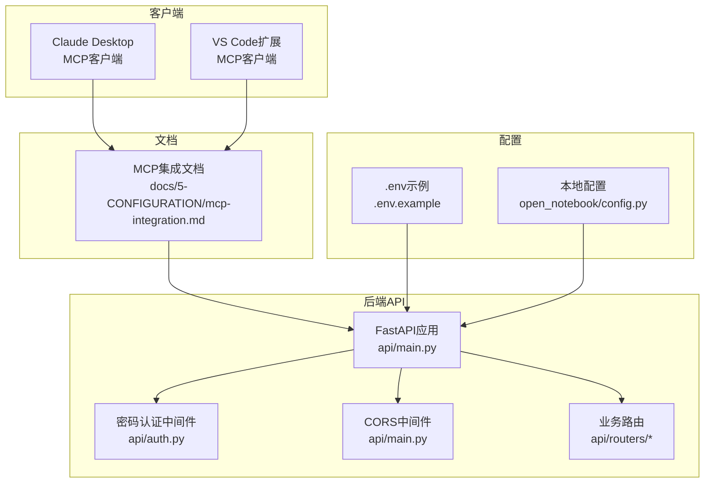
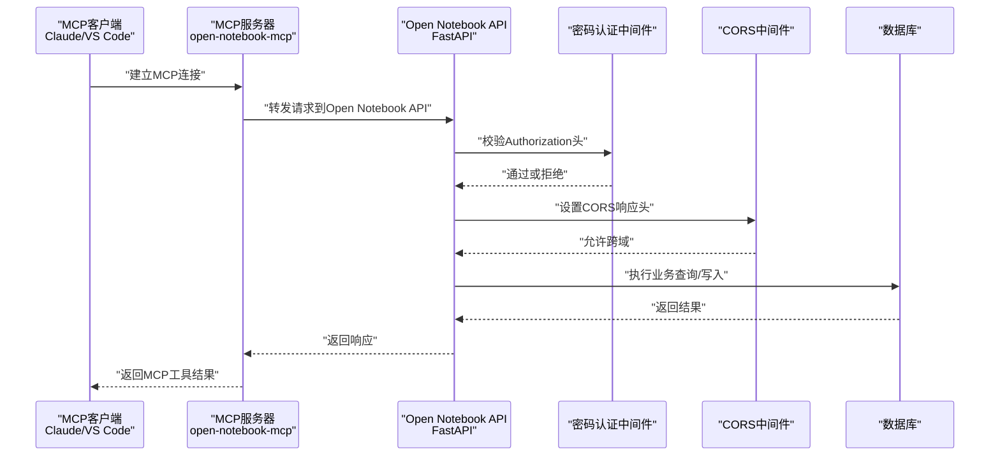
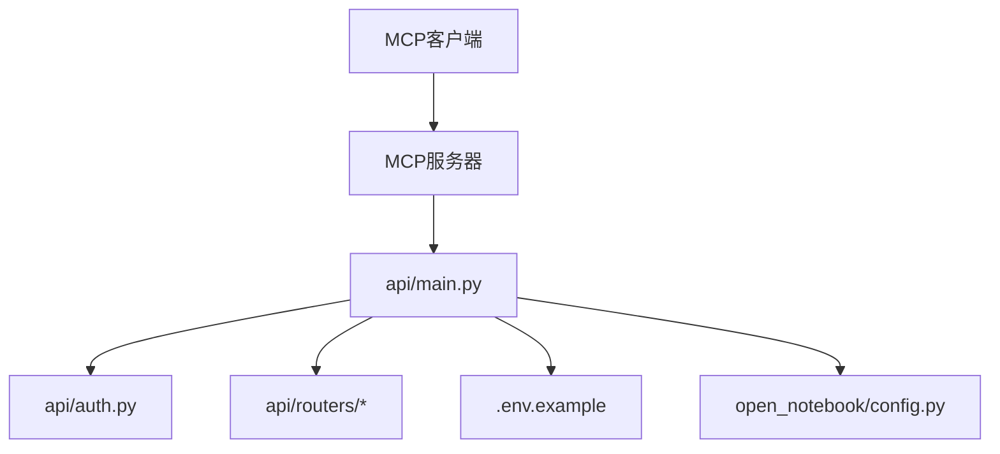

# MCP集成配置

<cite>
**本文档引用的文件**
- [docs/5-CONFIGURATION/mcp-integration.md](file://docs/5-CONFIGURATION/mcp-integration.md)
- [api/main.py](file://api/main.py)
- [.env.example](file://.env.example)
- [api/auth.py](file://api/auth.py)
- [api/routers/notebooks.py](file://api/routers/notebooks.py)
- [api/routers/sources.py](file://api/routers/sources.py)
- [api/routers/search.py](file://api/routers/search.py)
- [open_notebook/config.py](file://open_notebook/config.py)
</cite>

## 目录
1. [简介](#简介)
2. [项目结构](#项目结构)
3. [核心组件](#核心组件)
4. [架构总览](#架构总览)
5. [详细组件分析](#详细组件分析)
6. [依赖关系分析](#依赖关系分析)
7. [性能考虑](#性能考虑)
8. [故障排除指南](#故障排除指南)
9. [结论](#结论)
10. [附录](#附录)

## 简介
本指南面向需要在Open Notebook中集成MCP（Model Context Protocol）的用户与开发者，系统讲解MCP协议的工作原理、与传统AI提供商的区别、Open Notebook的MCP服务器配置与客户端设置、不同MCP实现的配置示例、调试与故障排除方法、性能优化与最佳实践，以及在Open Notebook中的具体应用场景。

## 项目结构
Open Notebook的MCP集成主要涉及以下方面：
- 文档层：官方MCP集成文档，提供快速上手、配置项与可用工具清单
- 后端API层：FastAPI应用、认证中间件、CORS处理、各业务路由（笔记本、源、搜索等）
- 配置层：环境变量与本地数据目录配置
- 客户端层：Claude Desktop、VS Code等MCP客户端通过MCP服务器访问Open Notebook API

图表来源
- [docs/5-CONFIGURATION/mcp-integration.md](file://docs/5-CONFIGURATION/mcp-integration.md#L1-L200)
- [api/main.py](file://api/main.py#L99-L190)
- [api/auth.py](file://api/auth.py#L12-L76)
- [open_notebook/config.py](file://open_notebook/config.py#L1-L18)
- [.env.example](file://.env.example#L1-L60)

章节来源
- [docs/5-CONFIGURATION/mcp-integration.md](file://docs/5-CONFIGURATION/mcp-integration.md#L1-L200)
- [api/main.py](file://api/main.py#L99-L190)
- [open_notebook/config.py](file://open_notebook/config.py#L1-L18)
- [.env.example](file://.env.example#L1-L60)

## 核心组件
- MCP服务器与客户端
  - MCP服务器由独立仓库维护，通过标准MCP协议暴露Open Notebook能力
  - 客户端（如Claude Desktop、VS Code扩展）通过MCP协议连接并调用
- Open Notebook API
  - 提供REST接口，支持密码认证、CORS、数据库迁移与健康检查
  - 暴露笔记本、源、搜索、模型、设置等路由
- 认证与安全
  - 密码认证中间件支持可选的密码保护与Docker密钥文件
  - 异常处理器确保错误响应包含CORS头
- 配置与数据目录
  - 环境变量控制加密密钥、数据库连接、外部API地址等
  - 本地数据目录用于上传、缓存与LangGraph检查点存储

章节来源
- [docs/5-CONFIGURATION/mcp-integration.md](file://docs/5-CONFIGURATION/mcp-integration.md#L168-L195)
- [api/main.py](file://api/main.py#L105-L154)
- [api/auth.py](file://api/auth.py#L12-L76)
- [.env.example](file://.env.example#L1-L60)
- [open_notebook/config.py](file://open_notebook/config.py#L1-L18)

## 架构总览
下图展示了MCP客户端与Open Notebook后端的交互流程，以及认证与CORS处理的关键节点。

图表来源
- [docs/5-CONFIGURATION/mcp-integration.md](file://docs/5-CONFIGURATION/mcp-integration.md#L17-L80)
- [api/main.py](file://api/main.py#L105-L154)
- [api/auth.py](file://api/auth.py#L30-L75)

## 详细组件分析

### MCP协议工作原理与集成优势
- 工作原理
  - MCP是开放标准，允许AI应用安全地连接到外部数据源与工具
  - Open Notebook通过MCP服务器将API能力暴露给客户端，无需直接访问后端
- 集成优势
  - 无缝接入研究工作流：在Claude/VS Code中直接访问笔记本、源、聊天与搜索
  - 自动化与即用性：支持自动化工作流，减少上下文切换
  - 可移植性：MCP客户端生态广泛，便于多平台使用

章节来源
- [docs/5-CONFIGURATION/mcp-integration.md](file://docs/5-CONFIGURATION/mcp-integration.md#L5-L14)

### MCP服务器配置与客户端设置
- 服务器配置
  - 通过命令行参数指定MCP服务器名称与启动方式（如uvx）
  - 设置环境变量OPEN_NOTEBOOK_URL指向API地址，OPEN_NOTEBOOK_PASSWORD为可选密码
- 客户端设置
  - Claude Desktop：编辑配置文件，添加mcpServers条目
  - VS Code：在设置或.mcp.json中添加servers条目
- 远程部署
  - 更新OPEN_NOTEBOOK_URL为远程地址或域名
  - 确保端口可达与防火墙放行

章节来源
- [docs/5-CONFIGURATION/mcp-integration.md](file://docs/5-CONFIGURATION/mcp-integration.md#L17-L100)

### 不同MCP实现的配置示例
- Claude Desktop
  - macOS/Linux：编辑应用支持目录下的配置文件，添加mcpServers.open-notebook
  - Windows：编辑%APPDATA%下的配置文件，添加相同结构
- VS Code（Cline等）
  - 在设置或.vscode/mcp.json中添加servers.open-notebook
- 其他MCP客户端
  - 遵循标准MCP协议，参考对应客户端文档进行配置

章节来源
- [docs/5-CONFIGURATION/mcp-integration.md](file://docs/5-CONFIGURATION/mcp-integration.md#L17-L80)
- [docs/5-CONFIGURATION/mcp-integration.md](file://docs/5-CONFIGURATION/mcp-integration.md#L193-L195)

### MCP与传统AI提供商的区别与选择考虑
- 区别
  - 传统AI提供商：通过API密钥访问云端模型；MCP：通过本地/私有服务器连接到你的知识库
  - MCP强调“上下文即服务”，将你的研究内容作为模型输入的一部分
- 选择考虑
  - 数据隐私与合规：MCP适合对数据外泄敏感的场景
  - 延迟与可用性：本地MCP服务器可降低网络延迟，但需自管运维
  - 生态兼容：MCP客户端生态丰富，便于多工具协同

章节来源
- [docs/5-CONFIGURATION/mcp-integration.md](file://docs/5-CONFIGURATION/mcp-integration.md#L3-L14)

### Open Notebook API与MCP工具映射
- 可用工具概览
  - 笔记本：列出、详情、创建、更新、删除
  - 源：列出、详情、新增（链接/文件/文本）、更新元数据、删除
  - 笔记：列出、详情、创建、更新、删除
  - 聊天：创建会话、发送消息、历史查询、列出会话
  - 搜索：向量/文本搜索、按笔记本过滤
  - 模型：列出、详情、创建配置、更新设置
  - 设置：获取与更新应用设置
- API路由与MCP工具的关系
  - MCP工具通过MCP服务器调用相应API路由完成操作

章节来源
- [docs/5-CONFIGURATION/mcp-integration.md](file://docs/5-CONFIGURATION/mcp-integration.md#L115-L167)
- [api/routers/notebooks.py](file://api/routers/notebooks.py#L20-L200)
- [api/routers/sources.py](file://api/routers/sources.py#L152-L200)
- [api/routers/search.py](file://api/routers/search.py#L17-L60)

### 认证与安全（密码保护）
- 密码认证中间件
  - 支持可选密码保护，未配置时跳过认证
  - 支持Docker密钥文件（OPEN_NOTEBOOK_PASSWORD_FILE）
  - 排除健康检查、文档等路径
- 错误处理
  - 异常处理器确保错误响应包含CORS头，避免前端跨域问题
- 环境变量
  - OPEN_NOTEBOOK_ENCRYPTION_KEY：用于安全存储API密钥
  - OPEN_NOTEBOOK_PASSWORD：用于API访问密码保护

章节来源
- [api/auth.py](file://api/auth.py#L12-L76)
- [api/main.py](file://api/main.py#L130-L154)
- [.env.example](file://.env.example#L8-L10)
- [.env.example](file://.env.example#L54-L57)

### 配置与数据目录
- 环境变量
  - 数据库连接：SURREAL_URL、SURREAL_USER、SURREAL_PASSWORD、SURREAL_NAMESPACE、SURREAL_DATABASE
  - 外部API地址：API_URL
  - Ollama端点：OLLAMA_BASE_URL
  - 内容处理：CHUNK_SIZE、CHUNK_OVERLAP
- 本地数据目录
  - 数据根目录、上传目录、tiktoken缓存目录、LangGraph检查点文件

章节来源
- [.env.example](file://.env.example#L13-L21)
- [.env.example](file://.env.example#L44-L53)
- [open_notebook/config.py](file://open_notebook/config.py#L1-L18)

## 依赖关系分析
- 组件耦合
  - API主程序与认证中间件、CORS中间件存在强耦合，确保所有请求统一处理
  - 各业务路由模块与数据库交互，形成清晰的分层
- 外部依赖
  - MCP服务器（独立仓库），通过标准协议与客户端通信
  - 数据库（SurrealDB）与嵌入模型（可选）

图表来源
- [api/main.py](file://api/main.py#L99-L190)
- [api/auth.py](file://api/auth.py#L12-L76)
- [open_notebook/config.py](file://open_notebook/config.py#L1-L18)
- [.env.example](file://.env.example#L1-L60)
- [docs/5-CONFIGURATION/mcp-integration.md](file://docs/5-CONFIGURATION/mcp-integration.md#L168-L195)

章节来源
- [api/main.py](file://api/main.py#L99-L190)
- [api/auth.py](file://api/auth.py#L12-L76)
- [open_notebook/config.py](file://open_notebook/config.py#L1-L18)
- [.env.example](file://.env.example#L1-L60)

## 性能考虑
- 本地MCP服务器
  - 减少网络往返，提升响应速度
  - 需要合理规划CPU与内存资源
- 搜索性能
  - 向量搜索依赖嵌入模型，需确保模型可用与索引完整
  - 合理设置搜索限制与过滤条件，避免大范围扫描
- 文件上传与处理
  - 上传目录容量与磁盘IO影响处理速度
  - 分块大小与重叠策略影响嵌入质量与速度
- 并发与限流
  - API应具备合理的并发控制与超时设置，避免资源耗尽

## 故障排除指南
- 连接错误
  - 检查OPEN_NOTEBOOK_URL是否正确且可达
  - 若启用密码保护，确认OPEN_NOTEBOOK_PASSWORD配置正确
  - 远程部署时确保端口与防火墙放行
- 认证失败
  - 确认Authorization头格式为Bearer {password}
  - 检查密码保护是否开启及排除路径配置
- CORS问题
  - 确保异常处理器已生效，错误响应包含CORS头
  - 反向代理场景需确保其也添加CORS头
- 数据库迁移
  - 启动时自动执行迁移，若失败需根据日志排查并修复

章节来源
- [docs/5-CONFIGURATION/mcp-integration.md](file://docs/5-CONFIGURATION/mcp-integration.md#L184-L192)
- [api/auth.py](file://api/auth.py#L30-L75)
- [api/main.py](file://api/main.py#L130-L154)

## 结论
通过MCP集成，Open Notebook实现了与AI助手的深度协作，将研究内容与工具链无缝整合到日常工作中。结合正确的服务器与客户端配置、完善的安全策略与性能优化，可在保证数据隐私的同时，显著提升研究效率与工作流自动化水平。

## 附录
- 快速参考
  - MCP服务器发布信息：注册表、PyPI、GitHub
  - 常用环境变量：OPEN_NOTEBOOK_URL、OPEN_NOTEBOOK_PASSWORD、OPEN_NOTEBOOK_ENCRYPTION_KEY
  - 可用工具清单：笔记本、源、笔记、聊天、搜索、模型、设置

章节来源
- [docs/5-CONFIGURATION/mcp-integration.md](file://docs/5-CONFIGURATION/mcp-integration.md#L168-L183)
- [docs/5-CONFIGURATION/mcp-integration.md](file://docs/5-CONFIGURATION/mcp-integration.md#L82-L100)
- [docs/5-CONFIGURATION/mcp-integration.md](file://docs/5-CONFIGURATION/mcp-integration.md#L115-L167)