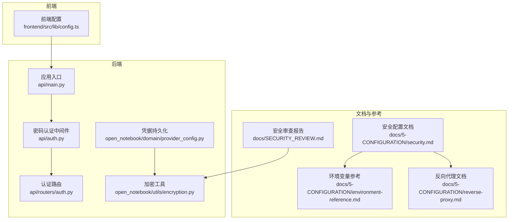
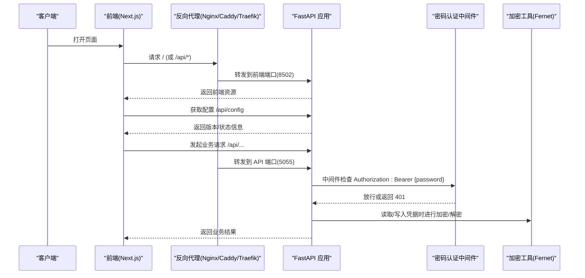
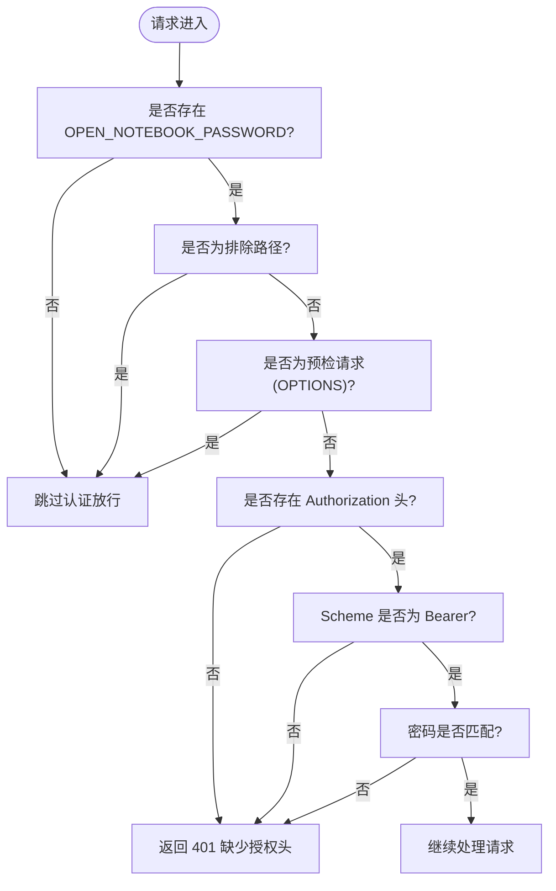
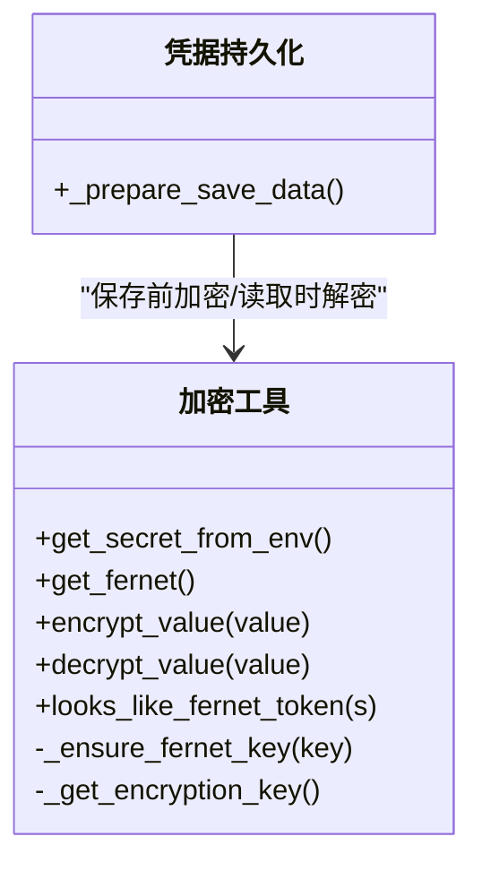
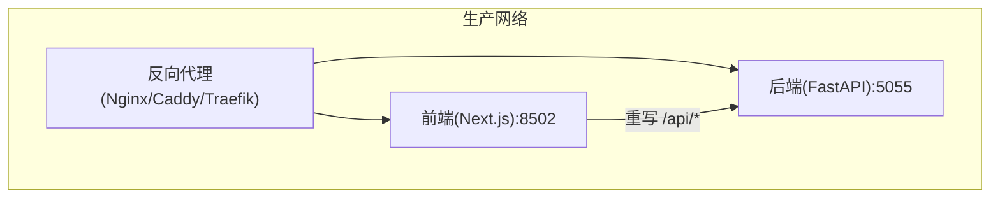
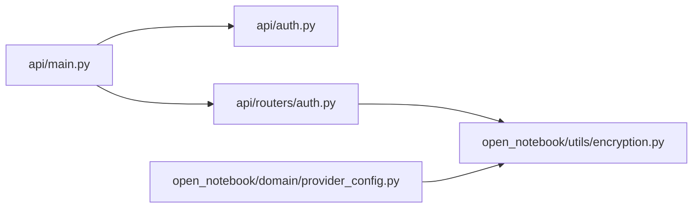

# 安全配置

<cite>
**本文引用的文件**
- [docs/5-CONFIGURATION/security.md](file://docs/5-CONFIGURATION/security.md)
- [docs/5-CONFIGURATION/environment-reference.md](file://docs/5-CONFIGURATION/environment-reference.md)
- [docs/5-CONFIGURATION/reverse-proxy.md](file://docs/5-CONFIGURATION/reverse-proxy.md)
- [docs/SECURITY_REVIEW.md](file://docs/SECURITY_REVIEW.md)
- [api/main.py](file://api/main.py)
- [api/auth.py](file://api/auth.py)
- [api/routers/auth.py](file://api/routers/auth.py)
- [open_notebook/utils/encryption.py](file://open_notebook/utils/encryption.py)
- [open_notebook/domain/provider_config.py](file://open_notebook/domain/provider_config.py)
- [frontend/src/lib/config.ts](file://frontend/src/lib/config.ts)
</cite>

## 目录
1. [简介](#简介)
2. [项目结构](#项目结构)
3. [核心组件](#核心组件)
4. [架构总览](#架构总览)
5. [详细组件分析](#详细组件分析)
6. [依赖关系分析](#依赖关系分析)
7. [性能与安全特性](#性能与安全特性)
8. [故障排查指南](#故障排查指南)
9. [结论](#结论)
10. [附录](#附录)

## 简介
本指南面向生产部署，系统性讲解 Open Notebook 的安全配置与加固实践，覆盖以下主题：
- 密码保护与 API 认证
- 凭据加密与数据安全存储
- 生产环境安全加固（防火墙、反向代理与 SSL）
- 网络安全与访问控制
- 安全审计与监控建议
- 常见威胁防护与应急响应

## 项目结构
Open Notebook 的安全相关能力由后端中间件、认证路由、加密工具与前端配置共同构成，并通过文档化环境变量实现可运维的安全策略。

**图表来源**
- [api/main.py](file://api/main.py#L105-L118)
- [api/auth.py](file://api/auth.py#L12-L76)
- [api/routers/auth.py](file://api/routers/auth.py#L13-L27)
- [open_notebook/utils/encryption.py](file://open_notebook/utils/encryption.py#L115-L126)
- [open_notebook/domain/provider_config.py](file://open_notebook/domain/provider_config.py#L411-L426)
- [frontend/src/lib/config.ts](file://frontend/src/lib/config.ts#L22-L54)
- [docs/5-CONFIGURATION/security.md](file://docs/5-CONFIGURATION/security.md#L1-L397)
- [docs/5-CONFIGURATION/environment-reference.md](file://docs/5-CONFIGURATION/environment-reference.md#L1-L275)
- [docs/5-CONFIGURATION/reverse-proxy.md](file://docs/5-CONFIGURATION/reverse-proxy.md#L1-L800)
- [docs/SECURITY_REVIEW.md](file://docs/SECURITY_REVIEW.md#L1-L97)

**章节来源**
- [api/main.py](file://api/main.py#L105-L118)
- [api/auth.py](file://api/auth.py#L12-L76)
- [open_notebook/utils/encryption.py](file://open_notebook/utils/encryption.py#L115-L126)
- [docs/5-CONFIGURATION/security.md](file://docs/5-CONFIGURATION/security.md#L1-L397)

## 核心组件
- 密码认证中间件：全局拦截请求，校验 Bearer Token（即密码），支持排除路径与 Docker Secrets。
- 认证状态接口：返回是否启用密码保护，便于前端引导登录。
- 加密工具：基于 Fernet 的对称加密，支持任意字符串作为密钥并通过 SHA-256 派生有效密钥；提供加密/解密与令牌形态判定。
- 凭据持久化：在保存前对敏感字段进行加密，读取时透明解密，兼容历史明文数据。
- 反向代理与 SSL：统一入口、TLS 终止、CORS 头透传、长连接超时配置等。
- 前端配置：运行时优先从后端获取 API 地址，其次使用构建期变量或自动推断，避免暴露内部端口。

**章节来源**
- [api/auth.py](file://api/auth.py#L12-L76)
- [api/routers/auth.py](file://api/routers/auth.py#L13-L27)
- [open_notebook/utils/encryption.py](file://open_notebook/utils/encryption.py#L115-L199)
- [open_notebook/domain/provider_config.py](file://open_notebook/domain/provider_config.py#L411-L426)
- [docs/5-CONFIGURATION/reverse-proxy.md](file://docs/5-CONFIGURATION/reverse-proxy.md#L1-L800)
- [frontend/src/lib/config.ts](file://frontend/src/lib/config.ts#L22-L54)

## 架构总览
下图展示从浏览器到后端 API 的认证与加密流程，以及反向代理在生产中的位置。

**图表来源**
- [api/main.py](file://api/main.py#L105-L118)
- [api/auth.py](file://api/auth.py#L30-L75)
- [open_notebook/utils/encryption.py](file://open_notebook/utils/encryption.py#L128-L199)
- [docs/5-CONFIGURATION/reverse-proxy.md](file://docs/5-CONFIGURATION/reverse-proxy.md#L13-L21)

**章节来源**
- [api/main.py](file://api/main.py#L105-L118)
- [api/auth.py](file://api/auth.py#L30-L75)
- [open_notebook/utils/encryption.py](file://open_notebook/utils/encryption.py#L128-L199)
- [docs/5-CONFIGURATION/reverse-proxy.md](file://docs/5-CONFIGURATION/reverse-proxy.md#L13-L21)

## 详细组件分析

### 密码保护与 API 认证
- 全局中间件：对所有 API 请求进行密码校验，支持排除健康检查、文档等路径；支持 Docker Secrets 注入密码。
- 认证格式：Authorization: Bearer {password}。
- 认证状态：/api/auth/status 返回是否启用密码保护。
- 默认行为：未配置密码时跳过校验；文档明确默认密码仅用于开发体验，需在生产中替换。

**图表来源**
- [api/auth.py](file://api/auth.py#L30-L75)

**章节来源**
- [api/auth.py](file://api/auth.py#L12-L76)
- [api/routers/auth.py](file://api/routers/auth.py#L13-L27)
- [docs/5-CONFIGURATION/security.md](file://docs/5-CONFIGURATION/security.md#L139-L170)

### API 凭据加密与数据安全存储
- 加密算法：Fernet 对称加密（AES-128-CBC + HMAC-SHA256）。
- 密钥来源：OPEN_NOTEBOOK_ENCRYPTION_KEY 或其 _FILE 变量；不提供默认值，必须显式配置。
- 密钥派生：任意字符串经 SHA-256 后以 URL 安全 Base64 编码生成有效密钥。
- 加密/解密：保存前加密、读取时解密；对历史明文数据提供优雅回退。
- 凭据持久化：保存前调用加密逻辑，读取时透明解密。

**图表来源**
- [open_notebook/utils/encryption.py](file://open_notebook/utils/encryption.py#L115-L199)
- [open_notebook/domain/provider_config.py](file://open_notebook/domain/provider_config.py#L411-L426)

**章节来源**
- [open_notebook/utils/encryption.py](file://open_notebook/utils/encryption.py#L1-L199)
- [open_notebook/domain/provider_config.py](file://open_notebook/domain/provider_config.py#L411-L426)
- [docs/SECURITY_REVIEW.md](file://docs/SECURITY_REVIEW.md#L14-L24)

### 反向代理与 SSL 配置
- 单端口简化：Next.js 使用重写，仅需代理到前端端口（8502），内部自动转发 /api/* 到后端（5055）。
- SSL 终止：推荐在反向代理层终止 TLS，确保前端使用 https://。
- 超时与长连接：针对长任务（转换、播客生成）设置较长超时。
- CORS 与安全头：正确透传 X-Forwarded-* 头，添加安全响应头（如 X-Frame-Options、Strict-Transport-Security）。
- API 直连：外部集成可直接代理 /api/* 到后端 5055，但浏览器流量通常走单端口方案。

**图表来源**
- [docs/5-CONFIGURATION/reverse-proxy.md](file://docs/5-CONFIGURATION/reverse-proxy.md#L13-L21)
- [docs/5-CONFIGURATION/reverse-proxy.md](file://docs/5-CONFIGURATION/reverse-proxy.md#L196-L254)

**章节来源**
- [docs/5-CONFIGURATION/reverse-proxy.md](file://docs/5-CONFIGURATION/reverse-proxy.md#L1-L800)

### 前端 API 地址解析与安全
- 三段优先级：运行时配置 > 构建期变量 > 自动推断。
- 自动推断：根据 Host/X-Forwarded-Proto 推导 API_URL，避免硬编码端口。
- 重要提示：不要在 API_URL 末尾添加 /api，系统会自动拼接。

**章节来源**
- [frontend/src/lib/config.ts](file://frontend/src/lib/config.ts#L22-L54)
- [docs/5-CONFIGURATION/reverse-proxy.md](file://docs/5-CONFIGURATION/reverse-proxy.md#L133-L157)

## 依赖关系分析
- 应用启动阶段：初始化数据库迁移，同时记录加密密钥是否配置；若未配置则发出警告。
- 中间件注册：先注册密码认证中间件，再注册 CORS 中间件，保证错误响应包含 CORS 头。
- 认证路由：提供 /api/auth/status，支持 Docker Secrets。
- 加密模块：被凭据持久化模块调用，贯穿凭据的保存与读取。

**图表来源**
- [api/main.py](file://api/main.py#L105-L118)
- [api/auth.py](file://api/auth.py#L12-L76)
- [api/routers/auth.py](file://api/routers/auth.py#L13-L27)
- [open_notebook/utils/encryption.py](file://open_notebook/utils/encryption.py#L115-L126)
- [open_notebook/domain/provider_config.py](file://open_notebook/domain/provider_config.py#L411-L426)

**章节来源**
- [api/main.py](file://api/main.py#L55-L96)
- [api/auth.py](file://api/auth.py#L12-L76)
- [api/routers/auth.py](file://api/routers/auth.py#L13-L27)
- [open_notebook/utils/encryption.py](file://open_notebook/utils/encryption.py#L115-L126)
- [open_notebook/domain/provider_config.py](file://open_notebook/domain/provider_config.py#L411-L426)

## 性能与安全特性
- 认证中间件：全局拦截，排除路径与预检请求，避免对静态资源与健康检查造成额外开销。
- 加密性能：Fernet 为对称加密，延迟较低；密钥派生仅在首次使用时发生。
- 反向代理超时：针对长任务调整读写超时，减少因代理默认超时导致的失败。
- 安全限制：当前实现为基础访问控制，不包含会话超时、速率限制、审计日志等企业级特性，生产中应结合反向代理或网关增强。

**章节来源**
- [api/auth.py](file://api/auth.py#L30-L75)
- [open_notebook/utils/encryption.py](file://open_notebook/utils/encryption.py#L104-L113)
- [docs/5-CONFIGURATION/reverse-proxy.md](file://docs/5-CONFIGURATION/reverse-proxy.md#L556-L589)
- [docs/5-CONFIGURATION/security.md](file://docs/5-CONFIGURATION/security.md#L291-L312)

## 故障排查指南
- 密码不生效
  - 检查环境变量是否注入（含 _FILE）。
  - 查看容器日志中与认证相关的条目。
  - 直接测试 /health 与受保护端点。
- 401 未授权
  - 确认 Authorization 头格式为 Bearer {password}。
  - 核对密码长度与内容。
- 无法访问（设置密码后）
  - 清理浏览器缓存与 Cookie，尝试隐私模式。
  - 检查浏览器控制台错误。
- 反向代理问题
  - 确保代理正确转发 /api/* 并透传 X-Forwarded-* 头。
  - 检查 SSL 证书与安全头。
  - 针对 413 文件过大，需在代理层提升 body 限制并返回带 CORS 头的错误。
- API 地址解析异常
  - 检查浏览器控制台输出的配置检测过程。
  - 直接访问 /api/config 验证返回内容。
  - 核对 API_URL 设置。

**章节来源**
- [docs/5-CONFIGURATION/security.md](file://docs/5-CONFIGURATION/security.md#L330-L378)
- [docs/5-CONFIGURATION/reverse-proxy.md](file://docs/5-CONFIGURATION/reverse-proxy.md#L502-L756)
- [frontend/src/lib/config.ts](file://frontend/src/lib/config.ts#L59-L140)

## 结论
Open Notebook 提供了基础而实用的安全能力：密码保护、凭据加密与反向代理 SSL 终止。生产部署应重点落实以下要点：
- 显式配置 OPEN_NOTEBOOK_ENCRYPTION_KEY 与 OPEN_NOTEBOOK_PASSWORD，并使用 Docker Secrets。
- 在反向代理层终止 TLS，正确透传头部并设置长超时。
- 严格限制网络访问，仅开放必要端口，结合防火墙策略。
- 采用企业级增强（如 OAuth、RBAC、速率限制、审计日志）以满足更高合规要求。

## 附录

### 环境变量与安全相关配置要点
- OPEN_NOTEBOOK_ENCRYPTION_KEY：凭据加密密钥（必填），支持 _FILE。
- OPEN_NOTEBOOK_PASSWORD：API 密码（可选，默认开发体验），支持 _FILE。
- API_URL：前端访问后端的公共地址（HTTPS），用于反向代理场景。
- 反向代理端口：8502（前端）与 5055（后端），或按需直连 API。

**章节来源**
- [docs/5-CONFIGURATION/environment-reference.md](file://docs/5-CONFIGURATION/environment-reference.md#L7-L18)
- [docs/5-CONFIGURATION/reverse-proxy.md](file://docs/5-CONFIGURATION/reverse-proxy.md#L117-L130)