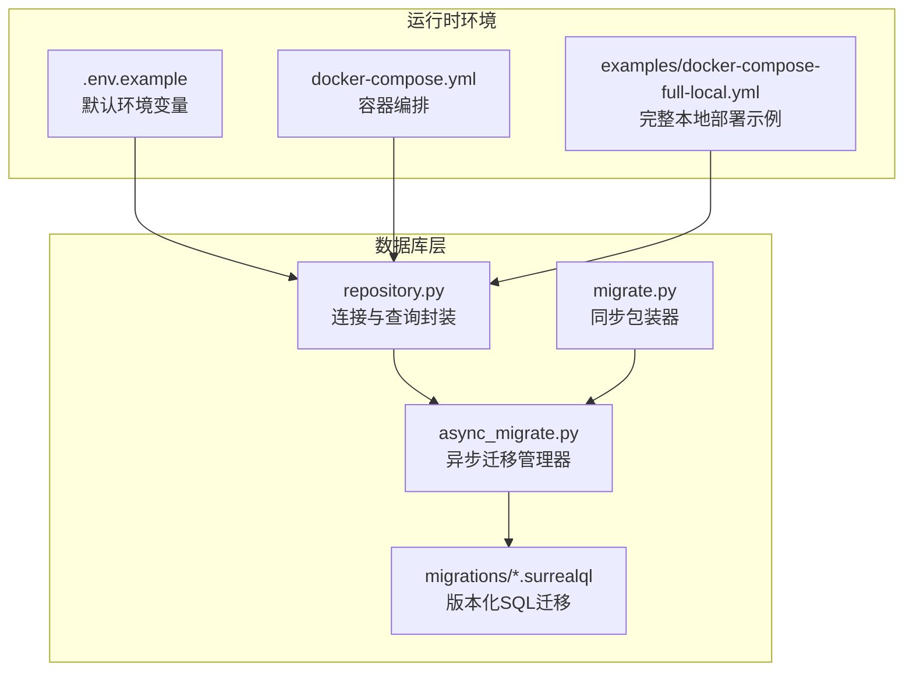
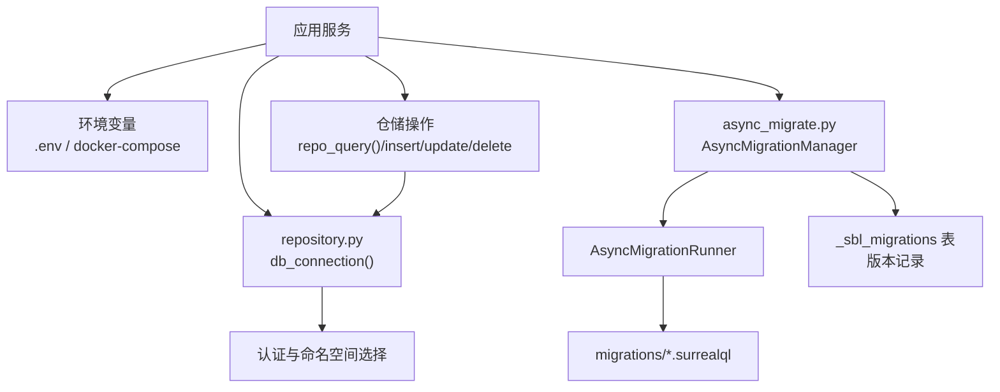
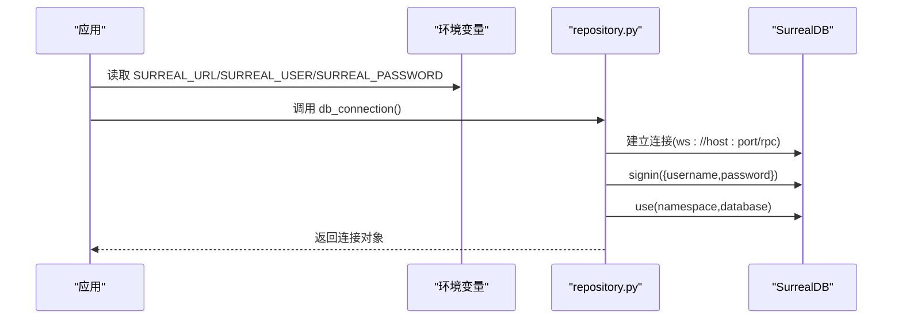
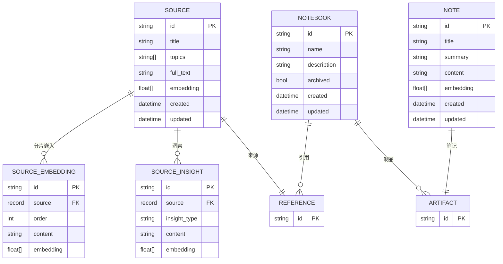
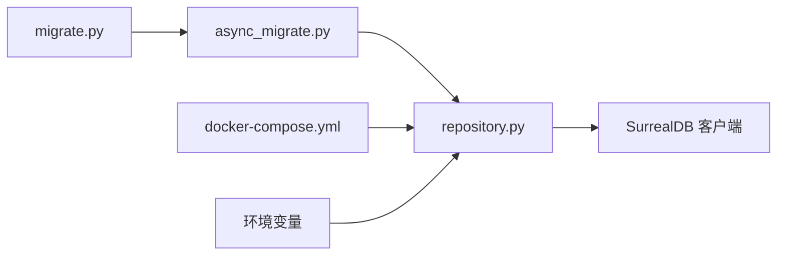

# 数据库配置

<cite>
**本文引用的文件**
- [repository.py](file://open_notebook/database/repository.py)
- [async_migrate.py](file://open_notebook/database/async_migrate.py)
- [migrate.py](file://open_notebook/database/migrate.py)
- [.env.example](file://.env.example)
- [docker-compose.yml](file://docker-compose.yml)
- [database.md](file://docs/5-CONFIGURATION/database.md)
- [environment-reference.md](file://docs/5-CONFIGURATION/environment-reference.md)
- [connection-issues.md](file://docs/6-TROUBLESHOOTING/connection-issues.md)
- [docker-compose-full-local.yml](file://examples/docker-compose-full-local.yml)
- [1.surrealql](file://open_notebook/database/migrations/1.surrealql)
- [1_down.surrealql](file://open_notebook/database/migrations/1_down.surrealql)
</cite>

## 目录
1. [简介](#简介)
2. [项目结构](#项目结构)
3. [核心组件](#核心组件)
4. [架构总览](#架构总览)
5. [详细组件分析](#详细组件分析)
6. [依赖关系分析](#依赖关系分析)
7. [性能考虑](#性能考虑)
8. [故障排除指南](#故障排除指南)
9. [结论](#结论)
10. [附录](#附录)

## 简介
本指南聚焦于 SurrealDB 数据库在项目中的配置与使用，涵盖连接配置、连接字符串格式、主机名设置、数据库与命名空间（Namespace）及认证配置，并提供本地开发、Docker 部署与远程服务器等多场景的配置示例。同时，文档解释了数据库迁移机制与版本管理、性能优化建议与监控方法，以及常见连接问题的排查步骤。

## 项目结构
围绕数据库配置的关键文件与目录如下：
- 连接与认证：open_notebook/database/repository.py
- 迁移系统：open_notebook/database/async_migrate.py、open_notebook/database/migrate.py
- 环境变量与默认值：.env.example、docs/5-CONFIGURATION/database.md、docs/5-CONFIGURATION/environment-reference.md
- 部署示例：docker-compose.yml、examples/docker-compose-full-local.yml
- 迁移脚本：open_notebook/database/migrations/*.surrealql

图表来源
- [repository.py](file://open_notebook/database/repository.py#L12-L63)
- [async_migrate.py](file://open_notebook/database/async_migrate.py#L91-L163)
- [migrate.py](file://open_notebook/database/migrate.py#L6-L27)
- [docker-compose.yml](file://docker-compose.yml#L1-L37)
- [database.md](file://docs/5-CONFIGURATION/database.md#L1-L51)

章节来源
- [repository.py](file://open_notebook/database/repository.py#L12-L63)
- [docker-compose.yml](file://docker-compose.yml#L1-L37)
- [database.md](file://docs/5-CONFIGURATION/database.md#L1-L51)

## 核心组件
- 数据库连接与认证
  - 通过环境变量读取连接参数，自动完成登录与命名空间/数据库选择。
  - 支持旧版回退逻辑（兼容历史环境变量）。
- 查询与仓储操作
  - 统一封装查询、插入、更新、删除、关联等操作，统一处理记录 ID 转换与错误日志。
- 异步迁移系统
  - 基于官方 Python 客户端的异步迁移框架，支持按版本顺序执行 up/down 迁移，并维护内部版本表。
- 版本管理
  - 通过内部表记录当前版本号，支持“提升版本”和“降低版本”，确保数据库结构与应用一致。

章节来源
- [repository.py](file://open_notebook/database/repository.py#L12-L63)
- [repository.py](file://open_notebook/database/repository.py#L65-L195)
- [async_migrate.py](file://open_notebook/database/async_migrate.py#L91-L163)
- [async_migrate.py](file://open_notebook/database/async_migrate.py#L191-L229)
- [migrate.py](file://open_notebook/database/migrate.py#L6-L27)

## 架构总览
下图展示了数据库配置与迁移在系统中的交互关系：

图表来源
- [repository.py](file://open_notebook/database/repository.py#L47-L63)
- [async_migrate.py](file://open_notebook/database/async_migrate.py#L52-L89)
- [async_migrate.py](file://open_notebook/database/async_migrate.py#L91-L163)
- [async_migrate.py](file://open_notebook/database/async_migrate.py#L191-L229)

## 详细组件分析

### 数据库连接与认证
- 连接字符串格式
  - 默认使用 WebSocket RPC 地址，形如 ws://主机:端口/rpc。
  - 在 Docker 网络中推荐使用服务名作为主机名；在宿主机直连时使用宿主机 IP 或 host.docker.internal。
- 主机名与网络
  - Docker 环境中，服务间通过服务名通信；跨主机或远程访问需暴露端口并正确设置 API_URL。
- 认证与命名空间
  - 登录凭据来自环境变量；登录后选择命名空间与数据库，后续所有查询均作用于此上下文。
- 回退与兼容
  - 提供旧版环境变量的回退逻辑，保证向后兼容。

图表来源
- [repository.py](file://open_notebook/database/repository.py#L47-L63)
- [database.md](file://docs/5-CONFIGURATION/database.md#L16-L46)
- [.env.example](file://.env.example#L16-L21)

章节来源
- [repository.py](file://open_notebook/database/repository.py#L12-L63)
- [database.md](file://docs/5-CONFIGURATION/database.md#L12-L46)
- [.env.example](file://.env.example#L16-L21)

### 数据库、命名空间与认证配置
- 必填项
  - SURREAL_URL、SURREAL_USER、SURREAL_PASSWORD、SURREAL_NAMESPACE、SURREAL_DATABASE。
- 默认值与示例
  - 示例文件与 Docker 编排提供了默认值，适用于单机与 Docker 环境。
- 多实例与多命名空间
  - 可在同一实例内使用多个命名空间与数据库，便于多用户或多环境隔离。

章节来源
- [environment-reference.md](file://docs/5-CONFIGURATION/environment-reference.md#L22-L31)
- [database.md](file://docs/5-CONFIGURATION/database.md#L48-L51)
- [.env.example](file://.env.example#L16-L21)
- [docker-compose.yml](file://docker-compose.yml#L25-L30)

### 不同部署场景下的配置示例
- 本地开发（.env）
  - 使用本地回环地址或 host.docker.internal 指向宿主机上的数据库。
- Docker 单机（推荐）
  - 使用服务名作为主机名，端口映射到宿主机。
- 完整本地 AI 设置（含 Ollama、Speaches）
  - 同时运行 SurrealDB、Ollama、Speaches 与 Open Notebook，适合离线与隐私优先场景。
- 远程服务器
  - 需要正确暴露端口、配置防火墙、设置 API_URL，并确保网络可达。

章节来源
- [database.md](file://docs/5-CONFIGURATION/database.md#L16-L46)
- [docker-compose.yml](file://docker-compose.yml#L1-L37)
- [docker-compose-full-local.yml](file://examples/docker-compose-full-local.yml#L28-L95)

### 数据库迁移机制与版本管理
- 迁移入口
  - 同步包装器调用异步迁移管理器，后者负责加载 up/down 迁移列表并执行。
- 执行流程
  - 读取当前版本，按序执行待处理的 up 迁移；每个迁移执行后更新版本表；支持回滚单个 down 迁移。
- 版本表
  - 内部表记录每个版本的记录，包含版本号与应用时间，用于判断是否需要迁移。

图表来源
- [async_migrate.py](file://open_notebook/database/async_migrate.py#L66-L89)
- [async_migrate.py](file://open_notebook/database/async_migrate.py#L174-L189)
- [async_migrate.py](file://open_notebook/database/async_migrate.py#L214-L229)

章节来源
- [migrate.py](file://open_notebook/database/migrate.py#L6-L27)
- [async_migrate.py](file://open_notebook/database/async_migrate.py#L91-L163)
- [async_migrate.py](file://open_notebook/database/async_migrate.py#L191-L229)

### 数据模型与索引（基于迁移脚本）
- 主要实体
  - source、source_embedding、source_insight、note、notebook、reference（关系）、artifact（关系）、podcast_config。
- 关键字段与索引
  - 文本搜索索引（BM25 + Snowball 英文过滤器），向量相似度函数，事件触发器等。
- 函数
  - 文本搜索与向量相似度检索函数，支持聚合与排序。

图表来源
- [1.surrealql](file://open_notebook/database/migrations/1.surrealql#L2-L72)
- [1.surrealql](file://open_notebook/database/migrations/1.surrealql#L54-L61)

章节来源
- [1.surrealql](file://open_notebook/database/migrations/1.surrealql#L2-L72)
- [1.surrealql](file://open_notebook/database/migrations/1.surrealql#L74-L173)
- [1_down.surrealql](file://open_notebook/database/migrations/1_down.surrealql#L1-L25)

## 依赖关系分析
- 组件耦合
  - repository.py 对 SurrealDB 客户端进行封装，向上提供统一的仓储接口。
  - async_migrate.py 依赖 repository 的查询能力以读写版本表。
  - migrate.py 为历史兼容提供同步调用入口。
- 外部依赖
  - SurrealDB 官方 Python 客户端。
  - Docker Compose（用于容器化部署）。

图表来源
- [repository.py](file://open_notebook/database/repository.py#L47-L63)
- [async_migrate.py](file://open_notebook/database/async_migrate.py#L10-L10)
- [migrate.py](file://open_notebook/database/migrate.py#L3-L3)
- [docker-compose.yml](file://docker-compose.yml#L25-L30)

章节来源
- [repository.py](file://open_notebook/database/repository.py#L47-L63)
- [async_migrate.py](file://open_notebook/database/async_migrate.py#L10-L10)
- [migrate.py](file://open_notebook/database/migrate.py#L3-L3)
- [docker-compose.yml](file://docker-compose.yml#L25-L30)

## 性能考虑
- 并发与重试
  - 通过环境变量控制最大并发任务数与重试策略，有助于缓解瞬时冲突与网络抖动。
- 索引与搜索
  - 迁移脚本定义了全文检索索引与向量相似度函数，合理使用可显著提升检索性能。
- 网络与端口
  - 确保数据库端口在容器与宿主机之间正确映射，避免超时与连接失败。
- 监控与调试
  - 结合日志输出与健康检查端点，定位慢请求与异常。

章节来源
- [environment-reference.md](file://docs/5-CONFIGURATION/environment-reference.md#L34-L51)
- [1.surrealql](file://open_notebook/database/migrations/1.surrealql#L65-L72)
- [connection-issues.md](file://docs/6-TROUBLESHOOTING/connection-issues.md#L148-L176)

## 故障排除指南
- “无法连接到服务器”
  - 检查服务状态、端口映射、API_URL 与前端访问路径一致性。
- 连接被拒绝
  - 排查端口监听、服务崩溃与错误日志，必要时重启服务。
- 超时与慢连接
  - 观察资源占用与日志，适当降低并发或延长超时。
- 间歇性断开
  - 开启重试与降低并发，检查网络稳定性。
- 远程访问
  - 获取服务器 IP、开放防火墙端口、验证端口映射与路由配置。
- CORS 与证书
  - 确保前后端 URL 协议与端口一致；自签名证书可通过自定义 CA 或仅在受信网络使用 HTTP。

章节来源
- [connection-issues.md](file://docs/6-TROUBLESHOOTING/connection-issues.md#L7-L320)

## 结论
通过明确的环境变量配置、容器化部署示例与完善的迁移机制，系统能够在多种场景下稳定运行。建议在生产环境中强化安全与监控，合理设置并发与重试策略，并利用内置迁移工具保障数据库结构演进的一致性与可追溯性。

## 附录
- 环境变量参考
  - 数据库相关：SURREAL_URL、SURREAL_USER、SURREAL_PASSWORD、SURREAL_NAMESPACE、SURREAL_DATABASE。
  - 连接重试与并发：SURREAL_COMMANDS_RETRY_ENABLED、SURREAL_COMMANDS_RETRY_MAX_ATTEMPTS、SURREAL_COMMANDS_MAX_TASKS。
- 迁移脚本位置
  - open_notebook/database/migrations/1.surrealql、open_notebook/database/migrations/1_down.surrealql 等。

章节来源
- [environment-reference.md](file://docs/5-CONFIGURATION/environment-reference.md#L22-L51)
- [1.surrealql](file://open_notebook/database/migrations/1.surrealql#L1-L179)
- [1_down.surrealql](file://open_notebook/database/migrations/1_down.surrealql#L1-L25)