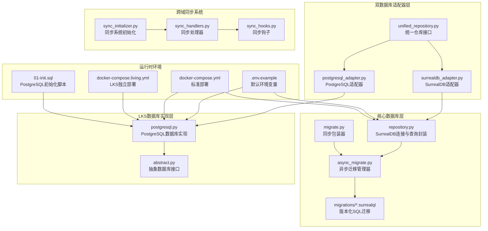
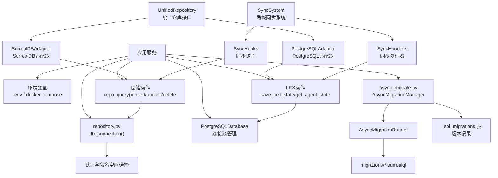
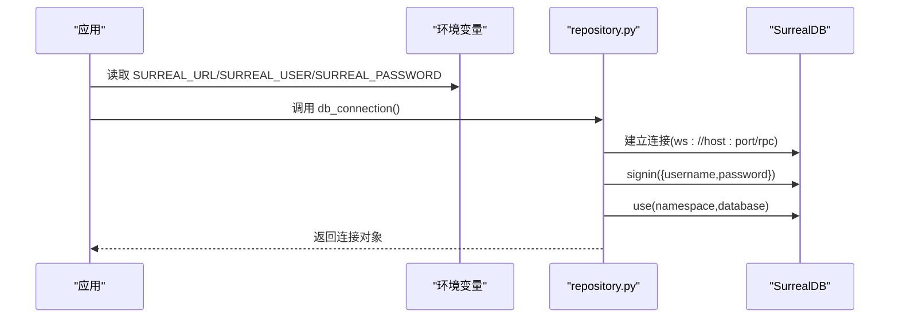
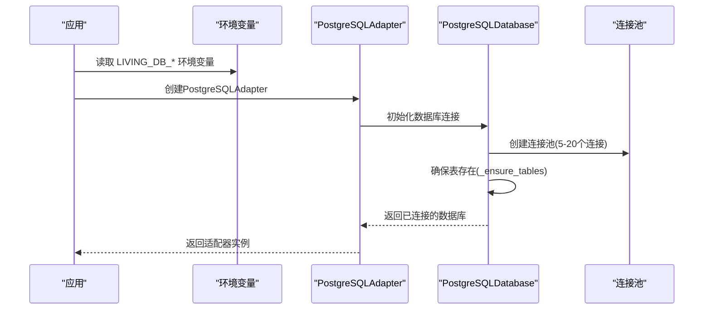
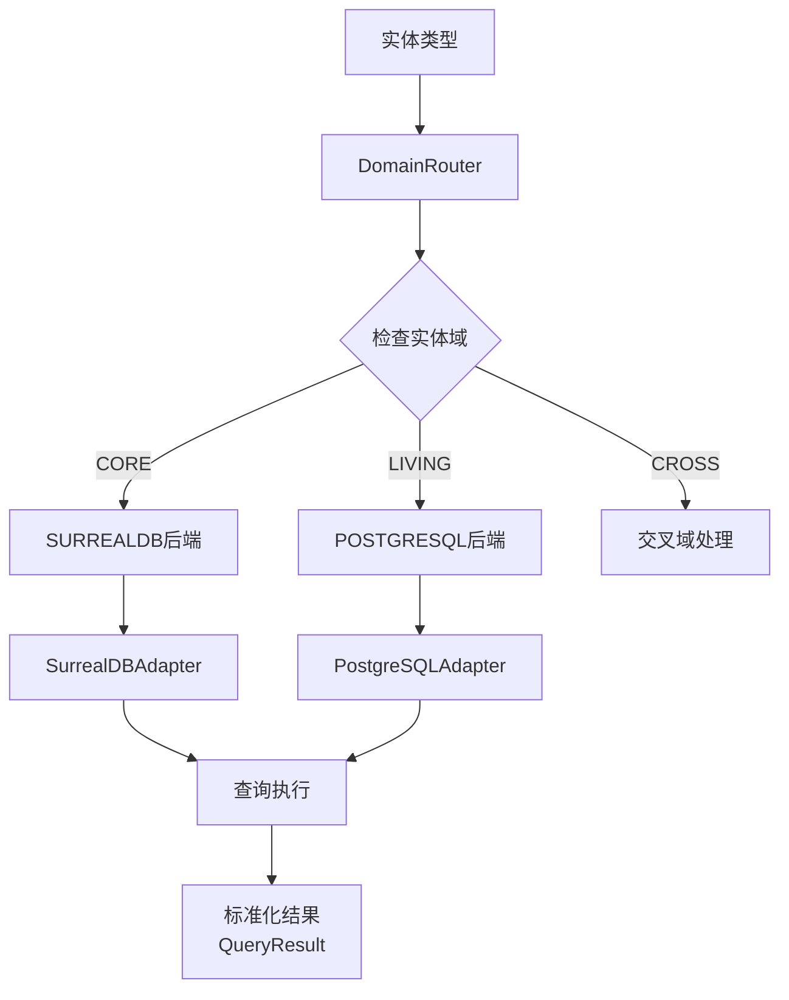
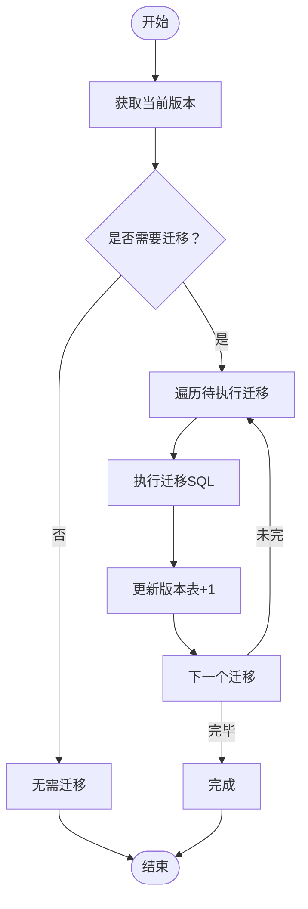
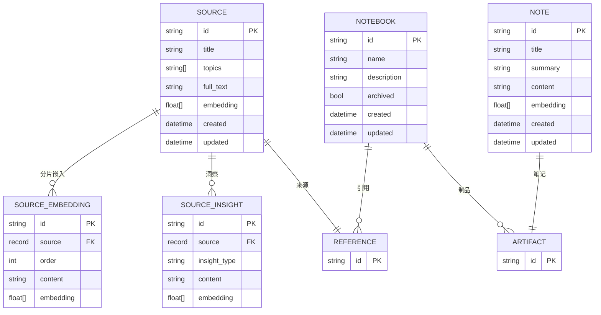
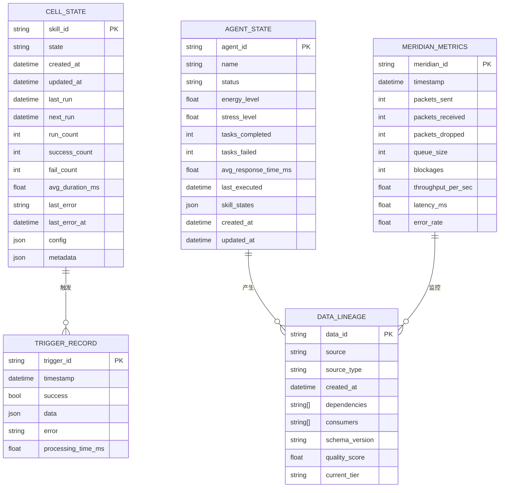
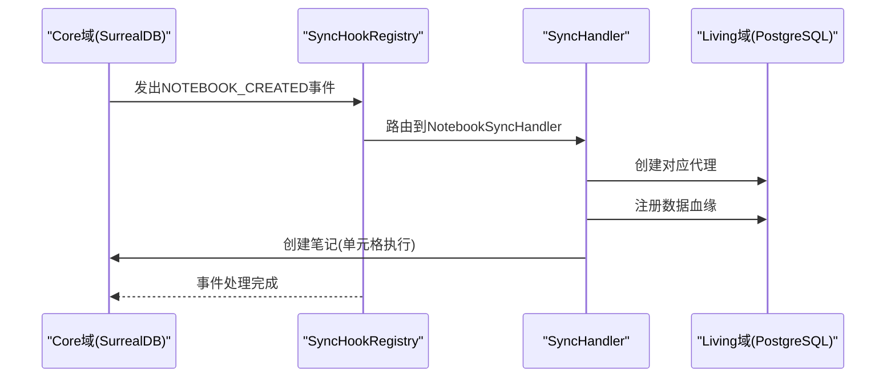
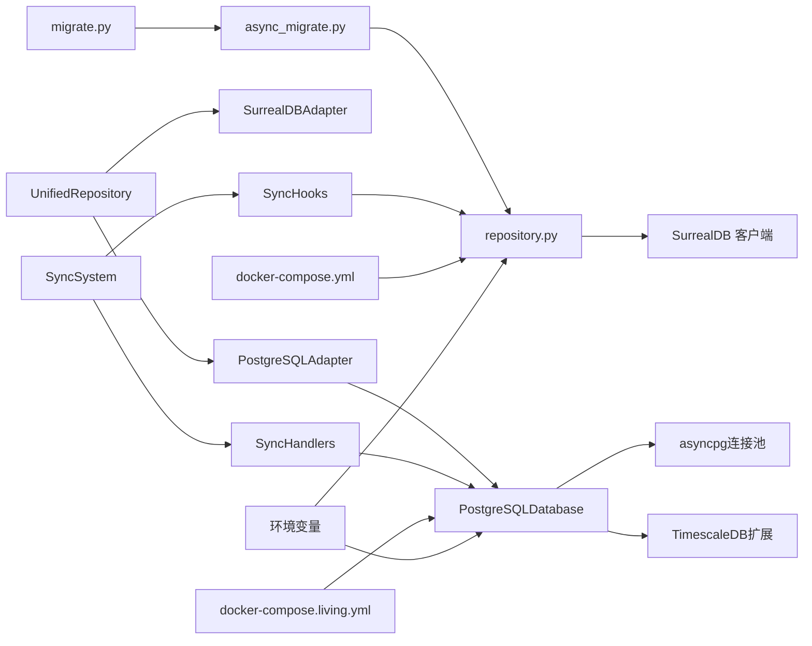

# 数据库配置

<cite>
**本文引用的文件**
- [repository.py](file://open_notebook/database/repository.py)
- [async_migrate.py](file://open_notebook/database/async_migrate.py)
- [migrate.py](file://open_notebook/database/migrate.py)
- [postgresql_adapter.py](file://open_notebook/database/postgresql_adapter.py)
- [unified_repository.py](file://open_notebook/database/unified_repository.py)
- [surrealdb_adapter.py](file://open_notebook/database/surrealdb_adapter.py)
- [postgresql.py](file://open_notebook/skills/living/database/postgresql.py)
- [abstract.py](file://open_notebook/skills/living/database/abstract.py)
- [sync_handlers.py](file://open_notebook/database/sync_handlers.py)
- [sync_hooks.py](file://open_notebook/database/sync_hooks.py)
- [sync_initializer.py](file://open_notebook/database/sync_initializer.py)
- [docker-compose.living.yml](file://docker-compose.living.yml)
- [.env.example](file://.env.example)
- [docker-compose.yml](file://docker-compose.yml)
- [database.md](file://docs/5-CONFIGURATION/database.md)
- [environment-reference.md](file://docs/5-CONFIGURATION/environment-reference.md)
- [connection-issues.md](file://docs/6-TROUBLESHOOTING/connection-issues.md)
- [docker-compose-full-local.yml](file://examples/docker-compose-full-local.yml)
- [01-init.sql](file://init-scripts/01-init.sql)
- [1.surrealql](file://open_notebook/database/migrations/1.surrealql)
- [1_down.surrealql](file://open_notebook/database/migrations/1_down.surrealql)
</cite>

## 更新摘要
**变更内容**
- 新增LKS数据库实体模型章节，详细介绍CellState、AgentState、MeridianMetrics、TriggerRecord、DataLineage
- 新增跨域同步系统配置，包括SyncSystem、SyncHandler、SyncEvent等组件
- 更新双数据库架构支持，包括SurrealDB和PostgreSQL的协同工作
- 新增LKS数据库部署配置和环境变量说明
- 添加Living Knowledge System的独立部署方案

## 目录
1. [简介](#简介)
2. [项目结构](#项目结构)
3. [核心组件](#核心组件)
4. [架构总览](#架构总览)
5. [详细组件分析](#详细组件分析)
6. [依赖关系分析](#依赖关系分析)
7. [性能考虑](#性能考虑)
8. [故障排除指南](#故障排除指南)
9. [结论](#结论)
10. [附录](#附录)

## 简介
本指南聚焦于Open Notebook项目的双数据库架构配置与使用，涵盖SurrealDB和PostgreSQL数据库的连接配置、连接字符串格式、主机名设置、数据库与命名空间（Namespace）及认证配置。文档详细说明了数据库、命名空间和认证配置，提供了本地开发、Docker部署与远程服务器等多场景的配置示例。同时，解释了数据库迁移机制与版本管理、性能优化建议与监控方法，以及常见连接问题的排查步骤。

**更新** 新增了LKS数据库实体模型和跨域同步系统的配置说明，反映了项目中新增的Living Knowledge System (LKS) 数据库集成，实现了SurrealDB和PostgreSQL的双数据库架构支持。

## 项目结构
围绕数据库配置的关键文件与目录如下：
- 核心数据库连接：open_notebook/database/repository.py
- 迁移系统：open_notebook/database/async_migrate.py、open_notebook/database/migrate.py
- 双数据库适配器：open_notebook/database/postgresql_adapter.py、open_notebook/database/surrealdb_adapter.py
- 统一仓库层：open_notebook/database/unified_repository.py
- LKS数据库实现：open_notebook/skills/living/database/postgresql.py
- LKS抽象接口：open_notebook/skills/living/database/abstract.py
- 跨域同步系统：open_notebook/database/sync_handlers.py、open_notebook/database/sync_hooks.py、open_notebook/database/sync_initializer.py
- 环境变量与默认值：.env.example、docs/5-CONFIGURATION/database.md、docs/5-CONFIGURATION/environment-reference.md
- 部署示例：docker-compose.yml、docker-compose.living.yml、examples/docker-compose-full-local.yml
- 迁移脚本：open_notebook/database/migrations/*.surrealql
- 初始化脚本：init-scripts/01-init.sql

**图表来源**
- [repository.py](file://open_notebook/database/repository.py#L12-L63)
- [async_migrate.py](file://open_notebook/database/async_migrate.py#L91-L163)
- [migrate.py](file://open_notebook/database/migrate.py#L6-L27)
- [postgresql_adapter.py](file://open_notebook/database/postgresql_adapter.py#L1-L364)
- [unified_repository.py](file://open_notebook/database/unified_repository.py#L1-L548)
- [docker-compose.yml](file://docker-compose.yml#L1-L37)
- [docker-compose.living.yml](file://docker-compose.living.yml#L1-L148)

**章节来源**
- [repository.py](file://open_notebook/database/repository.py#L12-L63)
- [docker-compose.yml](file://docker-compose.yml#L1-L37)
- [docker-compose.living.yml](file://docker-compose.living.yml#L1-L148)
- [database.md](file://docs/5-CONFIGURATION/database.md#L1-L51)

## 核心组件
- **SurrealDB数据库连接与认证**
  - 通过环境变量读取连接参数，自动完成登录与命名空间/数据库选择。
  - 支持旧版回退逻辑（兼容历史环境变量）。
- **PostgreSQL数据库连接与认证**
  - 使用独立的环境变量配置，支持TimescaleDB扩展和时序数据存储。
  - 提供连接池管理和自动表创建功能。
- **统一仓库接口**
  - 统一SurrealDB和PostgreSQL的数据库操作接口。
  - 自动路由实体类型到相应的数据库后端。
- **查询与仓储操作**
  - 统一封装查询、插入、更新、删除、关联等操作，统一处理记录 ID 转换与错误日志。
- **异步迁移系统**
  - 基于官方 Python 客户端的异步迁移框架，支持按版本顺序执行 up/down 迁移，并维护内部版本表。
- **版本管理**
  - 通过内部表记录当前版本号，支持"提升版本"和"降低版本"，确保数据库结构与应用一致。
- **跨域同步系统**
  - 实现Core（SurrealDB）与Living（PostgreSQL）之间的事件驱动同步。
  - 支持笔记本、源、单元格执行等事件的自动同步。

**章节来源**
- [repository.py](file://open_notebook/database/repository.py#L12-L63)
- [repository.py](file://open_notebook/database/repository.py#L65-L195)
- [postgresql_adapter.py](file://open_notebook/database/postgresql_adapter.py#L17-L364)
- [unified_repository.py](file://open_notebook/database/unified_repository.py#L323-L548)
- [async_migrate.py](file://open_notebook/database/async_migrate.py#L91-L163)
- [async_migrate.py](file://open_notebook/database/async_migrate.py#L191-L229)
- [migrate.py](file://open_notebook/database/migrate.py#L6-L27)
- [sync_handlers.py](file://open_notebook/database/sync_handlers.py#L1-L492)
- [sync_hooks.py](file://open_notebook/database/sync_hooks.py#L1-L294)
- [sync_initializer.py](file://open_notebook/database/sync_initializer.py#L1-L289)

## 架构总览
下图展示了Open Notebook项目的双数据库架构在系统中的交互关系：

**图表来源**
- [repository.py](file://open_notebook/database/repository.py#L47-L63)
- [postgresql_adapter.py](file://open_notebook/database/postgresql_adapter.py#L37-L50)
- [unified_repository.py](file://open_notebook/database/unified_repository.py#L323-L376)
- [async_migrate.py](file://open_notebook/database/async_migrate.py#L52-L89)
- [async_migrate.py](file://open_notebook/database/async_migrate.py#L91-L163)
- [async_migrate.py](file://open_notebook/database/async_migrate.py#L191-L229)
- [sync_initializer.py](file://open_notebook/database/sync_initializer.py#L49-L237)

## 详细组件分析

### SurrealDB数据库连接与认证
- **连接字符串格式**
  - 默认使用 WebSocket RPC 地址，形如 ws://主机:端口/rpc。
  - 在 Docker 网络中推荐使用服务名作为主机名；在宿主机直连时使用宿主机 IP 或 host.docker.internal。
- **主机名与网络**
  - Docker 环境中，服务间通过服务名通信；跨主机或远程访问需暴露端口并正确设置 API_URL。
- **认证与命名空间**
  - 登录凭据来自环境变量；登录后选择命名空间与数据库，后续所有查询均作用于此上下文。
- **回退与兼容**
  - 提供旧版环境变量的回退逻辑，保证向后兼容。

**图表来源**
- [repository.py](file://open_notebook/database/repository.py#L47-L63)
- [database.md](file://docs/5-CONFIGURATION/database.md#L16-L46)
- [.env.example](file://.env.example#L16-L21)

**章节来源**
- [repository.py](file://open_notebook/database/repository.py#L12-L63)
- [database.md](file://docs/5-CONFIGURATION/database.md#L12-L46)
- [.env.example](file://.env.example#L16-L21)

### PostgreSQL数据库连接与认证
- **连接配置**
  - 使用独立的环境变量：LIVING_DB_HOST、LIVING_DB_PORT、LIVING_DB_NAME、LIVING_DB_USER、LIVING_DB_PASSWORD。
  - 默认端口为5433（避免与宿主机其他PostgreSQL实例冲突）。
- **数据库特性**
  - 基于TimescaleDB 2.11+，支持时序数据和向量嵌入。
  - 使用asyncpg连接池，支持5-20个并发连接。
- **初始化脚本**
  - 自动启用uuid-ossp和pg_stat_statements扩展。
  - 创建living模式并设置搜索路径。
- **实体模型**
  - 支持细胞状态、代理状态、经络指标、触发记录和数据血缘追踪。

**图表来源**
- [postgresql_adapter.py](file://open_notebook/database/postgresql_adapter.py#L331-L364)
- [postgresql.py](file://open_notebook/skills/living/database/postgresql.py#L48-L65)
- [01-init.sql](file://init-scripts/01-init.sql#L1-L28)

**章节来源**
- [postgresql_adapter.py](file://open_notebook/database/postgresql_adapter.py#L17-L364)
- [postgresql.py](file://open_notebook/skills/living/database/postgresql.py#L28-L698)
- [docker-compose.living.yml](file://docker-compose.living.yml#L14-L35)
- [01-init.sql](file://init-scripts/01-init.sql#L1-L28)

### 统一仓库接口与双数据库路由
- **实体域映射**
  - 核心域（SurrealDB）：notebook、source、note、chat_session、insight、transformation、workflow。
  - LKS域（PostgreSQL）：cell、agent、meridian_metrics、trigger_record、data_lineage。
  - 交叉域：search_result、activity_feed。
- **自动路由**
  - 根据实体类型自动选择合适的数据库后端。
  - 支持跨域查询的聚合处理。
- **查询结果标准化**
  - 统一返回QueryResult包装器，包含数据、来源后端和查询耗时信息。

**图表来源**
- [unified_repository.py](file://open_notebook/database/unified_repository.py#L194-L244)
- [unified_repository.py](file://open_notebook/database/unified_repository.py#L323-L492)

**章节来源**
- [unified_repository.py](file://open_notebook/database/unified_repository.py#L36-L47)
- [unified_repository.py](file://open_notebook/database/unified_repository.py#L194-L244)
- [unified_repository.py](file://open_notebook/database/unified_repository.py#L323-L492)

### 数据库、命名空间与认证配置
- **SurrealDB必填项**
  - SURREAL_URL、SURREAL_USER、SURREAL_PASSWORD、SURREAL_NAMESPACE、SURREAL_DATABASE。
- **PostgreSQL必填项**
  - LIVING_DB_HOST、LIVING_DB_PORT、LIVING_DB_NAME、LIVING_DB_USER、LIVING_DB_PASSWORD。
- **默认值与示例**
  - 示例文件与 Docker 编排提供了默认值，适用于单机与 Docker 环境。
- **多实例与多命名空间**
  - 可在同一实例内使用多个命名空间与数据库，便于多用户或多环境隔离。

**章节来源**
- [environment-reference.md](file://docs/5-CONFIGURATION/environment-reference.md#L22-L31)
- [database.md](file://docs/5-CONFIGURATION/database.md#L48-L51)
- [.env.example](file://.env.example#L16-L21)
- [docker-compose.yml](file://docker-compose.yml#L25-L30)
- [docker-compose.living.yml](file://docker-compose.living.yml#L47-L52)

### 不同部署场景下的配置示例
- **本地开发（.env）**
  - 使用本地回环地址或 host.docker.internal 指向宿主机上的数据库。
- **Docker单机（推荐）**
  - 使用服务名作为主机名，端口映射到宿主机。
- **LKS独立部署**
  - 独立的Living Knowledge System服务，使用TimescaleDB和pgVector扩展。
- **完整本地 AI 设置（含 Ollama、Speaches）**
  - 同时运行 SurrealDB、Ollama、Speaches 与 Open Notebook，适合离线与隐私优先场景。
- **远程服务器**
  - 需要正确暴露端口、配置防火墙、设置 API_URL，并确保网络可达。

**章节来源**
- [database.md](file://docs/5-CONFIGURATION/database.md#L16-L46)
- [docker-compose.yml](file://docker-compose.yml#L1-L37)
- [docker-compose.living.yml](file://docker-compose.living.yml#L1-L148)
- [docker-compose-full-local.yml](file://examples/docker-compose-full-local.yml#L28-L95)

### 数据库迁移机制与版本管理
- **迁移入口**
  - 同步包装器调用异步迁移管理器，后者负责加载 up/down 迁移列表并执行。
- **执行流程**
  - 读取当前版本，按序执行待处理的 up 迁移；每个迁移执行后更新版本表；支持回滚单个 down 迁移。
- **版本表**
  - 内部表记录每个版本的记录，包含版本号与应用时间，用于判断是否需要迁移。

**图表来源**
- [async_migrate.py](file://open_notebook/database/async_migrate.py#L66-L89)
- [async_migrate.py](file://open_notebook/database/async_migrate.py#L174-L189)
- [async_migrate.py](file://open_notebook/database/async_migrate.py#L214-L229)

**章节来源**
- [migrate.py](file://open_notebook/database/migrate.py#L6-L27)
- [async_migrate.py](file://open_notebook/database/async_migrate.py#L91-L163)
- [async_migrate.py](file://open_notebook/database/async_migrate.py#L191-L229)

### 数据模型与索引（基于迁移脚本）
- **主要实体**
  - source、source_embedding、source_insight、note、notebook、reference（关系）、artifact（关系）、podcast_config。
- **关键字段与索引**
  - 文本搜索索引（BM25 + Snowball 英文过滤器），向量相似度函数，事件触发器等。
- **函数**
  - 文本搜索与向量相似度检索函数，支持聚合与排序。

**图表来源**
- [1.surrealql](file://open_notebook/database/migrations/1.surrealql#L2-L72)
- [1.surrealql](file://open_notebook/database/migrations/1.surrealql#L54-L61)

**章节来源**
- [1.surrealql](file://open_notebook/database/migrations/1.surrealql#L2-L72)
- [1.surrealql](file://open_notebook/database/migrations/1.surrealql#L74-L173)
- [1_down.surrealql](file://open_notebook/database/migrations/1_down.surrealql#L1-L25)

### LKS数据库实体模型
- **核心实体**
  - CellState：技能细胞状态，包含运行统计和配置信息。
  - AgentState：代理组织状态，包含能量水平和压力指标。
  - MeridianMetrics：经络流量指标，支持时序数据存储。
  - TriggerRecord：触发记录，跟踪系统事件激活。
  - DataLineage：数据血缘追踪，管理数据生命周期。
- **时序数据支持**
  - 使用TimescaleDB扩展，支持时间序列数据的高效存储和查询。
  - 自动清理过期数据，支持数据分层存储（热、温、冷、冻结）。
- **连接池管理**
  - 默认5-20个连接，60秒命令超时，支持异步操作。

**图表来源**
- [abstract.py](file://open_notebook/skills/living/database/abstract.py#L22-L96)
- [postgresql.py](file://open_notebook/skills/living/database/postgresql.py#L67-L683)

**章节来源**
- [abstract.py](file://open_notebook/skills/living/database/abstract.py#L22-L258)
- [postgresql.py](file://open_notebook/skills/living/database/postgresql.py#L67-L683)

### 跨域同步系统配置
- **同步事件类型**
  - Core域事件：NOTEBOOK_CREATED、NOTEBOOK_UPDATED、NOTEBOOK_DELETED、SOURCE_CREATED、SOURCE_UPDATED、SOURCE_DELETED、NOTE_CREATED、NOTE_UPDATED、NOTE_DELETED。
  - Living域事件：CELL_COMPLETED、CELL_FAILED、AGENT_ACTIVATED、DATA_TIER_CHANGED。
- **同步处理器**
  - NotebookSyncHandler：笔记本与代理的同步。
  - SourceSyncHandler：源与数据血缘的同步。
  - CellExecutionSyncHandler：单元格执行结果与笔记的同步。
- **事件注册与路由**
  - 通过SyncHookRegistry实现事件的发布订阅模式。
  - SyncSystem负责初始化、注册处理器和事件路由。

**图表来源**
- [sync_hooks.py](file://open_notebook/database/sync_hooks.py#L19-L37)
- [sync_handlers.py](file://open_notebook/database/sync_handlers.py#L45-L171)
- [sync_initializer.py](file://open_notebook/database/sync_initializer.py#L189-L237)

**章节来源**
- [sync_hooks.py](file://open_notebook/database/sync_hooks.py#L1-L294)
- [sync_handlers.py](file://open_notebook/database/sync_handlers.py#L1-L492)
- [sync_initializer.py](file://open_notebook/database/sync_initializer.py#L1-L289)

## 依赖关系分析
- **组件耦合**
  - repository.py 对 SurrealDB 客户端进行封装，向上提供统一的仓储接口。
  - async_migrate.py 依赖 repository 的查询能力以读写版本表。
  - migrate.py 为历史兼容提供同步调用入口。
  - PostgreSQLDatabase 实现 LivingDatabase 抽象接口，提供时序数据支持。
  - UnifiedRepository 统一管理两个数据库适配器，实现自动路由。
  - SyncSystem 管理跨域同步的完整生命周期。
- **外部依赖**
  - SurrealDB 官方 Python 客户端。
  - asyncpg 连接池（PostgreSQL）。
  - TimescaleDB 扩展（PostgreSQL时序数据）。
  - Docker Compose（用于容器化部署）。

**图表来源**
- [repository.py](file://open_notebook/database/repository.py#L47-L63)
- [postgresql_adapter.py](file://open_notebook/database/postgresql_adapter.py#L1-L364)
- [unified_repository.py](file://open_notebook/database/unified_repository.py#L1-L548)
- [migrate.py](file://open_notebook/database/migrate.py#L3-L3)
- [docker-compose.yml](file://docker-compose.yml#L25-L30)
- [docker-compose.living.yml](file://docker-compose.living.yml#L47-L52)
- [sync_initializer.py](file://open_notebook/database/sync_initializer.py#L49-L237)

**章节来源**
- [repository.py](file://open_notebook/database/repository.py#L47-L63)
- [postgresql_adapter.py](file://open_notebook/database/postgresql_adapter.py#L1-L364)
- [unified_repository.py](file://open_notebook/database/unified_repository.py#L1-L548)
- [migrate.py](file://open_notebook/database/migrate.py#L3-L3)
- [docker-compose.yml](file://docker-compose.yml#L25-L30)
- [docker-compose.living.yml](file://docker-compose.living.yml#L47-L52)
- [sync_initializer.py](file://open_notebook/database/sync_initializer.py#L49-L237)

## 性能考虑
- **并发与重试**
  - 通过环境变量控制最大并发任务数与重试策略，有助于缓解瞬时冲突与网络抖动。
- **连接池优化**
  - PostgreSQL使用5-20个连接的连接池，60秒命令超时，适合高并发场景。
  - TimescaleDB扩展支持高效的时序数据查询和压缩。
- **索引与搜索**
  - 迁移脚本定义了全文检索索引与向量相似度函数，合理使用可显著提升检索性能。
- **网络与端口**
  - 确保数据库端口在容器与宿主机之间正确映射，避免超时与连接失败。
- **监控与调试**
  - 结合日志输出与健康检查端点，定位慢请求与异常。
- **跨域同步性能**
  - 使用异步事件处理和并发执行，避免阻塞主流程。
  - 合理设置事件历史大小和处理超时。

**章节来源**
- [environment-reference.md](file://docs/5-CONFIGURATION/environment-reference.md#L34-L51)
- [postgresql.py](file://open_notebook/skills/living/database/postgresql.py#L48-L56)
- [01-init.sql](file://init-scripts/01-init.sql#L4-L6)
- [connection-issues.md](file://docs/6-TROUBLESHOOTING/connection-issues.md#L148-L176)
- [sync_hooks.py](file://open_notebook/database/sync_hooks.py#L110-L119)

## 故障排除指南
- **"无法连接到服务器"**
  - 检查服务状态、端口映射、API_URL 与前端访问路径一致性。
- **连接被拒绝**
  - 排查端口监听、服务崩溃与错误日志，必要时重启服务。
- **超时与慢连接**
  - 观察资源占用与日志，适当降低并发或延长超时。
- **间歇性断开**
  - 开启重试与降低并发，检查网络稳定性。
- **远程访问**
  - 获取服务器 IP、开放防火墙端口、验证端口映射与路由配置。
- **CORS 与证书**
  - 确保前后端 URL 协议与端口一致；自签名证书可通过自定义 CA 或仅在受信网络使用 HTTP。
- **PostgreSQL连接问题**
  - 检查LIVING_DB_*环境变量配置，确认TimescaleDB扩展已启用。
  - 验证连接池配置和表结构初始化。
- **跨域同步问题**
  - 检查SyncSystem初始化状态和事件注册情况。
  - 查看事件历史和处理器错误日志。
  - 确认两个数据库的连接状态和可用性。

**章节来源**
- [connection-issues.md](file://docs/6-TROUBLESHOOTING/connection-issues.md#L7-L320)
- [sync_initializer.py](file://open_notebook/database/sync_initializer.py#L125-L154)
- [sync_hooks.py](file://open_notebook/database/sync_hooks.py#L110-L119)

## 结论
通过明确的环境变量配置、容器化部署示例与完善的迁移机制，系统能够在多种场景下稳定运行。新增的PostgreSQL数据库配置和双数据库架构支持，为Living Knowledge System提供了强大的时序数据处理能力和LKS功能。跨域同步系统的引入进一步增强了系统的整体性和一致性，实现了Core域与Living域之间的无缝协作。建议在生产环境中强化安全与监控，合理设置并发与重试策略，并利用内置迁移工具保障数据库结构演进的一致性与可追溯性。

## 附录
- **环境变量参考**
  - 数据库相关：SURREAL_URL、SURREAL_USER、SURREAL_PASSWORD、SURREAL_NAMESPACE、SURREAL_DATABASE。
  - LKS数据库相关：LIVING_DB_HOST、LIVING_DB_PORT、LIVING_DB_NAME、LIVING_DB_USER、LIVING_DB_PASSWORD。
  - 连接重试与并发：SURREAL_COMMANDS_RETRY_ENABLED、SURREAL_COMMANDS_RETRY_MAX_ATTEMPTS、SURREAL_COMMANDS_MAX_TASKS。
  - LKS特性开关：LIVING_P0_ENABLED、LIVING_DATA_ENABLED、LIVING_P0_SYNC_HOUR。
- **迁移脚本位置**
  - open_notebook/database/migrations/1.surrealql、open_notebook/database/migrations/1_down.surrealql 等。
- **LKS数据库初始化**
  - init-scripts/01-init.sql 包含PostgreSQL扩展和模式初始化。
- **跨域同步配置**
  - SyncSystem提供完整的生命周期管理，支持自动适配器创建和事件路由。
  - SyncHandlerRegistry支持动态注册和管理同步处理器。

**章节来源**
- [environment-reference.md](file://docs/5-CONFIGURATION/environment-reference.md#L22-L51)
- [docker-compose.living.yml](file://docker-compose.living.yml#L47-L52)
- [1.surrealql](file://open_notebook/database/migrations/1.surrealql#L1-L179)
- [1_down.surrealql](file://open_notebook/database/migrations/1_down.surrealql#L1-L25)
- [01-init.sql](file://init-scripts/01-init.sql#L1-L28)
- [sync_initializer.py](file://open_notebook/database/sync_initializer.py#L246-L289)
- [sync_hooks.py](file://open_notebook/database/sync_hooks.py#L163-L242)