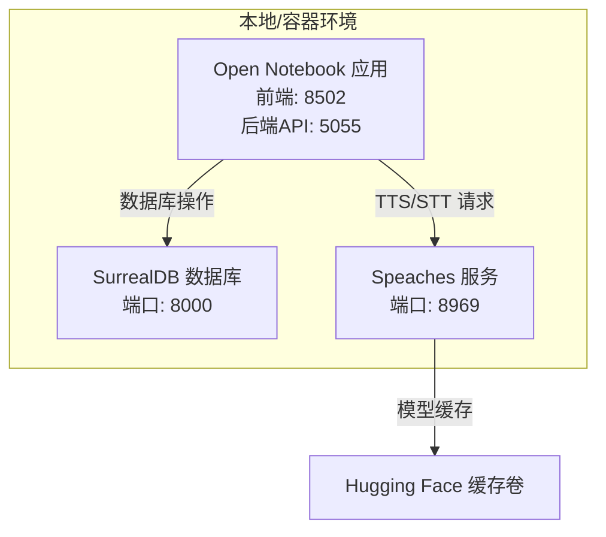
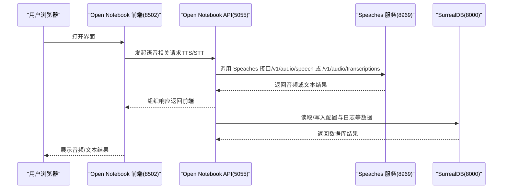
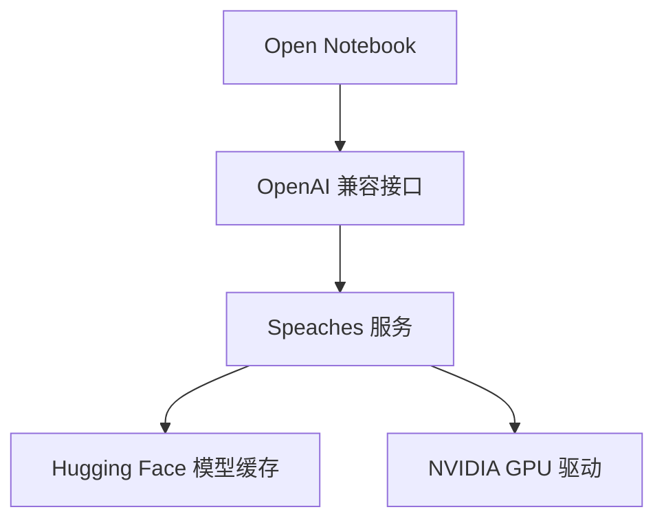

# 本地服务配置

<cite>
**本文引用的文件**
- [本地语音转文字（STT）设置](file://docs/5-CONFIGURATION/local-stt.md)
- [本地语音合成（TTS）设置](file://docs/5-CONFIGURATION/local-tts.md)
- [OpenAI 兼容提供方](file://docs/5-CONFIGURATION/openai-compatible.md)
- [环境变量参考](file://docs/5-CONFIGURATION/environment-reference.md)
- [反向代理与端口映射](file://docs/5-CONFIGURATION/reverse-proxy.md)
- [示例：Speaches + Open Notebook](file://examples/docker-compose-speaches.yml)
- [.env 示例](file://.env.example)
- [根级 docker-compose.yml](file://docker-compose.yml)
- [快速修复指南](file://docs/6-TROUBLESHOOTING/quick-fixes.md)
- [故障排除索引](file://docs/6-TROUBLESHOOTING/index.md)
</cite>

## 目录
1. [简介](#简介)
2. [项目结构](#项目结构)
3. [核心组件](#核心组件)
4. [架构总览](#架构总览)
5. [详细组件分析](#详细组件分析)
6. [依赖关系分析](#依赖关系分析)
7. [性能考虑](#性能考虑)
8. [故障排除指南](#故障排除指南)
9. [结论](#结论)
10. [附录](#附录)

## 简介
本指南面向希望在本地运行语音转文字（STT）与语音合成（TTS）服务的用户，重点围绕 Speaches 服务器的安装、配置与 Docker 部署展开，并说明其与主应用（Open Notebook）的集成方式。内容覆盖：
- Speaches 的 STT/TTS 安装与启动
- 模型下载与选择建议（CPU/GPU）
- 端口与网络配置（Docker、Linux、远程主机）
- 在 Open Notebook 中添加凭据与模型
- 性能优化与常见问题排查
- 不同操作系统与硬件支持情况

## 项目结构
以下图示展示本地 STT/TTS 服务与主应用的典型部署关系。

图表来源
- [示例：Speaches + Open Notebook](file://examples/docker-compose-speaches.yml#L24-L71)
- [根级 docker-compose.yml](file://docker-compose.yml#L1-L37)

章节来源
- [示例：Speaches + Open Notebook](file://examples/docker-compose-speaches.yml#L24-L71)
- [根级 docker-compose.yml](file://docker-compose.yml#L1-L37)

## 核心组件
- Speaches：开源的 OpenAI 兼容 STT/TTS 服务器，使用 faster-whisper 进行转写，支持多种模型与语音。
- Open Notebook：主应用，通过“OpenAI 兼容”凭据连接 Speaches，实现本地语音处理能力。
- Docker Compose：统一编排数据库、应用与 Speaches 服务，便于端口映射与资源限制。
- Hugging Face 模型缓存卷：加速模型下载与复用，减少重复下载时间。

章节来源
- [本地语音转文字（STT）设置](file://docs/5-CONFIGURATION/local-stt.md#L18-L366)
- [本地语音合成（TTS）设置](file://docs/5-CONFIGURATION/local-tts.md#L18-L345)
- [OpenAI 兼容提供方](file://docs/5-CONFIGURATION/openai-compatible.md#L1-L401)

## 架构总览
下图展示了从浏览器到 Open Notebook 后端，再到 Speaches 的请求链路，以及数据库交互。

图表来源
- [示例：Speaches + Open Notebook](file://examples/docker-compose-speaches.yml#L24-L71)
- [OpenAI 兼容提供方](file://docs/5-CONFIGURATION/openai-compatible.md#L113-L144)

章节来源
- [示例：Speaches + Open Notebook](file://examples/docker-compose-speaches.yml#L24-L71)
- [OpenAI 兼容提供方](file://docs/5-CONFIGURATION/openai-compatible.md#L113-L144)

## 详细组件分析

### Speaches STT（语音转文字）
- 安装与启动
  - 使用 CPU 镜像启动，暴露 8969 端口；可挂载 Hugging Face 缓存卷以提升模型下载效率。
  - 首次使用会自动下载模型，也可预下载避免首次延迟。
- 模型选择
  - 提供多种 Whisper 模型，按体积、速度与准确度分级，推荐根据硬件与需求选择。
  - 可查询可用模型列表，便于确认已下载模型。
- GPU 加速
  - 使用 CUDA 镜像并在容器中声明 GPU 设备，可显著提升转写速度。
  - 可设置模型常驻内存参数以避免反复加载。
- 网络与端口
  - Docker 桌面环境使用 host.docker.internal 访问宿主机；Linux 使用桥接 IP 或 host 网络模式。
  - 远程部署时使用目标服务器 IP。
- 语言与测试
  - 支持多语言，可通过语言参数提升准确性；提供 curl 测试命令验证服务可用性。
- 集成到 Open Notebook
  - 在“设置 → 凭据”中添加 OpenAI 兼容凭据，填入 Speaches 的基础 URL。
  - 在“设置 → 模型”中添加 STT 模型（provider=openai_compatible），显示名为“Local Whisper”。

章节来源
- [本地语音转文字（STT）设置](file://docs/5-CONFIGURATION/local-stt.md#L18-L366)
- [OpenAI 兼容提供方](file://docs/5-CONFIGURATION/openai-compatible.md#L113-L144)

### Speaches TTS（语音合成）
- 安装与启动
  - 使用 CPU 镜像启动，暴露 8969 端口；可挂载 Hugging Face 缓存卷。
  - 首次使用会自动下载语音模型，也可预下载。
- 语音选择
  - 提供多种语音（女声、男声、英式口音），可逐一测试并选择合适声音。
- GPU 加速
  - 使用 CUDA 镜像并在容器中声明 GPU 设备，可显著提升生成速度。
- 网络与端口
  - Docker 桌面环境使用 host.docker.internal 访问宿主机；Linux 使用桥接 IP 或 host 网络模式。
  - 远程部署时使用目标服务器 IP。
- 多说话人播客
  - 可为不同角色配置不同语音，便于生成多角色播客。
- 集成到 Open Notebook
  - 在“设置 → 凭据”中添加 OpenAI 兼容凭据，填入 Speaches 的基础 URL。
  - 在“设置 → 模型”中添加 TTS 模型（provider=openai_compatible），显示名为“Local TTS”。

章节来源
- [本地语音合成（TTS）设置](file://docs/5-CONFIGURATION/local-tts.md#L18-L345)
- [OpenAI 兼容提供方](file://docs/5-CONFIGURATION/openai-compatible.md#L113-L144)

### Open Notebook 集成要点
- 凭据配置
  - 在“设置 → API 密钥”中添加“OpenAI 兼容”凭据，分别填写 TTS 与 STT 的基础 URL。
  - 也可通过环境变量进行旧版配置（不推荐）。
- 模型注册
  - 在“设置 → 模型”中添加对应模型，provider 选择 openai_compatible，模型名需与 Speaches 实际一致。
- 环境变量
  - 主应用的加密密钥、数据库连接等通过 .env 或 docker-compose 环境变量注入。
  - 可选的代理、超时、并发等高级配置见环境变量参考。

章节来源
- [OpenAI 兼容提供方](file://docs/5-CONFIGURATION/openai-compatible.md#L69-L111)
- [环境变量参考](file://docs/5-CONFIGURATION/environment-reference.md#L7-L211)
- [.env 示例](file://.env.example#L1-L60)

### Docker 网络与端口
- 端口映射
  - Speaches 默认监听 8000，需在 docker-compose 中映射到宿主机 8969。
  - Open Notebook 默认前端 8502、API 5055，可根据需要调整。
- 网络访问
  - Docker 桌面环境：使用 host.docker.internal:8969/v1。
  - Linux：可使用桥接 IP 172.17.0.1:8969/v1，或启用 host 网络模式使用 localhost。
  - 远程服务器：使用服务器 IP:8969/v1。
- 反向代理
  - 若通过 Nginx/Caddy/Traefik 等反向代理访问，确保设置正确的 API_URL 并处理长连接超时。

章节来源
- [本地语音转文字（STT）设置](file://docs/5-CONFIGURATION/local-stt.md#L175-L195)
- [本地语音合成（TTS）设置](file://docs/5-CONFIGURATION/local-tts.md#L176-L195)
- [反向代理与端口映射](file://docs/5-CONFIGURATION/reverse-proxy.md#L117-L157)

### 模型选择与 GPU 加速
- 模型选择建议
  - 速度优先：tiny/base
  - 平衡：small（推荐）
  - 准确性优先：medium/large-v3
- GPU 加速
  - 使用 CUDA 镜像并在容器中声明 GPU 设备。
  - 可设置模型常驻内存参数以避免反复加载，提升吞吐。
- 资源限制
  - 可通过 Docker 资源限制控制内存与 CPU，避免资源争用。

章节来源
- [本地语音转文字（STT）设置](file://docs/5-CONFIGURATION/local-stt.md#L107-L172)
- [本地语音合成（TTS）设置](file://docs/5-CONFIGURATION/local-tts.md#L148-L172)
- [环境变量参考](file://docs/5-CONFIGURATION/environment-reference.md#L64-L70)

## 依赖关系分析
- 组件耦合
  - Open Notebook 通过“OpenAI 兼容”接口与 Speaches 解耦，便于替换其他兼容服务。
  - Speaches 依赖 Hugging Face 模型缓存，首次下载耗时较长但后续复用。
- 外部依赖
  - Docker 与 Docker Compose
  - NVIDIA GPU 驱动（如需 GPU 加速）
  - 反向代理（如需公网访问）

图表来源
- [OpenAI 兼容提供方](file://docs/5-CONFIGURATION/openai-compatible.md#L1-L401)
- [本地语音转文字（STT）设置](file://docs/5-CONFIGURATION/local-stt.md#L134-L172)
- [本地语音合成（TTS）设置](file://docs/5-CONFIGURATION/local-tts.md#L148-L172)

章节来源
- [OpenAI 兼容提供方](file://docs/5-CONFIGURATION/openai-compatible.md#L1-L401)
- [本地语音转文字（STT）设置](file://docs/5-CONFIGURATION/local-stt.md#L134-L172)
- [本地语音合成（TTS）设置](file://docs/5-CONFIGURATION/local-tts.md#L148-L172)

## 性能考虑
- 硬件建议
  - CPU：至少 2 核，推荐 4+ 核
  - 内存：至少 2 GB，推荐 8+ GB
  - 存储：至少 5 GB，推荐 10 GB（多模型场景）
  - GPU：NVIDIA（可选，显著提升速度）
- 模型与并发
  - 选择较小模型或英文专用模型以提升速度
  - 控制并发（TTS 并发批大小）与数据库并发任务数
- 网络与代理
  - 在企业网络中配置 HTTP/HTTPS 代理，确保模型与 API 请求可达
- 监控与调优
  - 使用 docker stats 观察资源占用
  - 适当提高超时与并发上限，平衡吞吐与稳定性

章节来源
- [本地语音转文字（STT）设置](file://docs/5-CONFIGURATION/local-stt.md#L277-L303)
- [本地语音合成（TTS）设置](file://docs/5-CONFIGURATION/local-tts.md#L271-L297)
- [环境变量参考](file://docs/5-CONFIGURATION/environment-reference.md#L64-L103)

## 故障排除指南
- 服务无法启动
  - 查看容器日志，检查端口占用，必要时重启或重建
- 连接被拒
  - 使用 curl 直连 Speaches 检查服务状态，确认网络与防火墙
- 模型下载失败
  - 检查磁盘空间与网络，查看日志并重试
- 转写/生成慢
  - 切换到 CUDA 镜像、使用更小模型、分配更多 CPU/SSD 存储
- 语音质量差
  - 尝试不同语音、调整语速、确保模型完整下载
- 端口冲突
  - 使用 lsof 定位占用进程，修改映射端口或释放占用
- 反向代理问题
  - 设置正确的 API_URL，确保长连接超时配置合理

章节来源
- [本地语音转文字（STT）设置](file://docs/5-CONFIGURATION/local-stt.md#L219-L275)
- [本地语音合成（TTS）设置](file://docs/5-CONFIGURATION/local-tts.md#L218-L269)
- [快速修复指南](file://docs/6-TROUBLESHOOTING/quick-fixes.md#L7-L373)
- [故障排除索引](file://docs/6-TROUBLESHOOTING/index.md#L69-L240)

## 结论
通过 Speaches 与 OpenAI 兼容接口，Open Notebook 能够在本地完成高质量的语音转文字与语音合成，兼顾隐私、成本与离线能力。结合合理的模型选择、GPU 加速与网络配置，可在不同硬件与操作系统环境下获得稳定高效的体验。遇到问题时，可依据本文档的配置清单与故障排除步骤快速定位并解决。

## 附录
- 快速对照表
  - Speaches 端口：8969（容器内 8000）
  - Open Notebook 端口：前端 8502，API 5055
  - Docker 桌面访问：host.docker.internal:8969/v1
  - Linux 访问：172.17.0.1:8969/v1 或 host 网络模式 localhost:8969/v1
  - 远程访问：server-ip:8969/v1
- 相关文档
  - [OpenAI 兼容提供方](file://docs/5-CONFIGURATION/openai-compatible.md#L1-L401)
  - [环境变量参考](file://docs/5-CONFIGURATION/environment-reference.md#L1-L275)
  - [示例：Speaches + Open Notebook](file://examples/docker-compose-speaches.yml#L1-L126)
  - [.env 示例](file://.env.example#L1-L60)
  - [根级 docker-compose.yml](file://docker-compose.yml#L1-L37)