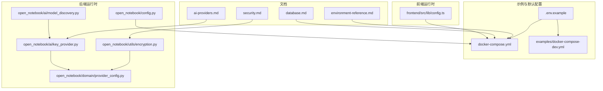
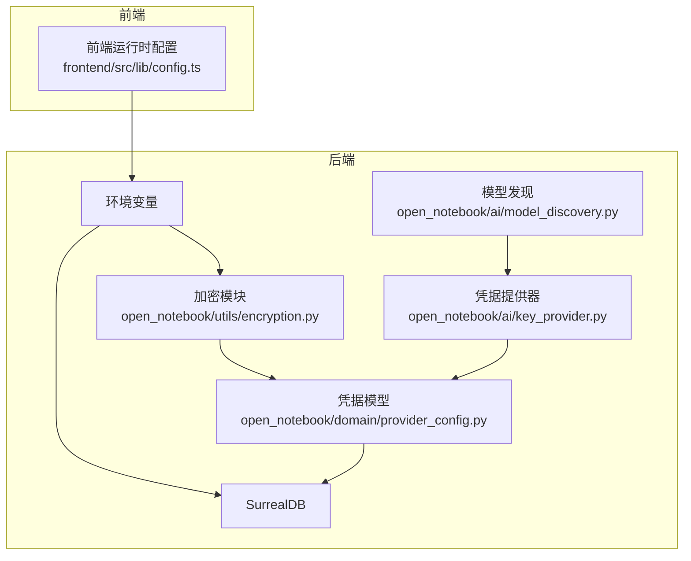
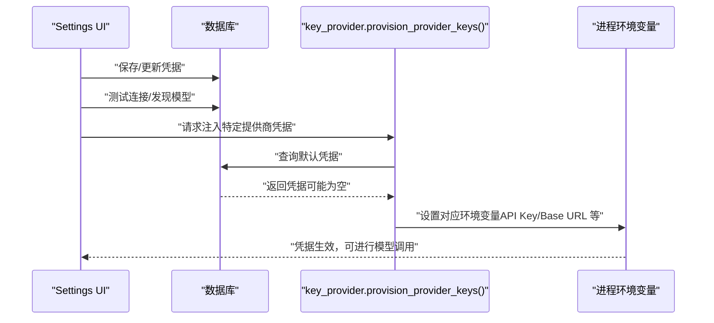
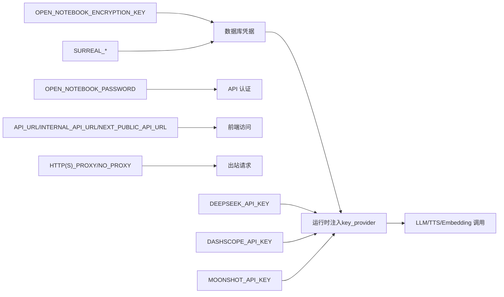

# 环境变量参考

<cite>
**本文引用的文件**
- [.env.example](file://.env.example)
- [docker-compose.yml](file://docker-compose.yml)
- [examples/docker-compose-dev.yml](file://examples/docker-compose-dev.yml)
- [docs/5-CONFIGURATION/environment-reference.md](file://docs/5-CONFIGURATION/environment-reference.md)
- [docs/5-CONFIGURATION/security.md](file://docs/5-CONFIGURATION/security.md)
- [docs/5-CONFIGURATION/database.md](file://docs/5-CONFIGURATION/database.md)
- [docs/5-CONFIGURATION/ai-providers.md](file://docs/5-CONFIGURATION/ai-providers.md)
- [open_notebook/config.py](file://open_notebook/config.py)
- [open_notebook/utils/encryption.py](file://open_notebook/utils/encryption.py)
- [open_notebook/ai/key_provider.py](file://open_notebook/ai/key_provider.py)
- [open_notebook/domain/provider_config.py](file://open_notebook/domain/provider_config.py)
- [frontend/src/lib/config.ts](file://frontend/src/lib/config.ts)
- [open_notebook/ai/model_discovery.py](file://open_notebook/ai/model_discovery.py)
- [api/routers/models.py](file://api/routers/models.py)
- [api/credentials_service.py](file://api/credentials_service.py)
</cite>

## 目录
1. [简介](#简介)
2. [项目结构](#项目结构)
3. [核心组件](#核心组件)
4. [架构总览](#架构总览)
5. [详细组件分析](#详细组件分析)
6. [依赖关系分析](#依赖关系分析)
7. [性能考量](#性能考量)
8. [故障排查指南](#故障排查指南)
9. [结论](#结论)
10. [附录](#附录)

## 简介
本文件是 Open Notebook 的环境变量完整参考，覆盖数据库、AI 提供商、网络代理、安全与加密、调试与监控、内容提取、并发与超时等类别。文档不仅列出变量、默认值与数据类型，还解释变量间的依赖关系、相互影响，并提供多场景配置示例（最小安装、生产部署、反向代理、企业防火墙、高性能部署、调试模式），以及验证规则与错误处理建议。同时给出开发与生产最佳实践。

**更新** 本次更新新增了对 DeepSeek、通义千问（DashScope）和 Moonshot API 的环境变量支持，扩展了 AI 提供商的覆盖范围。

## 项目结构
Open Notebook 的环境变量主要分布在以下位置：
- 示例与默认配置：.env.example、docker-compose.yml、examples/docker-compose-dev.yml
- 文档：docs/5-CONFIGURATION/*.md
- 运行时配置：frontend/src/lib/config.ts
- 后端运行时行为：open_notebook/config.py、open_notebook/utils/encryption.py、open_notebook/ai/key_provider.py、open_notebook/domain/provider_config.py

**图表来源**
- [.env.example](file://.env.example#L1-L60)
- [docker-compose.yml](file://docker-compose.yml#L1-L37)
- [examples/docker-compose-dev.yml](file://examples/docker-compose-dev.yml#L1-L29)
- [docs/5-CONFIGURATION/environment-reference.md](file://docs/5-CONFIGURATION/environment-reference.md#L1-L275)
- [docs/5-CONFIGURATION/security.md](file://docs/5-CONFIGURATION/security.md#L1-L397)
- [docs/5-CONFIGURATION/database.md](file://docs/5-CONFIGURATION/database.md#L1-L51)
- [docs/5-CONFIGURATION/ai-providers.md](file://docs/5-CONFIGURATION/ai-providers.md#L1-L468)
- [frontend/src/lib/config.ts](file://frontend/src/lib/config.ts#L1-L149)
- [open_notebook/config.py](file://open_notebook/config.py#L1-L18)
- [open_notebook/utils/encryption.py](file://open_notebook/utils/encryption.py#L1-L199)
- [open_notebook/ai/key_provider.py](file://open_notebook/ai/key_provider.py#L1-L450)
- [open_notebook/domain/provider_config.py](file://open_notebook/domain/provider_config.py#L1-L445)
- [open_notebook/ai/model_discovery.py](file://open_notebook/ai/model_discovery.py#L375-L406)

**章节来源**
- [.env.example](file://.env.example#L1-L60)
- [docker-compose.yml](file://docker-compose.yml#L1-L37)
- [examples/docker-compose-dev.yml](file://examples/docker-compose-dev.yml#L1-L29)
- [docs/5-CONFIGURATION/environment-reference.md](file://docs/5-CONFIGURATION/environment-reference.md#L1-L275)
- [docs/5-CONFIGURATION/security.md](file://docs/5-CONFIGURATION/security.md#L1-L397)
- [docs/5-CONFIGURATION/database.md](file://docs/5-CONFIGURATION/database.md#L1-L51)
- [docs/5-CONFIGURATION/ai-providers.md](file://docs/5-CONFIGURATION/ai-providers.md#L1-L468)
- [frontend/src/lib/config.ts](file://frontend/src/lib/config.ts#L1-L149)
- [open_notebook/config.py](file://open_notebook/config.py#L1-L18)
- [open_notebook/utils/encryption.py](file://open_notebook/utils/encryption.py#L1-L199)
- [open_notebook/ai/key_provider.py](file://open_notebook/ai/key_provider.py#L1-L450)
- [open_notebook/domain/provider_config.py](file://open_notebook/domain/provider_config.py#L1-L445)

## 核心组件
- 数据库（SurrealDB）：SURREAL_URL、SURREAL_USER、SURREAL_PASSWORD、SURREAL_NAMESPACE、SURREAL_DATABASE；以及重试与并发相关变量
- 安全与加密：OPEN_NOTEBOOK_ENCRYPTION_KEY（必填）、OPEN_NOTEBOOK_PASSWORD（可选）
- 前端 API 路径：API_URL、INTERNAL_API_URL、NEXT_PUBLIC_API_URL（由前端运行时解析）
- AI 提供商凭据：通过设置 OPEN_NOTEBOOK_ENCRYPTION_KEY 后在 UI 中管理（不再推荐使用环境变量）
- 网络代理：HTTP_PROXY、HTTPS_PROXY、NO_PROXY
- 内容提取：FIRECRAWL_API_KEY、JINA_API_KEY
- 并发与超时：SURREAL_COMMANDS_MAX_TASKS、API_CLIENT_TIMEOUT、ESPERANTO_LLM_TIMEOUT、ESPERANTO_SSL_VERIFY、ESPERANTO_SSL_CA_BUNDLE
- TTS 批处理：TTS_BATCH_SIZE
- 调试与监控：LANGCHAIN_TRACING_V2、LANGCHAIN_ENDPOINT、LANGCHAIN_API_KEY、LANGCHAIN_PROJECT

**更新** 新增对 DeepSeek、通义千问（DashScope）和 Moonshot API 的环境变量支持，扩展了 AI 提供商的覆盖范围。

**章节来源**
- [docs/5-CONFIGURATION/environment-reference.md](file://docs/5-CONFIGURATION/environment-reference.md#L7-L275)
- [docs/5-CONFIGURATION/security.md](file://docs/5-CONFIGURATION/security.md#L7-L397)
- [docs/5-CONFIGURATION/database.md](file://docs/5-CONFIGURATION/database.md#L1-L51)
- [frontend/src/lib/config.ts](file://frontend/src/lib/config.ts#L1-L149)
- [open_notebook/utils/encryption.py](file://open_notebook/utils/encryption.py#L1-L199)
- [open_notebook/ai/key_provider.py](file://open_notebook/ai/key_provider.py#L1-L450)
- [open_notebook/domain/provider_config.py](file://open_notebook/domain/provider_config.py#L1-L445)

## 架构总览
下图展示环境变量在系统中的作用与交互：

**图表来源**
- [frontend/src/lib/config.ts](file://frontend/src/lib/config.ts#L1-L149)
- [open_notebook/utils/encryption.py](file://open_notebook/utils/encryption.py#L1-L199)
- [open_notebook/ai/key_provider.py](file://open_notebook/ai/key_provider.py#L1-L450)
- [open_notebook/domain/provider_config.py](file://open_notebook/domain/provider_config.py#L1-L445)
- [docs/5-CONFIGURATION/database.md](file://docs/5-CONFIGURATION/database.md#L1-L51)
- [open_notebook/ai/model_discovery.py](file://open_notebook/ai/model_discovery.py#L375-L406)

## 详细组件分析

### 数据库（SurrealDB）
- 变量
  - SURREAL_URL：SurrealDB WebSocket 连接 URL（默认与 docker-compose 配置一致）
  - SURREAL_USER：用户名（默认 root）
  - SURREAL_PASSWORD：密码（默认 root）
  - SURREAL_NAMESPACE：命名空间（默认 open_notebook）
  - SURREAL_DATABASE：数据库名（默认 open_notebook）
- 重试与并发
  - SURREAL_COMMANDS_RETRY_ENABLED：是否启用失败重试（默认 true）
  - SURREAL_COMMANDS_RETRY_MAX_ATTEMPTS：最大重试次数（默认 3）
  - SURREAL_COMMANDS_RETRY_WAIT_STRATEGY：等待策略（exponential_jitter/exponential/fixed/random，默认 exponential_jitter）
  - SURREAL_COMMANDS_RETRY_WAIT_MIN：最小等待秒数（默认 1）
  - SURREAL_COMMANDS_RETRY_WAIT_MAX：最大等待秒数（默认 30）
  - SURREAL_COMMANDS_MAX_TASKS：最大并发数据库任务（默认 5）
- 使用场景
  - 默认 docker-compose 部署：无需修改
  - 主机直连或反向代理：根据实际地址调整
  - 生产高并发：提升 SURREAL_COMMANDS_MAX_TASKS
- 依赖关系
  - 必须与数据库服务可达且凭据正确
  - 与 API_URL/INTERNAL_API_URL 无直接耦合，但需确保容器间网络连通
- 验证与排错
  - 检查容器日志与连接状态
  - 确认端口映射与防火墙放行

**章节来源**
- [docs/5-CONFIGURATION/environment-reference.md](file://docs/5-CONFIGURATION/environment-reference.md#L22-L51)
- [docs/5-CONFIGURATION/database.md](file://docs/5-CONFIGURATION/database.md#L1-L51)
- [docker-compose.yml](file://docker-compose.yml#L1-L37)
- [examples/docker-compose-dev.yml](file://examples/docker-compose-dev.yml#L1-L29)

### 安全与加密
- OPEN_NOTEBOOK_ENCRYPTION_KEY
  - 类型：字符串（任意字符串，内部经 SHA-256 派生密钥）
  - 必填：是（用于加密存储于数据库的 API 凭据）
  - Docker 秘钥支持：可通过 _FILE 后缀从文件注入
  - 行为：未配置则无法保存凭据；更改密钥会导致旧数据不可读
- OPEN_NOTEBOOK_PASSWORD
  - 类型：字符串（会话级保护）
  - 用途：浏览器登录保护（Basic Bearer）
  - 建议：生产使用强口令，避免明文传输，务必配合 HTTPS
- 依赖关系
  - OPEN_NOTEBOOK_ENCRYPTION_KEY 是凭据系统前提
  - OPEN_NOTEBOOK_PASSWORD 仅保护 API 访问，不替代 HTTPS
- 验证与排错
  - 通过健康检查与受保护端点测试
  - 若 401，检查 Authorization 头格式与口令一致性

**章节来源**
- [docs/5-CONFIGURATION/security.md](file://docs/5-CONFIGURATION/security.md#L7-L397)
- [open_notebook/utils/encryption.py](file://open_notebook/utils/encryption.py#L1-L199)
- [open_notebook/domain/provider_config.py](file://open_notebook/domain/provider_config.py#L1-L445)

### 前端 API 路径与运行时配置
- API_URL、INTERNAL_API_URL、NEXT_PUBLIC_API_URL
  - 前端优先从后端 /config 获取运行时配置，其次回退到构建期 NEXT_PUBLIC_API_URL，最后使用相对路径（通过 Next.js 重写）
  - 在反向代理或容器编排中，通常需要显式设置 API_URL
- 依赖关系
  - 与 HOSTNAME、端口映射、反向代理配置共同决定前端访问路径
- 验证与排错
  - 通过 /config 与 /health 端点确认
  - 开发模式下可观察控制台日志

**章节来源**
- [docs/5-CONFIGURATION/environment-reference.md](file://docs/5-CONFIGURATION/environment-reference.md#L7-L18)
- [frontend/src/lib/config.ts](file://frontend/src/lib/config.ts#L1-L149)

### AI 提供商凭据（UI 管理）
- 重要变更
  - v1.2 起，所有提供商凭据通过 Settings UI 管理，环境变量方式已弃用但仍可作为回退
  - 必须先设置 OPEN_NOTEBOOK_ENCRYPTION_KEY 才能保存凭据
- 支持的提供商（简表）
  - OpenAI、Anthropic、Google（Gemini/Vertex AI）、Groq、OpenRouter、Ollama、Azure OpenAI、ElevenLabs、Voyage AI、Mistral、DeepSeek、xAI、OpenAI-Compatible（含 per-service URL）
  
**更新** 新增对 DeepSeek、通义千问（DashScope）和 Moonshot API 的支持，扩展了 AI 提供商的覆盖范围。

- 运行时加载机制
  - provision_provider_keys() 将数据库中的凭据注入对应环境变量（如 OPENAI_API_KEY、ANTHROPIC_API_KEY、OLLAMA_API_BASE 等）
  - 对 Vertex/Azure/OpenAI-Compatible 等复杂提供商，会注入多个相关变量
- 依赖关系
  - OPEN_NOTEBOOK_ENCRYPTION_KEY 为凭据加密前提
  - 未配置凭据时，仍可回退到环境变量（已弃用）

**图表来源**
- [open_notebook/ai/key_provider.py](file://open_notebook/ai/key_provider.py#L1-L450)
- [open_notebook/domain/provider_config.py](file://open_notebook/domain/provider_config.py#L1-L445)
- [docs/5-CONFIGURATION/ai-providers.md](file://docs/5-CONFIGURATION/ai-providers.md#L1-L468)

**章节来源**
- [docs/5-CONFIGURATION/ai-providers.md](file://docs/5-CONFIGURATION/ai-providers.md#L1-L468)
- [open_notebook/ai/key_provider.py](file://open_notebook/ai/key_provider.py#L1-L450)
- [open_notebook/domain/provider_config.py](file://open_notebook/domain/provider_config.py#L1-L445)

### 网络代理与内容提取
- 代理
  - HTTP_PROXY、HTTPS_PROXY、NO_PROXY：标准环境变量，底层库自动检测
  - 影响范围：AI 提供商 API、URL 内容提取（网页抓取、YouTube 字幕）、播客生成（LLM/TTS）
- 内容提取
  - FIRECRAWL_API_KEY、JINA_API_KEY：用于高级网页抓取与内容抽取
- 使用场景
  - 企业防火墙/代理环境：配置 HTTP_PROXY/HTTPS_PROXY 与 NO_PROXY
  - 需要高级内容抽取：配置 FIRECRAWL/JINA 密钥

**章节来源**
- [docs/5-CONFIGURATION/environment-reference.md](file://docs/5-CONFIGURATION/environment-reference.md#L85-L116)
- [docs/5-CONFIGURATION/environment-reference.md](file://docs/5-CONFIGURATION/environment-reference.md#L72-L82)

### 并发、超时与性能
- 并发
  - SURREAL_COMMANDS_MAX_TASKS：数据库并发任务上限（默认 5）
- 超时
  - API_CLIENT_TIMEOUT：API 客户端超时（秒，默认 300）
  - ESPERANTO_LLM_TIMEOUT：LLM 推理超时（秒，默认 60）
  - ESPERANTO_SSL_VERIFY：SSL 证书校验（默认 true）
  - ESPERANTO_SSL_CA_BUNDLE：自定义 CA 证书路径（可选）
- TTS 批处理
  - TTS_BATCH_SIZE：并发 TTS 请求（默认 5）
- 使用场景
  - 高吞吐部署：提高 SURREAL_COMMANDS_MAX_TASKS 与 API_CLIENT_TIMEOUT
  - 低延迟需求：降低 ESPERANTO_LLM_TIMEOUT

**章节来源**
- [docs/5-CONFIGURATION/environment-reference.md](file://docs/5-CONFIGURATION/environment-reference.md#L54-L101)
- [docs/5-CONFIGURATION/environment-reference.md](file://docs/5-CONFIGURATION/environment-reference.md#L64-L69)

### 调试与监控
- LangChain Tracing
  - LANGCHAIN_TRACING_V2：启用 LangSmith 追踪（默认 false）
  - LANGCHAIN_ENDPOINT：LangSmith 端点（默认）
  - LANGCHAIN_API_KEY：LangSmith API Key（可选）
  - LANGCHAIN_PROJECT：项目名（默认 Open Notebook）
- 使用场景
  - 开发调试：开启追踪并配置密钥
  - 生产禁用：保持默认关闭

**章节来源**
- [docs/5-CONFIGURATION/environment-reference.md](file://docs/5-CONFIGURATION/environment-reference.md#L120-L131)

### 其他运行时目录与缓存
- 数据目录与缓存
  - DATA_FOLDER：根数据目录（默认 ./data）
  - LANGGRAPH_CHECKPOINT_FILE：LangGraph 检查点 SQLite 文件
  - UPLOADS_FOLDER：上传目录
  - TIKTOKEN_CACHE_DIR：tiktoken 缓存目录
- 使用场景
  - 单容器或本地开发：默认即可
  - 生产持久化：挂载卷至宿主机

**章节来源**
- [open_notebook/config.py](file://open_notebook/config.py#L1-L18)

## 依赖关系分析
- 变量间依赖
  - OPEN_NOTEBOOK_ENCRYPTION_KEY → 凭据系统（必须先配置）
  - OPEN_NOTEBOOK_PASSWORD → API 认证（Basic Bearer）
  - API_URL/INTERNAL_API_URL/NEXT_PUBLIC_API_URL → 前端访问路径
  - SURREAL_* → 数据库连接
  - HTTP_PROXY/HTTPS_PROXY/NO_PROXY → 出站网络访问
  - PROVIDER_*（通过 UI 注入）→ LLM/TTS/Embedding 调用
  
**更新** 新增对 DeepSeek、通义千问（DashScope）和 Moonshot API 的环境变量依赖关系。

- 外部依赖
  - SurrealDB 服务
  - AI 提供商 API（OpenAI、Anthropic、Google、Groq、DeepSeek、通义千问、Moonshot 等）
  - 反向代理（Nginx/Caddy/Traefik）与 SSL 终止
- 循环依赖
  - 无直接循环；凭据注入在请求前完成，避免运行时循环

**图表来源**
- [docs/5-CONFIGURATION/environment-reference.md](file://docs/5-CONFIGURATION/environment-reference.md#L7-L275)
- [open_notebook/ai/key_provider.py](file://open_notebook/ai/key_provider.py#L1-L450)
- [open_notebook/domain/provider_config.py](file://open_notebook/domain/provider_config.py#L1-L445)

**章节来源**
- [docs/5-CONFIGURATION/environment-reference.md](file://docs/5-CONFIGURATION/environment-reference.md#L1-L275)
- [open_notebook/ai/key_provider.py](file://open_notebook/ai/key_provider.py#L1-L450)
- [open_notebook/domain/provider_config.py](file://open_notebook/domain/provider_config.py#L1-L445)

## 性能考量
- 数据库并发
  - 提升 SURREAL_COMMANDS_MAX_TASKS 以增加并发，但需结合数据库性能与资源限制
- 超时设置
  - API_CLIENT_TIMEOUT 与 ESPERANTO_LLM_TIMEOUT 应根据网络与模型响应时间调整
- SSL 与证书
  - 生产环境保持 ESPERANTO_SSL_VERIFY=true，必要时配置 ESPERANTO_SSL_CA_BUNDLE
- TTS 批处理
  - TTS_BATCH_SIZE 与提供商能力匹配，避免过载

## 故障排查指南
- 环境变量验证
  - 单变量检查、多变量筛选打印、全部配置导出
- 常见问题
  - 401 未授权：检查 Authorization 头格式与 OPEN_NOTEBOOK_PASSWORD
  - 无法访问：检查 API_URL、端口映射、反向代理配置
  - 数据库连接失败：核对 SURREAL_* 与网络连通性
  - 凭据不可读：OPEN_NOTEBOOK_ENCRYPTION_KEY 更改或丢失导致
  - 代理环境：确认 HTTP_PROXY/HTTPS_PROXY/NO_PROXY 格式与目标主机列表
  - **新增** AI 提供商配置问题：检查 DEEPSEEK_API_KEY、DASHSCOPE_API_KEY、MOONSHOT_API_KEY 等环境变量
  
**更新** 新增对新增 AI 提供商环境变量的故障排查指导。

- 建议流程
  - 从 /health 与 /config 端点开始
  - 查看容器日志
  - 在开发环境开启前端日志辅助定位

**章节来源**
- [docs/5-CONFIGURATION/environment-reference.md](file://docs/5-CONFIGURATION/environment-reference.md#L186-L229)
- [docs/5-CONFIGURATION/security.md](file://docs/5-CONFIGURATION/security.md#L330-L378)

## 结论
- 环境变量是 Open Notebook 部署与运行的关键入口
- 凭据管理应通过 Settings UI 完成，OPEN_NOTEBOOK_ENCRYPTION_KEY 为前提
- 生产部署务必启用 HTTPS、强口令与防火墙策略
- 在企业代理/反向代理环境下，合理配置 API_URL 与网络代理变量
- 通过重试、并发与超时参数优化性能与稳定性

**更新** 新增对 DeepSeek、通义千问（DashScope）和 Moonshot API 的支持，扩展了 AI 提供商的覆盖范围，为用户提供了更多选择。

## 附录

### 变量清单与分类
- 数据库（SurrealDB）
  - SURREAL_URL、SURREAL_USER、SURREAL_PASSWORD、SURREAL_NAMESPACE、SURREAL_DATABASE
  - SURREAL_COMMANDS_RETRY_ENABLED、SURREAL_COMMANDS_RETRY_MAX_ATTEMPTS、SURREAL_COMMANDS_RETRY_WAIT_STRATEGY、SURREAL_COMMANDS_RETRY_WAIT_MIN、SURREAL_COMMANDS_RETRY_WAIT_MAX、SURREAL_COMMANDS_MAX_TASKS
- 安全与加密
  - OPEN_NOTEBOOK_ENCRYPTION_KEY（必填）、OPEN_NOTEBOOK_PASSWORD（可选）
- 前端 API 路径
  - API_URL、INTERNAL_API_URL、NEXT_PUBLIC_API_URL（由前端运行时解析）
- 网络代理与内容提取
  - HTTP_PROXY、HTTPS_PROXY、NO_PROXY、FIRECRAWL_API_KEY、JINA_API_KEY
- 并发、超时与性能
  - API_CLIENT_TIMEOUT、ESPERANTO_LLM_TIMEOUT、ESPERANTO_SSL_VERIFY、ESPERANTO_SSL_CA_BUNDLE、TTS_BATCH_SIZE
- 调试与监控
  - LANGCHAIN_TRACING_V2、LANGCHAIN_ENDPOINT、LANGCHAIN_API_KEY、LANGCHAIN_PROJECT
- 其他运行时目录
  - DATA_FOLDER、LANGGRAPH_CHECKPOINT_FILE、UPLOADS_FOLDER、TIKTOKEN_CACHE_DIR

**更新** 新增对 DeepSeek、通义千问（DashScope）和 Moonshot API 的环境变量支持。

### 不同部署场景的配置示例
- 最小安装（新装）
  - 设置 OPEN_NOTEBOOK_ENCRYPTION_KEY、SURREAL_*，随后在 UI 中配置提供商
- 生产部署
  - 强口令、HTTPS、外部 API_URL、生产数据库凭据
- 反向代理
  - 设置 API_URL 指向域名，确保 80/443 放行
- 企业防火墙
  - 配置 HTTP_PROXY/HTTPS_PROXY/NO_PROXY
- 高性能部署
  - 提升并发与超时参数
- 调试模式
  - 开启 LangChain 追踪

**更新** 新增对新增 AI 提供商的配置示例。

### 变量验证规则与错误处理建议
- 规则
  - 区分大小写、无空格、必要时加引号
  - 变更需重启生效
  - 加密密钥与口令不得提交到版本库
- 错误处理
  - 401：核对 Authorization 头与口令
  - 无法访问：核对 API_URL、端口映射与反代
  - 凭据异常：检查 OPEN_NOTEBOOK_ENCRYPTION_KEY 是否正确
  
**更新** 新增对新增 AI 提供商环境变量的错误处理建议。

**章节来源**
- [docs/5-CONFIGURATION/environment-reference.md](file://docs/5-CONFIGURATION/environment-reference.md#L203-L229)
- [docs/5-CONFIGURATION/security.md](file://docs/5-CONFIGURATION/security.md#L330-L378)

### 新增 AI 提供商环境变量详情

**更新** 新增 DeepSeek、通义千问（DashScope）和 Moonshot API 的环境变量支持。

#### DeepSeek API 配置
- DEEPSEEK_API_KEY
  - 类型：字符串（DeepSeek API 密钥）
  - 必填：否（通过 UI 管理）
  - 用途：DeepSeek 模型访问
  - 默认基础 URL：https://api.deepseek.com
  - 支持：语言模型、推理能力
- DEEPSEEK_BASE_URL
  - 类型：字符串（自定义基础 URL）
  - 必填：否
  - 用途：指定 DeepSeek API 的自定义端点

#### 通义千问（DashScope）API 配置
- DASHSCOPE_API_KEY
  - 类型：字符串（通义千问 API 密钥）
  - 必填：否（通过 UI 管理）
  - 用途：通义千问模型访问
  - 默认基础 URL：https://dashscope.aliyuncs.com/compatible-mode/v1
  - 支持：语言模型、文本生成
- DASHSCOPE_BASE_URL
  - 类型：字符串（自定义基础 URL）
  - 必填：否
  - 用途：指定通义千问 API 的自定义端点

#### Moonshot API 配置
- MOONSHOT_API_KEY
  - 类型：字符串（Moonshot API 密钥）
  - 必填：否（通过 UI 管理）
  - 用途：Moonshot 模型访问
  - 默认基础 URL：https://api.moonshot.cn/v1
  - 支持：语言模型、文本生成
- MOONSHOT_BASE_URL
  - 类型：字符串（自定义基础 URL）
  - 必填：否
  - 用途：指定 Moonshot API 的自定义端点

**章节来源**
- [open_notebook/ai/key_provider.py](file://open_notebook/ai/key_provider.py#L308-L325)
- [open_notebook/ai/model_discovery.py](file://open_notebook/ai/model_discovery.py#L375-L406)
- [api/routers/models.py](file://api/routers/models.py#L369-L375)
- [api/credentials_service.py](file://api/credentials_service.py#L36-L42)