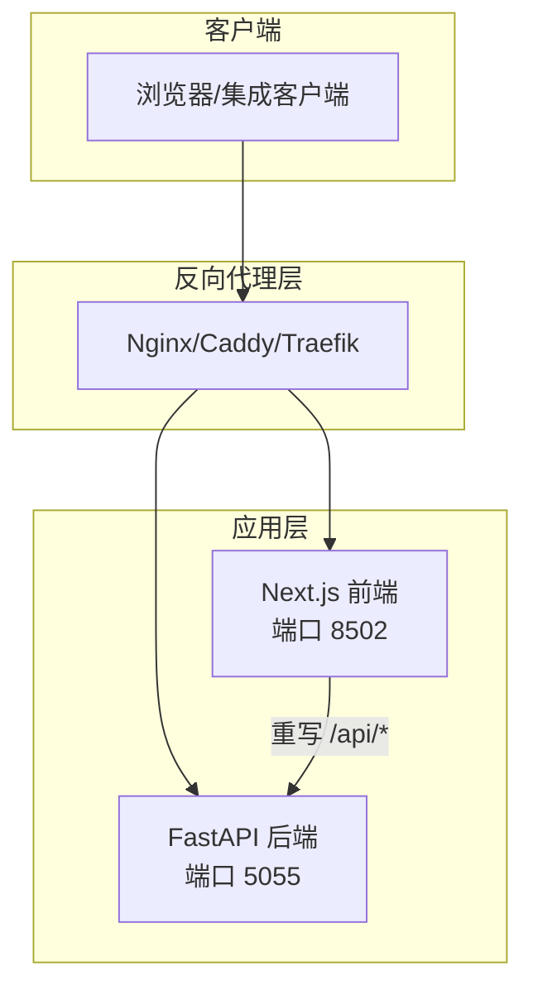
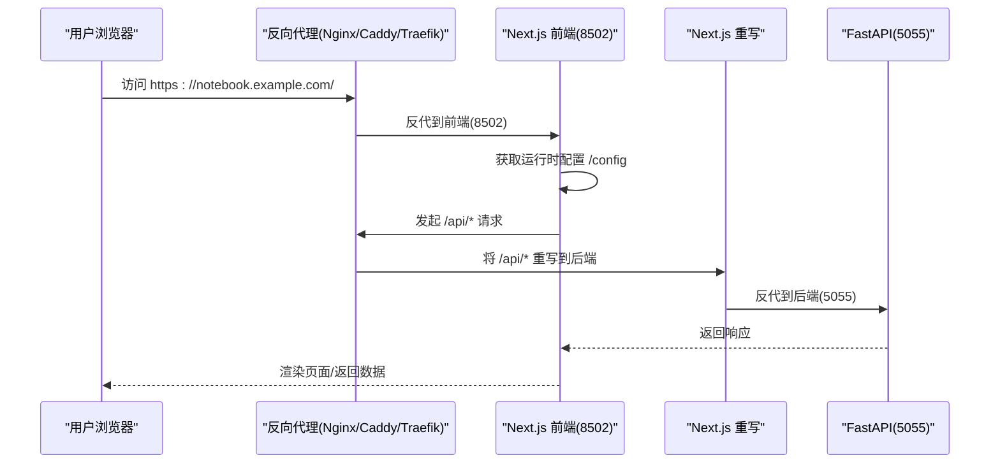
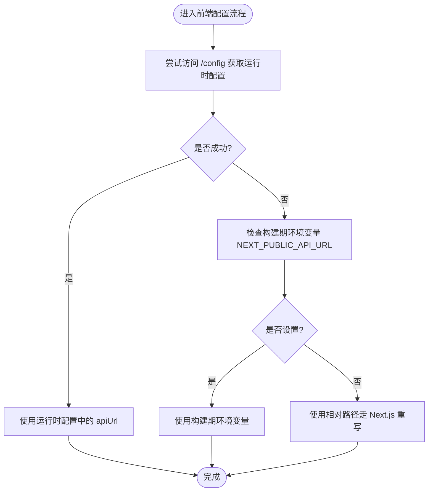
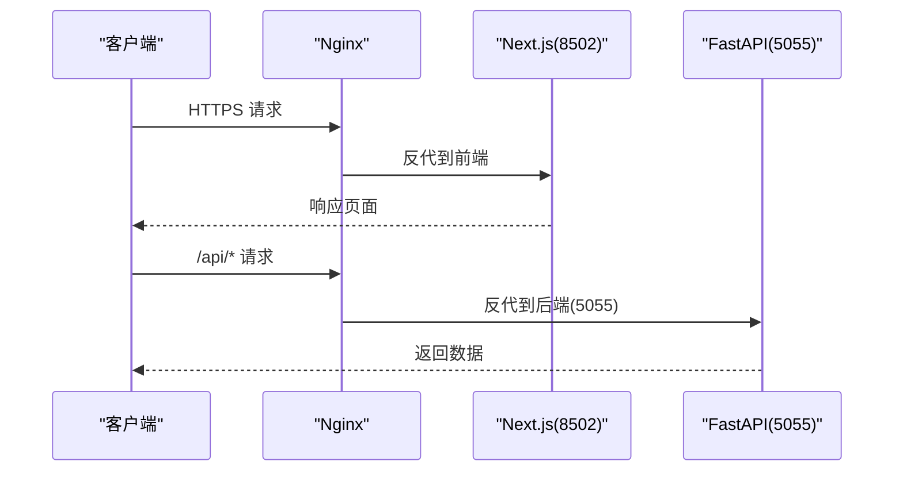
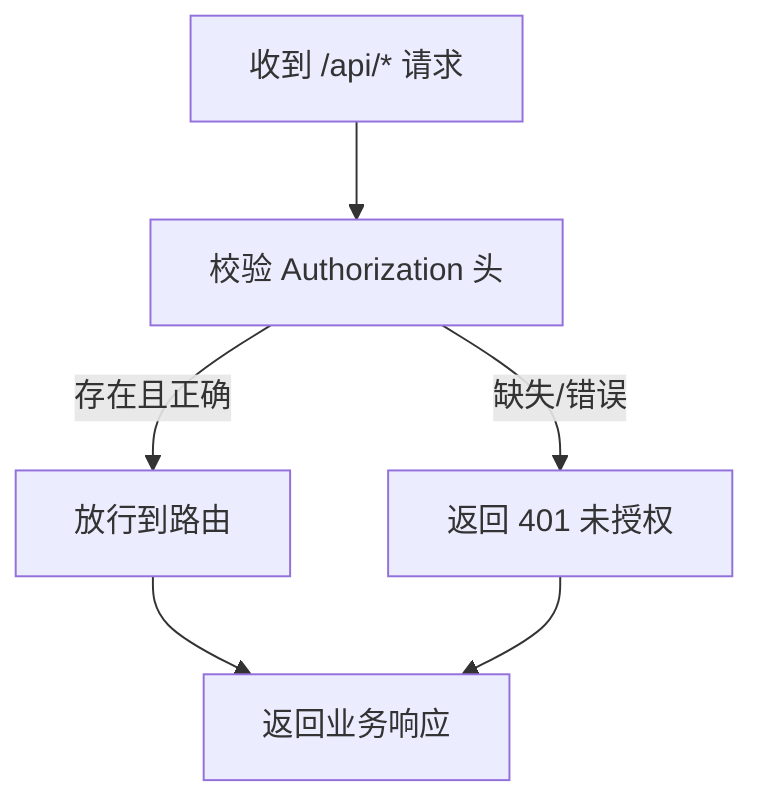
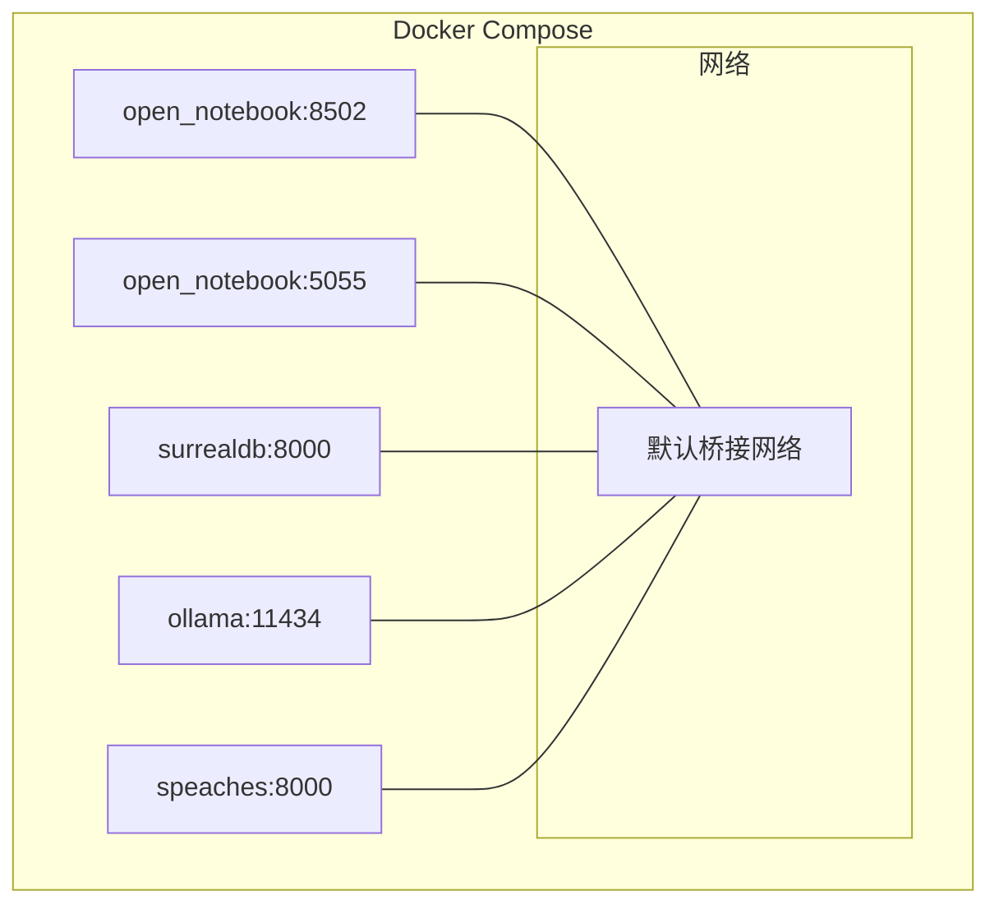
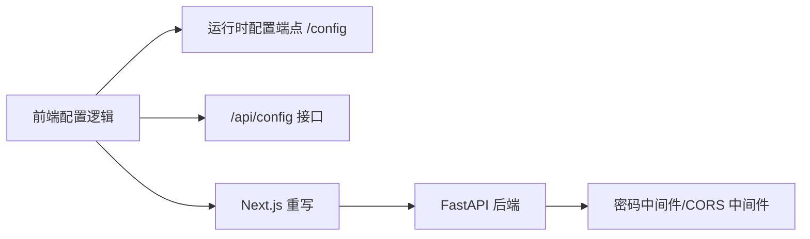

# 网络配置

<cite>
**本文引用的文件**
- [docs/5-CONFIGURATION/reverse-proxy.md](file://docs/5-CONFIGURATION/reverse-proxy.md)
- [docs/5-CONFIGURATION/security.md](file://docs/5-CONFIGURATION/security.md)
- [docs/5-CONFIGURATION/environment-reference.md](file://docs/5-CONFIGURATION/environment-reference.md)
- [examples/docker-compose-full-local.yml](file://examples/docker-compose-full-local.yml)
- [docker-compose.yml](file://docker-compose.yml)
- [frontend/src/lib/config.ts](file://frontend/src/lib/config.ts)
- [frontend/src/app/config/route.ts](file://frontend/src/app/config/route.ts)
- [frontend/src/proxy.ts](file://frontend/src/proxy.ts)
- [api/main.py](file://api/main.py)
- [api/routers/config.py](file://api/routers/config.py)
</cite>

## 目录
1. [简介](#简介)
2. [项目结构](#项目结构)
3. [核心组件](#核心组件)
4. [架构总览](#架构总览)
5. [详细组件分析](#详细组件分析)
6. [依赖关系分析](#依赖关系分析)
7. [性能考虑](#性能考虑)
8. [故障排查指南](#故障排查指南)
9. [结论](#结论)
10. [附录](#附录)

## 简介
本指南面向需要在生产或开发环境中部署与运维 Open Notebook 的工程师，系统讲解网络配置与反向代理设置，包括：
- API URL 配置优先级与自动推断机制
- 前端与后端端口映射与 Next.js 重写（Rewrite）简化代理
- Nginx、Caddy、Traefik 等常见反向代理的完整配置示例
- 自定义域名与 SSL 证书配置
- Docker 网络与容器间通信
- 负载均衡与高可用配置要点
- 网络性能优化与安全加固建议
- 不同部署场景下的网络配置差异

## 项目结构
Open Notebook 的网络相关能力由“前端运行时配置 + 后端 API + 反向代理”三层协同实现：
- 前端通过运行时配置端点获取 API 地址，并使用 Next.js 重写将 /api/* 请求转发到后端
- 后端 FastAPI 提供统一 API 服务与健康检查
- 反向代理负责 TLS 终止、域名解析、超时与长连接支持、文件上传限制等

图表来源
- [frontend/src/lib/config.ts](file://frontend/src/lib/config.ts#L22-L140)
- [frontend/src/app/config/route.ts](file://frontend/src/app/config/route.ts#L25-L68)
- [api/main.py](file://api/main.py#L157-L180)
- [docs/5-CONFIGURATION/reverse-proxy.md](file://docs/5-CONFIGURATION/reverse-proxy.md#L13-L19)

章节来源
- [docs/5-CONFIGURATION/reverse-proxy.md](file://docs/5-CONFIGURATION/reverse-proxy.md#L1-L19)
- [frontend/src/lib/config.ts](file://frontend/src/lib/config.ts#L22-L140)
- [api/main.py](file://api/main.py#L157-L180)

## 核心组件
- 运行时配置端点：Next.js 提供 /config 端点，返回 API_URL，解决构建期变量限制
- 前端配置逻辑：按“运行时配置 > 构建期环境变量 > 相对路径（重写）”优先级确定 API 基础地址
- API 配置接口：/api/config 返回版本与数据库状态，前端据此构造最终请求
- 反向代理：统一处理 HTTPS、WebSocket 升级、长任务超时、文件上传大小限制

章节来源
- [frontend/src/app/config/route.ts](file://frontend/src/app/config/route.ts#L25-L68)
- [frontend/src/lib/config.ts](file://frontend/src/lib/config.ts#L22-L140)
- [api/routers/config.py](file://api/routers/config.py#L123-L161)
- [docs/5-CONFIGURATION/reverse-proxy.md](file://docs/5-CONFIGURATION/reverse-proxy.md#L133-L157)

## 架构总览
下图展示从浏览器到后端 API 的完整网络路径，以及 Next.js 重写如何简化反向代理配置。

图表来源
- [frontend/src/app/config/route.ts](file://frontend/src/app/config/route.ts#L25-L68)
- [frontend/src/lib/config.ts](file://frontend/src/lib/config.ts#L22-L140)
- [api/main.py](file://api/main.py#L157-L180)
- [docs/5-CONFIGURATION/reverse-proxy.md](file://docs/5-CONFIGURATION/reverse-proxy.md#L13-L19)

## 详细组件分析

### 组件A：运行时配置与 API URL 决策
- Next.js 运行时配置端点优先读取环境变量 API_URL/NEXT_PUBLIC_API_URL，否则自动从请求头推断协议与主机名，拼接默认后端端口 5055
- 前端再调用 /api/config 获取版本与数据库状态，最终形成完整的 API 基础 URL
- 该机制确保单端口反向代理即可工作，避免复杂路由与 CORS 问题

图表来源
- [frontend/src/lib/config.ts](file://frontend/src/lib/config.ts#L59-L140)
- [frontend/src/app/config/route.ts](file://frontend/src/app/config/route.ts#L25-L68)

章节来源
- [frontend/src/lib/config.ts](file://frontend/src/lib/config.ts#L22-L140)
- [frontend/src/app/config/route.ts](file://frontend/src/app/config/route.ts#L25-L68)

### 组件B：反向代理配置（Nginx/Caddy/Traefik）
- Nginx：监听 443/80，开启 HTTP/2；设置客户端上传上限；为 WebSocket 升级与长连接设置超时；可选分离子域
- Caddy：自动管理证书；针对长任务设置读写超时
- Traefik：通过标签声明路由规则、入口、TLS 证书解析器与服务端口；静态配置中设置服务器传输超时

图表来源
- [docs/5-CONFIGURATION/reverse-proxy.md](file://docs/5-CONFIGURATION/reverse-proxy.md#L25-L58)
- [docs/5-CONFIGURATION/reverse-proxy.md](file://docs/5-CONFIGURATION/reverse-proxy.md#L60-L71)
- [docs/5-CONFIGURATION/reverse-proxy.md](file://docs/5-CONFIGURATION/reverse-proxy.md#L75-L105)

章节来源
- [docs/5-CONFIGURATION/reverse-proxy.md](file://docs/5-CONFIGURATION/reverse-proxy.md#L25-L105)

### 组件C：API 认证与安全
- 密码保护中间件对除特定路径外的所有 /api/* 接口进行鉴权，使用 Authorization: Bearer 头
- 未认证请求返回标准错误，前端可据此提示登录
- 生产建议：仅暴露反向代理端口，限制直接访问 8502/5055；启用 HTTPS；强密码；定期更新

图表来源
- [api/main.py](file://api/main.py#L105-L118)
- [docs/5-CONFIGURATION/security.md](file://docs/5-CONFIGURATION/security.md#L148-L161)

章节来源
- [api/main.py](file://api/main.py#L105-L118)
- [docs/5-CONFIGURATION/security.md](file://docs/5-CONFIGURATION/security.md#L148-L161)

### 组件D：Docker 网络与容器间通信
- 单容器模式：前端 8502、后端 5055 同容器；反向代理仅暴露 80/443
- 多容器模式：前端与后端分别运行，通过内部网络互通；反向代理同样只暴露 80/443
- 示例编排展示了本地 AI（Ollama/Speaches）与数据库（SurrealDB）的组合部署

图表来源
- [docker-compose.yml](file://docker-compose.yml#L15-L36)
- [examples/docker-compose-full-local.yml](file://examples/docker-compose-full-local.yml#L28-L96)

章节来源
- [docker-compose.yml](file://docker-compose.yml#L15-L36)
- [examples/docker-compose-full-local.yml](file://examples/docker-compose-full-local.yml#L28-L96)

### 组件E：高级场景与高可用
- 远程/局域网访问：调整 API_URL 并开放对应端口；注意防火墙策略
- 分离子域：前端与 API 使用不同子域，便于独立限流与访问控制
- 多容器部署：将前端与 API 解耦，分别扩展与隔离
- 负载均衡：Traefik 示例展示了服务端口与响应刷新间隔配置；需结合静态配置设置服务器传输超时

章节来源
- [docs/5-CONFIGURATION/reverse-proxy.md](file://docs/5-CONFIGURATION/reverse-proxy.md#L284-L469)
- [docs/5-CONFIGURATION/reverse-proxy.md](file://docs/5-CONFIGURATION/reverse-proxy.md#L96-L105)

## 依赖关系分析
- 前端配置依赖 Next.js 运行时配置端点与 /api/config 接口
- 反向代理依赖 Next.js 重写机制，将 /api/* 路径透明转发至后端
- 后端依赖密码中间件与 CORS 中间件，确保安全与跨域行为可控

图表来源
- [frontend/src/lib/config.ts](file://frontend/src/lib/config.ts#L22-L140)
- [frontend/src/app/config/route.ts](file://frontend/src/app/config/route.ts#L25-L68)
- [api/main.py](file://api/main.py#L105-L127)

章节来源
- [frontend/src/lib/config.ts](file://frontend/src/lib/config.ts#L22-L140)
- [api/main.py](file://api/main.py#L105-L127)

## 性能考虑
- 超时设置：长任务（转换、播客生成）建议将反向代理读写超时设为 600s；应用侧也可调整客户端与 LLM 超时
- 文件上传：根据业务需求提升客户端最大体限制，并在代理层添加错误响应的 CORS 头
- WebSocket：确保代理支持升级头与持久连接
- 数据库并发与重试：在高并发场景下可提高任务并发数并启用重试策略

章节来源
- [docs/5-CONFIGURATION/reverse-proxy.md](file://docs/5-CONFIGURATION/reverse-proxy.md#L545-L590)
- [docs/5-CONFIGURATION/environment-reference.md](file://docs/5-CONFIGURATION/environment-reference.md#L169-L176)

## 故障排查指南
- 无法连接：检查 API_URL 是否设置、反向代理能否连通容器、查看浏览器控制台与 Docker 日志
- 混合内容：确保 API_URL 使用 https，避免前端 HTTPS 下访问 HTTP API
- WebSocket 问题：确认代理已设置升级头
- 502 网关：检查容器状态、日志与网络连通性
- 超时错误：延长代理与应用侧超时；核对版本要求与配置项
- CORS 错误：检查代理是否转发 X-Forwarded-* 头、API_URL 协议一致性与路由正确性
- 413 文件过大：在代理层提升上传上限并在错误响应中注入 CORS 头

章节来源
- [docs/5-CONFIGURATION/reverse-proxy.md](file://docs/5-CONFIGURATION/reverse-proxy.md#L502-L756)

## 结论
通过“运行时配置 + Next.js 重写 + 反向代理”的组合，Open Notebook 实现了简洁而强大的网络配置方案。生产部署中，建议：
- 明确 API_URL 与 INTERNAL_API_URL 的职责边界
- 使用反向代理统一处理 TLS、超时与长连接
- 强化安全：密码保护、HTTPS、防火墙与最小暴露原则
- 针对长任务与大文件优化代理与应用超时
- 在多容器/多子域场景下保持清晰的路由与证书策略

## 附录
- 环境变量参考：包含 API_URL、INTERNAL_API_URL、API_CLIENT_TIMEOUT、OPEN_NOTEBOOK_PASSWORD、OPEN_NOTEBOOK_ENCRYPTION_KEY、SURREAL_* 等
- Docker 编排示例：单容器与本地 AI 全栈部署
- 安全加固：密码强度、Docker 安全选项、防火墙策略与企业级扩展

章节来源
- [docs/5-CONFIGURATION/environment-reference.md](file://docs/5-CONFIGURATION/environment-reference.md#L7-L117)
- [examples/docker-compose-full-local.yml](file://examples/docker-compose-full-local.yml#L28-L96)
- [docs/5-CONFIGURATION/security.md](file://docs/5-CONFIGURATION/security.md#L243-L288)