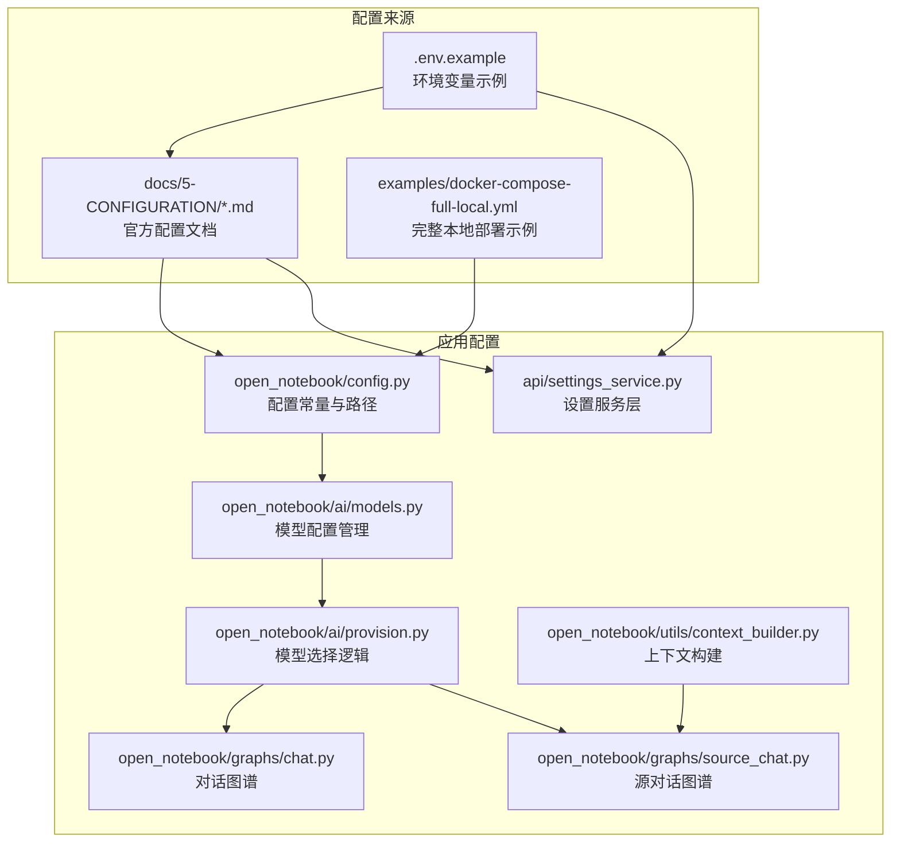
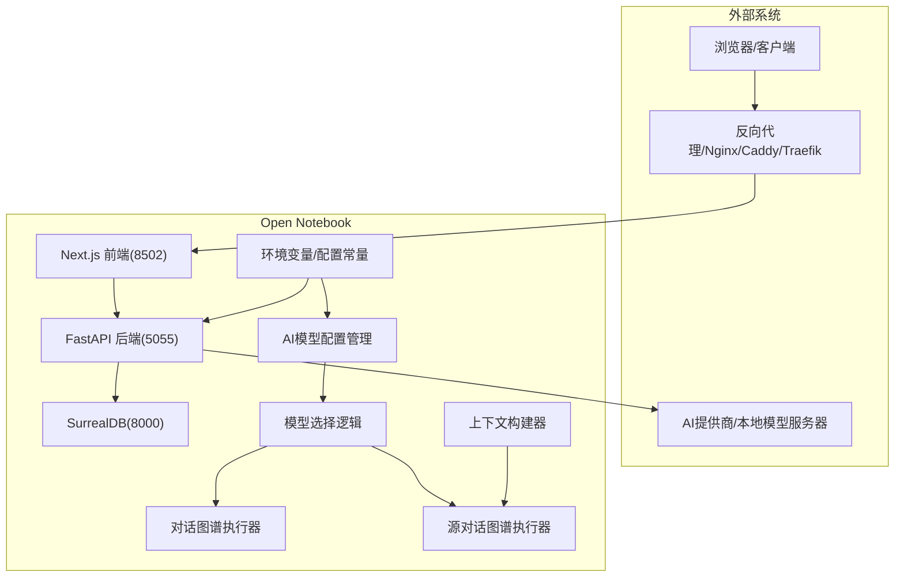
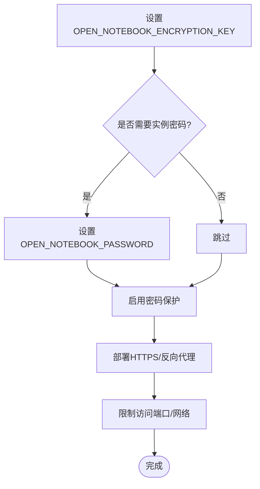
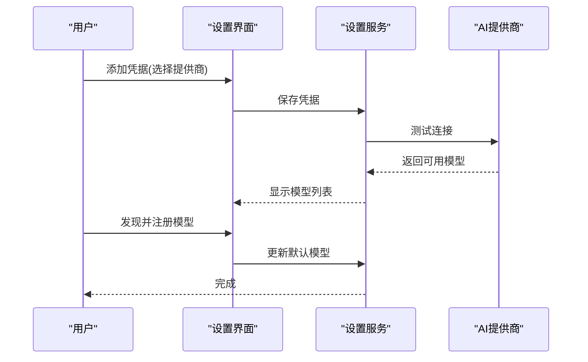
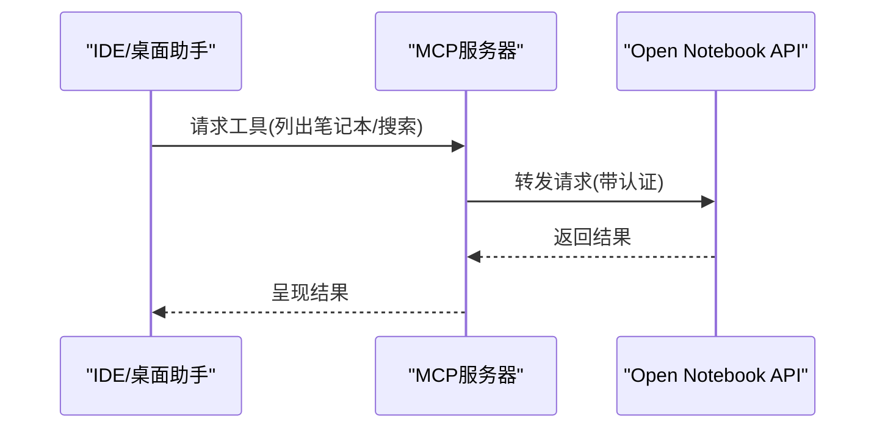
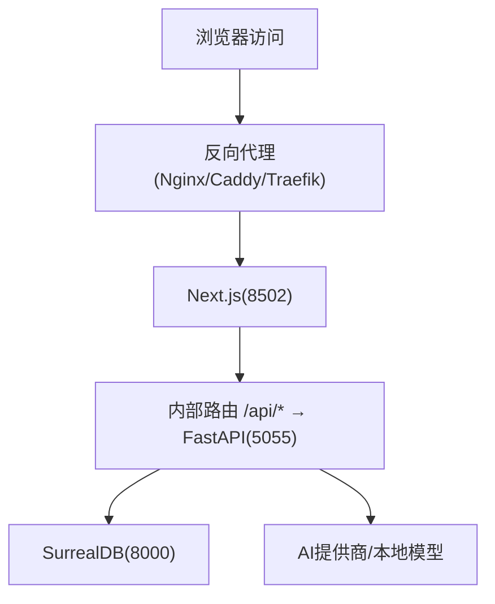
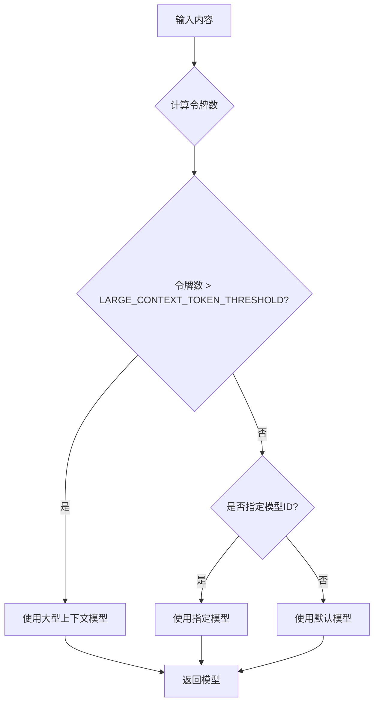
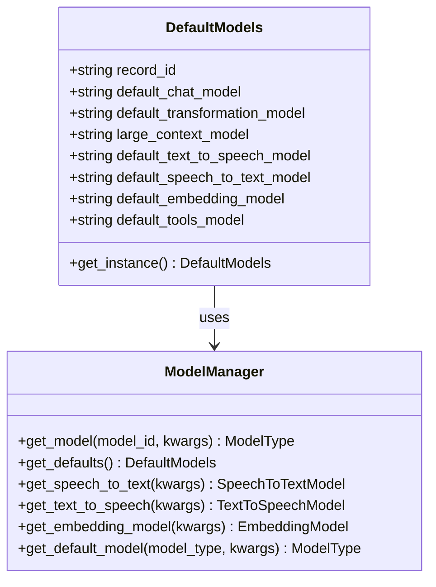
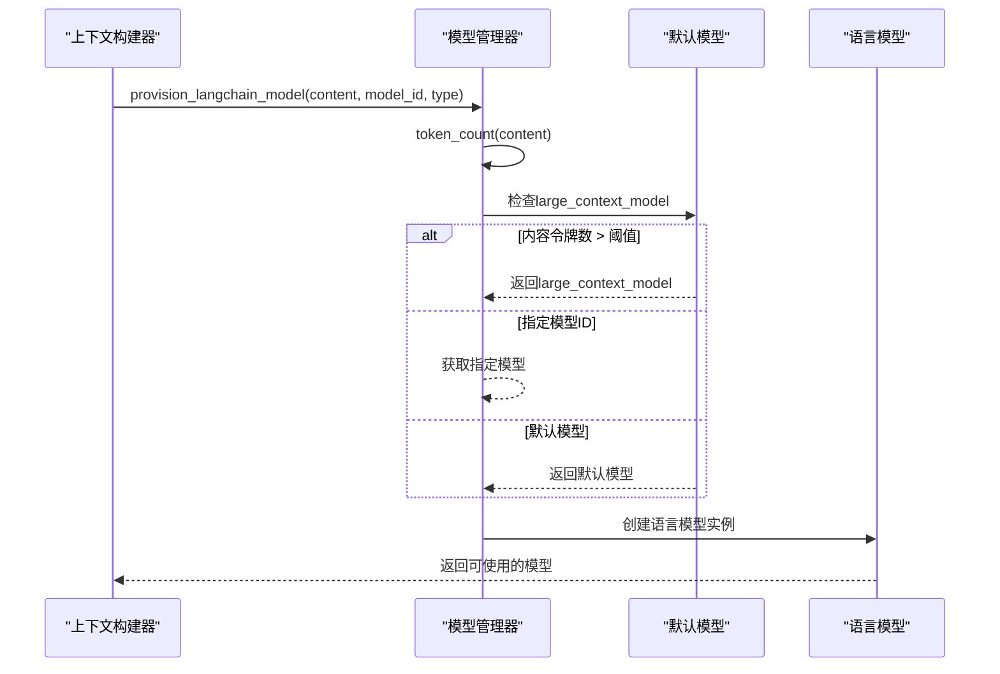
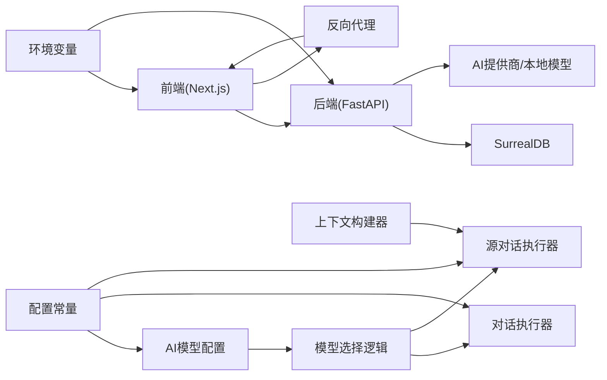

# 配置管理

<cite>
**本文引用的文件**
- [.env.example](file://.env.example)
- [CONFIGURATION.md](file://CONFIGURATION.md)
- [open_notebook/config.py](file://open_notebook/config.py)
- [open_notebook/ai/models.py](file://open_notebook/ai/models.py)
- [open_notebook/ai/provision.py](file://open_notebook/ai/provision.py)
- [open_notebook/utils/context_builder.py](file://open_notebook/utils/context_builder.py)
- [open_notebook/graphs/chat.py](file://open_notebook/graphs/chat.py)
- [open_notebook/graphs/source_chat.py](file://open_notebook/graphs/source_chat.py)
- [api/settings_service.py](file://api/settings_service.py)
- [docs/5-CONFIGURATION/environment-reference.md](file://docs/5-CONFIGURATION/environment-reference.md)
- [docs/5-CONFIGURATION/database.md](file://docs/5-CONFIGURATION/database.md)
- [docs/5-CONFIGURATION/security.md](file://docs/5-CONFIGURATION/security.md)
- [docs/5-CONFIGURATION/ai-providers.md](file://docs/5-CONFIGURATION/ai-providers.md)
- [docs/5-CONFIGURATION/local-stt.md](file://docs/5-CONFIGURATION/local-stt.md)
- [docs/5-CONFIGURATION/local-tts.md](file://docs/5-CONFIGURATION/local-tts.md)
- [docs/5-CONFIGURATION/mcp-integration.md](file://docs/5-CONFIGURATION/mcp-integration.md)
- [docs/5-CONFIGURATION/ollama.md](file://docs/5-CONFIGURATION/ollama.md)
- [docs/5-CONFIGURATION/openai-compatible.md](file://docs/5-CONFIGURATION/openai-compatible.md)
- [docs/5-CONFIGURATION/reverse-proxy.md](file://docs/5-CONFIGURATION/reverse-proxy.md)
- [docs/5-CONFIGURATION/advanced.md](file://docs/5-CONFIGURATION/advanced.md)
- [examples/docker-compose-full-local.yml](file://examples/docker-compose-full-local.yml)
</cite>

## 更新摘要
**所做更改**
- 新增AI模型配置集中化管理章节，详细说明DefaultModels和ModelManager架构
- 更新配置常量章节，新增LARGE_CONTEXT_TOKEN_THRESHOLD、DEFAULT_MAX_TOKENS和SOURCE_CHAT_MAX_TOKENS的详细说明
- 增强AI模型选择逻辑章节，说明基于上下文大小的智能模型切换机制
- 新增配置常量依赖关系图表，展示各模块间的配置传递关系
- 更新AI提供商配置章节，强调凭据系统与模型配置的集成

## 目录
1. [简介](#简介)
2. [项目结构](#项目结构)
3. [核心组件](#核心组件)
4. [架构总览](#架构总览)
5. [详细组件分析](#详细组件分析)
6. [配置常量管理](#配置常量管理)
7. [AI模型配置集中化管理](#ai模型配置集中化管理)
8. [AI模型选择逻辑](#ai模型选择逻辑)
9. [依赖关系分析](#依赖关系分析)
10. [性能考虑](#性能考虑)
11. [故障排除指南](#故障排除指南)
12. [结论](#结论)
13. [附录](#附录)

## 简介
本指南面向Open Notebook的配置管理，系统性梳理所有可配置的环境变量与参数设置，覆盖数据库、安全、AI提供商、本地语音（TTS/STT）、MCP集成等主题，并提供模板、最佳实践、依赖关系说明、生产安全加固、性能优化与验证/排障方法。文档同时给出不同部署场景的差异与注意事项，帮助从开发到生产的全生命周期稳定运行。

**更新** 本次更新重点反映了配置管理的重大改进：新增LARGE_CONTEXT_TOKEN_THRESHOLD、DEFAULT_MAX_TOKENS和SOURCE_CHAT_MAX_TOKENS等配置常量，以及AI模型配置的集中化管理架构。

## 项目结构
Open Notebook的配置主要分布在以下位置：
- 环境变量示例与文档：根目录的.env.example与docs/5-CONFIGURATION/
- 应用内默认路径配置：open_notebook/config.py
- AI模型配置：open_notebook/ai/models.py
- 模型选择逻辑：open_notebook/ai/provision.py
- 上下文构建器：open_notebook/utils/context_builder.py
- 图谱执行器：open_notebook/graphs/chat.py、open_notebook/graphs/source_chat.py
- 设置服务层：api/settings_service.py
- 示例编排：examples/docker-compose-full-local.yml

**图表来源**
- [.env.example](file://.env.example#L1-L60)
- [docs/5-CONFIGURATION/environment-reference.md](file://docs/5-CONFIGURATION/environment-reference.md#L1-L275)
- [open_notebook/config.py](file://open_notebook/config.py#L1-L26)
- [open_notebook/ai/models.py](file://open_notebook/ai/models.py#L61-L95)
- [open_notebook/ai/provision.py](file://open_notebook/ai/provision.py#L1-L62)
- [open_notebook/utils/context_builder.py](file://open_notebook/utils/context_builder.py#L1-L200)
- [open_notebook/graphs/chat.py](file://open_notebook/graphs/chat.py#L1-L67)
- [open_notebook/graphs/source_chat.py](file://open_notebook/graphs/source_chat.py#L1-L196)
- [api/settings_service.py](file://api/settings_service.py#L1-L80)
- [examples/docker-compose-full-local.yml](file://examples/docker-compose-full-local.yml#L1-L198)

**章节来源**
- [.env.example](file://.env.example#L1-L60)
- [CONFIGURATION.md](file://CONFIGURATION.md#L1-L37)
- [open_notebook/config.py](file://open_notebook/config.py#L1-L26)
- [open_notebook/ai/models.py](file://open_notebook/ai/models.py#L1-L267)
- [open_notebook/ai/provision.py](file://open_notebook/ai/provision.py#L1-L62)
- [open_notebook/utils/context_builder.py](file://open_notebook/utils/context_builder.py#L1-L496)
- [open_notebook/graphs/chat.py](file://open_notebook/graphs/chat.py#L1-L67)
- [open_notebook/graphs/source_chat.py](file://open_notebook/graphs/source_chat.py#L1-L196)
- [api/settings_service.py](file://api/settings_service.py#L1-L80)
- [examples/docker-compose-full-local.yml](file://examples/docker-compose-full-local.yml#L1-L198)

## 核心组件
- 环境变量体系：集中于docs/5-CONFIGURATION/environment-reference.md，涵盖API、数据库、超时、TTS批处理、内容抽取、网络代理、调试监控等。
- 配置常量管理：open_notebook/config.py定义AI模型相关的核心配置常量，包括上下文阈值和默认令牌限制。
- AI模型配置：open_notebook/ai/models.py提供集中化的模型配置管理，支持凭据系统与默认模型配置。
- 模型选择逻辑：open_notebook/ai/provision.py实现基于上下文大小的智能模型切换机制。
- 上下文构建：open_notebook/utils/context_builder.py提供灵活的上下文构建和截断功能。
- 图谱执行：open_notebook/graphs/chat.py和open_notebook/graphs/source_chat.py使用配置常量进行令牌限制。
- 设置服务层：api/settings_service.py封装前端对设置的读取与更新，对接后端API。
- 文档化配置：CONFIGURATION.md指引至各专题文档，便于按主题检索。

**章节来源**
- [docs/5-CONFIGURATION/environment-reference.md](file://docs/5-CONFIGURATION/environment-reference.md#L1-L275)
- [open_notebook/config.py](file://open_notebook/config.py#L1-L26)
- [open_notebook/ai/models.py](file://open_notebook/ai/models.py#L1-L267)
- [open_notebook/ai/provision.py](file://open_notebook/ai/provision.py#L1-L62)
- [open_notebook/utils/context_builder.py](file://open_notebook/utils/context_builder.py#L1-L496)
- [open_notebook/graphs/chat.py](file://open_notebook/graphs/chat.py#L1-L67)
- [open_notebook/graphs/source_chat.py](file://open_notebook/graphs/source_chat.py#L1-L196)
- [api/settings_service.py](file://api/settings_service.py#L1-L80)
- [CONFIGURATION.md](file://CONFIGURATION.md#L1-L37)

## 架构总览
下图展示配置在系统中的作用与交互：

**图表来源**
- [docs/5-CONFIGURATION/reverse-proxy.md](file://docs/5-CONFIGURATION/reverse-proxy.md#L1-L800)
- [docs/5-CONFIGURATION/database.md](file://docs/5-CONFIGURATION/database.md#L1-L51)
- [docs/5-CONFIGURATION/environment-reference.md](file://docs/5-CONFIGURATION/environment-reference.md#L1-L275)
- [open_notebook/config.py](file://open_notebook/config.py#L19-L26)
- [open_notebook/ai/models.py](file://open_notebook/ai/models.py#L61-L95)
- [open_notebook/ai/provision.py](file://open_notebook/ai/provision.py#L10-L62)
- [open_notebook/utils/context_builder.py](file://open_notebook/utils/context_builder.py#L320-L350)
- [open_notebook/graphs/chat.py](file://open_notebook/graphs/chat.py#L35-L40)
- [open_notebook/graphs/source_chat.py](file://open_notebook/graphs/source_chat.py#L50-L55)

## 详细组件分析

### 数据库配置（SurrealDB）
- 默认连接：推荐使用docker-compose中的surrealdb容器，默认URL、用户、密码、命名空间与数据库名。
- 多种部署形态：同机Compose、宿主机直连、本机回环等，均需正确设置SURREAL_URL。
- 连接重试与并发：支持最大任务数、重试策略、等待时间范围等，用于高并发与容错。
- 安全加固：生产环境建议修改默认用户名/密码，避免暴露端口。

**图表来源**
- [docs/5-CONFIGURATION/database.md](file://docs/5-CONFIGURATION/database.md#L1-L51)
- [docs/5-CONFIGURATION/environment-reference.md](file://docs/5-CONFIGURATION/environment-reference.md#L22-L60)

**章节来源**
- [docs/5-CONFIGURATION/database.md](file://docs/5-CONFIGURATION/database.md#L1-L51)
- [docs/5-CONFIGURATION/environment-reference.md](file://docs/5-CONFIGURATION/environment-reference.md#L22-L60)

### 安全配置
- 加密密钥：OPEN_NOTEBOOK_ENCRYPTION_KEY用于加密存储的API凭据；必须设置，否则无法保存凭据。
- 密码保护：OPEN_NOTEBOOK_PASSWORD为实例级密码保护，适用于公网或共享网络环境。
- Docker密钥注入：支持通过_FILE后缀使用Docker secrets。
- 生产加固：绑定本地端口、防火墙限制、HTTPS、会话与速率限制建议、审计日志建议等。

**图表来源**
- [docs/5-CONFIGURATION/security.md](file://docs/5-CONFIGURATION/security.md#L1-L397)
- [docs/5-CONFIGURATION/environment-reference.md](file://docs/5-CONFIGURATION/environment-reference.md#L7-L20)

**章节来源**
- [docs/5-CONFIGURATION/security.md](file://docs/5-CONFIGURATION/security.md#L1-L397)
- [docs/5-CONFIGURATION/environment-reference.md](file://docs/5-CONFIGURATION/environment-reference.md#L7-L20)

### AI提供商配置
- 新版采用"凭据系统"：通过Settings → API Keys添加与测试连接，再发现与注册模型。
- 支持云提供商（OpenAI、Anthropic、Google、Groq、OpenRouter等）与本地（Ollama、LM Studio、OpenAI兼容）。
- 兼容性：OpenAI兼容服务器（如LM Studio、vLLM、Text Generation WebUI、Speaches）统一走OpenAI-Compatible凭据。
- 迁移：旧版环境变量已弃用，可通过"迁移至数据库"按钮导入。
- 集中化管理：新的AI模型配置通过DefaultModels和ModelManager实现统一管理。

**图表来源**
- [docs/5-CONFIGURATION/ai-providers.md](file://docs/5-CONFIGURATION/ai-providers.md#L1-L468)
- [api/settings_service.py](file://api/settings_service.py#L1-L80)

**章节来源**
- [docs/5-CONFIGURATION/ai-providers.md](file://docs/5-CONFIGURATION/ai-providers.md#L1-L468)
- [api/settings_service.py](file://api/settings_service.py#L1-L80)

### 本地语音（TTS/STT）
- Speaches：同时支持TTS与STT，OpenAI兼容接口，适合隐私与离线场景。
- TTS：配置OpenAI-Compatible凭据的TTS Base URL，注册模型后可生成播客。
- STT：配置OpenAI-Compatible凭据的STT Base URL，注册模型后可转录音频。
- Docker网络：根据宿主平台选择host.docker.internal、桥接IP或host网络模式。
- 性能：GPU加速、模型常驻内存、批量大小调优。

**图表来源**
- [docs/5-CONFIGURATION/local-tts.md](file://docs/5-CONFIGURATION/local-tts.md#L1-L345)
- [docs/5-CONFIGURATION/local-stt.md](file://docs/5-CONFIGURATION/local-stt.md#L1-L366)
- [docs/5-CONFIGURATION/openai-compatible.md](file://docs/5-CONFIGURATION/openai-compatible.md#L1-L401)

**章节来源**
- [docs/5-CONFIGURATION/local-tts.md](file://docs/5-CONFIGURATION/local-tts.md#L1-L345)
- [docs/5-CONFIGURATION/local-stt.md](file://docs/5-CONFIGURATION/local-stt.md#L1-L366)
- [docs/5-CONFIGURATION/openai-compatible.md](file://docs/5-CONFIGURATION/openai-compatible.md#L1-L401)

### MCP集成
- 通过Model Context Protocol将Open Notebook接入Claude Desktop/VS Code等工具。
- 配置OPEN_NOTEBOOK_URL与OPEN_NOTEBOOK_PASSWORD（如启用密码保护）。
- 提供笔记本、源、笔记、聊天、搜索、模型、设置等工具集。

**图表来源**
- [docs/5-CONFIGURATION/mcp-integration.md](file://docs/5-CONFIGURATION/mcp-integration.md#L1-L200)

**章节来源**
- [docs/5-CONFIGURATION/mcp-integration.md](file://docs/5-CONFIGURATION/mcp-integration.md#L1-L200)

### 反向代理与域名
- 单端口代理：Next.js自动将/api/*转发至后端，简化反向代理配置。
- API_URL：前端三优先级（运行时>构建时>自动检测），生产务必显式设置为https://域名。
- 时长与超时：长任务（转换/播客）需适当增加代理读写超时。
- 文件上传：注意代理的body大小限制与错误响应的CORS头配置。

**图表来源**
- [docs/5-CONFIGURATION/reverse-proxy.md](file://docs/5-CONFIGURATION/reverse-proxy.md#L1-L800)

**章节来源**
- [docs/5-CONFIGURATION/reverse-proxy.md](file://docs/5-CONFIGURATION/reverse-proxy.md#L1-L800)

### 高级配置与性能调优
- 并发与重试：SURREAL_COMMANDS_MAX_TASKS、重试策略与等待范围，平衡吞吐与冲突。
- 超时：API_CLIENT_TIMEOUT应大于ESPERANTO_LLM_TIMEOUT并留缓冲。
- 批处理：TTS_BATCH_SIZE按提供商能力与稳定性调节。
- 日志与调试：RUST_LOG、LOGLEVEL、LangSmith追踪。
- 多提供商：同一任务可配置不同提供商（LLM/Embedding/TTS/STT）。
- SSL：自定义CA证书或禁用校验仅限开发。

**章节来源**
- [docs/5-CONFIGURATION/advanced.md](file://docs/5-CONFIGURATION/advanced.md#L1-L545)
- [docs/5-CONFIGURATION/environment-reference.md](file://docs/5-CONFIGURATION/environment-reference.md#L54-L103)

### Ollama集成
- 网络配置：根据部署形态选择localhost、host.docker.internal、容器名或远程IP。
- 模型管理：语言模型、嵌入模型、推理与性能建议。
- 故障排查：模型名称严格匹配、默认模型配置、端口占用、防火墙、Docker网络。
- SSL与自签名：通过ESPERANTO_SSL_CA_BUNDLE或禁用校验（开发）。

**章节来源**
- [docs/5-CONFIGURATION/ollama.md](file://docs/5-CONFIGURATION/ollama.md#L1-L741)
- [docs/5-CONFIGURATION/environment-reference.md](file://docs/5-CONFIGURATION/environment-reference.md#L54-L61)

## 配置常量管理

### 核心配置常量
Open Notebook引入了三个关键的配置常量来管理AI模型的行为：

#### LARGE_CONTEXT_TOKEN_THRESHOLD
- **默认值**：105,000 令牌
- **用途**：定义切换到大型上下文模型的令牌阈值
- **触发条件**：当内容令牌数超过此阈值时，系统自动选择大型上下文模型
- **应用场景**：长文档分析、复杂查询、多轮对话等需要更大上下文的场景

#### DEFAULT_MAX_TOKENS
- **默认值**：8,192 令牌
- **用途**：定义一般对话操作的最大令牌数限制
- **应用场景**：标准聊天对话、内容生成、文本处理等常规AI交互
- **性能考虑**：平衡响应速度与内容完整性

#### SOURCE_CHAT_MAX_TOKENS
- **默认值**：50,000 令牌
- **用途**：定义源对话操作的最大令牌数限制
- **应用场景**：针对特定源内容的深入对话和分析
- **设计考量**：比DEFAULT_MAX_TOKENS更大，因为源对话通常需要更多上下文

**图表来源**
- [open_notebook/config.py](file://open_notebook/config.py#L20-L25)
- [open_notebook/ai/provision.py](file://open_notebook/ai/provision.py#L23-L34)

**章节来源**
- [open_notebook/config.py](file://open_notebook/config.py#L19-L26)
- [open_notebook/ai/provision.py](file://open_notebook/ai/provision.py#L10-L62)

## AI模型配置集中化管理

### DefaultModels架构
新的AI模型配置系统通过DefaultModels类实现了集中化管理：

#### 默认模型类型
- **default_chat_model**：默认聊天模型
- **default_transformation_model**：默认转换模型
- **large_context_model**：大型上下文模型
- **default_text_to_speech_model**：默认文本转语音模型
- **default_speech_to_text_model**：默认语音转文本模型
- **default_embedding_model**：默认嵌入模型
- **default_tools_model**：默认工具模型

#### 数据库持久化
- 使用SurrealDB存储默认模型配置
- 每次获取时都从数据库重新加载，确保配置实时性
- 支持动态更新而无需重启服务

**图表来源**
- [open_notebook/ai/models.py](file://open_notebook/ai/models.py#L61-L95)
- [open_notebook/ai/models.py](file://open_notebook/ai/models.py#L97-L267)

**章节来源**
- [open_notebook/ai/models.py](file://open_notebook/ai/models.py#L61-L95)
- [open_notebook/ai/models.py](file://open_notebook/ai/models.py#L97-L267)

### ModelManager功能
ModelManager提供了完整的模型管理功能：

#### 模型获取
- 支持通过模型ID直接获取特定模型
- 自动处理凭据关联和环境变量回退
- 支持动态参数传递（如温度、最大令牌数等）

#### 默认模型管理
- 提供不同类型模型的默认获取方法
- 支持large_context模型的特殊处理
- 自动处理模型类型验证和错误处理

#### 凭据集成
- 自动从关联的凭据对象构建配置
- 支持凭据缺失时的环境变量回退
- 统一的配置标准化处理

**章节来源**
- [open_notebook/ai/models.py](file://open_notebook/ai/models.py#L97-L267)

## AI模型选择逻辑

### 智能模型切换机制
新的模型选择逻辑实现了基于上下文大小的智能切换：

#### 选择优先级
1. **显式模型ID**：如果提供了特定模型ID，优先使用该模型
2. **大型上下文模型**：当内容令牌数超过LARGE_CONTEXT_TOKEN_THRESHOLD时
3. **默认模型**：使用指定类型的默认模型

#### 实现细节
- 使用token_count函数计算内容令牌数
- 支持动态配置和运行时调整
- 提供详细的日志记录和错误处理

**图表来源**
- [open_notebook/ai/provision.py](file://open_notebook/ai/provision.py#L10-L62)
- [open_notebook/ai/models.py](file://open_notebook/ai/models.py#L177-L264)

**章节来源**
- [open_notebook/ai/provision.py](file://open_notebook/ai/provision.py#L10-L62)
- [open_notebook/ai/models.py](file://open_notebook/ai/models.py#L177-L264)

### 上下文构建与截断
ContextBuilder提供了灵活的上下文构建和截断功能：

#### 截断算法
- 基于令牌计数的精确控制
- 按优先级移除低优先级项目
- 保持上下文的语义完整性

#### 配置选项
- 支持自定义优先权重
- 可选的重复项移除
- 灵活的项目类型组合

**章节来源**
- [open_notebook/utils/context_builder.py](file://open_notebook/utils/context_builder.py#L320-L350)
- [open_notebook/utils/context_builder.py](file://open_notebook/utils/context_builder.py#L422-L496)

## 依赖关系分析
- 环境变量依赖：OPEN_NOTEBOOK_ENCRYPTION_KEY为凭据系统前提；API_URL影响前端与后端交互；SURREAL_*决定数据库连接；LLM/Embedding/TTS/STT凭据决定AI能力。
- 配置常量依赖：LARGE_CONTEXT_TOKEN_THRESHOLD驱动模型选择逻辑；DEFAULT_MAX_TOKENS和SOURCE_CHAT_MAX_TOKENS影响不同场景的令牌限制。
- 组件耦合：前端通过API_URL与后端通信；后端依赖数据库与AI提供商；AI模型配置通过ModelManager统一管理；上下文构建器依赖配置常量进行令牌控制。
- 外部依赖：SurrealDB版本与特性、AI提供商API/SDK、反向代理配置、Docker网络与卷。

**图表来源**
- [docs/5-CONFIGURATION/environment-reference.md](file://docs/5-CONFIGURATION/environment-reference.md#L1-L275)
- [docs/5-CONFIGURATION/reverse-proxy.md](file://docs/5-CONFIGURATION/reverse-proxy.md#L1-L800)
- [docs/5-CONFIGURATION/database.md](file://docs/5-CONFIGURATION/database.md#L1-L51)
- [open_notebook/config.py](file://open_notebook/config.py#L19-L26)
- [open_notebook/ai/models.py](file://open_notebook/ai/models.py#L61-L95)
- [open_notebook/ai/provision.py](file://open_notebook/ai/provision.py#L10-L62)
- [open_notebook/utils/context_builder.py](file://open_notebook/utils/context_builder.py#L320-L350)
- [open_notebook/graphs/chat.py](file://open_notebook/graphs/chat.py#L35-L40)
- [open_notebook/graphs/source_chat.py](file://open_notebook/graphs/source_chat.py#L50-L55)

**章节来源**
- [docs/5-CONFIGURATION/environment-reference.md](file://docs/5-CONFIGURATION/environment-reference.md#L1-L275)
- [docs/5-CONFIGURATION/reverse-proxy.md](file://docs/5-CONFIGURATION/reverse-proxy.md#L1-L800)
- [docs/5-CONFIGURATION/database.md](file://docs/5-CONFIGURATION/database.md#L1-L51)
- [open_notebook/config.py](file://open_notebook/config.py#L19-L26)
- [open_notebook/ai/models.py](file://open_notebook/ai/models.py#L61-L95)
- [open_notebook/ai/provision.py](file://open_notebook/ai/provision.py#L10-L62)
- [open_notebook/utils/context_builder.py](file://open_notebook/utils/context_builder.py#L320-L350)
- [open_notebook/graphs/chat.py](file://open_notebook/graphs/chat.py#L35-L40)
- [open_notebook/graphs/source_chat.py](file://open_notebook/graphs/source_chat.py#L50-L55)

## 性能考虑
- 并发与冲突：提高SURREAL_COMMANDS_MAX_TASKS提升吞吐，但可能增加冲突；配合指数抖动重试策略。
- 超时与缓冲：API_CLIENT_TIMEOUT > LLM超时 + 缓冲，避免早退。
- 批量与并发：TTS_BATCH_SIZE按提供商并发能力与稳定性调整。
- **配置常量优化**：合理设置LARGE_CONTEXT_TOKEN_THRESHOLD以平衡性能和功能需求；DEFAULT_MAX_TOKENS和SOURCE_CHAT_MAX_TOKENS应根据硬件能力和使用场景调整。
- 资源与硬件：CPU/内存/GPU容量与模型规模匹配；GPU加速显著降低延迟。
- 网络与代理：WebSocket升级、超时与缓冲、上传大小限制。

## 故障排除指南
- 配置验证：检查环境变量、数据库连接、API健康状态、前端配置检测输出。
- 反向代理：确认API_URL、协议一致性、WebSocket升级、超时与CORS、上传大小限制。
- 安全问题：密码保护生效、会话清理、端口暴露控制。
- 数据库：重试策略、并发任务、命名空间/数据库正确性。
- AI提供商：凭据测试、模型发现与注册、模型名称严格匹配、默认模型配置。
- **配置常量问题**：检查LARGE_CONTEXT_TOKEN_THRESHOLD设置是否合理；验证DEFAULT_MAX_TOKENS和SOURCE_CHAT_MAX_TOKENS是否符合硬件限制。
- **模型管理问题**：确认DefaultModels配置正确；检查ModelManager的凭据关联；验证模型类型匹配。
- 本地语音：Speaches服务可达性、模型下载与加载、Docker网络映射、GPU资源。

**章节来源**
- [docs/5-CONFIGURATION/reverse-proxy.md](file://docs/5-CONFIGURATION/reverse-proxy.md#L502-L800)
- [docs/5-CONFIGURATION/security.md](file://docs/5-CONFIGURATION/security.md#L330-L397)
- [docs/5-CONFIGURATION/advanced.md](file://docs/5-CONFIGURATION/advanced.md#L356-L448)
- [docs/5-CONFIGURATION/ollama.md](file://docs/5-CONFIGURATION/ollama.md#L245-L474)
- [docs/5-CONFIGURATION/local-tts.md](file://docs/5-CONFIGURATION/local-tts.md#L218-L296)
- [docs/5-CONFIGURATION/local-stt.md](file://docs/5-CONFIGURATION/local-stt.md#L219-L274)
- [open_notebook/config.py](file://open_notebook/config.py#L19-L26)
- [open_notebook/ai/models.py](file://open_notebook/ai/models.py#L61-L95)
- [open_notebook/ai/provision.py](file://open_notebook/ai/provision.py#L38-L48)

## 结论
Open Notebook的配置以"凭据系统+环境变量+集中化模型管理"为核心，结合数据库、安全、AI提供商、本地语音与反向代理实现端到端能力。新引入的配置常量和AI模型集中化管理架构进一步提升了系统的灵活性和可维护性。生产环境建议明确API_URL、启用HTTPS、强化密码与网络边界、合理设置并发与超时，并通过文档化配置与示例编排确保一致性与可维护性。配置常量的合理设置对于系统性能和用户体验具有重要影响。

## 附录

### 环境变量参考与分组
- 凭据存储（必需）：OPEN_NOTEBOOK_ENCRYPTION_KEY
- 数据库：SURREAL_URL、SURREAL_USER、SURREAL_PASSWORD、SURREAL_NAMESPACE、SURREAL_DATABASE
- 性能：SURREAL_COMMANDS_MAX_TASKS、重试策略与等待范围
- API设置：API_URL、INTERNAL_API_URL、API_CLIENT_TIMEOUT、ESPERANTO_LLM_TIMEOUT
- 音频/TTS：TTS_BATCH_SIZE
- 调试：LANGCHAIN_TRACING_V2、LANGCHAIN_ENDPOINT、LANGCHAIN_API_KEY、LANGCHAIN_PROJECT
- 内容抽取：FIRECRAWL_API_KEY、JINA_API_KEY
- 网络代理：HTTP_PROXY、HTTPS_PROXY、NO_PROXY
- **新增配置常量**：LARGE_CONTEXT_TOKEN_THRESHOLD、DEFAULT_MAX_TOKENS、SOURCE_CHAT_MAX_TOKENS

**章节来源**
- [docs/5-CONFIGURATION/environment-reference.md](file://docs/5-CONFIGURATION/environment-reference.md#L1-L275)
- [docs/5-CONFIGURATION/advanced.md](file://docs/5-CONFIGURATION/advanced.md#L277-L327)
- [open_notebook/config.py](file://open_notebook/config.py#L19-L26)

### 配置文件模板
- 最小化安装模板（含数据库与加密密钥）
- 生产部署模板（含密码保护与API_URL）
- 自托管反向代理模板（域名与HTTPS）
- 企业代理模板（代理与超时）
- 高性能部署模板（并发、TTS批处理、超时）
- **AI模型配置模板**（含默认模型设置、凭据关联）

**章节来源**
- [docs/5-CONFIGURATION/environment-reference.md](file://docs/5-CONFIGURATION/environment-reference.md#L135-L183)
- [open_notebook/ai/models.py](file://open_notebook/ai/models.py#L61-L95)

### 不同部署场景要点
- 开发机/本地：最小化配置，使用localhost与默认端口，必要时开启代理。
- Docker单容器：遵循API_URL与端口映射，注意主机网络与host.docker.internal解析。
- 多容器/Compose：服务间网络、依赖顺序、卷挂载、GPU设备映射。
- 反向代理：单端口代理、HTTPS、超时、CORS、上传大小。
- 100%本地：Ollama + Speaches + SurrealDB，完全离线与私有化。
- **AI模型部署**：根据硬件能力选择合适的默认模型；配置大型上下文模型用于长文档处理。

**章节来源**
- [examples/docker-compose-full-local.yml](file://examples/docker-compose-full-local.yml#L1-L198)
- [docs/5-CONFIGURATION/reverse-proxy.md](file://docs/5-CONFIGURATION/reverse-proxy.md#L160-L470)
- [docs/5-CONFIGURATION/ollama.md](file://docs/5-CONFIGURATION/ollama.md#L58-L174)
- [open_notebook/ai/models.py](file://open_notebook/ai/models.py#L61-L95)
- [open_notebook/config.py](file://open_notebook/config.py#L19-L26)