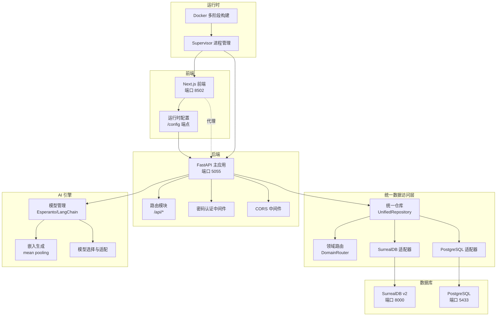
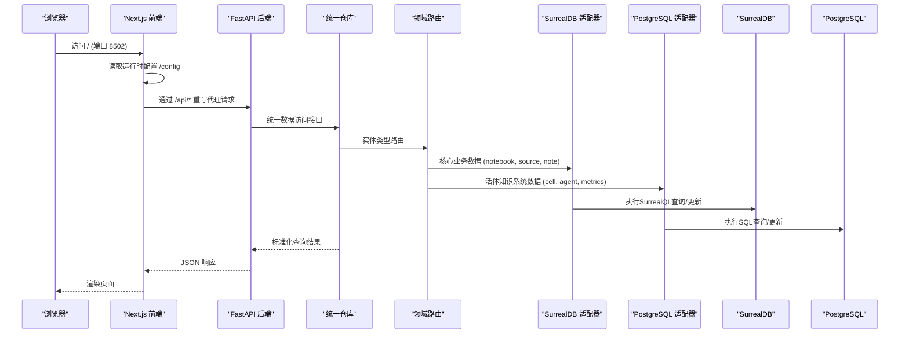
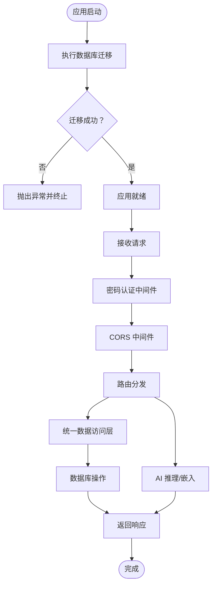
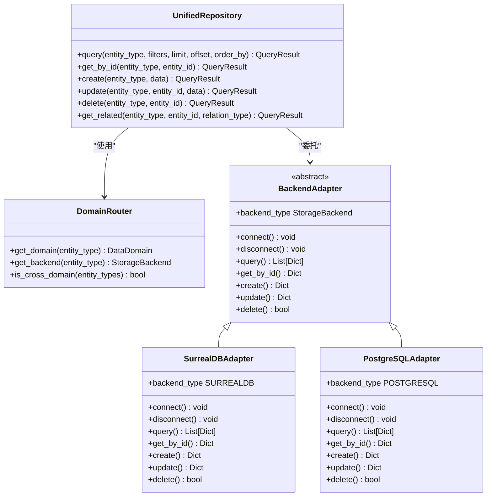
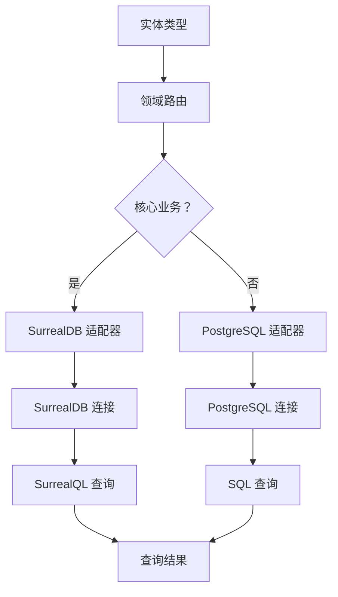
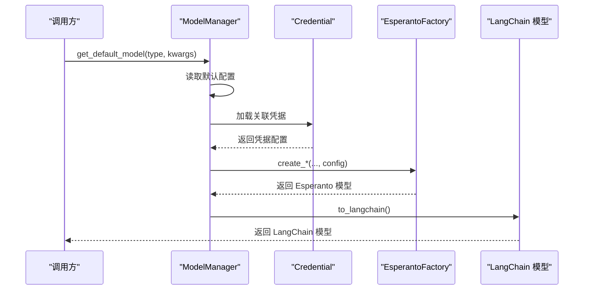
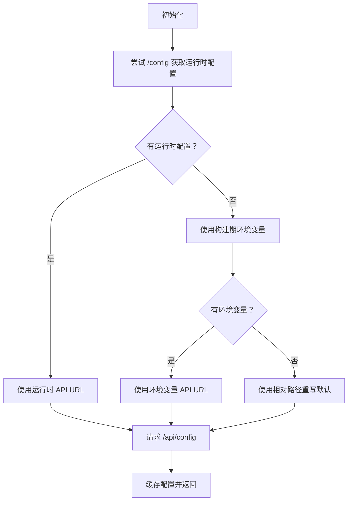
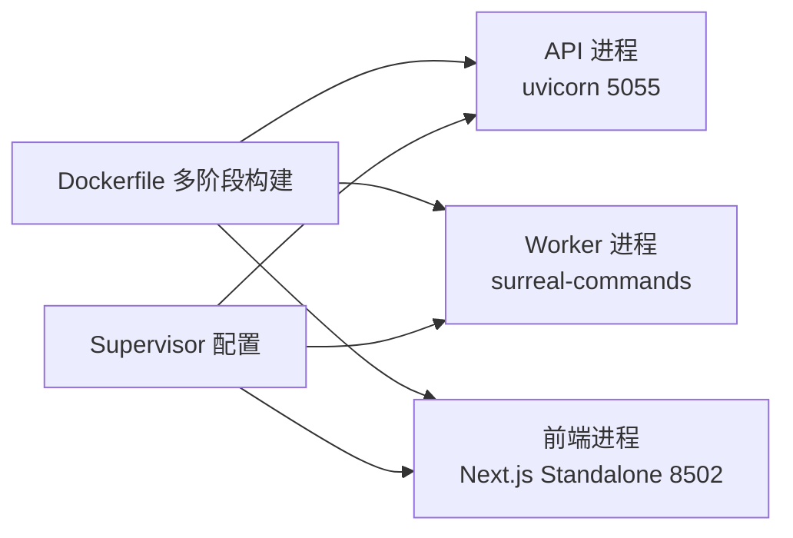
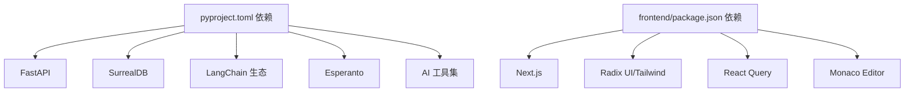

# 技术栈概览

<cite>
**本文档引用的文件**
- [README.md](file://README.md)
- [pyproject.toml](file://pyproject.toml)
- [frontend/package.json](file://frontend/package.json)
- [Dockerfile](file://Dockerfile)
- [docker-compose.yml](file://docker-compose.yml)
- [api/main.py](file://api/main.py)
- [open_notebook/config.py](file://open_notebook/config.py)
- [frontend/src/lib/config.ts](file://frontend/src/lib/config.ts)
- [open_notebook/ai/models.py](file://open_notebook/ai/models.py)
- [open_notebook/database/repository.py](file://open_notebook/database/repository.py)
- [open_notebook/database/unified_repository.py](file://open_notebook/database/unified_repository.py)
- [open_notebook/database/surrealdb_adapter.py](file://open_notebook/database/surrealdb_adapter.py)
- [open_notebook/database/postgresql_adapter.py](file://open_notebook/database/postgresql_adapter.py)
- [open_notebook/ai/provision.py](file://open_notebook/ai/provision.py)
- [open_notebook/utils/embedding.py](file://open_notebook/utils/embedding.py)
- [supervisord.conf](file://supervisord.conf)
- [open_notebook/database/migrate.py](file://open_notebook/database/migrate.py)
- [open_notebook/database/async_migrate.py](file://open_notebook/database/async_migrate.py)
- [frontend/next.config.ts](file://frontend/next.config.ts)
- [frontend/tailwind.config.ts](file://frontend/tailwind.config.ts)
</cite>

## 更新摘要
**变更内容**
- 数据库架构重大升级：从单一SurrealDB到统一数据访问层支持SurrealDB和PostgreSQL双数据库架构
- 新增统一仓库模式和适配器设计，实现透明的数据访问抽象
- 引入领域路由机制，自动将实体类型路由到相应的数据库后端
- 保持原有技术栈的核心组件不变，增强系统的可扩展性和数据分离能力

## 目录
1. [简介](#简介)
2. [项目结构](#项目结构)
3. [核心组件](#核心组件)
4. [架构总览](#架构总览)
5. [详细组件分析](#详细组件分析)
6. [依赖关系分析](#依赖关系分析)
7. [性能考量](#性能考量)
8. [故障排查指南](#故障排查指南)
9. [结论](#结论)

## 简介
本项目采用现代全栈技术组合：后端使用 Python/FastAPI 提供高性能 REST API；前端采用 Next.js/React 构建现代化用户界面；数据库层通过统一数据访问层支持SurrealDB和PostgreSQL双数据库架构，实现业务数据与活体知识系统的分离存储；AI 能力通过 LangChain 生态与多提供商适配器（Esperanto）集成，支持 OpenAI、Anthropic、Ollama 等多种推理与嵌入模型。整体架构强调隐私可控、可扩展与开发效率，并通过容器化与反向代理简化部署。

## 项目结构
项目采用前后端分离与微服务化思路，现已升级为统一数据访问层架构：
- 后端 API：FastAPI 应用，按功能模块拆分为多个路由子系统，统一在主应用中注册。
- 前端 UI：Next.js 应用，通过 API 重写代理到后端，支持独立部署与反向代理场景。
- 数据库层：统一数据访问层（Unified Repository）支持SurrealDB和PostgreSQL双数据库架构，通过适配器模式实现透明的数据访问。
- AI 模型管理：通过 Esperanto 统一抽象不同提供商的模型接口，结合 LangChain 执行推理与嵌入任务。
- 容器编排：Docker 多阶段构建，Supervisor 管理 API、Worker 与前端进程，统一暴露端口并支持反向代理。

**图表来源**
- [Dockerfile](file://Dockerfile#L1-L159)
- [supervisord.conf](file://supervisord.conf#L1-L41)
- [api/main.py](file://api/main.py#L1-L190)
- [frontend/next.config.ts](file://frontend/next.config.ts#L1-L36)
- [open_notebook/database/unified_repository.py](file://open_notebook/database/unified_repository.py#L1-L548)
- [open_notebook/database/surrealdb_adapter.py](file://open_notebook/database/surrealdb_adapter.py#L1-L281)
- [open_notebook/database/postgresql_adapter.py](file://open_notebook/database/postgresql_adapter.py#L1-L364)
- [open_notebook/ai/models.py](file://open_notebook/ai/models.py#L1-L267)
- [open_notebook/utils/embedding.py](file://open_notebook/utils/embedding.py#L1-L208)

**章节来源**
- [Dockerfile](file://Dockerfile#L1-L159)
- [docker-compose.yml](file://docker-compose.yml#L1-L37)
- [api/main.py](file://api/main.py#L1-L190)
- [frontend/next.config.ts](file://frontend/next.config.ts#L1-L36)

## 核心组件
- 后端框架与路由
  - FastAPI 提供异步高性能 API，内置自动 OpenAPI 文档与中间件链。
  - 路由按功能模块划分，统一前缀 /api，便于扩展与维护。
- 统一数据访问层
  - **新增** UnifiedRepository 作为统一接口，支持SurrealDB和PostgreSQL双数据库架构。
  - DomainRouter 根据实体类型自动路由到相应的数据库后端。
  - SurrealDBAdapter 和 PostgreSQLAdapter 分别包装现有数据库实现，提供统一的CRUD接口。
- AI 能力层
  - Esperanto 抽象多提供商模型接口，LangChain 执行推理与工具调用。
  - 嵌入生成支持批量与分块 mean pooling，提升长文本处理效率。
- 前端运行时
  - Next.js 通过重写代理隐藏后端端口差异，支持运行时配置与反向代理场景。
- 运行时与容器化
  - Docker 多阶段构建优化镜像体积与启动时间；Supervisor 管理 API、Worker 与前端进程。

**章节来源**
- [api/main.py](file://api/main.py#L157-L180)
- [open_notebook/database/unified_repository.py](file://open_notebook/database/unified_repository.py#L323-L548)
- [open_notebook/database/surrealdb_adapter.py](file://open_notebook/database/surrealdb_adapter.py#L23-L281)
- [open_notebook/database/postgresql_adapter.py](file://open_notebook/database/postgresql_adapter.py#L17-L364)
- [open_notebook/ai/models.py](file://open_notebook/ai/models.py#L97-L267)
- [open_notebook/utils/embedding.py](file://open_notebook/utils/embedding.py#L82-L208)
- [frontend/src/lib/config.ts](file://frontend/src/lib/config.ts#L1-L149)
- [Dockerfile](file://Dockerfile#L1-L159)
- [supervisord.conf](file://supervisord.conf#L1-L41)

## 架构总览
系统采用"前端 Next.js + 后端 FastAPI + 统一数据访问层 + AI 框架"的分层架构，通过 API 重写与运行时配置实现灵活部署与反向代理支持。统一数据访问层通过适配器模式实现SurrealDB和PostgreSQL的透明访问，Supervisor 统一管理三个进程，确保容器内稳定运行。

**图表来源**
- [frontend/next.config.ts](file://frontend/next.config.ts#L15-L32)
- [frontend/src/lib/config.ts](file://frontend/src/lib/config.ts#L59-L140)
- [api/main.py](file://api/main.py#L157-L180)
- [open_notebook/database/unified_repository.py](file://open_notebook/database/unified_repository.py#L194-L244)
- [open_notebook/database/surrealdb_adapter.py](file://open_notebook/database/surrealdb_adapter.py#L61-L118)
- [open_notebook/database/postgresql_adapter.py](file://open_notebook/database/postgresql_adapter.py#L70-L131)

## 详细组件分析

### 后端 API（FastAPI）
- 生命周期与中间件
  - 启动时执行数据库迁移，失败则快速退出，保证 schema 一致性。
  - 密码认证中间件排除健康检查与公开端点，CORS 中间件统一处理跨域。
- 路由组织
  - 按功能模块注册路由，统一前缀 /api，标签化便于文档生成。
- 错误处理
  - 自定义异常处理器确保错误响应包含 CORS 头，避免上传 413 前被反向代理拦截。

**图表来源**
- [api/main.py](file://api/main.py#L47-L96)
- [api/main.py](file://api/main.py#L105-L154)
- [api/main.py](file://api/main.py#L157-L180)

**章节来源**
- [api/main.py](file://api/main.py#L1-L190)

### 统一数据访问层（新增）
- **统一仓库接口**
  - UnifiedRepository 抽象了所有数据库操作，提供一致的CRUD接口。
  - 支持查询、创建、更新、删除、关联查询等标准操作。
  - 返回标准化的QueryResult，包含数据源信息和查询耗时。
- **领域路由机制**
  - DomainRouter 根据实体类型自动选择数据库后端。
  - 核心业务数据（notebook、source、note等）路由到SurrealDB。
  - 活体知识系统数据（cell、agent、metrics等）路由到PostgreSQL。
  - 支持跨域查询的特殊处理机制。
- **适配器模式实现**
  - SurrealDBAdapter 包装现有repository.py函数，提供统一接口。
  - PostgreSQLAdapter 包装LKS的PostgreSQLDatabase类，实现Living System数据访问。
  - 所有适配器实现BackendAdapter接口，确保一致性。

**图表来源**
- [open_notebook/database/unified_repository.py](file://open_notebook/database/unified_repository.py#L71-L188)
- [open_notebook/database/unified_repository.py](file://open_notebook/database/unified_repository.py#L194-L244)
- [open_notebook/database/unified_repository.py](file://open_notebook/database/unified_repository.py#L250-L317)
- [open_notebook/database/surrealdb_adapter.py](file://open_notebook/database/surrealdb_adapter.py#L23-L60)
- [open_notebook/database/postgresql_adapter.py](file://open_notebook/database/postgresql_adapter.py#L17-L51)

**章节来源**
- [open_notebook/database/unified_repository.py](file://open_notebook/database/unified_repository.py#L1-L548)
- [open_notebook/database/surrealdb_adapter.py](file://open_notebook/database/surrealdb_adapter.py#L1-L281)
- [open_notebook/database/postgresql_adapter.py](file://open_notebook/database/postgresql_adapter.py#L1-L364)

### 数据库访问（已升级）
- **SurrealDB 适配器**
  - 包装现有 repository.py 函数，提供统一的CRUD接口。
  - 支持SurrealQL查询构建，自动处理参数绑定和记录ID转换。
  - 利用SurrealDB原生图查询能力，支持复杂的关系查询。
- **PostgreSQL 适配器**
  - 包装LKS的PostgreSQLDatabase类，实现Living System数据访问。
  - 支持标准SQL查询构建，自动处理参数绑定和结果映射。
  - 针对活体知识系统特定实体类型提供专门的保存和查询方法。
- **连接管理**
  - SurrealDB使用per-operation连接，通过连接测试验证可用性。
  - PostgreSQL使用连接池管理，支持并发查询和事务处理。

**图表来源**
- [open_notebook/database/unified_repository.py](file://open_notebook/database/unified_repository.py#L224-L244)
- [open_notebook/database/surrealdb_adapter.py](file://open_notebook/database/surrealdb_adapter.py#L37-L60)
- [open_notebook/database/postgresql_adapter.py](file://open_notebook/database/postgresql_adapter.py#L37-L51)

**章节来源**
- [open_notebook/database/surrealdb_adapter.py](file://open_notebook/database/surrealdb_adapter.py#L1-L281)
- [open_notebook/database/postgresql_adapter.py](file://open_notebook/database/postgresql_adapter.py#L1-L364)

### AI 模型管理（Esperanto + LangChain）
- 模型抽象
  - 统一语言模型、嵌入模型、语音识别与合成模型接口，支持凭据注入与环境变量回退。
- 默认模型与选择策略
  - 根据内容长度与显式指定模型选择最佳推理模型，确保大上下文场景可用。
- 嵌入生成
  - 支持批量嵌入与长文本分块 + mean pooling，降低 API 调用次数并保持向量一致性。

**图表来源**
- [open_notebook/ai/models.py](file://open_notebook/ai/models.py#L97-L267)
- [open_notebook/ai/provision.py](file://open_notebook/ai/provision.py#L9-L61)

**章节来源**
- [open_notebook/ai/models.py](file://open_notebook/ai/models.py#L1-L267)
- [open_notebook/ai/provision.py](file://open_notebook/ai/provision.py#L1-L61)
- [open_notebook/utils/embedding.py](file://open_notebook/utils/embedding.py#L82-L208)

### 前端运行时配置与代理
- 运行时配置优先级
  - 优先从后端 /api/config 获取运行时 API 地址，其次使用构建期环境变量，最后使用相对路径重写。
- Next.js 代理
  - 将 /api/* 请求代理到后端 API（默认 5055），简化反向代理配置。
- 文件上传限制
  - 提升代理客户端最大请求体大小，适配大文件上传场景。

**图表来源**
- [frontend/src/lib/config.ts](file://frontend/src/lib/config.ts#L59-L140)
- [frontend/next.config.ts](file://frontend/next.config.ts#L15-L32)

**章节来源**
- [frontend/src/lib/config.ts](file://frontend/src/lib/config.ts#L1-L149)
- [frontend/next.config.ts](file://frontend/next.config.ts#L1-L36)

### 容器化与进程管理
- 多阶段构建
  - 构建阶段安装 uv、Node.js，使用 frozen 依赖加速构建；运行阶段仅包含最小运行时与已构建前端产物。
- 进程管理
  - Supervisor 管理 API、Worker 与前端进程，统一输出与自动重启策略。
- 端口与网络
  - 前端监听 8502，API 监听 5055；容器内通过重写代理或反向代理对外暴露。

**图表来源**
- [Dockerfile](file://Dockerfile#L1-L159)
- [supervisord.conf](file://supervisord.conf#L7-L41)

**章节来源**
- [Dockerfile](file://Dockerfile#L1-L159)
- [supervisord.conf](file://supervisord.conf#L1-L41)

## 依赖关系分析
- 后端依赖
  - FastAPI、Uvicorn、Pydantic、Loguru、SurrealDB、LangChain 生态、Esperanto、Podcast Creator 等。
- 前端依赖
  - Next.js、Radix UI、TanStack React Query、Monaco Editor、i18n、TailwindCSS 等。
- 版本与兼容性
  - Python 3.11–3.12（项目要求 3.11–3.13），SurrealDB v2，LangGraph 1.x，Next.js 16.x。
- 第三方集成
  - 通过 Esperanto 统一多提供商模型接入，支持 OpenAI、Anthropic、Ollama、Groq、Google 等。

**图表来源**
- [pyproject.toml](file://pyproject.toml#L15-L43)
- [frontend/package.json](file://frontend/package.json#L14-L57)

**章节来源**
- [pyproject.toml](file://pyproject.toml#L1-L100)
- [frontend/package.json](file://frontend/package.json#L1-L77)

## 性能考量
- 启动与冷启动
  - 多阶段构建减少运行时体积，Supervisor 管理进程，缩短启动时间。
- 数据库访问
  - 通过统一数据访问层减少重复连接开销；适配器模式支持连接池和并发查询。
  - 对并发冲突进行调试级日志，避免噪声。
- AI 推理与嵌入
  - 批量嵌入与分块 mean pooling 降低 API 调用次数；根据内容长度动态选择大上下文模型。
- 前端代理
  - 通过 Next.js 重写代理隐藏后端端口差异，减少反向代理复杂度，提升用户体验。

## 故障排查指南
- 健康检查与迁移
  - 启动时若数据库迁移失败会立即报错并终止，需检查数据库连接与凭据。
- 统一数据访问层
  - **新增** 如果遇到"No adapter available for entity type"错误，检查实体类型是否正确配置在DomainRouter中。
  - **新增** PostgreSQL连接失败时，检查数据库端口（默认5433）和服务状态。
- CORS 与上传
  - 若出现上传 413，需在反向代理层调整请求体大小限制；自定义异常处理器已在后端确保 CORS 头存在。
- 运行时配置
  - 前端优先从后端 /api/config 获取运行时 API 地址，若失败请检查后端 /config 端点与网络连通性。
- 进程状态
  - 使用 Supervisor 查看 API、Worker、前端进程状态，确认自动重启策略生效。

**章节来源**
- [api/main.py](file://api/main.py#L47-L96)
- [api/main.py](file://api/main.py#L130-L154)
- [open_notebook/database/unified_repository.py](file://open_notebook/database/unified_repository.py#L342-L361)
- [frontend/src/lib/config.ts](file://frontend/src/lib/config.ts#L59-L140)
- [supervisord.conf](file://supervisord.conf#L7-L41)

## 结论
本项目以 FastAPI、Next.js、统一数据访问层和 LangChain 生态为核心，构建了隐私可控、可扩展且易于部署的全栈研究助手平台。通过引入统一数据访问层，系统实现了SurrealDB和PostgreSQL的透明访问，支持核心业务数据与活体知识系统的分离存储，增强了系统的可扩展性和数据管理能力。通过运行时配置与 API 重写代理，系统在单容器与多容器部署场景下均具备良好灵活性；通过 Esperanto 的多提供商抽象与 LangChain 的工具链，实现了强大的 AI 能力集成。容器化与 Supervisor 的组合进一步提升了生产环境的稳定性与可维护性。