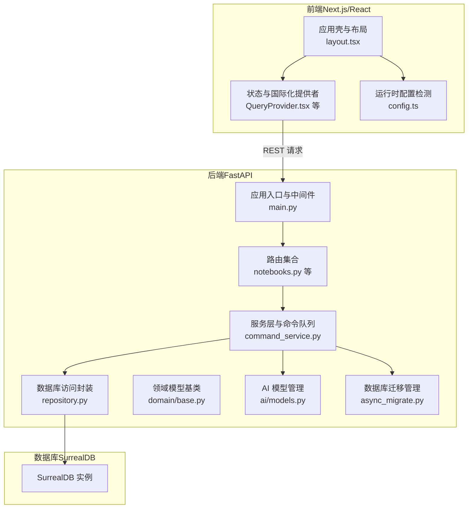
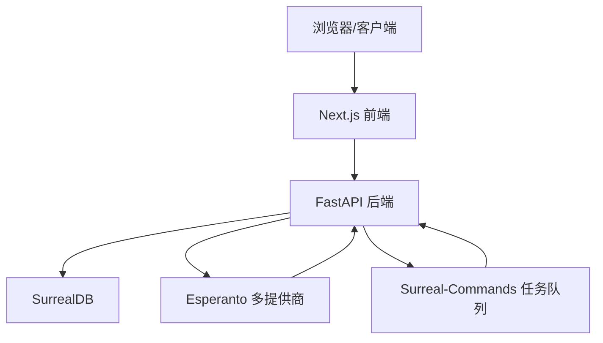
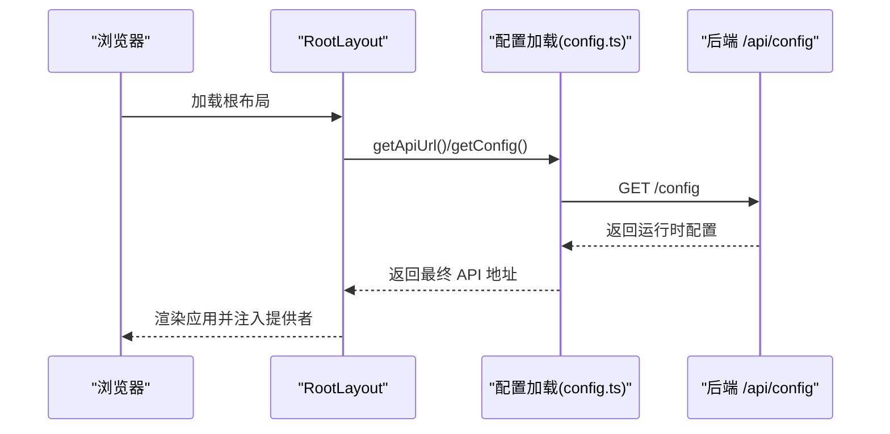
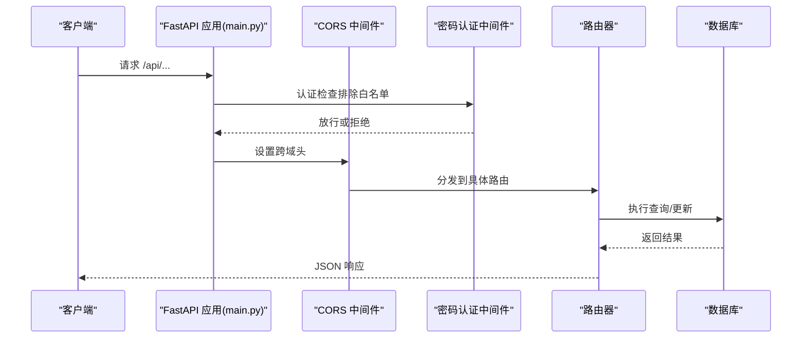
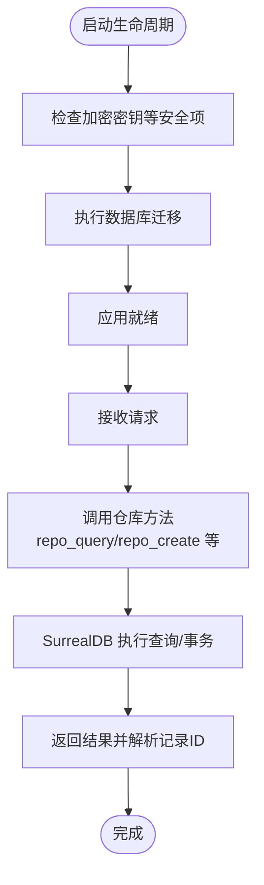
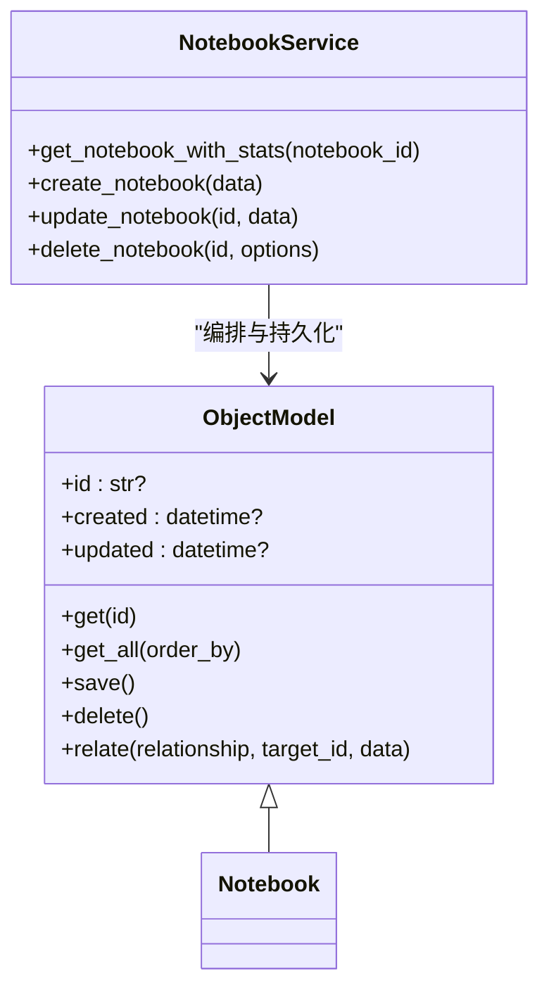
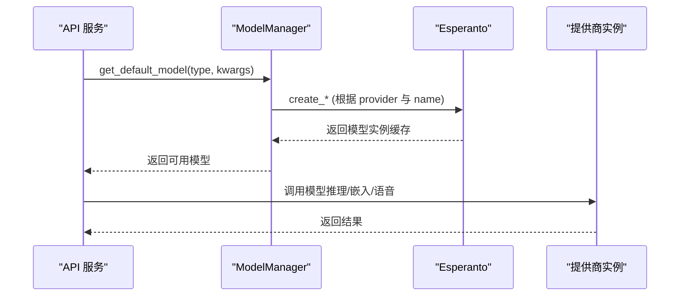
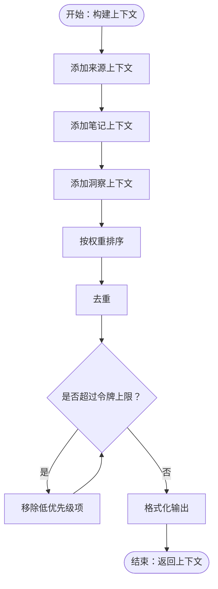
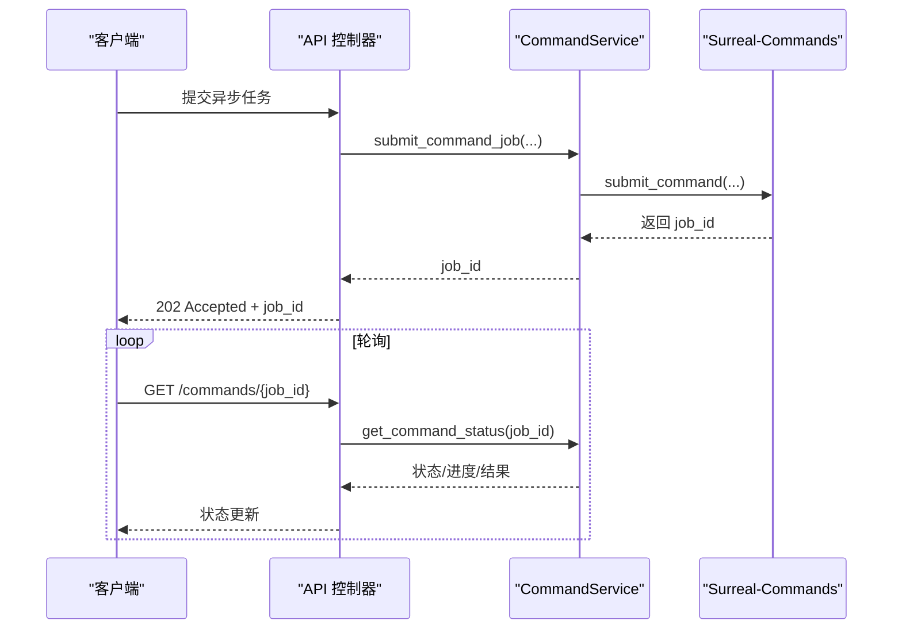
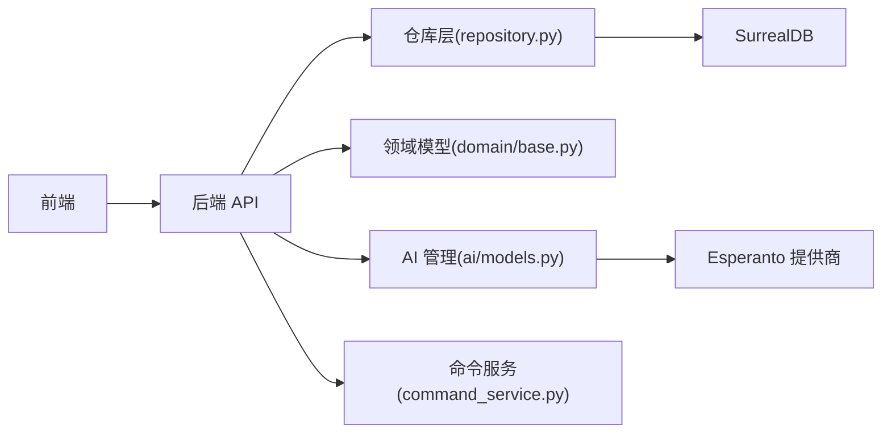

# 架构设计理念

<cite>
**本文引用的文件**
- [README.md](file://README.md)
- [docs/7-DEVELOPMENT/architecture.md](file://docs/7-DEVELOPMENT/architecture.md)
- [api/main.py](file://api/main.py)
- [frontend/src/app/layout.tsx](file://frontend/src/app/layout.tsx)
- [open_notebook/database/repository.py](file://open_notebook/database/repository.py)
- [open_notebook/domain/base.py](file://open_notebook/domain/base.py)
- [open_notebook/ai/models.py](file://open_notebook/ai/models.py)
- [api/routers/notebooks.py](file://api/routers/notebooks.py)
- [frontend/src/lib/config.ts](file://frontend/src/lib/config.ts)
- [open_notebook/graphs/chat.py](file://open_notebook/graphs/chat.py)
- [open_notebook/utils/context_builder.py](file://open_notebook/utils/context_builder.py)
- [api/command_service.py](file://api/command_service.py)
- [open_notebook/database/async_migrate.py](file://open_notebook/database/async_migrate.py)
- [frontend/src/components/providers/QueryProvider.tsx](file://frontend/src/components/providers/QueryProvider.tsx)
</cite>

## 目录
1. [引言](#引言)
2. [项目结构](#项目结构)
3. [核心组件](#核心组件)
4. [架构总览](#架构总览)
5. [详细组件分析](#详细组件分析)
6. [依赖分析](#依赖分析)
7. [性能考量](#性能考量)
8. [故障排查指南](#故障排查指南)
9. [结论](#结论)
10. [附录](#附录)

## 引言
本文件系统化阐述 Open Notebook 的架构设计理念与实现原理，围绕三层架构（前端/后端/数据库）、异步优先、领域驱动设计、多提供商 AI 集成、图与向量混合能力等核心思想展开。文档旨在帮助开发者快速理解系统的边界划分、数据流与组件交互模式，并为后续扩展开发提供坚实的理论基础。

## 项目结构
Open Notebook 采用前后端分离与微服务化（以单进程 FastAPI 为核心）相结合的组织方式：前端基于 Next.js/React，后端以 FastAPI 提供 REST API，数据库采用 SurrealDB（具备图/文档/向量一体化能力）。项目通过明确的路由与服务层解耦业务逻辑，配合 LangGraph 实现复杂工作流编排，通过 Esperanto 统一接入多家 AI 提供商。

**图表来源**
- [frontend/src/app/layout.tsx](file://frontend/src/app/layout.tsx#L19-L45)
- [frontend/src/components/providers/QueryProvider.tsx](file://frontend/src/components/providers/QueryProvider.tsx#L10-L15)
- [frontend/src/lib/config.ts](file://frontend/src/lib/config.ts#L22-L54)
- [api/main.py](file://api/main.py#L99-L190)
- [api/routers/notebooks.py](file://api/routers/notebooks.py#L17-L328)
- [api/command_service.py](file://api/command_service.py#L7-L93)
- [open_notebook/database/repository.py](file://open_notebook/database/repository.py#L47-L63)
- [open_notebook/ai/models.py](file://open_notebook/ai/models.py#L97-L267)
- [open_notebook/database/async_migrate.py](file://open_notebook/database/async_migrate.py#L91-L229)

**章节来源**
- [README.md](file://README.md#L93-L358)
- [docs/7-DEVELOPMENT/architecture.md](file://docs/7-DEVELOPMENT/architecture.md#L40-L203)

## 核心组件
- 前端层（Next.js/React）
  - 负责用户界面渲染、状态管理（Zustand）、服务端状态同步（TanStack Query）、国际化与主题切换、连接状态与错误边界等。
  - 运行时配置检测支持同一镜像在不同环境下的灵活部署。
- 后端层（FastAPI）
  - 提供 REST API、认证中间件、CORS、异常处理、数据库迁移、命令队列与工作流编排。
  - 通过服务层协调领域模型与数据库操作，统一接入 Esperanto 多提供商 AI。
- 数据库层（SurrealDB）
  - 图/文档/向量一体化存储，支持原生向量检索、全文检索、ACID 事务与关系建模。
  - 自动迁移管理，版本化追踪。

**章节来源**
- [docs/7-DEVELOPMENT/architecture.md](file://docs/7-DEVELOPMENT/architecture.md#L55-L203)
- [frontend/src/lib/config.ts](file://frontend/src/lib/config.ts#L22-L149)
- [api/main.py](file://api/main.py#L99-L190)
- [open_notebook/database/repository.py](file://open_notebook/database/repository.py#L65-L195)
- [open_notebook/database/async_migrate.py](file://open_notebook/database/async_migrate.py#L91-L229)

## 架构总览
Open Notebook 采用“三层架构 + 异步优先 + 工作流编排”的设计范式：
- 分层清晰：前端负责表现与交互，后端负责业务与数据，数据库负责持久化与检索。
- 微服务化：后端以单一进程暴露 REST API，但内部通过服务层与命令队列实现任务解耦；数据库自包含，减少外部依赖。
- 前后端分离：前端通过 REST 与 SSE 获取数据，支持流式响应与实时更新。
- 可扩展性：LangGraph 工作流、Esperanto 多提供商抽象、SurrealDB 关系与向量能力共同支撑未来扩展。

**图表来源**
- [docs/7-DEVELOPMENT/architecture.md](file://docs/7-DEVELOPMENT/architecture.md#L40-L203)
- [api/main.py](file://api/main.py#L99-L190)
- [open_notebook/ai/models.py](file://open_notebook/ai/models.py#L97-L267)
- [api/command_service.py](file://api/command_service.py#L10-L45)

## 详细组件分析

### 前端：Next.js 应用与状态管理
- 应用壳与布局：根布局集中注入主题、国际化、错误边界与连接守卫，确保一致的用户体验与错误兜底。
- 状态管理：TanStack Query 负责服务端状态同步与缓存，Zustand 负责轻量全局状态。
- 运行时配置：优先从服务端 /config 获取 API 地址，其次使用构建期环境变量，最终回退到相对路径重写，避免跨域与端口映射问题。

**图表来源**
- [frontend/src/app/layout.tsx](file://frontend/src/app/layout.tsx#L19-L45)
- [frontend/src/lib/config.ts](file://frontend/src/lib/config.ts#L59-L140)

**章节来源**
- [frontend/src/app/layout.tsx](file://frontend/src/app/layout.tsx#L19-L45)
- [frontend/src/lib/config.ts](file://frontend/src/lib/config.ts#L22-L149)
- [frontend/src/components/providers/QueryProvider.tsx](file://frontend/src/components/providers/QueryProvider.tsx#L10-L15)

### 后端：FastAPI 应用与中间件
- 生命周期与启动流程：在 lifespan 中执行数据库迁移、安全检查与中间件注册，保证启动一致性。
- 中间件：密码认证中间件（排除健康/登录等端点），CORS 中间件最后注册以覆盖错误响应头。
- 路由组织：按功能模块拆分路由器（notebooks、sources、chat、search、podcasts 等），统一前缀与标签。
- 错误处理：自定义异常处理器确保 CORS 头在错误响应中生效，便于前端诊断。

**图表来源**
- [api/main.py](file://api/main.py#L47-L190)
- [api/routers/notebooks.py](file://api/routers/notebooks.py#L20-L88)

**章节来源**
- [api/main.py](file://api/main.py#L47-L190)
- [api/routers/notebooks.py](file://api/routers/notebooks.py#L20-L88)

### 数据库：SurrealDB 封装与迁移
- 连接与工具：统一的连接上下文、记录 ID 解析与转换、查询/插入/更新/删除/关联等通用方法。
- 迁移管理：版本化迁移脚本自动执行，失败保护与版本表追踪，支持回滚。
- 查询示例：笔记本列表带来源与笔记计数聚合查询，展示关系与统计信息的结合使用。

**图表来源**
- [api/main.py](file://api/main.py#L47-L96)
- [open_notebook/database/repository.py](file://open_notebook/database/repository.py#L65-L195)
- [open_notebook/database/async_migrate.py](file://open_notebook/database/async_migrate.py#L169-L189)

**章节来源**
- [open_notebook/database/repository.py](file://open_notebook/database/repository.py#L65-L195)
- [open_notebook/database/async_migrate.py](file://open_notebook/database/async_migrate.py#L91-L229)
- [api/routers/notebooks.py](file://api/routers/notebooks.py#L20-L60)

### 领域模型与服务层
- 领域模型基类：提供统一的 CRUD、关系建立、保存与删除、时间戳处理与验证器集成。
- 服务层职责：输入校验（Pydantic）、数据库操作编排、工作流触发、错误处理与日志记录。
- 示例：笔记本路由对查询、创建、更新、关联与删除进行完整封装，体现服务层对领域对象的编排能力。

**图表来源**
- [open_notebook/domain/base.py](file://open_notebook/domain/base.py#L31-L183)
- [api/routers/notebooks.py](file://api/routers/notebooks.py#L62-L216)

**章节来源**
- [open_notebook/domain/base.py](file://open_notebook/domain/base.py#L31-L183)
- [api/routers/notebooks.py](file://api/routers/notebooks.py#L62-L216)

### AI 提供商集成与模型管理
- ModelManager：集中式工厂，按类型创建语言模型、嵌入模型、语音识别与合成模型；支持凭据注入与环境变量回退；支持默认模型与按需覆盖。
- Esperanto 抽象：统一对接多家提供商，支持本地 Ollama 与多种嵌入/语音能力，提供智能回退与成本估算。

**图表来源**
- [open_notebook/ai/models.py](file://open_notebook/ai/models.py#L97-L267)

**章节来源**
- [open_notebook/ai/models.py](file://open_notebook/ai/models.py#L97-L267)

### LangGraph 工作流与上下文构建
- Chat 工作流：基于 LangGraph 的消息状态机，支持会话记忆、模型调用与响应清洗。
- 上下文构建：ContextBuilder 支持从笔记本/来源/笔记构建上下文，按权重与令牌限制裁剪，支持洞察与笔记的灵活组合。

**图表来源**
- [open_notebook/utils/context_builder.py](file://open_notebook/utils/context_builder.py#L105-L417)
- [open_notebook/graphs/chat.py](file://open_notebook/graphs/chat.py#L19-L94)

**章节来源**
- [open_notebook/utils/context_builder.py](file://open_notebook/utils/context_builder.py#L105-L417)
- [open_notebook/graphs/chat.py](file://open_notebook/graphs/chat.py#L19-L94)

### 任务队列与异步处理
- 命令服务：通过 Surreal-Commands 提交后台任务（如源处理、播客生成），支持状态轮询与结果获取。
- 流式响应：长耗时任务通过 SSE 返回增量结果，提升用户体验。

**图表来源**
- [api/command_service.py](file://api/command_service.py#L10-L69)

**章节来源**
- [api/command_service.py](file://api/command_service.py#L10-L69)

## 依赖分析
- 组件内聚与解耦
  - 前端通过 REST 与 SSE 与后端交互，不直接依赖数据库；后端通过服务层与仓库层解耦领域逻辑与数据访问。
  - AI 提供商通过 Esperanto 抽象隔离，避免硬编码提供商差异。
- 外部依赖
  - SurrealDB：图/文档/向量一体化，简化架构与运维。
  - LangGraph：工作流编排，提升复杂场景的可维护性。
  - Esperanto：多提供商统一接口，降低供应商锁定风险。
- 潜在循环依赖
  - 通过服务层与路由器的单向依赖避免循环导入；领域模型与仓库层通过字符串 ID 与记录语法避免强耦合。

**图表来源**
- [open_notebook/database/repository.py](file://open_notebook/database/repository.py#L65-L195)
- [open_notebook/domain/base.py](file://open_notebook/domain/base.py#L31-L183)
- [open_notebook/ai/models.py](file://open_notebook/ai/models.py#L97-L267)
- [api/command_service.py](file://api/command_service.py#L10-L69)

**章节来源**
- [open_notebook/database/repository.py](file://open_notebook/database/repository.py#L65-L195)
- [open_notebook/domain/base.py](file://open_notebook/domain/base.py#L31-L183)
- [open_notebook/ai/models.py](file://open_notebook/ai/models.py#L97-L267)
- [api/command_service.py](file://api/command_service.py#L10-L69)

## 性能考量
- 异步优先：数据库、LLM 调用、文件 I/O 全面采用 async/await，提升并发与资源利用率。
- 缓存与状态同步：TanStack Query 提供请求缓存与失效策略，减少重复网络请求。
- 令牌裁剪与优先级：上下文构建阶段按权重与令牌上限裁剪，避免超限与延迟。
- 数据库优化：SurrealQL 聚合查询与关系查询减少往返次数；事务支持保证一致性。
- 流式响应：长任务通过 SSE 增量返回，改善前端交互体验。

[本节为通用性能建议，无需特定文件引用]

## 故障排查指南
- 启动与迁移
  - 若数据库版本落后，启动时自动执行迁移；若迁移失败，需检查数据库连通性与迁移脚本。
- CORS 与反向代理
  - 自定义异常处理器确保错误响应包含 CORS 头；若反向代理提前返回 413，需在代理层配置 CORS。
- 认证与安全
  - 密码认证中间件默认开启，健康/登录等端点已排除；生产环境建议升级为 OAuth/JWT。
- 数据库操作
  - 记录 ID 使用 SurrealDB 语法（table:id），确保使用辅助函数进行解析与转换；软删除通过归档字段实现。
- LangGraph 工作流
  - 会话检查点使用本地 SQLite 存储；长时间运行可能阻塞请求，建议使用流式响应与任务队列。

**章节来源**
- [api/main.py](file://api/main.py#L66-L96)
- [api/main.py](file://api/main.py#L130-L154)
- [docs/7-DEVELOPMENT/architecture.md](file://docs/7-DEVELOPMENT/architecture.md#L773-L800)

## 结论
Open Notebook 的架构以“隐私优先、异步优先、领域驱动、多提供商抽象”为核心理念，通过清晰的分层、可扩展的工作流与统一的数据库能力，实现了研究资料管理、智能对话、内容洞察与播客生成等复杂功能。该设计既满足当前需求，也为未来的实时更新、异步处理与生态扩展提供了坚实基础。

[本节为总结性内容，无需特定文件引用]

## 附录
- 快速参考
  - 前端配置优先级：运行时配置 → 构建期环境变量 → 相对路径重写。
  - 后端启动顺序：安全检查 → 数据库迁移 → 注册中间件与路由。
  - 数据库操作：统一使用仓库层方法与记录 ID 辅助函数。
  - AI 模型：通过 ModelManager 获取默认或覆盖模型，Esperanto 统一抽象。

[本节为补充说明，无需特定文件引用]