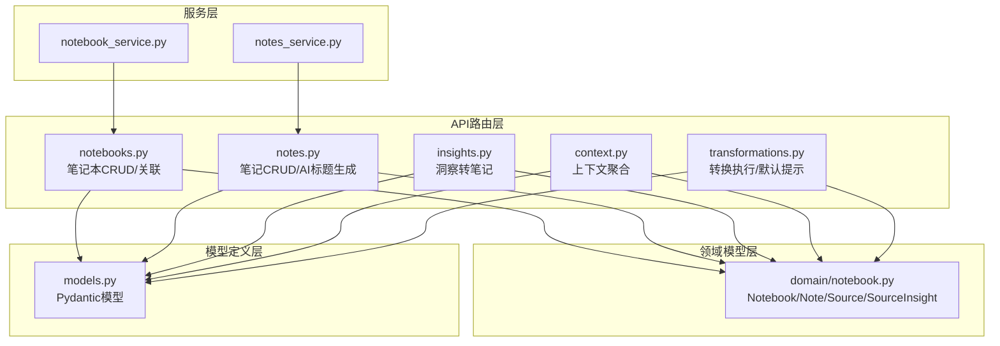
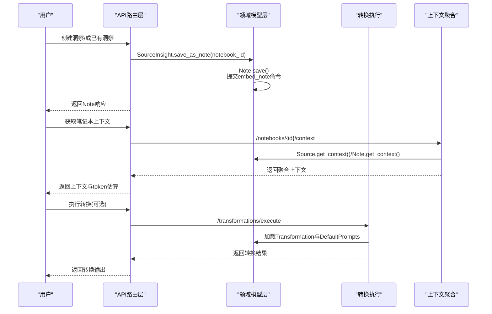
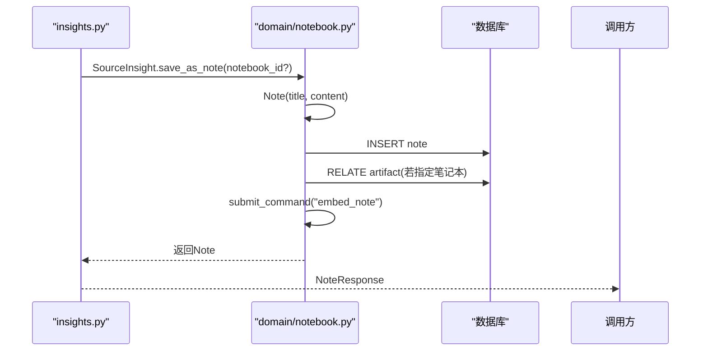
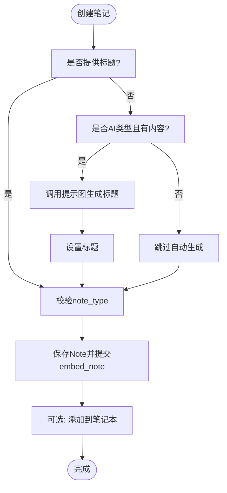
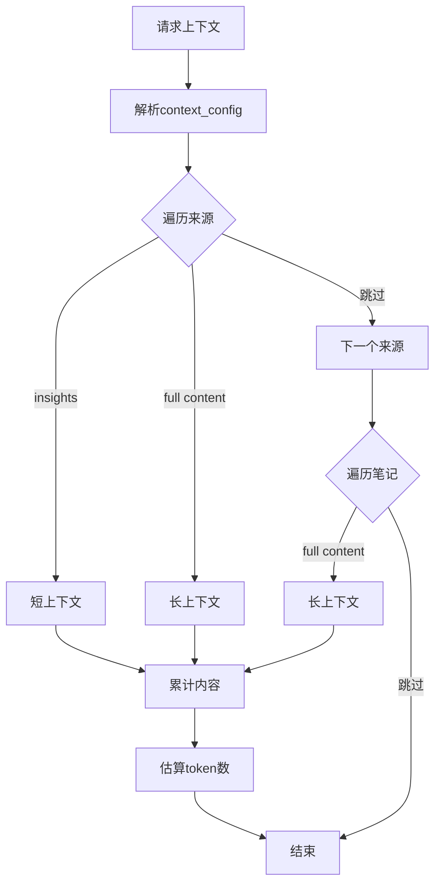
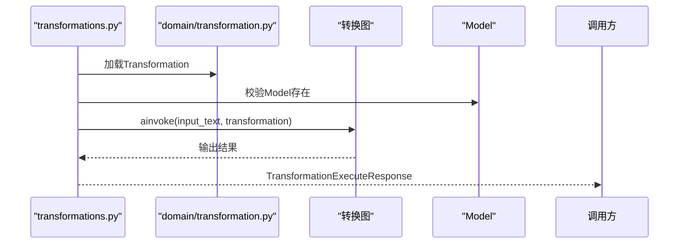
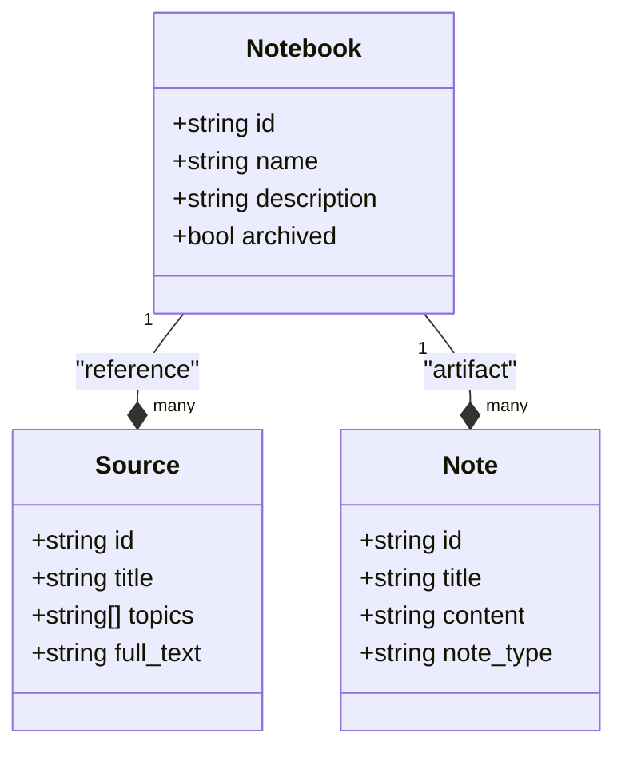
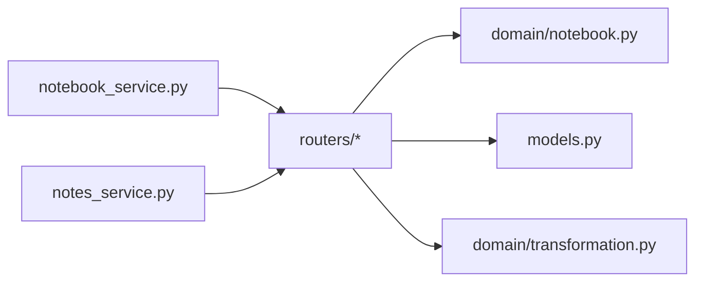

# AI驱动的笔记生成

<cite>
**本文档引用的文件**
- [api/routers/notebooks.py](file://api/routers/notebooks.py)
- [api/routers/notes.py](file://api/routers/notes.py)
- [api/routers/insights.py](file://api/routers/insights.py)
- [api/routers/context.py](file://api/routers/context.py)
- [api/routers/transformations.py](file://api/routers/transformations.py)
- [api/models.py](file://api/models.py)
- [api/notebook_service.py](file://api/notebook_service.py)
- [api/notes_service.py](file://api/notes_service.py)
- [open_notebook/domain/notebook.py](file://open_notebook/domain/notebook.py)
- [open_notebook/domain/transformation.py](file://open_notebook/domain/transformation.py)
</cite>

## 目录
1. [简介](#简介)
2. [项目结构](#项目结构)
3. [核心组件](#核心组件)
4. [架构总览](#架构总览)
5. [详细组件分析](#详细组件分析)
6. [依赖关系分析](#依赖关系分析)
7. [性能考量](#性能考量)
8. [故障排查指南](#故障排查指南)
9. [结论](#结论)
10. [附录](#附录)

## 简介
本文件面向Open Notebook的“AI驱动笔记生成”能力，系统化阐述以下主题：
- 基于AI洞察的笔记自动生成机制：智能摘要、关键信息提取、观点归纳与知识整理
- 笔记生成的触发条件、上下文选择与模板配置
- 笔记与内容源的关联关系，以及内容准确性与可追溯性保障
- 手动编辑与AI辅助编辑的结合方式
- 分类、标签、引用与导出能力
- 不同场景（学习笔记、研究总结、会议纪要）的生成策略
- 与搜索、播客等功能的协同工作机制
- 质量评估与持续改进建议

## 项目结构
围绕“笔记生成”的关键模块与文件如下：
- API路由层：负责对外暴露REST接口，处理请求与响应
- 领域模型层：封装Notebook、Note、Source、SourceInsight等实体及其行为
- 模型定义层：统一API输入输出的数据契约
- 服务层：为前端或上层调用提供便捷的封装

图表来源
- [api/routers/notebooks.py](file://api/routers/notebooks.py#L1-L328)
- [api/routers/notes.py](file://api/routers/notes.py#L1-L188)
- [api/routers/insights.py](file://api/routers/insights.py#L1-L83)
- [api/routers/context.py](file://api/routers/context.py#L1-L116)
- [api/routers/transformations.py](file://api/routers/transformations.py#L1-L251)
- [open_notebook/domain/notebook.py](file://open_notebook/domain/notebook.py#L1-L679)
- [api/models.py](file://api/models.py#L1-L685)
- [api/notebook_service.py](file://api/notebook_service.py#L1-L88)
- [api/notes_service.py](file://api/notes_service.py#L1-L104)

章节来源
- [api/routers/notebooks.py](file://api/routers/notebooks.py#L1-L328)
- [api/routers/notes.py](file://api/routers/notes.py#L1-L188)
- [api/routers/insights.py](file://api/routers/insights.py#L1-L83)
- [api/routers/context.py](file://api/routers/context.py#L1-L116)
- [api/routers/transformations.py](file://api/routers/transformations.py#L1-L251)
- [open_notebook/domain/notebook.py](file://open_notebook/domain/notebook.py#L1-L679)
- [api/models.py](file://api/models.py#L1-L685)
- [api/notebook_service.py](file://api/notebook_service.py#L1-L88)
- [api/notes_service.py](file://api/notes_service.py#L1-L104)

## 核心组件
- 笔记本（Notebook）：组织与管理一组来源与笔记，支持归档、统计等元数据操作
- 来源（Source）：内容载体，支持状态查询、洞察生成、向量化与嵌入
- 洞察（SourceInsight）：对来源进行AI分析后得到的高价值片段，可直接转为笔记
- 笔记（Note）：人类或AI生成的内容单元，支持类型标注（human/ai）、自动标题生成
- 上下文（Context）：按配置聚合来源与笔记的上下文，用于大模型推理
- 转换（Transformation）：可复用的提示词模板与执行流程，支持默认提示词管理

章节来源
- [open_notebook/domain/notebook.py](file://open_notebook/domain/notebook.py#L16-L231)
- [open_notebook/domain/notebook.py](file://open_notebook/domain/notebook.py#L288-L553)
- [open_notebook/domain/notebook.py](file://open_notebook/domain/notebook.py#L555-L610)
- [api/routers/context.py](file://api/routers/context.py#L12-L116)
- [open_notebook/domain/transformation.py](file://open_notebook/domain/transformation.py#L8-L22)
- [api/routers/transformations.py](file://api/routers/transformations.py#L23-L251)

## 架构总览
下图展示了从“洞察到笔记”的典型生成链路，以及与上下文聚合、转换执行的关系。

图表来源
- [api/routers/insights.py](file://api/routers/insights.py#L55-L83)
- [open_notebook/domain/notebook.py](file://open_notebook/domain/notebook.py#L276-L286)
- [open_notebook/domain/notebook.py](file://open_notebook/domain/notebook.py#L568-L592)
- [api/routers/context.py](file://api/routers/context.py#L12-L116)
- [api/routers/transformations.py](file://api/routers/transformations.py#L81-L117)
- [open_notebook/domain/transformation.py](file://open_notebook/domain/transformation.py#L17-L22)

## 详细组件分析

### 组件A：洞察转笔记（AI驱动的笔记生成入口）
- 触发方式
  - 将SourceInsight保存为Note，自动填充标题与内容
  - 支持指定目标笔记本，实现跨笔记本迁移
- 关键逻辑
  - 通过领域模型的save_as_note方法完成Note创建与关联
  - Note保存时异步提交embed_note命令，便于后续检索与增强
- 可追溯性
  - 洞察与来源建立强关联，笔记继承洞察内容，保留来源信息

图表来源
- [api/routers/insights.py](file://api/routers/insights.py#L55-L83)
- [open_notebook/domain/notebook.py](file://open_notebook/domain/notebook.py#L276-L286)
- [open_notebook/domain/notebook.py](file://open_notebook/domain/notebook.py#L568-L592)

章节来源
- [api/routers/insights.py](file://api/routers/insights.py#L55-L83)
- [open_notebook/domain/notebook.py](file://open_notebook/domain/notebook.py#L276-L286)
- [open_notebook/domain/notebook.py](file://open_notebook/domain/notebook.py#L568-L592)

### 组件B：AI辅助标题生成与笔记创建
- 自动标题生成
  - 当note_type为ai且未提供title时，调用提示图（prompt graph）根据内容生成标题
  - 生成后写回Note对象，保证标题质量
- 类型与内容校验
  - note_type必须为human或ai；content不可为空字符串
- 关联笔记本
  - 创建后可选择加入指定笔记本，形成artifact关系

图表来源
- [api/routers/notes.py](file://api/routers/notes.py#L49-L107)
- [open_notebook/domain/notebook.py](file://open_notebook/domain/notebook.py#L568-L592)

章节来源
- [api/routers/notes.py](file://api/routers/notes.py#L49-L107)
- [open_notebook/domain/notebook.py](file://open_notebook/domain/notebook.py#L568-L592)

### 组件C：上下文聚合与触发条件
- 触发条件
  - 用户显式请求笔记本上下文（/notebooks/{id}/context）
  - 或在执行转换前，先聚合上下文以提升输出质量
- 上下文选择
  - 支持按配置包含特定来源与笔记，并控制“短/长”上下文
  - 默认行为：包含该笔记本下的所有来源与笔记，采用短上下文
- Token估算
  - 对聚合内容进行token估算，帮助控制上下文长度与成本

图表来源
- [api/routers/context.py](file://api/routers/context.py#L12-L116)
- [open_notebook/domain/notebook.py](file://open_notebook/domain/notebook.py#L361-L375)
- [open_notebook/domain/notebook.py](file://open_notebook/domain/notebook.py#L598-L608)

章节来源
- [api/routers/context.py](file://api/routers/context.py#L12-L116)
- [open_notebook/domain/notebook.py](file://open_notebook/domain/notebook.py#L361-L375)
- [open_notebook/domain/notebook.py](file://open_notebook/domain/notebook.py#L598-L608)

### 组件D：转换执行与模板配置
- 执行流程
  - 校验Transformation与Model存在性
  - 通过转换图（transformation graph）执行，支持指定模型ID
- 模板配置
  - Transformation包含prompt与apply_default字段
  - DefaultPrompts记录全局默认提示词，支持查询与更新
- 应用场景
  - 将长文本进行“摘要/要点/结构化输出”等转换
  - 与上下文聚合配合，提升转换质量

图表来源
- [api/routers/transformations.py](file://api/routers/transformations.py#L81-L117)
- [open_notebook/domain/transformation.py](file://open_notebook/domain/transformation.py#L8-L22)

章节来源
- [api/routers/transformations.py](file://api/routers/transformations.py#L23-L251)
- [open_notebook/domain/transformation.py](file://open_notebook/domain/transformation.py#L8-L22)

### 组件E：笔记本与来源关联
- 关联关系
  - 通过reference关系将Source与Notebook关联
  - 通过artifact关系将Note与Notebook关联
- 删除策略
  - 删除笔记本时可选择级联删除仅属于该笔记本的来源
  - 共享来源仅解除关联，避免误删他人资产

图表来源
- [open_notebook/domain/notebook.py](file://open_notebook/domain/notebook.py#L16-L231)
- [open_notebook/domain/notebook.py](file://open_notebook/domain/notebook.py#L288-L553)
- [open_notebook/domain/notebook.py](file://open_notebook/domain/notebook.py#L555-L610)

章节来源
- [open_notebook/domain/notebook.py](file://open_notebook/domain/notebook.py#L16-L231)
- [open_notebook/domain/notebook.py](file://open_notebook/domain/notebook.py#L288-L553)
- [open_notebook/domain/notebook.py](file://open_notebook/domain/notebook.py#L555-L610)

### 组件F：搜索与播客的协同
- 搜索
  - 提供文本与向量两种搜索模式，支持跨来源与笔记
  - 向量搜索会统一生成嵌入，再进行相似度检索
- 播客
  - 通过播客功能生成内容后，可作为新的Source进入知识库，参与后续的洞察与笔记生成

章节来源
- [open_notebook/domain/notebook.py](file://open_notebook/domain/notebook.py#L628-L679)

## 依赖关系分析
- 路由层依赖领域模型与数据契约
- 领域模型依赖数据库仓库与命令系统，实现异步嵌入与洞察生成
- 服务层为上层调用提供统一接口，屏蔽底层细节

图表来源
- [api/routers/notebooks.py](file://api/routers/notebooks.py#L1-L328)
- [api/routers/notes.py](file://api/routers/notes.py#L1-L188)
- [api/routers/insights.py](file://api/routers/insights.py#L1-L83)
- [api/routers/context.py](file://api/routers/context.py#L1-L116)
- [api/routers/transformations.py](file://api/routers/transformations.py#L1-L251)
- [open_notebook/domain/notebook.py](file://open_notebook/domain/notebook.py#L1-L679)
- [open_notebook/domain/transformation.py](file://open_notebook/domain/transformation.py#L1-L22)
- [api/models.py](file://api/models.py#L1-L685)
- [api/notebook_service.py](file://api/notebook_service.py#L1-L88)
- [api/notes_service.py](file://api/notes_service.py#L1-L104)

章节来源
- [api/routers/notebooks.py](file://api/routers/notebooks.py#L1-L328)
- [api/routers/notes.py](file://api/routers/notes.py#L1-L188)
- [api/routers/insights.py](file://api/routers/insights.py#L1-L83)
- [api/routers/context.py](file://api/routers/context.py#L1-L116)
- [api/routers/transformations.py](file://api/routers/transformations.py#L1-L251)
- [open_notebook/domain/notebook.py](file://open_notebook/domain/notebook.py#L1-L679)
- [open_notebook/domain/transformation.py](file://open_notebook/domain/transformation.py#L1-L22)
- [api/models.py](file://api/models.py#L1-L685)
- [api/notebook_service.py](file://api/notebook_service.py#L1-L88)
- [api/notes_service.py](file://api/notes_service.py#L1-L104)

## 性能考量
- 异步嵌入与洞察
  - Note保存后提交embed_note命令，避免阻塞HTTP请求
  - Source向量化通过embed_source命令批量处理，减少连接池压力
- 上下文裁剪
  - 默认短上下文，必要时才加载长上下文，降低token消耗
- 搜索优化
  - 向量搜索统一生成嵌入，避免重复计算
- 并发与重试
  - 洞察创建采用命令系统，具备内部重试与冲突处理能力

章节来源
- [open_notebook/domain/notebook.py](file://open_notebook/domain/notebook.py#L411-L456)
- [open_notebook/domain/notebook.py](file://open_notebook/domain/notebook.py#L568-L592)
- [open_notebook/domain/notebook.py](file://open_notebook/domain/notebook.py#L648-L679)

## 故障排查指南
- 常见错误与定位
  - 输入校验失败：note_type非法、内容为空、笔记本/笔记不存在
  - 数据库操作异常：删除预览失败、上下文聚合异常
  - 模型/转换执行异常：找不到模型或转换、转换图执行失败
- 排查步骤
  - 检查API返回的状态码与错误消息
  - 查看领域模型中的异常抛出点与日志
  - 使用上下文接口确认聚合内容与token估算是否合理
  - 确认转换模板与默认提示词配置是否正确

章节来源
- [api/routers/notes.py](file://api/routers/notes.py#L108-L188)
- [api/routers/notebooks.py](file://api/routers/notebooks.py#L91-L154)
- [api/routers/context.py](file://api/routers/context.py#L12-L116)
- [api/routers/transformations.py](file://api/routers/transformations.py#L81-L117)

## 结论
Open Notebook通过“洞察—笔记—上下文—转换”的闭环，实现了AI驱动的高质量笔记生成。系统强调：
- 可追溯性：洞察与来源强关联，笔记继承来源信息
- 可扩展性：转换模板与默认提示词支持定制与复用
- 可靠性：异步嵌入与命令系统保障吞吐与稳定性
- 易用性：自动标题生成与上下文聚合降低使用门槛

## 附录

### 场景化策略建议
- 学习笔记
  - 触发：阅读来源后生成洞察，再转为笔记
  - 上下文：短上下文优先，必要时局部拉取长上下文
  - 模板：摘要/关键概念提取
- 研究总结
  - 触发：多来源对比后生成综合洞察
  - 上下文：聚合多个来源与相关笔记，长上下文
  - 模板：结构化总结/问题清单
- 会议纪要
  - 触发：播客/录音转文字后生成洞察
  - 上下文：聚焦议题与决策点
  - 模板：行动项/待办清单

### 分类、标签、引用与导出
- 分类与标签
  - 来源支持topics字段，可用于分类与筛选
  - 笔记类型区分human/ai，便于溯源与治理
- 引用与可追溯
  - 洞察与来源、笔记与洞察保持强关联
  - 笔记保存时提交embed命令，便于后续检索与增强
- 导出
  - 建议通过API批量获取笔记与来源元数据，结合上下文进行二次加工导出

章节来源
- [open_notebook/domain/notebook.py](file://open_notebook/domain/notebook.py#L294-L295)
- [open_notebook/domain/notebook.py](file://open_notebook/domain/notebook.py#L558-L559)
- [open_notebook/domain/notebook.py](file://open_notebook/domain/notebook.py#L568-L592)