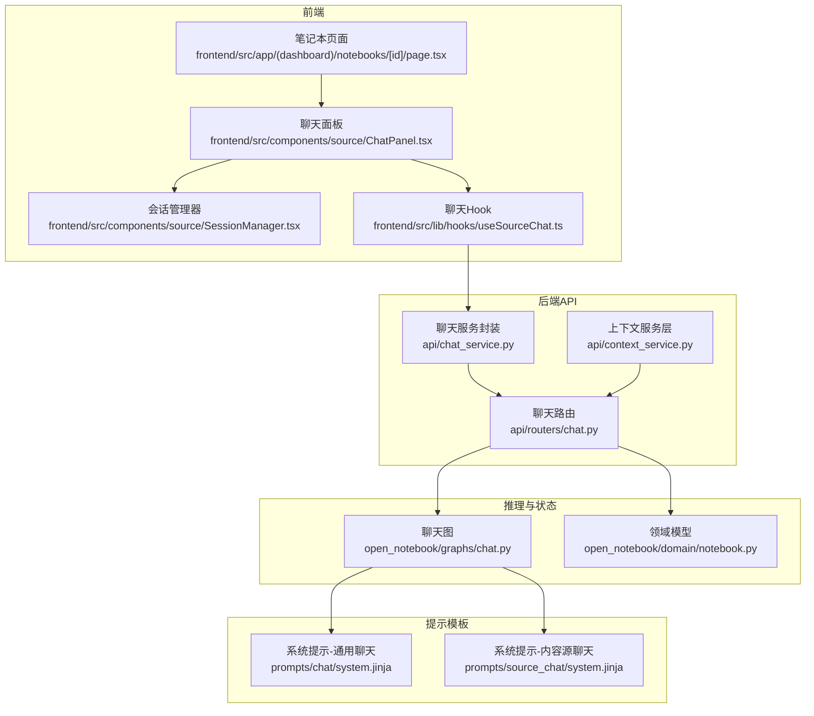
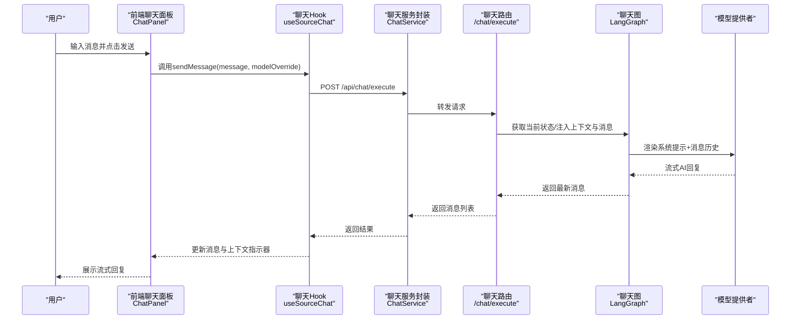
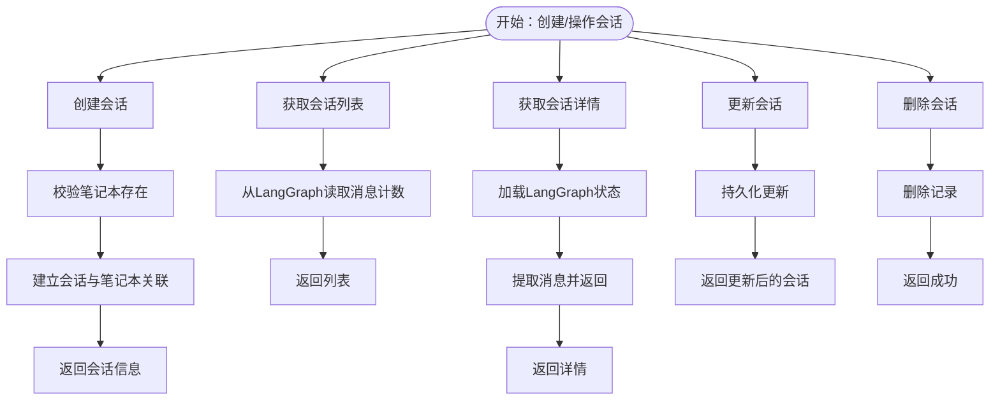
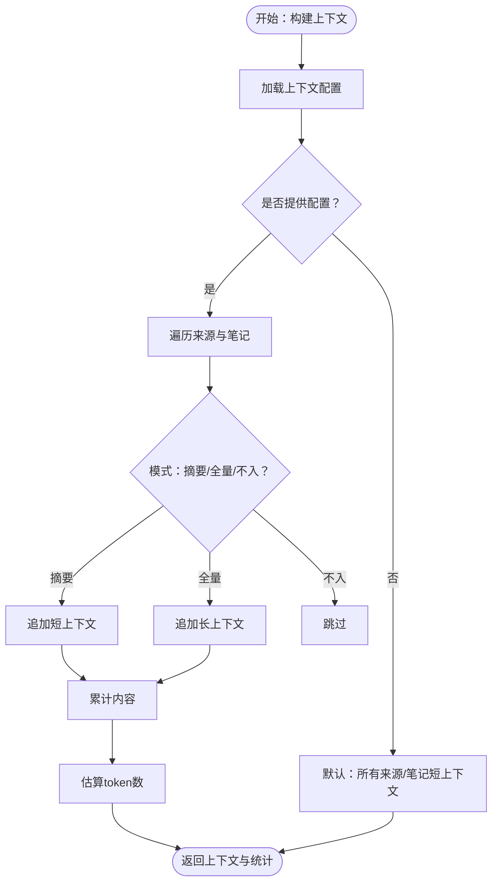
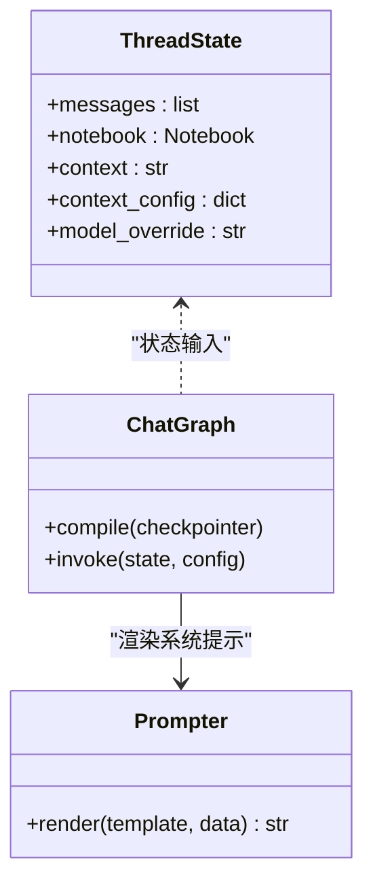
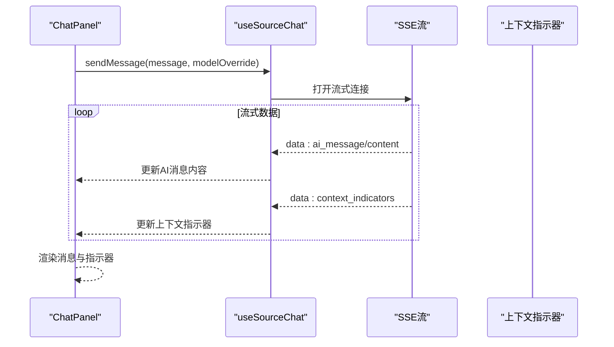
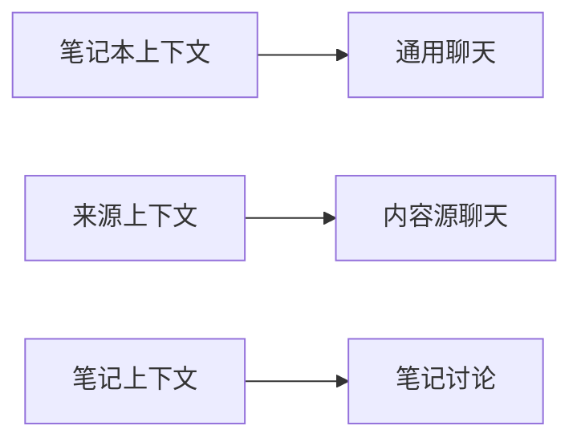
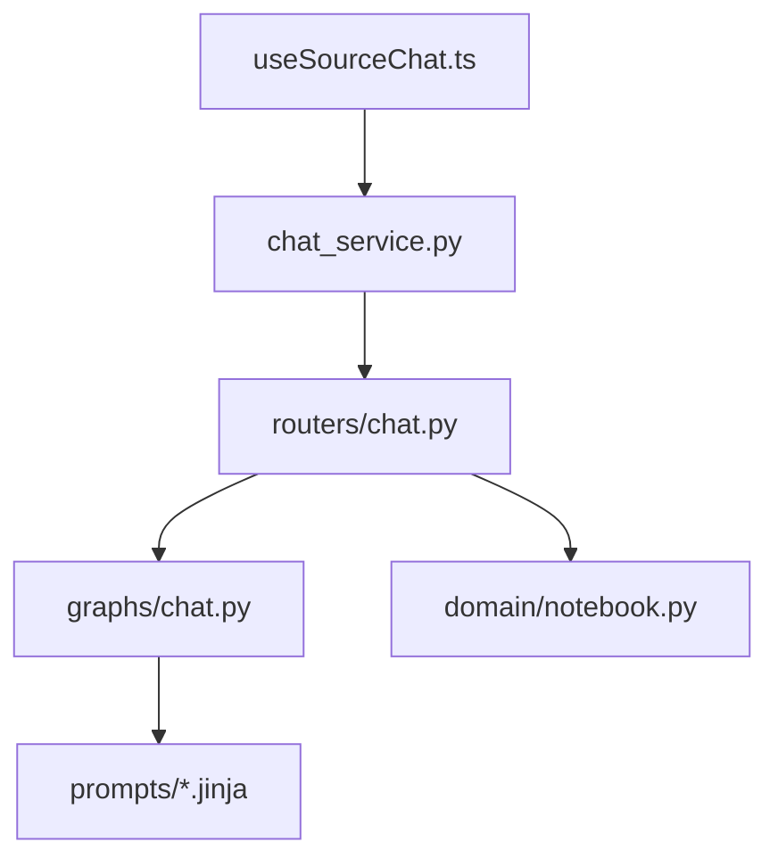

# 上下文感知AI聊天

<cite>
**本文引用的文件**
- [api/routers/chat.py](file://api/routers/chat.py)
- [api/chat_service.py](file://api/chat_service.py)
- [api/context_service.py](file://api/context_service.py)
- [open_notebook/graphs/chat.py](file://open_notebook/graphs/chat.py)
- [open_notebook/domain/notebook.py](file://open_notebook/domain/notebook.py)
- [frontend/src/app/(dashboard)/notebooks/[id]/page.tsx](file://frontend/src/app/(dashboard)/notebooks/[id]/page.tsx)
- [frontend/src/components/source/ChatPanel.tsx](file://frontend/src/components/source/ChatPanel.tsx)
- [frontend/src/components/source/SessionManager.tsx](file://frontend/src/components/source/SessionManager.tsx)
- [frontend/src/lib/hooks/useSourceChat.ts](file://frontend/src/lib/hooks/useSourceChat.ts)
- [prompts/chat/system.jinja](file://prompts/chat/system.jinja)
- [prompts/source_chat/system.jinja](file://prompts/source_chat/system.jinja)
- [docs/2-CORE-CONCEPTS/ai-context-rag.md](file://docs/2-CORE-CONCEPTS/ai-context-rag.md)
- [docs/3-USER-GUIDE/chat-effectively.md](file://docs/3-USER-GUIDE/chat-effectively.md)
</cite>

## 目录
1. [简介](#简介)
2. [项目结构](#项目结构)
3. [核心组件](#核心组件)
4. [架构总览](#架构总览)
5. [详细组件分析](#详细组件分析)
6. [依赖分析](#依赖分析)
7. [性能考虑](#性能考虑)
8. [故障排查指南](#故障排查指南)
9. [结论](#结论)
10. [附录](#附录)

## 简介
本文件面向Open Notebook的“上下文感知AI聊天”能力，系统化阐述基于RAG（检索增强生成）的智能对话机制，覆盖以下主题：
- 基于LangGraph的状态化对话流程与RAG上下文注入
- 聊天会话生命周期管理：创建、查询、更新、删除与消息读取
- 多场景聊天模式：通用笔记本聊天、内容源聊天、笔记讨论
- 上下文选择策略：按来源与笔记粒度动态控制共享范围
- 聊天界面交互设计：消息发送、流式输出、会话管理、模型切换
- 最佳实践：提示词优化、上下文控制、多轮对话管理
- 与笔记本、内容源、笔记的深度集成关系

## 项目结构
Open Notebook的聊天功能由后端API路由、聊天图执行引擎、前端会话与面板组件协同实现，并通过提示模板驱动AI行为。

**图表来源**
- [frontend/src/app/(dashboard)/notebooks/[id]/page.tsx](file://frontend/src/app/(dashboard)/notebooks/[id]/page.tsx#L1-L245)
- [frontend/src/components/source/ChatPanel.tsx](file://frontend/src/components/source/ChatPanel.tsx#L1-L375)
- [frontend/src/components/source/SessionManager.tsx](file://frontend/src/components/source/SessionManager.tsx#L1-L270)
- [frontend/src/lib/hooks/useSourceChat.ts](file://frontend/src/lib/hooks/useSourceChat.ts#L1-L252)
- [api/routers/chat.py](file://api/routers/chat.py#L1-L517)
- [api/chat_service.py](file://api/chat_service.py#L1-L169)
- [api/context_service.py](file://api/context_service.py#L1-L30)
- [open_notebook/graphs/chat.py](file://open_notebook/graphs/chat.py#L1-L94)
- [open_notebook/domain/notebook.py](file://open_notebook/domain/notebook.py#L1-L200)
- [prompts/chat/system.jinja](file://prompts/chat/system.jinja#L1-L43)
- [prompts/source_chat/system.jinja](file://prompts/source_chat/system.jinja#L1-L64)

**章节来源**
- [frontend/src/app/(dashboard)/notebooks/[id]/page.tsx](file://frontend/src/app/(dashboard)/notebooks/[id]/page.tsx#L1-L245)
- [frontend/src/components/source/ChatPanel.tsx](file://frontend/src/components/source/ChatPanel.tsx#L1-L375)
- [frontend/src/components/source/SessionManager.tsx](file://frontend/src/components/source/SessionManager.tsx#L1-L270)
- [frontend/src/lib/hooks/useSourceChat.ts](file://frontend/src/lib/hooks/useSourceChat.ts#L1-L252)
- [api/routers/chat.py](file://api/routers/chat.py#L1-L517)
- [api/chat_service.py](file://api/chat_service.py#L1-L169)
- [api/context_service.py](file://api/context_service.py#L1-L30)
- [open_notebook/graphs/chat.py](file://open_notebook/graphs/chat.py#L1-L94)
- [open_notebook/domain/notebook.py](file://open_notebook/domain/notebook.py#L1-L200)
- [prompts/chat/system.jinja](file://prompts/chat/system.jinja#L1-L43)
- [prompts/source_chat/system.jinja](file://prompts/source_chat/system.jinja#L1-L64)

## 核心组件
- 后端聊天路由与会话管理
  - 提供会话列表、创建、查询、更新、删除接口；支持按会话ID获取消息与计数；支持构建上下文数据。
- 聊天图执行引擎
  - 使用LangGraph状态机承载消息历史、上下文配置与模型覆盖；调用模型提供者进行推理；清理思考类内容。
- 前端聊天面板与会话管理
  - 支持消息输入、流式接收、上下文指示器、模型选择、会话创建/切换/编辑/删除。
- 上下文构建与策略
  - 基于笔记本内来源与笔记，按“全量/摘要/不入上下文”策略动态组合，估算字符与token数量。
- 提示模板
  - 通用聊天与内容源聊天分别定义系统角色、引用规范与对话焦点，确保引用可追溯与回答聚焦。

**章节来源**
- [api/routers/chat.py](file://api/routers/chat.py#L96-L328)
- [open_notebook/graphs/chat.py](file://open_notebook/graphs/chat.py#L19-L94)
- [frontend/src/components/source/ChatPanel.tsx](file://frontend/src/components/source/ChatPanel.tsx#L35-L77)
- [frontend/src/components/source/SessionManager.tsx](file://frontend/src/components/source/SessionManager.tsx#L34-L52)
- [prompts/chat/system.jinja](file://prompts/chat/system.jinja#L1-L43)
- [prompts/source_chat/system.jinja](file://prompts/source_chat/system.jinja#L1-L64)

## 架构总览
Open Notebook的聊天采用“前端-后端API-推理图”的分层架构。前端通过React Query与服务封装发起请求，后端路由将状态与上下文注入LangGraph图，图在SQLite检查点中保存会话状态，最终返回流式响应。

**图表来源**
- [frontend/src/components/source/ChatPanel.tsx](file://frontend/src/components/source/ChatPanel.tsx#L104-L121)
- [frontend/src/lib/hooks/useSourceChat.ts](file://frontend/src/lib/hooks/useSourceChat.ts#L104-L201)
- [api/chat_service.py](file://api/chat_service.py#L124-L148)
- [api/routers/chat.py](file://api/routers/chat.py#L330-L409)
- [open_notebook/graphs/chat.py](file://open_notebook/graphs/chat.py#L27-L81)

## 详细组件分析

### 组件A：聊天会话生命周期管理
- 会话创建
  - 前端通过服务封装创建会话，后端验证笔记本存在性，创建会话并建立与笔记本的关系。
- 查询与列表
  - 列表接口返回会话元数据与消息计数；详情接口从LangGraph状态读取消息并返回。
- 更新与删除
  - 支持更新标题与模型覆盖；删除会话并返回成功状态。
- 模型覆盖优先级
  - 请求级覆盖优先于会话级覆盖，后端在执行时合并到图配置。

**图表来源**
- [api/routers/chat.py](file://api/routers/chat.py#L137-L328)
- [open_notebook/graphs/chat.py](file://open_notebook/graphs/chat.py#L89-L94)

**章节来源**
- [api/routers/chat.py](file://api/routers/chat.py#L96-L328)
- [open_notebook/graphs/chat.py](file://open_notebook/graphs/chat.py#L89-L94)

### 组件B：上下文构建与选择策略
- 上下文来源
  - 来源：支持“摘要/全量/不入上下文”，默认全量短上下文；笔记仅支持“全量”。
- 计数统计
  - 统计字符数与估算token数，便于成本与质量权衡。
- 策略建议
  - 最小化、综合、分层、隐私优先等策略，指导用户在聚焦、成本与隐私之间做取舍。

**图表来源**
- [api/routers/chat.py](file://api/routers/chat.py#L411-L517)
- [docs/2-CORE-CONCEPTS/ai-context-rag.md](file://docs/2-CORE-CONCEPTS/ai-context-rag.md#L210-L267)
- [docs/3-USER-GUIDE/chat-effectively.md](file://docs/3-USER-GUIDE/chat-effectively.md#L69-L146)

**章节来源**
- [api/routers/chat.py](file://api/routers/chat.py#L411-L517)
- [docs/2-CORE-CONCEPTS/ai-context-rag.md](file://docs/2-CORE-CONCEPTS/ai-context-rag.md#L210-L267)
- [docs/3-USER-GUIDE/chat-effectively.md](file://docs/3-USER-GUIDE/chat-effectively.md#L69-L146)

### 组件C：聊天图与提示模板
- 图状态
  - 状态包含消息历史、笔记本对象、上下文文本与配置、模型覆盖；Agent节点负责拼接系统提示与消息并调用模型。
- 提示模板
  - 通用聊天强调引用规范与学术严谨；内容源聊天强调对特定来源的深度分析与引用格式。
- 输出处理
  - 清理思考类标签，保证输出整洁。

**图表来源**
- [open_notebook/graphs/chat.py](file://open_notebook/graphs/chat.py#L19-L94)
- [prompts/chat/system.jinja](file://prompts/chat/system.jinja#L1-L43)
- [prompts/source_chat/system.jinja](file://prompts/source_chat/system.jinja#L1-L64)

**章节来源**
- [open_notebook/graphs/chat.py](file://open_notebook/graphs/chat.py#L19-L94)
- [prompts/chat/system.jinja](file://prompts/chat/system.jinja#L1-L43)
- [prompts/source_chat/system.jinja](file://prompts/source_chat/system.jinja#L1-L64)

### 组件D：聊天界面交互设计
- 发送与流式输出
  - 前端使用Server-Sent Events流式接收AI回复，首段内容创建AI消息气泡，后续增量更新。
- 会话管理
  - 支持创建、编辑标题、删除会话；自动选择最近会话；显示消息计数与模型覆盖。
- 上下文指示器
  - 展示当前上下文中来源、洞察与笔记的数量与类型，帮助用户了解AI可见范围。
- 模型选择
  - 支持按请求覆盖模型，便于在不同模型间切换测试。

**图表来源**
- [frontend/src/components/source/ChatPanel.tsx](file://frontend/src/components/source/ChatPanel.tsx#L104-L121)
- [frontend/src/lib/hooks/useSourceChat.ts](file://frontend/src/lib/hooks/useSourceChat.ts#L104-L201)

**章节来源**
- [frontend/src/components/source/ChatPanel.tsx](file://frontend/src/components/source/ChatPanel.tsx#L35-L77)
- [frontend/src/components/source/SessionManager.tsx](file://frontend/src/components/source/SessionManager.tsx#L34-L52)
- [frontend/src/lib/hooks/useSourceChat.ts](file://frontend/src/lib/hooks/useSourceChat.ts#L104-L201)

### 组件E：多场景聊天模式
- 通用聊天（笔记本）
  - 面向整个笔记本的上下文，适合跨来源、跨笔记的综合讨论。
- 内容源聊天
  - 限定在单个来源及其洞察，适合深入解析特定材料。
- 笔记讨论
  - 可结合笔记内容作为上下文，辅助整理与深化笔记主题。

**图表来源**
- [prompts/chat/system.jinja](file://prompts/chat/system.jinja#L1-L43)
- [prompts/source_chat/system.jinja](file://prompts/source_chat/system.jinja#L1-L64)
- [frontend/src/app/(dashboard)/notebooks/[id]/page.tsx](file://frontend/src/app/(dashboard)/notebooks/[id]/page.tsx#L21-L26)

**章节来源**
- [prompts/chat/system.jinja](file://prompts/chat/system.jinja#L1-L43)
- [prompts/source_chat/system.jinja](file://prompts/source_chat/system.jinja#L1-L64)
- [frontend/src/app/(dashboard)/notebooks/[id]/page.tsx](file://frontend/src/app/(dashboard)/notebooks/[id]/page.tsx#L21-L26)

## 依赖分析
- 前端依赖后端API提供的服务封装，后者统一处理超时、鉴权与错误。
- 后端路由依赖LangGraph图执行，图依赖提示模板与模型提供者。
- 领域模型提供笔记本与来源/笔记的查询能力，支撑上下文构建。

**图表来源**
- [frontend/src/lib/hooks/useSourceChat.ts](file://frontend/src/lib/hooks/useSourceChat.ts#L1-L252)
- [api/chat_service.py](file://api/chat_service.py#L1-L169)
- [api/routers/chat.py](file://api/routers/chat.py#L1-L517)
- [open_notebook/graphs/chat.py](file://open_notebook/graphs/chat.py#L1-L94)
- [open_notebook/domain/notebook.py](file://open_notebook/domain/notebook.py#L1-L200)
- [prompts/chat/system.jinja](file://prompts/chat/system.jinja#L1-L43)
- [prompts/source_chat/system.jinja](file://prompts/source_chat/system.jinja#L1-L64)

**章节来源**
- [frontend/src/lib/hooks/useSourceChat.ts](file://frontend/src/lib/hooks/useSourceChat.ts#L1-L252)
- [api/chat_service.py](file://api/chat_service.py#L1-L169)
- [api/routers/chat.py](file://api/routers/chat.py#L1-L517)
- [open_notebook/graphs/chat.py](file://open_notebook/graphs/chat.py#L1-L94)
- [open_notebook/domain/notebook.py](file://open_notebook/domain/notebook.py#L1-L200)
- [prompts/chat/system.jinja](file://prompts/chat/system.jinja#L1-L43)
- [prompts/source_chat/system.jinja](file://prompts/source_chat/system.jinja#L1-L64)

## 性能考虑
- 流式输出
  - 使用SSE与增量解码，降低首字节延迟，提升交互体验。
- 检查点与状态复用
  - SQLite检查点保存会话状态，避免重复计算，提高并发稳定性。
- 上下文裁剪
  - 通过“摘要/全量/不入”策略控制token消耗，平衡成本与质量。
- 模型覆盖
  - 在请求级或会话级设置模型覆盖，便于按场景选择更合适的模型。

[本节为通用指导，无需列出具体文件来源]

## 故障排查指南
- 会话不存在
  - 当会话ID无效或未建立与笔记本的关系时，后端返回404；前端应引导重新创建或选择其他会话。
- 执行聊天异常
  - 后端捕获异常并记录堆栈，前端toast提示与错误键映射，便于定位问题。
- 上下文构建失败
  - 来源/笔记不可用或配置错误时，后端记录警告并跳过；前端可提示用户检查来源状态或调整上下文。

**章节来源**
- [api/routers/chat.py](file://api/routers/chat.py#L128-L134)
- [api/routers/chat.py](file://api/routers/chat.py#L398-L408)
- [api/routers/chat.py](file://api/routers/chat.py#L451-L453)

## 结论
Open Notebook的上下文感知AI聊天以LangGraph为核心，结合前后端协作与提示模板，实现了可配置、可追踪、可扩展的RAG对话体系。通过明确的会话生命周期、灵活的上下文策略与友好的界面交互，用户可在笔记本、来源与笔记之间自由切换，获得既聚焦又可控的智能问答体验。

[本节为总结性内容，无需列出具体文件来源]

## 附录
- 最佳实践
  - 提示词优化：遵循引用规范，明确系统角色与对话焦点。
  - 上下文控制：优先采用“分层”策略，在重要资料上使用全量，在背景资料上使用摘要。
  - 多轮对话管理：利用会话状态保持上下文连贯，必要时通过会话管理器切换或重命名以区分主题。
- 与笔记本/来源/笔记的集成
  - 会话与笔记本建立关联，来源与笔记作为上下文来源，支持按需选择与统计。

[本节为通用指导，无需列出具体文件来源]