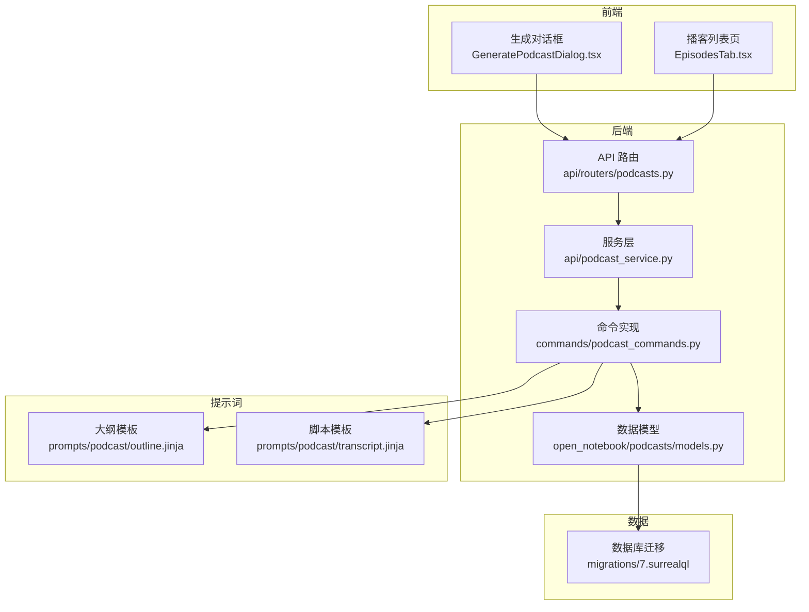
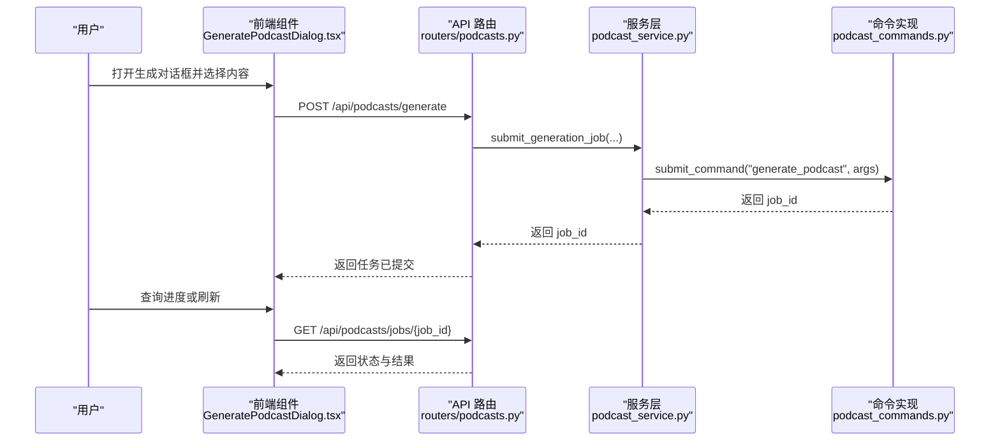
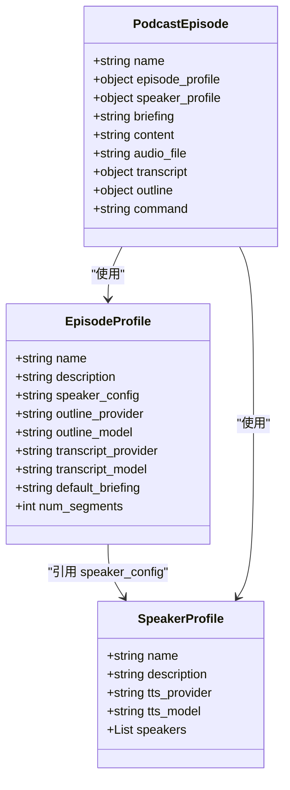
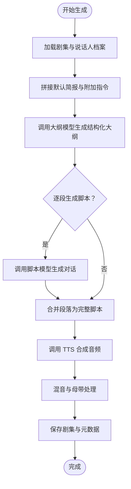
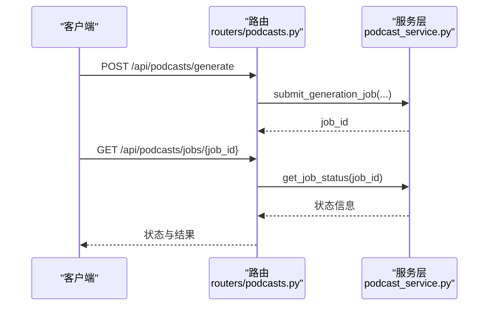
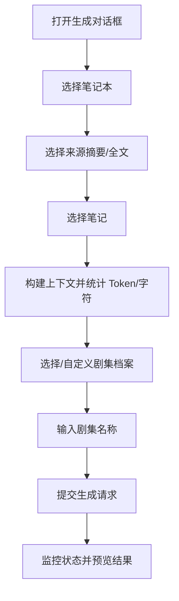
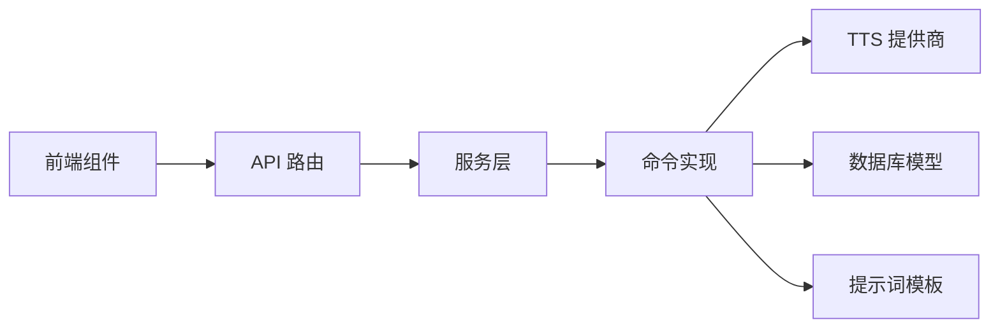

# 专业播客生成

<cite>
**本文引用的文件**
- [api/podcast_service.py](file://api/podcast_service.py)
- [api/routers/podcasts.py](file://api/routers/podcasts.py)
- [commands/podcast_commands.py](file://commands/podcast_commands.py)
- [open_notebook/podcasts/models.py](file://open_notebook/podcasts/models.py)
- [prompts/podcast/outline.jinja](file://prompts/podcast/outline.jinja)
- [prompts/podcast/transcript.jinja](file://prompts/podcast/transcript.jinja)
- [frontend/src/components/podcasts/GeneratePodcastDialog.tsx](file://frontend/src/components/podcasts/GeneratePodcastDialog.tsx)
- [frontend/src/components/podcasts/EpisodesTab.tsx](file://frontend/src/components/podcasts/EpisodesTab.tsx)
- [docs/3-USER-GUIDE/creating-podcasts.md](file://docs/3-USER-GUIDE/creating-podcasts.md)
- [open_notebook/database/migrations/7.surrealql](file://open_notebook/database/migrations/7.surrealql)
</cite>

## 目录
1. [简介](#简介)
2. [项目结构](#项目结构)
3. [核心组件](#核心组件)
4. [架构总览](#架构总览)
5. [组件详解](#组件详解)
6. [依赖关系分析](#依赖关系分析)
7. [性能考量](#性能考量)
8. [故障排查指南](#故障排查指南)
9. [结论](#结论)
10. [附录](#附录)

## 简介
本文件系统性阐述 Open Notebook 的专业播客生成功能，覆盖从内容素材整合、脚本生成、角色分配、声音配置到音频合成与发布的完整流程。文档重点说明：
- 多说话人播客的创建流程与配置项（说话人数量、声音类型、语速等）
- 播客内容结构化生成（大纲制定、对话脚本、旁白内容）
- 质量控制机制（语音合成优化、音频格式与输出质量）
- 发布与分享（音频下载、外部平台集成、版权管理）
- 最佳实践（内容策划、声音选择、后期制作）
- 与内容源、笔记、聊天记录等素材的整合能力

## 项目结构
播客功能由后端 API、命令执行器、前端界面与提示词模板共同组成，数据模型通过数据库迁移初始化。

图示来源
- [api/routers/podcasts.py](file://api/routers/podcasts.py#L1-L234)
- [api/podcast_service.py](file://api/podcast_service.py#L1-L207)
- [commands/podcast_commands.py](file://commands/podcast_commands.py#L1-L188)
- [open_notebook/podcasts/models.py](file://open_notebook/podcasts/models.py#L1-L148)
- [prompts/podcast/outline.jinja](file://prompts/podcast/outline.jinja#L1-L84)
- [prompts/podcast/transcript.jinja](file://prompts/podcast/transcript.jinja#L1-L135)
- [open_notebook/database/migrations/7.surrealql](file://open_notebook/database/migrations/7.surrealql#L1-L153)

章节来源
- [api/routers/podcasts.py](file://api/routers/podcasts.py#L1-L234)
- [api/podcast_service.py](file://api/podcast_service.py#L1-L207)
- [commands/podcast_commands.py](file://commands/podcast_commands.py#L1-L188)
- [open_notebook/podcasts/models.py](file://open_notebook/podcasts/models.py#L1-L148)
- [prompts/podcast/outline.jinja](file://prompts/podcast/outline.jinja#L1-L84)
- [prompts/podcast/transcript.jinja](file://prompts/podcast/transcript.jinja#L1-L135)
- [open_notebook/database/migrations/7.surrealql](file://open_notebook/database/migrations/7.surrealql#L1-L153)

## 核心组件
- API 路由：提供播客生成提交、状态查询、剧集列表、单集详情、音频流式下载、删除等接口。
- 服务层：封装作业提交、状态查询、剧集列表与读取逻辑，负责参数校验与错误处理。
- 命令实现：使用 podcast-creator 库进行实际生成，加载配置、生成大纲与脚本、调用 TTS 合成、保存结果。
- 数据模型：定义剧集档案、播客剧集、说话人档案等，支持序列化与数据库持久化。
- 提示词模板：用于大纲与脚本生成的结构化提示，确保输出符合预期格式。
- 前端组件：生成对话框（内容选择、概要统计、生成触发）、剧集列表页（状态分组、刷新、删除）。

章节来源
- [api/routers/podcasts.py](file://api/routers/podcasts.py#L1-L234)
- [api/podcast_service.py](file://api/podcast_service.py#L1-L207)
- [commands/podcast_commands.py](file://commands/podcast_commands.py#L1-L188)
- [open_notebook/podcasts/models.py](file://open_notebook/podcasts/models.py#L1-L148)
- [prompts/podcast/outline.jinja](file://prompts/podcast/outline.jinja#L1-L84)
- [prompts/podcast/transcript.jinja](file://prompts/podcast/transcript.jinja#L1-L135)

## 架构总览
播客生成采用“异步命令 + 后台处理”的模式：前端提交生成请求，后端校验参数并提交命令；命令执行器在后台完成内容分析、大纲生成、脚本写作、TTS 合成与混音，最终产出音频文件与元数据。

图示来源
- [api/routers/podcasts.py](file://api/routers/podcasts.py#L40-L83)
- [api/podcast_service.py](file://api/podcast_service.py#L36-L113)
- [commands/podcast_commands.py](file://commands/podcast_commands.py#L49-L188)

## 组件详解

### 1) 配置与数据模型
- 剧集档案（EpisodeProfile）：封装大纲与脚本生成所用的 AI 提供商、模型、默认简报与段落数等。
- 说话人档案（SpeakerProfile）：定义 TTS 提供商、模型及最多 4 个说话人的配置（姓名、声音 ID、背景故事、个性）。
- 播客剧集（PodcastEpisode）：记录生成任务关联、简报、内容、音频路径、转录与大纲、命令 ID 等。

图示来源
- [open_notebook/podcasts/models.py](file://open_notebook/podcasts/models.py#L10-L148)
- [open_notebook/database/migrations/7.surrealql](file://open_notebook/database/migrations/7.surrealql#L51-L150)

章节来源
- [open_notebook/podcasts/models.py](file://open_notebook/podcasts/models.py#L1-L148)
- [open_notebook/database/migrations/7.surrealql](file://open_notebook/database/migrations/7.surrealql#L1-L153)

### 2) 生成流程与提示词
- 大纲生成：基于简报与内容，结合说话人背景与个性，生成固定段落数的大纲。
- 脚本生成：针对每个段落生成自然对话，限定每段最少轮次，确保内容连贯与角色匹配。
- 输出格式：严格要求 JSON 结构，避免思维标签包裹导致解析失败。

图示来源
- [commands/podcast_commands.py](file://commands/podcast_commands.py#L49-L188)
- [prompts/podcast/outline.jinja](file://prompts/podcast/outline.jinja#L1-L84)
- [prompts/podcast/transcript.jinja](file://prompts/podcast/transcript.jinja#L1-L135)

章节来源
- [commands/podcast_commands.py](file://commands/podcast_commands.py#L1-L188)
- [prompts/podcast/outline.jinja](file://prompts/podcast/outline.jinja#L1-L84)
- [prompts/podcast/transcript.jinja](file://prompts/podcast/transcript.jinja#L1-L135)

### 3) API 与服务层
- 提交生成：校验档案存在性、可选地从笔记本获取上下文、准备命令参数并提交至命令系统。
- 查询状态：通过命令系统获取作业状态、进度与结果。
- 列表与详情：返回剧集列表（含状态、音频 URL、简报、大纲、转录），支持按 ID 获取单条记录。
- 音频下载：根据存储路径返回音频文件（MP3）。

图示来源
- [api/routers/podcasts.py](file://api/routers/podcasts.py#L40-L83)
- [api/podcast_service.py](file://api/podcast_service.py#L114-L139)

章节来源
- [api/routers/podcasts.py](file://api/routers/podcasts.py#L1-L234)
- [api/podcast_service.py](file://api/podcast_service.py#L1-L207)

### 4) 前端交互与素材整合
- 内容选择：支持从笔记本中选择来源（摘要/全文）与笔记，自动计算 Token 与字符数，便于控制生成规模。
- 生成对话框：提供剧集档案选择、名称输入、附加指令、生成触发与状态反馈。
- 剧集列表：按状态分组显示（运行中、待定、已完成、失败），支持刷新与删除。

图示来源
- [frontend/src/components/podcasts/GeneratePodcastDialog.tsx](file://frontend/src/components/podcasts/GeneratePodcastDialog.tsx#L397-L800)
- [frontend/src/components/podcasts/EpisodesTab.tsx](file://frontend/src/components/podcasts/EpisodesTab.tsx#L52-L175)

章节来源
- [frontend/src/components/podcasts/GeneratePodcastDialog.tsx](file://frontend/src/components/podcasts/GeneratePodcastDialog.tsx#L1-L984)
- [frontend/src/components/podcasts/EpisodesTab.tsx](file://frontend/src/components/podcasts/EpisodesTab.tsx#L1-L175)

## 依赖关系分析
- 组件耦合
  - 路由依赖服务层；服务层依赖命令系统与数据模型；命令实现依赖提示词模板与 TTS 库。
  - 前端组件依赖后端 API，通过 React Query 管理状态与缓存。
- 外部依赖
  - TTS 提供商（OpenAI、Google、ElevenLabs、本地 TTS）通过说话人档案配置。
  - podcast-creator 库负责实际生成流程。
- 数据一致性
  - 剧集档案与说话人档案通过数据库迁移初始化，保证可用性与一致性。

图示来源
- [api/routers/podcasts.py](file://api/routers/podcasts.py#L1-L234)
- [api/podcast_service.py](file://api/podcast_service.py#L1-L207)
- [commands/podcast_commands.py](file://commands/podcast_commands.py#L1-L188)
- [open_notebook/podcasts/models.py](file://open_notebook/podcasts/models.py#L1-L148)
- [prompts/podcast/outline.jinja](file://prompts/podcast/outline.jinja#L1-L84)
- [prompts/podcast/transcript.jinja](file://prompts/podcast/transcript.jinja#L1-L135)

章节来源
- [api/routers/podcasts.py](file://api/routers/podcasts.py#L1-L234)
- [api/podcast_service.py](file://api/podcast_service.py#L1-L207)
- [commands/podcast_commands.py](file://commands/podcast_commands.py#L1-L188)
- [open_notebook/podcasts/models.py](file://open_notebook/podcasts/models.py#L1-L148)
- [prompts/podcast/outline.jinja](file://prompts/podcast/outline.jinja#L1-L84)
- [prompts/podcast/transcript.jinja](file://prompts/podcast/transcript.jinja#L1-L135)

## 性能考量
- 异步处理：生成过程耗时较长，采用命令系统异步执行，前端轮询状态，避免阻塞。
- 上下文构建：前端在提交前计算 Token/字符，有助于控制生成规模，减少超长内容带来的处理时间。
- 模型选择：不同模型在速度与质量上差异较大，应根据预算与需求选择合适的提供商与模型。
- 存储与传输：音频文件以路径形式存储，下载时直接返回文件响应，减少中间层开销。

## 故障排查指南
- 生成失败
  - 检查网络连接（尤其是 TTS 请求）。
  - 尝试更换 TTS 提供商或声音。
  - 减少来源数量，降低处理复杂度。
  - 若出现 JSON 解析错误，考虑更换更稳定的模型。
- 声音相似
  - 使用不同提供商或声音选项。
  - 增大说话人个性差异。
  - 调整说话人数（2/3/4）。
- 音质问题
  - 优先选择高质量提供商（如 Google、ElevenLabs）。
  - 控制句子长度，提升清晰度。
- 下载与播放
  - 确认音频文件存在且路径正确。
  - 浏览器兼容性问题时尝试重新生成或更换质量。

章节来源
- [docs/3-USER-GUIDE/creating-podcasts.md](file://docs/3-USER-GUIDE/creating-podcasts.md#L421-L483)
- [commands/podcast_commands.py](file://commands/podcast_commands.py#L169-L187)

## 结论
Open Notebook 的播客生成功能通过“档案化配置 + 异步命令 + 提示词驱动”的方式，实现了从多源内容到多说话人音频的自动化生产。其模块化设计便于扩展与维护，配合前端直观的素材整合与状态管理，能够高效支撑研究型、教学型与内容创作型场景下的播客制作与分发。

## 附录

### A. 播客配置选项清单
- 剧集档案（EpisodeProfile）
  - 名称、描述、默认简报、段落数、大纲与脚本使用的 AI 提供商与模型
- 说话人档案（SpeakerProfile）
  - 名称、描述、TTS 提供商与模型、最多 4 个说话人（姓名、声音 ID、背景故事、个性）

章节来源
- [open_notebook/podcasts/models.py](file://open_notebook/podcasts/models.py#L10-L88)
- [open_notebook/database/migrations/7.surrealql](file://open_notebook/database/migrations/7.surrealql#L51-L150)

### B. 内容结构化生成要点
- 大纲阶段：明确主题、拆分段落、匹配说话人背景与个性。
- 脚本阶段：限定每段最少轮次，确保对话自然流畅。
- 输出阶段：严格 JSON 格式，避免思维标签包裹导致解析失败。

章节来源
- [prompts/podcast/outline.jinja](file://prompts/podcast/outline.jinja#L29-L84)
- [prompts/podcast/transcript.jinja](file://prompts/podcast/transcript.jinja#L51-L135)

### C. 质量控制与优化建议
- 选择合适 TTS 提供商与声音，平衡成本与音质。
- 控制内容规模，避免过长导致生成不稳定。
- 在生成前预览转录与时长，及时调整策略。

章节来源
- [docs/3-USER-GUIDE/creating-podcasts.md](file://docs/3-USER-GUIDE/creating-podcasts.md#L284-L341)
- [docs/3-USER-GUIDE/creating-podcasts.md](file://docs/3-USER-GUIDE/creating-podcasts.md#L421-L483)

### D. 发布与分享
- 下载 MP3：支持多种质量等级（128/192/320 kbps）。
- 导出转录：便于二次编辑、博客与无障碍。
- 平台集成：未来可扩展至主流播客平台上传与元数据管理。

章节来源
- [docs/3-USER-GUIDE/creating-podcasts.md](file://docs/3-USER-GUIDE/creating-podcasts.md#L521-L569)
- [api/routers/podcasts.py](file://api/routers/podcasts.py#L181-L203)