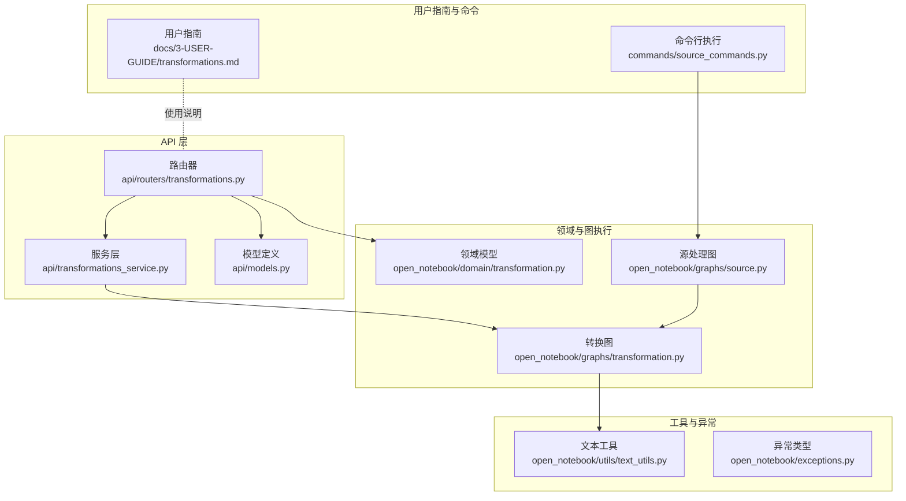
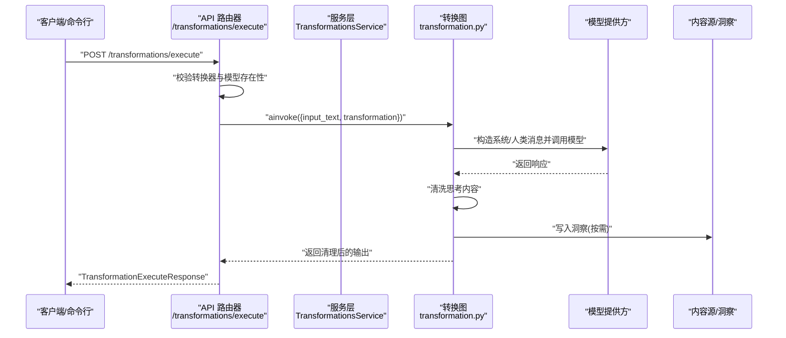
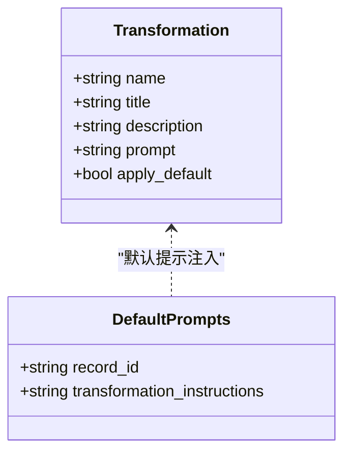
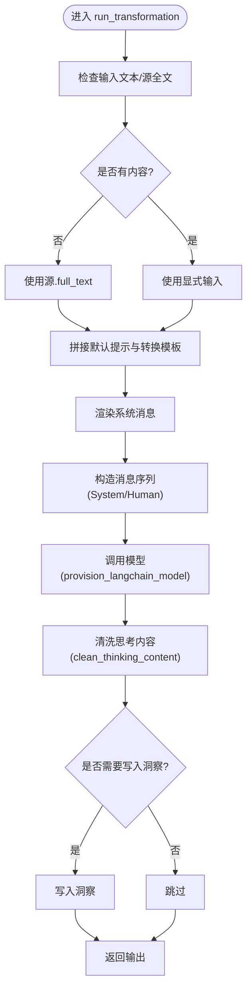
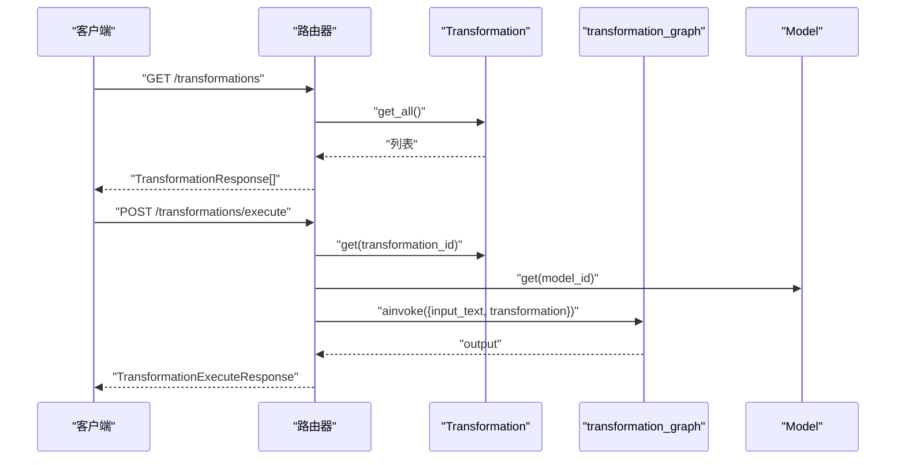
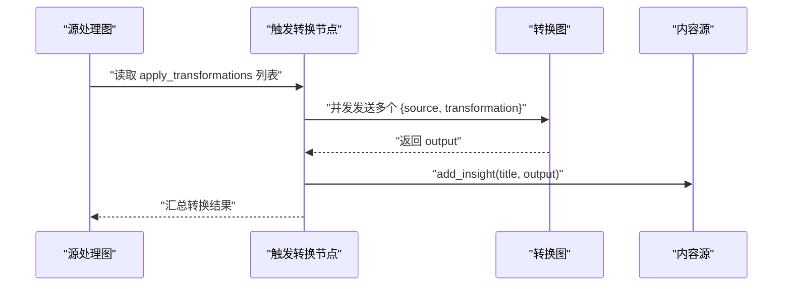
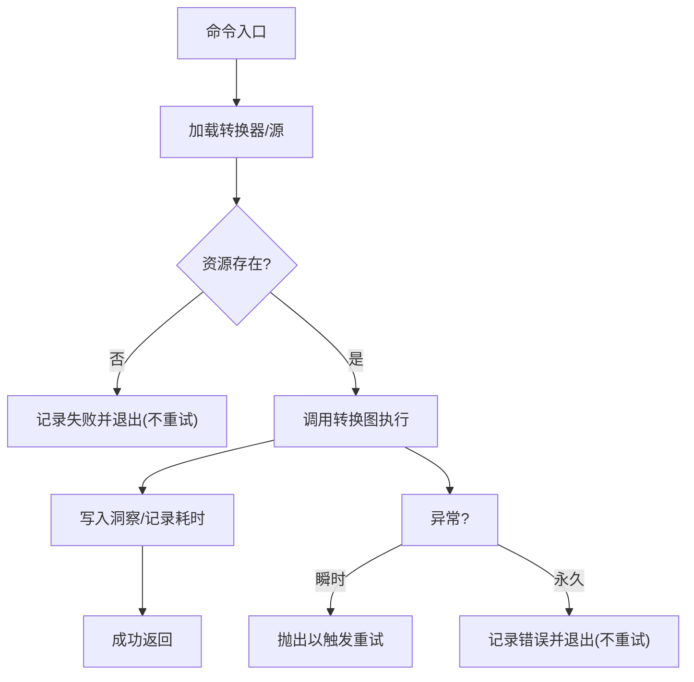
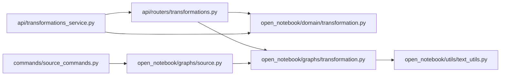

# 内容转换与处理

<cite>
**本文引用的文件**
- [api/routers/transformations.py](file://api/routers/transformations.py)
- [api/transformations_service.py](file://api/transformations_service.py)
- [open_notebook/domain/transformation.py](file://open_notebook/domain/transformation.py)
- [open_notebook/graphs/transformation.py](file://open_notebook/graphs/transformation.py)
- [open_notebook/graphs/source.py](file://open_notebook/graphs/source.py)
- [api/models.py](file://api/models.py)
- [open_notebook/utils/text_utils.py](file://open_notebook/utils/text_utils.py)
- [open_notebook/exceptions.py](file://open_notebook/exceptions.py)
- [docs/3-USER-GUIDE/transformations.md](file://docs/3-USER-GUIDE/transformations.md)
- [commands/source_commands.py](file://commands/source_commands.py)
</cite>

## 目录
1. [简介](#简介)
2. [项目结构](#项目结构)
3. [核心组件](#核心组件)
4. [架构总览](#架构总览)
5. [详细组件分析](#详细组件分析)
6. [依赖分析](#依赖分析)
7. [性能考虑](#性能考虑)
8. [故障排查指南](#故障排查指南)
9. [结论](#结论)
10. [附录](#附录)

## 简介
本章节概述Open Notebook的内容转换与处理能力：通过模板驱动的“转换器”（Transformation）对内容源进行批量或单次处理，生成结构化笔记。系统支持内置转换器与自定义转换器，具备可配置的提示词模板、默认提示注入、模型选择、执行结果清洗与持久化，并提供API与命令行两种入口。

## 项目结构
围绕“转换”的主要代码分布在以下模块：
- API层：提供REST接口与服务封装，负责校验、路由与调用图执行
- 领域模型：定义转换器实体与默认提示记录
- 图执行：LangGraph状态机实现转换执行流程
- 工具与异常：文本清洗与错误类型
- 用户指南：使用说明与最佳实践
- 命令行：后台批量执行与重试策略

图表来源
- [api/routers/transformations.py](file://api/routers/transformations.py#L23-L117)
- [api/transformations_service.py](file://api/transformations_service.py#L14-L142)
- [open_notebook/domain/transformation.py](file://open_notebook/domain/transformation.py#L8-L22)
- [open_notebook/graphs/transformation.py](file://open_notebook/graphs/transformation.py#L13-L68)
- [open_notebook/graphs/source.py](file://open_notebook/graphs/source.py#L110-L148)
- [api/models.py](file://api/models.py#L104-L171)
- [open_notebook/utils/text_utils.py](file://open_notebook/utils/text_utils.py#L100-L120)
- [commands/source_commands.py](file://commands/source_commands.py#L220-L268)

章节来源
- [api/routers/transformations.py](file://api/routers/transformations.py#L1-L251)
- [api/transformations_service.py](file://api/transformations_service.py#L1-L142)
- [open_notebook/domain/transformation.py](file://open_notebook/domain/transformation.py#L1-L22)
- [open_notebook/graphs/transformation.py](file://open_notebook/graphs/transformation.py#L1-L68)
- [open_notebook/graphs/source.py](file://open_notebook/graphs/source.py#L106-L154)
- [api/models.py](file://api/models.py#L104-L171)
- [open_notebook/utils/text_utils.py](file://open_notebook/utils/text_utils.py#L1-L120)
- [open_notebook/exceptions.py](file://open_notebook/exceptions.py#L1-L71)
- [docs/3-USER-GUIDE/transformations.md](file://docs/3-USER-GUIDE/transformations.md#L1-L403)
- [commands/source_commands.py](file://commands/source_commands.py#L220-L268)

## 核心组件
- 转换器实体：包含名称、标题、描述、提示词与是否默认应用标记
- 默认提示记录：可为所有转换注入全局指令
- 转换图（LangGraph）：组装系统消息与人类消息，调用模型，清洗思考内容，写入洞察
- 源处理图：在源处理流程中触发转换节点，批量应用多个转换
- API路由器与服务：暴露REST端点，校验资源存在性，编排图执行
- 文本清洗工具：移除<think>类思考内容，保证输出整洁
- 异常体系：统一错误类型，便于上层捕获与处理

章节来源
- [open_notebook/domain/transformation.py](file://open_notebook/domain/transformation.py#L8-L22)
- [open_notebook/graphs/transformation.py](file://open_notebook/graphs/transformation.py#L13-L68)
- [open_notebook/graphs/source.py](file://open_notebook/graphs/source.py#L110-L148)
- [api/routers/transformations.py](file://api/routers/transformations.py#L81-L117)
- [api/transformations_service.py](file://api/transformations_service.py#L128-L137)
- [open_notebook/utils/text_utils.py](file://open_notebook/utils/text_utils.py#L100-L120)
- [open_notebook/exceptions.py](file://open_notebook/exceptions.py#L1-L71)

## 架构总览
下图展示从API到图执行再到模型调用的整体链路，以及与内容源、笔记的关系。

图表来源
- [api/routers/transformations.py](file://api/routers/transformations.py#L81-L117)
- [open_notebook/graphs/transformation.py](file://open_notebook/graphs/transformation.py#L20-L60)
- [open_notebook/domain/transformation.py](file://open_notebook/domain/transformation.py#L8-L14)

## 详细组件分析

### 组件A：转换器实体与默认提示
- 转换器实体包含名称、标题、描述、提示词与默认应用标记；默认提示记录用于全局注入额外指令
- 实体作为数据库持久化对象，配合API路由完成CRUD与执行

图表来源
- [open_notebook/domain/transformation.py](file://open_notebook/domain/transformation.py#L8-L22)

章节来源
- [open_notebook/domain/transformation.py](file://open_notebook/domain/transformation.py#L8-L22)

### 组件B：转换图执行流程
- 输入：可来自显式输入文本或内容源全文
- 处理：拼接默认提示与转换模板，渲染系统消息，构造消息序列，调用模型
- 输出：清洗思考内容后返回，必要时写入洞察

图表来源
- [open_notebook/graphs/transformation.py](file://open_notebook/graphs/transformation.py#L20-L60)
- [open_notebook/utils/text_utils.py](file://open_notebook/utils/text_utils.py#L100-L120)

章节来源
- [open_notebook/graphs/transformation.py](file://open_notebook/graphs/transformation.py#L13-L68)
- [open_notebook/utils/text_utils.py](file://open_notebook/utils/text_utils.py#L100-L120)

### 组件C：API与服务层
- 路由器提供查询、创建、更新、删除、执行与默认提示读取/更新接口
- 服务层封装API客户端调用，统一时间格式化与对象映射
- 执行端点会校验转换器与模型存在性，随后调用图执行并返回结果

图表来源
- [api/routers/transformations.py](file://api/routers/transformations.py#L23-L117)
- [api/transformations_service.py](file://api/transformations_service.py#L14-L142)

章节来源
- [api/routers/transformations.py](file://api/routers/transformations.py#L23-L117)
- [api/transformations_service.py](file://api/transformations_service.py#L14-L142)
- [api/models.py](file://api/models.py#L104-L171)

### 组件D：与内容源、笔记的协作
- 源处理图在“触发转换”阶段根据待应用列表并发发送多个转换任务
- 转换图执行完成后，将结果写入源的洞察集合，形成与笔记的关联

图表来源
- [open_notebook/graphs/source.py](file://open_notebook/graphs/source.py#L110-L148)
- [open_notebook/graphs/transformation.py](file://open_notebook/graphs/transformation.py#L20-L60)

章节来源
- [open_notebook/graphs/source.py](file://open_notebook/graphs/source.py#L110-L148)
- [open_notebook/graphs/transformation.py](file://open_notebook/graphs/transformation.py#L20-L60)

### 组件E：命令行批量执行与重试
- 命令行入口加载指定转换器与源，直接调用转换图执行，记录耗时
- 对永久性错误（如资源不存在）不重试，对瞬时异常进行重试

图表来源
- [commands/source_commands.py](file://commands/source_commands.py#L220-L268)

章节来源
- [commands/source_commands.py](file://commands/source_commands.py#L220-L268)

## 依赖分析
- 路由器依赖领域模型与图执行模块，确保输入校验与执行解耦
- 服务层仅做数据映射与API调用，降低业务复杂度
- 图执行依赖模型提供器与文本清洗工具，保证输出质量
- 命令行与API共享同一图执行逻辑，实现一致行为

图表来源
- [api/routers/transformations.py](file://api/routers/transformations.py#L1-L251)
- [api/transformations_service.py](file://api/transformations_service.py#L1-L142)
- [open_notebook/domain/transformation.py](file://open_notebook/domain/transformation.py#L1-L22)
- [open_notebook/graphs/transformation.py](file://open_notebook/graphs/transformation.py#L1-L68)
- [open_notebook/graphs/source.py](file://open_notebook/graphs/source.py#L106-L154)
- [open_notebook/utils/text_utils.py](file://open_notebook/utils/text_utils.py#L1-L120)
- [commands/source_commands.py](file://commands/source_commands.py#L220-L268)

章节来源
- [api/routers/transformations.py](file://api/routers/transformations.py#L1-L251)
- [api/transformations_service.py](file://api/transformations_service.py#L1-L142)
- [open_notebook/domain/transformation.py](file://open_notebook/domain/transformation.py#L1-L22)
- [open_notebook/graphs/transformation.py](file://open_notebook/graphs/transformation.py#L1-L68)
- [open_notebook/graphs/source.py](file://open_notebook/graphs/source.py#L106-L154)
- [open_notebook/utils/text_utils.py](file://open_notebook/utils/text_utils.py#L1-L120)
- [commands/source_commands.py](file://commands/source_commands.py#L220-L268)

## 性能考虑
- 并发执行：源处理图在触发阶段可并发发送多个转换任务，提升批量处理吞吐
- 输出清洗：统一移除<think>类思考内容，减少冗余与噪声，提高后续检索与阅读效率
- 模型调用：通过可配置的模型ID与上下文长度限制，平衡质量与成本
- 批量策略：命令行与API均支持批量执行，建议先小规模测试再扩大规模

章节来源
- [open_notebook/graphs/source.py](file://open_notebook/graphs/source.py#L110-L148)
- [open_notebook/graphs/transformation.py](file://open_notebook/graphs/transformation.py#L40-L45)
- [open_notebook/utils/text_utils.py](file://open_notebook/utils/text_utils.py#L100-L120)
- [docs/3-USER-GUIDE/transformations.md](file://docs/3-USER-GUIDE/transformations.md#L145-L166)

## 故障排查指南
- 资源不存在：当转换器或模型不存在时，API会返回404；命令行中对这类错误不重试
- 输入无效：字段校验失败会返回400；应检查请求体与模型ID
- 执行异常：内部错误返回500；查看日志定位具体环节
- 输出异常：若模型输出包含<think>类内容，已自动清洗；仍异常请检查提示词与上下文长度
- 批量失败：命令行对瞬时异常进行重试，永久性错误不重试；关注最终失败原因

章节来源
- [api/routers/transformations.py](file://api/routers/transformations.py#L42-L46)
- [api/routers/transformations.py](file://api/routers/transformations.py#L72-L78)
- [api/routers/transformations.py](file://api/routers/transformations.py#L110-L117)
- [open_notebook/exceptions.py](file://open_notebook/exceptions.py#L1-L71)
- [commands/source_commands.py](file://commands/source_commands.py#L248-L268)

## 结论
Open Notebook的转换系统以模板驱动为核心，结合LangGraph实现可扩展的执行流程。API与命令行双入口满足不同使用场景，内置与自定义转换器并存，配合默认提示注入与输出清洗，形成从输入到结构化输出的完整闭环。通过并发与重试策略，系统在保证质量的同时兼顾性能与可靠性。

## 附录

### 转换流程设计要点
- 输入处理：优先使用显式输入，否则回退至源全文；可选注入默认提示
- 中间步骤：渲染系统消息、构造消息序列、调用模型、清洗思考内容
- 输出格式化：返回纯文本输出，必要时写入洞察

章节来源
- [open_notebook/graphs/transformation.py](file://open_notebook/graphs/transformation.py#L20-L60)
- [open_notebook/utils/text_utils.py](file://open_notebook/utils/text_utils.py#L100-L120)

### 转换器配置选项
- 字段：名称、标题、描述、提示词、是否默认应用
- 默认提示：可为所有转换注入全局指令
- 模型选择：通过执行请求中的模型ID指定

章节来源
- [open_notebook/domain/transformation.py](file://open_notebook/domain/transformation.py#L8-L22)
- [api/routers/transformations.py](file://api/routers/transformations.py#L119-L154)
- [api/models.py](file://api/models.py#L142-L158)

### 自定义转换器开发指南
- 在UI中创建或编辑转换器，编写提示词模板
- 明确输出格式、字数限制与引用要求
- 先单源测试，再进行批量处理
- 可通过默认提示注入通用约束

章节来源
- [docs/3-USER-GUIDE/transformations.md](file://docs/3-USER-GUIDE/transformations.md#L80-L131)
- [docs/3-USER-GUIDE/transformations.md](file://docs/3-USER-GUIDE/transformations.md#L310-L331)

### 常用转换场景示例
- 学术论文摘要、方法提取、要点提炼
- 会议纪要结构化、行动项与待办清单
- 竞品分析、技术文档摘要与接口要点
- 文献综述条目标准化

章节来源
- [docs/3-USER-GUIDE/transformations.md](file://docs/3-USER-GUIDE/transformations.md#L169-L252)

### 与内容源、笔记的协作
- 转换结果写入源的洞察集合，形成与笔记的关联
- 批量处理时并发触发多个转换节点，提升效率

章节来源
- [open_notebook/graphs/transformation.py](file://open_notebook/graphs/transformation.py#L55-L60)
- [open_notebook/graphs/source.py](file://open_notebook/graphs/source.py#L110-L148)