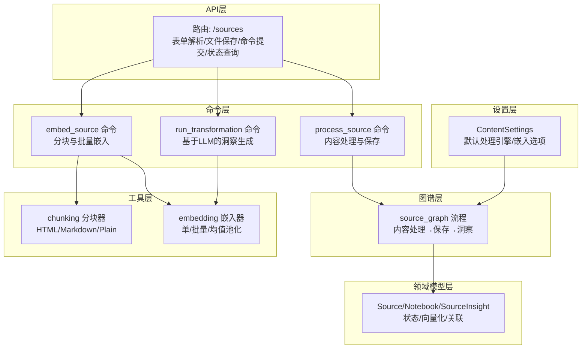
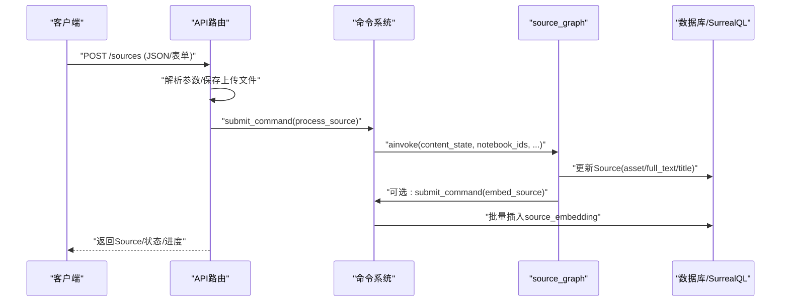
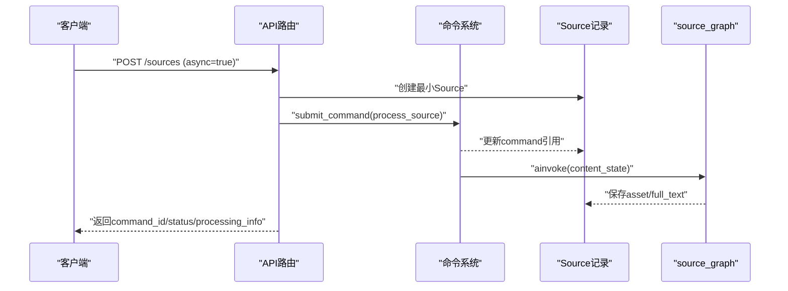
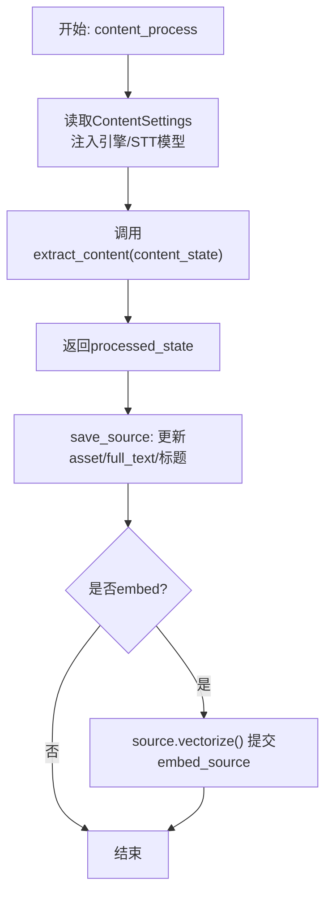
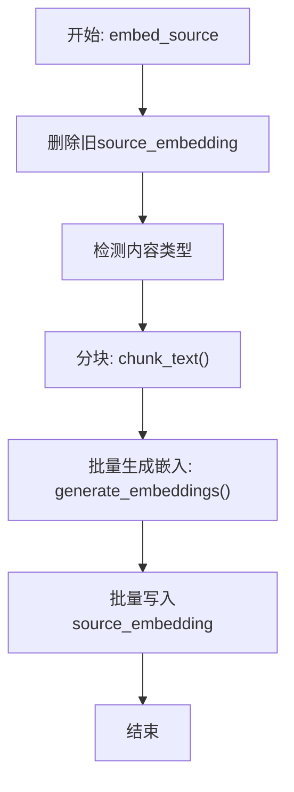
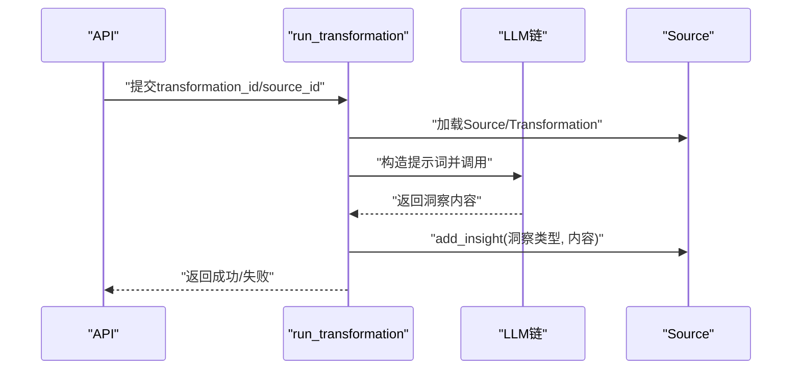
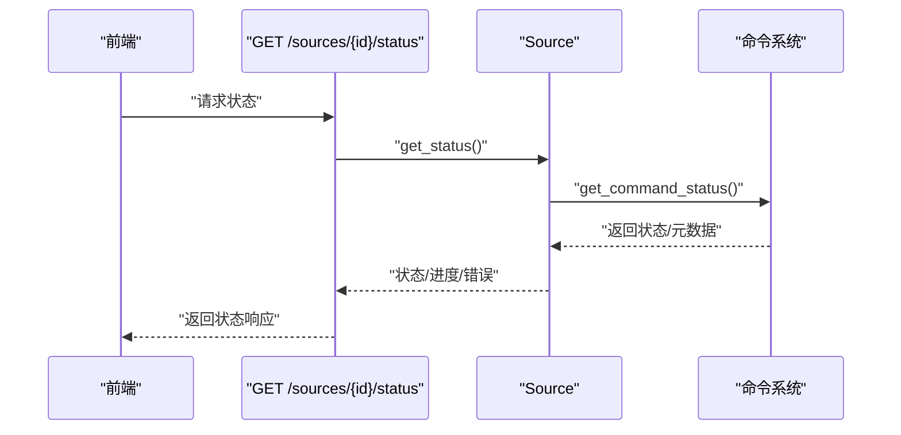
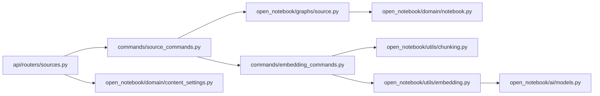

# 多模态内容源处理

<cite>
**本文引用的文件**
- [api/routers/sources.py](file://api/routers/sources.py)
- [api/sources_service.py](file://api/sources_service.py)
- [commands/source_commands.py](file://commands/source_commands.py)
- [open_notebook/graphs/source.py](file://open_notebook/graphs/source.py)
- [open_notebook/domain/notebook.py](file://open_notebook/domain/notebook.py)
- [open_notebook/utils/chunking.py](file://open_notebook/utils/chunking.py)
- [open_notebook/utils/embedding.py](file://open_notebook/utils/embedding.py)
- [commands/embedding_commands.py](file://commands/embedding_commands.py)
- [open_notebook/ai/models.py](file://open_notebook/ai/models.py)
- [open_notebook/domain/content_settings.py](file://open_notebook/domain/content_settings.py)
- [api/routers/settings.py](file://api/routers/settings.py)
- [open_notebook/graphs/transformation.py](file://open_notebook/graphs/transformation.py)
- [api/routers/embedding.py](file://api/routers/embedding.py)
- [open_notebook/database/migrations/9.surrealql](file://open_notebook/database/migrations/9.surrealql)
</cite>

## 目录
1. [简介](#简介)
2. [项目结构](#项目结构)
3. [核心组件](#核心组件)
4. [架构总览](#架构总览)
5. [详细组件分析](#详细组件分析)
6. [依赖关系分析](#依赖关系分析)
7. [性能考量](#性能考量)
8. [故障排查指南](#故障排查指南)
9. [结论](#结论)
10. [附录](#附录)

## 简介
本文件面向Open Notebook的多模态内容源处理能力，系统性阐述从PDF、视频、音频、网页链接到Office文档等多种内容类型的提取、解析、元数据抽取与预处理流程；覆盖异步/同步处理模式、状态管理与进度跟踪、错误处理机制；深入解析向量化嵌入生成、批量处理、增量更新与版本管理策略，并给出不同内容类型的处理最佳实践及与笔记本、笔记、搜索功能的集成关系。

## 项目结构
围绕“内容源”这一核心实体，系统采用分层设计：
- API层：接收来源类型（链接/上传/文本）、表单解析、文件保存、命令提交与状态查询
- 命令层：执行实际的“内容处理”和“向量嵌入”工作流，具备重试与幂等保障
- 图谱层：以LangGraph定义“内容处理→保存→可选洞察生成”的状态机流程
- 工具层：分块与嵌入工具，统一嵌入接口与批处理策略
- 领域模型层：Source/Notebook/SourceInsight等实体，提供向量化提交、状态查询、关联管理
- 设置层：内容处理引擎与嵌入选项的全局配置

图表来源
- [api/routers/sources.py](file://api/routers/sources.py#L280-L552)
- [commands/source_commands.py](file://commands/source_commands.py#L48-L155)
- [open_notebook/graphs/source.py](file://open_notebook/graphs/source.py#L151-L168)
- [commands/embedding_commands.py](file://commands/embedding_commands.py#L306-L440)
- [open_notebook/utils/chunking.py](file://open_notebook/utils/chunking.py#L386-L446)
- [open_notebook/utils/embedding.py](file://open_notebook/utils/embedding.py#L82-L208)
- [open_notebook/domain/content_settings.py](file://open_notebook/domain/content_settings.py#L8-L26)

章节来源
- [api/routers/sources.py](file://api/routers/sources.py#L1-L1020)
- [open_notebook/graphs/source.py](file://open_notebook/graphs/source.py#L1-L168)

## 核心组件
- 内容源API与服务
  - 路由器负责表单解析、文件上传、同步/异步处理路径、状态查询与下载
  - 服务层封装API调用，提供SourceProcessingResult等结果包装
- 命令与工作流
  - process_source命令驱动source_graph，完成内容抽取、保存、可选洞察生成与向量化
  - embed_source命令进行内容类型感知的分块与批量嵌入
  - run_transformation命令在已有Source上触发LLM洞察生成
- 领域模型与状态
  - Source记录命令引用、状态查询、嵌入计数、洞察管理、向量化提交
  - Notebook维护Source/Note/ChatSession关联
- 工具与配置
  - chunking按HTML/Markdown/Plain自动选择分块策略
  - embedding统一单/批量嵌入与长文本均值池化
  - ContentSettings提供默认处理引擎与嵌入选项

章节来源
- [api/routers/sources.py](file://api/routers/sources.py#L280-L552)
- [api/sources_service.py](file://api/sources_service.py#L66-L325)
- [commands/source_commands.py](file://commands/source_commands.py#L48-L155)
- [open_notebook/graphs/source.py](file://open_notebook/graphs/source.py#L34-L168)
- [open_notebook/domain/notebook.py](file://open_notebook/domain/notebook.py#L288-L553)
- [open_notebook/utils/chunking.py](file://open_notebook/utils/chunking.py#L386-L446)
- [open_notebook/utils/embedding.py](file://open_notebook/utils/embedding.py#L82-L208)
- [open_notebook/domain/content_settings.py](file://open_notebook/domain/content_settings.py#L8-L26)

## 架构总览
下图展示了从API入口到命令执行、图谱处理与数据库写入的端到端流程。

图表来源
- [api/routers/sources.py](file://api/routers/sources.py#L280-L552)
- [commands/source_commands.py](file://commands/source_commands.py#L48-L155)
- [open_notebook/graphs/source.py](file://open_notebook/graphs/source.py#L34-L108)
- [commands/embedding_commands.py](file://commands/embedding_commands.py#L306-L440)

## 详细组件分析

### 组件A：内容源创建与处理（同步/异步）
- 同步路径
  - API创建Source记录后，使用线程池执行命令，阻塞等待结果
  - 返回SourceResponse，包含嵌入状态与嵌入块数
- 异步路径
  - API先创建最小Source记录，立即返回SourceResponse（含command_id/status）
  - 后台通过命令系统提交process_source，Source记录随后被更新
- 进度与状态
  - 通过Source.get_status()/get_processing_progress()获取命令状态与执行元数据
  - 列表页通过FETCH命令对象直接返回状态字段

图表来源
- [api/routers/sources.py](file://api/routers/sources.py#L352-L426)
- [open_notebook/domain/notebook.py](file://open_notebook/domain/notebook.py#L318-L359)

章节来源
- [api/routers/sources.py](file://api/routers/sources.py#L280-L552)
- [open_notebook/domain/notebook.py](file://open_notebook/domain/notebook.py#L318-L359)

### 组件B：内容处理与保存（content-core驱动）
- content_process节点
  - 读取ContentSettings，注入URL/文档处理引擎、输出格式、语音转写模型
  - 调用extract_content(content_state)产出标准化内容
- save_source节点
  - 更新Source的asset与full_text，保留标题优先级
  - 可选触发向量化（vectorize）

图表来源
- [open_notebook/graphs/source.py](file://open_notebook/graphs/source.py#L34-L108)
- [open_notebook/domain/content_settings.py](file://open_notebook/domain/content_settings.py#L8-L26)

章节来源
- [open_notebook/graphs/source.py](file://open_notebook/graphs/source.py#L19-L168)

### 组件C：向量化与嵌入存储
- embed_source命令
  - 删除旧嵌入（幂等）
  - 检测内容类型（扩展名或启发式），分块
  - 单次批量生成嵌入，批量写入source_embedding
- 统一嵌入接口
  - generate_embedding：短文本直接嵌入，长文本分块后均值池化
  - generate_embeddings：批量嵌入，减少API往返

图表来源
- [commands/embedding_commands.py](file://commands/embedding_commands.py#L306-L440)
- [open_notebook/utils/chunking.py](file://open_notebook/utils/chunking.py#L386-L446)
- [open_notebook/utils/embedding.py](file://open_notebook/utils/embedding.py#L82-L208)

章节来源
- [commands/embedding_commands.py](file://commands/embedding_commands.py#L306-L440)
- [open_notebook/utils/embedding.py](file://open_notebook/utils/embedding.py#L82-L208)

### 组件D：洞察生成与LLM集成
- run_transformation命令
  - 加载Source与Transformation，拼装系统提示词
  - 通过provision_langchain_model调用LLM，清理思考内容
  - 调用Source.add_insight异步提交创建与嵌入

图表来源
- [commands/source_commands.py](file://commands/source_commands.py#L179-L269)
- [open_notebook/graphs/transformation.py](file://open_notebook/graphs/transformation.py#L20-L68)
- [open_notebook/domain/notebook.py](file://open_notebook/domain/notebook.py#L457-L503)

章节来源
- [open_notebook/graphs/transformation.py](file://open_notebook/graphs/transformation.py#L1-L68)
- [commands/source_commands.py](file://commands/source_commands.py#L179-L269)

### 组件E：状态管理与进度跟踪
- Source.get_status/get_processing_progress
  - 通过命令系统查询状态与执行元数据（开始/结束时间、错误信息、结果）
- API层/status端点
  - 返回状态码与描述消息，以及processing_info（如进度百分比）
- 前端展示
  - 来自processing_info.progress的进度条显示

图表来源
- [open_notebook/domain/notebook.py](file://open_notebook/domain/notebook.py#L318-L359)
- [api/routers/sources.py](file://api/routers/sources.py#L691-L750)

章节来源
- [open_notebook/domain/notebook.py](file://open_notebook/domain/notebook.py#L318-L359)
- [api/routers/sources.py](file://api/routers/sources.py#L691-L750)

### 组件F：内容类型支持与处理策略
- 支持类型
  - 文档类：PDF、Word、PowerPoint、Excel等（经content-core引擎抽取）
  - 网页类：链接/URL（可选firecrawl/jina/simple）
  - 媒体类：视频/音频（经语音转写模型抽取文本）
  - 文本类：纯文本/Markdown
- 处理引擎选择
  - ContentSettings提供默认引擎（auto/docling/simple；auto/firecrawl/jina/simple）
  - source_graph在content_process阶段注入引擎与输出格式

章节来源
- [open_notebook/domain/content_settings.py](file://open_notebook/domain/content_settings.py#L8-L26)
- [open_notebook/graphs/source.py](file://open_notebook/graphs/source.py#L34-L79)

## 依赖关系分析
- API路由依赖命令系统与领域模型，提供统一的Source CRUD与状态查询
- 命令层依赖图谱层与工具层，完成内容处理与向量化
- 领域模型依赖数据库与命令系统，提供状态查询与向量化提交
- 工具层依赖AI模型管理与分块策略，保证嵌入质量与性能

图表来源
- [api/routers/sources.py](file://api/routers/sources.py#L280-L552)
- [commands/source_commands.py](file://commands/source_commands.py#L48-L155)
- [open_notebook/graphs/source.py](file://open_notebook/graphs/source.py#L151-L168)
- [commands/embedding_commands.py](file://commands/embedding_commands.py#L306-L440)
- [open_notebook/utils/chunking.py](file://open_notebook/utils/chunking.py#L386-L446)
- [open_notebook/utils/embedding.py](file://open_notebook/utils/embedding.py#L82-L208)
- [open_notebook/ai/models.py](file://open_notebook/ai/models.py#L97-L267)
- [open_notebook/domain/content_settings.py](file://open_notebook/domain/content_settings.py#L8-L26)

章节来源
- [api/routers/sources.py](file://api/routers/sources.py#L280-L552)
- [commands/source_commands.py](file://commands/source_commands.py#L48-L155)
- [open_notebook/graphs/source.py](file://open_notebook/graphs/source.py#L151-L168)
- [commands/embedding_commands.py](file://commands/embedding_commands.py#L306-L440)
- [open_notebook/utils/chunking.py](file://open_notebook/utils/chunking.py#L386-L446)
- [open_notebook/utils/embedding.py](file://open_notebook/utils/embedding.py#L82-L208)
- [open_notebook/ai/models.py](file://open_notebook/ai/models.py#L97-L267)
- [open_notebook/domain/content_settings.py](file://open_notebook/domain/content_settings.py#L8-L26)

## 性能考量
- 批量嵌入
  - generate_embeddings一次性提交所有分块，显著降低API往返开销
- 均值池化
  - 对长文本分块后嵌入再均值池化，保持向量单位长度且稳定
- 分块策略
  - HTML/Markdown按标题层级切分，Plain文本按换行/句号等分隔符递归切分
  - 可通过环境变量调节CHUNK_SIZE与CHUNK_OVERLAP
- 并发与重试
  - 命令系统为每个子任务独立重试，避免阻塞主流程
- 数据库函数
  - SurrealQL内置向量相似度函数，支持cosine相似度检索

章节来源
- [open_notebook/utils/embedding.py](file://open_notebook/utils/embedding.py#L82-L208)
- [open_notebook/utils/chunking.py](file://open_notebook/utils/chunking.py#L386-L446)
- [commands/embedding_commands.py](file://commands/embedding_commands.py#L379-L403)
- [open_notebook/database/migrations/9.surrealql](file://open_notebook/database/migrations/9.surrealql#L1-L35)

## 故障排查指南
- 常见问题
  - 嵌入模型未配置：检查默认嵌入模型是否设置
  - 文件上传失败：确认UPLOADS_FOLDER权限与磁盘空间
  - 命令队列拥堵：查看命令状态与重试日志
  - 源无文本可嵌入：确保Source.full_text非空
- 排查步骤
  - 使用GET /sources/{id}/status获取状态与错误信息
  - 查看API层异常堆栈与命令层重试日志
  - 检查ContentSettings中的引擎选择是否合理
- 错误处理
  - 命令层对永久性错误（如找不到Source/Transformation）不重试
  - 对瞬时网络/超时错误采用指数退避重试

章节来源
- [api/routers/sources.py](file://api/routers/sources.py#L691-L750)
- [commands/source_commands.py](file://commands/source_commands.py#L139-L155)
- [commands/embedding_commands.py](file://commands/embedding_commands.py#L418-L439)

## 结论
Open Notebook通过“API-命令-图谱-工具-领域模型”的分层架构，实现了对多模态内容源的全链路处理：从内容抽取、文本解析、元数据与预处理，到异步状态管理、进度跟踪与错误恢复；再到向量化嵌入、批量重建与索引检索。该体系兼顾了易用性与可扩展性，适合在生产环境中进行大规模内容入库与智能检索。

## 附录

### 不同内容类型的处理最佳实践
- PDF/Office文档
  - 优先使用docling（更准确），若资源受限可用simple
  - 控制CHUNK_SIZE避免超大分块导致嵌入失败
- 网页链接
  - firecrawl/jina适合动态JS站点；simple适合静态页面
  - 对JavaScript渲染内容，建议启用付费引擎并配置免费额度
- 视频/音频
  - 配置默认语音转写模型，确保STT可用
  - 大文件建议分段处理，控制单次处理时长
- 文本/Markdown
  - 使用均值池化处理长文本，提升语义稳定性

章节来源
- [open_notebook/domain/content_settings.py](file://open_notebook/domain/content_settings.py#L8-L26)
- [open_notebook/graphs/source.py](file://open_notebook/graphs/source.py#L62-L77)

### 与笔记本、笔记、搜索的集成
- 笔记本与内容源
  - Source.add_to_notebook建立多对多关联，支持批量检索与上下文构建
- 笔记与搜索
  - Note.save完成后提交embed_note命令，支持全文向量检索
- 搜索
  - text_search与vector_search结合，前者基于文本匹配，后者基于向量相似度
  - 向量搜索通过SurrealQL函数实现，支持最小相似度阈值过滤

章节来源
- [open_notebook/domain/notebook.py](file://open_notebook/domain/notebook.py#L406-L456)
- [api/routers/embedding.py](file://api/routers/embedding.py#L68-L100)
- [open_notebook/database/migrations/9.surrealql](file://open_notebook/database/migrations/9.surrealql#L1-L35)