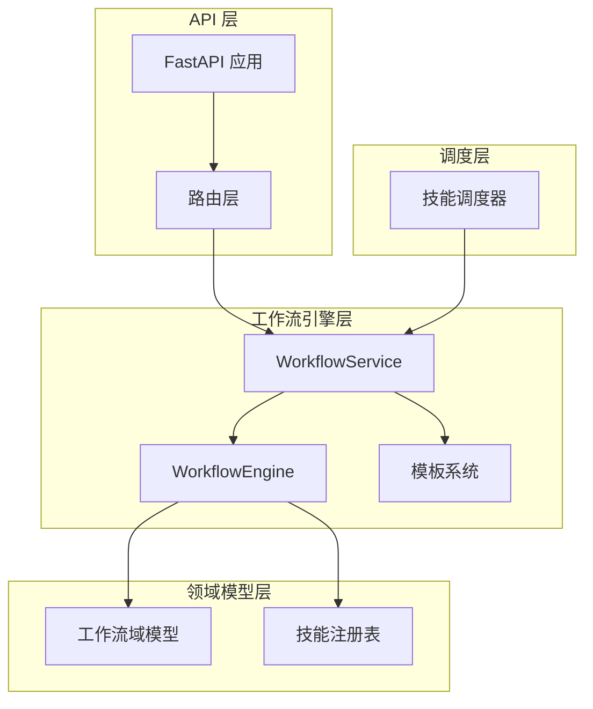
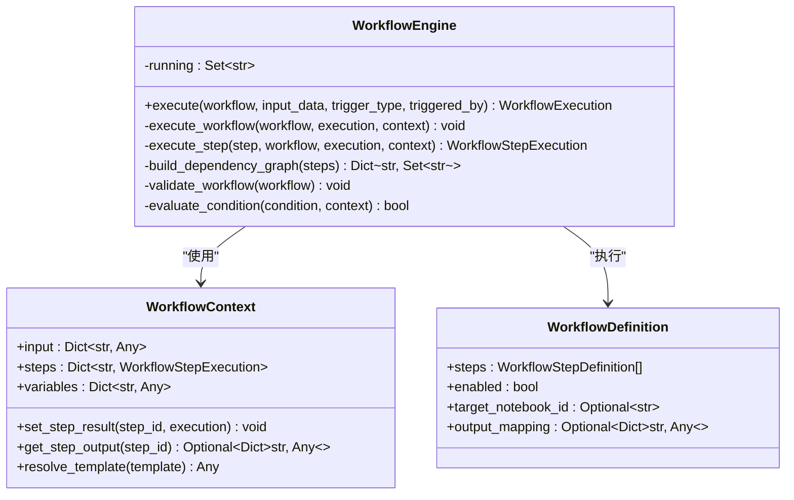
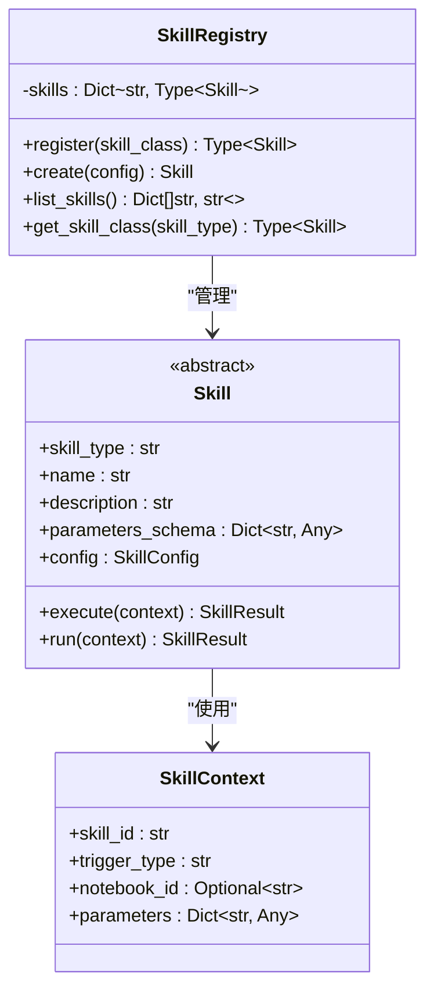
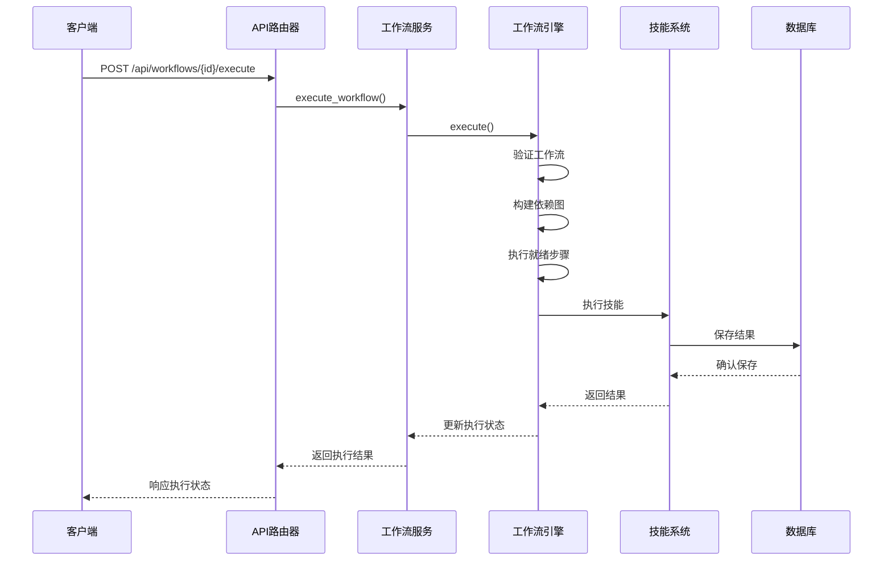
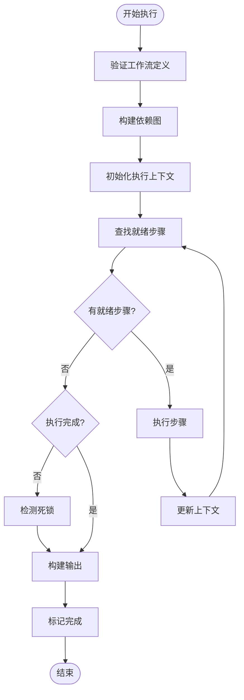
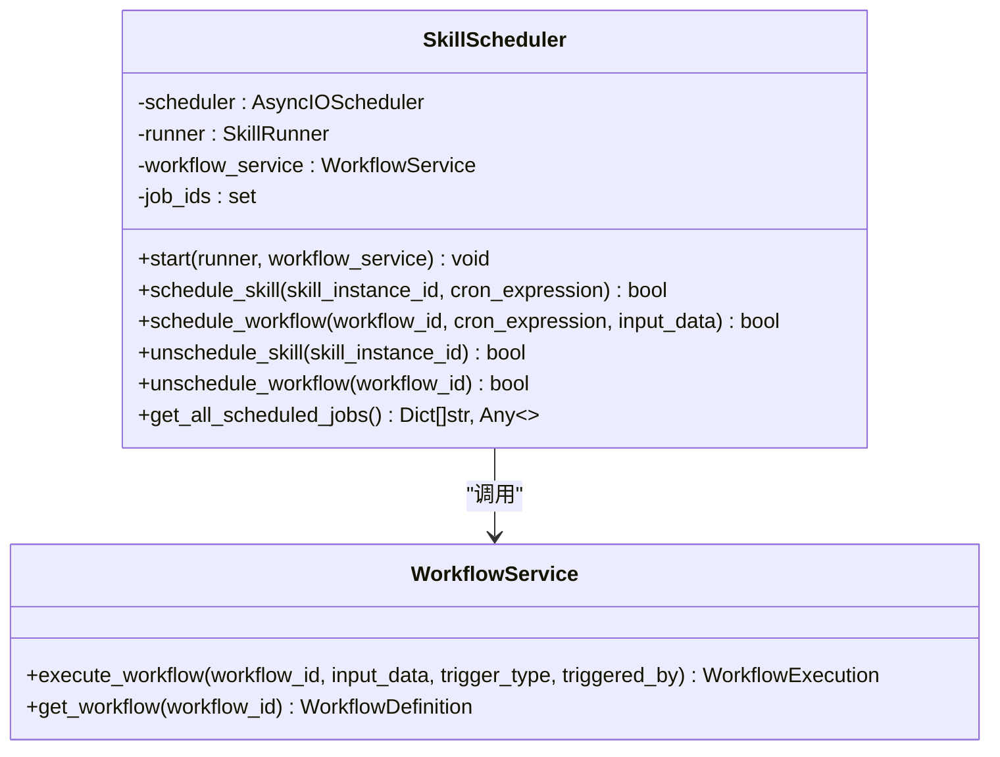
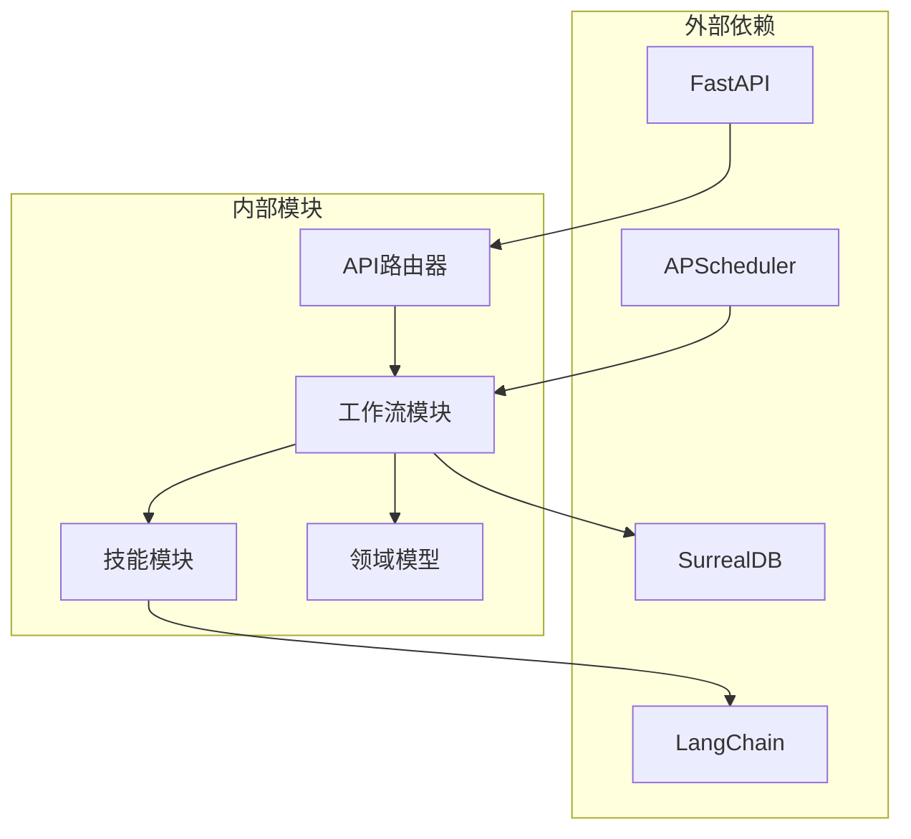

# 工作流编排系统

<cite>
**本文档引用的文件**
- [api/main.py](file://api/main.py)
- [open_notebook/workflows/engine.py](file://open_notebook/workflows/engine.py)
- [open_notebook/workflows/service.py](file://open_notebook/workflows/service.py)
- [open_notebook/workflows/templates.py](file://open_notebook/workflows/templates.py)
- [open_notebook/domain/workflow.py](file://open_notebook/domain/workflow.py)
- [api/routers/workflows.py](file://api/routers/workflows.py)
- [api/routers/workflow_templates.py](file://api/routers/workflow_templates.py)
- [open_notebook/skills/registry.py](file://open_notebook/skills/registry.py)
- [open_notebook/skills/base.py](file://open_notebook/skills/base.py)
- [open_notebook/skills/scheduler.py](file://open_notebook/skills/scheduler.py)
- [open_notebook/skills/note_organizer.py](file://open_notebook/skills/note_organizer.py)
- [open_notebook/skills/content_crawler.py](file://open_notebook/skills/content_crawler.py)
- [README.md](file://README.md)
- [docs/7-DEVELOPMENT/architecture.md](file://docs/7-DEVELOPMENT/architecture.md)
</cite>

## 目录
1. [简介](#简介)
2. [项目结构](#项目结构)
3. [核心组件](#核心组件)
4. [架构概览](#架构概览)
5. [详细组件分析](#详细组件分析)
6. [依赖关系分析](#依赖关系分析)
7. [性能考虑](#性能考虑)
8. [故障排除指南](#故障排除指南)
9. [结论](#结论)

## 简介

Open Notebook 的工作流编排系统是一个强大的自动化任务执行平台，专门设计用于处理复杂的研究和内容管理工作流。该系统基于技能（Skills）的概念，通过可配置的工作流定义来协调多个自动化任务的执行。

系统的核心特点包括：
- **多步骤工作流编排**：支持复杂的多步骤任务序列
- **条件执行**：基于条件表达式的智能决策
- **重试机制**：自动重试失败的任务
- **模板系统**：预构建的工作流模板
- **调度功能**：基于 Cron 表达式的时间调度
- **资源管理**：跟踪和管理创建的资源

## 项目结构

工作流编排系统主要分布在以下模块中：

**图表来源**
- [api/main.py](file://api/main.py#L137-L232)
- [open_notebook/workflows/engine.py](file://open_notebook/workflows/engine.py#L130-L620)
- [open_notebook/workflows/service.py](file://open_notebook/workflows/service.py#L22-L240)

**章节来源**
- [api/main.py](file://api/main.py#L1-L232)
- [docs/7-DEVELOPMENT/architecture.md](file://docs/7-DEVELOPMENT/architecture.md#L1-L800)

## 核心组件

### 工作流引擎 (WorkflowEngine)

工作流引擎是整个系统的核心执行单元，负责：

- **依赖图构建**：分析步骤间的依赖关系
- **并发执行**：并行执行独立的步骤
- **状态管理**：跟踪每个步骤的执行状态
- **错误处理**：实现重试逻辑和错误恢复
- **模板解析**：支持参数模板替换

**图表来源**
- [open_notebook/workflows/engine.py](file://open_notebook/workflows/engine.py#L130-L620)
- [open_notebook/domain/workflow.py](file://open_notebook/domain/workflow.py#L68-L138)

### 工作流服务 (WorkflowService)

工作流服务提供高级别的工作流操作接口：

- **创建工作流**：从配置创建新的工作流定义
- **执行工作流**：协调引擎执行工作流
- **查询历史**：管理执行历史和统计信息
- **调度管理**：管理定时执行的工作流

**章节来源**
- [open_notebook/workflows/service.py](file://open_notebook/workflows/service.py#L22-L240)

### 技能系统

技能系统是工作流的基础执行单元：

- **技能注册表**：维护技能类型到类的映射
- **技能基类**：定义技能的标准接口
- **技能上下文**：传递执行所需的上下文信息
- **技能结果**：封装执行结果和状态

**图表来源**
- [open_notebook/skills/base.py](file://open_notebook/skills/base.py#L83-L183)
- [open_notebook/skills/registry.py](file://open_notebook/skills/registry.py#L12-L133)

**章节来源**
- [open_notebook/skills/base.py](file://open_notebook/skills/base.py#L1-L183)
- [open_notebook/skills/registry.py](file://open_notebook/skills/registry.py#L1-L133)

### 模板系统

模板系统提供预构建的工作流模板：

- **模板定义**：标准化的工作流配置
- **输入验证**：确保输入参数的正确性
- **输出映射**：定义工作流输出的结构
- **类别管理**：按功能分类模板

**章节来源**
- [open_notebook/workflows/templates.py](file://open_notebook/workflows/templates.py#L1-L675)

## 架构概览

系统采用分层架构设计，确保关注点分离和模块化：

**图表来源**
- [api/routers/workflows.py](file://api/routers/workflows.py#L272-L294)
- [open_notebook/workflows/service.py](file://open_notebook/workflows/service.py#L116-L142)
- [open_notebook/workflows/engine.py](file://open_notebook/workflows/engine.py#L144-L203)

**章节来源**
- [docs/7-DEVELOPMENT/architecture.md](file://docs/7-DEVELOPMENT/architecture.md#L1-L800)

## 详细组件分析

### 工作流执行流程

工作流的执行过程遵循严格的生命周期管理：

**图表来源**
- [open_notebook/workflows/engine.py](file://open_notebook/workflows/engine.py#L205-L298)

### 条件执行机制

系统支持基于条件表达式的智能决策：

- **条件评估**：使用受限的内置函数集进行安全评估
- **上下文访问**：允许访问输入数据、步骤输出和变量
- **布尔计算**：支持所有标准 Python 布尔运算

**章节来源**
- [open_notebook/workflows/engine.py](file://open_notebook/workflows/engine.py#L513-L565)

### 错误处理和重试

系统实现了多层次的错误处理机制：

- **步骤级重试**：可配置的重试次数和延迟
- **继续执行**：即使某些步骤失败也可继续其他步骤
- **错误传播**：失败的错误信息会传播到上层
- **状态追踪**：详细的状态追踪和日志记录

**章节来源**
- [open_notebook/workflows/engine.py](file://open_notebook/workflows/engine.py#L416-L511)

### 调度系统

调度系统支持基于 Cron 表达式的时间调度：

**图表来源**
- [open_notebook/skills/scheduler.py](file://open_notebook/skills/scheduler.py#L20-L430)

**章节来源**
- [open_notebook/skills/scheduler.py](file://open_notebook/skills/scheduler.py#L1-L430)

### API 接口设计

系统提供了完整的 REST API 接口：

- **工作流管理**：CRUD 操作和执行控制
- **模板管理**：模板浏览和实例化
- **执行监控**：历史记录和统计信息
- **调度控制**：启用/禁用和时间调度

**章节来源**
- [api/routers/workflows.py](file://api/routers/workflows.py#L1-L453)
- [api/routers/workflow_templates.py](file://api/routers/workflow_templates.py#L1-L215)

## 依赖关系分析

系统中的关键依赖关系如下：

**图表来源**
- [api/main.py](file://api/main.py#L1-L50)
- [open_notebook/skills/scheduler.py](file://open_notebook/skills/scheduler.py#L1-L20)

**章节来源**
- [README.md](file://README.md#L194-L217)

## 性能考虑

系统在设计时充分考虑了性能优化：

- **异步执行**：全程使用 async/await 模型
- **并发控制**：合理限制同时执行的步骤数量
- **内存管理**：及时清理执行上下文和中间结果
- **数据库优化**：批量操作和连接池管理
- **缓存策略**：合理的缓存和失效机制

## 故障排除指南

### 常见问题诊断

1. **工作流无法启动**
   - 检查工作流定义的有效性
   - 验证技能类型是否已注册
   - 确认依赖关系是否正确

2. **步骤执行失败**
   - 查看错误日志和堆栈跟踪
   - 检查重试配置和延迟设置
   - 验证输入参数的正确性

3. **调度不生效**
   - 确认 Cron 表达式的格式正确
   - 检查调度器的运行状态
   - 验证工作流的启用状态

**章节来源**
- [open_notebook/workflows/engine.py](file://open_notebook/workflows/engine.py#L192-L199)
- [open_notebook/skills/scheduler.py](file://open_notebook/skills/scheduler.py#L357-L394)

## 结论

Open Notebook 的工作流编排系统是一个设计精良、功能强大的自动化平台。其核心优势包括：

- **模块化设计**：清晰的分层架构便于维护和扩展
- **灵活性**：支持复杂的多步骤工作流和条件执行
- **可靠性**：完善的错误处理和重试机制
- **可扩展性**：基于技能的插件化架构
- **易用性**：提供丰富的 API 和模板系统

该系统特别适合需要处理复杂研究和内容管理任务的场景，为用户提供了强大的自动化能力，同时保持了良好的性能和可靠性。