# 技能系统

<cite>
**本文档引用的文件**
- [open_notebook/skills/__init__.py](file://open_notebook/skills/__init__.py)
- [open_notebook/skills/base.py](file://open_notebook/skills/base.py)
- [open_notebook/skills/registry.py](file://open_notebook/skills/registry.py)
- [open_notebook/skills/runner.py](file://open_notebook/skills/runner.py)
- [open_notebook/skills/scheduler.py](file://open_notebook/skills/scheduler.py)
- [open_notebook/domain/skill.py](file://open_notebook/domain/skill.py)
- [open_notebook/skills/content_crawler.py](file://open_notebook/skills/content_crawler.py)
- [open_notebook/skills/browser_base.py](file://open_notebook/skills/browser_base.py)
- [open_notebook/skills/browser_task.py](file://open_notebook/skills/browser_task.py)
- [open_notebook/skills/note_organizer.py](file://open_notebook/skills/note_organizer.py)
- [api/routers/skills.py](file://api/routers/skills.py)
- [api/main.py](file://api/main.py)
- [open_notebook/domain/notebook.py](file://open_notebook/domain/notebook.py)
- [api/models.py](file://api/models.py)
- [open_notebook/database/repository.py](file://open_notebook/database/repository.py)
- [open_notebook/domain/base.py](file://open_notebook/domain/base.py)
- [open_notebook/exceptions.py](file://open_notebook/exceptions.py)
- [pyproject.toml](file://pyproject.toml)
</cite>

## 更新摘要
**所做更改**
- 新增BrowserTaskSkill和BrowserMonitorSkill浏览器自动化技能
- 改进BrowserUseSkill和BrowserCrawlerSkill的AI集成，使用browser-use库
- 更新技能注册系统以包含新的浏览器自动化技能
- 增强浏览器自动化技能的参数验证和错误处理
- 改进浏览器监控技能的变更检测机制

## 目录
1. [简介](#简介)
2. [项目结构](#项目结构)
3. [核心组件](#核心组件)
4. [架构概览](#架构概览)
5. [详细组件分析](#详细组件分析)
6. [APScheduler调度器](#apscheduler调度器)
7. [初始化顺序改进](#初始化顺序改进)
8. [异常处理机制](#异常处理机制)
9. [数据模型集成](#数据模型集成)
10. [依赖关系分析](#依赖关系分析)
11. [性能考虑](#性能考虑)
12. [故障排除指南](#故障排除指南)
13. [结论](#结论)

## 简介

技能系统是 Open Notebook 中的一个强大自动化框架，基于 LangChain 构建，为内容处理和智能笔记组织提供了灵活的扩展机制。该系统允许用户创建、管理和执行各种自动化技能，包括内容爬取、浏览器自动化、笔记组织等功能。

**最新更新** 技能系统现已集成了基于APScheduler的智能调度器，这是一个重大架构升级，完全替代了原有的cron-based实现。新的调度器基于APScheduler库，提供了更强大、更可靠的异步任务调度能力，支持基于cron表达式的自动技能执行。

**重大更新** 新增了BrowserTaskSkill和BrowserMonitorSkill浏览器自动化技能，以及对BrowserUseSkill和BrowserCrawlerSkill的AI集成改进。这些新技能使用browser-use库实现AI驱动的浏览器自动化，支持自然语言描述的任务执行和网页监控。

技能系统的核心特点：
- **模块化设计**：每个技能都是独立的模块，可以单独开发和维护
- **可扩展性**：支持动态注册新技能类型
- **异步执行**：所有技能都支持异步执行模式
- **生命周期管理**：提供完整的技能执行生命周期钩子
- **持久化存储**：技能配置和执行历史都有完整的数据库支持
- **智能调度**：基于APScheduler的cron表达式调度，支持自动技能执行
- **稳定的初始化顺序**：经过改进的初始化流程确保参数在父类验证之前正确设置
- **健壮的异常处理**：专门针对NotFoundError等异常进行优化处理
- **增强的日志记录**：提供详细的调度器状态和执行日志
- **自动生命周期管理**：调度器在应用启动和停止时自动管理
- **AI驱动的浏览器自动化**：使用browser-use库实现自然语言控制的浏览器操作
- **灵活的任务执行**：支持任意浏览器任务的自然语言描述
- **实时网页监控**：自动检测网页内容变化并发送告警

## 项目结构

技能系统主要分布在以下目录中：

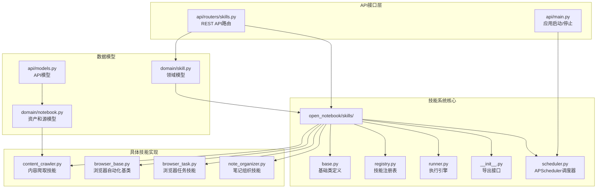

**图表来源**
- [open_notebook/skills/__init__.py](file://open_notebook/skills/__init__.py#L1-L35)
- [open_notebook/skills/base.py](file://open_notebook/skills/base.py#L1-L183)
- [open_notebook/skills/registry.py](file://open_notebook/skills/registry.py#L1-L133)
- [open_notebook/skills/runner.py](file://open_notebook/skills/runner.py#L1-L250)
- [open_notebook/skills/scheduler.py](file://open_notebook/skills/scheduler.py#L1-L236)
- [open_notebook/domain/skill.py](file://open_notebook/domain/skill.py#L1-L162)
- [open_notebook/domain/notebook.py](file://open_notebook/domain/notebook.py#L232-L294)
- [api/models.py](file://api/models.py#L274-L349)
- [api/main.py](file://api/main.py#L101-L122)

**章节来源**
- [open_notebook/skills/__init__.py](file://open_notebook/skills/__init__.py#L1-L35)
- [open_notebook/skills/base.py](file://open_notebook/skills/base.py#L1-L183)
- [open_notebook/skills/registry.py](file://open_notebook/skills/registry.py#L1-L133)
- [open_notebook/skills/runner.py](file://open_notebook/skills/runner.py#L1-L250)
- [open_notebook/skills/scheduler.py](file://open_notebook/skills/scheduler.py#L1-L236)

## 核心组件

技能系统由七个核心组件构成，它们协同工作以提供完整的自动化能力：

### 基础架构组件

1. **Skill 基类** - 定义所有技能的抽象接口和通用行为
2. **SkillRegistry 注册表** - 管理技能类型的动态注册和发现
3. **SkillRunner 执行器** - 处理技能的实际执行和生命周期管理
4. **SkillScheduler 调度器** - 基于APScheduler的智能调度系统
5. **SkillConfig 配置** - 存储技能实例的配置信息

### 数据模型组件

1. **SkillInstance** - 技能实例的数据库模型，包含配置和调度信息
2. **SkillExecution** - 技能执行历史记录，包含状态和结果信息
3. **Asset** - 资产模型，封装文件路径和URL信息
4. **Source** - 源模型，表示内容源及其关联的资产信息

### 浏览器自动化组件

1. **BrowserUseSkill** - AI驱动的浏览器自动化基类
2. **BrowserTaskSkill** - 通用浏览器任务执行技能
3. **BrowserMonitorSkill** - 网页监控和变更检测技能
4. **BrowserCrawlerSkill** - AI驱动的网页爬取技能

**章节来源**
- [open_notebook/skills/base.py](file://open_notebook/skills/base.py#L83-L183)
- [open_notebook/skills/registry.py](file://open_notebook/skills/registry.py#L12-L121)
- [open_notebook/skills/runner.py](file://open_notebook/skills/runner.py#L20-L250)
- [open_notebook/skills/scheduler.py](file://open_notebook/skills/scheduler.py#L31-L48)
- [open_notebook/domain/skill.py](file://open_notebook/domain/skill.py#L17-L165)
- [open_notebook/domain/notebook.py](file://open_notebook/domain/notebook.py#L232-L294)

## 架构概览

技能系统采用分层架构设计，确保了良好的关注点分离和可扩展性。**最新更新** 集成了基于APScheduler的智能调度器和新的浏览器自动化技能：

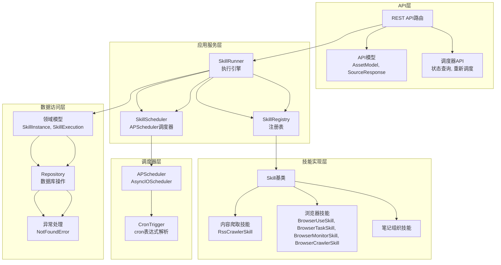

**图表来源**
- [api/routers/skills.py](file://api/routers/skills.py#L1-L507)
- [open_notebook/skills/runner.py](file://open_notebook/skills/runner.py#L20-L250)
- [open_notebook/skills/registry.py](file://open_notebook/skills/registry.py#L12-L121)
- [open_notebook/skills/scheduler.py](file://open_notebook/skills/scheduler.py#L31-L48)
- [open_notebook/domain/skill.py](file://open_notebook/domain/skill.py#L17-L165)
- [open_notebook/domain/notebook.py](file://open_notebook/domain/notebook.py#L232-L294)
- [open_notebook/database/repository.py](file://open_notebook/database/repository.py#L65-L195)
- [open_notebook/exceptions.py](file://open_notebook/exceptions.py#L25-L28)

## 详细组件分析

### 基础类体系

技能系统的基础类提供了统一的接口和生命周期管理：

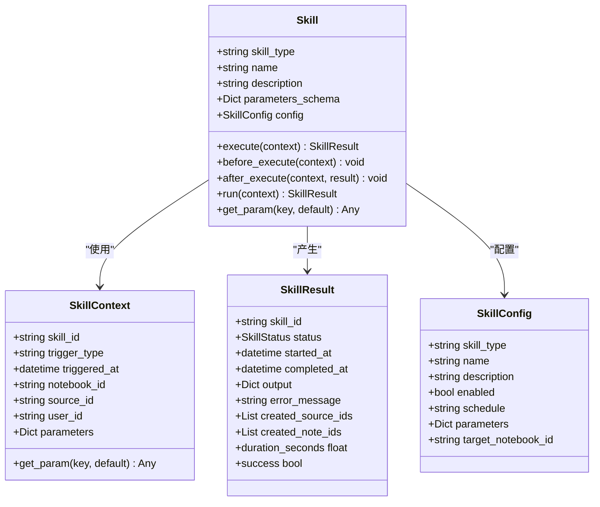

**图表来源**
- [open_notebook/skills/base.py](file://open_notebook/skills/base.py#L17-L183)

**章节来源**
- [open_notebook/skills/base.py](file://open_notebook/skills/base.py#L17-L183)

### 技能注册表机制

技能注册表实现了工厂模式，支持动态技能发现和实例化：

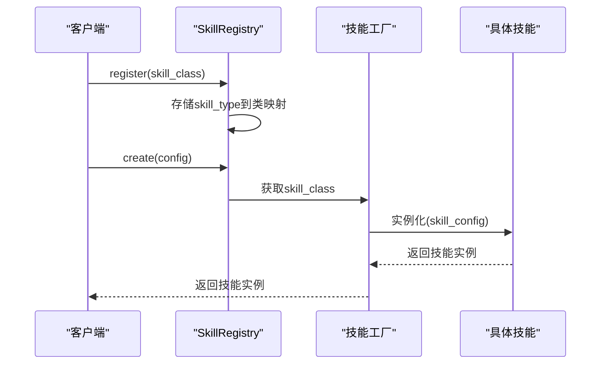

**图表来源**
- [open_notebook/skills/registry.py](file://open_notebook/skills/registry.py#L58-L79)

**章节来源**
- [open_notebook/skills/registry.py](file://open_notebook/skills/registry.py#L12-L121)

### 技能执行流程

技能执行器负责管理整个执行生命周期，包括参数合并、上下文构建和结果记录：

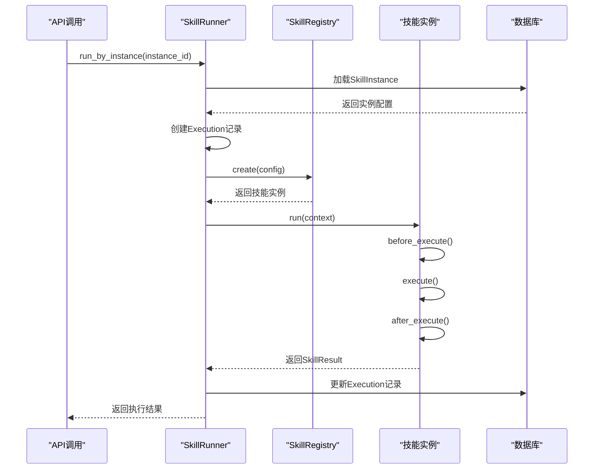

**图表来源**
- [open_notebook/skills/runner.py](file://open_notebook/skills/runner.py#L41-L150)

**章节来源**
- [open_notebook/skills/runner.py](file://open_notebook/skills/runner.py#L20-L250)

### 内容爬取技能

RSS内容爬取技能是最基础的自动化技能之一，支持从RSS源自动抓取内容：

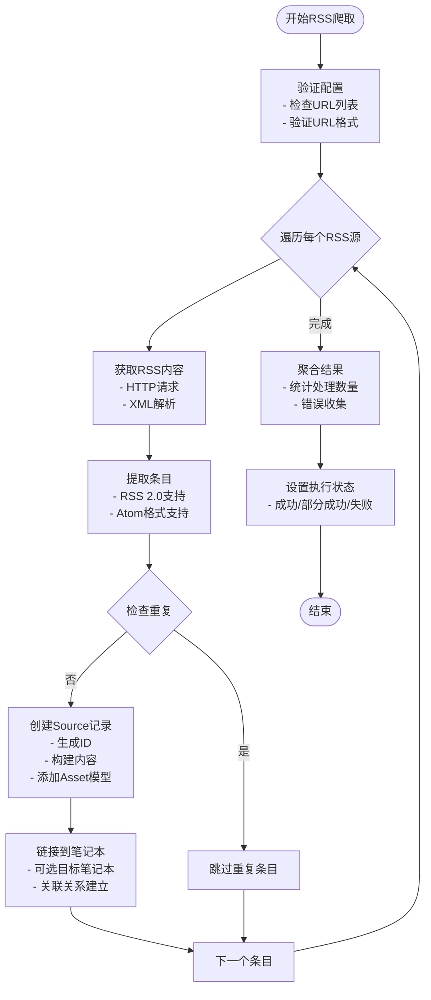

**图表来源**
- [open_notebook/skills/content_crawler.py](file://open_notebook/skills/content_crawler.py#L256-L306)

**章节来源**
- [open_notebook/skills/content_crawler.py](file://open_notebook/skills/content_crawler.py#L20-L315)

### 浏览器自动化技能

**重大更新** 新增了BrowserTaskSkill和BrowserMonitorSkill浏览器自动化技能，以及对BrowserUseSkill和BrowserCrawlerSkill的AI集成改进。

浏览器自动化技能使用browser-use库实现AI驱动的网页操作：

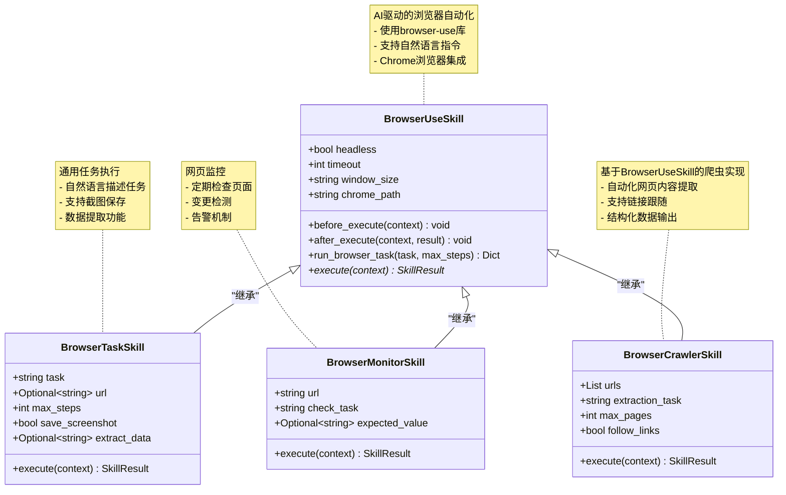

**图表来源**
- [open_notebook/skills/browser_base.py](file://open_notebook/skills/browser_base.py#L17-L316)
- [open_notebook/skills/browser_task.py](file://open_notebook/skills/browser_task.py#L17-L271)

**章节来源**
- [open_notebook/skills/browser_base.py](file://open_notebook/skills/browser_base.py#L17-L316)
- [open_notebook/skills/browser_task.py](file://open_notebook/skills/browser_task.py#L17-L271)

### 笔记组织技能

笔记组织技能提供AI驱动的内容处理能力：

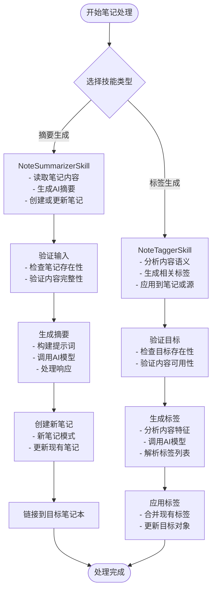

**图表来源**
- [open_notebook/skills/note_organizer.py](file://open_notebook/skills/note_organizer.py#L19-L408)

**章节来源**
- [open_notebook/skills/note_organizer.py](file://open_notebook/skills/note_organizer.py#L19-L408)

## APScheduler调度器

**重大更新** 技能调度器已完全迁移到基于APScheduler的实现，这是一个重要的架构升级。

### 调度器架构

SkillScheduler类基于APScheduler实现了完整的技能调度管理功能：

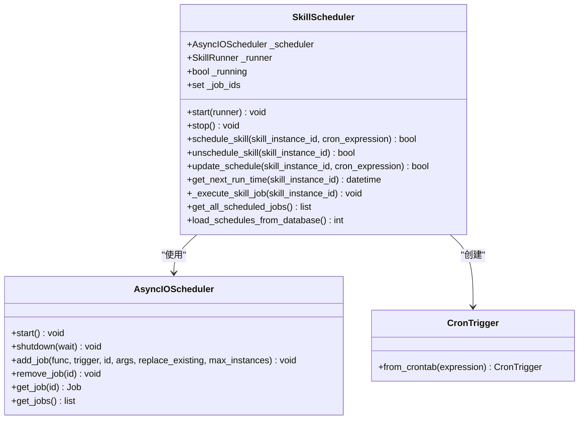

**图表来源**
- [open_notebook/skills/scheduler.py](file://open_notebook/skills/scheduler.py#L19-L31)
- [open_notebook/skills/scheduler.py](file://open_notebook/skills/scheduler.py#L181-L206)

### 调度器生命周期管理

调度器现在具有完整的生命周期管理，在应用启动和停止时自动管理：

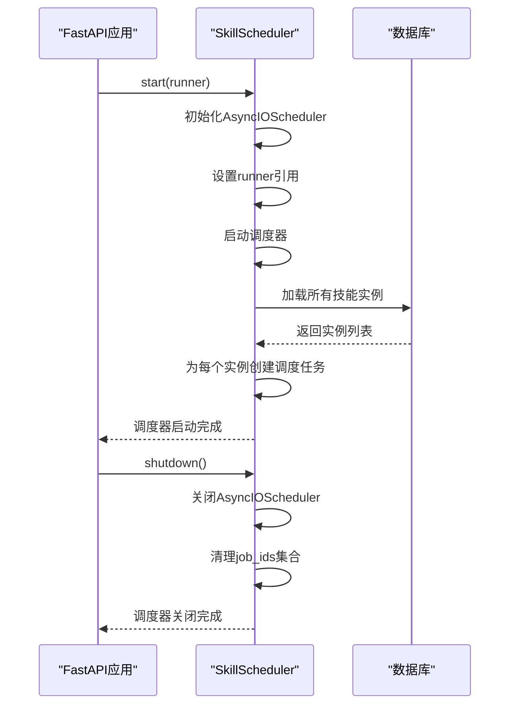

**图表来源**
- [api/main.py](file://api/main.py#L101-L128)
- [open_notebook/skills/scheduler.py](file://open_notebook/skills/scheduler.py#L32-L59)

### AP Scheduler集成

调度器完全基于APScheduler库实现，提供了强大的异步任务调度能力：

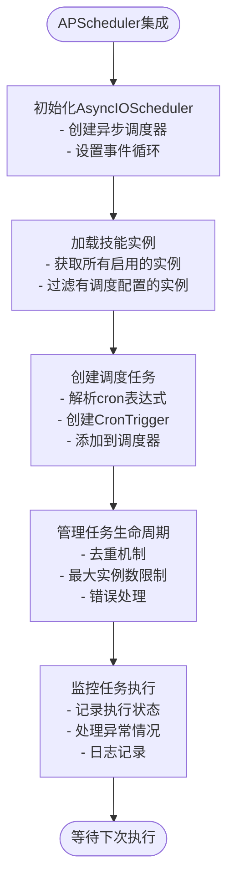

**图表来源**
- [open_notebook/skills/scheduler.py](file://open_notebook/skills/scheduler.py#L61-L117)

### cron表达式调度

调度器支持标准的APScheduler CronTrigger语法：

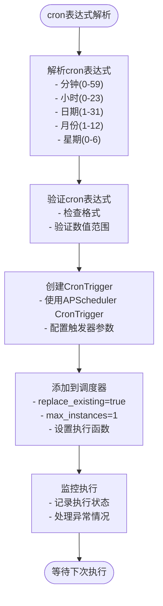

**图表来源**
- [open_notebook/skills/scheduler.py](file://open_notebook/skills/scheduler.py#L84-L117)

### API集成

调度器功能通过REST API提供完整的管理接口：

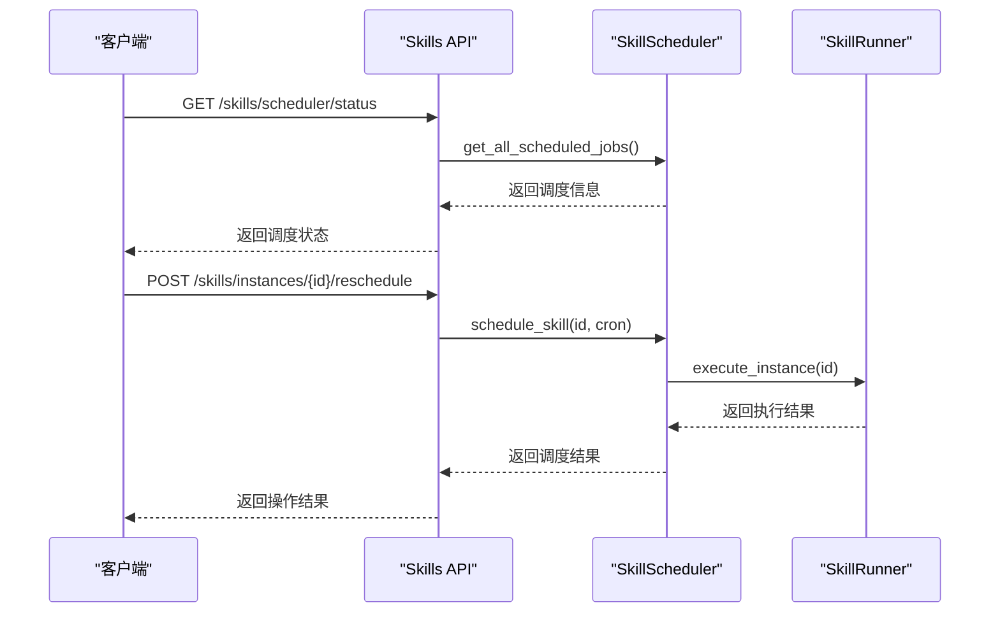

**图表来源**
- [api/routers/skills.py](file://api/routers/skills.py#L452-L507)
- [open_notebook/skills/scheduler.py](file://open_notebook/skills/scheduler.py#L181-L206)

**章节来源**
- [open_notebook/skills/scheduler.py](file://open_notebook/skills/scheduler.py#L1-L236)
- [api/routers/skills.py](file://api/routers/skills.py#L434-L507)
- [api/main.py](file://api/main.py#L101-L128)

## 初始化顺序改进

**更新** 技能系统经过重要改进，解决了初始化顺序问题，确保参数在父类初始化之前正确设置

技能系统中的多个技能类已经更新了初始化顺序，以确保参数验证的稳定性和可靠性：

### 核心改进原则

所有技能类现在遵循统一的初始化顺序模式：

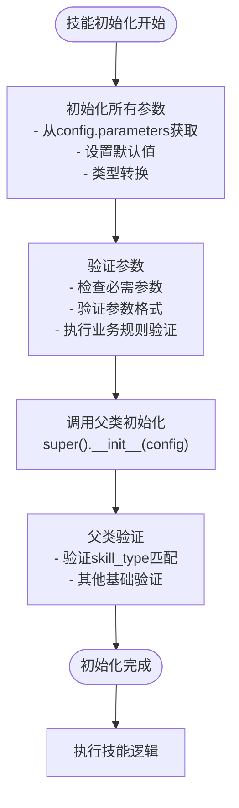

**图表来源**
- [open_notebook/skills/content_crawler.py](file://open_notebook/skills/content_crawler.py#L69-L75)
- [open_notebook/skills/browser_base.py](file://open_notebook/skills/browser_base.py#L74-L82)
- [open_notebook/skills/note_organizer.py](file://open_notebook/skills/note_organizer.py#L75-L81)

### 具体实现示例

#### RSS内容爬取技能
```python
def __init__(self, config: SkillConfig):
    # 初始化参数 BEFORE 调用 super().__init__
    # 因为 _validate_config() 在 super().__init__ 中被调用
    self.feed_urls: List[str] = config.parameters.get("feed_urls", [])
    self.max_entries: int = config.parameters.get("max_entries", 10)
    self.deduplicate: bool = config.parameters.get("deduplicate", True)
    super().__init__(config)
```

#### 浏览器自动化技能
```python
def __init__(self, config: SkillConfig):
    # 初始化参数 BEFORE 调用 super().__init__
    self.headless: bool = config.parameters.get("headless", True)
    self.timeout: int = config.parameters.get("timeout", 30)
    self.window_size: str = config.parameters.get("window_size", "1920,1080")
    self.chrome_path: str = config.parameters.get("chrome_path", "/usr/bin/google-chrome")
    self._browser = None
    self._agent = None
    super().__init__(config)
```

#### 笔记组织技能
```python
def __init__(self, config: SkillConfig):
    # 初始化参数 BEFORE 调用 super().__init__
    self.source_note_ids: List[str] = config.parameters.get("source_note_ids", [])
    self.summary_length: int = config.parameters.get("summary_length", 100)
    self.summary_style: str = config.parameters.get("summary_style", "concise")
    self.create_new_note: bool = config.parameters.get("create_new_note", True)
    super().__init__(config)
```

### 改进效果

这种初始化顺序改进带来了以下好处：

1. **修复验证错误**：确保 `_validate_config()` 方法能够正确访问所有参数
2. **提升系统稳定性**：避免因参数未初始化导致的运行时错误
3. **增强可靠性**：所有技能类都遵循一致的初始化模式
4. **改善错误处理**：参数验证失败时能提供更准确的错误信息

**章节来源**
- [open_notebook/skills/content_crawler.py](file://open_notebook/skills/content_crawler.py#L69-L86)
- [open_notebook/skills/browser_base.py](file://open_notebook/skills/browser_base.py#L74-L90)
- [open_notebook/skills/note_organizer.py](file://open_notebook/skills/note_organizer.py#L75-L89)

## 异常处理机制

**更新** 技能系统增强了异常处理机制，特别是针对NotFoundError的专门处理

### NotFoundError异常处理

系统现在能够更好地处理NotFoundError异常，提供更精确的错误恢复：

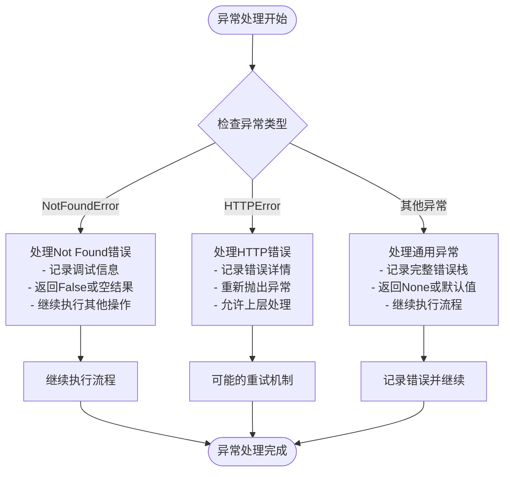

**图表来源**
- [open_notebook/skills/content_crawler.py](file://open_notebook/skills/content_crawler.py#L98-L101)
- [open_notebook/domain/base.py](file://open_notebook/domain/base.py#L91-L95)

### 具体实现改进

#### RSS爬虫中的NotFoundError处理
```python
async def _check_source_exists(self, source_id: str) -> bool:
    """Check if a source with this ID already exists."""
    try:
        existing = await Source.get(source_id)
        return existing is not None
    except Exception as e:
        # NotFoundError或任何其他异常都意味着源不存在
        logger.debug(f"Source {source_id} not found: {e}")
        return False
```

#### 数据库操作中的异常传播
```python
@classmethod
async def get(cls: Type[T], id: str) -> T:
    # ... 原有代码 ...
    result = await repo_query("SELECT * FROM $id", {"id": ensure_record_id(id)})
    if result:
        return target_class(**result[0])
    else:
        raise NotFoundError(f"{table_name} with id {id} not found")
```

### 异常处理最佳实践

1. **区分异常类型**：将NotFoundError与其他异常区分开来
2. **优雅降级**：当资源不存在时，系统应该优雅地降级而不是崩溃
3. **详细日志记录**：为每种异常类型提供详细的日志信息
4. **状态恢复**：确保异常发生后系统状态保持一致

**章节来源**
- [open_notebook/skills/content_crawler.py](file://open_notebook/skills/content_crawler.py#L93-L101)
- [open_notebook/domain/base.py](file://open_notebook/domain/base.py#L70-L95)
- [open_notebook/exceptions.py](file://open_notebook/exceptions.py#L25-L28)

## 数据模型集成

**更新** RSS爬虫功能改进包括修正的Asset模型集成，确保正确的数据结构传递给Source构造函数

### Asset模型设计

Asset模型是内容源的资产信息封装，支持文件路径和URL两种形式：

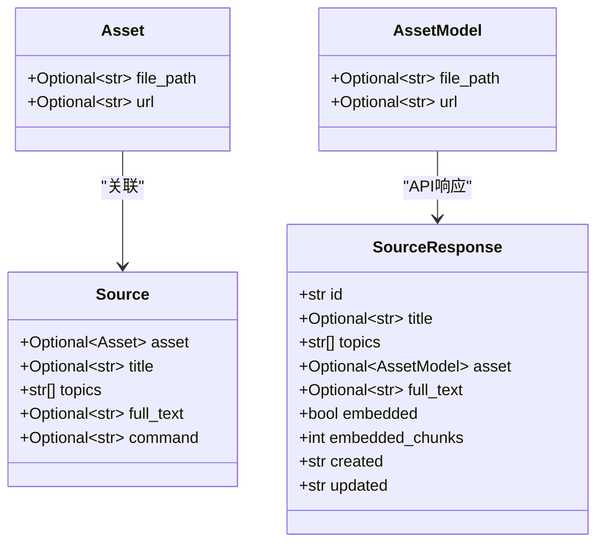

**图表来源**
- [open_notebook/domain/notebook.py](file://open_notebook/domain/notebook.py#L232-L294)
- [api/models.py](file://api/models.py#L274-L349)

### Source构造函数的数据结构

RSS爬虫现在正确地将Asset模型传递给Source构造函数：

```python
# 正确的Asset模型集成
source = Source(
    id=source_id,
    title=title,
    full_text=full_text,
    asset=Asset(url=url),  # 确保Asset对象正确传递
    topics=["rss", "auto-import"]
)

# API响应中的AssetModel转换
asset=AssetModel(
    file_path=source.asset.file_path if source.asset else None,
    url=source.asset.url if source.asset else None,
)
```

### 数据模型集成改进

#### Asset模型字段
- `file_path`: 可选的本地文件路径
- `url`: 可选的远程URL地址

#### Source模型集成
- `asset`: 关联的Asset对象
- `topics`: 主题标签列表
- `full_text`: 完整文本内容

#### API响应格式
- `asset`: AssetModel对象，用于API响应
- `embedded`: 嵌入状态标志
- `embedded_chunks`: 嵌入块数量

### 集成效果

这种改进确保了：

1. **类型安全**：Asset模型提供类型安全的字段访问
2. **向后兼容**：API响应仍然使用AssetModel格式
3. **数据一致性**：Source和Asset之间的关系得到正确维护
4. **错误预防**：避免了数据结构不匹配导致的错误

**章节来源**
- [open_notebook/domain/notebook.py](file://open_notebook/domain/notebook.py#L232-L294)
- [api/models.py](file://api/models.py#L274-L349)
- [open_notebook/skills/content_crawler.py](file://open_notebook/skills/content_crawler.py#L237-L245)

## 依赖关系分析

技能系统内部的依赖关系清晰且层次分明：

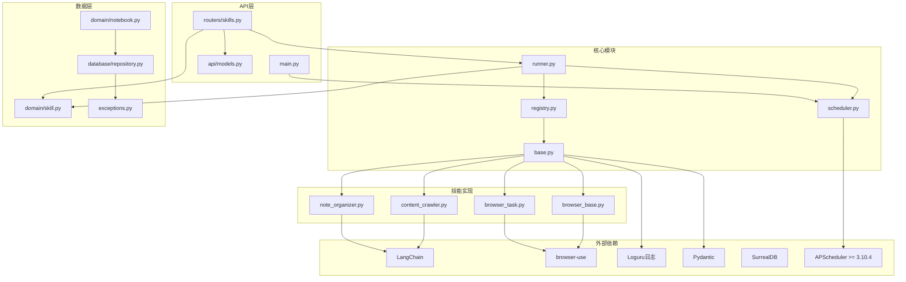

**图表来源**
- [open_notebook/skills/base.py](file://open_notebook/skills/base.py#L8-L14)
- [open_notebook/skills/browser_base.py](file://open_notebook/skills/browser_base.py#L13-L14)
- [open_notebook/skills/browser_task.py](file://open_notebook/skills/browser_task.py#L12-L14)
- [open_notebook/skills/note_organizer.py](file://open_notebook/skills/note_organizer.py#L14-L16)
- [open_notebook/skills/scheduler.py](file://open_notebook/skills/scheduler.py#L12-L13)
- [open_notebook/domain/notebook.py](file://open_notebook/domain/notebook.py#L1-L14)
- [open_notebook/database/repository.py](file://open_notebook/database/repository.py#L1-L14)
- [open_notebook/exceptions.py](file://open_notebook/exceptions.py#L1-L70)
- [api/main.py](file://api/main.py#L101-L128)
- [pyproject.toml](file://pyproject.toml#L43)

**章节来源**
- [open_notebook/skills/base.py](file://open_notebook/skills/base.py#L8-L14)
- [open_notebook/skills/browser_base.py](file://open_notebook/skills/browser_base.py#L13-L14)
- [open_notebook/skills/browser_task.py](file://open_notebook/skills/browser_task.py#L12-L14)
- [open_notebook/skills/note_organizer.py](file://open_notebook/skills/note_organizer.py#L14-L16)
- [open_notebook/skills/scheduler.py](file://open_notebook/skills/scheduler.py#L12-L13)
- [open_notebook/domain/notebook.py](file://open_notebook/domain/notebook.py#L1-L14)
- [open_notebook/database/repository.py](file://open_notebook/database/repository.py#L1-L14)
- [open_notebook/exceptions.py](file://open_notebook/exceptions.py#L1-L70)
- [api/main.py](file://api/main.py#L101-L128)
- [pyproject.toml](file://pyproject.toml#L43)

## 性能考虑

技能系统在设计时充分考虑了性能优化：

### 异步执行优化
- 所有技能都支持异步执行，避免阻塞主线程
- HTTP请求使用异步客户端，提高并发处理能力
- 数据库操作采用异步模式

### AP Scheduler性能优化
- **AsyncIOScheduler集成**：使用APScheduler的AsyncIOScheduler处理异步任务
- **任务去重**：max_instances=1防止重复执行
- **内存管理**：自动清理已完成的任务
- **错误隔离**：调度器异常不影响其他任务执行
- **全局实例管理**：使用全局skill_scheduler实例避免重复创建

### 浏览器自动化性能优化
- **AI驱动的浏览器操作**：使用browser-use库减少手动编码
- **资源管理**：浏览器实例在执行后自动清理
- **超时控制**：可配置的页面加载超时时间
- **窗口大小优化**：可配置的浏览器窗口尺寸
- **Chrome路径检测**：自动检测Chrome可执行文件位置

### 缓存策略
- 日志使用轻量级缓存减少I/O操作
- 参数验证结果可以缓存以避免重复计算
- 执行结果的状态信息便于快速查询

### 资源管理
- 浏览器自动化技能在完成后自动清理资源
- 网络连接使用连接池复用
- 内存使用监控和及时释放

### 异常处理优化
- NotFoundError异常处理避免了不必要的重试
- 异常类型区分提高了错误恢复效率
- 详细的日志记录有助于性能分析

## 故障排除指南

### 常见问题及解决方案

1. **技能未找到错误**
   - 检查技能是否正确注册到SkillRegistry
   - 验证技能类型字符串是否匹配
   - 确认技能类导入路径正确

2. **调度器启动失败**
   - 检查APScheduler依赖是否正确安装（版本>=3.10.4）
   - 验证AsyncIOScheduler初始化
   - 确认数据库连接正常
   - 检查应用生命周期管理是否正确

3. **cron表达式解析错误**
   - 验证cron表达式格式正确
   - 检查APScheduler CronTrigger支持的语法
   - 确认表达式中的数值范围有效

4. **浏览器自动化失败**
   - 确认Chrome浏览器已安装且可执行
   - 检查LLM API密钥配置
   - 验证网络连接和代理设置
   - 检查browser-use库是否正确安装

5. **浏览器任务执行错误**
   - 验证任务描述是否清晰明确
   - 检查最大步骤数设置是否合理
   - 确认URL格式是否正确
   - 验证AI模型配置

6. **浏览器监控告警问题**
   - 检查预期值设置是否正确
   - 验证监控频率设置
   - 确认页面内容提取逻辑
   - 检查变更检测算法

7. **数据库连接问题**
   - 检查数据库服务状态
   - 验证连接字符串配置
   - 确认表结构和权限

8. **内存泄漏问题**
   - 确保浏览器实例正确关闭
   - 检查长生命周期对象的引用
   - 使用弱引用避免循环引用

9. **初始化顺序错误**
   - 确保所有参数都在调用 `super().__init__(config)` 之前设置
   - 检查自定义验证方法是否正确访问参数
   - 验证参数类型转换和默认值设置

10. **RSS爬虫异常处理问题**
    - 检查NotFoundError异常是否被正确捕获
    - 验证Asset模型数据结构的正确传递
    - 确认Source构造函数接收正确的参数

11. **Asset模型集成问题**
    - 检查Asset对象是否正确创建
    - 验证Source构造函数的参数传递
    - 确认API响应中的AssetModel转换

12. **调度器API调用失败**
    - 检查调度器是否已启动
    - 验证技能实例ID是否存在
    - 确认cron表达式格式正确
    - 检查调度器状态和作业列表

13. **APScheduler集成问题**
    - 确认APScheduler版本满足要求（>=3.10.4）
    - 检查AsyncIOScheduler的启动和停止流程
    - 验证CronTrigger的创建和配置
    - 确认调度器的生命周期管理正确

14. **浏览器自动化技能问题**
    - 检查Chrome路径配置
    - 验证AI模型提供商配置
    - 确认browser-use库版本兼容性
    - 检查浏览器权限和配置

**章节来源**
- [open_notebook/skills/runner.py](file://open_notebook/skills/runner.py#L133-L149)
- [open_notebook/skills/browser_base.py](file://open_notebook/skills/browser_base.py#L127-L135)
- [open_notebook/skills/browser_task.py](file://open_notebook/skills/browser_task.py#L90-L99)
- [open_notebook/skills/content_crawler.py](file://open_notebook/skills/content_crawler.py#L93-L101)
- [open_notebook/skills/scheduler.py](file://open_notebook/skills/scheduler.py#L84-L117)
- [open_notebook/domain/notebook.py](file://open_notebook/domain/notebook.py#L232-L294)
- [api/routers/skills.py](file://api/routers/skills.py#L485-L507)
- [pyproject.toml](file://pyproject.toml#L43)

## 结论

技能系统为 Open Notebook 提供了一个强大而灵活的自动化框架。通过模块化的架构设计、完善的生命周期管理和丰富的内置技能，用户可以轻松扩展和定制自己的自动化工作流。

**最新重大更新** 技能系统集成了基于APScheduler的智能调度器，这是一个完全的架构升级，替代了原有的cron-based实现。这个新的调度器提供了更强大、更可靠的异步任务调度能力，实现了真正的智能自动化。

**重大更新** 新增了BrowserTaskSkill和BrowserMonitorSkill浏览器自动化技能，以及对BrowserUseSkill和BrowserCrawlerSkill的AI集成改进。这些新技能使用browser-use库实现AI驱动的浏览器自动化，支持自然语言描述的任务执行和网页监控。

系统的主要优势包括：
- **高度可扩展**：支持动态注册新技能类型
- **易于使用**：提供简洁的API接口和配置方式
- **智能调度**：基于APScheduler的cron表达式调度，支持自动技能执行
- **可靠的APScheduler集成**：使用成熟的APScheduler库，版本>=3.10.4
- **完整的生命周期管理**：调度器在应用启动和停止时自动管理
- **稳定的初始化顺序**：经过改进的初始化流程确保参数在父类验证之前正确设置
- **健壮异常处理**：专门针对NotFoundError等异常进行优化处理
- **增强的日志记录**：提供详细的调度器状态和执行日志
- **全局实例管理**：使用全局skill_scheduler实例简化管理
- **AI驱动的浏览器自动化**：使用browser-use库实现自然语言控制的浏览器操作
- **灵活的任务执行**：支持任意浏览器任务的自然语言描述
- **实时网页监控**：自动检测网页内容变化并发送告警
- **智能内容提取**：基于AI的网页内容提取和结构化处理

经过最近的重大改进，系统在以下方面得到了显著提升：
- **APScheduler调度器集成**：完全替代原有的cron-based实现
- **自动技能执行**：无需手动触发的智能调度
- **API集成完善**：提供完整的调度器管理接口
- **应用生命周期集成**：自动在应用启动和停止时管理调度器
- **RSS爬虫功能增强**：改进的异常处理机制能够更好地处理NotFoundError
- **数据模型集成优化**：Asset模型正确传递给Source构造函数
- **异常处理最佳实践**：区分异常类型，提供优雅的错误恢复
- **API响应一致性**：保持AssetModel格式的同时改进内部数据结构
- **依赖关系明确**：APScheduler版本要求明确（>=3.10.4）
- **浏览器自动化技能增强**：新增BrowserTaskSkill和BrowserMonitorSkill
- **AI集成改进**：BrowserUseSkill和BrowserCrawlerSkill使用browser-use库
- **参数验证增强**：改进的配置验证和错误处理机制

未来的发展方向可能包括：
- 更多内置技能类型的扩展
- 技能编排和依赖关系管理
- 分布式执行和负载均衡
- 更丰富的监控和调试工具
- 进一步优化异常处理和错误恢复机制
- 增强调度器的可视化界面和管理工具
- 支持更多调度模式（如间隔调度、事件驱动等）
- 集成更高级的APScheduler特性，如作业持久化、集群支持等
- 扩展浏览器自动化技能的功能和应用场景
- 改进AI模型集成和性能优化
- 增强浏览器监控和告警机制
- 支持更多浏览器自动化场景和任务类型