# Vikki内容运营技能系统

<cite>
**本文档引用的文件**
- [open_notebook/skills/vikki_content_ops.py](file://open_notebook/skills/vikki_content_ops.py)
- [open_notebook/skills/base.py](file://open_notebook/skills/base.py)
- [open_notebook/skills/registry.py](file://open_notebook/skills/registry.py)
- [open_notebook/skills/runner.py](file://open_notebook/skills/runner.py)
- [open_notebook/skills/scheduler.py](file://open_notebook/skills/scheduler.py)
- [api/routers/skills.py](file://api/routers/skills.py)
- [api/main.py](file://api/main.py)
- [frontend/src/app/(dashboard)/skills/page.tsx](file://frontend/src/app/(dashboard)/skills/page.tsx)
- [frontend/src/lib/hooks/use-skills.ts](file://frontend/src/lib/hooks/use-skills.ts)
- [open_notebook/domain/skill.py](file://open_notebook/domain/skill.py)
- [open_notebook/skills/__init__.py](file://open_notebook/skills/__init__.py)
- [docs/vikki的IP运营/Skill化架构设计-可复用可共享.md](file://docs/vikki的IP运营/Skill化架构设计-可复用可共享.md)
</cite>

## 更新摘要
**变更内容**
- 新增8个中国平台支持（小红书、即刻、微信公众号、微信视频号、知乎、抖音、微博、小宇宙）
- 新增中文内容风格（种草、干货、故事）
- 更新默认平台选择，从海外平台改为中文平台
- 增强平台特定功能配置，支持更多平台特性

## 目录
1. [项目概述](#项目概述)
2. [系统架构](#系统架构)
3. [核心技能组件](#核心技能组件)
4. [技能执行流程](#技能执行流程)
5. [四象限内容策略](#四象限内容策略)
6. [痛点识别系统](#痛点识别系统)
7. [内容生成与适配](#内容生成与适配)
8. [账户生命周期诊断](#账户生命周期诊断)
9. [技能调度与管理](#技能调度与管理)
10. [前端交互界面](#前端交互界面)
11. [性能优化建议](#性能优化建议)
12. [故障排除指南](#故障排除指南)
13. [总结](#总结)

## 项目概述

Vikki内容运营技能系统是一个基于四象限内容策略的智能内容运营自动化平台。该系统通过可复用的技能模块，为内容创作者和OPC（一人公司）运营商提供系统化的高ROI内容主题生成能力。

### 四象限内容策略框架

系统基于四个象限的内容策略：

- **Q1：意图用户** - "你有问题，我有解决方案"（高转化）
- **Q2：认知用户** - "你知道这个领域，我来深化理解"（教育）
- **Q3：大众用户** - "你不知道你需要这个"（意识）
- **Q4：潜在用户** - "扩展使用场景和机会"（发现）

### 核心设计原则

1. **单一职责原则** - 每个技能只做一件事，做到极致
2. **低耦合高内聚** - 技能之间松耦合，内部功能完整
3. **标准化接口** - 输入输出标准化，支持JSON格式
4. **可组合性** - 技能可以像乐高积木一样组合使用
5. **自包含性** - 每个技能包含所有必需的组件

## 系统架构

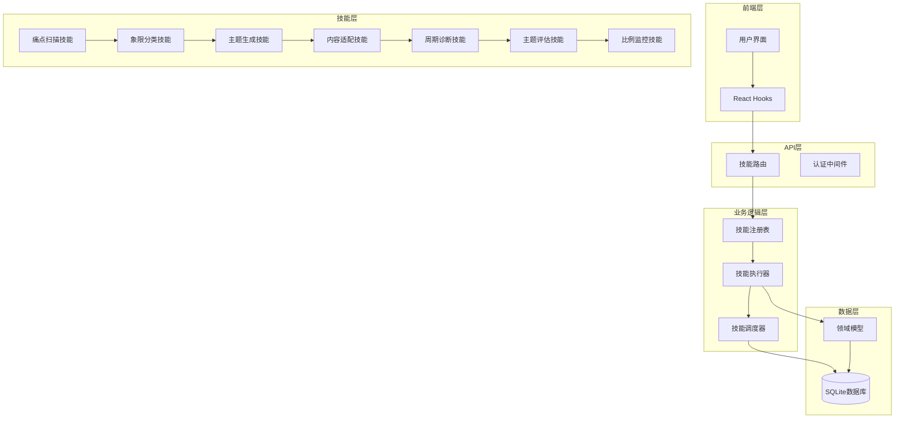

**图表来源**
- [open_notebook/skills/vikki_content_ops.py](file://open_notebook/skills/vikki_content_ops.py#L1-L50)
- [open_notebook/skills/registry.py](file://open_notebook/skills/registry.py#L12-L50)
- [open_notebook/skills/runner.py](file://open_notebook/skills/runner.py#L20-L50)

## 核心技能组件

### 技能基类系统

系统采用统一的技能基类架构，提供标准化的技能开发框架：

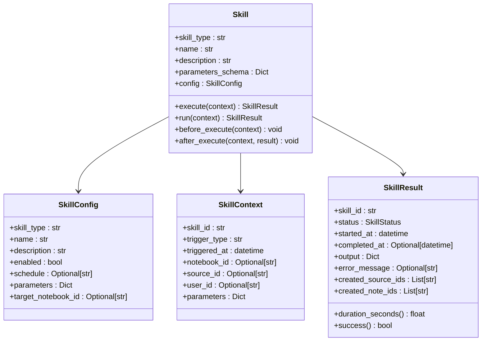

**图表来源**
- [open_notebook/skills/base.py](file://open_notebook/skills/base.py#L83-L183)

### 技能注册表机制

技能注册表负责管理所有可用技能的注册、查找和实例化：

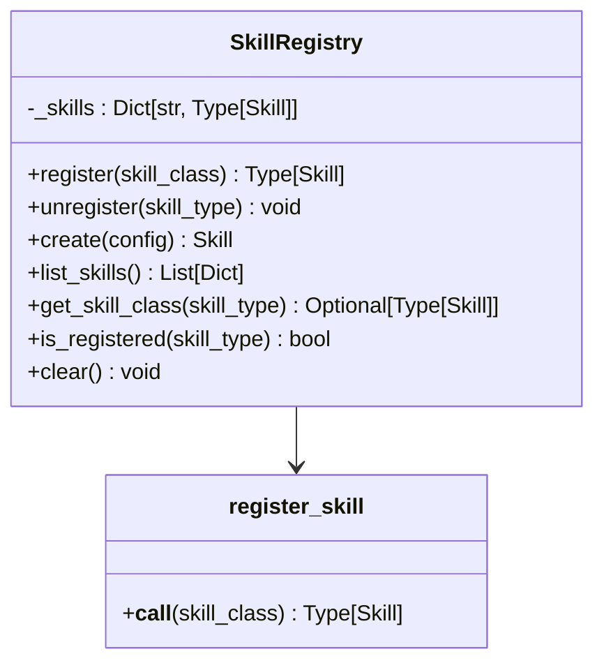

**图表来源**
- [open_notebook/skills/registry.py](file://open_notebook/skills/registry.py#L12-L133)

**章节来源**
- [open_notebook/skills/base.py](file://open_notebook/skills/base.py#L1-L183)
- [open_notebook/skills/registry.py](file://open_notebook/skills/registry.py#L1-L133)

## 技能执行流程

### 技能执行器架构

技能执行器提供完整的技能生命周期管理：

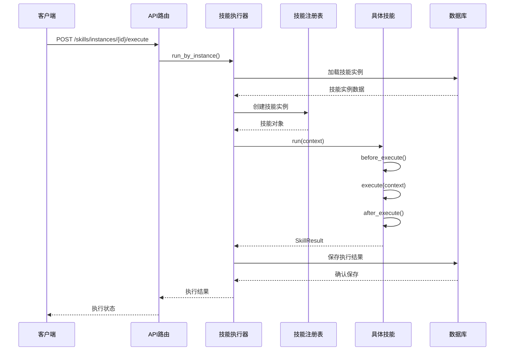

**图表来源**
- [open_notebook/skills/runner.py](file://open_notebook/skills/runner.py#L41-L150)
- [api/routers/skills.py](file://api/routers/skills.py#L301-L333)

### 技能调度系统

系统支持基于Cron表达式的定时任务调度：

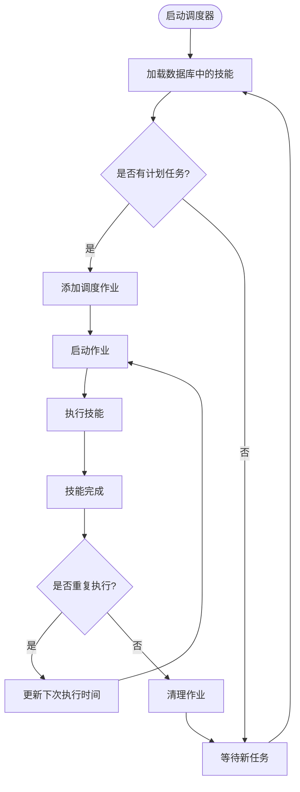

**图表来源**
- [open_notebook/skills/scheduler.py](file://open_notebook/skills/scheduler.py#L69-L125)

**章节来源**
- [open_notebook/skills/runner.py](file://open_notebook/skills/runner.py#L1-L250)
- [open_notebook/skills/scheduler.py](file://open_notebook/skills/scheduler.py#L1-L430)

## 四象限内容策略

### 象限分类系统

系统提供智能的内容象限分类能力：

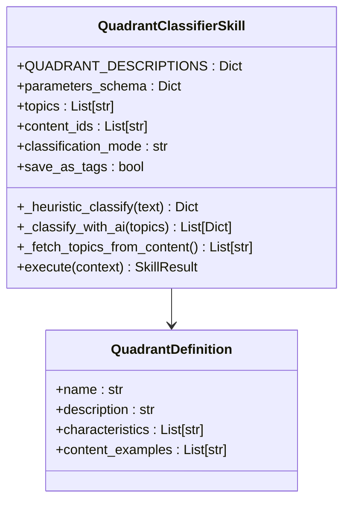

**图表来源**
- [open_notebook/skills/vikki_content_ops.py](file://open_notebook/skills/vikki_content_ops.py#L422-L758)

### 象限特征分析

| 象限 | 用户特征 | 内容特征 | 转化目标 |
|------|----------|----------|----------|
| Q1 | 高意图，解决方案导向 | 直接解决问题，行动导向 | 高转化，立即购买 |
| Q2 | 认知用户，学习导向 | 深入分析，专业内容 | 建立信任，长期价值 |
| Q3 | 大众用户，娱乐导向 | 大众化，易于理解 | 品牌曝光，病毒传播 |
| Q4 | 潜在用户，探索导向 | 创新性，跨领域应用 | 发现新机会，扩大边界 |

**章节来源**
- [open_notebook/skills/vikki_content_ops.py](file://open_notebook/skills/vikki_content_ops.py#L422-L758)

## 痛点识别系统

### 多层次痛点扫描

系统提供多层次的痛点识别能力：

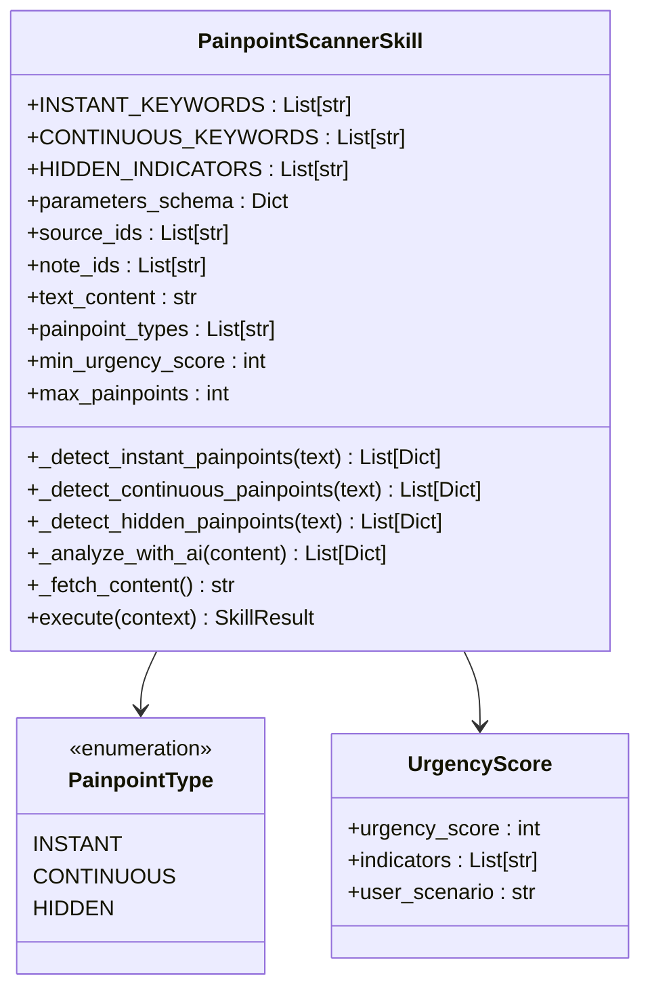

**图表来源**
- [open_notebook/skills/vikki_content_ops.py](file://open_notebook/skills/vikki_content_ops.py#L30-L420)

### 痛点类型分析

| 痛点类型 | 特征描述 | 识别关键词 | 转化潜力 |
|----------|----------|------------|----------|
| 即时性痛点 | 紧急，需要立即解决 | "现在"、"立刻"、"紧急"、"今天" | 高（立即行动） |
| 持续性痛点 | 长期存在，反复出现 | "总是"、"一直"、"每天"、"长期" | 中高（持续关注） |
| 隐性痛点 | 未表达，需要深度挖掘 | "希望"、"秘密"、"不敢说" | 中（情感共鸣） |

**章节来源**
- [open_notebook/skills/vikki_content_ops.py](file://open_notebook/skills/vikki_content_ops.py#L30-L420)

## 内容生成与适配

### 智能主题生成

系统提供多维度的内容主题生成能力：

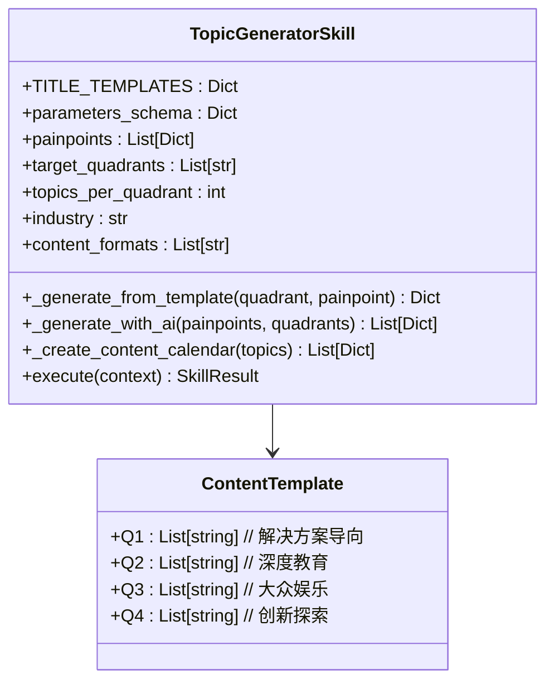

**图表来源**
- [open_notebook/skills/vikki_content_ops.py](file://open_notebook/skills/vikki_content_ops.py#L761-L1099)

### 平台内容适配

系统支持多平台的内容适配，现已新增8个中国平台：

**更新** 新增8个中国平台支持，包括小红书、即刻、微信公众号、微信视频号、知乎、抖音、微博、小宇宙

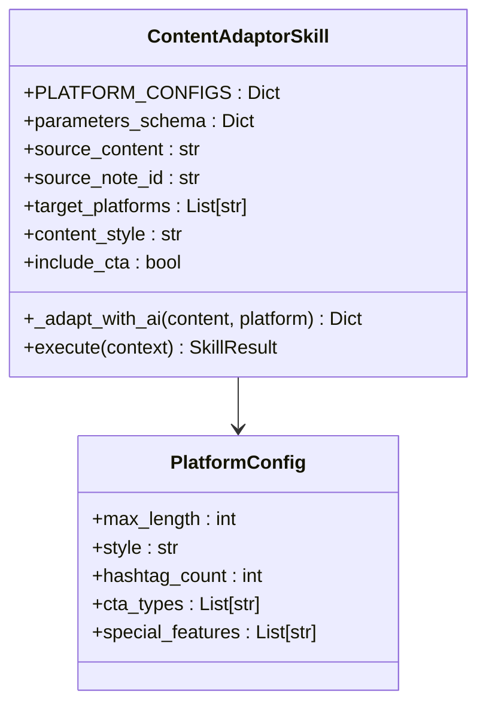

**图表来源**
- [open_notebook/skills/vikki_content_ops.py](file://open_notebook/skills/vikki_content_ops.py#L1099-L1370)

### 中国平台配置详解

系统现已支持以下平台配置：

#### 海外平台
- **Twitter/X**: 280字符限制，简洁有力，适合推文格式
- **LinkedIn**: 3000字符限制，专业故事驱动
- **Instagram**: 2200字符限制，视觉友好，表情符号丰富
- **TikTok**: 2200字符限制，轻松随意，趋势导向

#### 中文平台
- **小红书**: 1000字符限制，种草风格，场景化描述
- **即刻**: 2000字符限制，兴趣导向，话题讨论
- **微信公众号**: 5000字符限制，深度专业，逻辑严谨
- **微信视频号**: 1000字符限制，社交传播，竖屏适配
- **知乎**: 10000字符限制，专业严谨，干货输出
- **抖音**: 500字符限制，短平快，hook前置
- **微博**: 5000字符限制，热点敏感，话题参与
- **小宇宙**: 2000字符限制，声音叙事，深度对话

### 中文内容风格支持

**更新** 新增中文内容风格选项，支持更贴近本土用户的表达方式

系统支持以下内容风格：
- **专业风格**: professional（默认）
- **休闲风格**: casual
- **故事风格**: storytelling
- **教育风格**: educational
- **种草风格**: zhongcao（新增）
- **干货风格**: ganhuo（新增）
- **故事风格**: gushi（新增）

### 默认平台选择更新

**更新** 默认平台已从海外平台更新为中国平台，提高本土化适配效果

默认平台配置：
```json
"default": ["xiaohongshu", "wechat"]
```

这反映了系统对中国市场内容运营需求的关注，优先支持小红书和微信公众号这两个重要的内容平台。

**章节来源**
- [open_notebook/skills/vikki_content_ops.py](file://open_notebook/skills/vikki_content_ops.py#L1100-L1370)

## 账户生命周期诊断

### 生命周期阶段识别

系统提供账户生命周期的智能诊断：

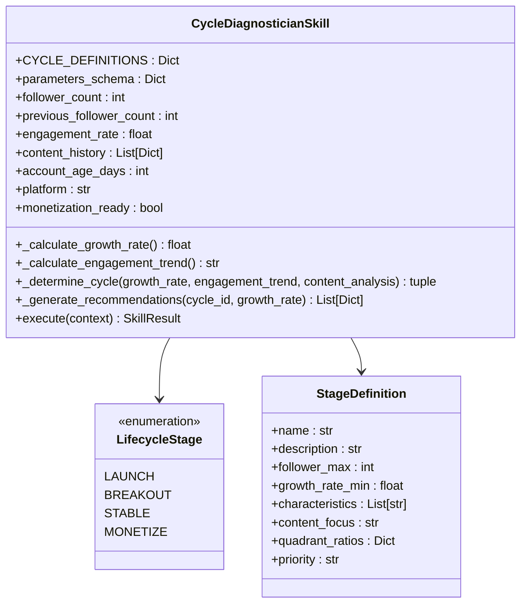

**图表来源**
- [open_notebook/skills/vikki_content_ops.py](file://open_notebook/skills/vikki_content_ops.py#L1372-L1797)

### 阶段特征对比

| 阶段 | 关键指标 | 内容重点 | 象限分布 |
|------|----------|----------|----------|
| 起号期 | 0-1000粉丝，快速增长 | 建立专业形象 | Q3: 40%, Q2: 30%, Q1: 20% |
| 破圈期 | 1000-50000粉丝，20%+增长 | 扩大影响力 | Q3: 30%, Q2: 35%, Q1: 25% |
| 稳定期 | 50000-500000粉丝，稳定增长 | 深化专业知识 | Q2: 40%, Q1: 30%, Q3: 20% |
| 转化期 | 5000+粉丝，专注变现 | 直接销售内容 | Q1: 50%, Q2: 30%, Q3: 15% |

**章节来源**
- [open_notebook/skills/vikki_content_ops.py](file://open_notebook/skills/vikki_content_ops.py#L1372-L1797)

## 技能调度与管理

### 技能实例管理

系统提供完整的技能实例生命周期管理：

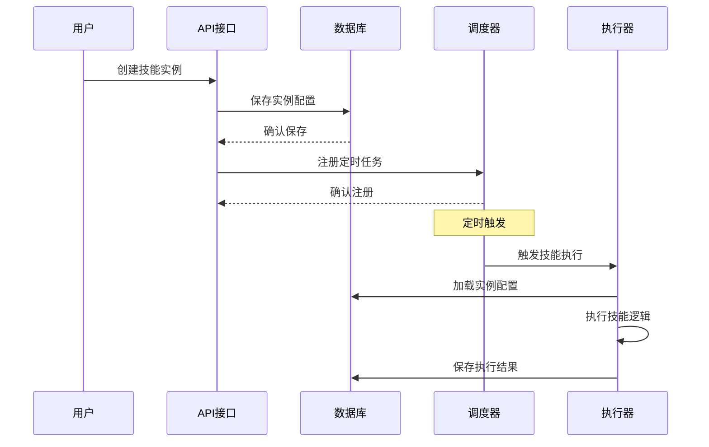

**图表来源**
- [api/routers/skills.py](file://api/routers/skills.py#L162-L201)
- [open_notebook/skills/scheduler.py](file://open_notebook/skills/scheduler.py#L69-L125)

### 技能执行历史

系统记录完整的技能执行历史：

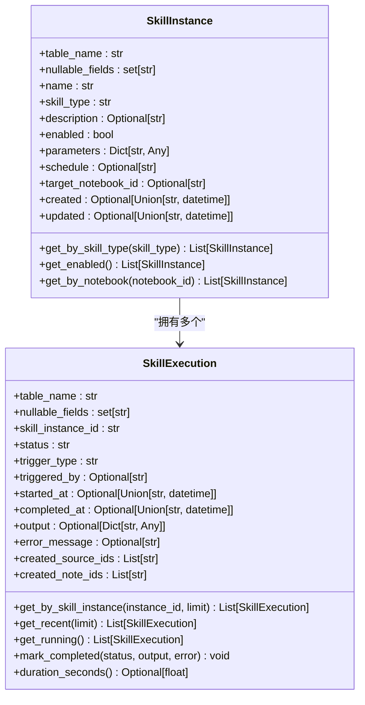

**图表来源**
- [open_notebook/domain/skill.py](file://open_notebook/domain/skill.py#L17-L162)

**章节来源**
- [api/routers/skills.py](file://api/routers/skills.py#L1-L507)
- [open_notebook/domain/skill.py](file://open_notebook/domain/skill.py#L1-L162)

## 前端交互界面

### 技能管理界面

前端提供直观的技能管理界面：

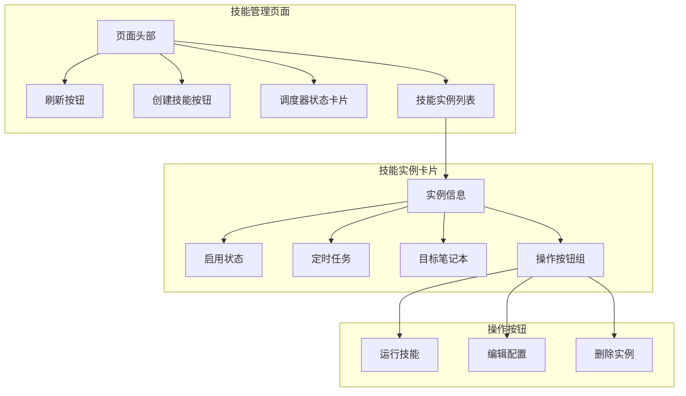

**图表来源**
- [frontend/src/app/(dashboard)/skills/page.tsx](file://frontend/src/app/(dashboard)/skills/page.tsx#L16-L189)

### React Hooks集成

前端使用React Query进行状态管理：

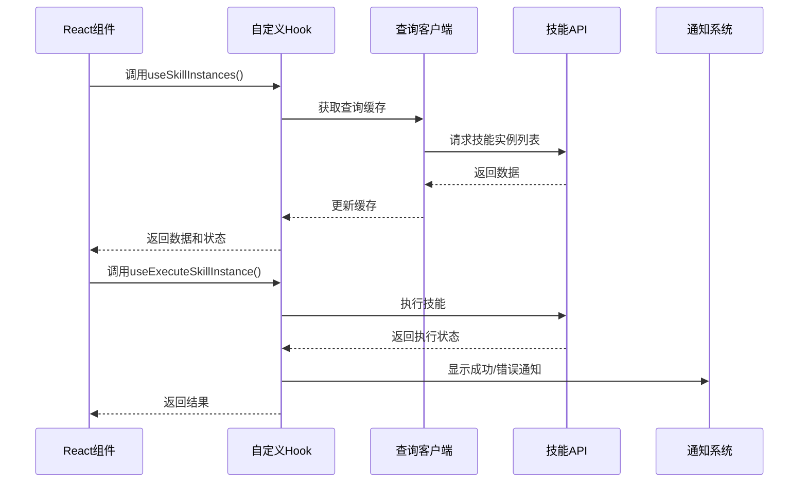

**图表来源**
- [frontend/src/lib/hooks/use-skills.ts](file://frontend/src/lib/hooks/use-skills.ts#L106-L128)

**章节来源**
- [frontend/src/app/(dashboard)/skills/page.tsx](file://frontend/src/app/(dashboard)/skills/page.tsx#L1-L189)
- [frontend/src/lib/hooks/use-skills.ts](file://frontend/src/lib/hooks/use-skills.ts#L1-L212)

## 性能优化建议

### 技能执行优化

1. **并发执行控制** - 使用异步执行避免阻塞
2. **缓存机制** - 对频繁访问的数据建立缓存
3. **批量处理** - 支持批量技能执行减少API调用
4. **资源管理** - 合理管理AI模型资源使用

### 数据库优化

1. **索引优化** - 为常用查询字段建立索引
2. **查询优化** - 使用分页和条件过滤减少数据传输
3. **连接池** - 使用连接池管理数据库连接
4. **数据归档** - 定期归档历史执行记录

### 前端性能

1. **懒加载** - 技能详情页面按需加载
2. **虚拟滚动** - 大列表使用虚拟滚动优化渲染
3. **状态缓存** - 使用React Query缓存API响应
4. **增量更新** - 实时更新技能状态而不刷新整个页面

## 故障排除指南

### 常见问题诊断

1. **技能执行失败**
   - 检查技能参数配置
   - 查看执行日志获取详细错误信息
   - 验证AI模型可用性和配置

2. **调度器异常**
   - 确认调度器服务状态
   - 检查Cron表达式格式
   - 验证数据库连接

3. **前端界面问题**
   - 检查网络连接和API可达性
   - 清除浏览器缓存重新加载
   - 查看浏览器开发者工具控制台

### 错误处理机制

系统提供完善的错误处理和恢复机制：

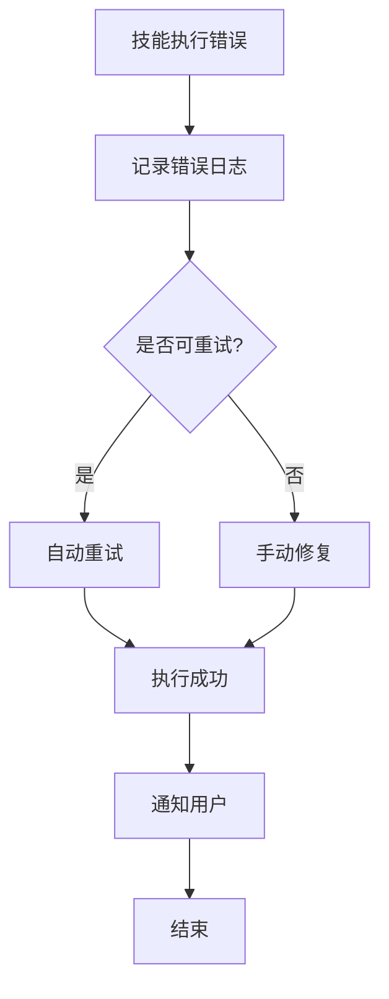

**章节来源**
- [open_notebook/skills/runner.py](file://open_notebook/skills/runner.py#L133-L149)
- [open_notebook/skills/scheduler.py](file://open_notebook/skills/scheduler.py#L57-L68)

## 总结

Vikki内容运营技能系统通过模块化的技能架构，为内容创作者提供了完整的从痛点识别到内容生成的自动化解决方案。系统的核心优势包括：

1. **高度模块化** - 每个技能独立开发、独立部署、独立使用
2. **智能内容策略** - 基于四象限理论的内容策略优化
3. **自动化执行** - 支持手动执行和定时调度两种模式
4. **可视化管理** - 直观的前端界面便于技能配置和监控
5. **可扩展性** - 支持自定义技能开发和第三方集成

**更新亮点**
- **新增8个中国平台支持**：小红书、即刻、微信公众号、微信视频号、知乎、抖音、微博、小宇宙，满足本土化内容运营需求
- **新增中文内容风格**：种草(zhongcao)、干货(ganhuo)、故事(gushi)，提供更贴近本土用户的表达方式
- **更新默认平台选择**：从海外平台转向中文平台，提高本土化适配效果
- **增强平台特定功能**：支持更多平台特有功能，如封面建议、关键词优化、话题标签等

该系统特别适合内容创作者、营销人员和OPC团队使用，能够显著提升内容运营效率和ROI。通过合理的技能组合和配置，用户可以构建个性化的智能内容运营工作流。