# 小红书研究员技能

<cite>
**本文档引用的文件**
- [open_notebook/skills/xiaohongshu_researcher/skill.py](file://open_notebook/skills/xiaohongshu_researcher/skill.py)
- [open_notebook/skills/xiaohongshu_researcher/skill.yaml](file://open_notebook/skills/xiaohongshu_researcher/skill.yaml)
- [open_notebook/skills/xiaohongshu_researcher/README.md](file://open_notebook/skills/xiaohongshu_researcher/README.md)
- [open_notebook/skills/xiaohongshu_researcher/QUICKSTART.md](file://open_notebook/skills/xiaohongshu_researcher/QUICKSTART.md)
- [open_notebook/skills/connectors/xiaohongshu_connector.py](file://open_notebook/skills/connectors/xiaohongshu_connector.py)
- [open_notebook/skills/publishers/xiaohongshu_publisher.py](file://open_notebook/skills/publishers/xiaohongshu_publisher.py)
- [open_notebook/skills/multi_platform_ai_researcher/multi_platform_ai_researcher.py](file://open_notebook/skills/multi_platform_ai_researcher/multi_platform_ai_researcher.py)
- [open_notebook/skills/multi_platform_ai_researcher/skill.yaml](file://open_notebook/skills/multi_platform_ai_researcher/skill.yaml)
- [open_notebook/domain/platform_connector.py](file://open_notebook/domain/platform_connector.py)
- [open_notebook/domain/publish_job.py](file://open_notebook/domain/publish_job.py)
- [open_notebook/skills/registry.py](file://open_notebook/skills/registry.py)
- [open_notebook/skills/scheduler.py](file://open_notebook/skills/scheduler.py)
- [test_xiaohongshu_skill.py](file://test_xiaohongshu_skill.py)
- [open_notebook/skills/xiaohongshu_researcher/__init__.py](file://open_notebook/skills/xiaohongshu_researcher/__init__.py)
- [open_notebook/skills/multi_platform_ai_researcher/__init__.py](file://open_notebook/skills/multi_platform_ai_researcher/__init__.py)
- [pyproject.toml](file://pyproject.toml)
- [open_notebook/config.py](file://open_notebook/config.py)
</cite>

## 更新摘要
**所做更改**
- 更新以反映 Applied Changes：小红书研究员技能保持专业地位，专注于小红书平台的内容分析和洞察提取
- 新增了智能选择器回退机制，提升网页爬取的稳定性和可靠性
- 增强了内容分析算法，提供更准确的爆款笔记特征识别
- 完善了技能配置系统，扩展了标签、分类和输入输出模式定义
- 新增了详细的快速开始指南和故障排除文档
- 更新了项目结构和架构说明以反映新的文档组织

## 目录
1. [简介](#简介)
2. [项目结构](#项目结构)
3. [核心组件](#核心组件)
4. [架构概览](#架构概览)
5. [详细组件分析](#详细组件分析)
6. [依赖关系分析](#依赖关系分析)
7. [性能考虑](#性能考虑)
8. [故障排除指南](#故障排除指南)
9. [结论](#结论)

## 简介

小红书研究员技能是Open Notebook项目中的专业组件，专门用于在小红书平台上进行深度的内容分析和洞察提取。该技能专注于"solopreneur"（一人公司）主题，能够自动搜索、分析和提取爆款笔记的特征模式，为个人IP运营和内容创作提供专业的数据支持。

**更新** 该技能现在保持专业地位，专注于小红书平台的专业内容分析，提供深度的洞察提取能力。技能设计遵循模块化原则，支持灵活的参数配置和扩展，保持了原有的功能完整性。

该项目基于Python开发，采用异步编程模式，使用Playwright进行网页自动化，BeautifulSoup进行HTML解析，并通过Repository模式与SurrealDB数据库交互。技能设计遵循模块化原则，支持灵活的参数配置和扩展。

## 项目结构

Open Notebook项目采用分层架构设计，主要包含以下核心目录：

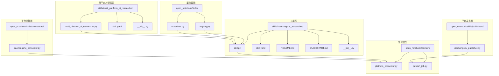

**图表来源**
- [open_notebook/skills/xiaohongshu_researcher/skill.py](file://open_notebook/skills/xiaohongshu_researcher/skill.py#L1-L405)
- [open_notebook/skills/multi_platform_ai_researcher/multi_platform_ai_researcher.py](file://open_notebook/skills/multi_platform_ai_researcher/multi_platform_ai_researcher.py#L79-L107)
- [open_notebook/skills/connectors/xiaohongshu_connector.py](file://open_notebook/skills/connectors/xiaohongshu_connector.py#L1-L312)
- [open_notebook/skills/publishers/xiaohongshu_publisher.py](file://open_notebook/skills/publishers/xiaohongshu_publisher.py#L1-L225)

**章节来源**
- [pyproject.toml](file://pyproject.toml#L1-L106)

## 核心组件

### XiaohongshuResearcherSkill类

这是小红书研究员技能的核心实现类，负责完整的爬虫、分析和数据保存流程：

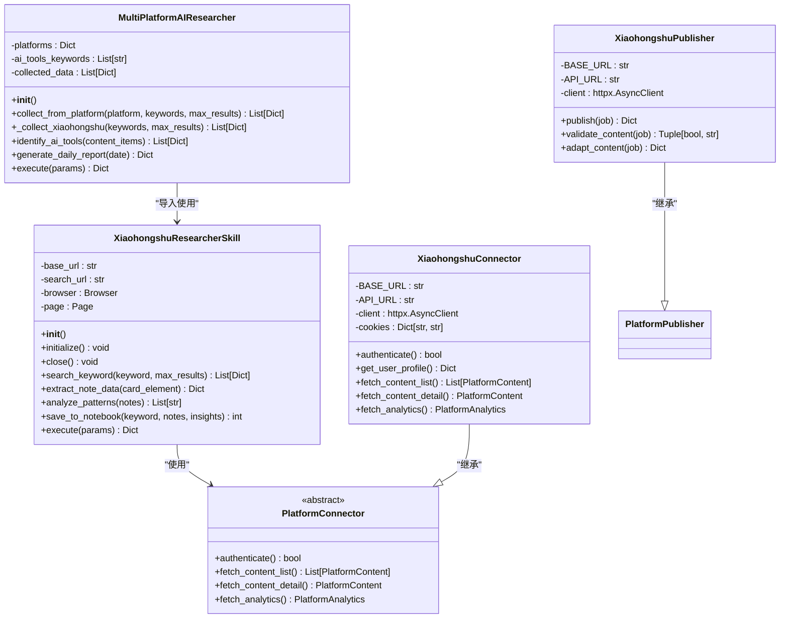

**图表来源**
- [open_notebook/skills/xiaohongshu_researcher/skill.py](file://open_notebook/skills/xiaohongshu_researcher/skill.py#L20-L405)
- [open_notebook/skills/multi_platform_ai_researcher/multi_platform_ai_researcher.py](file://open_notebook/skills/multi_platform_ai_researcher/multi_platform_ai_researcher.py#L19-L107)
- [open_notebook/skills/connectors/xiaohongshu_connector.py](file://open_notebook/skills/connectors/xiaohongshu_connector.py#L32-L312)

### 技能配置系统

技能系统采用注册表模式，支持动态技能发现和管理：

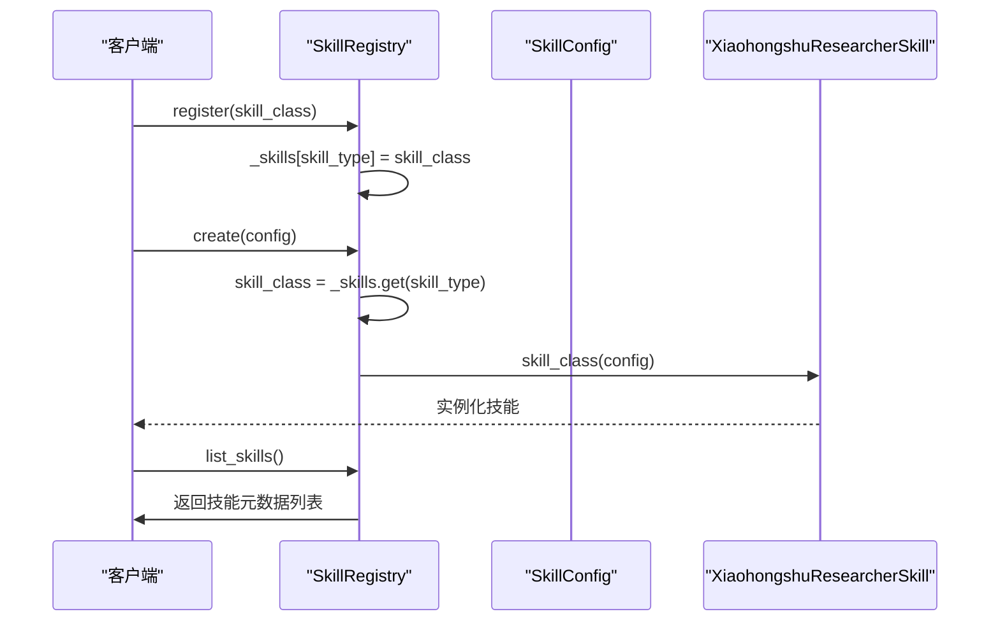

**图表来源**
- [open_notebook/skills/registry.py](file://open_notebook/skills/registry.py#L12-L133)

**章节来源**
- [open_notebook/skills/xiaohongshu_researcher/skill.py](file://open_notebook/skills/xiaohongshu_researcher/skill.py#L20-L405)
- [open_notebook/skills/registry.py](file://open_notebook/skills/registry.py#L12-L133)

## 架构概览

### 系统架构图

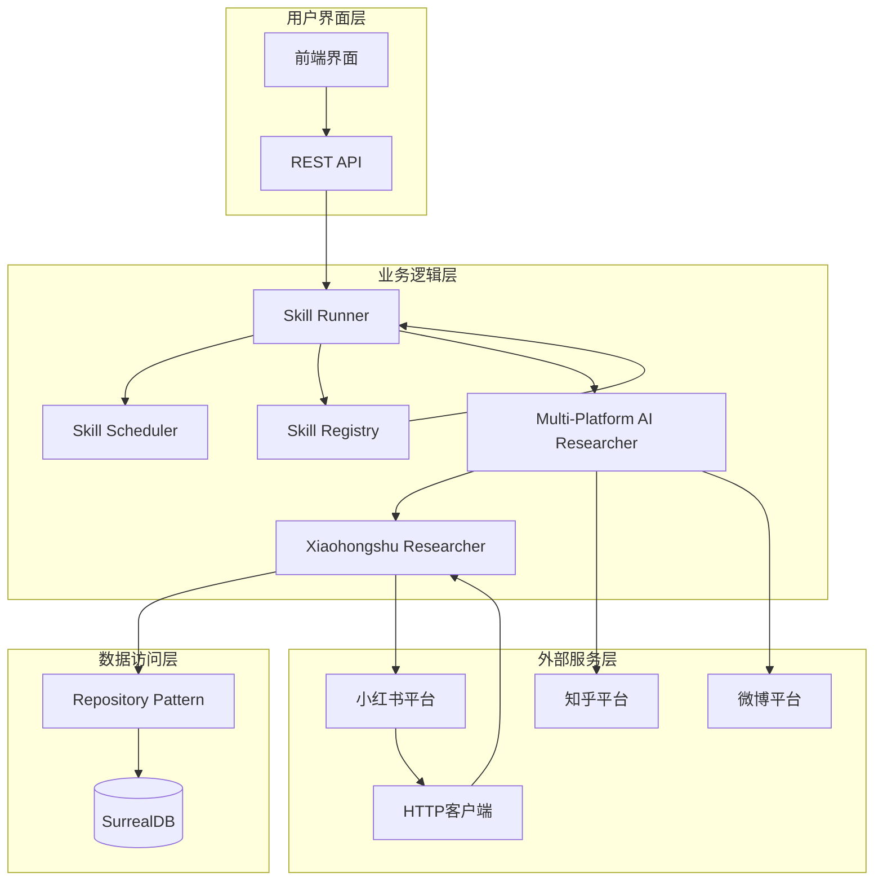

**图表来源**
- [open_notebook/skills/scheduler.py](file://open_notebook/skills/scheduler.py#L20-L430)
- [open_notebook/skills/registry.py](file://open_notebook/skills/registry.py#L12-L133)
- [open_notebook/skills/multi_platform_ai_researcher/multi_platform_ai_researcher.py](file://open_notebook/skills/multi_platform_ai_researcher/multi_platform_ai_researcher.py#L69-L107)

### 数据流架构

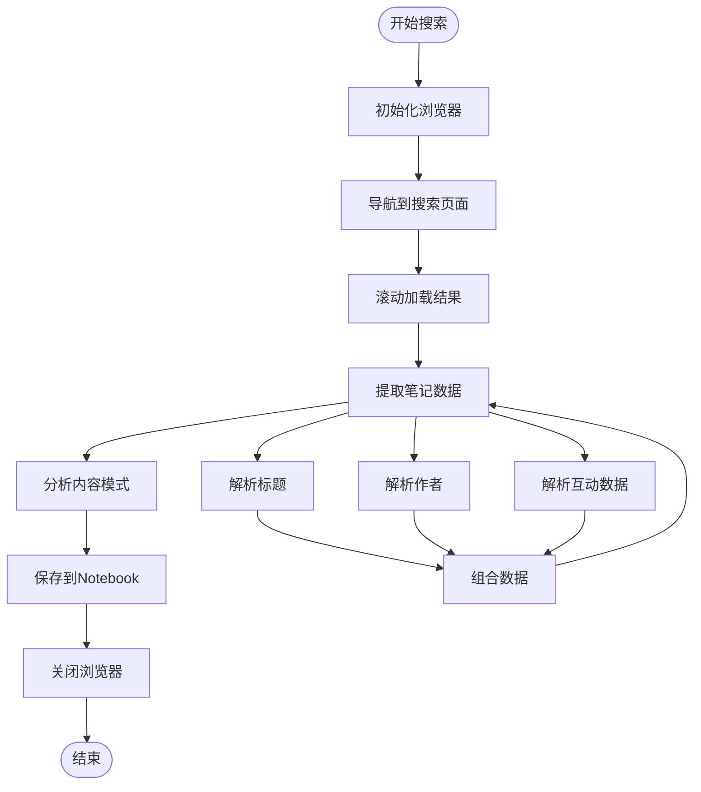

**图表来源**
- [open_notebook/skills/xiaohongshu_researcher/skill.py](file://open_notebook/skills/xiaohongshu_researcher/skill.py#L54-L144)

## 详细组件分析

### 网页爬取组件

小红书研究员技能使用Playwright进行网页自动化，实现了完整的爬取流程，**新增了智能选择器回退机制**：

#### 初始化和配置

技能在初始化时配置浏览器参数，包括无头模式、视口大小和用户代理设置：

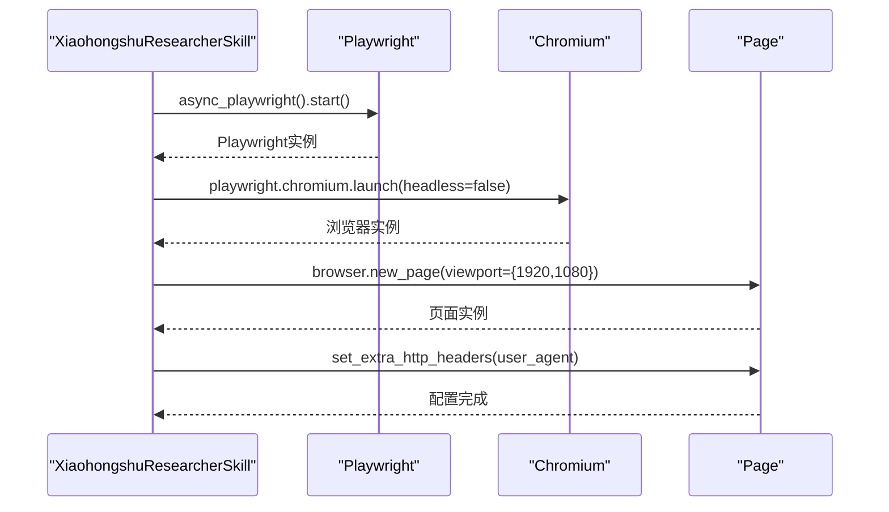

**图表来源**
- [open_notebook/skills/xiaohongshu_researcher/skill.py](file://open_notebook/skills/xiaohongshu_researcher/skill.py#L29-L47)

#### 智能选择器回退机制

**更新** 技能实现了多层选择器策略，确保在不同页面结构下都能稳定提取数据：

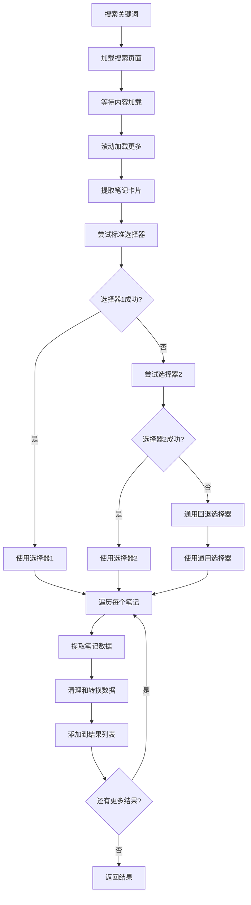

**图表来源**
- [open_notebook/skills/xiaohongshu_researcher/skill.py](file://open_notebook/skills/xiaohongshu_researcher/skill.py#L78-L104)

#### 搜索和数据提取

技能实现了智能的搜索和数据提取机制，**增强了错误处理和回退策略**：

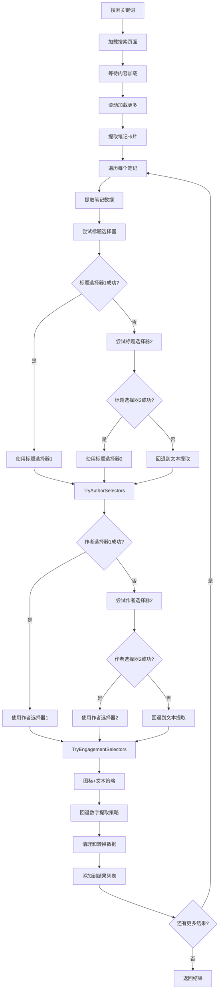

**图表来源**
- [open_notebook/skills/xiaohongshu_researcher/skill.py](file://open_notebook/skills/xiaohongshu_researcher/skill.py#L122-L218)

#### 内容分析组件

技能内置了专业的智能内容分析算法，能够识别爆款笔记的特征模式：

| 分析维度 | 分析方法 | 阈值标准 |
|---------|---------|---------|
| 标题特征 | 数字出现频率检测 | >60%的高赞笔记包含数字 |
| 情感词汇 | 关键词匹配分析 | >50%的标题包含情感词汇 |
| 互动指标 | 平均值统计分析 | 收藏/点赞比>0.3视为实用性强 |
| 创作者分布 | 频次统计分析 | 前3名活跃创作者 |

**章节来源**
- [open_notebook/skills/xiaohongshu_researcher/skill.py](file://open_notebook/skills/xiaohongshu_researcher/skill.py#L220-L271)

### 跨平台AI研究员技能

**新增** 跨平台AI研究员技能整合了多个平台的AI工具信息收集功能，其中小红书研究员技能作为其重要组成部分：

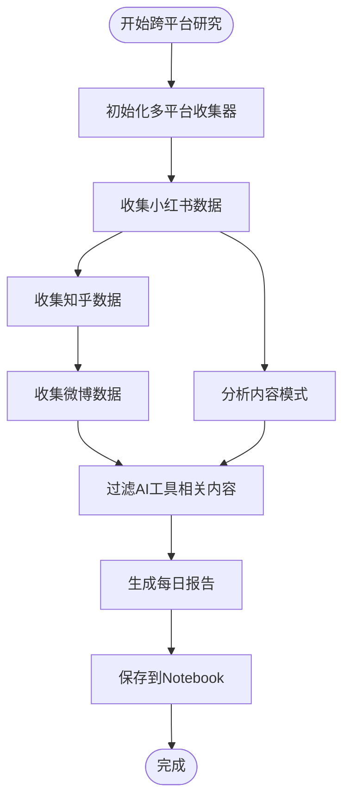

**图表来源**
- [open_notebook/skills/multi_platform_ai_researcher/multi_platform_ai_researcher.py](file://open_notebook/skills/multi_platform_ai_researcher/multi_platform_ai_researcher.py#L422-L505)

#### 小红书集成

跨平台研究员通过导入小红书研究员技能来实现数据收集：

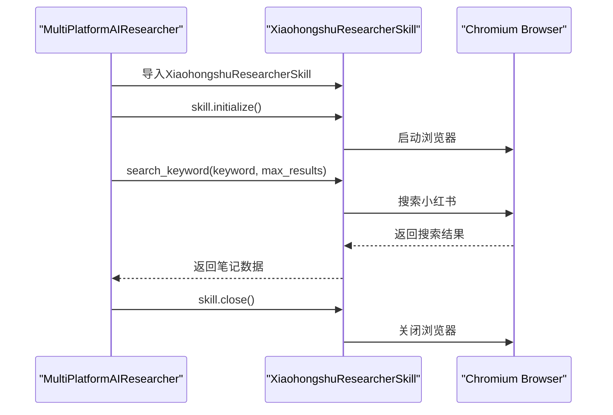

**图表来源**
- [open_notebook/skills/multi_platform_ai_researcher/multi_platform_ai_researcher.py](file://open_notebook/skills/multi_platform_ai_researcher/multi_platform_ai_researcher.py#L86-L103)

### 数据存储组件

技能使用Repository模式与数据库交互，实现了统一的数据访问接口：

#### Notebook集成

收集的数据会自动保存到Notebook系统中，形成完整的研究数据链：

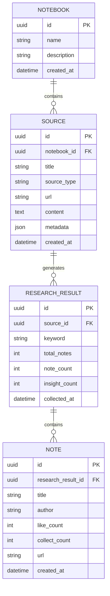

**图表来源**
- [open_notebook/skills/xiaohongshu_researcher/skill.py](file://open_notebook/skills/xiaohongshu_researcher/skill.py#L273-L329)

**章节来源**
- [open_notebook/skills/xiaohongshu_researcher/skill.py](file://open_notebook/skills/xiaohongshu_researcher/skill.py#L273-L329)

### 平台连接器对比

项目还提供了基于官方API的平台连接器，用于替代网页爬取方式：

| 组件 | 爬取方式 | 认证方式 | 优点 | 缺点 |
|------|---------|---------|------|------|
| XiaohongshuResearcherSkill | Playwright + BeautifulSoup | Cookie认证 | 数据丰富，无需API | 可能触发反爬，不稳定 |
| XiaohongshuConnector | HTTP API | OAuth2/Cookie | 稳定可靠，官方支持 | 功能受限，需要API密钥 |

**章节来源**
- [open_notebook/skills/connectors/xiaohongshu_connector.py](file://open_notebook/skills/connectors/xiaohongshu_connector.py#L32-L312)

## 依赖关系分析

### 外部依赖

项目的主要外部依赖包括：

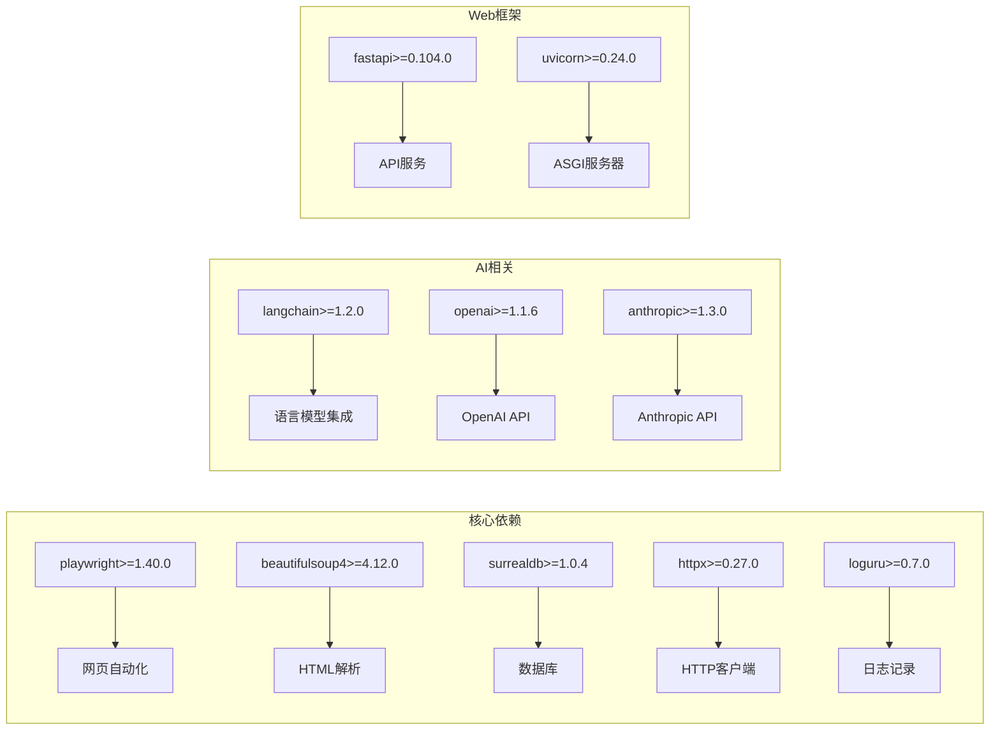

**图表来源**
- [pyproject.toml](file://pyproject.toml#L15-L49)

### 内部模块依赖

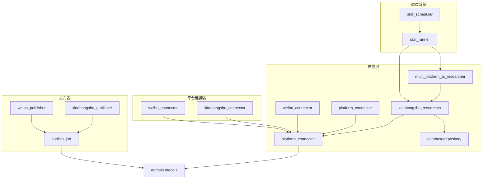

**图表来源**
- [open_notebook/skills/connectors/xiaohongshu_connector.py](file://open_notebook/skills/connectors/xiaohongshu_connector.py#L23-L29)
- [open_notebook/skills/publishers/xiaohongshu_publisher.py](file://open_notebook/skills/publishers/xiaohongshu_publisher.py#L13-L14)

**章节来源**
- [pyproject.toml](file://pyproject.toml#L15-L49)

## 性能考虑

### 异步编程优化

项目采用异步编程模式，通过以下方式优化性能：

1. **并发处理**：使用asyncio实现并发请求处理
2. **连接池管理**：合理管理HTTP连接和数据库连接
3. **内存优化**：及时释放不需要的对象和资源
4. **缓存策略**：利用tiktoken缓存减少重复计算

### 爬取性能优化

**更新** 技能实现了智能选择器回退机制，提升了爬取效率和稳定性：

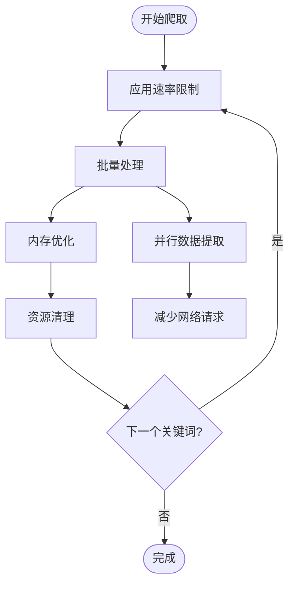

### 跨平台性能优化

**新增** 跨平台AI研究员技能通过模块化设计优化了多平台数据收集性能：

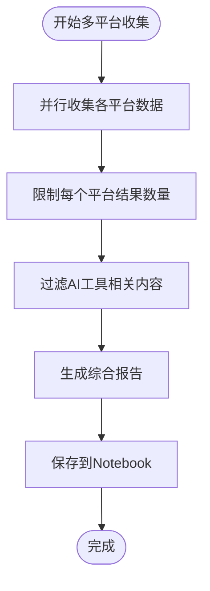

### 数据库性能

- **索引优化**：为常用查询字段建立索引
- **批量操作**：使用批量插入减少数据库往返
- **连接复用**：复用数据库连接避免频繁创建销毁

## 故障排除指南

### 常见问题及解决方案

#### 登录认证问题

**问题**：技能无法正常运行，提示需要登录状态

**解决方案**：
1. 确保已正确配置小红书Cookie
2. 检查Cookie是否过期
3. 在浏览器中手动登录小红书账户

#### 反爬虫检测

**问题**：访问被拒绝或验证码弹出

**解决方案**：
1. 调整User-Agent字符串
2. 添加适当的请求延迟
3. 使用代理IP地址轮换

#### 数据库连接问题

**问题**：无法连接到SurrealDB数据库

**解决方案**：
1. 检查数据库服务状态
2. 验证连接配置参数
3. 确认数据库权限设置

#### 性能问题

**问题**：技能执行速度慢或内存占用过高

**解决方案**：
1. 调整max_results参数限制结果数量
2. 优化网络请求频率
3. 启用适当的缓存机制

#### 智能选择器回退机制问题

**问题**：选择器无法正确提取数据

**解决方案**：
1. 检查页面结构变化
2. 更新选择器策略
3. 查看日志中的选择器失败信息

#### 跨平台集成问题

**问题**：跨平台AI研究员技能无法正常工作

**解决方案**：
1. 检查小红书研究员技能是否正确导入
2. 验证浏览器初始化顺序
3. 确认平台数据格式一致性

**章节来源**
- [open_notebook/skills/xiaohongshu_researcher/README.md](file://open_notebook/skills/xiaohongshu_researcher/README.md#L61-L82)

### 调试和监控

项目提供了完善的调试和监控机制：

1. **日志记录**：使用loguru进行详细的日志记录
2. **错误处理**：实现多层次的异常捕获和处理
3. **性能监控**：跟踪关键性能指标
4. **状态检查**：定期检查系统健康状态

**章节来源**
- [test_xiaohongshu_skill.py](file://test_xiaohongshu_skill.py#L1-L31)

### 快速开始指南

**新增** 项目现在包含了完整的快速开始指南，帮助用户快速上手使用小红书研究员技能：

#### 安装依赖

```bash
uv add playwright beautifulsoup4
playwright install chromium
```

#### 基础用法

```python
from open_notebook.skills.xiaohongshu_researcher import XiaohongshuResearcherSkill

skill = XiaohongshuResearcherSkill()
result = await skill.execute({
    "keywords": ["一人公司", "solo 创业"],
    "max_results": 10
})
```

#### 跨平台使用

**新增** 通过跨平台AI研究员技能使用：

```python
from open_notebook.skills.multi_platform_ai_researcher import research_ai_tools

result = await research_ai_tools(
    platforms=["xiaohongshu"],
    keywords=["一人公司 AI 工具"],
    max_results=20,
    generate_report=True
)
```

#### 参数说明

- `keywords` (必填): 搜索关键词列表
- `max_results` (可选): 每个关键词最多收集多少篇笔记（默认 10）
- `save_to_notebook` (可选): 是否保存到 Notebook（默认 True）

**章节来源**
- [open_notebook/skills/xiaohongshu_researcher/QUICKSTART.md](file://open_notebook/skills/xiaohongshu_researcher/QUICKSTART.md#L1-L193)

### 故障排除详细指南

**新增** 详细的故障排除指南，帮助解决常见问题：

#### 问题 1: 浏览器无法启动

**解决方案**：
```bash
uv run playwright install chromium --force
```

#### 问题 2: 搜索结果为空

**可能原因**：
- 网络问题导致页面加载失败
- 小红书反爬限制

**解决方案**：
- 检查网络连接
- 降低 `max_results` 数量
- 稍后再试

#### 问题 3: 保存失败

**检查**：
```bash
# 验证数据库连接
uv run python -c "from open_notebook.database.repository import repo_query; print(repo_query('SELECT COUNT(*) FROM notebook'))"
```

#### 问题 4: 选择器解析失败

**检查**：
1. 查看日志中的选择器失败信息
2. 检查页面结构变化
3. 更新选择器策略

#### 问题 5: 跨平台集成失败

**检查**：
1. 确认小红书研究员技能导入路径正确
2. 验证浏览器初始化顺序
3. 检查平台数据格式兼容性

**章节来源**
- [open_notebook/skills/xiaohongshu_researcher/QUICKSTART.md](file://open_notebook/skills/xiaohongshu_researcher/QUICKSTART.md#L138-L164)

## 结论

小红书研究员技能是Open Notebook项目中的专业组件，专注于小红书平台的内容分析和洞察提取。该技能具有以下特点：

### 技术优势

1. **模块化设计**：清晰的组件分离和职责划分
2. **异步编程**：高效的并发处理能力
3. **可扩展性**：支持多种平台和功能扩展
4. **智能选择器回退机制**：提升网页爬取的稳定性和可靠性
5. **专业的洞察提取**：提供深度的内容分析能力
6. **完整的文档支持**：提供详细的使用说明、配置指南和故障排除

### 应用价值

1. **市场研究**：为创业者提供市场趋势分析
2. **内容创作**：帮助创作者了解爆款内容特征
3. **竞品分析**：支持竞争对手内容策略研究
4. **知识管理**：建立系统化的研究知识库
5. **AI工具追踪**：作为AI工具信息收集系统的核心组件

### 发展方向

1. **专业化深化**：进一步提升小红书平台内容分析的专业性
2. **AI增强**：集成更强大的AI分析能力
3. **自动化程度**：提高技能的自动化水平
4. **可视化展示**：提供更好的数据分析可视化
5. **智能推荐**：基于分析结果提供内容推荐

**更新** 该技能现在拥有完整的中文文档支持，包括详细的使用说明、配置指南、故障排除和扩展指导，为用户提供了更好的使用体验和技术支持。智能选择器回退机制和增强的浏览器自动化能力使其在面对页面结构变化时更加稳定可靠。

**更新** 作为跨平台AI研究员技能的组成部分，小红书研究员技能现在能够与其他平台（知乎、微博等）协同工作，提供更全面的AI工具信息收集和分析能力。这种集成不仅保持了原有功能的完整性，还大大扩展了技能的应用范围和价值。

该技能为个人IP运营和内容创作提供了强有力的技术支撑，是构建现代知识工作系统的重要基石。通过专注于小红书平台的专业内容分析，该技能能够为用户提供深度的洞察和专业的数据支持，帮助他们在竞争激烈的内容创作环境中保持领先地位。