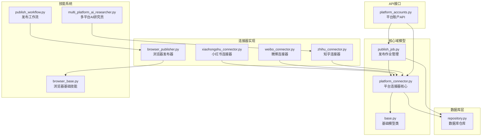
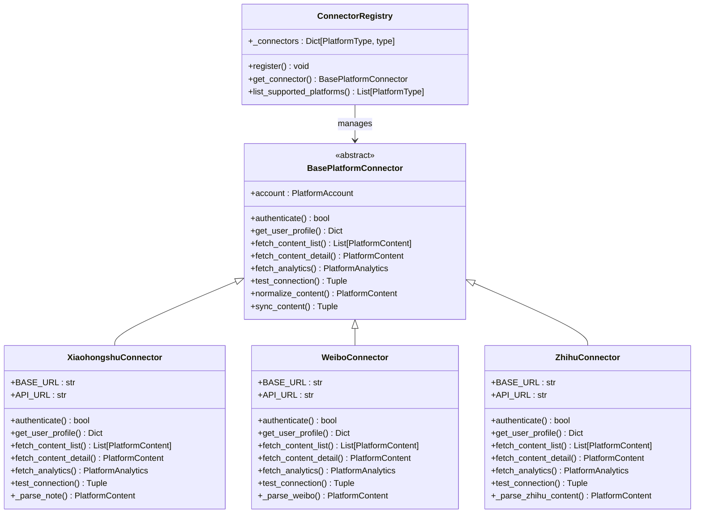
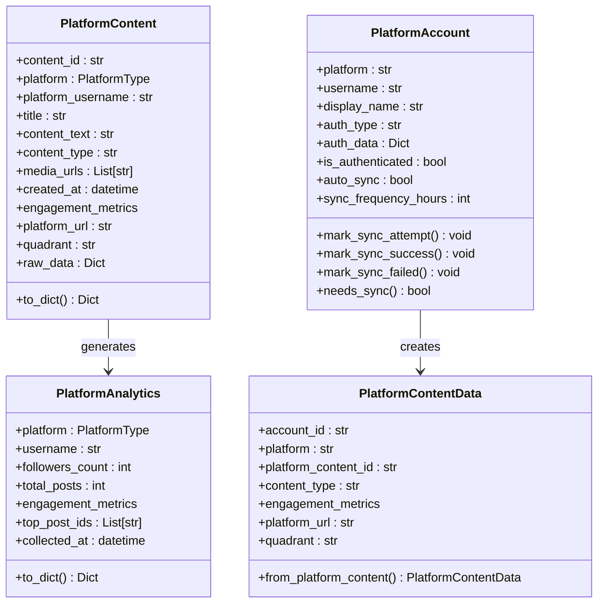
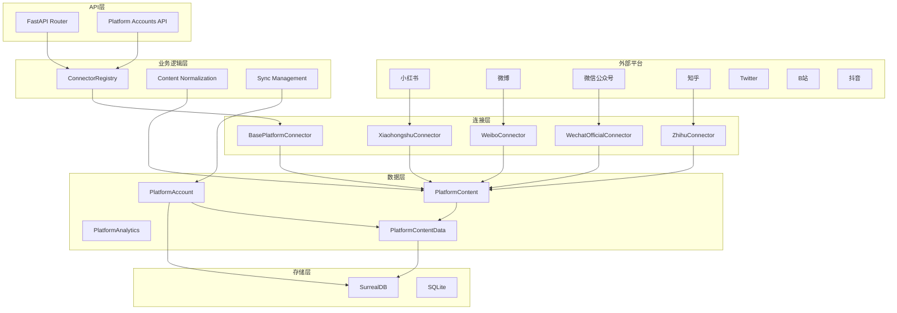
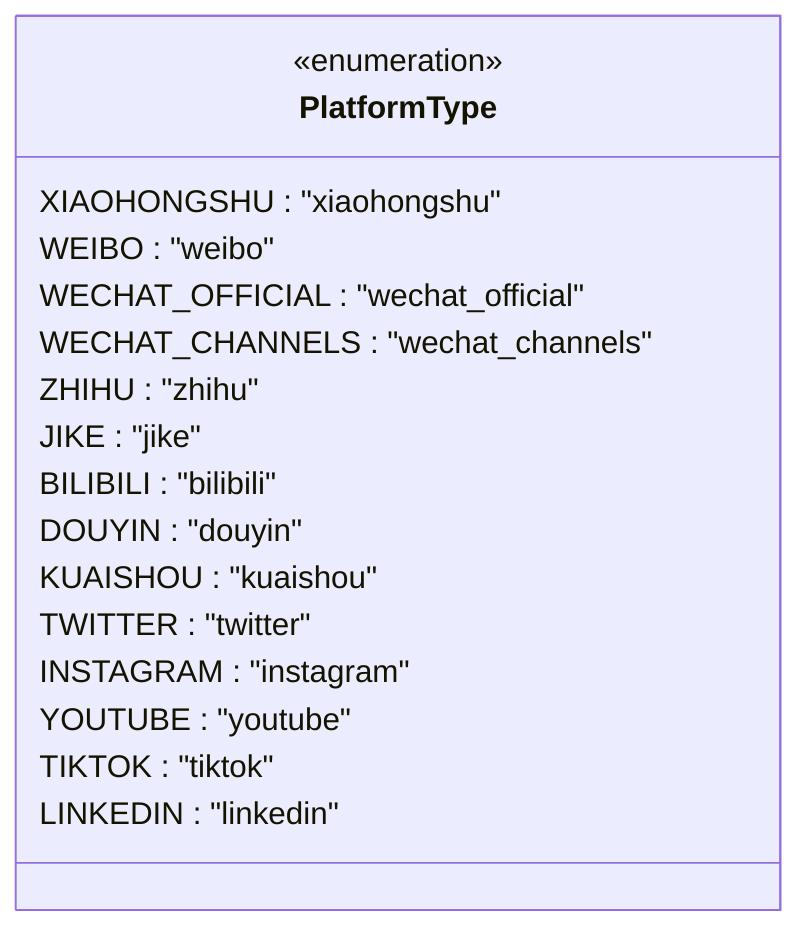
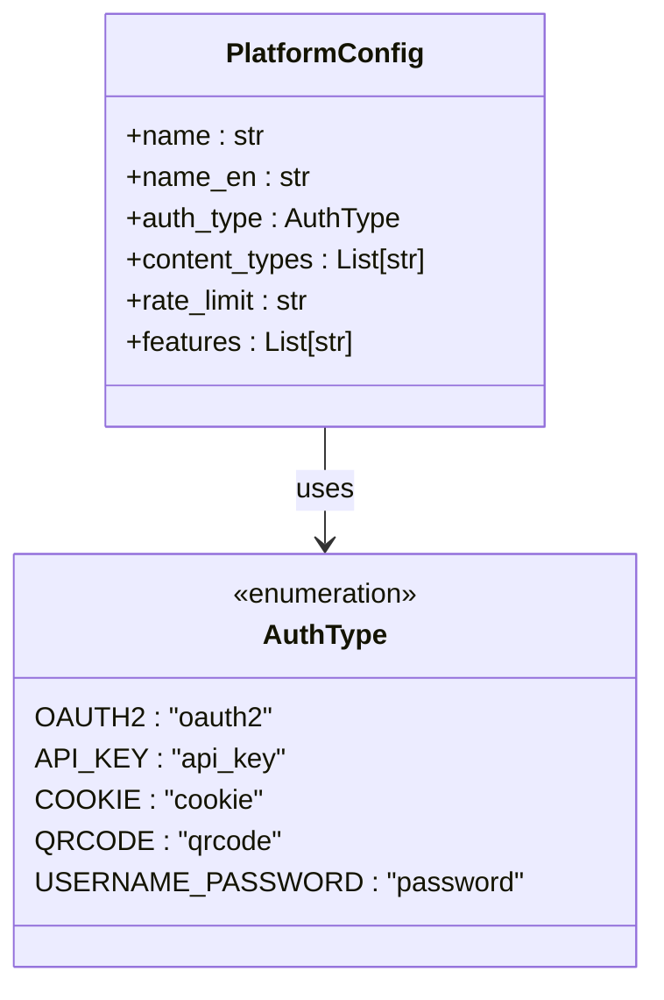
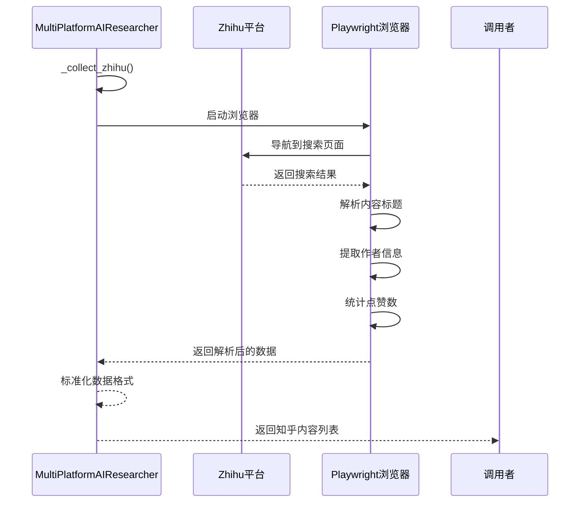
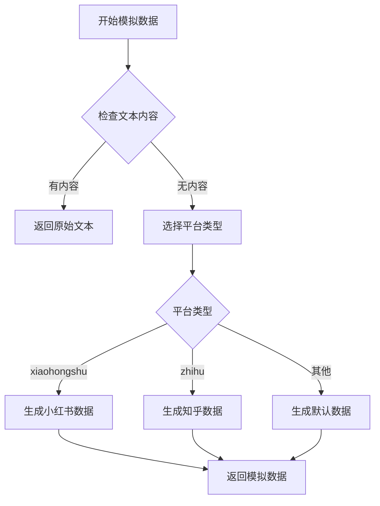
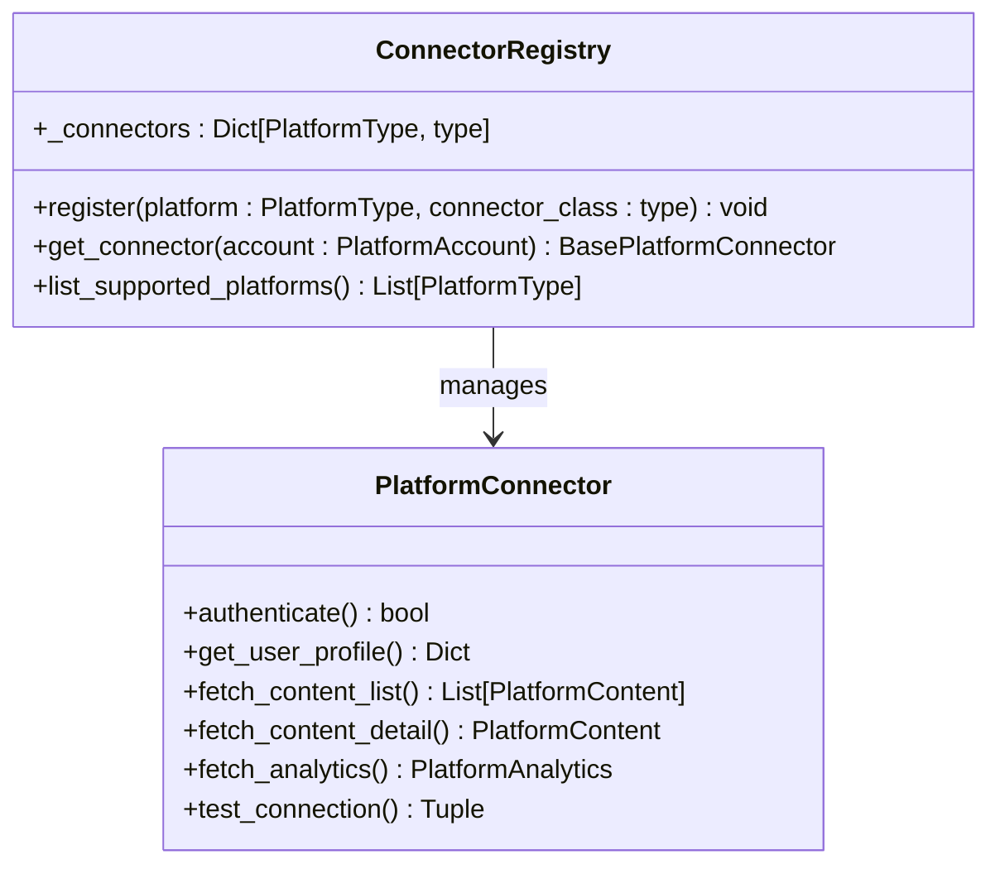
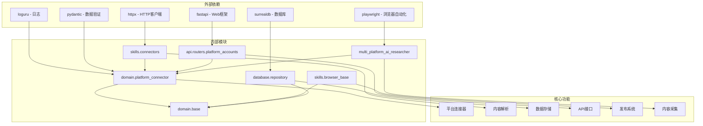

# 平台连接器系统

<cite>
**本文档引用的文件**
- [platform_connector.py](file://open_notebook/domain/platform_connector.py)
- [weibo_connector.py](file://open_notebook/skills/connectors/weibo_connector.py)
- [xiaohongshu_connector.py](file://open_notebook/skills/connectors/xiaohongshu_connector.py)
- [browser_base.py](file://open_notebook/skills/browser_base.py)
- [publish_workflow.py](file://open_notebook/skills/publish_workflow.py)
- [browser_publisher.py](file://open_notebook/skills/browser_publisher.py)
- [base.py](file://open_notebook/domain/base.py)
- [publish_job.py](file://open_notebook/domain/publish_job.py)
- [repository.py](file://open_notebook/database/repository.py)
- [platform_accounts.py](file://api/routers/platform_accounts.py)
- [multi_platform_ai_researcher.py](file://open_notebook/skills/multi_platform_ai_researcher/multi_platform_ai_researcher.py)
- [p0_agents.py](file://open_notebook/skills/p0_agents.py)
- [connectors_init.py](file://open_notebook/skills/connectors/__init__.py)
</cite>

## 更新摘要
**所做更改**
- 新增了对知乎平台连接器的架构支持和配置
- 更新了平台连接器注册系统以支持更多平台类型
- 增强了多平台AI研究员对知乎内容的采集能力
- 完善了平台配置管理和认证方式支持

## 目录
1. [简介](#简介)
2. [项目结构](#项目结构)
3. [核心组件](#核心组件)
4. [架构概览](#架构概览)
5. [详细组件分析](#详细组件分析)
6. [依赖关系分析](#依赖关系分析)
7. [性能考虑](#性能考虑)
8. [故障排除指南](#故障排除指南)
9. [结论](#结论)

## 简介

平台连接器系统是Open Notebook项目中的核心模块，负责连接和管理各种社交媒体平台（如小红书、微博、微信公众号、知乎等），实现内容同步、数据分析和自动化发布功能。该系统采用模块化设计，支持多种认证方式和平台类型，为个人IP运营提供完整的数据采集和分发解决方案。

**更新** 系统现已重构为更加模块化的架构，支持包括知乎在内的多种平台认证和数据获取，增强了平台扩展性和兼容性。

## 项目结构

平台连接器系统主要分布在以下目录中：

**图表来源**
- [platform_connector.py](file://open_notebook/domain/platform_connector.py#L1-L500)
- [base.py](file://open_notebook/domain/base.py#L31-L329)
- [publish_job.py](file://open_notebook/domain/publish_job.py#L52-L482)

**章节来源**
- [platform_connector.py](file://open_notebook/domain/platform_connector.py#L1-L500)
- [base.py](file://open_notebook/domain/base.py#L31-L329)
- [publish_job.py](file://open_notebook/domain/publish_job.py#L52-L482)

## 核心组件

### 平台连接器架构

平台连接器系统采用抽象工厂模式，通过统一的接口适配不同的社交平台：

**图表来源**
- [platform_connector.py](file://open_notebook/domain/platform_connector.py#L315-L418)
- [xiaohongshu_connector.py](file://open_notebook/skills/connectors/xiaohongshu_connector.py#L32-L312)
- [weibo_connector.py](file://open_notebook/skills/connectors/weibo_connector.py#L25-L332)

### 数据模型设计

系统使用标准化的数据模型来处理不同平台的内容：

**图表来源**
- [platform_connector.py](file://open_notebook/domain/platform_connector.py#L68-L312)

**章节来源**
- [platform_connector.py](file://open_notebook/domain/platform_connector.py#L68-L312)

## 架构概览

平台连接器系统采用分层架构设计，实现了完整的数据采集、处理和发布的闭环：

**图表来源**
- [platform_connector.py](file://open_notebook/domain/platform_connector.py#L315-L418)
- [platform_accounts.py](file://api/routers/platform_accounts.py#L89-L142)

## 详细组件分析

### 平台类型扩展

系统现已支持包括知乎在内的多种平台类型：

**图表来源**
- [platform_connector.py](file://open_notebook/domain/platform_connector.py#L32-L48)

### 平台配置管理

系统为每个平台提供详细的配置信息，包括认证方式、内容类型和速率限制：

**图表来源**
- [platform_connector.py](file://open_notebook/domain/platform_connector.py#L420-L494)

**章节来源**
- [platform_connector.py](file://open_notebook/domain/platform_connector.py#L32-L494)

### 多平台AI研究员集成

多平台AI研究员现在支持从知乎平台采集内容：

**图表来源**
- [multi_platform_ai_researcher.py](file://open_notebook/skills/multi_platform_ai_researcher/multi_platform_ai_researcher.py#L115-L209)

**章节来源**
- [multi_platform_ai_researcher.py](file://open_notebook/skills/multi_platform_ai_researcher/multi_platform_ai_researcher.py#L115-L209)

### 模拟数据支持

P0代理现在支持模拟知乎数据生成，用于开发和测试：

**图表来源**
- [p0_agents.py](file://open_notebook/skills/p0_agents.py#L327-L336)

**章节来源**
- [p0_agents.py](file://open_notebook/skills/p0_agents.py#L327-L336)

### 连接器注册系统

连接器注册系统现在支持更多平台类型的动态注册：

**图表来源**
- [platform_connector.py](file://open_notebook/domain/platform_connector.py#L395-L418)

**章节来源**
- [platform_connector.py](file://open_notebook/domain/platform_connector.py#L395-L418)

## 依赖关系分析

平台连接器系统的依赖关系呈现清晰的层次结构：

**图表来源**
- [platform_connector.py](file://open_notebook/domain/platform_connector.py#L18-L27)
- [repository.py](file://open_notebook/database/repository.py#L1-L10)

系统的关键依赖特性：
- **异步架构**：全面使用async/await模式
- **类型安全**：严格的类型注解和验证
- **错误处理**：完善的异常捕获和恢复机制
- **配置管理**：灵活的环境变量配置

**章节来源**
- [platform_connector.py](file://open_notebook/domain/platform_connector.py#L18-L27)
- [repository.py](file://open_notebook/database/repository.py#L1-L195)

## 性能考虑

平台连接器系统在设计时充分考虑了性能优化：

### 并发处理
- **异步HTTP请求**：使用httpx异步客户端减少I/O等待
- **批量操作**：支持批量内容同步和发布
- **连接池管理**：合理管理HTTP连接避免资源浪费

### 缓存策略
- **认证缓存**：缓存有效的认证状态减少重复验证
- **内容缓存**：避免重复抓取相同内容
- **配置缓存**：缓存平台配置信息

### 错误恢复
- **指数退避**：网络错误时采用指数退避重试
- **超时控制**：合理的请求超时设置
- **断路器模式**：防止级联故障

## 故障排除指南

### 常见问题及解决方案

#### 认证失败
**症状**：连接平台时提示认证失败
**可能原因**：
- Cookie过期或无效
- 网络连接问题
- 平台API变更

**解决步骤**：
1. 检查Cookie的有效性
2. 验证网络连接稳定性
3. 查看平台API状态

#### 内容同步失败
**症状**：无法获取平台内容
**可能原因**：
- 反爬虫机制触发
- 请求频率过高
- 平台限制

**解决步骤**：
1. 增加请求间隔
2. 修改User-Agent
3. 使用代理服务器

#### 发布失败
**症状**：内容发布失败
**可能原因**：
- 浏览器自动化失败
- 平台规则变更
- 内容格式不正确

**解决步骤**：
1. 检查浏览器配置
2. 验证内容格式
3. 更新发布规则

#### 知乎内容采集失败
**症状**：从知乎平台无法获取内容
**可能原因**：
- 网络连接不稳定
- 反爬虫机制触发
- 页面结构变更

**解决步骤**：
1. 检查Playwright浏览器配置
2. 增加请求延迟
3. 更新页面选择器
4. 验证知乎登录状态

**章节来源**
- [weibo_connector.py](file://open_notebook/skills/connectors/weibo_connector.py#L258-L267)
- [xiaohongshu_connector.py](file://open_notebook/skills/connectors/xiaohongshu_connector.py#L255-L264)

## 结论

平台连接器系统是一个设计精良、功能完整的多平台内容管理解决方案。系统采用模块化架构，支持多种认证方式和平台类型，为个人IP运营提供了强大的技术支持。

**更新** 系统现已重构为更加模块化的架构，新增了对知乎等平台的支持，增强了平台扩展性和兼容性。通过统一的连接器注册系统和标准化的数据模型，系统能够有效支持更多平台的认证和数据获取需求。

### 主要优势
- **高度模块化**：清晰的抽象层次和职责分离
- **扩展性强**：易于添加新的平台连接器
- **可靠性高**：完善的错误处理和恢复机制
- **性能优秀**：异步架构和并发处理能力
- **多平台支持**：现已支持包括知乎在内的多种平台

### 技术特色
- **标准化数据模型**：统一不同平台的内容格式
- **智能认证管理**：支持多种认证方式
- **自动化发布**：基于浏览器自动化的内容发布
- **学习反馈**：集成P3进化层的学习能力
- **内容采集**：支持多平台内容自动采集和解析

该系统为构建个人知识生态系统提供了坚实的基础，能够有效支撑内容创作、分发和运营的全流程需求。