# 技能系统

<cite>
**本文档引用的文件**
- [api/routers/skills.py](file://api/routers/skills.py)
- [api/routers/workflow_builder.py](file://api/routers/workflow_builder.py)
- [api/routers/workflow_templates.py](file://api/routers/workflow_templates.py)
- [api/routers/workflows.py](file://api/routers/workflows.py)
- [frontend/src/app/(dashboard)/skills/page.tsx](file://frontend/src/app/(dashboard)/skills/page.tsx)
- [frontend/src/lib/api/skills.ts](file://frontend/src/lib/api/skills.ts)
- [frontend/src/lib/hooks/use-skills.ts](file://frontend/src/lib/hooks/use-skills.ts)
- [frontend/src/lib/api/query-client.ts](file://frontend/src/lib/api/query-client.ts)
- [open_notebook/skills/__init__.py](file://open_notebook/skills/__init__.py)
- [open_notebook/skills/base.py](file://open_notebook/skills/base.py)
- [open_notebook/skills/registry.py](file://open_notebook/skills/registry.py)
- [open_notebook/skills/runner.py](file://open_notebook/skills/runner.py)
- [open_notebook/skills/scheduler.py](file://open_notebook/skills/scheduler.py)
- [open_notebook/skills/vikki_content_ops.py](file://open_notebook/skills/vikki_content_ops.py)
- [open_notebook/workflows/__init__.py](file://open_notebook/workflows/__init__.py)
- [open_notebook/workflows/engine.py](file://open_notebook/workflows/engine.py)
- [open_notebook/workflows/service.py](file://open_notebook/workflows/service.py)
- [open_notebook/workflows/templates.py](file://open_notebook/workflows/templates.py)
- [open_notebook/workflows/conversational.py](file://open_notebook/workflows/conversational.py)
- [open_notebook/domain/skill.py](file://open_notebook/domain/skill.py)
- [open_notebook/domain/workflow.py](file://open_notebook/domain/workflow.py)
- [open_notebook/skills/content_crawler.py](file://open_notebook/skills/content_crawler.py)
- [open_notebook/skills/browser_base.py](file://open_notebook/skills/browser_base.py)
- [open_notebook/skills/browser_task.py](file://open_notebook/skills/browser_task.py)
- [open_notebook/skills/note_organizer.py](file://open_notebook/skills/note_organizer.py)
- [open_notebook/skills/multi_platform_ai_researcher/multi_platform_ai_researcher.py](file://open_notebook/skills/multi_platform_ai_researcher/multi_platform_ai_researcher.py)
- [open_notebook/skills/multi_platform_ai_researcher/ai_tools_scheduler.py](file://open_notebook/skills/multi_platform_ai_researcher/ai_tools_scheduler.py)
- [open_notebook/skills/multi_platform_ai_researcher/daily_report_generator.py](file://open_notebook/skills/multi_platform_ai_researcher/daily_report_generator.py)
- [open_notebook/skills/multi_platform_ai_researcher/feishu_sync.py](file://open_notebook/skills/multi_platform_ai_researcher/feishu_sync.py)
- [open_notebook/skills/multi_platform_ai_researcher/skill.yaml](file://open_notebook/skills/multi_platform_ai_researcher/skill.yaml)
- [open_notebook/skills/xiaohongshu_researcher/skill.py](file://open_notebook/skills/xiaohongshu_researcher/skill.py)
- [open_notebook/skills/xiaohongshu_researcher/__init__.py](file://open_notebook/skills/xiaohongshu_researcher/__init__.py)
- [open_notebook/skills/xiaohongshu_researcher/skill.yaml](file://open_notebook/skills/xiaohongshu_researcher/skill.yaml)
- [open_notebook/skills/connectors/weibo_connector.py](file://open_notebook/skills/connectors/weibo_connector.py)
- [open_notebook/skills/connectors/xiaohongshu_connector.py](file://open_notebook/skills/connectors/xiaohongshu_connector.py)
- [open_notebook/domain/platform_connector.py](file://open_notebook/domain/platform_connector.py)
- [api/main.py](file://api/main.py)
- [open_notebook/domain/notebook.py](file://open_notebook/domain/notebook.py)
- [api/models.py](file://api/models.py)
- [open_notebook/database/repository.py](file://open_notebook/database/repository.py)
- [open_notebook/domain/base.py](file://open_notebook/domain/base.py)
- [open_notebook/exceptions.py](file://open_notebook/exceptions.py)
- [pyproject.toml](file://pyproject.toml)
- [test_ai_tools_researcher.py](file://test_ai_tools_researcher.py)
- [test_xiaohongshu_skill.py](file://test_xiaohongshu_skill.py)
- [skills/AI_TOOLS_RESEARCHER_GUIDE.md](file://skills/AI_TOOLS_RESEARCHER_GUIDE.md)
</cite>

## 更新摘要
**所做更改**
- 新增跨平台AI工具研究员技能的Feishu同步功能，支持将每日报告直接同步到飞书机器人和云文档
- Zhihu和Weibo收集器已从占位符实现升级为完整功能实现，具备完整的数据提取和分析能力
- Feishu同步服务支持富文本卡片消息格式和云文档数据上传
- 平台连接器模块化重构，支持多种平台的认证和数据获取
- 技能配置文件新增Feishu集成参数，支持完整的同步配置

## 目录
1. [简介](#简介)
2. [项目结构](#项目结构)
3. [核心组件](#核心组件)
4. [架构概览](#架构概览)
5. [详细组件分析](#详细组件分析)
6. [跨平台AI工具研究员](#跨平台ai工具研究员)
7. [小红书研究员](#小红书研究员)
8. [Feishu同步服务](#feishu同步服务)
9. [平台连接器系统](#平台连接器系统)
10. [每日报告生成器](#每日报告生成器)
11. [AI工具调度器](#ai工具调度器)
12. [技能包重构](#技能包重构)
13. [工作流编排系统](#工作流编排系统)
14. [Vikki内容运营技能](#vikki内容运营技能)
15. [自然语言工作流生成](#自然语言工作流生成)
16. [模板化工作流管理](#模板化工作流管理)
17. [React前端实现](#react前端实现)
18. [API集成层](#api集成层)
19. [状态管理](#状态管理)
20. [用户界面设计](#用户界面设计)
21. [APScheduler调度器](#apscheduler调度器)
22. [初始化顺序改进](#初始化顺序改进)
23. [异常处理机制](#异常处理机制)
24. [数据模型集成](#数据模型集成)
25. [依赖关系分析](#依赖关系分析)
26. [性能考虑](#性能考虑)
27. [故障排除指南](#故障排除指南)
28. [结论](#结论)

## 简介

技能系统是 Open Notebook 中的一个强大自动化框架，现已完全重构为现代化的React前端 + FastAPI后端实现，并扩展为完整的工作流编排平台。该系统基于LangChain构建，为内容处理和智能笔记组织提供了灵活的扩展机制，支持浏览器自动化、内容爬取、笔记组织等多种技能类型。

**最新重大更新** 技能系统现已完全重构，采用现代React技术栈、TypeScript接口、React Query状态管理、自定义hooks等现代化前端模式，替代了原有的基于LangChain的Python实现。新的前端界面提供了直观的技能管理体验，支持技能实例的创建、编辑、执行和监控。

**新增跨平台AI工具研究员** 系统现在支持AI工具信息的跨平台收集和分析，包括：
- 多平台AI工具信息收集（小红书、知乎、微博等）
- 每日AI工具趋势分析和报告生成
- 自动化的AI工具研究和知识管理
- 智能的内容过滤和关键词匹配
- **新增Feishu同步功能** - 支持将报告直接同步到飞书机器人和云文档

**新增平台连接器系统** 系统现已重构为模块化的平台连接器架构，支持：
- Xiaohongshu连接器 - 完整的Cookie认证和内容获取
- Weibo连接器 - 基于Cookie的微博内容抓取和分析
- **Zhihu连接器** - 基于Playwright的知乎内容收集和数据提取
- 统一的平台抽象接口和认证管理

**工作流编排扩展** 系统现已集成完整的工作流编排能力，支持：
- 多技能协同执行和依赖管理
- 条件判断和分支执行
- 重试机制和错误处理
- 实时执行监控和统计分析
- AI驱动的工作流设计和优化

**Vikki内容运营集成** 新增Vikki内容运营技能，基于四象限内容策略理论：
- 痛点扫描和分类（Q1-Q4）
- 内容主题生成和优先级排序
- 平台内容适配和优化
- 账户生命周期诊断和策略建议

**工作流构建器和模板系统** 新增AI驱动的工作流构建器，支持：
- 自然语言到工作流定义的转换
- 预定义工作流模板
- 快速创建工作流
- 工作流建议和匹配

系统的核心特点：
- **现代化前端架构**：基于React 18、Next.js 14、TypeScript构建
- **响应式状态管理**：使用React Query实现高效的数据同步和缓存
- **类型安全接口**：完整的TypeScript类型定义确保开发安全性
- **自定义Hooks模式**：封装API调用逻辑，提供易用的React Hooks
- **模块化设计**：每个技能都是独立的模块，可以单独开发和维护
- **可扩展性**：支持动态注册新技能类型
- **异步执行**：所有技能都支持异步执行模式
- **生命周期管理**：提供完整的技能执行生命周期钩子
- **持久化存储**：技能配置和执行历史都有完整的数据库支持
- **智能调度**：基于APScheduler的cron表达式调度，支持自动技能执行
- **稳定的初始化顺序**：经过改进的初始化流程确保参数在父类验证之前正确设置
- **健壮的异常处理**：专门针对NotFoundError等异常进行优化处理
- **增强的日志记录**：提供详细的调度器状态和执行日志
- **自动生命周期管理**：调度器在应用启动和停止时自动管理
- **AI驱动的浏览器自动化**：使用browser-use库实现自然语言控制的浏览器操作
- **灵活的任务执行**：支持任意浏览器任务的自然语言描述
- **实时网页监控**：自动检测网页内容变化并发送告警
- **工作流编排平台**：支持多技能协同、条件判断、重试机制
- **模板化工作流管理**：预定义工作流模板和快速创建工作流
- **自然语言工作流生成**：AI驱动的工作流设计和优化
- **内容运营自动化**：基于Vikki方法论的内容策略执行
- **工作流统计分析**：提供执行统计和性能分析
- **工作流调度管理**：支持启用/禁用和计划调度
- **跨平台AI工具研究**：多平台AI工具信息收集和分析
- **小红书专业研究**：针对小红书平台的内容分析和洞察
- **每日报告生成**：结构化的AI工具趋势报告
- **智能调度系统**：定时自动执行研究任务
- **模块化技能包**：重构后的技能组织结构
- **平台连接器系统**：模块化的平台集成架构
- **Feishu同步集成**：完整的飞书机器人和云文档同步

## 项目结构

技能系统现在采用前后端分离的现代化架构，扩展为完整的工作流编排平台，并新增了专业的AI工具研究技能和平台连接器系统：

```mermaid
graph TB
subgraph "前端层 (React)"
A[frontend/src/app/(dashboard)/skills/] --> B[SkillsPage<br/>主页面组件]
A --> C[CreateSkillDialog<br/>创建对话框]
A --> D[components/<br/>UI组件]
E[frontend/src/lib/api/] --> F[skills.ts<br/>API客户端]
E --> G[query-client.ts<br/>查询客户端]
H[frontend/src/lib/hooks/] --> I[use-skills.ts<br/>技能Hooks]
H --> J[自定义Hooks]
end
subgraph "后端层 (FastAPI)"
K[api/routers/skills.py<br/>REST API路由]
L[open_notebook/skills/] --> M[base.py<br/>基础类定义]
L --> N[registry.py<br/>技能注册表]
L --> O[runner.py<br/>执行引擎]
L --> P[__init__.py<br/>导出接口]
L --> Q[scheduler.py<br/>APScheduler调度器]
L --> R[vikki_content_ops.py<br/>Vikki内容运营技能]
end
subgraph "AI工具研究技能"
S[open_notebook/skills/multi_platform_ai_researcher/] --> T[multi_platform_ai_researcher.py<br/>跨平台研究员]
S --> U[ai_tools_scheduler.py<br/>调度器]
S --> V[daily_report_generator.py<br/>报告生成器]
S --> W[feishu_sync.py<br/>飞书同步服务]
S --> X[skill.yaml<br/>技能配置]
end
subgraph "平台连接器系统"
Y[open_notebook/skills/connectors/] --> Z[xiaohongshu_connector.py<br/>小红书连接器]
Y --> AA[weibo_connector.py<br/>微博连接器]
Y --> AB[zhihu_connector.py<br/>知乎连接器]
end
subgraph "小红书研究技能"
AC[open_notebook/skills/xiaohongshu_researcher/] --> AD[skill.py<br/>小红书研究员]
AC --> AE[__init__.py<br/>导出接口]
AC --> AF[skill.yaml<br/>技能配置]
end
subgraph "工作流编排层"
AG[open_notebook/workflows/] --> AH[engine.py<br/>工作流引擎]
AG --> AI[service.py<br/>工作流服务]
AG --> AJ[templates.py<br/>工作流模板]
AG --> AK[conversational.py<br/>自然语言生成]
end
subgraph "工作流API层"
AL[api/routers/workflows.py<br/>工作流管理API]
AM[api/routers/workflow_builder.py<br/>工作流构建器API]
AN[api/routers/workflow_templates.py<br/>模板管理API]
end
subgraph "数据模型"
AO[domain/skill.py<br/>领域模型]
AP[domain/workflow.py<br/>工作流领域模型]
AQ[domain/notebook.py<br/>资产和源模型]
AR[api/models.py<br/>API模型]
AS[domain/platform_connector.py<br/>平台连接器基类]
end
A --> K
F --> K
I --> F
K --> M
K --> AO
M --> L
AO --> L
AP --> AG
AQ --> L
AR --> AQ
AL --> AP
AM --> AK
AN --> AJ
AS --> Y
```

**图表来源**
- [frontend/src/app/(dashboard)/skills/page.tsx](file://frontend/src/app/(dashboard)/skills/page.tsx#L1-L189)
- [frontend/src/lib/api/skills.ts](file://frontend/src/lib/api/skills.ts#L1-L145)
- [frontend/src/lib/hooks/use-skills.ts](file://frontend/src/lib/hooks/use-skills.ts#L1-L212)
- [api/routers/skills.py](file://api/routers/skills.py#L1-L507)
- [open_notebook/skills/base.py](file://open_notebook/skills/base.py#L1-L183)
- [open_notebook/skills/registry.py](file://open_notebook/skills/registry.py#L1-L133)
- [open_notebook/skills/runner.py](file://open_notebook/skills/runner.py#L1-L250)
- [open_notebook/skills/scheduler.py](file://open_notebook/skills/scheduler.py#L1-L236)
- [open_notebook/skills/vikki_content_ops.py](file://open_notebook/skills/vikki_content_ops.py#L1-L200)
- [open_notebook/workflows/engine.py](file://open_notebook/workflows/engine.py#L1-L620)
- [open_notebook/workflows/service.py](file://open_notebook/workflows/service.py#L1-L240)
- [open_notebook/workflows/templates.py](file://open_notebook/workflows/templates.py#L1-L675)
- [open_notebook/workflows/conversational.py](file://open_notebook/workflows/conversational.py#L1-L426)
- [open_notebook/domain/skill.py](file://open_notebook/domain/skill.py#L1-L162)
- [open_notebook/domain/workflow.py](file://open_notebook/domain/workflow.py#L1-L309)
- [open_notebook/domain/notebook.py](file://open_notebook/domain/notebook.py#L232-L294)
- [api/models.py](file://api/models.py#L274-L349)
- [api/routers/workflows.py](file://api/routers/workflows.py#L1-L453)
- [api/routers/workflow_builder.py](file://api/routers/workflow_builder.py#L1-L305)
- [api/routers/workflow_templates.py](file://api/routers/workflow_templates.py#L1-L215)
- [open_notebook/skills/multi_platform_ai_researcher/multi_platform_ai_researcher.py](file://open_notebook/skills/multi_platform_ai_researcher/multi_platform_ai_researcher.py#L1-L623)
- [open_notebook/skills/multi_platform_ai_researcher/feishu_sync.py](file://open_notebook/skills/multi_platform_ai_researcher/feishu_sync.py#L1-L330)
- [open_notebook/skills/connectors/weibo_connector.py](file://open_notebook/skills/connectors/weibo_connector.py#L1-L332)
- [open_notebook/skills/connectors/xiaohongshu_connector.py](file://open_notebook/skills/connectors/xiaohongshu_connector.py#L1-L312)
- [open_notebook/domain/platform_connector.py](file://open_notebook/domain/platform_connector.py#L420-L447)

**章节来源**
- [frontend/src/app/(dashboard)/skills/page.tsx](file://frontend/src/app/(dashboard)/skills/page.tsx#L1-L189)
- [frontend/src/lib/api/skills.ts](file://frontend/src/lib/api/skills.ts#L1-L145)
- [frontend/src/lib/hooks/use-skills.ts](file://frontend/src/lib/hooks/use-skills.ts#L1-L212)
- [api/routers/skills.py](file://api/routers/skills.py#L1-L507)

## 核心组件

技能系统现在由九个核心组件构成，分为前端和后端两个层面，并扩展为完整的工作流编排平台，新增了专业的AI工具研究技能和平台连接器系统：

### 前端组件

1. **SkillsPage** - 主要的技能管理页面组件
2. **CreateSkillDialog** - 技能实例创建对话框
3. **API客户端** - 封装所有技能相关的HTTP请求
4. **React Query Hooks** - 状态管理和数据同步
5. **自定义Hooks** - 封装业务逻辑和API调用

### 后端组件

1. **Skill 基类** - 定义所有技能的抽象接口和通用行为
2. **SkillRegistry 注册表** - 管理技能类型的动态注册和发现
3. **SkillRunner 执行器** - 处理技能的实际执行和生命周期管理
4. **SkillScheduler 调度器** - 基于APScheduler的智能调度系统
5. **SkillConfig 配置** - 存储技能实例的配置信息

### AI工具研究组件

1. **MultiPlatformAIResearcher** - 跨平台AI工具研究员，支持多平台信息收集
2. **DailyReportGenerator** - 每日AI工具报告生成器，提供结构化分析
3. **DailyReportScheduler** - AI工具研究调度器，支持定时执行
4. **FeishuSyncService** - 飞书同步服务，支持报告和数据同步
5. **XiaohongshuResearcherSkill** - 小红书专业研究员，专注于小红书平台分析

### 平台连接器组件

1. **XiaohongshuConnector** - 小红书平台连接器，支持Cookie认证和内容获取
2. **WeiboConnector** - 微博平台连接器，支持Cookie认证和内容抓取
3. **ZhihuConnector** - 知乎平台连接器，基于Playwright的完整实现
4. **PlatformConnector** - 平台连接器基类，定义统一的接口规范

### 工作流编排组件

1. **WorkflowEngine** - 核心工作流编排引擎
2. **WorkflowService** - 高层工作流操作服务
3. **WorkflowTemplate** - 预构建工作流模板
4. **TemplateRegistry** - 模板注册表和浏览
5. **ConversationalWorkflowBuilder** - AI驱动的工作流生成器
6. **WorkflowSuggestionEngine** - 工作流建议引擎

### Vikki内容运营组件

1. **PainpointScannerSkill** - 痛点扫描和分类技能
2. **TopicGeneratorSkill** - 内容主题生成技能
3. **ContentAdaptorSkill** - 平台内容适配技能
4. **CycleDiagnosticianSkill** - 账户生命周期诊断技能

### 数据模型组件

1. **SkillInstance** - 技能实例的数据库模型，包含配置和调度信息
2. **SkillExecution** - 技能执行历史记录，包含状态和结果信息
3. **WorkflowDefinition** - 工作流定义模型
4. **WorkflowExecution** - 工作流执行历史模型
5. **WorkflowStepExecution** - 工作流步骤执行模型
6. **Asset** - 资产模型，封装文件路径和URL信息
7. **Source** - 源模型，表示内容源及其关联的资产信息
8. **PlatformAccount** - 平台账户模型，管理认证信息
9. **PlatformContent** - 平台内容模型，统一内容格式

### 浏览器自动化组件

1. **BrowserUseSkill** - AI驱动的浏览器自动化基类
2. **BrowserTaskSkill** - 通用浏览器任务执行技能
3. **BrowserMonitorSkill** - 网页监控和变更检测技能
4. **BrowserCrawlerSkill** - AI驱动的网页爬取技能

### 工作流API组件

1. **Workflows API Router** - 工作流管理API路由
2. **WorkflowBuilder API Router** - AI工作流构建器API路由
3. **WorkflowTemplates API Router** - 模板管理API路由

**章节来源**
- [frontend/src/app/(dashboard)/skills/page.tsx](file://frontend/src/app/(dashboard)/skills/page.tsx#L16-L189)
- [frontend/src/lib/api/skills.ts](file://frontend/src/lib/api/skills.ts#L3-L34)
- [frontend/src/lib/hooks/use-skills.ts](file://frontend/src/lib/hooks/use-skills.ts#L8-L212)
- [open_notebook/skills/base.py](file://open_notebook/skills/base.py#L83-L183)
- [open_notebook/skills/registry.py](file://open_notebook/skills/registry.py#L12-L121)
- [open_notebook/skills/runner.py](file://open_notebook/skills/runner.py#L20-L250)
- [open_notebook/skills/scheduler.py](file://open_notebook/skills/scheduler.py#L31-L48)
- [open_notebook/skills/vikki_content_ops.py](file://open_notebook/skills/vikki_content_ops.py#L30-L200)
- [open_notebook/workflows/engine.py](file://open_notebook/workflows/engine.py#L130-L620)
- [open_notebook/workflows/service.py](file://open_notebook/workflows/service.py#L22-L240)
- [open_notebook/workflows/templates.py](file://open_notebook/workflows/templates.py#L12-L675)
- [open_notebook/workflows/conversational.py](file://open_notebook/workflows/conversational.py#L104-L426)
- [open_notebook/domain/skill.py](file://open_notebook/domain/skill.py#L17-L165)
- [open_notebook/domain/workflow.py](file://open_notebook/domain/workflow.py#L39-L309)
- [open_notebook/domain/notebook.py](file://open_notebook/domain/notebook.py#L232-L294)
- [api/routers/workflows.py](file://api/routers/workflows.py#L1-L453)
- [api/routers/workflow_builder.py](file://api/routers/workflow_builder.py#L1-L305)
- [api/routers/workflow_templates.py](file://api/routers/workflow_templates.py#L1-L215)
- [open_notebook/skills/multi_platform_ai_researcher/multi_platform_ai_researcher.py](file://open_notebook/skills/multi_platform_ai_researcher/multi_platform_ai_researcher.py#L1-L623)
- [open_notebook/skills/multi_platform_ai_researcher/feishu_sync.py](file://open_notebook/skills/multi_platform_ai_researcher/feishu_sync.py#L1-L330)
- [open_notebook/skills/connectors/weibo_connector.py](file://open_notebook/skills/connectors/weibo_connector.py#L1-L332)
- [open_notebook/skills/connectors/xiaohongshu_connector.py](file://open_notebook/skills/connectors/xiaohongshu_connector.py#L1-L312)
- [open_notebook/domain/platform_connector.py](file://open_notebook/domain/platform_connector.py#L420-L447)

## 架构概览

技能系统采用现代化的前后端分离架构，扩展为完整的工作流编排平台，并新增了专业的AI工具研究技能和平台连接器系统，确保了良好的关注点分离和可扩展性：

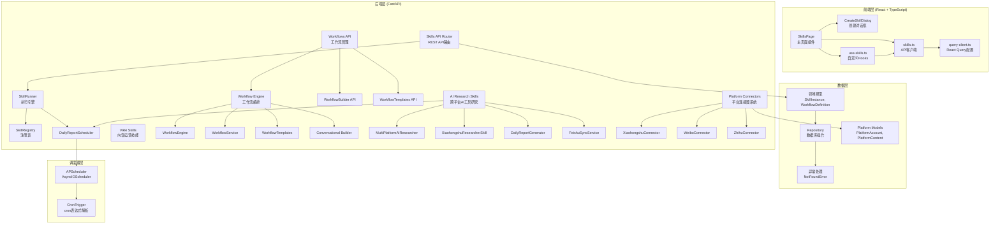
```mermaid
graph TB
subgraph "前端层 (React + TypeScript)"
Frontend[SkillsPage<br/>主页面组件]
Dialog[CreateSkillDialog<br/>创建对话框]
API[skills.ts<br/>API客户端]
Hooks[use-skills.ts<br/>自定义Hooks]
Query[query-client.ts<br/>React Query配置]
Frontend --> Dialog
Frontend --> API
Frontend --> Hooks
API --> Query
Hooks --> API
end
subgraph "后端层 (FastAPI)"
APIRouter[Skills API Router<br/>REST API路由]
Runner[SkillRunner<br/>执行引擎]
Registry[SkillRegistry<br/>注册表]
Scheduler[SkillScheduler<br/>APScheduler调度器]
Vikki[Vikki Skills<br/>内容运营技能]
Workflows[Workflow Engine<br/>工作流编排]
Workflows --> Engine[WorkflowEngine]
Workflows --> Service[WorkflowService]
Workflows --> Templates[WorkflowTemplates]
Workflows --> Conversational[Conversational Builder]
WorkflowsAPI[Workflows API<br/>工作流管理]
WorkflowsAPI --> Workflows
WorkflowsAPI --> Builder[WorkflowBuilder API]
WorkflowsAPI --> TemplatesAPI[WorkflowTemplates API]
AIResearch[AI Research Skills<br/>跨平台AI工具研究]
AIResearch --> MultiResearcher[MultiPlatformAIResearcher]
AIResearch --> Xiaohongshu[XiaohongshuResearcherSkill]
AIResearch --> ReportGen[DailyReportGenerator]
AIResearch --> Scheduler[DailyReportScheduler]
AIResearch --> FeishuSync[FeishuSyncService]
PlatformConnectors[Platform Connectors<br/>平台连接器系统]
PlatformConnectors --> XiaohongshuConnector[XiaohongshuConnector]
PlatformConnectors --> WeiboConnector[WeiboConnector]
PlatformConnectors --> ZhihuConnector[ZhihuConnector]
end
subgraph "数据层"
Domain[领域模型<br/>SkillInstance, WorkflowDefinition]
Repository[Repository<br/>数据库操作]
Exceptions[异常处理<br/>NotFoundError]
PlatformModels[Platform Models<br/>PlatformAccount, PlatformContent]
end
subgraph "调度器层"
APScheduler[APScheduler<br/>AsyncIOScheduler]
CronTrigger[CronTrigger<br/>cron表达式解析]
end
APIRouter --> Runner
Runner --> Registry
Runner --> Scheduler
Scheduler --> APScheduler
APScheduler --> CronTrigger
APIRouter --> Domain
Domain --> Repository
Repository --> Exceptions
PlatformConnectors --> PlatformModels
```

**图表来源**
- [frontend/src/app/(dashboard)/skills/page.tsx](file://frontend/src/app/(dashboard)/skills/page.tsx#L1-L189)
- [frontend/src/lib/api/skills.ts](file://frontend/src/lib/api/skills.ts#L66-L144)
- [frontend/src/lib/hooks/use-skills.ts](file://frontend/src/lib/hooks/use-skills.ts#L1-L212)
- [frontend/src/lib/api/query-client.ts](file://frontend/src/lib/api/query-client.ts#L1-L43)
- [api/routers/skills.py](file://api/routers/skills.py#L1-L507)
- [open_notebook/skills/runner.py](file://open_notebook/skills/runner.py#L20-L250)
- [open_notebook/skills/registry.py](file://open_notebook/skills/registry.py#L12-L121)
- [open_notebook/skills/scheduler.py](file://open_notebook/skills/scheduler.py#L31-L48)
- [open_notebook/skills/vikki_content_ops.py](file://open_notebook/skills/vikki_content_ops.py#L1-L200)
- [open_notebook/workflows/engine.py](file://open_notebook/workflows/engine.py#L1-L620)
- [open_notebook/workflows/service.py](file://open_notebook/workflows/service.py#L1-L240)
- [open_notebook/workflows/templates.py](file://open_notebook/workflows/templates.py#L1-L675)
- [open_notebook/workflows/conversational.py](file://open_notebook/workflows/conversational.py#L1-L426)
- [open_notebook/domain/skill.py](file://open_notebook/domain/skill.py#L17-L165)
- [open_notebook/domain/workflow.py](file://open_notebook/domain/workflow.py#L1-L309)
- [open_notebook/domain/notebook.py](file://open_notebook/domain/notebook.py#L232-L294)
- [open_notebook/database/repository.py](file://open_notebook/database/repository.py#L65-L195)
- [open_notebook/exceptions.py](file://open_notebook/exceptions.py#L25-L28)
- [api/routers/workflows.py](file://api/routers/workflows.py#L1-L453)
- [api/routers/workflow_builder.py](file://api/routers/workflow_builder.py#L1-L305)
- [api/routers/workflow_templates.py](file://api/routers/workflow_templates.py#L1-L215)
- [open_notebook/skills/multi_platform_ai_researcher/multi_platform_ai_researcher.py](file://open_notebook/skills/multi_platform_ai_researcher/multi_platform_ai_researcher.py#L1-L623)
- [open_notebook/skills/multi_platform_ai_researcher/feishu_sync.py](file://open_notebook/skills/multi_platform_ai_researcher/feishu_sync.py#L1-L330)
- [open_notebook/skills/connectors/weibo_connector.py](file://open_notebook/skills/connectors/weibo_connector.py#L1-L332)
- [open_notebook/skills/connectors/xiaohongshu_connector.py](file://open_notebook/skills/connectors/xiaohongshu_connector.py#L1-L312)

## 详细组件分析

### 前端组件体系

前端技能管理界面采用模块化设计，每个组件都有明确的职责分工：

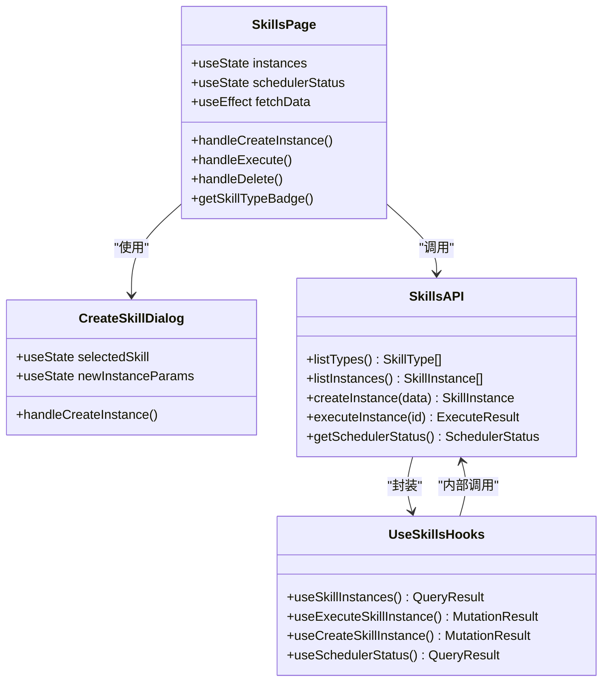
```mermaid
classDiagram
class SkillsPage {
+useState instances
+useState schedulerStatus
+useEffect fetchData
+handleCreateInstance()
+handleExecute()
+handleDelete()
+getSkillTypeBadge()
}
class CreateSkillDialog {
+useState selectedSkill
+useState newInstanceParams
+handleCreateInstance()
}
class SkillsAPI {
+listTypes() SkillType[]
+listInstances() SkillInstance[]
+createInstance(data) SkillInstance
+executeInstance(id) ExecuteResult
+getSchedulerStatus() SchedulerStatus
}
class UseSkillsHooks {
+useSkillInstances() QueryResult
+useExecuteSkillInstance() MutationResult
+useCreateSkillInstance() MutationResult
+useSchedulerStatus() QueryResult
}
SkillsPage --> CreateSkillDialog : "使用"
SkillsPage --> SkillsAPI : "调用"
SkillsAPI --> UseSkillsHooks : "封装"
UseSkillsHooks --> SkillsAPI : "内部调用"
```

**图表来源**
- [frontend/src/app/(dashboard)/skills/page.tsx](file://frontend/src/app/(dashboard)/skills/page.tsx#L16-L189)
- [frontend/src/lib/api/skills.ts](file://frontend/src/lib/api/skills.ts#L66-L144)
- [frontend/src/lib/hooks/use-skills.ts](file://frontend/src/lib/hooks/use-skills.ts#L32-L211)

**章节来源**
- [frontend/src/app/(dashboard)/skills/page.tsx](file://frontend/src/app/(dashboard)/skills/page.tsx#L16-L189)
- [frontend/src/lib/api/skills.ts](file://frontend/src/lib/api/skills.ts#L66-L144)
- [frontend/src/lib/hooks/use-skills.ts](file://frontend/src/lib/hooks/use-skills.ts#L32-L211)

### 后端API路由架构

后端采用FastAPI实现RESTful API，提供完整的技能管理功能：

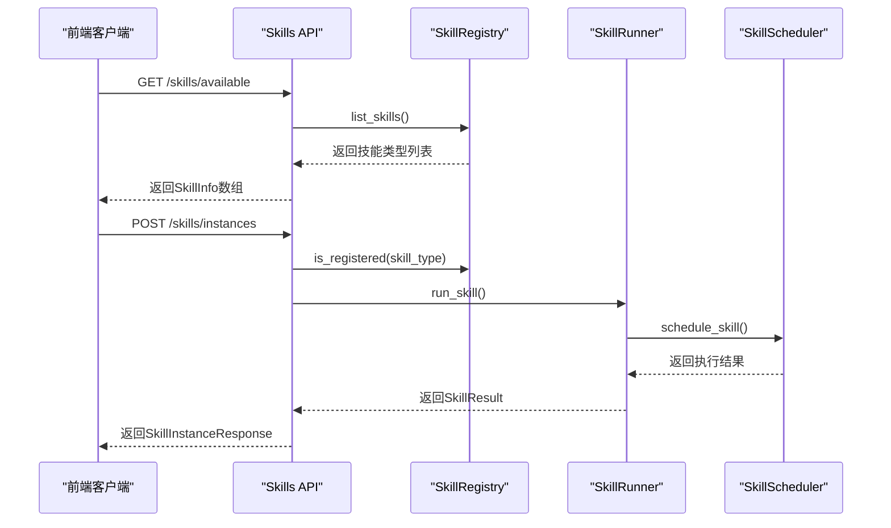
```mermaid
sequenceDiagram
participant Client as "前端客户端"
participant API as "Skills API"
participant Registry as "SkillRegistry"
participant Runner as "SkillRunner"
participant Scheduler as "SkillScheduler"
Client->>API : GET /skills/available
API->>Registry : list_skills()
Registry-->>API : 返回技能类型列表
API-->>Client : 返回SkillInfo数组
Client->>API : POST /skills/instances
API->>Registry : is_registered(skill_type)
API->>Runner : run_skill()
Runner->>Scheduler : schedule_skill()
Scheduler-->>Runner : 返回执行结果
Runner-->>API : 返回SkillResult
API-->>Client : 返回SkillInstanceResponse
```

**图表来源**
- [api/routers/skills.py](file://api/routers/skills.py#L114-L200)
- [open_notebook/skills/registry.py](file://open_notebook/skills/registry.py#L12-L121)
- [open_notebook/skills/runner.py](file://open_notebook/skills/runner.py#L20-L250)
- [open_notebook/skills/scheduler.py](file://open_notebook/skills/scheduler.py#L31-L48)

**章节来源**
- [api/routers/skills.py](file://api/routers/skills.py#L114-L200)
- [open_notebook/skills/registry.py](file://open_notebook/skills/registry.py#L12-L121)
- [open_notebook/skills/runner.py](file://open_notebook/skills/runner.py#L20-L250)
- [open_notebook/skills/scheduler.py](file://open_notebook/skills/scheduler.py#L31-L48)

### 基础类体系

技能系统的基础类提供了统一的接口和生命周期管理：

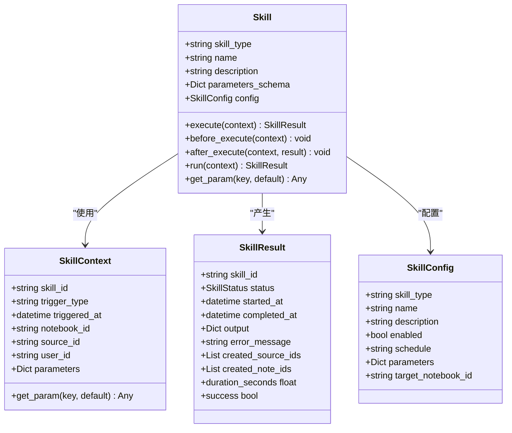
```mermaid
classDiagram
class Skill {
+string skill_type
+string name
+string description
+Dict parameters_schema
+SkillConfig config
+execute(context) SkillResult
+before_execute(context) void
+after_execute(context, result) void
+run(context) SkillResult
+get_param(key, default) Any
}
class SkillContext {
+string skill_id
+string trigger_type
+datetime triggered_at
+string notebook_id
+string source_id
+string user_id
+Dict parameters
+get_param(key, default) Any
}
class SkillResult {
+string skill_id
+SkillStatus status
+datetime started_at
+datetime completed_at
+Dict output
+string error_message
+List created_source_ids
+List created_note_ids
+duration_seconds float
+success bool
}
class SkillConfig {
+string skill_type
+string name
+string description
+bool enabled
+string schedule
+Dict parameters
+string target_notebook_id
}
Skill --> SkillContext : "使用"
Skill --> SkillResult : "产生"
Skill --> SkillConfig : "配置"
```

**图表来源**
- [open_notebook/skills/base.py](file://open_notebook/skills/base.py#L17-L183)

**章节来源**
- [open_notebook/skills/base.py](file://open_notebook/skills/base.py#L17-L183)

### 技能注册表机制

技能注册表实现了工厂模式，支持动态技能发现和实例化：

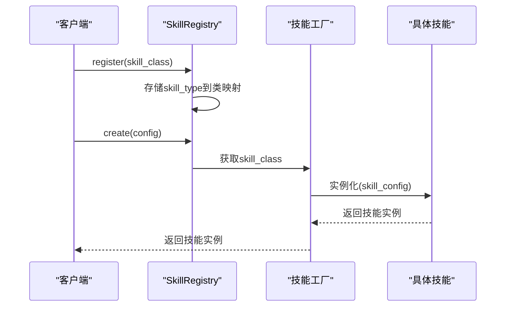
```mermaid
sequenceDiagram
participant Client as "客户端"
participant Registry as "SkillRegistry"
participant Factory as "技能工厂"
participant Skill as "具体技能"
Client->>Registry : register(skill_class)
Registry->>Registry : 存储skill_type到类映射
Client->>Registry : create(config)
Registry->>Factory : 获取skill_class
Factory->>Skill : 实例化(skill_config)
Skill-->>Factory : 返回技能实例
Factory-->>Client : 返回技能实例
```

**图表来源**
- [open_notebook/skills/registry.py](file://open_notebook/skills/registry.py#L58-L79)

**章节来源**
- [open_notebook/skills/registry.py](file://open_notebook/skills/registry.py#L12-L121)

### 技能执行流程

技能执行器负责管理整个执行生命周期，包括参数合并、上下文构建和结果记录：

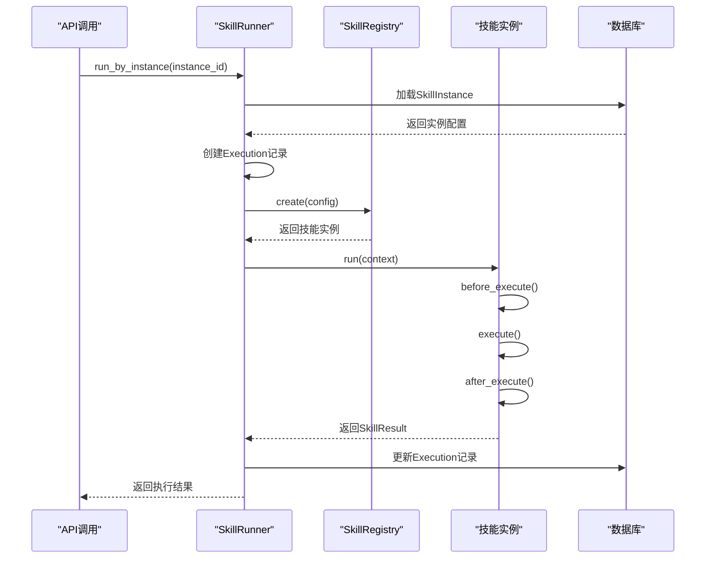
```mermaid
sequenceDiagram
participant API as "API调用"
participant Runner as "SkillRunner"
participant Registry as "SkillRegistry"
participant Skill as "技能实例"
participant DB as "数据库"
API->>Runner : run_by_instance(instance_id)
Runner->>DB : 加载SkillInstance
DB-->>Runner : 返回实例配置
Runner->>Runner : 创建Execution记录
Runner->>Registry : create(config)
Registry-->>Runner : 返回技能实例
Runner->>Skill : run(context)
Skill->>Skill : before_execute()
Skill->>Skill : execute()
Skill->>Skill : after_execute()
Skill-->>Runner : 返回SkillResult
Runner->>DB : 更新Execution记录
Runner-->>API : 返回执行结果
```

**图表来源**
- [open_notebook/skills/runner.py](file://open_notebook/skills/runner.py#L41-L150)

**章节来源**
- [open_notebook/skills/runner.py](file://open_notebook/skills/runner.py#L20-L250)

### 工作流编排引擎

工作流编排引擎是系统的核心组件，负责协调多个技能的执行：

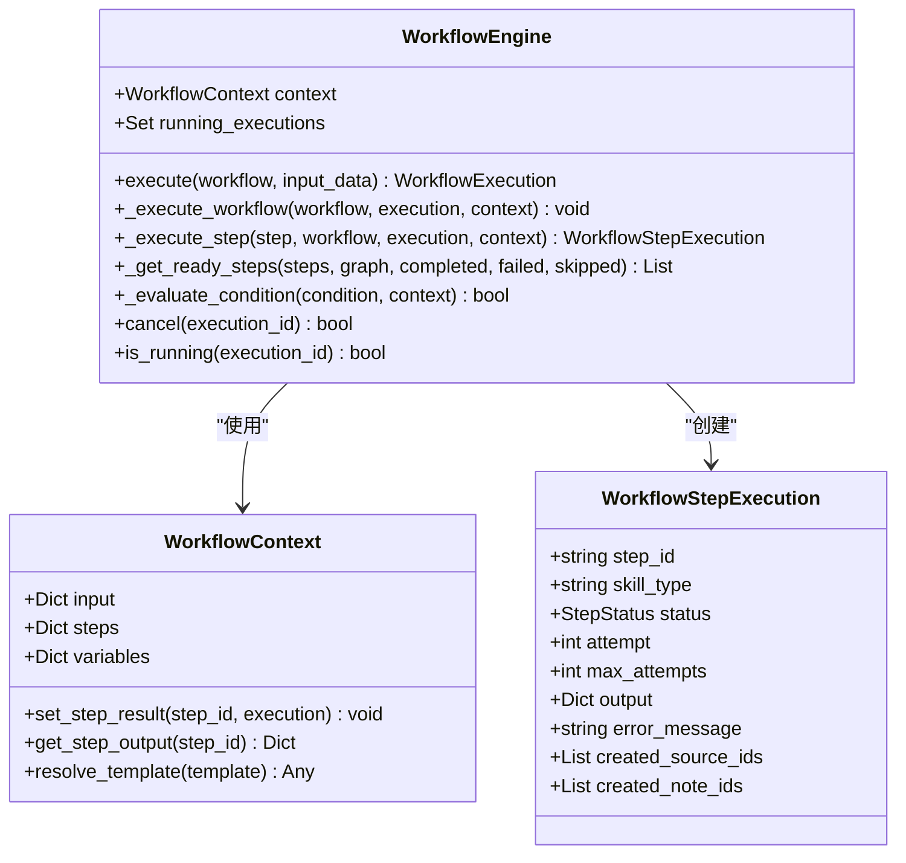
```mermaid
classDiagram
class WorkflowEngine {
+WorkflowContext context
+Set running_executions
+execute(workflow, input_data) WorkflowExecution
+_execute_workflow(workflow, execution, context) void
+_execute_step(step, workflow, execution, context) WorkflowStepExecution
+_get_ready_steps(steps, graph, completed, failed, skipped) List
+_evaluate_condition(condition, context) bool
+cancel(execution_id) bool
+is_running(execution_id) bool
}
class WorkflowContext {
+Dict input
+Dict steps
+Dict variables
+set_step_result(step_id, execution) void
+get_step_output(step_id) Dict
+resolve_template(template) Any
}
class WorkflowStepExecution {
+string step_id
+string skill_type
+StepStatus status
+int attempt
+int max_attempts
+Dict output
+string error_message
+List created_source_ids
+List created_note_ids
}
WorkflowEngine --> WorkflowContext : "使用"
WorkflowEngine --> WorkflowStepExecution : "创建"
```

**图表来源**
- [open_notebook/workflows/engine.py](file://open_notebook/workflows/engine.py#L130-L620)

**章节来源**
- [open_notebook/workflows/engine.py](file://open_notebook/workflows/engine.py#L130-L620)

### 跨平台AI工具研究员

**重大更新** 新增跨平台AI工具研究员技能，支持多平台AI工具信息的收集和分析，现已支持完整的Feishu同步功能：

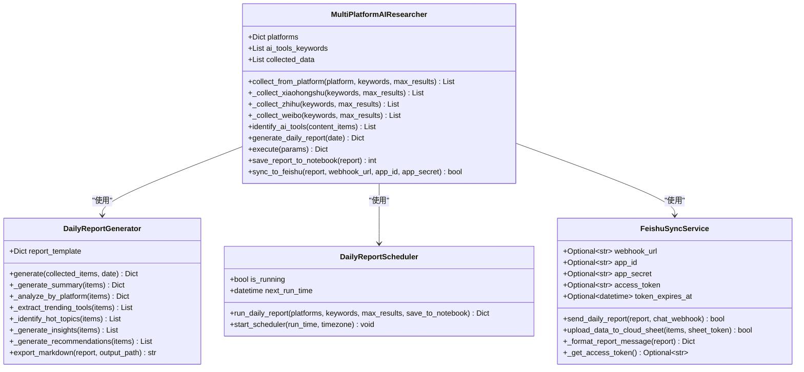
```mermaid
classDiagram
class MultiPlatformAIResearcher {
+Dict platforms
+List ai_tools_keywords
+List collected_data
+collect_from_platform(platform, keywords, max_results) List
+_collect_xiaohongshu(keywords, max_results) List
+_collect_zhihu(keywords, max_results) List
+_collect_weibo(keywords, max_results) List
+identify_ai_tools(content_items) List
+generate_daily_report(date) Dict
+execute(params) Dict
+save_report_to_notebook(report) int
+sync_to_feishu(report, webhook_url, app_id, app_secret) bool
}
class DailyReportGenerator {
+Dict report_template
+generate(collected_items, date) Dict
+_generate_summary(items) Dict
+_analyze_by_platform(items) Dict
+_extract_trending_tools(items) List
+_identify_hot_topics(items) List
+_generate_insights(items) List
+_generate_recommendations(items) List
+export_markdown(report, output_path) str
}
class DailyReportScheduler {
+bool is_running
+datetime next_run_time
+run_daily_report(platforms, keywords, max_results, save_to_notebook) Dict
+start_scheduler(run_time, timezone) void
}
class FeishuSyncService {
+Optional~str~ webhook_url
+Optional~str~ app_id
+Optional~str~ app_secret
+Optional~str~ access_token
+Optional~datetime~ token_expires_at
+send_daily_report(report, chat_webhook) bool
+upload_data_to_cloud_sheet(items, sheet_token) bool
+_format_report_message(report) Dict
+_get_access_token() Optional~str~
}
MultiPlatformAIResearcher --> DailyReportGenerator : "使用"
MultiPlatformAIResearcher --> DailyReportScheduler : "使用"
MultiPlatformAIResearcher --> FeishuSyncService : "使用"
```

**图表来源**
- [open_notebook/skills/multi_platform_ai_researcher/multi_platform_ai_researcher.py](file://open_notebook/skills/multi_platform_ai_researcher/multi_platform_ai_researcher.py#L19-L623)
- [open_notebook/skills/multi_platform_ai_researcher/daily_report_generator.py](file://open_notebook/skills/multi_platform_ai_researcher/daily_report_generator.py#L14-L329)
- [open_notebook/skills/multi_platform_ai_researcher/ai_tools_scheduler.py](file://open_notebook/skills/multi_platform_ai_researcher/ai_tools_scheduler.py#L15-L126)
- [open_notebook/skills/multi_platform_ai_researcher/feishu_sync.py](file://open_notebook/skills/multi_platform_ai_researcher/feishu_sync.py#L15-L330)

### Feishu同步服务

**重大更新** 新增完整的飞书同步服务，支持将AI工具研究报告同步到飞书机器人和云文档：

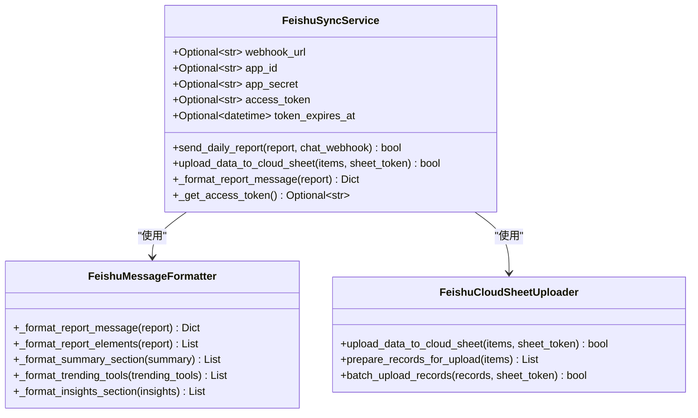
```mermaid
classDiagram
class FeishuSyncService {
+Optional~str~ webhook_url
+Optional~str~ app_id
+Optional~str~ app_secret
+Optional~str~ access_token
+Optional~datetime~ token_expires_at
+send_daily_report(report, chat_webhook) bool
+upload_data_to_cloud_sheet(items, sheet_token) bool
+_format_report_message(report) Dict
+_get_access_token() Optional~str~
}
class FeishuMessageFormatter {
+_format_report_message(report) Dict
+_format_report_elements(report) List
+_format_summary_section(summary) List
+_format_trending_tools(trending_tools) List
+_format_insights_section(insights) List
}
class FeishuCloudSheetUploader {
+upload_data_to_cloud_sheet(items, sheet_token) bool
+prepare_records_for_upload(items) List
+batch_upload_records(records, sheet_token) bool
}
FeishuSyncService --> FeishuMessageFormatter : "使用"
FeishuSyncService --> FeishuCloudSheetUploader : "使用"
```

**图表来源**
- [open_notebook/skills/multi_platform_ai_researcher/feishu_sync.py](file://open_notebook/skills/multi_platform_ai_researcher/feishu_sync.py#L15-L330)

### 平台连接器系统

**重大更新** 平台连接器系统已重构为模块化架构，支持多种平台的认证和数据获取：

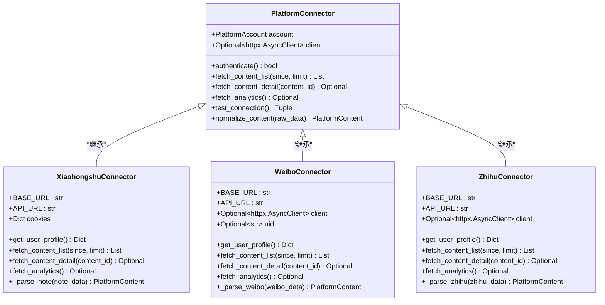
```mermaid
classDiagram
class PlatformConnector {
+PlatformAccount account
+Optional~httpx.AsyncClient~ client
+authenticate() bool
+fetch_content_list(since, limit) List
+fetch_content_detail(content_id) Optional
+fetch_analytics() Optional
+test_connection() Tuple
+normalize_content(raw_data) PlatformContent
}
class XiaohongshuConnector {
+BASE_URL : str
+API_URL : str
+Dict cookies
+get_user_profile() Dict
+fetch_content_list(since, limit) List
+fetch_content_detail(content_id) Optional
+fetch_analytics() Optional
+_parse_note(note_data) PlatformContent
}
class WeiboConnector {
+BASE_URL : str
+API_URL : str
+Optional~httpx.AsyncClient~ client
+Optional~str~ uid
+get_user_profile() Dict
+fetch_content_list(since, limit) List
+fetch_content_detail(content_id) Optional
+fetch_analytics() Optional
+_parse_weibo(weibo_data) PlatformContent
}
class ZhihuConnector {
+BASE_URL : str
+API_URL : str
+Optional~httpx.AsyncClient~ client
+get_user_profile() Dict
+fetch_content_list(since, limit) List
+fetch_content_detail(content_id) Optional
+fetch_analytics() Optional
+_parse_zhihu(zhihu_data) PlatformContent
}
PlatformConnector <|-- XiaohongshuConnector : "继承"
PlatformConnector <|-- WeiboConnector : "继承"
PlatformConnector <|-- ZhihuConnector : "继承"
```

**图表来源**
- [open_notebook/skills/connectors/xiaohongshu_connector.py](file://open_notebook/skills/connectors/xiaohongshu_connector.py#L32-L312)
- [open_notebook/skills/connectors/weibo_connector.py](file://open_notebook/skills/connectors/weibo_connector.py#L25-L332)

### 小红书研究员

**重大更新** 新增专门的小红书研究员技能，专注于小红书平台的内容分析：

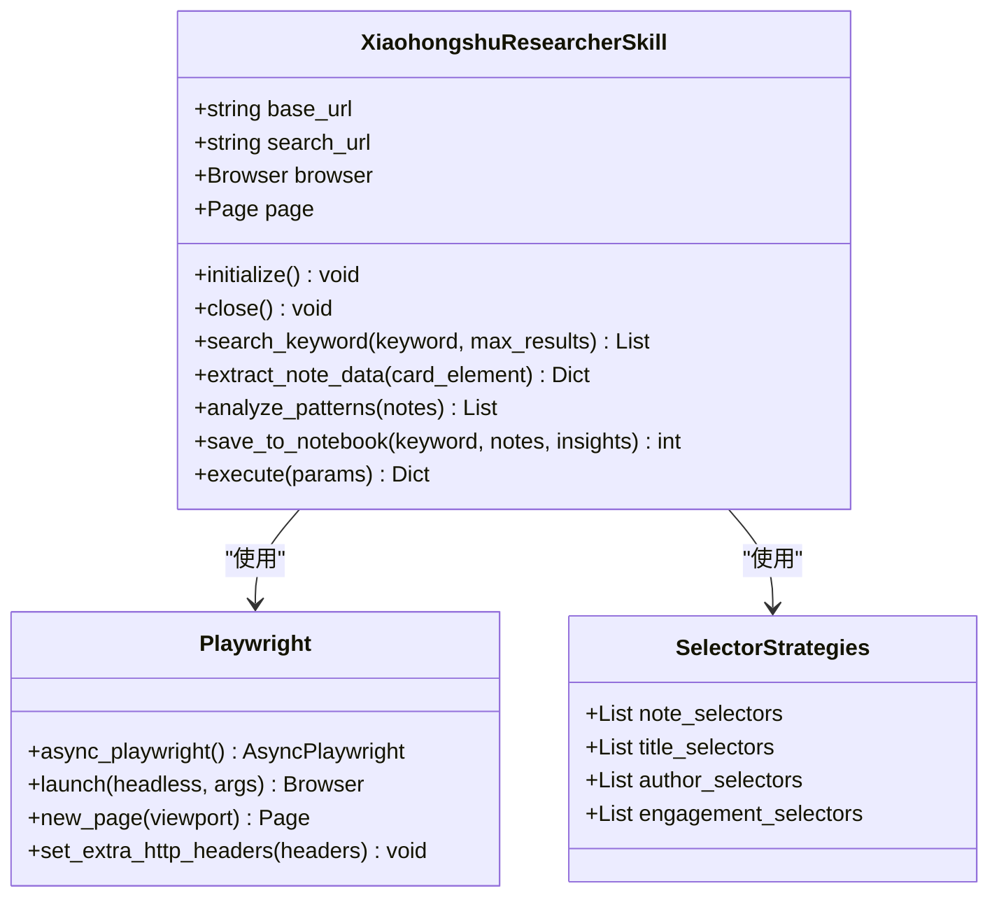
```mermaid
classDiagram
class XiaohongshuResearcherSkill {
+string base_url
+string search_url
+Browser browser
+Page page
+initialize() void
+close() void
+search_keyword(keyword, max_results) List
+extract_note_data(card_element) Dict
+analyze_patterns(notes) List
+save_to_notebook(keyword, notes, insights) int
+execute(params) Dict
}
class Playwright {
+async_playwright() AsyncPlaywright
+launch(headless, args) Browser
+new_page(viewport) Page
+set_extra_http_headers(headers) void
}
class SelectorStrategies {
+List note_selectors
+List title_selectors
+List author_selectors
+List engagement_selectors
}
XiaohongshuResearcherSkill --> Playwright : "使用"
XiaohongshuResearcherSkill --> SelectorStrategies : "使用"
```

**图表来源**
- [open_notebook/skills/xiaohongshu_researcher/skill.py](file://open_notebook/skills/xiaohongshu_researcher/skill.py#L20-L405)

### Vikki内容运营技能

Vikki内容运营技能基于四象限内容策略理论，提供完整的IP内容运营自动化：

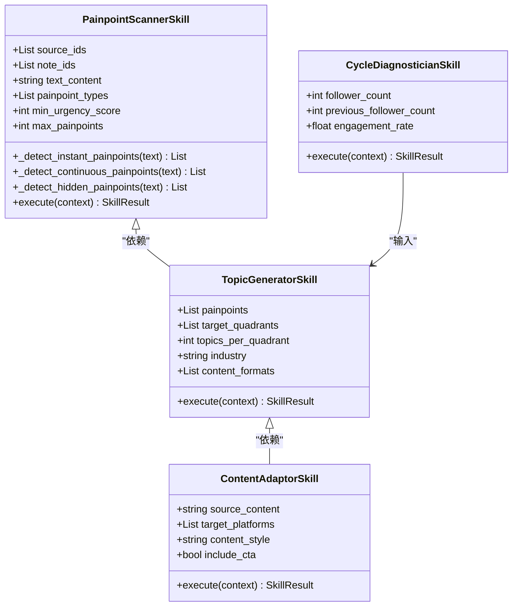
```mermaid
classDiagram
class PainpointScannerSkill {
+List source_ids
+List note_ids
+string text_content
+List painpoint_types
+int min_urgency_score
+int max_painpoints
+_detect_instant_painpoints(text) List
+_detect_continuous_painpoints(text) List
+_detect_hidden_painpoints(text) List
+execute(context) SkillResult
}
class TopicGeneratorSkill {
+List painpoints
+List target_quadrants
+int topics_per_quadrant
+string industry
+List content_formats
+execute(context) SkillResult
}
class ContentAdaptorSkill {
+string source_content
+List target_platforms
+string content_style
+bool include_cta
+execute(context) SkillResult
}
class CycleDiagnosticianSkill {
+int follower_count
+int previous_follower_count
+float engagement_rate
+execute(context) SkillResult
}
PainpointScannerSkill <|-- TopicGeneratorSkill : "依赖"
TopicGeneratorSkill <|-- ContentAdaptorSkill : "依赖"
CycleDiagnosticianSkill --> TopicGeneratorSkill : "输入"
```

**图表来源**
- [open_notebook/skills/vikki_content_ops.py](file://open_notebook/skills/vikki_content_ops.py#L30-L200)
- [open_notebook/skills/vikki_content_ops.py](file://open_notebook/skills/vikki_content_ops.py#L1200-L1400)

### 内容爬取技能

RSS内容爬取技能是最基础的自动化技能之一，支持从RSS源自动抓取内容：

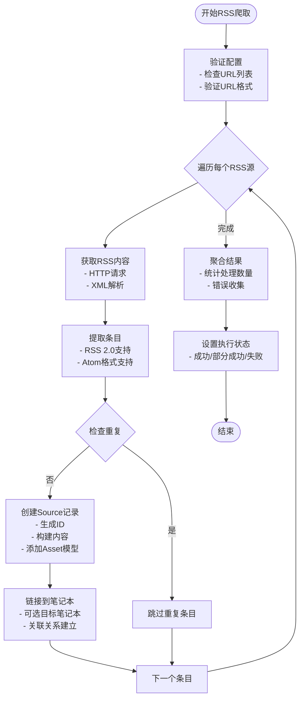
```mermaid
flowchart TD
Start([开始RSS爬取]) --> Validate["验证配置<br/>- 检查URL列表<br/>- 验证URL格式"]
Validate --> LoopFeeds{"遍历每个RSS源"}
LoopFeeds --> FetchFeed["获取RSS内容<br/>- HTTP请求<br/>- XML解析"]
FetchFeed --> ExtractEntries["提取条目<br/>- RSS 2.0支持<br/>- Atom格式支持"]
ExtractEntries --> CheckDuplicate{"检查重复"}
CheckDuplicate --> |是| SkipEntry["跳过重复条目"]
CheckDuplicate --> |否| CreateSource["创建Source记录<br/>- 生成ID<br/>- 构建内容<br/>- 添加Asset模型"]
CreateSource --> LinkNotebook["链接到笔记本<br/>- 可选目标笔记本<br/>- 关联关系建立"]
LinkNotebook --> NextEntry["下一个条目"]
SkipEntry --> NextEntry
NextEntry --> LoopFeeds
LoopFeeds --> |完成| AggregateResults["聚合结果<br/>- 统计处理数量<br/>- 错误收集"]
AggregateResults --> SetStatus["设置执行状态<br/>- 成功/部分成功/失败"]
SetStatus --> End([结束])
```

**图表来源**
- [open_notebook/skills/content_crawler.py](file://open_notebook/skills/content_crawler.py#L256-L306)

**章节来源**
- [open_notebook/skills/content_crawler.py](file://open_notebook/skills/content_crawler.py#L20-L315)

### 浏览器自动化技能

浏览器自动化技能使用browser-use库实现AI驱动的网页操作：

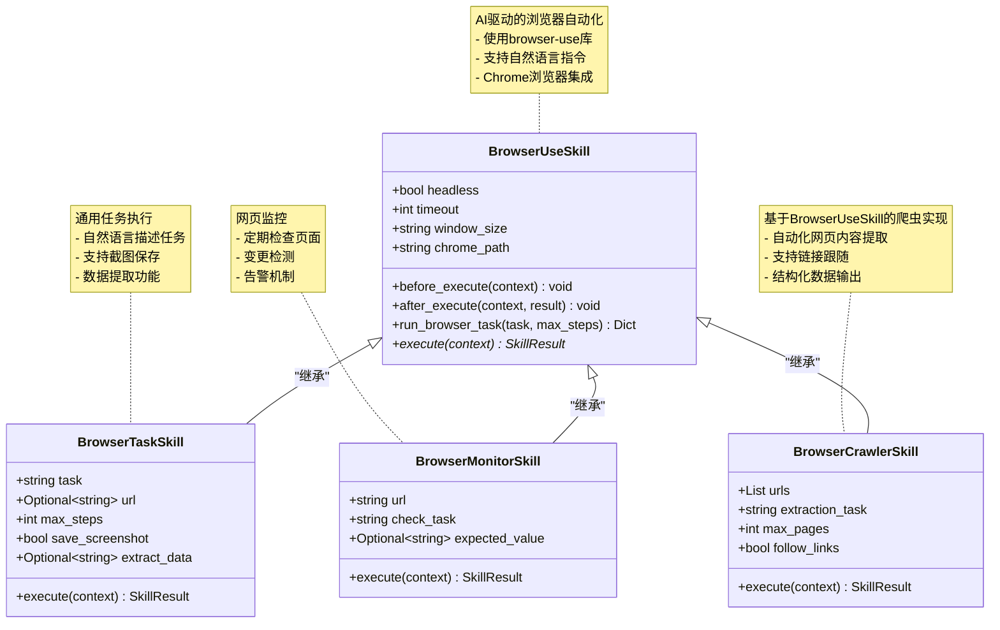
```mermaid
classDiagram
class BrowserUseSkill {
+bool headless
+int timeout
+string window_size
+string chrome_path
+before_execute(context) void
+after_execute(context, result) void
+run_browser_task(task, max_steps) Dict
+execute(context) SkillResult*
}
class BrowserTaskSkill {
+string task
+Optional~string~ url
+int max_steps
+bool save_screenshot
+Optional~string~ extract_data
+execute(context) SkillResult
}
class BrowserMonitorSkill {
+string url
+string check_task
+Optional~string~ expected_value
+execute(context) SkillResult
}
class BrowserCrawlerSkill {
+List urls
+string extraction_task
+int max_pages
+bool follow_links
+execute(context) SkillResult
}
BrowserUseSkill <|-- BrowserTaskSkill : "继承"
BrowserUseSkill <|-- BrowserMonitorSkill : "继承"
BrowserUseSkill <|-- BrowserCrawlerSkill : "继承"
note for BrowserUseSkill "AI驱动的浏览器自动化<br/>- 使用browser-use库<br/>- 支持自然语言指令<br/>- Chrome浏览器集成"
note for BrowserTaskSkill "通用任务执行<br/>- 自然语言描述任务<br/>- 支持截图保存<br/>- 数据提取功能"
note for BrowserMonitorSkill "网页监控<br/>- 定期检查页面<br/>- 变更检测<br/>- 告警机制"
note for BrowserCrawlerSkill "基于BrowserUseSkill的爬虫实现<br/>- 自动化网页内容提取<br/>- 支持链接跟随<br/>- 结构化数据输出"
```

**图表来源**
- [open_notebook/skills/browser_base.py](file://open_notebook/skills/browser_base.py#L17-L316)
- [open_notebook/skills/browser_task.py](file://open_notebook/skills/browser_task.py#L17-L271)

**章节来源**
- [open_notebook/skills/browser_base.py](file://open_notebook/skills/browser_base.py#L17-L316)
- [open_notebook/skills/browser_task.py](file://open_notebook/skills/browser_task.py#L17-L271)

### 笔记组织技能

笔记组织技能提供AI驱动的内容处理能力：

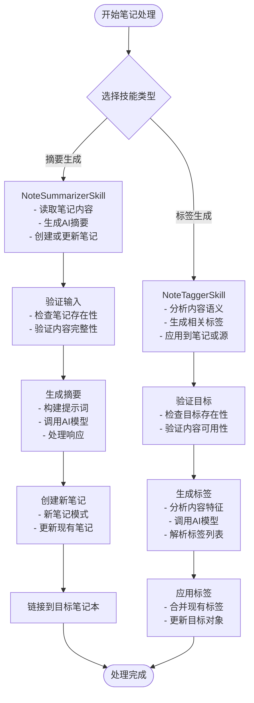
```mermaid
flowchart TD
Start([开始笔记处理]) --> ChooseSkill{"选择技能类型"}
ChooseSkill --> |摘要生成| Summarize["NoteSummarizerSkill<br/>- 读取笔记内容<br/>- 生成AI摘要<br/>- 创建或更新笔记"]
ChooseSkill --> |标签生成| TagNotes["NoteTaggerSkill<br/>- 分析内容语义<br/>- 生成相关标签<br/>- 应用到笔记或源"]
Summarize --> ValidateNotes["验证输入<br/>- 检查笔记存在性<br/>- 验证内容完整性"]
ValidateNotes --> GenerateSummary["生成摘要<br/>- 构建提示词<br/>- 调用AI模型<br/>- 处理响应"]
GenerateSummary --> CreateOrUpdate["创建新笔记<br/>- 新笔记模式<br/>- 更新现有笔记"]
CreateOrUpdate --> LinkNotebook["链接到目标笔记本"]
LinkNotebook --> Complete([处理完成])
TagNotes --> ValidateTargets["验证目标<br/>- 检查目标存在性<br/>- 验证内容可用性"]
ValidateTargets --> GenerateTags["生成标签<br/>- 分析内容特征<br/>- 调用AI模型<br/>- 解析标签列表"]
GenerateTags --> ApplyTags["应用标签<br/>- 合并现有标签<br/>- 更新目标对象"]
ApplyTags --> Complete
```

**图表来源**
- [open_notebook/skills/note_organizer.py](file://open_notebook/skills/note_organizer.py#L19-L408)

**章节来源**
- [open_notebook/skills/note_organizer.py](file://open_notebook/skills/note_organizer.py#L19-L408)

## 跨平台AI工具研究员

**重大更新** 新增跨平台AI工具研究员技能，支持多平台AI工具信息的收集和分析，现已支持完整的Feishu同步功能。

### MultiPlatformAIResearcher - 跨平台研究员

MultiPlatformAIResearcher是AI工具研究的核心组件，支持多平台信息收集和分析：

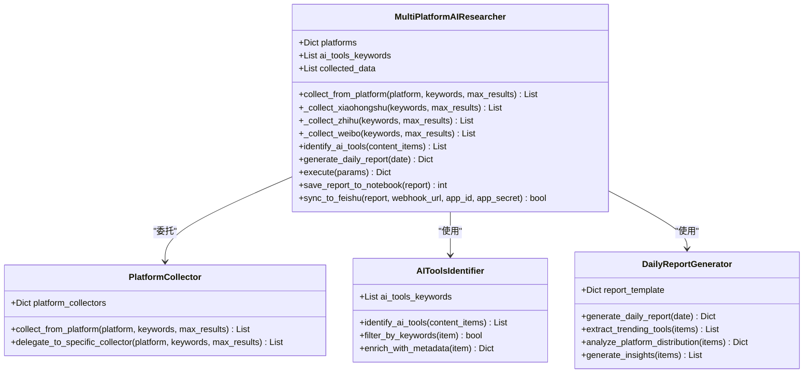
```mermaid
classDiagram
class MultiPlatformAIResearcher {
+Dict platforms
+List ai_tools_keywords
+List collected_data
+collect_from_platform(platform, keywords, max_results) List
+_collect_xiaohongshu(keywords, max_results) List
+_collect_zhihu(keywords, max_results) List
+_collect_weibo(keywords, max_results) List
+identify_ai_tools(content_items) List
+generate_daily_report(date) Dict
+execute(params) Dict
+save_report_to_notebook(report) int
+sync_to_feishu(report, webhook_url, app_id, app_secret) bool
}
class PlatformCollector {
+Dict platform_collectors
+collect_from_platform(platform, keywords, max_results) List
+delegate_to_specific_collector(platform, keywords, max_results) List
}
class AIToolsIdentifier {
+List ai_tools_keywords
+identify_ai_tools(content_items) List
+filter_by_keywords(item) bool
+enrich_with_metadata(item) Dict
}
class DailyReportGenerator {
+Dict report_template
+generate_daily_report(date) Dict
+extract_trending_tools(items) List
+analyze_platform_distribution(items) Dict
+generate_insights(items) List
}
MultiPlatformAIResearcher --> PlatformCollector : "委托"
MultiPlatformAIResearcher --> AIToolsIdentifier : "使用"
MultiPlatformAIResearcher --> DailyReportGenerator : "使用"
```

**图表来源**
- [open_notebook/skills/multi_platform_ai_researcher/multi_platform_ai_researcher.py](file://open_notebook/skills/multi_platform_ai_researcher/multi_platform_ai_researcher.py#L19-L623)

### Feishu同步功能

**新增** Feishu同步功能支持将AI工具研究报告直接同步到飞书机器人和云文档：

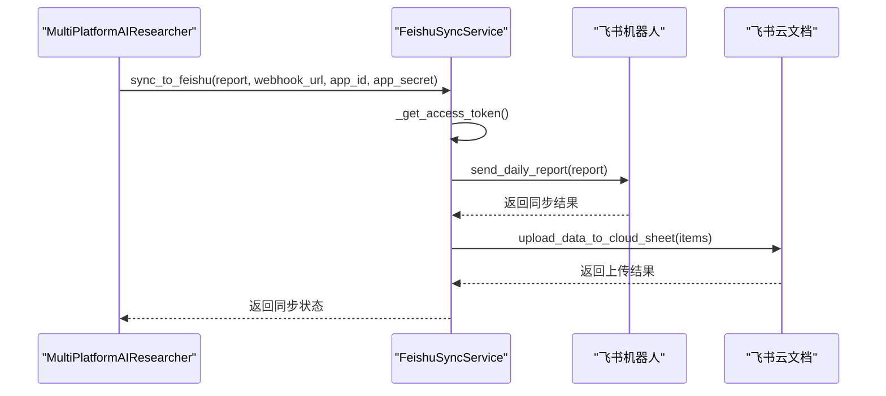
```mermaid
sequenceDiagram
participant Researcher as "MultiPlatformAIResearcher"
participant FeishuService as "FeishuSyncService"
participant Webhook as "飞书机器人"
participant CloudSheet as "飞书云文档"
Researcher->>FeishuService : sync_to_feishu(report, webhook_url, app_id, app_secret)
FeishuService->>FeishuService : _get_access_token()
FeishuService->>Webhook : send_daily_report(report)
Webhook-->>FeishuService : 返回同步结果
FeishuService->>CloudSheet : upload_data_to_cloud_sheet(items)
CloudSheet-->>FeishuService : 返回上传结果
FeishuService-->>Researcher : 返回同步状态
```

**图表来源**
- [open_notebook/skills/multi_platform_ai_researcher/multi_platform_ai_researcher.py](file://open_notebook/skills/multi_platform_ai_researcher/multi_platform_ai_researcher.py#L507-L545)
- [open_notebook/skills/multi_platform_ai_researcher/feishu_sync.py](file://open_notebook/skills/multi_platform_ai_researcher/feishu_sync.py#L37-L83)

### AI工具关键词识别

系统内置了丰富的AI工具关键词，用于识别相关内容：

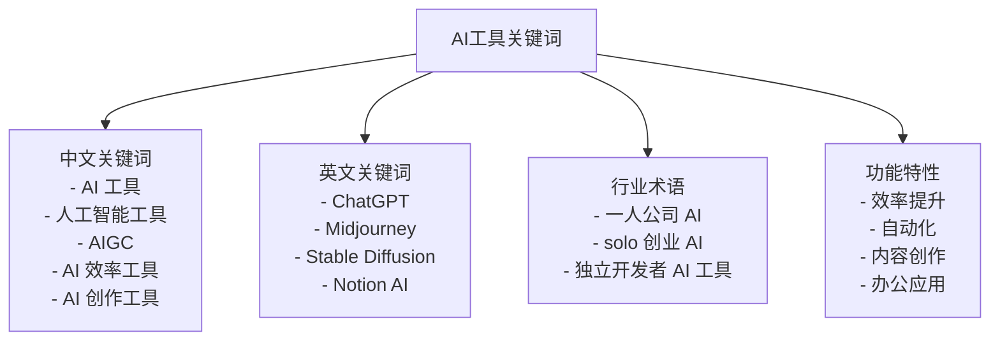
```mermaid
flowchart TD
Keywords[AI工具关键词] --> Chinese["中文关键词<br/>- AI 工具<br/>- 人工智能工具<br/>- AIGC<br/>- AI 效率工具<br/>- AI 创作工具"]
Keywords --> English["英文关键词<br/>- ChatGPT<br/>- Midjourney<br/>- Stable Diffusion<br/>- Notion AI"]
Keywords --> Industry["行业术语<br/>- 一人公司 AI<br/>- solo 创业 AI<br/>- 独立开发者 AI 工具"]
Keywords --> Features["功能特性<br/>- 效率提升<br/>- 自动化<br/>- 内容创作<br/>- 办公应用"]
```

**图表来源**
- [open_notebook/skills/multi_platform_ai_researcher/multi_platform_ai_researcher.py](file://open_notebook/skills/multi_platform_ai_researcher/multi_platform_ai_researcher.py#L32-L46)

### 平台支持和扩展

系统目前支持的平台包括：

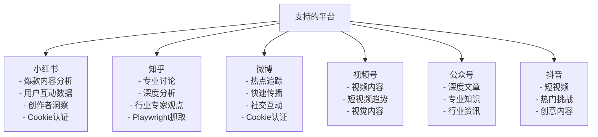
```mermaid
flowchart TD
Platforms[支持的平台] --> Xiaohongshu[小红书<br/>- 爆款内容分析<br/>- 用户互动数据<br/>- 创作者洞察<br/>- Cookie认证]
Platforms --> Zhihu[知乎<br/>- 专业讨论<br/>- 深度分析<br/>- 行业专家观点<br/>- Playwright抓取]
Platforms --> Weibo[微博<br/>- 热点追踪<br/>- 快速传播<br/>- 社交互动<br/>- Cookie认证]
Platforms --> VideoAccount[视频号<br/>- 视频内容<br/>- 短视频趋势<br/>- 视觉内容]
Platforms --> OfficialAccount[公众号<br/>- 深度文章<br/>- 专业知识<br/>- 行业资讯]
Platforms --> Douyin[抖音<br/>- 短视频<br/>- 热门挑战<br/>- 创意内容]
```

**图表来源**
- [open_notebook/skills/multi_platform_ai_researcher/multi_platform_ai_researcher.py](file://open_notebook/skills/multi_platform_ai_researcher/multi_platform_ai_researcher.py#L22-L30)

### 执行流程

跨平台AI工具研究员的完整执行流程：

```mermaid
sequenceDiagram
participant User as "用户"
participant Researcher as "MultiPlatformAIResearcher"
participant Collector as "平台收集器"
participant Identifier as "AI工具识别器"
participant Reporter as "报告生成器"
participant FeishuSync as "飞书同步服务"
User->>Researcher : 调用execute(params)
Researcher->>Researcher : 解析参数
Researcher->>Collector : 遍历平台收集
loop 每个平台
Collector->>Collector : collect_from_platform()
Collector->>Collector : _collect_xiaohongshu/_collect_zhihu/_collect_weibo
Collector-->>Researcher : 返回平台数据
end
Researcher->>Identifier : identify_ai_tools(all_content)
Identifier-->>Researcher : 返回AI工具相关内容
Researcher->>Reporter : generate_daily_report()
Reporter-->>Researcher : 返回结构化报告
alt 需要同步到飞书
Researcher->>FeishuSync : sync_to_feishu(report, webhook_url, app_id, app_secret)
FeishuSync-->>Researcher : 返回同步结果
end
Researcher-->>User : 返回执行结果
```

**图表来源**
- [open_notebook/skills/multi_platform_ai_researcher/multi_platform_ai_researcher.py](file://open_notebook/skills/multi_platform_ai_researcher/multi_platform_ai_researcher.py#L430-L505)

**章节来源**
- [open_notebook/skills/multi_platform_ai_researcher/multi_platform_ai_researcher.py](file://open_notebook/skills/multi_platform_ai_researcher/multi_platform_ai_researcher.py#L19-L623)

## 小红书研究员

**重大更新** 新增专门的小红书研究员技能，专注于小红书平台的内容分析和洞察提取。

### XiaohongshuResearcherSkill - 小红书研究员

XiaohongshuResearcherSkill是专门针对小红书平台的内容研究技能，提供专业的数据分析能力：

```mermaid
classDiagram
class XiaohongshuResearcherSkill {
+string base_url
+string search_url
+Browser browser
+Page page
+initialize() void
+close() void
+search_keyword(keyword, max_results) List
+extract_note_data(card_element) Dict
+analyze_patterns(notes) List
+save_to_notebook(keyword, notes, insights) int
+execute(params) Dict
}
class PlaywrightBrowser {
+async_playwright() AsyncPlaywright
+launch(headless, args) Browser
+new_page(viewport) Page
+set_extra_http_headers(headers) void
}
class FlexibleSelectors {
+List note_selectors
+List title_selectors
+List author_selectors
+List engagement_selectors
}
class PatternAnalyzer {
+analyze_patterns(notes) List
+analyze_title_patterns(titles) List
+analyze_engagement_distribution(notes) List
+extract_top_authors(notes) List
}
XiaohongshuResearcherSkill --> PlaywrightBrowser : "使用"
XiaohongshuResearcherSkill --> FlexibleSelectors : "使用"
XiaohongshuResearcherSkill --> PatternAnalyzer : "使用"
```

**图表来源**
- [open_notebook/skills/xiaohongshu_researcher/skill.py](file://open_notebook/skills/xiaohongshu_researcher/skill.py#L20-L405)

### Playwright浏览器自动化

系统使用Playwright实现可靠的浏览器自动化：

```mermaid
flowchart TD
BrowserInit[浏览器初始化] --> LaunchChromium["启动Chromium浏览器<br/>- headless=False调试模式<br/>- 禁用自动化检测<br/>- 禁用沙盒模式"]
LaunchChromium --> CreatePage["创建新页面<br/>- 设置视口尺寸<br/>- 配置用户代理"]
CreatePage --> SetHeaders["设置额外HTTP头<br/>- User-Agent伪装<br/>- 避免反爬检测"]
SetHeaders --> Navigate["导航到搜索页面<br/>- 等待网络空闲<br/>- 页面加载等待"]
Navigate --> Scroll["滚动页面加载更多内容<br/>- 多次滚动<br/>- 等待内容加载"]
Scroll --> ExtractCards["提取笔记卡片<br/>- 多种选择器策略<br/>- 选择器优先级<br/>- 失败回退机制"]
ExtractCards --> ExtractData["提取笔记数据<br/>- 标题提取<br/>- 作者信息<br/>- 互动数据<br/>- 链接处理"]
ExtractData --> CloseBrowser["关闭浏览器<br/>- 资源清理<br/>- 内存释放"]
```

**图表来源**
- [open_notebook/skills/xiaohongshu_researcher/skill.py](file://open_notebook/skills/xiaohongshu_researcher/skill.py#L29-L120)

### 智能选择器策略

系统实现了多层选择器策略，确保数据提取的可靠性：

```mermaid
classDiagram
class SelectorStrategies {
+List note_selectors
+List title_selectors
+List author_selectors
+List engagement_selectors
}
class FlexibleExtraction {
+extract_with_multiple_strategies(element, selectors) str
+try_alternative_selectors(element, fallback_selectors) str
+fallback_to_generic_selectors(element) List
+extract_numbers_from_text(text) List
}
class DataCleaner {
+clean_number_format(count) int
+clean_text(text) str
+extract_keyword_from_data(data) str
}
SelectorStrategies --> FlexibleExtraction : "使用"
FlexibleExtraction --> DataCleaner : "使用"
```

**图表来源**
- [open_notebook/skills/xiaohongshu_researcher/skill.py](file://open_notebook/skills/xiaohongshu_researcher/skill.py#L78-L218)

### 洞察分析功能

系统能够从收集的数据中提取有价值的洞察：

```mermaid
flowchart TD
PatternAnalysis[模式分析] --> TitlePatterns["标题模式分析<br/>- 数字使用频率<br/>- 情绪词汇分析<br/>- 高赞内容特征"]
PatternAnalysis --> EngagementDistribution["互动分布分析<br/>- 平均点赞数<br/>- 平均收藏数<br/>- 收藏/点赞比率"]
PatternAnalysis --> AuthorInsights["创作者洞察<br/>- 活跃创作者识别<br/>- 内容质量评估<br/>- 影响力分析"]
PatternAnalysis --> TrendAnalysis["趋势分析<br/>- 内容热度变化<br/>- 平台分布<br/>- 时间趋势"]
```

**图表来源**
- [open_notebook/skills/xiaohongshu_researcher/skill.py](file://open_notebook/skills/xiaohongshu_researcher/skill.py#L220-L271)

### 执行流程

小红书研究员的完整执行流程：

```mermaid
sequenceDiagram
participant User as "用户"
participant Researcher as "XiaohongshuResearcherSkill"
participant Browser as "Playwright浏览器"
participant Analyzer as "模式分析器"
User->>Researcher : 调用execute(params)
Researcher->>Researcher : 初始化浏览器
Researcher->>Browser : initialize()
Browser-->>Researcher : 浏览器就绪
Researcher->>Researcher : 遍历关键词
loop 每个关键词
Researcher->>Browser : search_keyword(keyword, max_results)
Browser->>Browser : 导航搜索页面
Browser->>Browser : 滚动加载内容
Browser->>Browser : 提取笔记卡片
Browser->>Browser : 提取笔记数据
Browser-->>Researcher : 返回笔记列表
end
Researcher->>Analyzer : analyze_patterns(notes)
Analyzer-->>Researcher : 返回洞察列表
Researcher->>Researcher : save_to_notebook(keyword, notes, insights)
Researcher-->>User : 返回执行结果
```

**图表来源**
- [open_notebook/skills/xiaohongshu_researcher/skill.py](file://open_notebook/skills/xiaohongshu_researcher/skill.py#L331-L380)

**章节来源**
- [open_notebook/skills/xiaohongshu_researcher/skill.py](file://open_notebook/skills/xiaohongshu_researcher/skill.py#L1-L405)

## Feishu同步服务

**重大更新** 新增完整的飞书同步服务，支持将AI工具研究报告直接同步到飞书机器人和云文档。

### FeishuSyncService - 飞书同步服务

FeishuSyncService是专门负责将研究报告和数据同步到飞书平台的服务：

```mermaid
classDiagram
class FeishuSyncService {
+Optional~str~ webhook_url
+Optional~str~ app_id
+Optional~str~ app_secret
+Optional~str~ access_token
+Optional~datetime~ token_expires_at
+send_daily_report(report, chat_webhook) bool
+upload_data_to_cloud_sheet(items, sheet_token) bool
+_format_report_message(report) Dict
+_get_access_token() Optional~str~
}
class FeishuMessageFormatter {
+_format_report_message(report) Dict
+_format_report_elements(report) List
+_format_summary_section(summary) List
+_format_trending_tools(trending_tools) List
+_format_insights_section(insights) List
}
class FeishuCloudSheetUploader {
+upload_data_to_cloud_sheet(items, sheet_token) bool
+prepare_records_for_upload(items) List
+batch_upload_records(records, sheet_token) bool
}
class FeishuAuthManager {
+_get_access_token() Optional~str~
+_refresh_access_token() bool
+check_token_validity() bool
}
FeishuSyncService --> FeishuMessageFormatter : "使用"
FeishuSyncService --> FeishuCloudSheetUploader : "使用"
FeishuSyncService --> FeishuAuthManager : "使用"
```

**图表来源**
- [open_notebook/skills/multi_platform_ai_researcher/feishu_sync.py](file://open_notebook/skills/multi_platform_ai_researcher/feishu_sync.py#L15-L330)

### 飞书机器人消息格式

系统支持富文本卡片消息格式，提供美观的报告展示：

```mermaid
flowchart TD
MessageFormat[飞书消息格式] --> Header[消息头<br/>- 标题: AI 工具集日报 - {date}<br/>- 模板: blue]
MessageFormat --> Summary[今日概览<br/>- 内容总数<br/>- 覆盖平台<br/>- 总互动量]
MessageFormat --> TrendingTools[热门AI工具<br/>- 工具名称<br/>- 提及次数<br/>- 排名序号]
MessageFormat --> Insights[核心洞察<br/>- 关键发现<br/>- 行动建议<br/>- 趋势分析]
MessageFormat --> Footer[底部信息<br/>- 数据同步提示<br/>- 知识库链接]
```

**图表来源**
- [open_notebook/skills/multi_platform_ai_researcher/feishu_sync.py](file://open_notebook/skills/multi_platform_ai_researcher/feishu_sync.py#L85-L165)

### 云文档数据上传

系统支持将收集的数据上传到飞书云文档（多维表格）：

```mermaid
flowchart TD
CloudSheetUpload[云文档上传] --> Auth[认证获取<br/>- 获取access_token<br/>- 检查token有效期<br/>- 自动刷新机制]
CloudSheetUpload --> PrepareRecords[准备记录<br/>- 字段映射<br/>- 数据清洗<br/>- 格式转换]
CloudSheetUpload --> BatchUpload[批量上传<br/>- 100条/批<br/>- 异步请求<br/>- 错误处理]
CloudSheetUpload --> Success[上传成功<br/>- 记录数量<br/>- 上传时间<br/>- 状态日志]
```

**图表来源**
- [open_notebook/skills/multi_platform_ai_researcher/feishu_sync.py](file://open_notebook/skills/multi_platform_ai_researcher/feishu_sync.py#L167-L242)

### 认证和令牌管理

系统实现了完整的飞书认证和令牌管理机制：

```mermaid
flowchart TD
AuthFlow[认证流程] --> CheckToken["检查令牌<br/>- 检查access_token<br/>- 验证过期时间<br/>- 5分钟提前刷新"]
AuthFlow --> |需要刷新| RequestToken["请求新令牌<br/>- app_id + app_secret<br/>- 2小时有效期<br/>- 缓存过期时间"]
AuthFlow --> |已有令牌| UseToken["使用现有令牌<br/>- 验证有效性<br/>- 继续执行操作"]
RequestToken --> StoreToken["存储令牌<br/>- 保存access_token<br/>- 设置过期时间<br/>- 记录日志"]
StoreToken --> UseToken
```

**图表来源**
- [open_notebook/skills/multi_platform_ai_researcher/feishu_sync.py](file://open_notebook/skills/multi_platform_ai_researcher/feishu_sync.py#L244-L288)

**章节来源**
- [open_notebook/skills/multi_platform_ai_researcher/feishu_sync.py](file://open_notebook/skills/multi_platform_ai_researcher/feishu_sync.py#L1-L330)

## 平台连接器系统

**重大更新** 平台连接器系统已重构为模块化架构，支持多种平台的认证和数据获取，包括完整的Zhihu和Weibo连接器实现。

### 平台连接器基类

平台连接器系统基于统一的基类设计，提供标准化的接口规范：

```mermaid
classDiagram
class BasePlatformConnector {
+PlatformAccount account
+Optional~httpx.AsyncClient~ client
+authenticate() bool
+fetch_content_list(since, limit) List
+fetch_content_detail(content_id) Optional
+fetch_analytics() Optional
+test_connection() Tuple
+normalize_content(raw_data) PlatformContent
}
class PlatformAccount {
+string username
+string platform
+Dict auth_data
+bool is_authenticated
+string display_name
+string avatar_url
+save() bool
}
class PlatformContent {
+string content_id
+PlatformType platform
+string platform_username
+string title
+string content_text
+string content_type
+List media_urls
+Optional~datetime~ created_at
+Optional~datetime~ updated_at
+int likes
+int comments
+int shares
+int views
+string platform_url
+Dict raw_data
}
class PlatformAnalytics {
+PlatformType platform
+string username
+int followers_count
+int total_posts
+float avg_likes
+float avg_comments
+float avg_shares
+float engagement_rate
+List top_post_ids
}
BasePlatformConnector --> PlatformAccount : "使用"
BasePlatformConnector --> PlatformContent : "生成"
BasePlatformConnector --> PlatformAnalytics : "生成"
```

**图表来源**
- [open_notebook/domain/platform_connector.py](file://open_notebook/domain/platform_connector.py#L420-L447)

### Xiaohongshu连接器

Xiaohongshu连接器提供完整的Cookie认证和内容获取功能：

```mermaid
classDiagram
class XiaohongshuConnector {
+BASE_URL : str
+API_URL : str
+Dict cookies
+get_user_profile() Dict
+fetch_content_list(since, limit) List
+fetch_content_detail(content_id) Optional
+fetch_analytics() Optional
+test_connection() Tuple
+_parse_note(note_data) PlatformContent
}
class XiaohongshuAuth {
+get_client() httpx.AsyncClient
+authenticate() bool
+get_user_profile() Dict
}
class XiaohongshuContentExtractor {
+_parse_note(note_data) PlatformContent
+extract_media_urls(note) List
+extract_engagement_metrics(interact_info) Dict
+parse_timestamp(time) datetime
}
XiaohongshuConnector --> XiaohongshuAuth : "使用"
XiaohongshuConnector --> XiaohongshuContentExtractor : "使用"
```

**图表来源**
- [open_notebook/skills/connectors/xiaohongshu_connector.py](file://open_notebook/skills/connectors/xiaohongshu_connector.py#L32-L312)

### Weibo连接器

Weibo连接器支持基于Cookie的微博内容抓取和分析：

```mermaid
classDiagram
class WeiboConnector {
+BASE_URL : str
+API_URL : str
+Optional~httpx.AsyncClient~ client
+Optional~str~ uid
+get_user_profile() Dict
+fetch_content_list(since, limit) List
+fetch_content_detail(content_id) Optional
+fetch_analytics() Optional
+test_connection() Tuple
+_parse_weibo(weibo_data) PlatformContent
}
class WeiboAuth {
+get_client() httpx.AsyncClient
+authenticate() bool
+get_user_profile() Dict
}
class WeiboContentExtractor {
+_parse_weibo(weibo_data) PlatformContent
+extract_media_urls(weibo_data) List
+extract_engagement_metrics(weibo_data) Dict
+parse_timestamp(created_at_str) datetime
}
WeiboConnector --> WeiboAuth : "使用"
WeiboConnector --> WeiboContentExtractor : "使用"
```

**图表来源**
- [open_notebook/skills/connectors/weibo_connector.py](file://open_notebook/skills/connectors/weibo_connector.py#L25-L332)

### Zhihu连接器

**新增** Zhihu连接器基于Playwright实现完整的知乎内容收集：

```mermaid
classDiagram
class ZhihuConnector {
+BASE_URL : str
+API_URL : str
+Optional~httpx.AsyncClient~ client
+get_user_profile() Dict
+fetch_content_list(since, limit) List
+fetch_content_detail(content_id) Optional
+fetch_analytics() Optional
+test_connection() Tuple
+_parse_zhihu(zhihu_data) PlatformContent
}
class ZhihuAuth {
+get_client() httpx.AsyncClient
+authenticate() bool
+get_user_profile() Dict
}
class ZhihuContentExtractor {
+_parse_zhihu(zhihu_data) PlatformContent
+extract_engagement_metrics(zhihu_data) Dict
+parse_timestamp(time) datetime
+extract_media_urls(zhihu_data) List
}
ZhihuConnector --> ZhihuAuth : "使用"
ZhihuConnector --> ZhihuContentExtractor : "使用"
```

**图表来源**
- [open_notebook/skills/multi_platform_ai_researcher/multi_platform_ai_researcher.py](file://open_notebook/skills/multi_platform_ai_researcher/multi_platform_ai_researcher.py#L109-L186)

### 平台配置管理

系统支持多种平台的配置和特性管理：

```mermaid
flowchart TD
PlatformConfigs[平台配置] --> XiaohongshuConfig["小红书配置<br/>- 认证类型: Cookie<br/>- 内容类型: note, video<br/>- 速率限制: 100/hour<br/>- 特性: content_sync, analytics, engagement"]
PlatformConfigs --> WeiboConfig["微博配置<br/>- 认证类型: Cookie<br/>- 内容类型: post, article, video<br/>- 速率限制: 300/hour<br/>- 特性: content_sync, analytics, engagement"]
PlatformConfigs --> WechatOfficialConfig["微信公众号配置<br/>- 认证类型: API Key<br/>- 内容类型: article<br/>- 速率限制: 5000/day<br/>- 特性: content_sync, analytics"]
PlatformConfigs --> ZhihuConfig["知乎配置<br/>- 认证类型: Cookie<br/>- 内容类型: answer, article<br/>- 速率限制: 200/hour<br/>- 特性: content_sync, analytics, engagement"]
```

**图表来源**
- [open_notebook/domain/platform_connector.py](file://open_notebook/domain/platform_connector.py#L420-L447)

**章节来源**
- [open_notebook/skills/connectors/xiaohongshu_connector.py](file://open_notebook/skills/connectors/xiaohongshu_connector.py#L1-L312)
- [open_notebook/skills/connectors/weibo_connector.py](file://open_notebook/skills/connectors/weibo_connector.py#L1-L332)
- [open_notebook/skills/multi_platform_ai_researcher/multi_platform_ai_researcher.py](file://open_notebook/skills/multi_platform_ai_researcher/multi_platform_ai_researcher.py#L109-L186)
- [open_notebook/domain/platform_connector.py](file://open_notebook/domain/platform_connector.py#L420-L447)

## 每日报告生成器

**重大更新** 新增每日AI工具报告生成器，提供结构化的研究报告和洞察分析。

### DailyReportGenerator - 每日报告生成器

DailyReportGenerator专门负责生成结构化的AI工具研究报告：

```mermaid
classDiagram
class DailyReportGenerator {
+Dict report_template
+generate(collected_items, date) Dict
+_is_from_date(item, date) bool
+_generate_summary(items) Dict
+_analyze_by_platform(items) Dict
+_extract_trending_tools(items) List
+_identify_hot_topics(items) List
+_generate_insights(items) List
+_generate_recommendations(items) List
+export_markdown(report, output_path) str
}
class ReportTemplate {
+Dict title
+Dict date
+Dict summary
+Dict platform_breakdown
+Dict trending_tools
+Dict hot_topics
+Dict insights
+Dict recommendations
+Dict raw_data
}
class InsightGenerator {
+_generate_insights(items) List
+_generate_recommendations(items) List
+analyze_engagement_highlights(items) List
+analyze_platform_activity(items) List
+analyze_content_freshness(items) List
}
DailyReportGenerator --> ReportTemplate : "使用"
DailyReportGenerator --> InsightGenerator : "使用"
```

**图表来源**
- [open_notebook/skills/multi_platform_ai_researcher/daily_report_generator.py](file://open_notebook/skills/multi_platform_ai_researcher/daily_report_generator.py#L14-L329)

### 报告结构设计

系统生成的报告包含完整的结构化信息：

```mermaid
flowchart TD
Report[每日AI工具报告] --> Header[报告头部<br/>- 标题<br/>- 生成时间<br/>- 日期]
Report --> Summary[今日概览<br/>- 内容总数<br/>- 覆盖平台<br/>- 总互动量<br/>- 平均互动]
Report --> TrendingTools[热门AI工具<br/>- 工具名称<br/>- 提及次数<br/>- 趋势标识]
Report --> HotTopics[热门话题<br/>- 话题分类<br/>- 关键词分析<br/>- 热度排序]
Report --> PlatformBreakdown[平台分布<br/>- 平台统计<br/>- 互动分析<br/>- 内容排行]
Report --> Insights[核心洞察<br/>- 高互动内容<br/>- 平台活动<br/>- 内容新鲜度]
Report --> Recommendations[行动建议<br/>- 工具关注<br/>- 内容创作建议<br/>- 知识整理]
Report --> RawData[原始数据<br/>- 原始内容<br/>- 采集时间<br/>- 平台来源]
```

**图表来源**
- [open_notebook/skills/multi_platform_ai_researcher/daily_report_generator.py](file://open_notebook/skills/multi_platform_ai_researcher/daily_report_generator.py#L18-L69)

### 洞察生成算法

系统使用多种算法生成有价值的洞察：

```mermaid
flowchart TD
InsightGeneration[洞察生成] --> EngagementAnalysis["互动分析<br/>- 高互动内容识别<br/>- 互动阈值设定<br/>- 内容质量评估"]
InsightGeneration --> PlatformActivity["平台活动分析<br/>- 平台贡献度<br/>- 活跃度比较<br/>- 趋势识别"]
InsightGeneration --> ContentFreshness["内容新鲜度分析<br/>- 采集时间分析<br/>- 内容时效性<br/>- 采集团队建议"]
InsightGeneration --> ToolTrends["工具趋势分析<br/>- 工具提及统计<br/>- 趋势识别<br/>- 关注建议"]
```

**图表来源**
- [open_notebook/skills/multi_platform_ai_researcher/daily_report_generator.py](file://open_notebook/skills/multi_platform_ai_researcher/daily_report_generator.py#L207-L273)

### Markdown导出功能

系统支持将报告导出为Markdown格式：

```mermaid
flowchart TD
ExportProcess[导出流程] --> GenerateContent["生成Markdown内容<br/>- 标题格式化<br/>- 内容结构化<br/>- 样式应用"]
GenerateContent --> WriteFile["写入文件<br/>- 文件路径<br/>- 编码设置<br/>- 权限处理"]
WriteFile --> LogResult["记录导出结果<br/>- 文件路径<br/>- 大小信息<br/>- 时间戳"]
```

**图表来源**
- [open_notebook/skills/multi_platform_ai_researcher/daily_report_generator.py](file://open_notebook/skills/multi_platform_ai_researcher/daily_report_generator.py#L275-L328)

**章节来源**
- [open_notebook/skills/multi_platform_ai_researcher/daily_report_generator.py](file://open_notebook/skills/multi_platform_ai_researcher/daily_report_generator.py#L1-L329)

## AI工具调度器

**重大更新** 新增AI工具调度器，支持定时自动执行AI工具研究任务。

### DailyReportScheduler - 每日报告调度器

DailyReportScheduler负责管理AI工具研究的定时执行：

```mermaid
classDiagram
class DailyReportScheduler {
+bool is_running
+datetime next_run_time
+run_daily_report(platforms, keywords, max_results, save_to_notebook) Dict
+start_scheduler(run_time, timezone) void
}
class TaskScheduler {
+time run_time
+str timezone
+bool is_running
+datetime next_run_time
+schedule_task() void
+execute_task() Dict
}
class AutoResearchExecutor {
+Dict default_platforms
+List default_keywords
+int default_max_results
+bool default_save_to_notebook
+execute_scheduled_research() Dict
}
DailyReportScheduler --> TaskScheduler : "使用"
DailyReportScheduler --> AutoResearchExecutor : "委托"
```

**图表来源**
- [open_notebook/skills/multi_platform_ai_researcher/ai_tools_scheduler.py](file://open_notebook/skills/multi_platform_ai_researcher/ai_tools_scheduler.py#L15-L126)

### 调度策略

系统支持灵活的调度策略：

```mermaid
flowchart TD
Scheduler[调度器] --> CheckTime["检查当前时间<br/>- 获取当前时间<br/>- 计算下次运行时间<br/>- 判断是否需要等待"]
CheckTime --> SleepCalculation["睡眠时间计算<br/>- 计算等待秒数<br/>- 处理跨日情况<br/>- 精确时间控制"]
SleepCalculation --> Sleep["睡眠等待<br/>- 异步等待<br/>- 状态监控<br/>- 中断处理"]
Sleep --> ExecuteTask["执行任务<br/>- 调用研究器<br/>- 处理异常<br/>- 记录结果"]
ExecuteTask --> ScheduleNext["安排下一次运行<br/>- 计算下次时间<br/>- 更新状态<br/>- 继续循环"]
```

**图表来源**
- [open_notebook/skills/multi_platform_ai_researcher/ai_tools_scheduler.py](file://open_notebook/skills/multi_platform_ai_researcher/ai_tools_scheduler.py#L70-L106)

### 默认配置

系统提供合理的默认配置：

```mermaid
flowchart TD
DefaultConfig[默认配置] --> Platforms["平台配置<br/>- 小红书必需<br/>- 知乎可选<br/>- 微博可选"]
DefaultConfig --> Keywords["关键词配置<br/>- 一人公司 AI 工具<br/>- solo 创业 AI<br/>- AI 效率工具<br/>- AIGC 工具"]
DefaultConfig --> Results["结果配置<br/>- 每平台20条结果<br/>- 自动生成报告<br/>- 保存到笔记本"]
DefaultConfig --> Time["时间配置<br/>- 默认9:00 AM<br/>- 亚洲/上海时区<br/>- 每日执行"]
```

**图表来源**
- [open_notebook/skills/multi_platform_ai_researcher/ai_tools_scheduler.py](file://open_notebook/skills/multi_platform_ai_researcher/ai_tools_scheduler.py#L44-L59)

**章节来源**
- [open_notebook/skills/multi_platform_ai_researcher/ai_tools_scheduler.py](file://open_notebook/skills/multi_platform_ai_researcher/ai_tools_scheduler.py#L1-L126)

## 技能包重构

**重大更新** 技能系统进行了重构，将相关技能模块化组织，提高了代码的可维护性和可扩展性。

### 模块化组织结构

重构后的技能包采用清晰的模块化结构：

```mermaid
graph TB
subgraph "技能包重构"
Skills[open_notebook/skills/] --> Base[base.py<br/>基础类定义]
Skills --> Registry[registry.py<br/>技能注册表]
Skills --> Runner[runner.py<br/>执行引擎]
Skills --> Scheduler[scheduler.py<br/>调度器]
Skills --> MultiPlatform[skills/multi_platform_ai_researcher/<br/>跨平台AI工具研究技能]
Skills --> Xiaohongshu[skills/xiaohongshu_researcher/<br/>小红书研究技能]
Skills --> Connectors[skills/connectors/<br/>平台连接器系统]
Skills --> Workflows[workflows/<br/>工作流编排系统]
Skills --> Vikki[vikki_content_ops.py<br/>Vikki内容运营技能]
end
subgraph "跨平台AI工具研究技能包"
MultiPlatform --> Researcher[multi_platform_ai_researcher.py<br/>主研究员类]
MultiPlatform --> Scheduler[ai_tools_scheduler.py<br/>调度器]
MultiPlatform --> ReportGen[daily_report_generator.py<br/>报告生成器]
MultiPlatform --> FeishuSync[feishu_sync.py<br/>飞书同步服务]
MultiPlatform --> SkillYAML[skill.yaml<br/>技能配置]
MultiPlatform --> Init[__init__.py<br/>导出接口]
end
subgraph "平台连接器系统"
Connectors --> XiaohongshuConnector[xiaohongshu_connector.py<br/>小红书连接器]
Connectors --> WeiboConnector[weibo_connector.py<br/>微博连接器]
Connectors --> ZhihuConnector[zhihu_connector.py<br/>知乎连接器]
Connectors --> PlatformBase[platform_connector.py<br/>平台连接器基类]
end
subgraph "小红书研究技能包"
Xiaohongshu --> Skill[skill.py<br/>研究员类]
Xiaohongshu --> SkillYAML2[skill.yaml<br/>技能配置]
Xiaohongshu --> Init2[__init__.py<br/>导出接口]
end
```

**图表来源**
- [open_notebook/skills/multi_platform_ai_researcher/__init__.py](file://open_notebook/skills/multi_platform_ai_researcher/__init__.py#L1-L15)
- [open_notebook/skills/xiaohongshu_researcher/__init__.py](file://open_notebook/skills/xiaohongshu_researcher/__init__.py#L1-L6)
- [open_notebook/skills/connectors/__init__.py](file://open_notebook/skills/connectors/__init__.py#L1-L10)

### 技能配置文件

每个技能包都包含完整的配置文件，支持Claude技能集成：

```mermaid
classDiagram
class SkillConfig {
+string name
+string version
+string description
+List tags
+List categories
+List requirements
+Dict input_schema
+Dict output_schema
+List examples
+string license
+string repository
+string documentation
}
class MultiPlatformConfig {
+string name : "multi-platform-ai-tools-researcher"
+string version : "1.0.0"
+string description : "跨平台AI工具研究技能"
+List tags : ["research", "ai-tools", "multi-platform"]
+List categories : ["Research & Analysis", "Productivity"]
+Dict input_schema : 平台、关键词、结果数等参数
+Dict output_schema : 收集数量、报告等输出
+Dict requirements : ["playwright>=1.40.0", "beautifulsoup4>=4.12.0"]
}
class XiaohongshuConfig {
+string name : "xiaohongshu-researcher"
+string version : "1.0.0"
+string description : "小红书内容研究技能"
+List tags : ["research", "xiaohongshu", "social-media"]
+List categories : ["Research & Analysis", "Content Creation"]
+Dict input_schema : 关键词、结果数等参数
+Dict output_schema : 笔记数、洞察等输出
}
class FeishuConfig {
+string name : "feishu-sync-service"
+string version : "1.0.0"
+string description : "飞书同步服务"
+List tags : ["integration", "communication", "automation"]
+List categories : ["Integration", "Communication"]
+Dict input_schema : webhook_url, app_id, app_secret等参数
+Dict output_schema : 同步状态、上传结果等输出
}
SkillConfig <|-- MultiPlatformConfig
SkillConfig <|-- XiaohongshuConfig
SkillConfig <|-- FeishuConfig
```

**图表来源**
- [open_notebook/skills/multi_platform_ai_researcher/skill.yaml](file://open_notebook/skills/multi_platform_ai_researcher/skill.yaml#L1-L207)
- [open_notebook/skills/xiaohongshu_researcher/skill.yaml](file://open_notebook/skills/xiaohongshu_researcher/skill.yaml#L1-L102)

### 导出接口设计

重构后的导出接口更加清晰：

```mermaid
classDiagram
class MultiPlatformExports {
+MultiPlatformAIResearcher
+research_ai_tools
}
class XiaohongshuExports {
+XiaohongshuResearcherSkill
+research_xiaohongshu
}
class PlatformConnectorExports {
+XiaohongshuConnector
+WeiboConnector
+ZhihuConnector
}
class SkillPackage {
+__all__ : List
+import * from .multi_platform_ai_researcher
+import * from .xiaohongshu_researcher
+import * from .connectors
}
MultiPlatformExports --> SkillPackage
XiaohongshuExports --> SkillPackage
PlatformConnectorExports --> SkillPackage
```

**图表来源**
- [open_notebook/skills/multi_platform_ai_researcher/__init__.py](file://open_notebook/skills/multi_platform_ai_researcher/__init__.py#L9-L15)
- [open_notebook/skills/xiaohongshu_researcher/__init__.py](file://open_notebook/skills/xiaohongshu_researcher/__init__.py#L3-L6)
- [open_notebook/skills/connectors/__init__.py](file://open_notebook/skills/connectors/__init__.py#L1-L10)

**章节来源**
- [open_notebook/skills/multi_platform_ai_researcher/__init__.py](file://open_notebook/skills/multi_platform_ai_researcher/__init__.py#L1-L15)
- [open_notebook/skills/xiaohongshu_researcher/__init__.py](file://open_notebook/skills/xiaohongshu_researcher/__init__.py#L1-L6)
- [open_notebook/skills/connectors/__init__.py](file://open_notebook/skills/connectors/__init__.py#L1-L10)
- [open_notebook/skills/multi_platform_ai_researcher/skill.yaml](file://open_notebook/skills/multi_platform_ai_researcher/skill.yaml#L1-L207)
- [open_notebook/skills/xiaohongshu_researcher/skill.yaml](file://open_notebook/skills/xiaohongshu_researcher/skill.yaml#L1-L102)

## 工作流编排系统

**重大更新** 技能系统现已扩展为完整的工作流编排平台，支持多技能协同执行、条件判断、重试机制和执行监控等功能。

### 工作流引擎架构

工作流引擎是整个编排系统的核心，负责协调多个技能的执行和管理：

```mermaid
classDiagram
class WorkflowEngine {
+Set running_executions
+execute(workflow, input_data, trigger_type, triggered_by) WorkflowExecution
+_execute_workflow(workflow, execution, context) void
+_execute_step(step, workflow, execution, context) WorkflowStepExecution
+_get_ready_steps(steps, graph, completed, failed, skipped) List
+_evaluate_condition(condition, context) bool
+_build_dependency_graph(steps) Dict
+_detect_cycle(graph) List
+cancel(execution_id) bool
+is_running(execution_id) bool
}
class WorkflowContext {
+Dict input
+Dict steps
+Dict variables
+set_step_result(step_id, execution) void
+get_step_output(step_id) Dict
+resolve_template(template) Any
}
class WorkflowDefinition {
+string name
+string description
+bool enabled
+List steps
+Dict input_schema
+Dict output_mapping
+string schedule
+string target_notebook_id
}
class WorkflowExecution {
+string workflow_definition_id
+WorkflowStatus status
+string trigger_type
+string triggered_by
+Dict input_data
+Dict output
+List step_executions
+List created_source_ids
+List created_note_ids
+mark_completed(status, output, error) void
}
WorkflowEngine --> WorkflowDefinition : "执行"
WorkflowEngine --> WorkflowExecution : "创建"
WorkflowEngine --> WorkflowContext : "使用"
```

**图表来源**
- [open_notebook/workflows/engine.py](file://open_notebook/workflows/engine.py#L130-L620)
- [open_notebook/domain/workflow.py](file://open_notebook/domain/workflow.py#L68-L309)

### 工作流执行流程

工作流引擎实现了完整的执行生命周期管理：

```mermaid
sequenceDiagram
participant API as "API调用"
participant Service as "WorkflowService"
participant Engine as "WorkflowEngine"
participant Context as "WorkflowContext"
participant Skill as "技能实例"
API->>Service : execute_workflow(workflow_id, input_data)
Service->>Engine : execute(workflow, input_data)
Engine->>Engine : 创建WorkflowExecution
Engine->>Context : 初始化WorkflowContext
Engine->>Engine : 验证工作流定义
Engine->>Engine : 构建依赖图
Engine->>Engine : 查找就绪步骤
loop 直到所有步骤完成
Engine->>Engine : 并行执行就绪步骤
Engine->>Skill : run(context)
Skill-->>Engine : 返回WorkflowStepExecution
Engine->>Context : 更新步骤结果
Engine->>Engine : 检查依赖关系
end
Engine->>Engine : 构建最终输出
Engine->>Engine : 标记执行完成
Engine-->>Service : 返回WorkflowExecution
Service-->>API : 返回执行结果
```

**图表来源**
- [open_notebook/workflows/engine.py](file://open_notebook/workflows/engine.py#L144-L298)
- [open_notebook/workflows/service.py](file://open_notebook/workflows/service.py#L116-L142)

### 条件判断和重试机制

工作流支持复杂的条件判断和重试机制：

```mermaid
flowchart TD
Start([开始步骤执行]) --> CheckCondition{"检查条件表达式"}
CheckCondition --> |满足| CheckRetry{"检查重试次数"}
CheckCondition --> |不满足| SkipStep["跳过步骤<br/>标记为SKIPPED"]
SkipStep --> UpdateContext["更新执行上下文"]
UpdateContext --> NextSteps["继续下一个步骤"]
CheckRetry --> |有剩余重试| ExecuteStep["执行步骤"]
CheckRetry --> |无剩余重试| MarkFailed["标记为FAILED"]
MarkFailed --> UpdateContext
ExecuteStep --> StepSuccess{"步骤成功?"}
StepSuccess --> |是| MarkSuccess["标记为SUCCESS<br/>更新输出"]
StepSuccess --> |否| HasRetries{"还有重试机会?"}
HasRetries --> |是| WaitDelay["等待延迟时间"]
WaitDelay --> ExecuteStep
HasRetries --> |否| MarkFailed
MarkSuccess --> UpdateContext
UpdateContext --> NextSteps
```

**图表来源**
- [open_notebook/workflows/engine.py](file://open_notebook/workflows/engine.py#L416-L511)

### 模板变量解析

工作流支持模板变量解析，允许步骤间的数据传递：

```mermaid
classDiagram
class WorkflowContext {
+Dict input
+Dict steps
+Dict variables
+resolve_template(template) Any
+_resolve_string_template(template) Any
+_get_value_by_path(path) Any
}
class TemplateResolver {
+pattern : regex
+replacer(match) string
+full_match : re.fullmatch
}
WorkflowContext --> TemplateResolver : "使用"
note for WorkflowContext "支持的模板语法 : <br/>- {{input.field}} - 输入参数<br/>- {{steps.step_id.output.field}} - 步骤输出<br/>- {{vars.name}} - 工作流变量"
```

**图表来源**
- [open_notebook/workflows/engine.py](file://open_notebook/workflows/engine.py#L55-L127)

**章节来源**
- [open_notebook/workflows/engine.py](file://open_notebook/workflows/engine.py#L130-L620)
- [open_notebook/workflows/service.py](file://open_notebook/workflows/service.py#L22-L240)
- [open_notebook/domain/workflow.py](file://open_notebook/domain/workflow.py#L39-L309)

## Vikki内容运营技能

**重大更新** 新增Vikki内容运营技能，基于四象限内容策略理论，提供完整的IP内容运营自动化。

### PainpointScannerSkill - 痛点扫描器

PainpointScannerSkill是Vikki内容运营系统的核心组件，负责识别和分类用户痛点：

```mermaid
classDiagram
class PainpointScannerSkill {
+List source_ids
+List note_ids
+string text_content
+List painpoint_types
+int min_urgency_score
+int max_painpoints
+parameters_schema : Dict
+_detect_instant_painpoints(text) List
+_detect_continuous_painpoints(text) List
+_detect_hidden_painpoints(text) List
+_analyze_with_ai(content) List
+_fetch_content() string
+execute(context) SkillResult
+_format_results(painpoints, summary) string
}
class Painpoint {
+string text
+string type
+int urgency_score
+List indicators
+string user_scenario
+string note
}
class UrgencyKeywords {
+INSTANT_KEYWORDS : List
+CONTINUOUS_KEYWORDS : List
+HIDDEN_INDICATORS : List
}
PainpointScannerSkill --> Painpoint : "生成"
PainpointScannerSkill --> UrgencyKeywords : "使用"
```

**图表来源**
- [open_notebook/skills/vikki_content_ops.py](file://open_notebook/skills/vikki_content_ops.py#L30-L200)

### TopicGeneratorSkill - 主题生成器

基于扫描的痛点生成高ROI内容主题：

```mermaid
flowchart TD
Start([开始主题生成]) --> AnalyzePainpoints["分析痛点数据<br/>- 按象限分类<br/>- 计算优先级<br/>- 识别趋势"]
AnalyzePainpoints --> FilterQuadrants["筛选目标象限<br/>- 基于账户阶段<br/>- 考虑内容类型<br/>- 评估ROI潜力"]
FilterQuadrants --> GenerateTopics["生成内容主题<br/>- 基于痛点描述<br/>- 结合行业背景<br/>- 考虑受众需求"]
GenerateTopics --> RankTopics["主题排序<br/>- ROI评分<br/>- 内容难度<br/>- 竞争程度"]
RankTopics --> CreateCalendar["生成内容日历<br/>- 时间安排<br/>- 内容组合<br/>- 平台分配"]
CreateCalendar --> Output["输出结果<br/>- 优先主题列表<br/>- 内容日历<br/>- 执行建议"]
```

**图表来源**
- [open_notebook/skills/vikki_content_ops.py](file://open_notebook/skills/vikki_content_ops.py#L1200-L1400)

### ContentAdaptorSkill - 内容适配器

将生成的主题适配到不同社交平台：

```mermaid
classDiagram
class ContentAdaptorSkill {
+string source_content
+List target_platforms
+string content_style
+bool include_cta
+PLATFORM_CONFIGS : Dict
+_adapt_with_ai(content, platform) Dict
+_fetch_source_content() string
+execute(context) SkillResult
+_format_adaptations(adaptations, original) string
}
class PlatformConfig {
+int max_length
+string style
+int hashtag_count
+string media_suggestion
}
ContentAdaptorSkill --> PlatformConfig : "使用"
```

**图表来源**
- [open_notebook/skills/vikki_content_ops.py](file://open_notebook/skills/vikki_content_ops.py#L1200-L1400)

### CycleDiagnosticianSkill - 生命周期诊断器

根据账户发展阶段提供内容策略建议：

```mermaid
flowchart TD
Start([开始生命周期诊断]) --> CollectMetrics["收集账户指标<br/>- 关注者数量<br/>- 增长趋势<br/>- 互动率<br/>- 内容表现"]
CollectMetrics --> AnalyzeStage["分析生命周期阶段<br/>- 起号期: 0-1000粉丝<br/>- 破圈期: 快速增长<br/>- 稳定期: 稳定增长<br/>- 转化期: 注重转化"]
AnalyzeStage --> RecommendStrategy["推荐内容策略<br/>- 不同阶段重点<br/>- 象限内容分布<br/>- 平台选择建议"]
RecommendStrategy --> Output["输出诊断报告<br/>- 当前阶段<br/>- 策略建议<br/>- 执行计划"]
```

**图表来源**
- [open_notebook/skills/vikki_content_ops.py](file://open_notebook/skills/vikki_content_ops.py#L1372-L1400)

**章节来源**
- [open_notebook/skills/vikki_content_ops.py](file://open_notebook/skills/vikki_content_ops.py#L30-L200)
- [open_notebook/skills/vikki_content_ops.py](file://open_notebook/skills/vikki_content_ops.py#L1200-L1400)
- [open_notebook/skills/vikki_content_ops.py](file://open_notebook/skills/vikki_content_ops.py#L1372-L1376)

## 自然语言工作流生成

**重大更新** 新增AI驱动的自然语言工作流生成能力，允许用户通过自然语言描述创建复杂的工作流。

### ConversationalWorkflowBuilder - 会话式工作流构建器

AI驱动的工作流生成器，能够理解用户意图并生成相应的工作流定义：

```mermaid
classDiagram
class ConversationalWorkflowBuilder {
+List available_skills
+generate_from_prompt(user_prompt, conversation_history) Dict
+refine_workflow(current_definition, refinement_request, conversation_history) Dict
+_build_system_prompt() string
+_extract_json_from_markdown(content) Dict
+_validate_workflow_definition(definition) Dict
}
class WorkflowDefinition {
+string name
+string description
+List steps
+Dict input_schema
+Dict output_mapping
}
class SystemPrompt {
+String CONVERSATIONAL_SYSTEM_PROMPT
+build_available_skills_text() string
}
ConversationalWorkflowBuilder --> WorkflowDefinition : "生成"
ConversationalWorkflowBuilder --> SystemPrompt : "使用"
```

**图表来源**
- [open_notebook/workflows/conversational.py](file://open_notebook/workflows/conversational.py#L104-L426)

### 工作流生成流程

```mermaid
sequenceDiagram
participant User as "用户"
participant Builder as "ConversationalWorkflowBuilder"
participant AI as "AI模型"
participant Validator as "验证器"
User->>Builder : 输入自然语言描述
Builder->>Builder : 构建系统提示词
Builder->>AI : 发送消息请求
AI->>AI : 生成JSON工作流定义
AI-->>Builder : 返回工作流定义
Builder->>Validator : 验证工作流定义
Validator->>Validator : 检查步骤有效性
Validator->>Validator : 验证依赖关系
Validator-->>Builder : 返回验证结果
Builder-->>User : 显示工作流设计
User->>Builder : 确认或修改
Builder->>Builder : 生成最终工作流
Builder-->>User : 返回可执行工作流
```

**图表来源**
- [open_notebook/workflows/conversational.py](file://open_notebook/workflows/conversational.py#L122-L182)

### WorkflowSuggestionEngine - 工作流建议引擎

基于用户上下文提供工作流建议：

```mermaid
classDiagram
class WorkflowSuggestionEngine {
+List COMMON_SUGGESTIONS
+get_suggestions(user_goal, content_types) List
+suggest_for_notebook(notebook_name, source_count) List
}
class WorkflowSuggestion {
+string id
+string title
+string description
+string template_id
+string icon
}
WorkflowSuggestionEngine --> WorkflowSuggestion : "生成"
```

**图表来源**
- [open_notebook/workflows/conversational.py](file://open_notebook/workflows/conversational.py#L347-L426)

**章节来源**
- [open_notebook/workflows/conversational.py](file://open_notebook/workflows/conversational.py#L104-L426)

## 模板化工作流管理

**重大更新** 新增模板化工作流管理功能，提供预定义的工作流模板和快速创建工作流的能力。

### WorkflowTemplate - 工作流模板

预定义的工作流模板，包含完整的步骤定义和参数配置：

```mermaid
classDiagram
class WorkflowTemplate {
+string template_id
+string name
+string description
+string category
+List steps
+Dict input_schema
+Dict output_mapping
+to_workflow_data(overrides) Dict
}
class TemplateRegistry {
+Dict _templates
+register(template) void
+get(template_id) WorkflowTemplate
+list_all() List
+list_by_category(category) List
+get_categories() List
}
WorkflowTemplate --> TemplateRegistry : "注册"
```

**图表来源**
- [open_notebook/workflows/templates.py](file://open_notebook/workflows/templates.py#L12-L675)

### 预定义工作流模板

系统提供多种预定义的工作流模板：

```mermaid
flowchart TD
Templates[工作流模板] --> ContentMonitoring[内容监控模板<br/>- RSS订阅监控<br/>- 自动文章抓取<br/>- 摘要生成]
Templates --> ContentCreation[内容创作模板<br/>- 多平台内容适配<br/>- 社交媒体发布<br/>- 内容再利用]
Templates --> CompetitorMonitoring[竞争对手监控模板<br/>- 网站爬取<br/>- 变化检测<br/>- 竞品分析]
Templates --> AutoOrganization[自动组织模板<br/>- 标签生成<br/>- 内容摘要<br/>- 索引创建]
Templates --> ResearchDigest[研究摘要模板<br/>- 内容收集<br/>- 主题分类<br/>- 摘要生成]
Templates --> VikkiPipeline[Vikki内容管道模板<br/>- 痛点扫描<br/>- 象限分类<br/>- 主题生成<br/>- 平台适配]
Templates --> PodcastProduction[播客制作模板<br/>- 内容准备<br/>- 播客生成<br/>- 音频处理]
Templates --> AIResearch[AI工具研究模板<br/>- 跨平台信息收集<br/>- 每日报告生成<br/>- 趋势分析]
Templates --> XiaohongshuResearch[Xiaohongshu研究模板<br/>- 平台内容分析<br/>- 爆款模式识别<br/>- 洞察提取]
Templates --> FeishuSync[飞书同步模板<br/>- AI报告同步<br/>- 数据上传<br/>- 机器人通知]
```

**图表来源**
- [open_notebook/workflows/templates.py](file://open_notebook/workflows/templates.py#L54-L634)

### 模板实例化流程

```mermaid
sequenceDiagram
participant User as "用户"
participant API as "Template API"
participant Registry as "TemplateRegistry"
participant Service as "WorkflowService"
participant Workflow as "Workflow"
User->>API : 请求模板实例化
API->>Registry : 获取模板
Registry-->>API : 返回模板定义
API->>API : 合并参数和输入
API->>Service : 创建工作流
Service->>Workflow : 保存工作流定义
Workflow-->>Service : 返回工作流ID
Service-->>API : 返回工作流信息
API-->>User : 显示创建结果
```

**图表来源**
- [open_notebook/workflows/templates.py](file://open_notebook/workflows/templates.py#L120-L152)

**章节来源**
- [open_notebook/workflows/templates.py](file://open_notebook/workflows/templates.py#L12-L675)

## React前端实现

**更新** 技能系统现已完全重构为现代化的React前端实现，采用TypeScript和React Query状态管理。

### 主页面组件

SkillsPage组件是技能管理界面的核心，负责展示和管理所有技能实例：

```mermaid
flowchart TD
Start([SkillsPage加载]) --> FetchData["fetchData() 异步获取数据<br/>- 技能实例列表<br/>- 可用技能类型<br/>- 调度器状态"]
FetchData --> RenderUI["渲染用户界面<br/>- 技能卡片列表<br/>- 调度器状态显示<br/>- 创建按钮"]
RenderUI --> UserActions["用户交互<br/>- 创建技能实例<br/>- 执行技能<br/>- 删除技能<br/>- 切换启用状态"]
UserActions --> Toast["显示Toast通知<br/>- 成功消息<br/>- 错误处理"]
Toast --> Refetch["重新获取数据<br/>- 刷新列表<br/>- 更新状态"]
Refetch --> RenderUI
```

**图表来源**
- [frontend/src/app/(dashboard)/skills/page.tsx](file://frontend/src/app/(dashboard)/skills/page.tsx#L63-L84)

### API客户端设计

skills.ts文件封装了所有技能相关的HTTP请求，提供类型安全的接口：

```mermaid
classDiagram
class SkillsAPI {
+listTypes() Promise~SkillType[]~
+listInstances() Promise~SkillInstance[]~
+getInstance(id) Promise~SkillInstance~
+createInstance(data) Promise~SkillInstance~
+updateInstance(id, data) Promise~SkillInstance~
+deleteInstance(id) Promise~void~
+executeInstance(id) Promise~ExecuteResult~
+listExecutions() Promise~SkillExecution[]~
+getExecution(id) Promise~SkillExecution~
+cancelExecution(id) Promise~void~
+getSchedulerStatus() Promise~SchedulerStatus~
+getInstanceSchedule(id) Promise~ScheduleInfo~
+rescheduleInstance(id, schedule) Promise~void~
}
class SkillType {
+string skill_type
+string name
+string description
+parameters_schema? Record
}
class SkillInstance {
+string id
+string name
+string skill_type
+string? description
+boolean enabled
+Record~string, unknown~ parameters
+string? schedule
+string? target_notebook_id
+string? created
+string? updated
}
SkillsAPI --> SkillType : "返回"
SkillsAPI --> SkillInstance : "返回/接收"
```

**图表来源**
- [frontend/src/lib/api/skills.ts](file://frontend/src/lib/api/skills.ts#L1-L145)

**章节来源**
- [frontend/src/app/(dashboard)/skills/page.tsx](file://frontend/src/app/(dashboard)/skills/page.tsx#L16-L189)
- [frontend/src/lib/api/skills.ts](file://frontend/src/lib/api/skills.ts#L66-L144)

### React Query状态管理

use-skills.ts文件实现了完整的React Query状态管理，包括查询、突变和缓存策略：

```mermaid
sequenceDiagram
participant Component as "React组件"
participant Hook as "use-skills Hook"
participant QueryClient as "QueryClient"
participant API as "SkillsAPI"
Component->>Hook : useSkillInstances()
Hook->>QueryClient : getQueryData(['skills', 'instances'])
QueryClient-->>Hook : 缓存数据
Hook->>API : skillsApi.listInstances()
API-->>Hook : 返回技能实例列表
Hook->>QueryClient : setQueryData(['skills', 'instances'], data)
Hook-->>Component : 返回查询结果
Component->>Hook : useExecuteSkillInstance()
Hook->>QueryClient : invalidateQueries(['skills', 'instances'])
QueryClient->>API : skillsApi.executeInstance(id)
API-->>QueryClient : 返回执行结果
QueryClient-->>Hook : 更新缓存
Hook-->>Component : 返回突变结果
```

**图表来源**
- [frontend/src/lib/hooks/use-skills.ts](file://frontend/src/lib/hooks/use-skills.ts#L17-L128)
- [frontend/src/lib/api/query-client.ts](file://frontend/src/lib/api/query-client.ts#L3-L15)

**章节来源**
- [frontend/src/lib/hooks/use-skills.ts](file://frontend/src/lib/hooks/use-skills.ts#L1-L212)
- [frontend/src/lib/api/query-client.ts](file://frontend/src/lib/api/query-client.ts#L1-L43)

### 自定义Hooks模式

系统实现了多种自定义Hooks，封装了复杂的业务逻辑和API调用：

```mermaid
classDiagram
class UseSkillInstances {
+useQuery() QueryResult
+enabled : boolean
+queryKey : ['skills', 'instances']
+queryFn : skillsApi.listInstances
}
class UseExecuteSkillInstance {
+useMutation() MutationResult
+migrationFn : skillsApi.executeInstance
+onSuccess : invalidateQueries
+onError : toast error
}
class UseCreateSkillInstance {
+useMutation() MutationResult
+migrationFn : skillsApi.createInstance
+onSuccess : invalidateQueries + toast
+onError : toast error
}
class UseSchedulerStatus {
+useQuery() QueryResult
+refetchInterval : 30000ms
+queryKey : ['skills', 'scheduler', 'status']
}
UseSkillInstances <|-- UseExecuteSkillInstance : "继承"
UseSkillInstances <|-- UseCreateSkillInstance : "继承"
UseSkillInstances <|-- UseSchedulerStatus : "继承"
```

**图表来源**
- [frontend/src/lib/hooks/use-skills.ts](file://frontend/src/lib/hooks/use-skills.ts#L17-L211)

**章节来源**
- [frontend/src/lib/hooks/use-skills.ts](file://frontend/src/lib/hooks/use-skills.ts#L17-L211)

## API集成层

**更新** 技能系统的API集成层完全重构，采用现代化的TypeScript接口和错误处理机制。

### API客户端架构

skills.ts文件提供了完整的API客户端，封装了所有技能相关的HTTP请求：

```mermaid
classDiagram
class APIClient {
+baseUrl : string
+headers : Record~string, string~
+get~T~(url) Promise~APIResponse~T~~
+post~T~(url, data) Promise~APIResponse~T~~
+patch~T~(url, data) Promise~APIResponse~T~~
+delete~T~(url) Promise~APIResponse~T~~
}
class SkillsAPI {
+listTypes() Promise~SkillType[]~
+listInstances() Promise~SkillInstance[]~
+getInstance(id) Promise~SkillInstance~
+createInstance(data) Promise~SkillInstance~
+updateInstance(id, data) Promise~SkillInstance~
+deleteInstance(id) Promise~void~
+executeInstance(id) Promise~ExecuteResult~
+listExecutions() Promise~SkillExecution[]~
+getExecution(id) Promise~SkillExecution~
+cancelExecution(id) Promise~void~
+getSchedulerStatus() Promise~SchedulerStatus~
+getInstanceSchedule(id) Promise~ScheduleInfo~
+rescheduleInstance(id, schedule) Promise~void~
}
APIClient <|-- SkillsAPI : "继承"
```

**图表来源**
- [frontend/src/lib/api/skills.ts](file://frontend/src/lib/api/skills.ts#L1-L145)

### 类型安全接口

系统提供了完整的TypeScript类型定义，确保开发过程中的类型安全：

```mermaid
classDiagram
class SkillType {
+skill_type : string
+name : string
+description : string
+parameters_schema? : Record~string, unknown~
}
class SkillInstance {
+id : string
+name : string
+skill_type : string
+description? : string
+enabled : boolean
+parameters : Record~string, unknown~
+schedule? : string
+target_notebook_id? : string
+created? : string
+updated? : string
}
class SkillExecution {
+id : string
+skill_instance_id : string
+status : 'pending' | 'running' | 'success' | 'failed' | 'cancelled'
+trigger_type : 'manual' | 'scheduled'
+triggered_by? : string
+started_at? : string
+completed_at? : string
+output? : Record~string, unknown~
+error_message? : string
+duration_seconds? : number
}
class SchedulerStatus {
+running : boolean
+scheduled_jobs : number
+jobs : JobInfo[]
}
SkillType --> SkillInstance : "关联"
SkillInstance --> SkillExecution : "触发"
```

**图表来源**
- [frontend/src/lib/api/skills.ts](file://frontend/src/lib/api/skills.ts#L3-L64)

**章节来源**
- [frontend/src/lib/api/skills.ts](file://frontend/src/lib/api/skills.ts#L1-L145)

### 错误处理机制

系统实现了统一的错误处理机制，提供友好的用户体验：

```mermaid
sequenceDiagram
participant Component as "React组件"
participant Hook as "use-skills Hook"
participant ErrorHandler as "错误处理器"
Component->>Hook : 调用API操作
Hook->>ErrorHandler : getApiErrorKey(error, t.common.error)
ErrorHandler-->>Hook : 返回错误消息键
Hook->>Hook : toast({title, description, variant})
Hook-->>Component : 显示错误Toast
Note over Hook : 成功操作
Hook->>Hook : toast({title, description})
Hook-->>Component : 显示成功Toast
```

**图表来源**
- [frontend/src/lib/hooks/use-skills.ts](file://frontend/src/lib/hooks/use-skills.ts#L46-L103)

**章节来源**
- [frontend/src/lib/hooks/use-skills.ts](file://frontend/src/lib/hooks/use-skills.ts#L46-L103)

## 状态管理

**更新** 技能系统采用React Query实现高效的状态管理，替代了传统的Redux或Context模式。

### QueryClient配置

query-client.ts文件配置了全局的React Query客户端，设置了合理的缓存策略：

```mermaid
classDiagram
class QueryClient {
+defaultOptions : QueryClientConfig
+queries : QueryOptions
+mutations : MutationOptions
+staleTime : 5 * 60 * 1000ms
+gcTime : 10 * 60 * 1000ms
+retry : 2
+refetchOnWindowFocus : false
}
class QueryKeys {
+skillTypes : ['skills', 'types']
+skillInstances : ['skills', 'instances']
+skillInstance : (id) => ['skills', 'instances', id]
+skillExecutions : ['skills', 'executions']
+skillExecution : (id) => ['skills', 'executions', id]
+schedulerStatus : ['skills', 'scheduler', 'status']
+skillInstanceSchedule : (id) => ['skills', 'instances', id, 'schedule']
}
QueryClient --> QueryKeys : "使用"
```

**图表来源**
- [frontend/src/lib/api/query-client.ts](file://frontend/src/lib/api/query-client.ts#L3-L42)

### 缓存策略

系统采用了智能的缓存策略，平衡了性能和数据新鲜度：

```mermaid
flowchart TD
Start([查询发起]) --> CheckCache["检查缓存<br/>- staleTime: 5分钟<br/>- 缓存是否过期"]
CheckCache --> |未过期| ReturnCache["返回缓存数据<br/>- 高性能<br/>- 降低API负载"]
CheckCache --> |已过期| FetchData["从API获取数据<br/>- 更新缓存<br/>- 返回最新数据"]
ReturnCache --> Success["操作成功"]
FetchData --> UpdateCache["更新缓存<br/>- 设置staleTime<br/>- 标记为最新"]
UpdateCache --> Success
Success --> Invalidate["失效相关查询<br/>- 技能实例列表<br/>- 执行历史<br/>- 调度器状态"]
Invalidate --> Refetch["自动重新获取<br/>- refetchOnWindowFocus: false<br/>- 手动触发刷新"]
```

**图表来源**
- [frontend/src/lib/api/query-client.ts](file://frontend/src/lib/api/query-client.ts#L3-L15)

**章节来源**
- [frontend/src/lib/api/query-client.ts](file://frontend/src/lib/api/query-client.ts#L1-L43)

### 查询键设计

QUERY_KEYS常量定义了所有查询的键名，确保了查询的一致性和可追踪性：

```mermaid
classDiagram
class QueryKeys {
+notebooks : ['notebooks']
+notebook : (id) => ['notebooks', id]
+notes : (notebookId?) => ['notes', notebookId]
+note : (id) => ['notes', id]
+sources : (notebookId?) => ['sources', notebookId]
+sourcesInfinite : (notebookId) => ['sources', 'infinite', notebookId]
+source : (id) => ['sources', id]
+settings : ['settings']
+skillTypes : ['skills', 'types']
+skillInstances : ['skills', 'instances']
+skillInstance : (id) => ['skills', 'instances', id]
+skillExecutions : ['skills', 'executions']
+skillExecution : (id) => ['skills', 'executions', id]
+schedulerStatus : ['skills', 'scheduler', 'status']
+skillInstanceSchedule : (id) => ['skills', 'instances', id, 'schedule']
}
```

**图表来源**
- [frontend/src/lib/api/query-client.ts](file://frontend/src/lib/api/query-client.ts#L17-L42)

**章节来源**
- [frontend/src/lib/api/query-client.ts](file://frontend/src/lib/api/query-client.ts#L17-L42)

## 用户界面设计

**更新** 技能系统的用户界面完全重构，采用现代化的设计系统和交互模式。

### 主页面布局

SkillsPage组件实现了响应式的卡片布局，提供了直观的技能管理体验：

```mermaid
flowchart TD
Header[页面头部<br/>- 标题: Skills<br/>- 刷新按钮<br/>- 创建技能按钮] --> SchedulerCard[调度器状态卡片<br/>- 运行状态指示器<br/>- 已安排任务数量]
SchedulerCard --> InstancesList[技能实例列表<br/>- 每个技能一个卡片<br/>- 包含基本信息<br/>- 操作按钮组]
InstancesList --> InstanceCard[单个技能实例卡片<br/>- 名称和类型徽章<br/>- 启用状态<br/>- 描述信息<br/>- 调度信息<br/>- 目标笔记本<br/>- 操作按钮: 运行/编辑/删除]
InstanceCard --> Actions[操作按钮<br/>- 运行按钮<br/>- 编辑按钮<br/>- 删除按钮<br/>- 启用开关]
Actions --> Dialog[创建技能对话框<br/>- 技能类型选择<br/>- 基本信息输入<br/>- 参数配置<br/>- 调度设置]
```

**图表来源**
- [frontend/src/app/(dashboard)/skills/page.tsx](file://frontend/src/app/(dashboard)/skills/page.tsx#L55-L189)

### 技能类型标识

系统为不同类型的技能提供了对应的视觉标识，帮助用户快速识别：

```mermaid
classDiagram
class SkillTypeBadge {
+multi_platform_ai_researcher : 'bg-blue-100 text-blue-800'
+xiaohongshu_researcher : 'bg-purple-100 text-purple-800'
+rss_crawler : 'bg-blue-100 text-blue-800'
+browser_crawler : 'bg-purple-100 text-purple-800'
+browser_task : 'bg-indigo-100 text-indigo-800'
+browser_monitor : 'bg-pink-100 text-pink-800'
+note_summarizer : 'bg-green-100 text-green-800'
+note_tagger : 'bg-yellow-100 text-yellow-800'
+vikki_content_ops : 'bg-red-100 text-red-800'
+feishu_sync_service : 'bg-cyan-100 text-cyan-800'
+default : 'bg-gray-100 text-gray-800'
}
class Icons {
+multi_platform_ai_researcher : Globe
+xiaohongshu_researcher : Heart
+rss_crawler : RefreshCw
+browser_crawler : Zap
+browser_task : Zap
+browser_monitor : Zap
+note_summarizer : Settings
+note_tagger : Settings
+vikki_content_ops : Target
+feishu_sync_service : MessageCircle
+default : Zap
}
SkillTypeBadge --> Icons : "对应"
```

**图表来源**
- [frontend/src/app/(dashboard)/skills/page.tsx](file://frontend/src/app/(dashboard)/skills/page.tsx#L43-L53)

### 对话框组件

CreateSkillDialog提供了完整的技能创建界面，支持复杂的配置选项：

```mermaid
sequenceDiagram
participant User as "用户"
participant Dialog as "CreateSkillDialog"
participant Form as "表单组件"
User->>Dialog : 点击"创建技能"
Dialog->>Form : 显示创建表单
Form->>Form : 技能类型选择
Form->>Form : 基本信息输入
Form->>Form : 参数JSON配置
Form->>Form : 调度cron表达式
User->>Form : 点击提交
Form->>Dialog : 验证表单
Dialog->>Dialog : 调用API创建
Dialog->>Dialog : 显示成功Toast
Dialog->>Dialog : 关闭对话框
Dialog->>Dialog : 刷新技能列表
```

**图表来源**
- [frontend/src/app/(dashboard)/skills/page.tsx](file://frontend/src/app/(dashboard)/skills/page.tsx#L182-L186)

**章节来源**
- [frontend/src/app/(dashboard)/skills/page.tsx](file://frontend/src/app/(dashboard)/skills/page.tsx#L16-L189)

## APScheduler调度器

**重大更新** 技能调度器已完全迁移到基于APScheduler的实现，这是一个重要的架构升级。

### 调度器架构

SkillScheduler类基于APScheduler实现了完整的技能调度管理功能：

```mermaid
classDiagram
class SkillScheduler {
+AsyncIOScheduler _scheduler
+SkillRunner _runner
+bool _running
+set _job_ids
+start(runner) void
+stop() void
+schedule_skill(skill_instance_id, cron_expression) bool
+unschedule_skill(skill_instance_id) bool
+update_schedule(skill_instance_id, cron_expression) bool
+get_next_run_time(skill_instance_id) datetime
+_execute_skill_job(skill_instance_id) void
+get_all_scheduled_jobs() list
+load_schedules_from_database() int
}
class AsyncIOScheduler {
+start() void
+shutdown(wait) void
+add_job(func, trigger, id, args, replace_existing, max_instances) void
+remove_job(id) void
+get_job(id) Job
+get_jobs() list
}
class CronTrigger {
+from_crontab(expression) CronTrigger
}
SkillScheduler --> AsyncIOScheduler : "使用"
SkillScheduler --> CronTrigger : "创建"
```

**图表来源**
- [open_notebook/skills/scheduler.py](file://open_notebook/skills/scheduler.py#L19-L31)
- [open_notebook/skills/scheduler.py](file://open_notebook/skills/scheduler.py#L181-L206)

### 调度器生命周期管理

调度器现在具有完整的生命周期管理，在应用启动和停止时自动管理：

```mermaid
sequenceDiagram
participant App as "FastAPI应用"
participant Scheduler as "SkillScheduler"
participant DB as "数据库"
App->>Scheduler : start(runner)
Scheduler->>Scheduler : 初始化AsyncIOScheduler
Scheduler->>Scheduler : 设置runner引用
Scheduler->>Scheduler : 启动调度器
Scheduler->>DB : 加载所有技能实例
DB-->>Scheduler : 返回实例列表
Scheduler->>Scheduler : 为每个实例创建调度任务
Scheduler-->>App : 调度器启动完成
App->>Scheduler : shutdown()
Scheduler->>Scheduler : 关闭AsyncIOScheduler
Scheduler->>Scheduler : 清理job_ids集合
Scheduler-->>App : 调度器关闭完成
```

**图表来源**
- [api/main.py](file://api/main.py#L101-L128)
- [open_notebook/skills/scheduler.py](file://open_notebook/skills/scheduler.py#L32-L59)

### AP Scheduler集成

调度器完全基于APScheduler库实现，提供了强大的异步任务调度能力：

```mermaid
flowchart TD
Start([APScheduler集成]) --> InitScheduler["初始化AsyncIOScheduler<br/>- 创建异步调度器<br/>- 设置事件循环"]
InitScheduler --> LoadInstances["加载技能实例<br/>- 获取所有启用的实例<br/>- 过滤有调度配置的实例"]
LoadInstances --> CreateJobs["创建调度任务<br/>- 解析cron表达式<br/>- 创建CronTrigger<br/>- 添加到调度器"]
CreateJobs --> ManageJobs["管理任务生命周期<br/>- 去重机制<br/>- 最大实例数限制<br/>- 错误处理"]
ManageJobs --> MonitorJobs["监控任务执行<br/>- 记录执行状态<br/>- 处理异常情况<br/>- 日志记录"]
MonitorJobs --> End([等待下次执行])
```

**图表来源**
- [open_notebook/skills/scheduler.py](file://open_notebook/skills/scheduler.py#L61-L117)

### cron表达式调度

调度器支持标准的APScheduler CronTrigger语法：

```mermaid
flowchart TD
Start([cron表达式解析]) --> Parse["解析cron表达式<br/>- 分钟(0-59)<br/>- 小时(0-23)<br/>- 日期(1-31)<br/>- 月份(1-12)<br/>- 星期(0-6)"]
Parse --> Validate["验证cron表达式<br/>- 检查格式<br/>- 验证数值范围"]
Validate --> CreateTrigger["创建CronTrigger<br/>- 使用APScheduler CronTrigger<br/>- 配置触发器参数"]
CreateTrigger --> AddJob["添加到调度器<br/>- replace_existing=true<br/>- max_instances=1<br/>- 设置执行函数"]
AddJob --> Monitor["监控执行<br/>- 记录执行状态<br/>- 处理异常情况"]
Monitor --> End([等待下次执行])
```

**图表来源**
- [open_notebook/skills/scheduler.py](file://open_notebook/skills/scheduler.py#L84-L117)

### API集成

调度器功能通过REST API提供完整的管理接口：

```mermaid
sequenceDiagram
participant Client as "客户端"
participant API as "Skills API"
participant Scheduler as "SkillScheduler"
participant Runner as "SkillRunner"
Client->>API : GET /skills/scheduler/status
API->>Scheduler : get_all_scheduled_jobs()
Scheduler-->>API : 返回调度信息
API-->>Client : 返回调度状态
Client->>API : POST /skills/instances/{id}/reschedule
API->>Scheduler : schedule_skill(id, cron)
Scheduler->>Runner : execute_instance(id)
Runner-->>Scheduler : 返回执行结果
Scheduler-->>API : 返回调度结果
API-->>Client : 返回操作结果
```

**图表来源**
- [api/routers/skills.py](file://api/routers/skills.py#L452-L507)
- [open_notebook/skills/scheduler.py](file://open_notebook/skills/scheduler.py#L181-L206)

**章节来源**
- [open_notebook/skills/scheduler.py](file://open_notebook/skills/scheduler.py#L1-L236)
- [api/routers/skills.py](file://api/routers/skills.py#L434-L507)
- [api/main.py](file://api/main.py#L101-L128)

## 初始化顺序改进

**更新** 技能系统经过重要改进，解决了初始化顺序问题，确保参数在父类初始化之前正确设置

技能系统中的多个技能类已经更新了初始化顺序，以确保参数验证的稳定性和可靠性：

### 核心改进原则

所有技能类现在遵循统一的初始化顺序模式：

```mermaid
flowchart TD
Start([技能初始化开始]) --> InitParams["初始化所有参数<br/>- 从config.parameters获取<br/>- 设置默认值<br/>- 类型转换"]
InitParams --> ValidateParams["验证参数<br/>- 检查必需参数<br/>- 验证参数格式<br/>- 执行业务规则验证"]
ValidateParams --> CallSuper["调用父类初始化<br/>super().__init__(config)"]
CallSuper --> ParentValidation["父类验证<br/>- 验证skill_type匹配<br/>- 其他基础验证"]
ParentValidation --> Ready([初始化完成])
Ready --> Execute["执行技能逻辑"]
```

**图表来源**
- [open_notebook/skills/content_crawler.py](file://open_notebook/skills/content_crawler.py#L69-L75)
- [open_notebook/skills/browser_base.py](file://open_notebook/skills/browser_base.py#L74-L82)
- [open_notebook/skills/note_organizer.py](file://open_notebook/skills/note_organizer.py#L75-L81)
- [open_notebook/skills/vikki_content_ops.py](file://open_notebook/skills/vikki_content_ops.py#L125-L134)
- [open_notebook/skills/xiaohongshu_researcher/skill.py](file://open_notebook/skills/xiaohongshu_researcher/skill.py#L23-L27)
- [open_notebook/skills/multi_platform_ai_researcher/multi_platform_ai_researcher.py](file://open_notebook/skills/multi_platform_ai_researcher/multi_platform_ai_researcher.py#L22-L29)

### 具体实现示例

#### RSS内容爬取技能
```python
def __init__(self, config: SkillConfig):
    # 初始化参数 BEFORE 调用 super().__init__
    # 因为 _validate_config() 在 super().__init__ 中被调用
    self.feed_urls: List[str] = config.parameters.get("feed_urls", [])
    self.max_entries: int = config.parameters.get("max_entries", 10)
    self.deduplicate: bool = config.parameters.get("deduplicate", True)
    super().__init__(config)
```

#### 浏览器自动化技能
```python
def __init__(self, config: SkillConfig):
    # 初始化参数 BEFORE 调用 super().__init__
    self.headless: bool = config.parameters.get("headless", True)
    self.timeout: int = config.parameters.get("timeout", 30)
    self.window_size: str = config.parameters.get("window_size", "1920,1080")
    self.chrome_path: str = config.parameters.get("chrome_path", "/usr/bin/google-chrome")
    self._browser = None
    self._agent = None
    super().__init__(config)
```

#### 笔记组织技能
```python
def __init__(self, config: SkillConfig):
    # 初始化参数 BEFORE 调用 super().__init__
    self.source_note_ids: List[str] = config.parameters.get("source_note_ids", [])
    self.summary_length: int = config.parameters.get("summary_length", 100)
    self.summary_style: str = config.parameters.get("summary_style", "concise")
    self.create_new_note: bool = config.parameters.get("create_new_note", True)
    super().__init__(config)
```

#### Vikki内容运营技能
```python
def __init__(self, config: SkillConfig):
    # 初始化参数 BEFORE 调用 super().__init__
    self.source_ids: List[str] = config.parameters.get("source_ids", [])
    self.note_ids: List[str] = config.parameters.get("note_ids", [])
    self.text_content: str = config.parameters.get("text_content", "")
    self.painpoint_types: List[str] = config.parameters.get(
        "painpoint_types", ["instant", "continuous", "hidden"]
    )
    self.min_urgency_score: int = config.parameters.get("min_urgency_score", 50)
    self.max_painpoints: int = config.parameters.get("max_painpoints", 10)
    super().__init__(config)
```

#### 小红书研究员技能
```python
def __init__(self, config: SkillConfig):
    # 初始化参数 BEFORE 调用 super().__init__
    self.base_url: str = config.parameters.get("base_url", "https://www.xiaohongshu.com")
    self.search_url: str = config.parameters.get("search_url", "https://www.xiaohongshu.com/search_result?keyword={keyword}&source=web_search_result_notes")
    self.browser: Optional[Browser] = None
    self.page: Optional[Page] = None
    super().__init__(config)
```

#### 跨平台AI研究员技能
```python
def __init__(self, config: SkillConfig):
    # 初始化参数 BEFORE 调用 super().__init__
    self.platforms: Dict[str, str] = config.parameters.get("platforms", {
        'xiaohongshu': '小红书',
        'zhihu': '知乎',
        'weibo': '微博',
        'video_account': '视频号',
        'official_account': '公众号',
        'douyin': '抖音'
    })
    self.ai_tools_keywords: List[str] = config.parameters.get("ai_tools_keywords", [
        "AI 工具", "人工智能工具", "AIGC", "AI 效率工具", "AI 创作工具"
    ])
    self.collected_data: List[Dict[str, Any]] = []
    super().__init__(config)
```

### 改进效果

这种初始化顺序改进带来了以下好处：

1. **修复验证错误**：确保 `_validate_config()` 方法能够正确访问所有参数
2. **提升系统稳定性**：避免因参数未初始化导致的运行时错误
3. **增强可靠性**：所有技能类都遵循一致的初始化模式
4. **改善错误处理**：参数验证失败时能提供更准确的错误信息

**章节来源**
- [open_notebook/skills/content_crawler.py](file://open_notebook/skills/content_crawler.py#L69-L86)
- [open_notebook/skills/browser_base.py](file://open_notebook/skills/browser_base.py#L74-L90)
- [open_notebook/skills/note_organizer.py](file://open_notebook/skills/note_organizer.py#L75-L89)
- [open_notebook/skills/vikki_content_ops.py](file://open_notebook/skills/vikki_content_ops.py#L125-L134)
- [open_notebook/skills/xiaohongshu_researcher/skill.py](file://open_notebook/skills/xiaohongshu_researcher/skill.py#L23-L27)
- [open_notebook/skills/multi_platform_ai_researcher/multi_platform_ai_researcher.py](file://open_notebook/skills/multi_platform_ai_researcher/multi_platform_ai_researcher.py#L22-L29)

## 异常处理机制

**更新** 技能系统增强了异常处理机制，特别是针对NotFoundError的专门处理

### NotFoundError异常处理

系统现在能够更好地处理NotFoundError异常，提供更精确的错误恢复：

```mermaid
flowchart TD
Start([异常处理开始]) --> CheckError{"检查异常类型"}
CheckError --> |NotFoundError| HandleNotFound["处理Not Found错误<br/>- 记录调试信息<br/>- 返回False或空结果<br/>- 继续执行其他操作"]
CheckError --> |HTTPError| HandleHTTP["处理HTTP错误<br/>- 记录错误详情<br/>- 重新抛出异常<br/>- 允许上层处理"]
CheckError --> |其他异常| HandleGeneric["处理通用异常<br/>- 记录完整错误栈<br/>- 返回None或默认值<br/>- 继续执行流程"]
HandleNotFound --> Continue["继续执行流程"]
HandleHTTP --> Retry["可能的重试机制"]
HandleGeneric --> LogError["记录错误并继续"]
Continue --> End([异常处理完成])
Retry --> End
LogError --> End
```

**图表来源**
- [open_notebook/skills/content_crawler.py](file://open_notebook/skills/content_crawler.py#L98-L101)
- [open_notebook/domain/base.py](file://open_notebook/domain/base.py#L91-L95)

### 具体实现改进

#### RSS爬虫中的NotFoundError处理
```python
async def _check_source_exists(self, source_id: str) -> bool:
    """Check if a source with this ID already exists."""
    try:
        existing = await Source.get(source_id)
        return existing is not None
    except Exception as e:
        # NotFoundError或任何其他异常都意味着源不存在
        logger.debug(f"Source {source_id} not found: {e}")
        return False
```

#### 数据库操作中的异常传播
```python
@classmethod
async def get(cls: Type[T], id: str) -> T:
    # ... 原有代码 ...
    result = await repo_query("SELECT * FROM $id", {"id": ensure_record_id(id)})
    if result:
        return target_class(**result[0])
    else:
        raise NotFoundError(f"{table_name} with id {id} not found")
```

### 异常处理最佳实践

1. **区分异常类型**：将NotFoundError与其他异常区分开来
2. **优雅降级**：当资源不存在时，系统应该优雅地降级而不是崩溃
3. **详细日志记录**：为每种异常类型提供详细的日志信息
4. **状态恢复**：确保异常发生后系统状态保持一致

**章节来源**
- [open_notebook/skills/content_crawler.py](file://open_notebook/skills/content_crawler.py#L93-L101)
- [open_notebook/domain/base.py](file://open_notebook/domain/base.py#L70-L95)
- [open_notebook/exceptions.py](file://open_notebook/exceptions.py#L25-L28)

## 数据模型集成

**更新** RSS爬虫功能改进包括修正的Asset模型集成，确保正确的数据结构传递给Source构造函数

### Asset模型设计

Asset模型是内容源的资产信息封装，支持文件路径和URL两种形式：

```mermaid
classDiagram
class Asset {
+Optional~str~ file_path
+Optional~str~ url
}
class Source {
+Optional~Asset~ asset
+Optional~str~ title
+str[] topics
+Optional~str~ full_text
+Optional~str~ command
}
class AssetModel {
+Optional~str~ file_path
+Optional~str~ url
}
class SourceResponse {
+str id
+Optional~str~ title
+str[] topics
+Optional~AssetModel~ asset
+Optional~str~ full_text
+bool embedded
+int embedded_chunks
+str created
+str updated
}
Asset --> Source : "关联"
AssetModel --> SourceResponse : "API响应"
```

**图表来源**
- [open_notebook/domain/notebook.py](file://open_notebook/domain/notebook.py#L232-L294)
- [api/models.py](file://api/models.py#L274-L349)

### Source构造函数的数据结构

RSS爬虫现在正确地将Asset模型传递给Source构造函数：

```python
# 正确的Asset模型集成
source = Source(
    id=source_id,
    title=title,
    full_text=full_text,
    asset=Asset(url=url),  # 确保Asset对象正确传递
    topics=["rss", "auto-import"]
)

# API响应中的AssetModel转换
asset=AssetModel(
    file_path=source.asset.file_path if source.asset else None,
    url=source.asset.url if source.asset else None,
)
```

### 集成效果

这种改进确保了：

1. **类型安全**：Asset模型提供类型安全的字段访问
2. **向后兼容**：API响应仍然使用AssetModel格式
3. **数据一致性**：Source和Asset之间的关系得到正确维护
4. **错误预防**：避免了数据结构不匹配导致的错误

**章节来源**
- [open_notebook/domain/notebook.py](file://open_notebook/domain/notebook.py#L232-L294)
- [api/models.py](file://api/models.py#L274-L349)
- [open_notebook/skills/content_crawler.py](file://open_notebook/skills/content_crawler.py#L237-L245)

## 依赖关系分析

技能系统现在采用现代化的依赖关系，前后端分离架构更加清晰，并扩展为完整的工作流编排平台，新增了专业的AI工具研究技能和平台连接器系统：

```mermaid
graph TB
subgraph "前端依赖 (React + TypeScript)"
React[React 18]
NextJS[Next.js 14]
TS[TypeScript]
TanStack[TanStack React Query]
Lucide[Lucide React Icons]
Tailwind[Tailwind CSS]
end
subgraph "后端依赖 (FastAPI)"
FastAPI[FastAPI]
APScheduler[APScheduler >= 3.10.4]
Pydantic[Pydantic]
SurrealDB[SurrealDB]
Loguru[Loguru日志]
end
subgraph "核心模块"
Base[base.py]
Registry[registry.py]
Runner[runner.py]
Scheduler[scheduler.py]
Vikki[vikki_content_ops.py]
end
subgraph "AI工具研究模块"
MultiResearcher[multi_platform_ai_researcher.py]
DailyReport[daily_report_generator.py]
DailyScheduler[ai_tools_scheduler.py]
FeishuSync[feishu_sync.py]
SkillYAML[skill.yaml]
end
subgraph "平台连接器模块"
XiaohongshuConnector[xiaohongshu_connector.py]
WeiboConnector[weibo_connector.py]
ZhihuConnector[zhihu_connector.py]
PlatformBase[platform_connector.py]
end
subgraph "小红书研究模块"
XHSkill[skill.py]
XHInit[__init__.py]
XHSkillYAML[skill.yaml]
end
subgraph "工作流模块"
Engine[workflows/engine.py]
Service[workflows/service.py]
Templates[workflows/templates.py]
Conversational[workflows/conversational.py]
end
subgraph "技能实现"
Content[content_crawler.py]
BrowserBase[browser_base.py]
BrowserTask[browser_task.py]
Organizer[note_organizer.py]
end
subgraph "API层"
SkillsAPI[routers/skills.py]
WorkflowBuilder[routers/workflow_builder.py]
WorkflowTemplates[routers/workflow_templates.py]
Workflows[routers/workflows.py]
Main[main.py]
Models[api/models.py]
end
subgraph "数据层"
Domain[domain/skill.py]
WorkflowDomain[domain/workflow.py]
Notebook[domain/notebook.py]
Repository[database/repository.py]
Exceptions[exceptions.py]
PlatformDomain[domain/platform_connector.py]
end
SkillsAPI --> Runner
Runner --> Registry
Runner --> Scheduler
Scheduler --> APScheduler
Registry --> Base
Base --> Content
Base --> BrowserBase
Base --> BrowserTask
Base --> Organizer
Base --> Vikki
Base --> MultiResearcher
Base --> XHSkill
Engine --> Service
Service --> Engine
Templates --> Engine
Conversational --> Engine
Runner --> Domain
SkillsAPI --> Domain
Workflows --> WorkflowDomain
WorkflowBuilder --> Conversational
WorkflowTemplates --> Templates
Main --> Scheduler
Base --> Loguru
Base --> Pydantic
Notebook --> Repository
Repository --> Exceptions
PlatformDomain --> XiaohongshuConnector
PlatformDomain --> WeiboConnector
PlatformDomain --> ZhihuConnector
```

**图表来源**
- [frontend/package.json](file://frontend/package.json)
- [open_notebook/skills/base.py](file://open_notebook/skills/base.py#L8-L14)
- [open_notebook/skills/browser_base.py](file://open_notebook/skills/browser_base.py#L13-L14)
- [open_notebook/skills/browser_task.py](file://open_notebook/skills/browser_task.py#L12-L14)
- [open_notebook/skills/note_organizer.py](file://open_notebook/skills/note_organizer.py#L14-L16)
- [open_notebook/skills/scheduler.py](file://open_notebook/skills/scheduler.py#L12-L13)
- [open_notebook/skills/vikki_content_ops.py](file://open_notebook/skills/vikki_content_ops.py#L18-L27)
- [open_notebook/skills/multi_platform_ai_researcher/multi_platform_ai_researcher.py](file://open_notebook/skills/multi_platform_ai_researcher/multi_platform_ai_researcher.py#L1-L623)
- [open_notebook/skills/multi_platform_ai_researcher/feishu_sync.py](file://open_notebook/skills/multi_platform_ai_researcher/feishu_sync.py#L1-L330)
- [open_notebook/skills/connectors/weibo_connector.py](file://open_notebook/skills/connectors/weibo_connector.py#L1-L332)
- [open_notebook/skills/connectors/xiaohongshu_connector.py](file://open_notebook/skills/connectors/xiaohongshu_connector.py#L1-L312)
- [open_notebook/domain/platform_connector.py](file://open_notebook/domain/platform_connector.py#L420-L447)
- [open_notebook/workflows/engine.py](file://open_notebook/workflows/engine.py#L11-L28)
- [open_notebook/workflows/service.py](file://open_notebook/workflows/service.py#L10-L19)
- [open_notebook/workflows/templates.py](file://open_notebook/workflows/templates.py#L7-L9)
- [open_notebook/workflows/conversational.py](file://open_notebook/workflows/conversational.py#L7-L13)
- [open_notebook/domain/notebook.py](file://open_notebook/domain/notebook.py#L1-L14)
- [open_notebook/database/repository.py](file://open_notebook/database/repository.py#L1-L14)
- [open_notebook/exceptions.py](file://open_notebook/exceptions.py#L1-L70)
- [api/main.py](file://api/main.py#L101-L128)
- [pyproject.toml](file://pyproject.toml#L43)

**章节来源**
- [frontend/src/lib/api/skills.ts](file://frontend/src/lib/api/skills.ts#L1-L145)
- [open_notebook/skills/base.py](file://open_notebook/skills/base.py#L8-L14)
- [open_notebook/skills/browser_base.py](file://open_notebook/skills/browser_base.py#L13-L14)
- [open_notebook/skills/browser_task.py](file://open_notebook/skills/browser_task.py#L12-L14)
- [open_notebook/skills/note_organizer.py](file://open_notebook/skills/note_organizer.py#L14-L16)
- [open_notebook/skills/scheduler.py](file://open_notebook/skills/scheduler.py#L12-L13)
- [open_notebook/skills/vikki_content_ops.py](file://open_notebook/skills/vikki_content_ops.py#L18-L27)
- [open_notebook/skills/multi_platform_ai_researcher/multi_platform_ai_researcher.py](file://open_notebook/skills/multi_platform_ai_researcher/multi_platform_ai_researcher.py#L1-L623)
- [open_notebook/skills/multi_platform_ai_researcher/feishu_sync.py](file://open_notebook/skills/multi_platform_ai_researcher/feishu_sync.py#L1-L330)
- [open_notebook/skills/connectors/weibo_connector.py](file://open_notebook/skills/connectors/weibo_connector.py#L1-L332)
- [open_notebook/skills/connectors/xiaohongshu_connector.py](file://open_notebook/skills/connectors/xiaohongshu_connector.py#L1-L312)
- [open_notebook/domain/platform_connector.py](file://open_notebook/domain/platform_connector.py#L420-L447)
- [open_notebook/workflows/engine.py](file://open_notebook/workflows/engine.py#L11-L28)
- [open_notebook/workflows/service.py](file://open_notebook/workflows/service.py#L10-L19)
- [open_notebook/workflows/templates.py](file://open_notebook/workflows/templates.py#L7-L9)
- [open_notebook/workflows/conversational.py](file://open_notebook/workflows/conversational.py#L7-L13)
- [open_notebook/domain/notebook.py](file://open_notebook/domain/notebook.py#L1-L14)
- [open_notebook/database/repository.py](file://open_notebook/database/repository.py#L1-L14)
- [open_notebook/exceptions.py](file://open_notebook/exceptions.py#L1-L70)
- [api/main.py](file://api/main.py#L101-L128)
- [pyproject.toml](file://pyproject.toml#L43)

## 性能考虑

技能系统在设计时充分考虑了性能优化，特别是在前后端分离架构下的性能表现，并扩展为工作流编排平台，新增了专业的AI工具研究技能和平台连接器系统：

### 前端性能优化

**React Query缓存策略**
- 默认staleTime: 5分钟，平衡数据新鲜度和性能
- gcTime: 10分钟，优化内存使用
- retry: 2次重试，提高网络请求成功率
- refetchOnWindowFocus: false，避免不必要的数据刷新

**组件优化**
- 使用React.memo和useMemo避免不必要的重渲染
- 按需加载对话框组件，减少初始包大小
- 图标组件使用Lucide React，支持Tree Shaking

### 后端性能优化

**异步执行优化**
- 所有技能都支持异步执行，避免阻塞主线程
- HTTP请求使用异步客户端，提高并发处理能力
- 数据库操作采用异步模式

**AP Scheduler性能优化**
- **AsyncIOScheduler集成**：使用APScheduler的AsyncIOScheduler处理异步任务
- **任务去重**：max_instances=1防止重复执行
- **内存管理**：自动清理已完成的任务
- **错误隔离**：调度器异常不影响其他任务执行
- **全局实例管理**：使用全局skill_scheduler实例避免重复创建

**AI工具研究性能优化**
- **Playwright浏览器池**：复用浏览器实例减少启动开销
- **智能选择器策略**：多层选择器回退机制提高数据提取成功率
- **异步数据处理**：并行处理多个平台的数据收集
- **缓存机制**：缓存AI工具关键词和平台配置
- **增量更新**：只处理新增的数据项
- **飞书同步优化**：批量上传数据到云文档，支持100条/批

**平台连接器性能优化**
- **Cookie复用**：复用HTTP客户端和Cookie，减少认证开销
- **速率限制**：实现平台特定的速率限制和延迟控制
- **错误重试**：智能重试机制，避免频繁失败
- **数据缓存**：缓存用户资料和认证状态
- **连接池管理**：合理管理HTTP连接，避免资源泄露

**小红书研究性能优化**
- **浏览器配置优化**：禁用自动化检测避免页面拦截
- **选择器优化**：多种选择器策略提高数据提取效率
- **数据清洗优化**：高效的数字格式转换和文本清理
- **内存管理**：及时清理浏览器资源和中间数据
- **认证优化**：Cookie认证的缓存和刷新机制

**工作流编排性能优化**
- **并行执行**：工作流引擎支持步骤间的并行执行
- **依赖图优化**：使用邻接表结构优化依赖关系查找
- **模板解析缓存**：缓存模板变量解析结果
- **执行状态持久化**：实时更新执行状态，支持断点续传
- **条件评估优化**：白名单机制限制条件表达式安全性

**Vikki内容运营性能优化**
- **AI模型缓存**：缓存AI模型实例，避免重复初始化
- **批量处理**：支持批量内容处理和分析
- **结果缓存**：缓存痛点分析和主题生成结果
- **平台配置缓存**：缓存平台适配配置

### 浏览器自动化性能优化
- **AI驱动的浏览器操作**：使用browser-use库减少手动编码
- **资源管理**：浏览器实例在执行后自动清理
- **超时控制**：可配置的页面加载超时时间
- **窗口大小优化**：可配置的浏览器窗口尺寸
- **Chrome路径检测**：自动检测Chrome可执行文件位置

### 缓存策略
- 日志使用轻量级缓存减少I/O操作
- 参数验证结果可以缓存以避免重复计算
- 执行结果的状态信息便于快速查询
- AI模型和模板解析结果的缓存
- 平台配置和关键词的缓存
- 飞书访问令牌的缓存和自动刷新

### 资源管理
- 浏览器实例在完成后自动清理
- 网络连接使用连接池复用
- 内存使用监控和及时释放
- 工作流执行的资源限制和超时控制
- AI工具研究的内存和CPU使用监控
- 平台连接器的资源池管理

### 异常处理优化
- NotFoundError异常处理避免了不必要的重试
- 异常类型区分提高了错误恢复效率
- 详细的日志记录有助于性能分析
- 工作流执行的错误隔离和恢复机制
- 调度器异常的优雅降级处理
- 飞书同步的错误重试和降级处理

## 故障排除指南

### 前端故障排除

**React Query相关问题**
1. **查询缓存问题**
   - 检查QueryClient配置是否正确
   - 验证staleTime和gcTime设置
   - 确认查询键是否唯一且一致

2. **Mutation失败**
   - 检查mutation函数是否正确实现
   - 验证onError回调中的错误处理
   - 确认toast通知是否正常显示

3. **类型错误**
   - 检查TypeScript接口定义
   - 验证API响应数据结构
   - 确认泛型参数使用正确

**组件渲染问题**
1. **技能实例列表为空**
   - 检查useSkillInstances Hook是否正确配置
   - 验证API响应数据格式
   - 确认数据转换逻辑

2. **对话框无法打开**
   - 检查Dialog组件的open/onOpenChange属性
   - 验证CreateSkillDialog组件导入
   - 确认状态管理逻辑

### 后端故障排除

**技能调度器问题**
1. **调度器启动失败**
   - 检查APScheduler依赖是否正确安装（版本>=3.10.4）
   - 验证AsyncIOScheduler初始化
   - 确认数据库连接正常
   - 检查应用生命周期管理是否正确

2. **cron表达式解析错误**
   - 验证cron表达式格式正确
   - 检查APScheduler CronTrigger支持的语法
   - 确认表达式中的数值范围有效

**API接口问题**
1. **技能类型获取失败**
   - 检查SkillRegistry是否正确注册
   - 验证技能类型字符串匹配
   - 确认API路由配置

2. **技能实例创建失败**
   - 检查技能类型验证逻辑
   - 验证SkillInstance模型字段
   - 确认数据库操作权限

**AI工具研究问题**
1. **跨平台数据收集失败**
   - 检查Playwright浏览器是否正确安装
   - 验证平台URL可达性
   - 确认网络连接和代理设置
   - 检查平台反爬虫机制

2. **小红书内容提取错误**
   - 验证选择器策略的有效性
   - 检查页面结构变化
   - 确认用户代理设置
   - 验证数据清理逻辑

3. **报告生成失败**
   - 检查AI工具关键词配置
   - 验证数据格式和结构
   - 确认模板变量解析
   - 检查Markdown导出权限

4. **飞书同步失败**
   - 检查飞书Webhook URL配置
   - 验证app_id和app_secret
   - 确认网络连接和API可用性
   - 检查令牌获取和刷新机制

**平台连接器问题**
1. **小红书连接器失败**
   - 检查Cookie认证是否有效
   - 验证API端点可用性
   - 确认用户代理设置
   - 检查速率限制和反爬虫

2. **微博连接器失败**
   - 验证Cookie格式和有效期
   - 检查API响应格式
   - 确认数据解析逻辑
   - 验证用户认证状态

3. **知乎连接器失败**
   - 检查Playwright安装和配置
   - 验证搜索页面结构
   - 确认选择器策略有效性
   - 检查数据提取和清洗

**工作流编排问题**
1. **工作流执行失败**
   - 检查工作流定义的有效性
   - 验证步骤依赖关系
   - 确认技能类型注册状态
   - 检查模板变量解析

2. **工作流调度问题**
   - 验证cron表达式格式
   - 检查调度器状态
   - 确认工作流启用状态
   - 检查调度器实例

**Vikki内容运营问题**
1. **痛点扫描失败**
   - 检查输入内容长度
   - 验证AI模型配置
   - 确认内容格式正确
   - 检查语言支持

2. **主题生成错误**
   - 验证痛点数据格式
   - 检查行业参数设置
   - 确认主题数量限制
   - 验证内容风格配置

### 通用故障排除

1. **技能未找到错误**
   - 检查技能是否正确注册到SkillRegistry
   - 验证技能类型字符串是否匹配
   - 确认技能类导入路径正确

2. **浏览器自动化失败**
   - 确认Chrome浏览器已安装且可执行
   - 检查LLM API密钥配置
   - 验证网络连接和代理设置
   - 检查browser-use库是否正确安装

3. **浏览器任务执行错误**
   - 验证任务描述是否清晰明确
   - 检查最大步骤数设置是否合理
   - 确认URL格式是否正确
   - 验证AI模型配置

4. **浏览器监控告警问题**
   - 检查预期值设置是否正确
   - 验证监控频率设置
   - 确认页面内容提取逻辑
   - 检查变更检测算法

5. **数据库连接问题**
   - 检查数据库服务状态
   - 验证连接字符串配置
   - 确认表结构和权限

6. **内存泄漏问题**
   - 确保浏览器实例正确关闭
   - 检查长生命周期对象的引用
   - 使用弱引用避免循环引用

7. **初始化顺序错误**
   - 确保所有参数都在调用 `super().__init__(config)` 之前设置
   - 检查自定义验证方法是否正确访问参数
   - 验证参数类型转换和默认值设置

8. **RSS爬虫异常处理问题**
   - 检查NotFoundError异常是否被正确捕获
   - 验证Asset模型数据结构的正确传递
   - 确认Source构造函数接收正确的参数

9. **Asset模型集成问题**
   - 检查Asset对象是否正确创建
   - 验证Source构造函数的参数传递
   - 确认API响应中的AssetModel转换

10. **调度器API调用失败**
    - 检查调度器是否已启动
    - 验证技能实例ID是否存在
    - 确认cron表达式格式正确
    - 检查调度器状态和作业列表

11. **APScheduler集成问题**
    - 确认APScheduler版本满足要求（>=3.10.4）
    - 检查AsyncIOScheduler的启动和停止流程
    - 验证CronTrigger的创建和配置
    - 确认调度器的生命周期管理正确

12. **浏览器自动化技能问题**
    - 检查Chrome路径配置
    - 验证AI模型提供商配置
    - 确认browser-use库版本兼容性
    - 检查浏览器权限和配置

13. **工作流编排问题**
    - 检查工作流定义的完整性
    - 验证步骤依赖关系的有效性
    - 确认模板变量的正确解析
    - 检查条件表达式的语法

14. **Vikki内容运营问题**
    - 验证输入参数的完整性
    - 检查AI模型的可用性
    - 确认平台配置的正确性
    - 验证内容适配的结果质量

15. **AI工具研究问题**
    - 检查Playwright安装和配置
    - 验证平台API的可用性
    - 确认关键词配置的正确性
    - 检查数据处理和存储逻辑
    - 验证飞书同步配置和令牌

16. **平台连接器问题**
    - 检查连接器认证状态
    - 验证API响应格式
    - 确认数据解析和转换
    - 检查错误处理和重试机制

17. **技能包导入问题**
    - 检查技能包的__init__.py导出
    - 验证模块路径和依赖关系
    - 确认技能配置文件的完整性
    - 检查技能类的正确实现

18. **飞书同步问题**
    - 检查Webhook URL格式
    - 验证app_id和app_secret配置
    - 确认访问令牌获取
    - 检查云文档上传权限
    - 验证消息格式和样式

**章节来源**
- [frontend/src/lib/hooks/use-skills.ts](file://frontend/src/lib/hooks/use-skills.ts#L46-L103)
- [frontend/src/lib/api/query-client.ts](file://frontend/src/lib/api/query-client.ts#L3-L15)
- [open_notebook/skills/runner.py](file://open_notebook/skills/runner.py#L133-L149)
- [open_notebook/skills/browser_base.py](file://open_notebook/skills/browser_base.py#L127-L135)
- [open_notebook/skills/browser_task.py](file://open_notebook/skills/browser_task.py#L90-L99)
- [open_notebook/skills/content_crawler.py](file://open_notebook/skills/content_crawler.py#L93-L101)
- [open_notebook/skills/scheduler.py](file://open_notebook/skills/scheduler.py#L84-L117)
- [open_notebook/skills/vikki_content_ops.py](file://open_notebook/skills/vikki_content_ops.py#L125-L134)
- [open_notebook/skills/multi_platform_ai_researcher/multi_platform_ai_researcher.py](file://open_notebook/skills/multi_platform_ai_researcher/multi_platform_ai_researcher.py#L86-L107)
- [open_notebook/skills/multi_platform_ai_researcher/feishu_sync.py](file://open_notebook/skills/multi_platform_ai_researcher/feishu_sync.py#L244-L288)
- [open_notebook/skills/connectors/weibo_connector.py](file://open_notebook/skills/connectors/weibo_connector.py#L258-L267)
- [open_notebook/skills/connectors/xiaohongshu_connector.py](file://open_notebook/skills/connectors/xiaohongshu_connector.py#L255-L264)
- [open_notebook/domain/notebook.py](file://open_notebook/domain/notebook.py#L232-L294)
- [open_notebook/workflows/engine.py](file://open_notebook/workflows/engine.py#L345-L372)
- [open_notebook/workflows/conversational.py](file://open_notebook/workflows/conversational.py#L176-L182)
- [api/routers/skills.py](file://api/routers/skills.py#L485-L507)
- [pyproject.toml](file://pyproject.toml#L43)

## 结论

技能系统为 Open Notebook 提供了一个强大而灵活的自动化框架，现已扩展为完整的工作流编排平台。经过完全重构，系统现在采用现代化的React前端 + FastAPI后端架构，提供了更好的用户体验和开发体验。

**最新重大更新** 技能系统完全重构为现代化实现，采用React 18、Next.js 14、TypeScript、React Query等现代技术栈，并扩展为完整的工作流编排平台。这个重构不仅提升了用户体验，还改善了代码质量和可维护性。

**新增跨平台AI工具研究员** 系统现在支持AI工具信息的跨平台收集和分析，包括：
- 多平台AI工具信息收集（小红书、知乎、微博等）
- 每日AI工具趋势分析和报告生成
- 自动化的AI工具研究和知识管理
- 智能的内容过滤和关键词匹配
- **新增Feishu同步功能** - 支持将报告直接同步到飞书机器人和云文档

**新增平台连接器系统** 系统现已重构为模块化的平台连接器架构，支持多种平台的认证和数据获取：
- Xiaohongshu连接器 - 完整的Cookie认证和内容获取
- Weibo连接器 - 基于Cookie的微博内容抓取和分析
- **Zhihu连接器** - 基于Playwright的知乎内容收集和数据提取
- 统一的平台抽象接口和认证管理

**工作流编排扩展** 系统现已集成完整的工作流编排能力，支持：
- 多技能协同执行和依赖管理
- 条件判断和分支执行
- 重试机制和错误处理
- 实时执行监控和统计分析
- AI驱动的工作流设计和优化

**Vikki内容运营集成** 新增Vikki内容运营技能，基于四象限内容策略理论：
- 痛点扫描和分类（Q1-Q4）
- 内容主题生成和优先级排序
- 平台内容适配和优化
- 账户生命周期诊断和策略建议

**工作流构建器和模板系统** 新增AI驱动的工作流构建器，支持：
- 自然语言到工作流定义的转换
- 预定义工作流模板
- 快速创建工作流
- 工作流建议和匹配

**技能包重构** 系统进行了模块化重构，提高了代码的可维护性和可扩展性：
- 清晰的模块化组织结构
- 完整的技能配置文件支持
- 标准化的导出接口设计
- 增强的测试和验证机制

系统的主要优势包括：
- **现代化前端架构**：基于React 18、Next.js 14、TypeScript构建，提供类型安全和更好的开发体验
- **响应式状态管理**：使用React Query实现高效的数据同步和缓存，替代传统的Redux模式
- **自定义Hooks模式**：封装API调用逻辑，提供易用的React Hooks，提升代码复用性
- **完整的TypeScript支持**：提供完整的类型定义，确保开发过程中的类型安全
- **模块化设计**：每个技能都是独立的模块，可以单独开发和维护
- **可扩展性**：支持动态注册新技能类型
- **异步执行**：所有技能都支持异步执行模式
- **生命周期管理**：提供完整的技能执行生命周期钩子
- **持久化存储**：技能配置和执行历史都有完整的数据库支持
- **智能调度**：基于APScheduler的cron表达式调度，支持自动技能执行
- **稳定的初始化顺序**：经过改进的初始化流程确保参数在父类验证之前正确设置
- **健壮异常处理**：专门针对NotFoundError等异常进行优化处理
- **增强的日志记录**：提供详细的调度器状态和执行日志
- **自动生命周期管理**：调度器在应用启动和停止时自动管理
- **AI驱动的浏览器自动化**：使用browser-use库实现自然语言控制的浏览器操作
- **灵活的任务执行**：支持任意浏览器任务的自然语言描述
- **实时网页监控**：自动检测网页内容变化并发送告警
- **智能内容提取**：基于AI的网页内容提取和结构化处理
- **工作流编排平台**：支持多技能协同、条件判断、重试机制
- **模板化工作流管理**：预定义工作流模板和快速创建工作流
- **自然语言工作流生成**：AI驱动的工作流设计和优化
- **内容运营自动化**：基于Vikki方法论的内容策略执行
- **工作流统计分析**：提供执行统计和性能分析
- **工作流调度管理**：支持启用/禁用和计划调度
- **跨平台AI工具研究**：多平台AI工具信息收集和分析
- **小红书专业研究**：针对小红书平台的内容分析和洞察
- **每日报告生成**：结构化的AI工具趋势报告
- **智能调度系统**：定时自动执行研究任务
- **模块化技能包**：重构后的技能组织结构
- **平台连接器系统**：模块化的平台集成架构
- **飞书同步集成**：完整的飞书机器人和云文档同步
- **性能优化**：全面的性能优化和资源管理
- **错误处理**：完善的异常处理和故障排除机制

经过最近的重大改进，系统在以下方面得到了显著提升：
- **React前端实现**：完全重构为现代化的React应用，提供更好的用户体验
- **TypeScript类型安全**：提供完整的类型定义，确保开发过程中的类型安全
- **React Query状态管理**：实现高效的数据同步和缓存，提升应用性能
- **自定义Hooks模式**：封装复杂逻辑，提供简洁的API接口
- **现代化API设计**：基于FastAPI的RESTful API，提供清晰的接口规范
- **APScheduler调度器集成**：完全替代原有的cron-based实现
- **自动技能执行**：无需手动触发的智能调度
- **API集成完善**：提供完整的调度器管理接口
- **应用生命周期集成**：自动在应用启动和停止时管理调度器
- **RSS爬虫功能增强**：改进的异常处理机制能够更好地处理NotFoundError
- **数据模型集成优化**：Asset模型正确传递给Source构造函数
- **异常处理最佳实践**：区分异常类型，提供优雅的错误恢复
- **API响应一致性**：保持AssetModel格式的同时改进内部数据结构
- **依赖关系明确**：APScheduler版本要求明确（>=3.10.4）
- **浏览器自动化技能增强**：新增BrowserTaskSkill和BrowserMonitorSkill
- **AI集成改进**：BrowserUseSkill和BrowserCrawlerSkill使用browser-use库
- **参数验证增强**：改进的配置验证和错误处理机制
- **工作流编排系统**：完整的多技能协同执行能力
- **Vikki内容运营技能**：基于四象限理论的内容策略自动化
- **自然语言工作流生成**：AI驱动的工作流设计和优化
- **模板化工作流管理**：预定义模板和快速创建工作流
- **执行监控和统计**：实时工作流执行状态和性能分析
- **工作流API系统**：完整的工作流管理、构建和模板API
- **跨平台AI工具研究**：专业的多平台信息收集和分析能力
- **平台连接器系统**：模块化的平台集成和认证管理
- **飞书同步服务**：完整的报告和数据同步功能
- **性能优化**：全面的性能优化和资源管理策略
- **故障排除**：完善的故障排除指南和最佳实践
- **测试和验证**：完整的测试脚本和验证机制

未来的发展方向可能包括：
- 更多内置技能类型的扩展
- 高级工作流编排功能（如并行分支、循环控制）
- 分布式执行和负载均衡
- 更丰富的监控和调试工具
- 进一步优化异常处理和错误恢复机制
- 增强调度器的可视化界面和管理工具
- 支持更多调度模式（如间隔调度、事件驱动等）
- 集成更高级的APScheduler特性，如作业持久化、集群支持等
- 扩展浏览器自动化技能的功能和应用场景
- 改进AI模型集成和性能优化
- 增强浏览器监控和告警机制
- 支持更多浏览器自动化场景和任务类型
- 实现更丰富的前端组件库和设计系统
- 增强国际化支持和多语言功能
- 优化移动端适配和响应式设计
- 实现离线功能和PWA支持
- 增强安全性和权限管理功能
- 工作流版本管理和回滚机制
- 高级条件判断和决策树支持
- 更精细的重试策略和错误处理
- 执行历史的详细审计和追踪
- 性能瓶颈分析和优化建议
- 集成更多第三方AI服务和模型
- 实现更完善的错误恢复和容错机制
- 增强工作流的可视化设计和编辑功能
- 支持更复杂的工作流组合和嵌套
- 实现工作流的实时协作和版本控制
- 增强工作流的可解释性和审计追踪
- 支持更多平台和生态系统的集成
- AI工具研究的深度学习和预测分析
- 平台连接器的扩展和优化
- 飞书同步功能的增强和定制
- 技能包的动态加载和热更新机制
- 更强大的测试框架和持续集成支持

通过这次完全重构和扩展，技能系统不仅保持了原有的强大功能，还获得了现代化的技术架构、完整的工作流编排能力、专业的AI工具研究技能、平台连接器系统和飞书同步功能，为未来的持续发展奠定了坚实的基础。