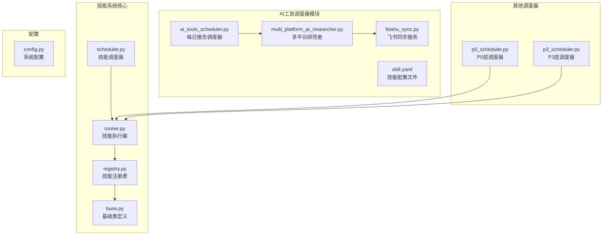
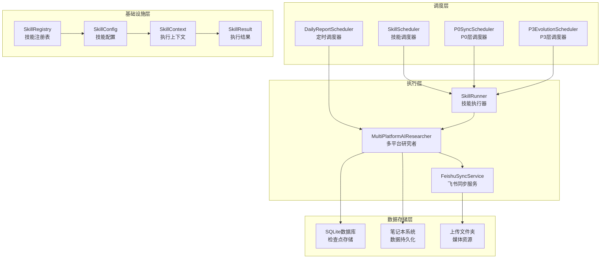
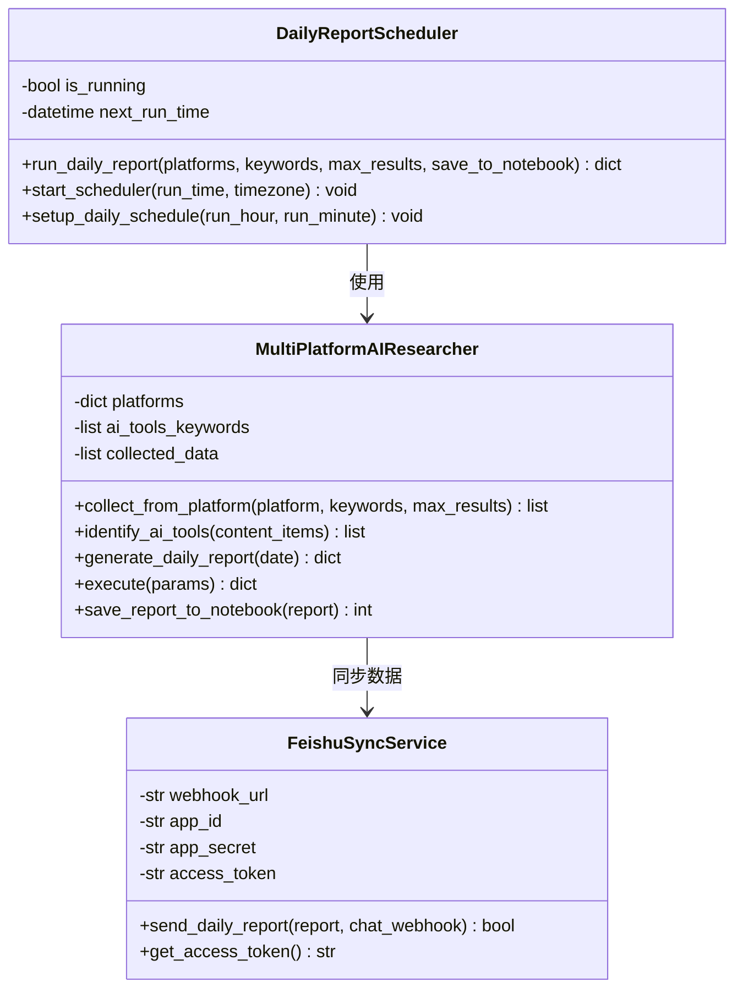
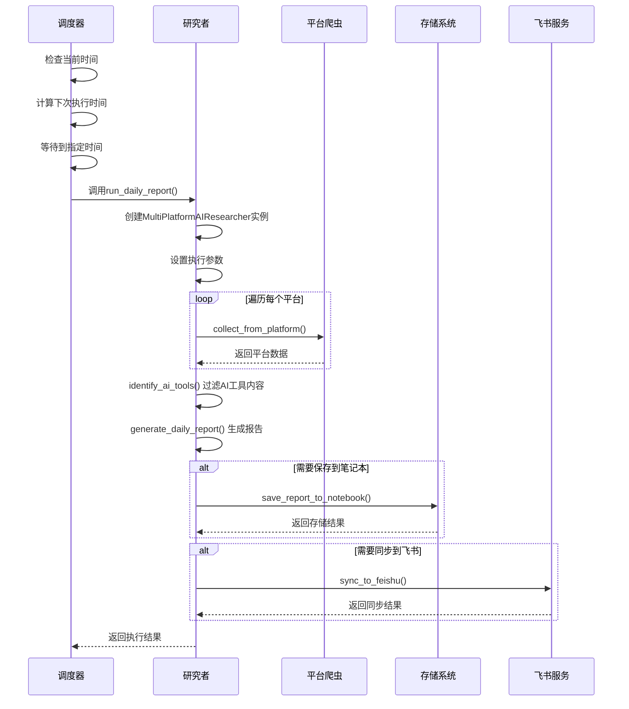
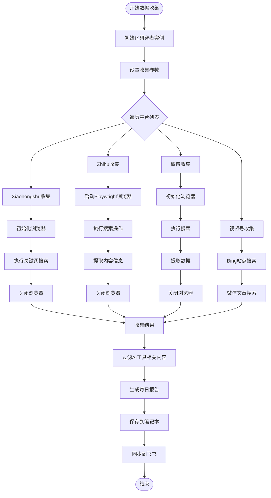
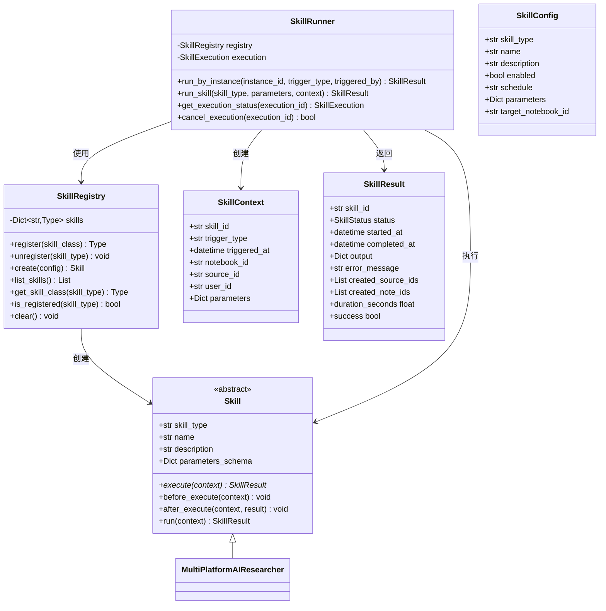
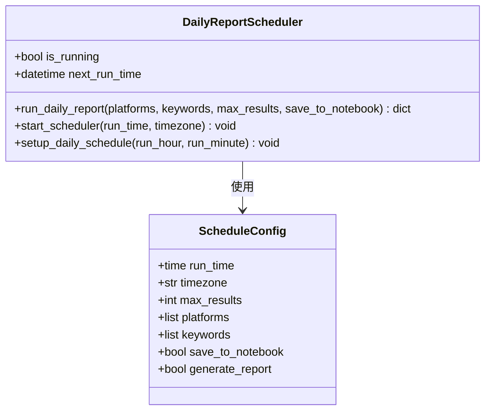
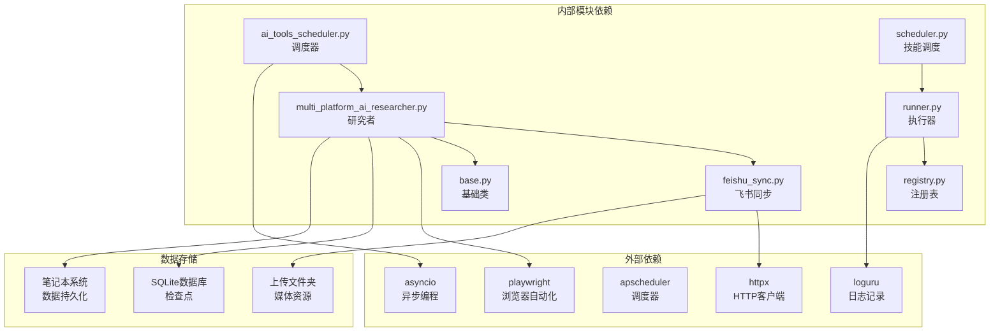

# AI工具调度器

<cite>
**本文档引用的文件**
- [ai_tools_scheduler.py](file://open_notebook/skills/multi_platform_ai_researcher/ai_tools_scheduler.py)
- [multi_platform_ai_researcher.py](file://open_notebook/skills/multi_platform_ai_researcher/multi_platform_ai_researcher.py)
- [weibo_connector.py](file://open_notebook/skills/connectors/weibo_connector.py)
- [weibo_publisher.py](file://open_notebook/skills/publishers/weibo_publisher.py)
- [skill.yaml](file://open_notebook/skills/multi_platform_ai_researcher/skill.yaml)
- [feishu_sync.py](file://open_notebook/skills/multi_platform_ai_researcher/feishu_sync.py)
- [scheduler.py](file://open_notebook/skills/scheduler.py)
- [p0_scheduler.py](file://open_notebook/skills/p0_scheduler.py)
- [p3_scheduler.py](file://open_notebook/skills/p3_scheduler.py)
- [base.py](file://open_notebook/skills/base.py)
- [runner.py](file://open_notebook/skills/runner.py)
- [registry.py](file://open_notebook/skills/registry.py)
- [config.py](file://open_notebook/config.py)
- [test_ai_tools_researcher.py](file://test_ai_tools_researcher.py)
</cite>

## 更新摘要
**变更内容**
- 增强视频账号收集器的双搜索策略，显著提升整体平台支持能力
- 优化Weibo收集器代码结构，提升系统稳定性
- 新增完整的调度配置参数，包括时间、时区、结果数量等
- 增加异步调度执行机制，支持灵活的任务调度

## 目录
1. [简介](#简介)
2. [项目结构](#项目结构)
3. [核心组件](#核心组件)
4. [架构概览](#架构概览)
5. [详细组件分析](#详细组件分析)
6. [调度配置详解](#调度配置详解)
7. [依赖关系分析](#依赖关系分析)
8. [性能考虑](#性能考虑)
9. [故障排除指南](#故障排除指南)
10. [结论](#结论)

## 简介

AI工具调度器是Open Notebook项目中的一个智能自动化系统，专门用于跨平台收集和分析"一人公司AI工具"相关信息。该系统通过定时调度机制，自动从多个中国社交媒体平台（小红书、知乎、微博等）收集AI工具相关内容，生成每日研究报告，并支持多种输出方式。

**更新** 新增了完整的定时调度功能，支持灵活的调度配置选项，包括执行时间、时区设置、结果数量控制等。同时，视频账号收集器采用双搜索策略显著增强了平台支持能力，Weibo收集器经过代码优化提升了系统稳定性。

该调度器采用模块化设计，集成了技能系统、调度器、执行器等多个核心组件，形成了一个完整的自动化工作流。系统支持灵活的配置选项，包括平台选择、关键词过滤、结果数量控制等，能够满足不同用户的需求。

## 项目结构

AI工具调度器位于Open Notebook项目的技能系统中，具体结构如下：



**图表来源**
- [ai_tools_scheduler.py](file://open_notebook/skills/multi_platform_ai_researcher/ai_tools_scheduler.py#L1-L126)
- [multi_platform_ai_researcher.py](file://open_notebook/skills/multi_platform_ai_researcher/multi_platform_ai_researcher.py#L1-L1001)
- [scheduler.py](file://open_notebook/skills/scheduler.py#L1-L430)

**章节来源**
- [ai_tools_scheduler.py](file://open_notebook/skills/multi_platform_ai_researcher/ai_tools_scheduler.py#L1-L126)
- [multi_platform_ai_researcher.py](file://open_notebook/skills/multi_platform_ai_researcher/multi_platform_ai_researcher.py#L1-L1001)
- [scheduler.py](file://open_notebook/skills/scheduler.py#L1-L430)

## 核心组件

### DailyReportScheduler - 每日报告调度器

**更新** 新增的DailyReportScheduler类是AI工具调度器的核心组件，负责管理和执行每日AI工具研究报告的生成任务。

DailyReportScheduler是AI工具调度器的核心组件，负责管理和执行每日AI工具研究报告的生成任务。

**主要功能特性：**
- **定时执行**：支持设置固定时间自动执行
- **参数配置**：灵活的平台、关键词、结果数量配置
- **错误处理**：完善的异常捕获和错误日志记录
- **异步支持**：基于asyncio的异步执行模型
- **全局实例**：提供全局调度器实例

**关键方法：**
- `run_daily_report()`: 执行单次报告生成
- `start_scheduler()`: 启动定时调度器
- `setup_daily_schedule()`: 快速设置调度

### MultiPlatformAIResearcher - 多平台研究者

MultiPlatformAIResearcher负责跨平台的数据收集和分析工作，支持多个主流中国社交媒体平台。

**支持的平台：**
- 小红书 (xiaohongshu)
- 知乎 (zhihu)  
- 微博 (weibo)
- 视频号 (video_account)
- 公众号 (official_account)
- 抖音 (douyin)

**核心功能：**
- **平台适配**：每个平台都有专门的爬虫实现
- **内容识别**：AI工具相关性过滤和标记
- **报告生成**：结构化的每日研究报告
- **数据存储**：支持保存到笔记本系统

**更新** 增强了视频账号收集器的双搜索策略，显著提升了整体平台支持能力。Weibo收集器经过代码优化，提升了系统稳定性和可靠性。

**章节来源**
- [ai_tools_scheduler.py](file://open_notebook/skills/multi_platform_ai_researcher/ai_tools_scheduler.py#L15-L126)
- [multi_platform_ai_researcher.py](file://open_notebook/skills/multi_platform_ai_researcher/multi_platform_ai_researcher.py#L19-L1001)

## 架构概览

AI工具调度器采用了分层架构设计，确保了系统的可扩展性和维护性：



**图表来源**
- [ai_tools_scheduler.py](file://open_notebook/skills/multi_platform_ai_researcher/ai_tools_scheduler.py#L15-L126)
- [scheduler.py](file://open_notebook/skills/scheduler.py#L20-L430)
- [runner.py](file://open_notebook/skills/runner.py#L20-L250)
- [base.py](file://open_notebook/skills/base.py#L17-L183)

## 详细组件分析

### DailyReportScheduler 类分析

**更新** 新增的DailyReportScheduler类实现了完整的定时调度功能，采用事件驱动的方式处理任务执行。



**图表来源**
- [ai_tools_scheduler.py](file://open_notebook/skills/multi_platform_ai_researcher/ai_tools_scheduler.py#L15-L126)
- [multi_platform_ai_researcher.py](file://open_notebook/skills/multi_platform_ai_researcher/multi_platform_ai_researcher.py#L19-L1001)
- [feishu_sync.py](file://open_notebook/skills/multi_platform_ai_researcher/feishu_sync.py#L15-L330)

**执行流程图：**



**图表来源**
- [ai_tools_scheduler.py](file://open_notebook/skills/multi_platform_ai_researcher/ai_tools_scheduler.py#L22-L105)
- [multi_platform_ai_researcher.py](file://open_notebook/skills/multi_platform_ai_researcher/multi_platform_ai_researcher.py#L709-L792)

**章节来源**
- [ai_tools_scheduler.py](file://open_notebook/skills/multi_platform_ai_researcher/ai_tools_scheduler.py#L15-L126)
- [multi_platform_ai_researcher.py](file://open_notebook/skills/multi_platform_ai_researcher/multi_platform_ai_researcher.py#L19-L1001)

### 多平台数据收集机制

MultiPlatformAIResearcher实现了灵活的多平台数据收集机制，针对不同平台的特点采用了相应的爬取策略：



**更新** 视频账号收集器采用双搜索策略：首先使用Bing站点搜索获取视频账号链接，然后通过微信文章搜索获取相关提及内容。这种策略显著增强了对视频号平台的支持能力。

**图表来源**
- [multi_platform_ai_researcher.py](file://open_notebook/skills/multi_platform_ai_researcher/multi_platform_ai_researcher.py#L50-L685)

**章节来源**
- [multi_platform_ai_researcher.py](file://open_notebook/skills/multi_platform_ai_researcher/multi_platform_ai_researcher.py#L50-L685)

### 技能系统集成

AI工具调度器与Open Notebook的技能系统深度集成，利用统一的执行框架：



**图表来源**
- [base.py](file://open_notebook/skills/base.py#L83-L183)
- [runner.py](file://open_notebook/skills/runner.py#L20-L250)
- [registry.py](file://open_notebook/skills/registry.py#L12-L133)

**章节来源**
- [base.py](file://open_notebook/skills/base.py#L17-L183)
- [runner.py](file://open_notebook/skills/runner.py#L20-L250)
- [registry.py](file://open_notebook/skills/registry.py#L12-L133)

## 调度配置详解

**更新** 新增了完整的调度配置选项，支持灵活的任务调度和参数定制。

### DailyReportScheduler 调度配置

DailyReportScheduler提供了完整的调度配置选项：



**主要配置参数：**
- `run_time`: 执行时间，默认为9:00 AM
- `timezone`: 时区设置，默认为'Asia/Shanghai'
- `platforms`: 平台列表，默认包含小红书
- `keywords`: 关键词列表，默认包含AI工具相关关键词
- `max_results`: 每平台最大结果数，默认20
- `save_to_notebook`: 是否保存到笔记本，默认True

### setup_daily_schedule 便捷函数

新增的`setup_daily_schedule`函数提供了简化的调度设置：

```python
async def setup_daily_schedule(run_hour: int = 9, run_minute: int = 0):
    """Convenience function to set up daily schedule.
    
    Args:
        run_hour: Hour to run (0-23)
        run_minute: Minute to run (0-59)
    """
    run_time = time(run_hour, run_minute)
    await daily_scheduler.start_scheduler(run_time=run_time)
```

**使用示例：**
```python
# 设置每天上午9点执行
await setup_daily_schedule(9, 0)

# 设置每天下午3点执行
await setup_daily_schedule(15, 0)

# 设置每小时执行一次
await setup_daily_schedule(0, 0)
```

**章节来源**
- [ai_tools_scheduler.py](file://open_notebook/skills/multi_platform_ai_researcher/ai_tools_scheduler.py#L70-L126)

## 依赖关系分析

AI工具调度器的依赖关系体现了清晰的分层架构：



**图表来源**
- [ai_tools_scheduler.py](file://open_notebook/skills/multi_platform_ai_researcher/ai_tools_scheduler.py#L6-L12)
- [multi_platform_ai_researcher.py](file://open_notebook/skills/multi_platform_ai_researcher/multi_platform_ai_researcher.py#L8-L16)
- [feishu_sync.py](file://open_notebook/skills/multi_platform_ai_researcher/feishu_sync.py#L7-L12)

**章节来源**
- [ai_tools_scheduler.py](file://open_notebook/skills/multi_platform_ai_researcher/ai_tools_scheduler.py#L6-L12)
- [multi_platform_ai_researcher.py](file://open_notebook/skills/multi_platform_ai_researcher/multi_platform_ai_researcher.py#L8-L16)
- [feishu_sync.py](file://open_notebook/skills/multi_platform_ai_researcher/feishu_sync.py#L7-L12)

## 性能考虑

AI工具调度器在设计时充分考虑了性能优化：

### 异步执行模型
- 使用asyncio实现非阻塞I/O操作
- 并发处理多个平台的数据收集
- 避免长时间等待导致的性能瓶颈

### 资源管理
- 浏览器实例的及时创建和销毁
- 网络请求的超时控制和重试机制
- 内存使用的优化和清理

### 缓存策略
- TikToken缓存减少重复计算
- SQLite检查点存储提高数据访问速度
- 结果缓存避免重复爬取相同内容

### 错误处理
- 完善的异常捕获和恢复机制
- 重试策略防止临时性失败
- 详细的日志记录便于问题诊断

**更新** Weibo收集器经过代码优化，提升了系统稳定性。新的WeiboConnector类提供了更好的错误处理和连接管理，减少了因网络问题导致的失败率。

## 故障排除指南

### 常见问题及解决方案

**1. 平台爬取失败**
- 检查网络连接和代理设置
- 验证目标平台的可用性
- 查看浏览器启动和页面加载日志

**2. 数据收集不完整**
- 调整max_results参数
- 检查关键词匹配逻辑
- 验证内容过滤规则

**3. 飞书同步失败**
- 确认Webhook URL配置正确
- 验证应用ID和密钥
- 检查网络连接状态

**4. 调度器不工作**
- 检查系统时间和时区设置
- 验证调度表达式格式
- 查看调度器日志输出

**5. 调度时间不准确**
- 确认时区设置正确
- 检查系统时间同步
- 验证调度器运行状态

**6. 视频号搜索结果少**
- 检查双搜索策略是否正常工作
- 验证Bing搜索和微信文章搜索的配置
- 调整关键词组合以提高搜索效果

**7. Weibo连接不稳定**
- 检查Cookie认证状态
- 验证WeiboConnector的连接测试
- 确认API调用频率未超过限制

**章节来源**
- [ai_tools_scheduler.py](file://open_notebook/skills/multi_platform_ai_researcher/ai_tools_scheduler.py#L66-L68)
- [multi_platform_ai_researcher.py](file://open_notebook/skills/multi_platform_ai_researcher/multi_platform_ai_researcher.py#L105-L107)
- [feishu_sync.py](file://open_notebook/skills/multi_platform_ai_researcher/feishu_sync.py#L53-L55)

## 结论

AI工具调度器是Open Notebook项目中一个功能完整、架构清晰的自动化系统。它成功地将多个技术组件整合在一起，实现了从数据收集到报告生成的完整工作流。

**主要优势：**
- **模块化设计**：各组件职责明确，易于维护和扩展
- **异步执行**：高效的并发处理能力
- **灵活配置**：支持多种参数定制
- **错误处理**：完善的异常处理和恢复机制
- **集成度高**：与技能系统无缝集成
- **定时调度**：支持灵活的定时执行机制
- **平台支持增强**：视频账号收集器双搜索策略显著提升平台支持能力
- **系统稳定性提升**：Weibo收集器代码优化增强了系统可靠性

**应用场景：**
- 一人公司AI工具监控
- 市场趋势分析
- 竞品情报收集
- 内容创作素材整理

**更新** 新增的定时调度功能使得系统能够自动执行AI工具研究任务，大大提高了系统的自动化程度和实用性。用户可以通过简单的配置实现每日、每周或按需的自动化执行，无需手动干预。

视频账号收集器采用的双搜索策略显著增强了对微信视频号平台的支持能力，通过Bing站点搜索和微信文章搜索相结合的方式，能够更全面地获取相关数据。Weibo收集器经过代码优化后，系统稳定性得到显著提升，减少了因网络波动和平台变化导致的失败情况。

该系统为个人创业者和内容创作者提供了一个强大的工具，能够帮助他们及时了解AI工具领域的最新动态，做出更明智的决策。