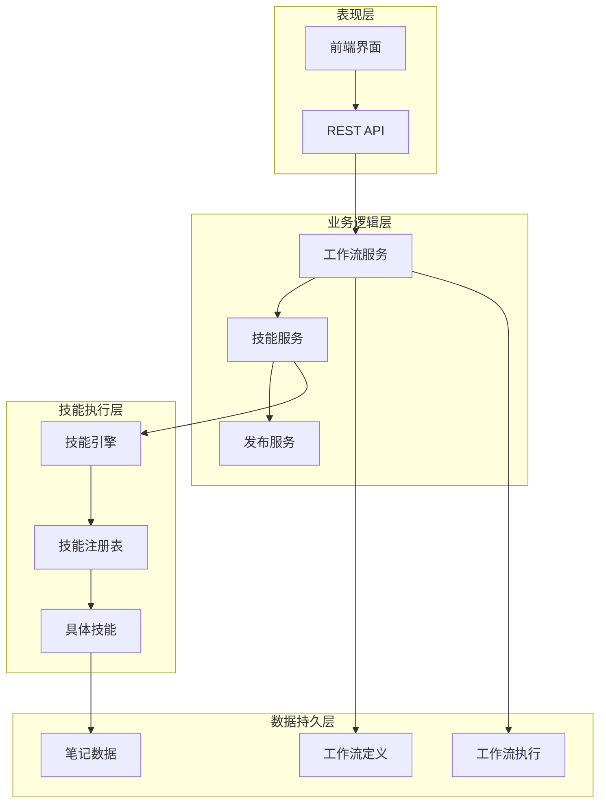
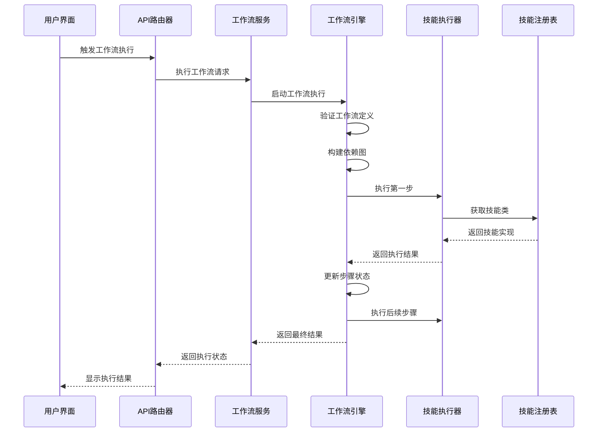
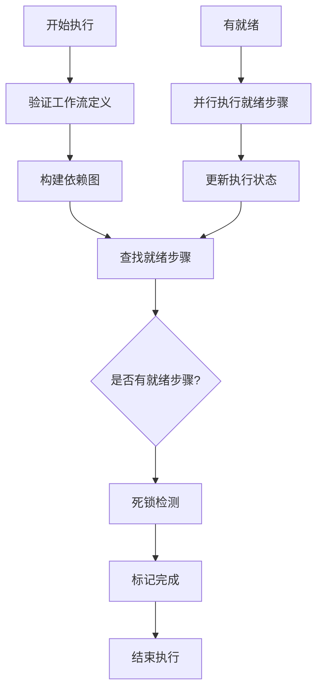
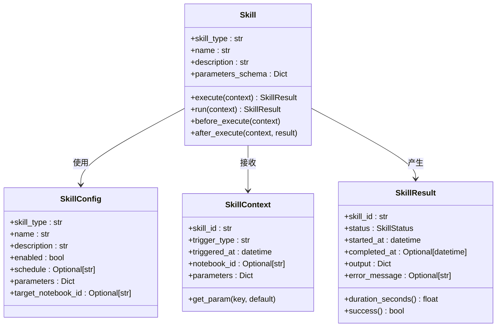
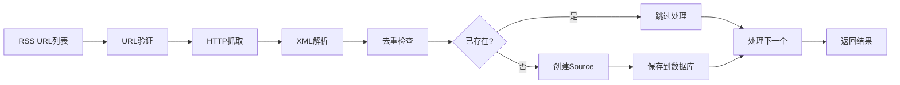
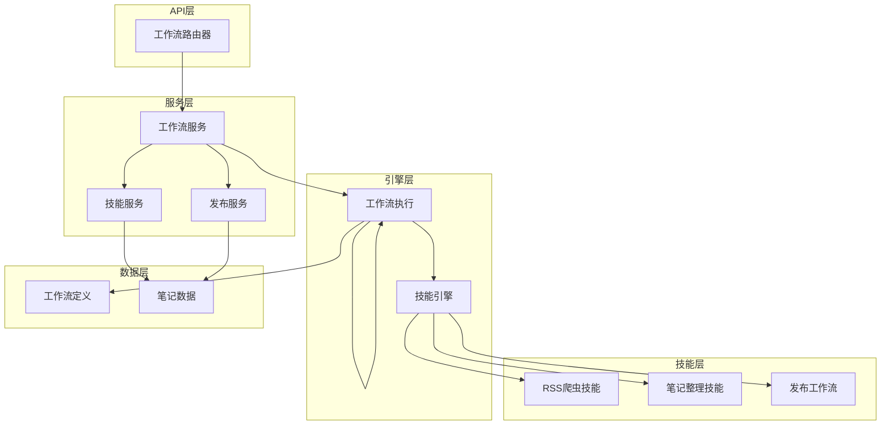

# 内容创建工作流

<cite>
**本文档引用的文件**
- [open_notebook/workflows/engine.py](file://open_notebook/workflows/engine.py)
- [open_notebook/workflows/service.py](file://open_notebook/workflows/service.py)
- [open_notebook/domain/workflow.py](file://open_notebook/domain/workflow.py)
- [open_notebook/skills/base.py](file://open_notebook/skills/base.py)
- [open_notebook/skills/registry.py](file://open_notebook/skills/registry.py)
- [open_notebook/skills/content_crawler.py](file://open_notebook/skills/content_crawler.py)
- [open_notebook/skills/note_organizer.py](file://open_notebook/skills/note_organizer.py)
- [open_notebook/skills/publish_workflow.py](file://open_notebook/skills/publish_workflow.py)
- [open_notebook/workflows/templates.py](file://open_notebook/workflows/templates.py)
- [api/routers/workflows.py](file://api/routers/workflows.py)
</cite>

## 目录
1. [简介](#简介)
2. [项目结构](#项目结构)
3. [核心组件](#核心组件)
4. [架构概览](#架构概览)
5. [详细组件分析](#详细组件分析)
6. [依赖关系分析](#依赖关系分析)
7. [性能考虑](#性能考虑)
8. [故障排除指南](#故障排除指南)
9. [结论](#结论)

## 简介

Open Notebook 的内容创建工作流是一个高度模块化、可扩展的自动化系统，专为个人创作者和小型团队设计。该系统通过技能（Skills）和工作流（Workflows）的组合，实现了从内容采集、处理、组织到发布的完整自动化流程。

系统的核心理念是"超级个体的AI操作系统"，旨在帮助用户构建自己的内容创作生态系统，通过预设的工作流模板和自定义技能，实现内容的智能化生产和分发。

## 项目结构

Open Notebook 采用分层架构设计，主要包含以下核心层次：

**图表来源**
- [open_notebook/workflows/engine.py](file://open_notebook/workflows/engine.py#L129-L202)
- [open_notebook/workflows/service.py](file://open_notebook/workflows/service.py#L22-L31)

**章节来源**
- [open_notebook/workflows/engine.py](file://open_notebook/workflows/engine.py#L1-L619)
- [open_notebook/workflows/service.py](file://open_notebook/workflows/service.py#L1-L240)

## 核心组件

### 工作流引擎（Workflow Engine）

工作流引擎是整个系统的核心执行器，负责协调多个技能的执行顺序和依赖关系。其主要职责包括：

- **依赖图构建**：分析步骤间的依赖关系，确定执行顺序
- **并行执行**：支持同级步骤的并行处理以提高效率
- **错误处理**：提供重试机制和错误传播
- **状态管理**：跟踪每个步骤的执行状态和结果

### 技能系统（Skill System）

技能是可重用的自动化单元，每个技能专注于特定的任务：

- **内容爬取**：RSS订阅、网页抓取
- **内容处理**：自动摘要、标签生成
- **内容发布**：多平台内容分发
- **内容组织**：智能分类和索引

### 工作流模板系统

系统提供了多种预置的工作流模板，涵盖常见的内容创作场景：

- **RSS到笔记管道**：自动抓取RSS内容并生成摘要
- **内容再利用管道**：将长篇文章转换为不同格式的内容
- **竞争对手监控**：跟踪竞争对手动态并生成洞察
- **自动组织笔记本**：智能化整理和分类内容

**章节来源**
- [open_notebook/skills/base.py](file://open_notebook/skills/base.py#L83-L183)
- [open_notebook/workflows/templates.py](file://open_notebook/workflows/templates.py#L12-L675)

## 架构概览

系统采用事件驱动的异步架构，支持手动触发和定时调度两种执行模式：

**图表来源**
- [api/routers/workflows.py](file://api/routers/workflows.py#L272-L293)
- [open_notebook/workflows/service.py](file://open_notebook/workflows/service.py#L116-L142)
- [open_notebook/workflows/engine.py](file://open_notebook/workflows/engine.py#L143-L202)

## 详细组件分析

### 工作流执行引擎

工作流执行引擎是系统的核心，负责协调整个执行过程：

#### 关键特性

- **依赖关系管理**：使用有向无环图（DAG）管理步骤间的依赖关系
- **并行执行优化**：同一层级的步骤可以并行执行
- **条件执行**：支持基于条件表达式的步骤执行
- **重试机制**：失败的步骤可以按配置进行重试

#### 执行流程

**图表来源**
- [open_notebook/workflows/engine.py](file://open_notebook/workflows/engine.py#L204-L296)

**章节来源**
- [open_notebook/workflows/engine.py](file://open_notebook/workflows/engine.py#L129-L619)

### 技能执行框架

技能系统提供了统一的接口来执行各种自动化任务：

#### 技能生命周期

**图表来源**
- [open_notebook/skills/base.py](file://open_notebook/skills/base.py#L83-L183)

**章节来源**
- [open_notebook/skills/base.py](file://open_notebook/skills/base.py#L1-L183)

### 内容爬取技能

RSS内容爬取技能实现了自动化的信息采集功能：

#### 核心功能

- **多源内容采集**：支持多个RSS源的并发抓取
- **去重机制**：防止重复内容的创建
- **内容解析**：支持RSS和Atom格式的内容解析
- **智能存储**：自动创建Source记录并关联到笔记本

#### 技术实现

**图表来源**
- [open_notebook/skills/content_crawler.py](file://open_notebook/skills/content_crawler.py#L260-L310)

**章节来源**
- [open_notebook/skills/content_crawler.py](file://open_notebook/skills/content_crawler.py#L1-L315)

### 内容组织技能

内容组织技能提供了智能化的内容处理能力：

#### 自动摘要功能

- **多风格支持**：支持简洁、详细、要点列表、高管摘要等多种风格
- **长度控制**：可配置摘要长度
- **AI集成**：使用LangChain框架进行智能摘要生成

#### 智能标签功能

- **自动标签生成**：基于内容自动生成相关标签
- **分类管理**：支持标签分类和层次结构
- **批量处理**：可同时处理多个内容项

**章节来源**
- [open_notebook/skills/note_organizer.py](file://open_notebook/skills/note_organizer.py#L1-L408)

### 发布工作流

发布工作流实现了内容的自动化分发：

#### 多平台支持

- **浏览器自动化**：支持主流社交媒体平台
- **连接验证**：自动验证平台连接状态
- **内容适配**：根据不同平台特点调整内容格式

#### 反馈循环

- **结果收集**：自动收集发布结果和链接
- **学习反馈**：将结果反馈到P3进化层
- **持续优化**：基于反馈不断改进发布策略

**章节来源**
- [open_notebook/skills/publish_workflow.py](file://open_notebook/skills/publish_workflow.py#L1-L424)

## 依赖关系分析

系统采用松耦合的设计，各组件间通过清晰的接口进行通信：

**图表来源**
- [api/routers/workflows.py](file://api/routers/workflows.py#L19-L22)
- [open_notebook/workflows/service.py](file://open_notebook/workflows/service.py#L22-L31)

**章节来源**
- [open_notebook/workflows/engine.py](file://open_notebook/workflows/engine.py#L1-L619)
- [open_notebook/skills/registry.py](file://open_notebook/skills/registry.py#L1-L133)

## 性能考虑

### 并行执行优化

系统通过并行执行同级步骤来提高整体性能：

- **依赖图分析**：自动识别可以并行执行的步骤
- **资源限制**：可根据系统资源限制并行度
- **负载均衡**：智能分配计算资源

### 缓存策略

- **技能结果缓存**：避免重复执行相同任务
- **内容去重缓存**：快速检测重复内容
- **配置缓存**：减少配置查询开销

### 错误处理机制

- **渐进式失败**：部分步骤失败不影响其他步骤
- **重试策略**：智能重试失败的操作
- **降级处理**：在异常情况下提供基础功能

## 故障排除指南

### 常见问题及解决方案

#### 工作流执行失败

**症状**：工作流执行过程中出现错误

**排查步骤**：
1. 检查工作流定义的依赖关系是否正确
2. 验证技能参数配置
3. 查看具体的错误日志

**解决方案**：
- 修复依赖关系中的循环引用
- 调整技能参数值
- 检查网络连接和API访问权限

#### 技能执行超时

**症状**：某些技能执行时间过长

**排查步骤**：
1. 分析技能的网络请求情况
2. 检查目标API的响应时间
3. 评估技能的复杂度

**解决方案**：
- 优化网络请求参数
- 增加超时时间设置
- 考虑分批处理大量数据

#### 内容重复问题

**症状**：相同内容被多次创建

**排查步骤**：
1. 检查去重逻辑是否正常工作
2. 验证URL哈希算法
3. 确认数据库索引完整性

**解决方案**：
- 修复去重算法实现
- 重建数据库索引
- 调整去重阈值

**章节来源**
- [open_notebook/workflows/engine.py](file://open_notebook/workflows/engine.py#L191-L198)
- [open_notebook/skills/content_crawler.py](file://open_notebook/skills/content_crawler.py#L93-L101)

## 结论

Open Notebook 的内容创建工作流系统通过模块化设计和技能化架构，为个人创作者提供了一个强大而灵活的内容生产平台。系统的主要优势包括：

1. **高度可扩展性**：通过技能注册表轻松添加新功能
2. **智能化程度高**：集成AI能力实现内容的智能处理
3. **用户体验友好**：提供直观的界面和丰富的模板
4. **可靠性强**：完善的错误处理和重试机制
5. **性能优异**：支持并行执行和智能资源管理

该系统特别适合需要自动化内容生产的个人创作者和小型团队，能够显著提高内容生产效率，降低重复性劳动，让创作者专注于创意和价值创造。

通过合理配置和使用，用户可以构建自己的内容创作生态系统，实现从内容采集、处理、组织到发布的完整自动化流程，真正成为"超级个体的AI操作系统"。