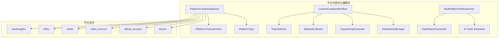
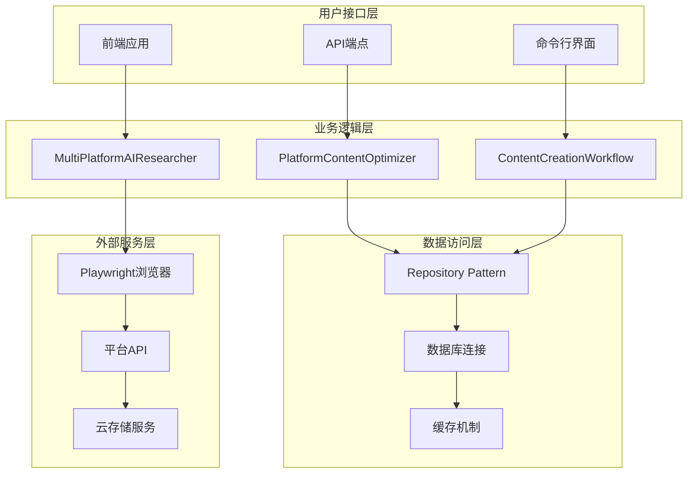
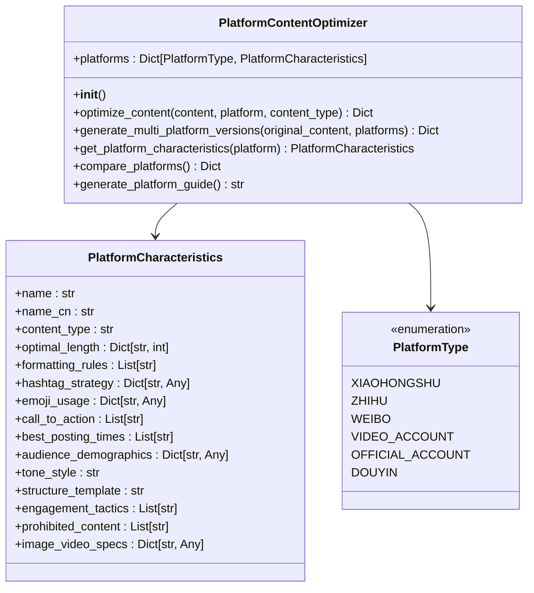
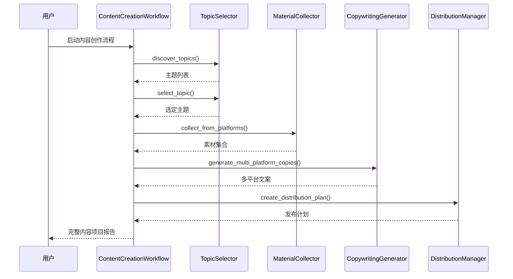
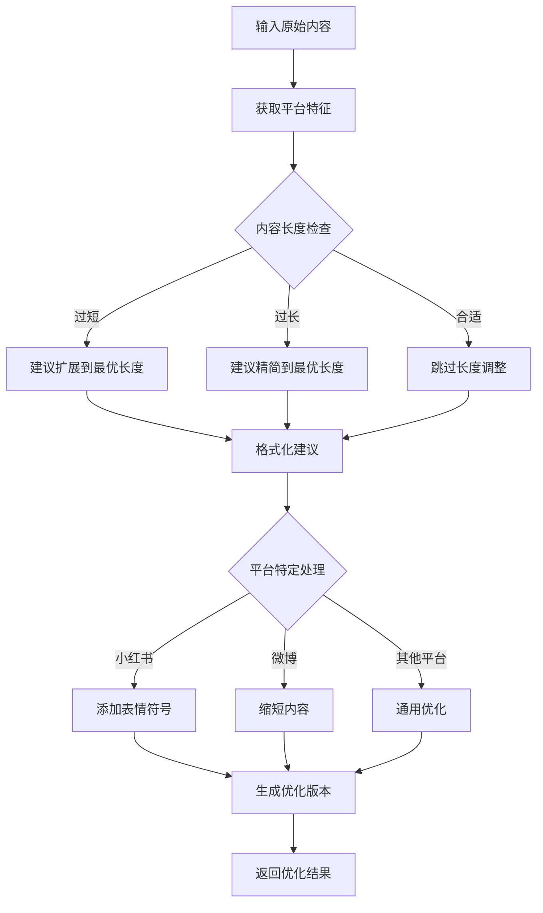
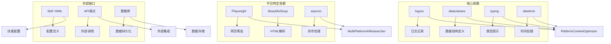

# 平台内容优化器

<cite>
**本文档引用的文件**
- [platform_content_optimizer.py](file://open_notebook/skills/multi_platform_ai_researcher/platform_content_optimizer.py)
- [content_creation_workflow.py](file://open_notebook/skills/multi_platform_ai_researcher/content_creation_workflow.py)
- [multi_platform_ai_researcher.py](file://open_notebook/skills/multi_platform_ai_researcher/multi_platform_ai_researcher.py)
- [daily_report_generator.py](file://open_notebook/skills/multi_platform_ai_researcher/daily_report_generator.py)
- [ai_tools_scheduler.py](file://open_notebook/skills/multi_platform_ai_researcher/ai_tools_scheduler.py)
- [skill.yaml](file://open_notebook/skills/multi_platform_ai_researcher/skill.yaml)
</cite>

## 目录
1. [简介](#简介)
2. [项目结构](#项目结构)
3. [核心组件](#核心组件)
4. [架构概览](#架构概览)
5. [详细组件分析](#详细组件分析)
6. [依赖关系分析](#依赖关系分析)
7. [性能考虑](#性能考虑)
8. [故障排除指南](#故障排除指南)
9. [结论](#结论)

## 简介

平台内容优化器是Open Notebook项目中的一个核心模块，专门用于分析和优化针对中国主要社交媒体平台的内容。该系统支持6个主要平台：小红书、知乎、微博、视频号、公众号和抖音，为内容创作者提供跨平台的内容优化解决方案。

该系统不仅能够分析每个平台的内容特征和最佳实践，还能根据平台特性生成优化后的内容版本，包括标题优化、格式调整、标签策略和发布时间建议等。通过智能化的内容适配，帮助用户在不同平台上获得更好的内容表现和用户参与度。

## 项目结构

平台内容优化器位于Open Notebook项目的技能模块中，采用模块化设计，包含以下主要组件：

**图表来源**
- [platform_content_optimizer.py](file://open_notebook/skills/multi_platform_ai_researcher/platform_content_optimizer.py#L46-L604)
- [content_creation_workflow.py](file://open_notebook/skills/multi_platform_ai_researcher/content_creation_workflow.py#L829-L898)

**章节来源**
- [platform_content_optimizer.py](file://open_notebook/skills/multi_platform_ai_researcher/platform_content_optimizer.py#L1-L804)
- [content_creation_workflow.py](file://open_notebook/skills/multi_platform_ai_researcher/content_creation_workflow.py#L1-L1046)

## 核心组件

### 平台内容优化器 (PlatformContentOptimizer)

这是系统的核心组件，负责分析和优化内容以适应不同平台的要求。它包含了所有平台的内容特征定义和优化算法。

**主要功能：**
- 平台特征分析：每个平台的格式要求、受众特征、最佳实践
- 内容长度优化：根据平台特性调整内容长度
- 格式建议：提供平台特定的格式化建议
- 多平台版本生成：为所有支持的平台生成优化版本

**平台支持：**
系统支持6个主要中国社交媒体平台，每个平台都有详细的特征定义：

| 平台 | 类型 | 最佳字数 | 受众年龄 | 推荐发布时间 |
|------|------|----------|----------|-------------|
| 小红书 | 图文/短视频 | 300字 | 18-35岁 | 19:00 |
| 知乎 | 长文回答 | 2000字 | 22-40岁 | 21:00 |
| 微博 | 短微博 | 140字 | 16-35岁 | 12:00 |
| 视频号 | 短视频/直播 | 100字 | 25-50岁 | 20:00 |
| 公众号 | 长图文 | 2000字 | 25-45岁 | 21:00 |
| 抖音 | 短视频/直播 | 50字 | 18-35岁 | 18:00 |

**章节来源**
- [platform_content_optimizer.py](file://open_notebook/skills/multi_platform_ai_researcher/platform_content_optimizer.py#L46-L781)

### 内容创作工作流 (ContentCreationWorkflow)

这是一个完整的端到端内容创作流程，从主题选择到内容分发的全过程管理。

**工作流阶段：**
1. **主题选择**：AI辅助的主题发现和选择
2. **素材收集**：从多平台收集相关内容
3. **文案生成**：为每个平台生成优化的文案
4. **分发计划**：创建跨平台发布计划
5. **分析评估**：内容效果分析和优化建议

**章节来源**
- [content_creation_workflow.py](file://open_notebook/skills/multi_platform_ai_researcher/content_creation_workflow.py#L829-L898)

### 多平台AI研究员 (MultiPlatformAIResearcher)

负责从各个社交媒体平台自动收集AI工具相关信息的研究模块。

**功能特性：**
- 多平台数据采集：支持6个主要平台的数据收集
- AI工具识别：自动识别与AI工具相关的内容
- 日常报告生成：自动生成每日研究报告
- 关键词匹配：基于关键词的智能内容筛选

**章节来源**
- [multi_platform_ai_researcher.py](file://open_notebook/skills/multi_platform_ai_researcher/multi_platform_ai_researcher.py#L19-L800)

## 架构概览

平台内容优化器采用分层架构设计，确保模块间的松耦合和高内聚：

**图表来源**
- [platform_content_optimizer.py](file://open_notebook/skills/multi_platform_ai_researcher/platform_content_optimizer.py#L46-L604)
- [content_creation_workflow.py](file://open_notebook/skills/multi_platform_ai_researcher/content_creation_workflow.py#L829-L898)
- [multi_platform_ai_researcher.py](file://open_notebook/skills/multi_platform_ai_researcher/multi_platform_ai_researcher.py#L19-L800)

## 详细组件分析

### 平台内容优化器类结构

**图表来源**
- [platform_content_optimizer.py](file://open_notebook/skills/multi_platform_ai_researcher/platform_content_optimizer.py#L16-L781)

### 内容创作工作流序列

**图表来源**
- [content_creation_workflow.py](file://open_notebook/skills/multi_platform_ai_researcher/content_creation_workflow.py#L839-L898)

### 平台特征分析流程

**图表来源**
- [platform_content_optimizer.py](file://open_notebook/skills/multi_platform_ai_researcher/platform_content_optimizer.py#L615-L700)

**章节来源**
- [platform_content_optimizer.py](file://open_notebook/skills/multi_platform_ai_researcher/platform_content_optimizer.py#L46-L804)
- [content_creation_workflow.py](file://open_notebook/skills/multi_platform_ai_researcher/content_creation_workflow.py#L1-L1046)

## 依赖关系分析

平台内容优化器模块间存在清晰的依赖关系，遵循单一职责原则：

**图表来源**
- [platform_content_optimizer.py](file://open_notebook/skills/multi_platform_ai_researcher/platform_content_optimizer.py#L1-L14)
- [multi_platform_ai_researcher.py](file://open_notebook/skills/multi_platform_ai_researcher/multi_platform_ai_researcher.py#L1-L15)

**章节来源**
- [platform_content_optimizer.py](file://open_notebook/skills/multi_platform_ai_researcher/platform_content_optimizer.py#L1-L14)
- [multi_platform_ai_researcher.py](file://open_notebook/skills/multi_platform_ai_researcher/multi_platform_ai_researcher.py#L1-L15)

## 性能考虑

平台内容优化器在设计时充分考虑了性能优化：

### 异步处理
- 所有平台数据采集都采用异步模式，提高并发处理能力
- 使用async/await模式避免阻塞操作
- 合理的超时设置和错误重试机制

### 缓存策略
- 平台特征数据预加载到内存中
- 结果缓存减少重复计算
- 浏览器会话复用降低初始化开销

### 内存管理
- 流式处理大数据集
- 及时释放临时对象
- 合理的批量大小控制

### 网络优化
- 请求头伪装避免反爬虫检测
- 智能延迟避免触发限流
- 失败重试和降级策略

## 故障排除指南

### 常见问题及解决方案

**平台数据采集失败**
- 检查网络连接和代理设置
- 验证平台API可用性和认证信息
- 查看浏览器驱动版本兼容性

**内容优化结果不符合预期**
- 确认输入内容长度符合平台要求
- 检查平台特征配置是否正确
- 验证内容格式和编码

**性能问题**
- 监控内存使用情况
- 检查异步任务队列
- 优化批量处理大小

**章节来源**
- [platform_content_optimizer.py](file://open_notebook/skills/multi_platform_ai_researcher/platform_content_optimizer.py#L1-L14)
- [multi_platform_ai_researcher.py](file://open_notebook/skills/multi_platform_ai_researcher/multi_platform_ai_researcher.py#L1-L15)

## 结论

平台内容优化器是一个功能完整、设计合理的跨平台内容优化系统。它通过深入分析各个社交媒体平台的特点，为用户提供智能化的内容适配解决方案。

**主要优势：**
- **全面的平台支持**：涵盖中国主要社交媒体平台
- **智能化优化**：基于平台特征的自动内容调整
- **完整的工作流**：从主题选择到内容分发的全流程管理
- **可扩展性**：模块化设计便于功能扩展和维护

**应用场景：**
- 个人内容创作者的多平台内容发布
- 企业营销团队的内容策略制定
- 研究机构的信息收集和分析
- 教育培训领域的知识传播

该系统为内容创作者提供了强大的技术支持，帮助他们在竞争激烈的社会化媒体环境中获得更好的内容表现和用户参与度。