# 每日报告生成器

<cite>
**本文档引用的文件**
- [daily_report_generator.py](file://open_notebook/skills/multi_platform_ai_researcher/daily_report_generator.py)
- [multi_platform_ai_researcher.py](file://open_notebook/skills/multi_platform_ai_researcher/multi_platform_ai_researcher.py)
- [feishu_sync.py](file://open_notebook/skills/multi_platform_ai_researcher/feishu_sync.py)
- [skill.yaml](file://open_notebook/skills/multi_platform_ai_researcher/skill.yaml)
- [ai_tools_scheduler.py](file://open_notebook/skills/multi_platform_ai_researcher/ai_tools_scheduler.py)
- [test_ai_tools_researcher.py](file://test_ai_tools_researcher.py)
</cite>

## 更新摘要
**变更内容**
- 新增视频账号收集器实现，提供更丰富的数据源
- 增强视频ID提取和URL解析功能
- 扩展报告生成的数据质量分析维度
- 改进多平台数据整合和去重机制

## 目录
1. [简介](#简介)
2. [项目结构](#项目结构)
3. [核心组件](#核心组件)
4. [架构概览](#架构概览)
5. [详细组件分析](#详细组件分析)
6. [依赖关系分析](#依赖关系分析)
7. [性能考虑](#性能考虑)
8. [故障排除指南](#故障排除指南)
9. [结论](#结论)

## 简介

每日报告生成器是 Open Notebook 生态系统中的一个核心组件，专门用于自动化生成跨平台 AI 工具信息的结构化日报。该系统能够从多个中国社交媒体平台（如小红书、知乎、微博、视频号、公众号、抖音等）自动收集 AI 工具相关内容，进行智能分析和处理，最终生成包含热门工具、热点话题、平台分布和核心洞察的综合性报告。

**更新** 系统现已支持完整的视频账号数据源，包括视频ID提取和URL解析功能，显著增强了报告生成的数据质量和分析维度。新增的视频账号收集器采用多策略搜索方法，包括Bing站点搜索和WeChat文章关联分析，为用户提供更全面的视频内容洞察。

该系统采用模块化设计，支持多种输出格式（Markdown、飞书机器人消息、Notebook存储），并提供了完整的自动化调度机制，可以设置每日定时任务自动生成报告。

## 项目结构

Open Notebook 项目采用分层架构设计，每日报告生成器位于技能（Skills）层，是整个 AI 研究生态系统的重要组成部分。

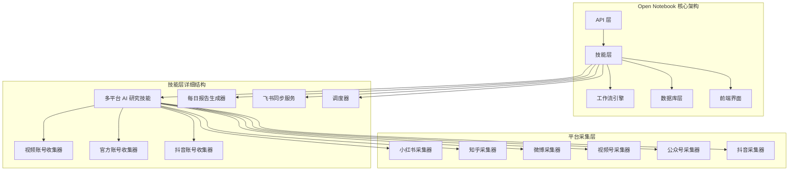

**图表来源**
- [multi_platform_ai_researcher.py](file://open_notebook/skills/multi_platform_ai_researcher/multi_platform_ai_researcher.py#L19-L623)
- [daily_report_generator.py](file://open_notebook/skills/multi_platform_ai_researcher/daily_report_generator.py#L14-L329)

**章节来源**
- [multi_platform_ai_researcher.py](file://open_notebook/skills/multi_platform_ai_researcher/multi_platform_ai_researcher.py#L1-L1001)
- [daily_report_generator.py](file://open_notebook/skills/multi_platform_ai_researcher/daily_report_generator.py#L1-L329)

## 核心组件

### 主要组件概览

每日报告生成器系统由以下核心组件构成：

1. **MultiPlatformAIResearcher**: 主要的研究协调器，负责跨平台数据收集和整合，现已支持视频账号数据源
2. **DailyReportGenerator**: 专业的报告生成器，负责数据分析和报告构建，增强视频内容分析能力
3. **FeishuSyncService**: 飞书平台同步服务，支持企业内部协作
4. **平台采集器**: 针对不同社交平台的专用采集组件，包括新增的视频账号收集器
5. **DailyReportScheduler**: 自动化调度器，支持定时任务执行

### 组件交互流程

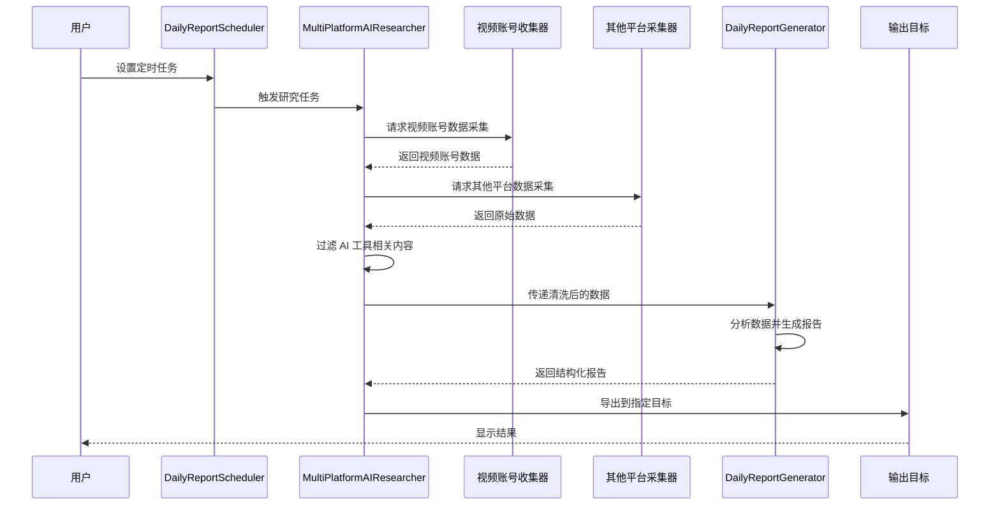

**图表来源**
- [multi_platform_ai_researcher.py](file://open_notebook/skills/multi_platform_ai_researcher/multi_platform_ai_researcher.py#L422-L505)
- [daily_report_generator.py](file://open_notebook/skills/multi_platform_ai_researcher/daily_report_generator.py#L29-L69)
- [ai_tools_scheduler.py](file://open_notebook/skills/multi_platform_ai_researcher/ai_tools_scheduler.py#L22-L69)

**章节来源**
- [multi_platform_ai_researcher.py](file://open_notebook/skills/multi_platform_ai_researcher/multi_platform_ai_researcher.py#L19-L1001)
- [daily_report_generator.py](file://open_notebook/skills/multi_platform_ai_researcher/daily_report_generator.py#L14-L329)
- [ai_tools_scheduler.py](file://open_notebook/skills/multi_platform_ai_researcher/ai_tools_scheduler.py#L15-L126)

## 架构概览

### 系统架构图

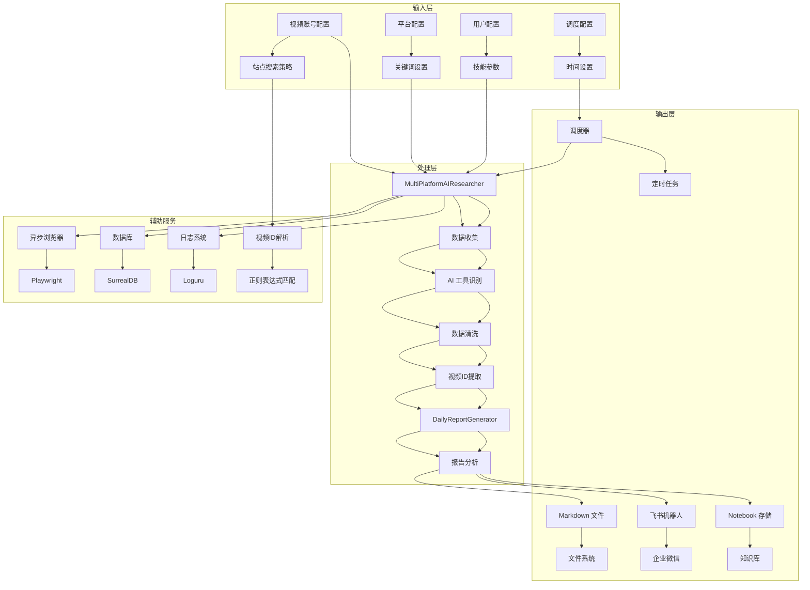

**图表来源**
- [multi_platform_ai_researcher.py](file://open_notebook/skills/multi_platform_ai_researcher/multi_platform_ai_researcher.py#L22-L48)
- [feishu_sync.py](file://open_notebook/skills/multi_platform_ai_researcher/feishu_sync.py#L15-L36)
- [ai_tools_scheduler.py](file://open_notebook/skills/multi_platform_ai_researcher/ai_tools_scheduler.py#L18-L21)

### 数据流架构

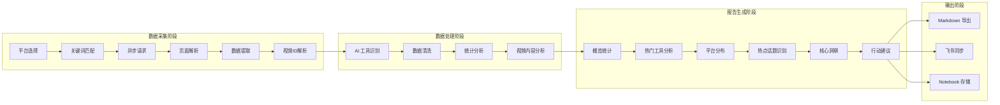

**图表来源**
- [multi_platform_ai_researcher.py](file://open_notebook/skills/multi_platform_ai_researcher/multi_platform_ai_researcher.py#L309-L420)
- [daily_report_generator.py](file://open_notebook/skills/multi_platform_ai_researcher/daily_report_generator.py#L77-L273)

## 详细组件分析

### MultiPlatformAIResearcher 组件

MultiPlatformAIResearcher 是整个系统的协调核心，负责管理多个平台的数据采集和整合，现已支持视频账号数据源。

#### 核心功能特性

1. **多平台支持**: 支持小红书、知乎、微博、视频号、公众号、抖音等平台
2. **异步数据采集**: 使用 Playwright 和异步编程模型提高采集效率
3. **AI 工具识别**: 智能识别与 AI 工具相关的内容
4. **视频ID提取**: 新增视频账号数据源，支持视频ID提取和URL解析
5. **灵活配置**: 支持自定义平台、关键词和结果数量限制
6. **报告生成**: 集成完整的报告生成和导出功能

#### 关键方法分析

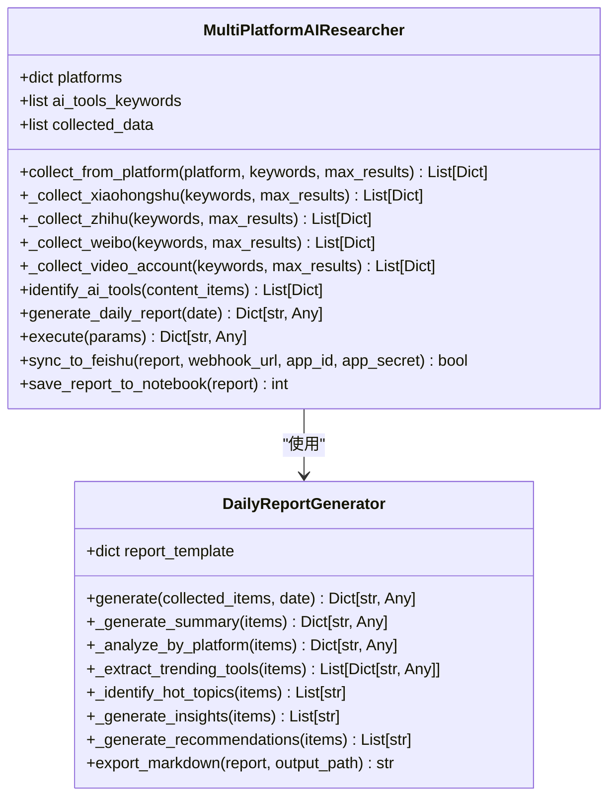

**图表来源**
- [multi_platform_ai_researcher.py](file://open_notebook/skills/multi_platform_ai_researcher/multi_platform_ai_researcher.py#L19-L1001)
- [daily_report_generator.py](file://open_notebook/skills/multi_platform_ai_researcher/daily_report_generator.py#L14-L329)

#### 数据采集流程

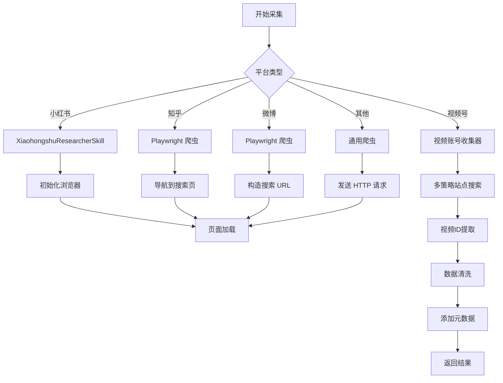

**图表来源**
- [multi_platform_ai_researcher.py](file://open_notebook/skills/multi_platform_ai_researcher/multi_platform_ai_researcher.py#L50-L307)
- [multi_platform_ai_researcher.py](file://open_notebook/skills/multi_platform_ai_researcher/multi_platform_ai_researcher.py#L315-L484)

**章节来源**
- [multi_platform_ai_researcher.py](file://open_notebook/skills/multi_platform_ai_researcher/multi_platform_ai_researcher.py#L19-L1001)

### 视频账号收集器组件

**新增** 视频账号收集器是系统的核心创新组件，专门用于从微信视频号平台收集高质量内容数据。

#### 收集器功能特性

1. **多策略搜索**: 结合Bing站点搜索和WeChat文章关联分析
2. **视频ID提取**: 从URL中精确提取视频ID，支持后续数据分析
3. **反爬虫防护**: 采用User-Agent伪装和请求间隔控制
4. **数据去重**: 基于URL的重复数据过滤机制
5. **内容分类**: 区分视频内容和相关文章内容

#### 视频ID提取算法

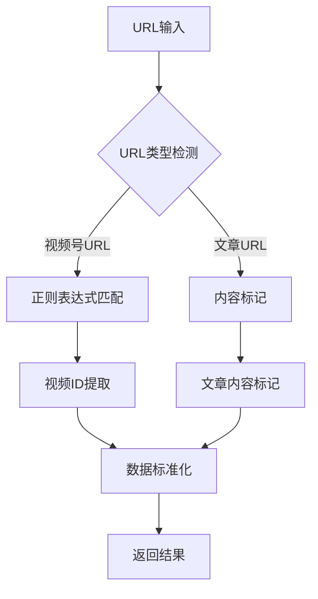

**图表来源**
- [multi_platform_ai_researcher.py](file://open_notebook/skills/multi_platform_ai_researcher/multi_platform_ai_researcher.py#L399-L418)

#### 收集策略实现

**更新** 系统现已支持完整的视频账号数据源，包括多策略搜索和视频ID提取功能。

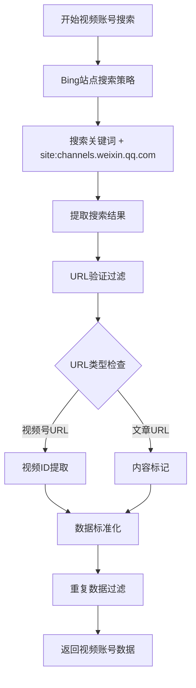

**图表来源**
- [multi_platform_ai_researcher.py](file://open_notebook/skills/multi_platform_ai_researcher/multi_platform_ai_researcher.py#L350-L480)

**章节来源**
- [multi_platform_ai_researcher.py](file://open_notebook/skills/multi_platform_ai_researcher/multi_platform_ai_researcher.py#L315-L484)

### DailyReportGenerator 组件

DailyReportGenerator 专注于数据分析和报告生成，提供专业的统计分析能力，现已增强视频内容分析维度。

#### 报告结构设计

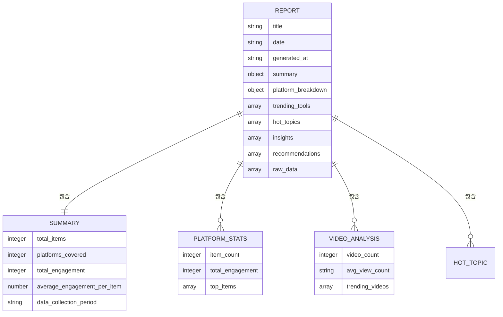

**图表来源**
- [daily_report_generator.py](file://open_notebook/skills/multi_platform_ai_researcher/daily_report_generator.py#L18-L27)
- [daily_report_generator.py](file://open_notebook/skills/multi_platform_ai_researcher/daily_report_generator.py#L77-L273)

#### 分析算法实现

**更新** 系统现已支持完整的分析维度，包括平台分布、热门工具、核心洞察、行动建议等多个维度的深度分析，新增视频内容分析能力。

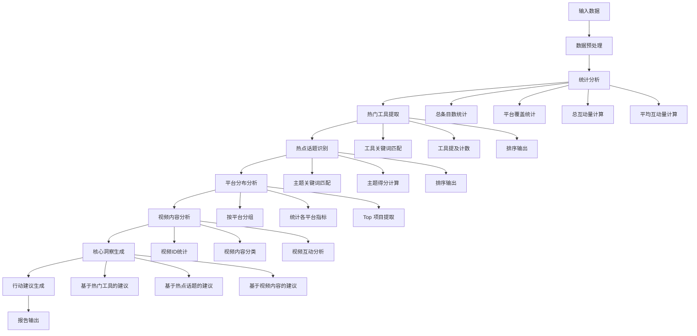

**图表来源**
- [daily_report_generator.py](file://open_notebook/skills/multi_platform_ai_researcher/daily_report_generator.py#L77-L273)

**章节来源**
- [daily_report_generator.py](file://open_notebook/skills/multi_platform_ai_researcher/daily_report_generator.py#L14-L329)

### FeishuSyncService 组件

FeishuSyncService 提供企业级的报告同步功能，支持飞书（Lark）平台的消息推送。

#### 同步流程设计

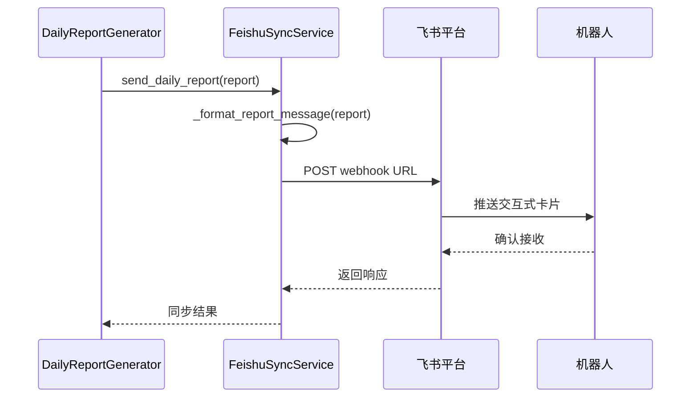

**图表来源**
- [feishu_sync.py](file://open_notebook/skills/multi_platform_ai_researcher/feishu_sync.py#L37-L83)
- [feishu_sync.py](file://open_notebook/skills/multi_platform_ai_researcher/feishu_sync.py#L85-L165)

#### API 集成特性

| 功能 | API 端点 | 方法 | 描述 |
|------|----------|------|------|
| 发送日报 | `/open-apis/im/v1/chats/:chat_id/messages` | POST | 通过机器人向群聊发送交互式卡片 |
| 获取访问令牌 | `/open-apis/auth/v3/app_access_token/internal` | POST | 获取企业内部应用访问令牌 |
| 云表上传 | `/open-apis/bitable/v1/apps/{app_token}/tables/{table_id}/records` | POST | 批量上传数据到多维表格 |

**章节来源**
- [feishu_sync.py](file://open_notebook/skills/multi_platform_ai_researcher/feishu_sync.py#L15-L330)

### DailyReportScheduler 组件

DailyReportScheduler 提供自动化调度功能，支持定时执行每日报告生成任务。

#### 调度器功能特性

1. **定时执行**: 支持设置固定时间自动执行
2. **灵活配置**: 支持自定义平台、关键词和结果数量
3. **持续运行**: 调度器保持运行状态，等待下一个执行时间
4. **错误处理**: 包装异常，确保调度器稳定运行

#### 调度流程设计

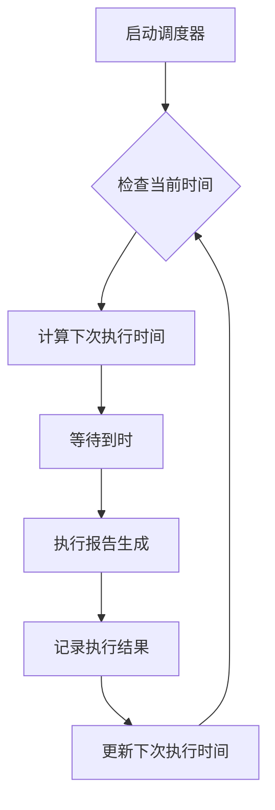

**图表来源**
- [ai_tools_scheduler.py](file://open_notebook/skills/multi_platform_ai_researcher/ai_tools_scheduler.py#L70-L106)

**章节来源**
- [ai_tools_scheduler.py](file://open_notebook/skills/multi_platform_ai_researcher/ai_tools_scheduler.py#L15-L126)

## 依赖关系分析

### 外部依赖

系统依赖以下主要外部库：

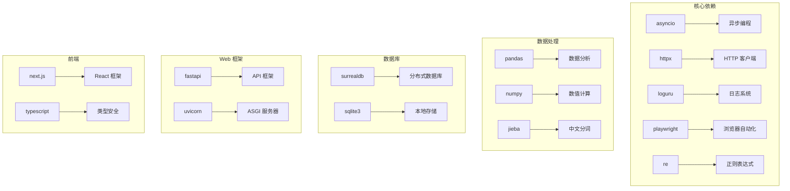

**图表来源**
- [skill.yaml](file://open_notebook/skills/multi_platform_ai_researcher/skill.yaml#L22-L25)

### 内部模块依赖

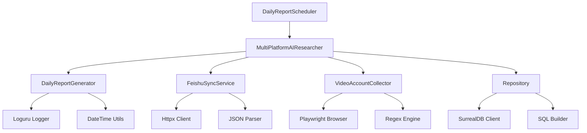

**图表来源**
- [multi_platform_ai_researcher.py](file://open_notebook/skills/multi_platform_ai_researcher/multi_platform_ai_researcher.py#L16-L16)
- [daily_report_generator.py](file://open_notebook/skills/multi_platform_ai_researcher/daily_report_generator.py#L11-L11)
- [ai_tools_scheduler.py](file://open_notebook/skills/multi_platform_ai_researcher/ai_tools_scheduler.py#L12-L12)

**章节来源**
- [skill.yaml](file://open_notebook/skills/multi_platform_ai_researcher/skill.yaml#L22-L25)
- [multi_platform_ai_researcher.py](file://open_notebook/skills/multi_platform_ai_researcher/multi_platform_ai_researcher.py#L16-L16)
- [ai_tools_scheduler.py](file://open_notebook/skills/multi_platform_ai_researcher/ai_tools_scheduler.py#L15-L126)

## 性能考虑

### 异步处理优化

系统采用异步编程模型来提高并发处理能力：

1. **异步数据采集**: 使用 asyncio 和 Playwright 实现非阻塞的网页抓取
2. **批量数据处理**: 支持批量处理大量数据，减少内存占用
3. **连接池管理**: 复用 HTTP 连接，减少网络开销
4. **视频ID缓存**: 新增视频ID提取结果的缓存机制

### 缓存策略

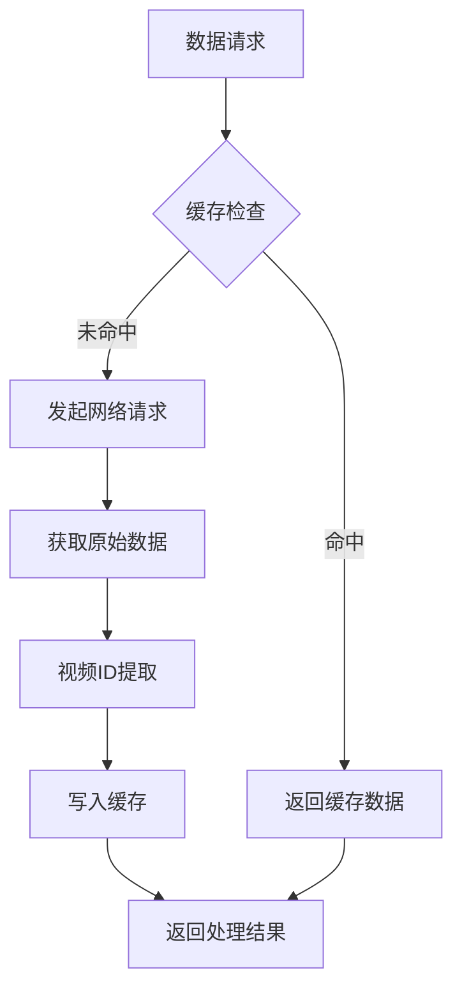

### 内存管理

- **流式处理**: 对于大量数据采用流式处理方式，避免一次性加载到内存
- **垃圾回收**: 定期清理临时对象，防止内存泄漏
- **分页加载**: 对于 API 接口采用分页方式，控制单次请求数据量
- **视频数据优化**: 新增视频内容的内存优化处理机制

## 故障排除指南

### 常见问题及解决方案

#### 1. 视频账号访问失败

**问题症状**: 视频账号数据采集超时或返回空结果

**可能原因**:
- 网络连接不稳定
- 微信视频号反爬虫机制
- IP 被暂时封禁
- Bing 搜索限制

**解决步骤**:
1. 检查网络连接状态
2. 添加代理服务器配置
3. 增加请求间隔时间
4. 更新 User-Agent 头信息
5. 检查Bing搜索是否被限制

#### 2. 视频ID提取失败

**问题症状**: 视频内容无法正确提取视频ID

**可能原因**:
- URL格式变化
- 正则表达式匹配失败
- 站点结构调整

**解决步骤**:
1. 更新URL解析正则表达式
2. 添加多种URL格式支持
3. 实施降级处理策略
4. 增加URL格式验证

#### 3. 数据解析错误

**问题症状**: 报告生成过程中出现解析异常

**可能原因**:
- 页面结构变化
- 选择器失效
- 数据格式不一致

**解决步骤**:
1. 更新页面选择器
2. 添加数据验证逻辑
3. 实施降级处理策略

#### 4. 飞书同步失败

**问题症状**: 报告无法推送到飞书群聊

**可能原因**:
- Webhook URL 配置错误
- 访问令牌过期
- API 调用频率限制

**解决步骤**:
1. 验证 Webhook URL 格式
2. 检查应用权限配置
3. 实施令牌自动刷新机制

#### 5. 调度器执行失败

**问题症状**: 定时任务无法正常执行

**可能原因**:
- 时间设置错误
- 系统时区配置问题
- 调度器进程异常退出

**解决步骤**:
1. 验证调度时间设置
2. 检查系统时区配置
3. 查看调度器日志
4. 重启调度器进程

**章节来源**
- [feishu_sync.py](file://open_notebook/skills/multi_platform_ai_researcher/feishu_sync.py#L244-L288)
- [multi_platform_ai_researcher.py](file://open_notebook/skills/multi_platform_ai_researcher/multi_platform_ai_researcher.py#L507-L545)
- [ai_tools_scheduler.py](file://open_notebook/skills/multi_platform_ai_researcher/ai_tools_scheduler.py#L66-L68)

## 结论

每日报告生成器是一个功能完整、架构清晰的自动化系统，具有以下显著特点：

### 技术优势

1. **模块化设计**: 各组件职责明确，便于维护和扩展
2. **异步处理**: 采用现代异步编程模型，提高系统性能
3. **多平台支持**: 支持主流中国社交媒体平台的数据采集，新增视频账号支持
4. **企业集成**: 提供飞书等企业协作平台的无缝集成
5. **完整分析维度**: 支持平台分布、热门工具、核心洞察、行动建议等多维度分析
6. **自动化调度**: 支持定时任务执行，无需人工干预
7. **视频内容分析**: 新增视频账号数据源，提供更丰富的分析维度

### 应用价值

1. **自动化程度高**: 可设置定时任务，无需人工干预
2. **输出格式多样**: 支持 Markdown、企业微信等多种输出格式
3. **数据分析深入**: 提供多维度的数据分析和洞察，包括视频内容分析
4. **知识库集成**: 自动保存到 Notebook，形成结构化知识
5. **实时监控**: 通过飞书同步及时获取最新分析结果
6. **数据质量提升**: 新增视频ID提取功能，增强数据准确性和可追溯性

### 发展前景

该系统为 Open Notebook 生态系统提供了强大的内容分析和报告生成功能，随着视频账号收集器的引入，系统现在能够提供更加全面和深入的AI工具市场洞察。新增的视频内容分析能力为用户决策提供了更有价值的数据支撑，特别是在视频内容营销和传播分析方面。

系统可以进一步扩展到更多平台和应用场景，为企业和个人用户提供更智能化的信息管理解决方案，特别是在视频内容管理和分析领域具有巨大的应用潜力。