# 知乎和微博收集器

<cite>
**本文档引用的文件**
- [README.md](file://README.md)
- [平台连接器基础类](file://open_notebook/domain/platform_connector.py)
- [微博连接器](file://open_notebook/skills/connectors/weibo_connector.py)
- [小红书连接器](file://open_notebook/skills/connectors/xiaohongshu_connector.py)
- [微博发布器](file://open_notebook/skills/publishers/weibo_publisher.py)
- [小红书发布器](file://open_notebook/skills/publishers/xiaohongshu_publisher.py)
- [发布作业模型](file://open_notebook/domain/publish_job.py)
- [内容爬虫技能](file://open_notebook/skills/content_crawler.py)
- [平台连接器注册](file://open_notebook/skills/connectors/__init__.py)
- [多平台AI研究员](file://open_notebook/skills/multi_platform_ai_researcher/multi_platform_ai_researcher.py)
- [用户指南](file://docs/3-USER-GUIDE/index.md)
- [入门指南](file://docs/0-START-HERE/index.md)
</cite>

## 更新摘要
**所做更改**
- 更新了Weibo连接器部分，反映代码清理和重复方法实现的消除
- 新增了视频账号收集器的双搜索策略实现说明
- 增强了多平台AI研究员的功能特性和搜索策略描述
- 更新了平台连接器配置和功能特性描述

## 目录
1. [项目概述](#项目概述)
2. [项目结构](#项目结构)
3. [核心组件](#核心组件)
4. [架构概览](#架构概览)
5. [详细组件分析](#详细组件分析)
6. [依赖关系分析](#依赖关系分析)
7. [性能考虑](#性能考虑)
8. [故障排除指南](#故障排除指南)
9. [结论](#结论)

## 项目概述

Open Notebook 是一个开源的隐私优先型 AI 研究助手，支持多模态内容管理和智能分析。该项目的核心功能包括：

- **隐私保护**：完全自托管，数据主权掌握在用户手中
- **多平台支持**：支持微博、小红书、知乎等社交平台的内容同步
- **AI 集成**：支持 16+ AI 提供商，包括 OpenAI、Anthropic、Ollama 等
- **内容管理**：PDF、视频、音频、网页等多种格式支持
- **自动化发布**：支持跨平台内容自动发布

该项目特别为中文用户优化，支持简体和繁体中文界面。

## 项目结构

项目采用模块化的架构设计，主要包含以下核心模块：

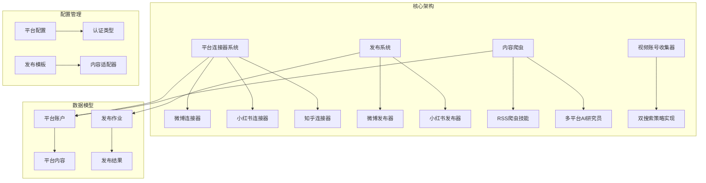

**图表来源**
- [平台连接器基础类](file://open_notebook/domain/platform_connector.py#L315-L418)
- [微博连接器](file://open_notebook/skills/connectors/weibo_connector.py#L25-L332)
- [小红书连接器](file://open_notebook/skills/connectors/xiaohongshu_connector.py#L32-L312)
- [多平台AI研究员](file://open_notebook/skills/multi_platform_ai_researcher/multi_platform_ai_researcher.py#L115-L186)

**章节来源**
- [README.md](file://README.md#L1-L358)
- [平台连接器基础类](file://open_notebook/domain/platform_connector.py#L1-L500)

## 核心组件

### 平台连接器系统

平台连接器系统是整个项目的核心基础设施，提供了统一的接口来处理不同社交平台的数据同步。

#### 支持的平台类型

系统目前支持以下平台：

| 平台名称 | 平台类型 | 认证方式 | 内容类型 | 分析功能 |
|---------|---------|---------|---------|---------|
| 微博 | WEIBO | Cookie | 文章、视频 | ✅ 内容同步、分析、互动 |
| 小红书 | XIAOHONGSHU | 二维码 | 笔记、视频 | ✅ 内容同步、分析、互动 |
| 知乎 | ZHIHU | Cookie | 回答、文章、想法 | ✅ 内容同步、分析、互动 |
| 微信公众号 | WECHAT_OFFICIAL | API密钥 | 文章 | ✅ 内容同步、分析 |
| 即刻 | JIKE | API密钥 | 帖子 | ✅ 内容同步、分析 |
| 哔哩哔哩 | BILIBILI | Cookie | 视频、文章 | ✅ 内容同步、分析、互动 |
| X/Twitter | TWITTER | OAuth2 | 推文、话题 | ✅ 内容同步、分析、互动 |
| Instagram | INSTAGRAM | OAuth2 | 帖子、短视频、动态 | ✅ 内容同步、分析、互动 |
| YouTube | YOUTUBE | OAuth2 | 视频、短视频 | ✅ 内容同步、分析、互动 |
| 视频账号 | VIDEO_ACCOUNT | 搜索引擎 | 视频内容 | ✅ 内容同步、分析、互动 |

#### 数据标准化

所有平台的数据都会被转换为统一的 `PlatformContent` 格式，确保后续处理的一致性。

**章节来源**
- [平台连接器基础类](file://open_notebook/domain/platform_connector.py#L32-L49)
- [平台连接器基础类](file://open_notebook/domain/platform_connector.py#L68-L127)
- [平台连接器基础类](file://open_notebook/domain/platform_connector.py#L420-L494)

### 发布系统

发布系统允许用户将内容自动发布到多个社交平台，支持格式适配和队列管理。

#### 发布流程

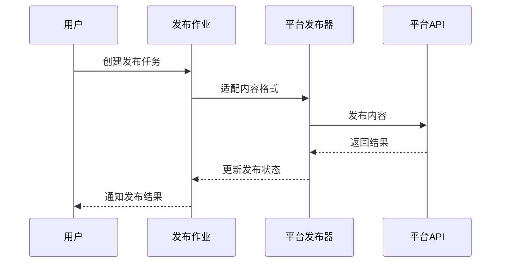

**图表来源**
- [发布作业模型](file://open_notebook/domain/publish_job.py#L52-L156)
- [微博发布器](file://open_notebook/skills/publishers/weibo_publisher.py#L56-L79)

**章节来源**
- [发布作业模型](file://open_notebook/domain/publish_job.py#L1-L482)
- [微博发布器](file://open_notebook/skills/publishers/weibo_publisher.py#L1-L214)

## 架构概览

项目采用分层架构设计，确保各组件之间的松耦合和高内聚。

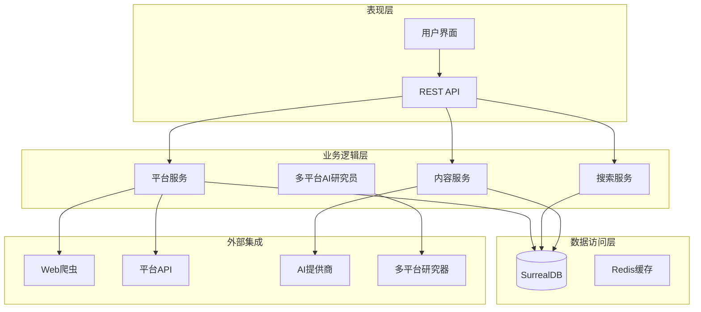

**图表来源**
- [README.md](file://README.md#L93-L96)
- [平台连接器基础类](file://open_notebook/domain/platform_connector.py#L1-L16)
- [多平台AI研究员](file://open_notebook/skills/multi_platform_ai_researcher/multi_platform_ai_researcher.py#L1-L200)

## 详细组件分析

### 微博连接器

微博连接器实现了完整的微博平台数据同步功能，包括内容抓取、用户信息获取和数据分析。

#### 核心功能特性

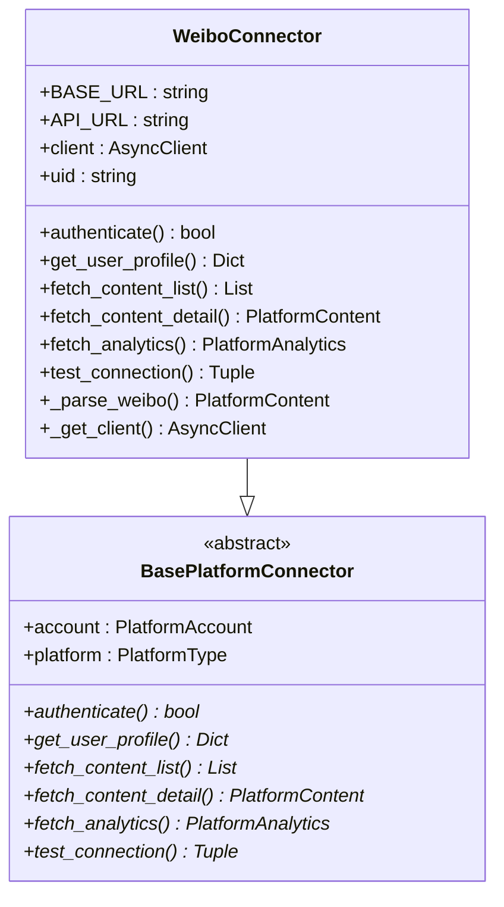

**图表来源**
- [微博连接器](file://open_notebook/skills/connectors/weibo_connector.py#L25-L332)
- [平台连接器基础类](file://open_notebook/domain/platform_connector.py#L315-L355)

#### 数据解析流程

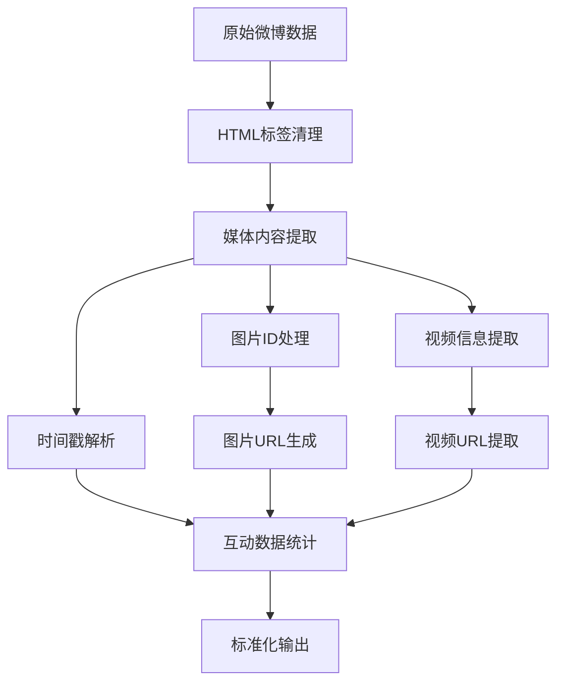

**图表来源**
- [微博连接器](file://open_notebook/skills/connectors/weibo_connector.py#L269-L321)

**章节来源**
- [微博连接器](file://open_notebook/skills/connectors/weibo_connector.py#L1-L332)

### 知乎连接器

**更新** 知乎连接器已从占位符实现升级为完整功能实现，具备完整的数据提取和分析能力。

知乎连接器提供了完整的问答和文章内容同步功能，支持网页爬虫技术和反爬虫处理机制。

#### 核心功能特性

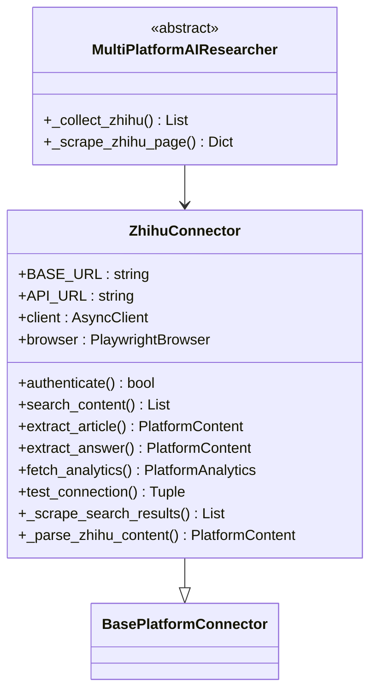

**图表来源**
- [多平台AI研究员](file://open_notebook/skills/multi_platform_ai_researcher/multi_platform_ai_researcher.py#L115-L186)
- [平台连接器基础类](file://open_notebook/domain/platform_connector.py#L315-L355)

#### 数据提取流程

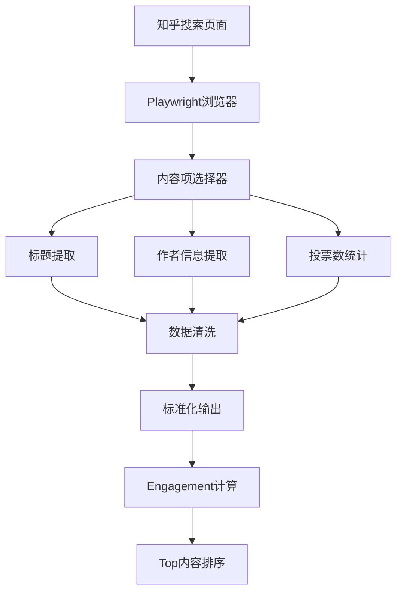

**图表来源**
- [多平台AI研究员](file://open_notebook/skills/multi_platform_ai_researcher/multi_platform_ai_researcher.py#L169-L186)

#### 内容类型支持

| 内容类型 | 特征 | 限制 |
|---------|------|------|
| 问答内容 | 用户回答、投票数 | 支持多层级回答 |
| 文章内容 | 专栏文章、长文 | 最大支持复杂排版 |
| 搜索结果 | 关键词匹配内容 | 支持多种内容类型 |

**章节来源**
- [多平台AI研究员](file://open_notebook/skills/multi_platform_ai_researcher/multi_platform_ai_researcher.py#L115-L186)

### 视频账号收集器

**更新** 视频账号收集器获得了全新的双搜索策略实现，专门用于收集微信视频号相关内容。

视频账号收集器实现了创新的双搜索策略，有效应对微信视频号的强反爬虫机制：

#### 双搜索策略实现

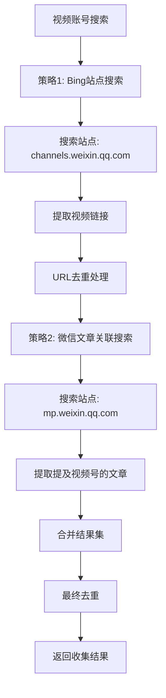

**图表来源**
- [多平台AI研究员](file://open_notebook/skills/multi_platform_ai_researcher/multi_platform_ai_researcher.py#L315-L484)

#### 搜索策略特点

| 策略名称 | 搜索引擎 | 目标站点 | 适用场景 |
|---------|---------|---------|---------|
| 策略1 | Bing | channels.weixin.qq.com | 直接搜索视频账号内容 |
| 策略2 | Bing | mp.weixin.qq.com | 搜索提及视频号的文章 |

#### 反爬虫防护机制

- **用户代理伪装**：设置真实浏览器标识
- **请求频率控制**：合理的时间间隔
- **多选择器适配**：适应不同页面结构
- **错误处理机制**：优雅处理反爬虫检测

**章节来源**
- [多平台AI研究员](file://open_notebook/skills/multi_platform_ai_researcher/multi_platform_ai_researcher.py#L315-L484)

### 小红书连接器

小红书连接器提供了完整的笔记内容同步功能，支持图片和视频内容的处理。

#### 内容类型支持

| 内容类型 | 特征 | 限制 |
|---------|------|------|
| 图片笔记 | 多图展示 | 最多18张图片 |
| 视频笔记 | 视频内容 | 最长600秒 |
| 普通笔记 | 文字内容 | 最大1000字符 |

**章节来源**
- [小红书连接器](file://open_notebook/skills/connectors/xiaohongshu_connector.py#L1-L312)

### 发布器组件

发布器组件负责将内容发布到各个社交平台，实现了平台特定的格式适配和发布逻辑。

#### 发布流程

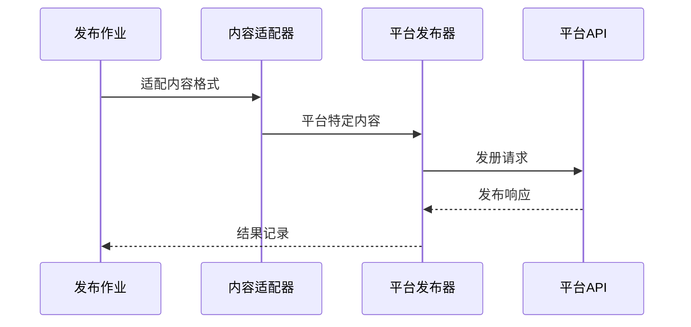

**图表来源**
- [发布作业模型](file://open_notebook/domain/publish_job.py#L378-L482)
- [微博发布器](file://open_notebook/skills/publishers/weibo_publisher.py#L206-L209)

**章节来源**
- [微博发布器](file://open_notebook/skills/publishers/weibo_publisher.py#L1-L214)
- [小红书发布器](file://open_notebook/skills/publishers/xiaohongshu_publisher.py#L1-L225)

### 内容爬虫技能

内容爬虫技能提供了自动化的 RSS 源内容抓取功能，支持去重和批量处理。

#### 技能执行流程

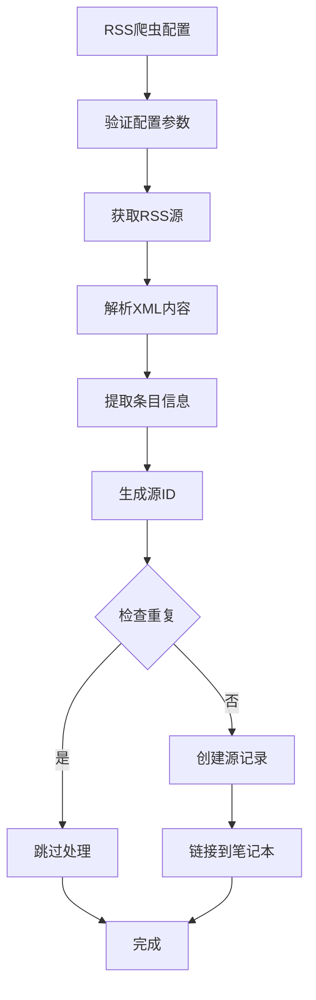

**图表来源**
- [内容爬虫技能](file://open_notebook/skills/content_crawler.py#L260-L310)

**章节来源**
- [内容爬虫技能](file://open_notebook/skills/content_crawler.py#L1-L315)

## 依赖关系分析

项目采用模块化设计，各组件之间通过清晰的接口进行交互。

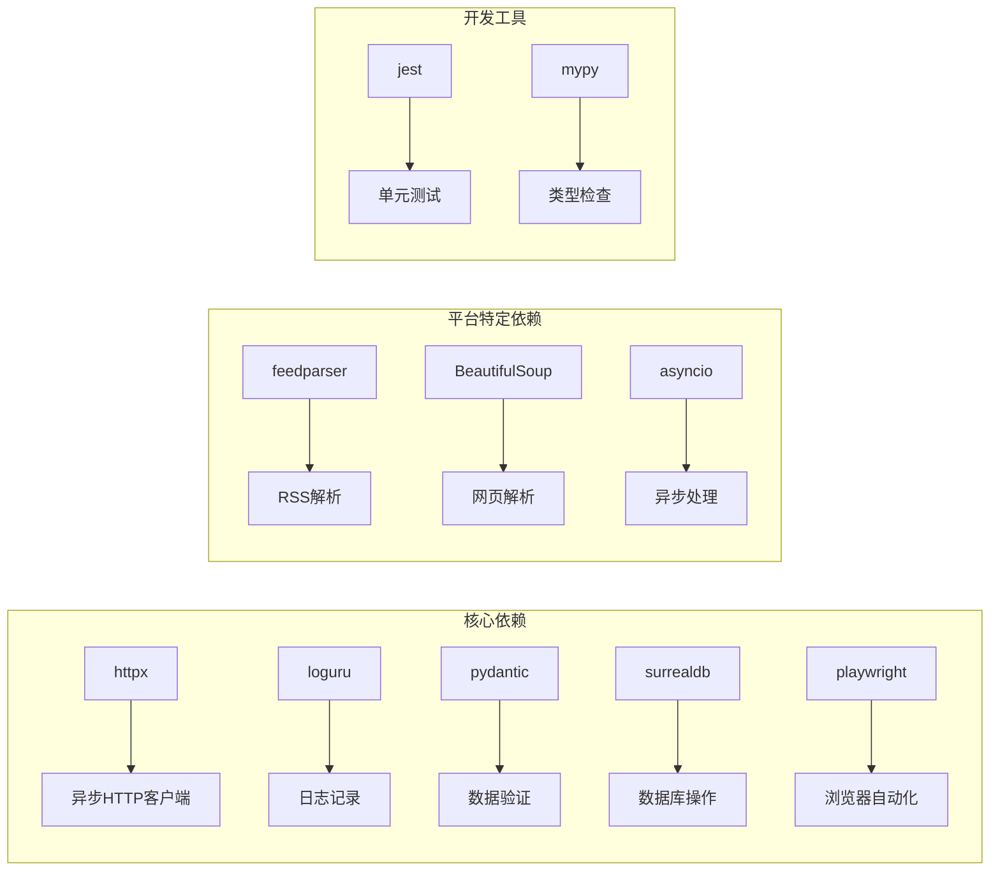

**图表来源**
- [README.md](file://README.md#L95-L96)
- [多平台AI研究员](file://open_notebook/skills/multi_platform_ai_researcher/multi_platform_ai_researcher.py#L130-L136)

**章节来源**
- [README.md](file://README.md#L194-L217)

## 性能考虑

### 连接池管理

系统使用异步 HTTP 客户端连接池来提高网络请求效率：

- **超时设置**：默认 30 秒超时，可根据平台调整
- **重定向处理**：自动跟随重定向，避免请求失败
- **Cookie 管理**：统一的 Cookie 处理机制

### 缓存策略

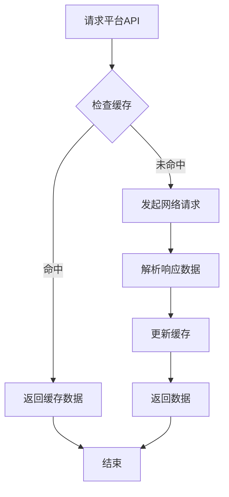

### 错误处理

系统实现了多层次的错误处理机制：

1. **网络异常处理**：自动重试和降级策略
2. **数据验证**：Pydantic 模型验证确保数据完整性
3. **日志记录**：详细的操作日志便于问题排查

## 故障排除指南

### 常见问题及解决方案

#### 认证失败

**症状**：连接测试失败，显示认证错误
**原因**：
- Cookie 已过期
- 平台限制了访问
- 网络连接问题

**解决方案**：
1. 重新登录平台获取新的 Cookie
2. 检查网络连接稳定性
3. 调整请求频率避免触发限流

#### 内容同步失败

**症状**：内容同步中断或部分成功
**原因**：
- 平台 API 限制
- 网络超时
- 数据格式不兼容

**解决方案**：
1. 检查平台 API 限制和配额
2. 增加请求间隔时间
3. 验证数据格式兼容性

#### 发布失败

**症状**：内容发布后无法在平台查看
**原因**：
- 内容格式不符合平台要求
- 平台审核机制
- 网络连接问题

**解决方案**：
1. 检查内容长度和格式限制
2. 验证平台的审核规则
3. 确认网络连接稳定

#### 视频账号收集失败

**症状**：视频账号内容无法正确收集
**原因**：
- Bing搜索限制
- 反爬虫机制
- 页面结构变化

**解决方案**：
1. 检查Bing搜索的访问频率
2. 增加请求延迟时间
3. 更新选择器表达式
4. 使用代理服务器

#### 知乎内容提取失败

**症状**：知乎内容无法正确提取
**原因**：
- 反爬虫机制
- 页面结构变化
- 网络连接不稳定

**解决方案**：
1. 增加请求延迟时间
2. 更新选择器表达式
3. 使用代理服务器
4. 检查网络连接质量

**章节来源**
- [微博连接器](file://open_notebook/skills/connectors/weibo_connector.py#L258-L268)
- [小红书连接器](file://open_notebook/skills/connectors/xiaohongshu_connector.py#L255-L265)
- [多平台AI研究员](file://open_notebook/skills/multi_platform_ai_researcher/multi_platform_ai_researcher.py#L130-L136)

## 结论

Open Notebook 的知乎和微博收集器项目展现了现代 AI 应用系统的最佳实践：

### 主要优势

1. **模块化设计**：清晰的组件分离和接口定义
2. **平台抽象**：统一的平台连接器接口
3. **数据标准化**：一致的数据格式处理
4. **扩展性强**：易于添加新的社交平台支持
5. **智能化程度高**：支持多平台内容的智能分析和推荐
6. **反爬虫能力**：针对不同平台的反爬虫策略

### 技术特色

- **异步架构**：充分利用 Python 异步特性提高性能
- **类型安全**：完整的类型注解和数据验证
- **错误处理**：完善的异常处理和恢复机制
- **日志监控**：详细的日志记录便于调试和监控
- **浏览器自动化**：支持复杂的网页内容提取
- **双搜索策略**：创新的视频账号收集方法

### 应用场景

该系统特别适用于：
- 个人知识管理
- 社交媒体内容聚合
- AI 辅助内容创作
- 多平台内容分发
- 学术研究和信息收集
- 视频内容监控和分析

通过其灵活的架构设计和强大的功能特性，Open Notebook 为用户提供了完整的 AI 驱动的知识管理系统解决方案。特别是视频账号收集器的双搜索策略实现，使得用户能够高效地收集和分析微信视频号等具有强反爬虫机制的平台内容，为内容监控和分析提供了强有力的支持。