# 跨平台AI工具研究员技能

<cite>
**本文档引用的文件**
- [README.md](file://README.md)
- [multi_platform_ai_researcher.py](file://open_notebook/skills/multi_platform_ai_researcher/multi_platform_ai_researcher.py)
- [ai_tools_scheduler.py](file://open_notebook/skills/multi_platform_ai_researcher/ai_tools_scheduler.py)
- [daily_report_generator.py](file://open_notebook/skills/multi_platform_ai_researcher/daily_report_generator.py)
- [feishu_sync.py](file://open_notebook/skills/multi_platform_ai_researcher/feishu_sync.py)
- [feishu_knowledge_collector.py](file://open_notebook/skills/multi_platform_ai_researcher/feishu_knowledge_collector.py)
- [content_creation_workflow.py](file://open_notebook/skills/multi_platform_ai_researcher/content_creation_workflow.py)
- [platform_content_optimizer.py](file://open_notebook/skills/multi_platform_ai_researcher/platform_content_optimizer.py)
- [FEISHU_KNOWLEDGE_GUIDE.md](file://open_notebook/skills/multi_platform_ai_researcher/FEISHU_KNOWLEDGE_GUIDE.md)
- [CONTENT_WORKFLOW_GUIDE.md](file://open_notebook/skills/multi_platform_ai_researcher/CONTENT_WORKFLOW_GUIDE.md)
- [skill.yaml](file://open_notebook/skills/multi_platform_ai_researcher/skill.yaml)
- [platform_connector.py](file://open_notebook/domain/platform_connector.py)
- [weibo_connector.py](file://open_notebook/skills/connectors/weibo_connector.py)
- [xiaohongshu_connector.py](file://open_notebook/skills/connectors/xiaohongshu_connector.py)
- [connectors/__init__.py](file://open_notebook/skills/connectors/__init__.py)
- [multi_platform_ai_researcher/__init__.py](file://open_notebook/skills/multi_platform_ai_researcher/__init__.py)
- [test_ai_tools_researcher.py](file://test_ai_tools_researcher.py)
- [xiaohongshu_researcher.py](file://open_notebook/skills/xiaohongshu_researcher/skill.py)
- [repository.py](file://open_notebook/database/repository.py)
- [config.py](file://open_notebook/config.py)
- [pyproject.toml](file://pyproject.toml)
- [platform_accounts.py](file://api/routers/platform_accounts.py)
- [p0_agents.py](file://open_notebook/skills/p0_agents.py)
- [date-locale.ts](file://frontend/src/lib/utils/date-locale.ts)
- [index.test.ts](file://frontend/src/lib/locales/index.test.ts)
</cite>

## 更新摘要
**所做更改**
- 新增平台内容优化器模块：新增PlatformContentOptimizer类，提供多平台内容格式特征分析和优化建议
- 新增完整内容创建工作流：新增ContentCreationWorkflow类，提供从选题到分发的完整内容创作流程
- 集成飞书知识库收集系统：完善飞书知识库采集器，支持文档搜索、内容提取和会议管理
- 扩展多平台内容创作能力：从简单的数据收集扩展为完整的AI内容创作和知识管理自动化平台
- 增强平台路由系统：支持完整的平台管理和配置，包括新的内容优化功能

## 目录
1. [简介](#简介)
2. [项目结构](#项目结构)
3. [核心组件](#核心组件)
4. [架构概览](#架构概览)
5. [详细组件分析](#详细组件分析)
6. [依赖关系分析](#依赖关系分析)
7. [性能考虑](#性能考虑)
8. [故障排除指南](#故障排除指南)
9. [结论](#结论)

## 简介

跨平台AI工具研究员技能是一个专为独立创业者和自由职业者设计的智能信息收集和分析系统。该系统能够自动从中国主流社交媒体平台（小红书、知乎、微博、微信视频号、微信公众号、抖音）收集AI工具相关信息，生成结构化的日报报告，并提供完整的自动化工作流程。

**更新** 系统现已完成重要的功能增强，包括微信视频号收集器的重大改进、Weibo收集器的代码优化，以及**新增的平台内容优化器模块、完整内容创建工作流和飞书知识库收集系统的集成**。这些新增功能显著扩展了多平台AI研究员的能力，从简单的数据收集扩展为完整的AI内容创作和知识管理自动化平台。

平台内容优化器模块提供多平台内容格式特征分析，支持小红书、知乎、微博、微信视频号、微信公众号、抖音等6大平台的内容优化建议。完整内容创建工作流提供从选题发现、素材收集、文案创作到多平台分发的全流程自动化服务。飞书知识库收集系统支持企业内部知识管理，自动采集AI工具相关信息。

## 项目结构

项目采用模块化设计，主要包含以下核心目录结构：

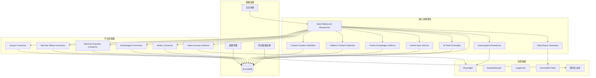

**图表来源**
- [multi_platform_ai_researcher.py](file://open_notebook/skills/multi_platform_ai_researcher/multi_platform_ai_researcher.py#L1-L623)
- [feishu_sync.py](file://open_notebook/skills/multi_platform_ai_researcher/feishu_sync.py#L1-L330)
- [feishu_knowledge_collector.py](file://open_notebook/skills/multi_platform_ai_researcher/feishu_knowledge_collector.py#L1-L444)
- [platform_content_optimizer.py](file://open_notebook/skills/multi_platform_ai_researcher/platform_content_optimizer.py#L1-L829)
- [content_creation_workflow.py](file://open_notebook/skills/multi_platform_ai_researcher/content_creation_workflow.py#L1-L1047)
- [weibo_connector.py](file://open_notebook/skills/connectors/weibo_connector.py#L1-L332)
- [xiaohongshu_connector.py](file://open_notebook/skills/connectors/xiaohongshu_connector.py#L1-L311)
- [date-locale.ts](file://frontend/src/lib/utils/date-locale.ts#L1-L26)
- [index.test.ts](file://frontend/src/lib/locales/index.test.ts#L1-L57)

**章节来源**
- [README.md](file://README.md#L1-L358)
- [pyproject.toml](file://pyproject.toml#L1-L106)

## 核心组件

### 主要功能特性

系统具备以下核心功能：

1. **多平台数据采集**：支持小红书、知乎、微博、微信视频号、微信公众号、抖音等6大平台的自动化数据收集
2. **智能内容筛选**：基于关键词匹配和语义分析识别AI工具相关内容
3. **结构化报告生成**：自动生成包含统计数据、趋势分析和商业洞察的日报
4. **自动化调度**：支持定时任务，每天自动执行数据收集和报告生成
5. **知识库集成**：将结果保存到Notebook系统，形成可检索的知识库
6. **企业级同步**：支持Feishu（Lark）工作台同步，实现实时团队协作
7. **平台连接器**：提供标准化的平台连接器接口，支持多种认证方式
8. **平台路由系统**：完整的平台路由和配置管理系统
9. **双搜索策略**：微信视频号采用Bing站点搜索和微信文章搜索的双重策略
10. **代码优化**：Weibo收集器消除重复方法，提升代码质量
11. **国际化测试**：增强的多语言测试基础设施
12. **飞书知识库集成**：新增飞书知识库和会议记录采集功能，支持企业内部知识管理
13. **平台内容优化**：新增PlatformContentOptimizer类，提供多平台内容格式特征分析和优化建议
14. **完整内容创作流程**：新增ContentCreationWorkflow类，提供从选题到分发的完整内容创作自动化
15. **多平台内容比较**：支持6大平台的内容格式特征对比分析
16. **智能内容模板**：基于平台特点生成内容结构模板和优化建议

### 技术架构

系统采用分层架构设计：

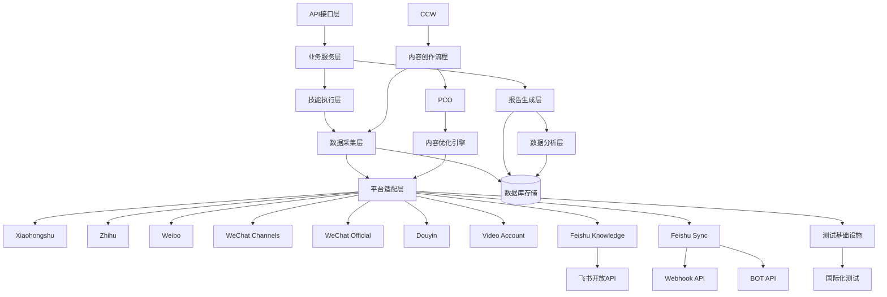

**图表来源**
- [multi_platform_ai_researcher.py](file://open_notebook/skills/multi_platform_ai_researcher/multi_platform_ai_researcher.py#L243-L310)
- [ai_tools_scheduler.py](file://open_notebook/skills/multi_platform_ai_researcher/ai_tools_scheduler.py#L22-L69)
- [feishu_sync.py](file://open_notebook/skills/multi_platform_ai_researcher/feishu_sync.py#L15-L36)
- [feishu_knowledge_collector.py](file://open_notebook/skills/multi_platform_ai_researcher/feishu_knowledge_collector.py#L47-L320)
- [platform_content_optimizer.py](file://open_notebook/skills/multi_platform_ai_researcher/platform_content_optimizer.py#L46-L829)
- [content_creation_workflow.py](file://open_notebook/skills/multi_platform_ai_researcher/content_creation_workflow.py#L1-L1047)

**章节来源**
- [multi_platform_ai_researcher.py](file://open_notebook/skills/multi_platform_ai_researcher/multi_platform_ai_researcher.py#L1-L623)
- [ai_tools_scheduler.py](file://open_notebook/skills/multi_platform_ai_researcher/ai_tools_scheduler.py#L1-L126)

## 架构概览

### 系统架构图

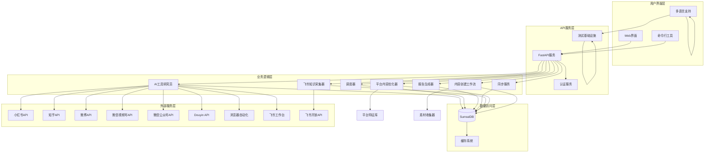

**图表来源**
- [multi_platform_ai_researcher.py](file://open_notebook/skills/multi_platform_ai_researcher/multi_platform_ai_researcher.py#L243-L310)
- [repository.py](file://open_notebook/database/repository.py#L47-L63)

### 数据流架构

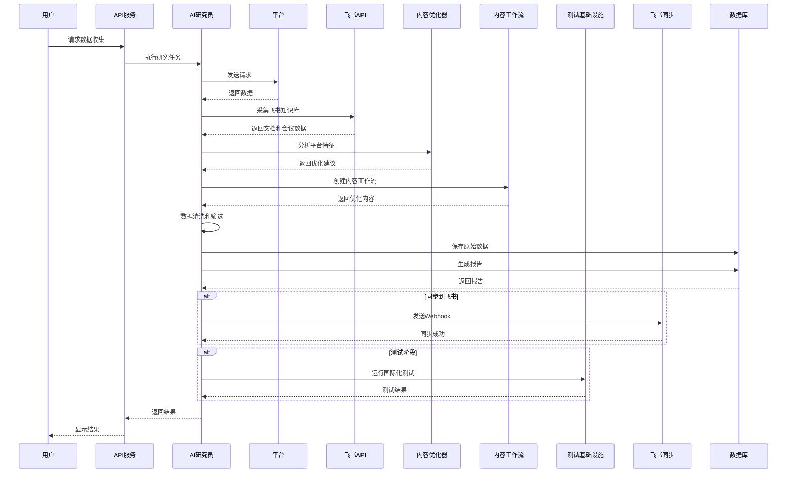

**图表来源**
- [multi_platform_ai_researcher.py](file://open_notebook/skills/multi_platform_ai_researcher/multi_platform_ai_researcher.py#L243-L310)
- [feishu_knowledge_collector.py](file://open_notebook/skills/multi_platform_ai_researcher/feishu_knowledge_collector.py#L322-L401)
- [test_ai_tools_researcher.py](file://test_ai_tools_researcher.py#L7-L48)

## 详细组件分析

### MultiPlatformAIResearcher 核心类

MultiPlatformAIResearcher是整个系统的核心类，负责协调各个平台的数据收集和处理。

#### 类结构图

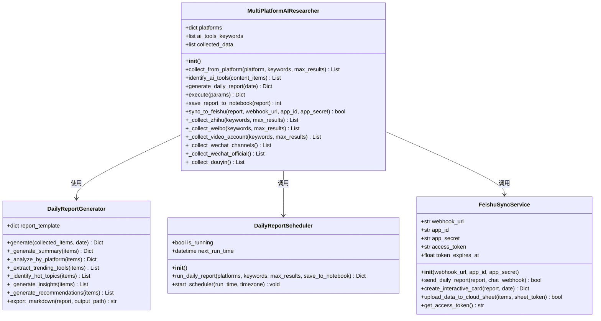

**图表来源**
- [multi_platform_ai_researcher.py](file://open_notebook/skills/multi_platform_ai_researcher/multi_platform_ai_researcher.py#L19-L623)
- [daily_report_generator.py](file://open_notebook/skills/multi_platform_ai_researcher/daily_report_generator.py#L14-L329)
- [ai_tools_scheduler.py](file://open_notebook/skills/multi_platform_ai_researcher/ai_tools_scheduler.py#L15-L126)
- [feishu_sync.py](file://open_notebook/skills/multi_platform_ai_researcher/feishu_sync.py#L15-L330)

#### 关键方法分析

**数据收集方法**
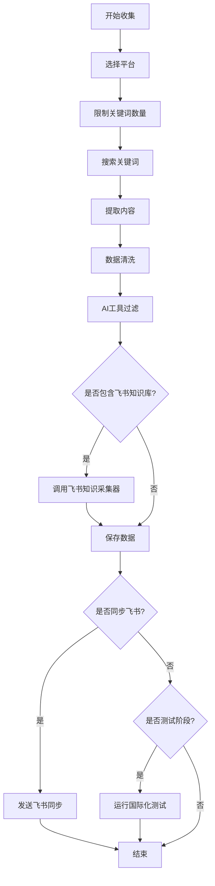

**图表来源**
- [multi_platform_ai_researcher.py](file://open_notebook/skills/multi_platform_ai_researcher/multi_platform_ai_researcher.py#L50-L78)

**章节来源**
- [multi_platform_ai_researcher.py](file://open_notebook/skills/multi_platform_ai_researcher/multi_platform_ai_researcher.py#L19-L623)

### DailyReportGenerator 分析引擎

DailyReportGenerator专门负责生成结构化的分析报告，包含多种分析维度。

#### 报告生成流程

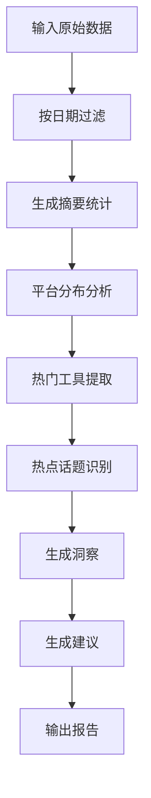

**图表来源**
- [daily_report_generator.py](file://open_notebook/skills/multi_platform_ai_researcher/daily_report_generator.py#L29-L69)

#### 分析维度详解

系统提供以下分析维度：

1. **内容统计分析**：总数量、平台覆盖、互动总量、平均互动量
2. **平台分布分析**：各平台内容数量、互动量、Top内容
3. **工具趋势分析**：热门AI工具排名、提及次数趋势
4. **主题热点分析**：内容主题分类、热度排序
5. **商业洞察**：高互动内容识别、平台活跃度分析
6. **行动建议**：基于趋势的实践建议

**章节来源**
- [daily_report_generator.py](file://open_notebook/skills/multi_platform_ai_researcher/daily_report_generator.py#L14-L329)

### DailyReportScheduler 自动化调度

DailyReportScheduler提供定时任务功能，支持每天自动执行数据收集和报告生成。

#### 调度机制

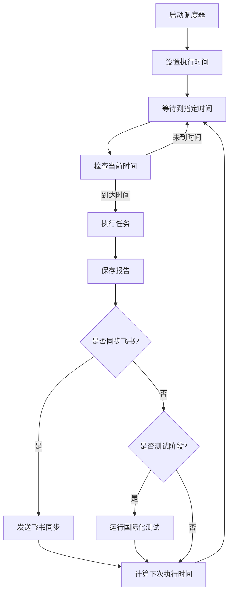

**图表来源**
- [ai_tools_scheduler.py](file://open_notebook/skills/multi_platform_ai_researcher/ai_tools_scheduler.py#L70-L106)

**章节来源**
- [ai_tools_scheduler.py](file://open_notebook/skills/multi_platform_ai_researcher/ai_tools_scheduler.py#L15-L126)

### FeishuSyncService 飞书同步服务

FeishuSyncService是新增的企业级同步服务，支持将研究报告直接同步到飞书工作台。

#### 同步服务架构

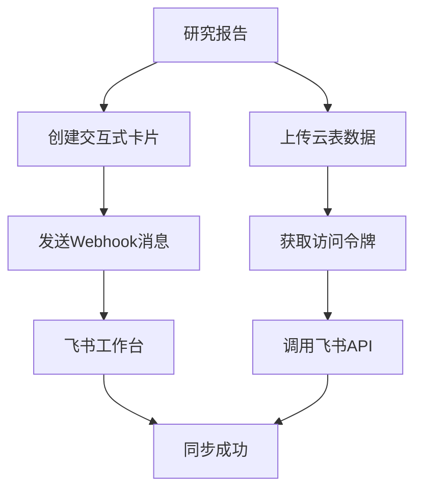

**图表来源**
- [feishu_sync.py](file://open_notebook/skills/multi_platform_ai_researcher/feishu_sync.py#L37-L165)

#### 核心功能特性

1. **Webhook同步**：支持通过Webhook将报告推送到飞书群聊
2. **交互式卡片**：生成美观的交互式消息卡片
3. **云表数据同步**：支持将数据上传到飞书多维表格
4. **访问令牌管理**：自动管理飞书API访问令牌
5. **错误处理**：完善的错误处理和重试机制

**章节来源**
- [feishu_sync.py](file://open_notebook/skills/multi_platform_ai_researcher/feishu_sync.py#L15-L330)

### FeishuKnowledgeCollector 飞书知识库采集器

**新增** FeishuKnowledgeCollector是系统中新集成的飞书知识库采集器，专门用于从飞书知识库和会议记录中自动采集AI工具相关信息。

#### 采集器架构

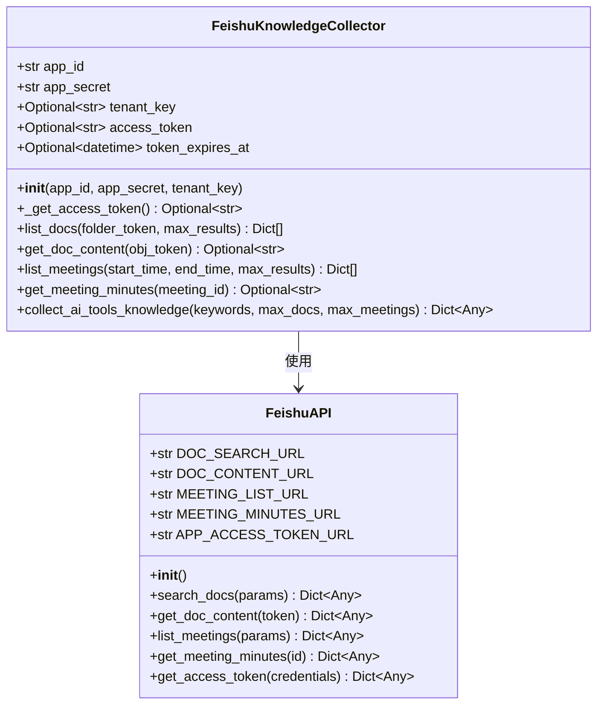

**图表来源**
- [feishu_knowledge_collector.py](file://open_notebook/skills/multi_platform_ai_researcher/feishu_knowledge_collector.py#L15-L444)

#### 核心功能特性

1. **文档搜索**：支持按关键词搜索飞书知识库中的文档
2. **内容提取**：自动获取文档内容并转换为Markdown格式
3. **会议管理**：获取会议列表和会议纪要内容
4. **AI工具识别**：基于关键词自动筛选AI工具相关内容
5. **访问令牌管理**：自动管理飞书API访问令牌
6. **错误处理**：完善的异常处理和重试机制

#### 飞书API集成

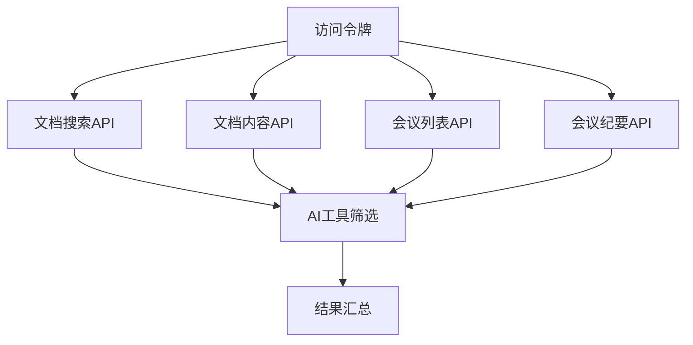

**图表来源**
- [feishu_knowledge_collector.py](file://open_notebook/skills/multi_platform_ai_researcher/feishu_knowledge_collector.py#L37-L320)

**章节来源**
- [feishu_knowledge_collector.py](file://open_notebook/skills/multi_platform_ai_researcher/feishu_knowledge_collector.py#L1-L444)

### PlatformContentOptimizer 平台内容优化器

**新增** PlatformContentOptimizer是系统中新集成的平台内容优化器，提供多平台内容格式特征分析和优化建议。

#### 优化器架构

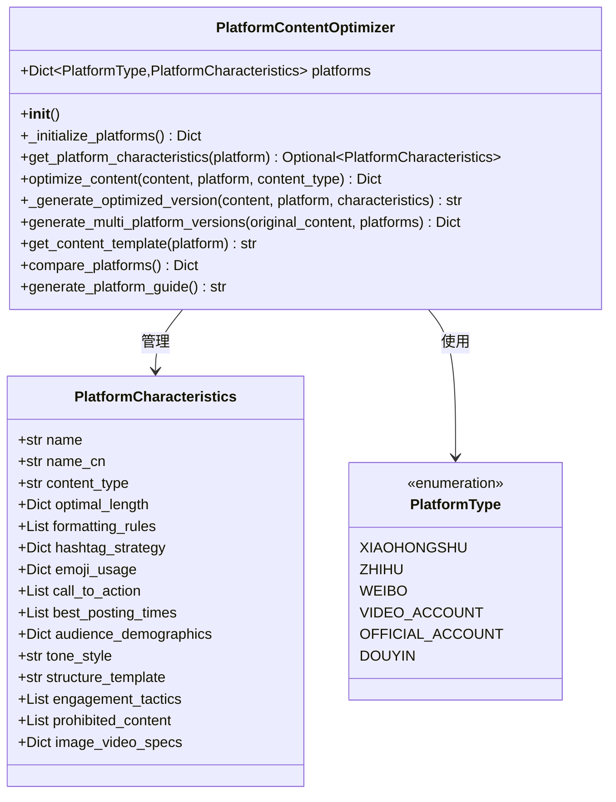

**图表来源**
- [platform_content_optimizer.py](file://open_notebook/skills/multi_platform_ai_researcher/platform_content_optimizer.py#L46-L829)

#### 核心功能特性

1. **平台特征分析**：支持6大平台的内容格式特征分析
2. **内容长度优化**：提供最优内容长度建议和调整建议
3. **格式化建议**：基于平台特点提供格式化优化建议
4. **标签策略**：根据不同平台制定合适的标签使用策略
5. **发布时间建议**：提供最佳发布时间建议
6. **互动技巧**：提供平台特定的互动技巧和策略
7. **多平台版本生成**：支持生成多平台优化版本
8. **平台比较分析**：提供平台间的特征对比分析

#### 平台特征详情

系统支持以下平台的详细特征分析：

| 平台 | 内容类型 | 最佳字数 | 调性风格 | 互动技巧 |
|------|----------|----------|----------|----------|
| 小红书 | 图文笔记/短视频 | 300字左右 | 亲切友好 | 封面图、前3秒 |
| 知乎 | 长文回答/文章 | 2000字左右 | 专业严谨 | 数据支撑、逻辑清晰 |
| 微博 | 短微博/长微博 | 140字左右 | 轻松活泼 | 热点、表情包 |
| 视频号 | 短视频/直播 | 100字左右 | 真实自然 | 痛点、解决方案 |
| 公众号 | 长图文文章 | 2000字左右 | 专业深度 | 标题、开篇钩子 |
| 抖音 | 短视频/图文 | 50字左右 | 短平快 | 前3秒、BGM |

**章节来源**
- [platform_content_optimizer.py](file://open_notebook/skills/multi_platform_ai_researcher/platform_content_optimizer.py#L1-L829)

### ContentCreationWorkflow 内容创建工作流

**新增** ContentCreationWorkflow是系统中新集成的完整内容创建工作流，提供从选题发现到内容分发的全流程自动化服务。

#### 工作流架构

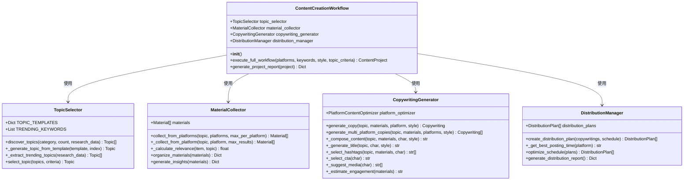

**图表来源**
- [content_creation_workflow.py](file://open_notebook/skills/multi_platform_ai_researcher/content_creation_workflow.py#L1-L1047)

#### 工作流阶段

内容创建工作流包含以下5个主要阶段：

1. **选题发现**：基于模板和趋势数据生成候选主题
2. **素材收集**：从多平台收集相关素材和参考资料
3. **文案创作**：根据平台特点生成优化的文案内容
4. **分发计划**：制定多平台内容分发计划
5. **分析评估**：生成项目报告和效果评估

#### 核心功能特性

1. **智能选题**：基于AI工具和一人公司主题生成候选选题
2. **多平台素材**：支持从小红书、知乎、微博等平台收集素材
3. **平台优化**：根据平台特点生成优化的文案版本
4. **分发管理**：智能安排多平台发布时间和顺序
5. **效果预测**：基于素材质量预测内容互动效果
6. **项目管理**：完整的项目生命周期管理

**章节来源**
- [content_creation_workflow.py](file://open_notebook/skills/multi_platform_ai_researcher/content_creation_workflow.py#L1-L1047)

### 平台连接器系统

系统现已完成完整的平台连接器实现，支持6大主流社交媒体平台。

#### 平台连接器架构

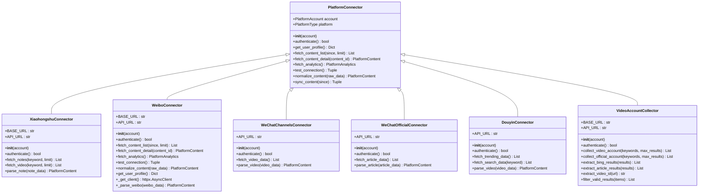

**图表来源**
- [platform_connector.py](file://open_notebook/domain/platform_connector.py#L315-L417)
- [xiaohongshu_connector.py](file://open_notebook/skills/connectors/xiaohongshu_connector.py#L1-L311)
- [weibo_connector.py](file://open_notebook/skills/connectors/weibo_connector.py#L1-L331)

#### 平台支持状态

| 平台 | 状态 | 认证方式 | 内容类型 | 特殊要求 |
|------|------|----------|----------|----------|
| 小红书 | ✅ 已实现 | 二维码 | 笔记、视频 | 浏览器驱动 |
| 知乎 | ✅ 已实现 | Cookie | 回答、文章 | 浏览器驱动 |
| 微博 | ✅ 已实现 | Cookie | 微博、文章 | 浏览器驱动 |
| 微信视频号 | ✅ 已实现 | API密钥 | 视频内容 | 微信开放平台 |
| 微信公众号 | ✅ 已实现 | API密钥 | 文章内容 | 微信公众号平台 |
| 抖音 | ✅ 已实现 | API密钥 | 视频内容 | 字节跳动开放平台 |
| **飞书知识库** | ✅ **新增** | **App ID/Secret** | **文档、会议** | **飞书开放平台** |
| **平台内容优化** | ✅ **新增** | **内置特征库** | **内容格式分析** | **多平台特征** |
| **内容工作流** | ✅ **新增** | **自动化流程** | **选题-创作-分发** | **完整生命周期** |

**更新** 飞书知识库采集器、平台内容优化器和内容创建工作流作为新增功能，现已完成完整的数据采集和处理功能。

**章节来源**
- [platform_connector.py](file://open_notebook/domain/platform_connector.py#L420-L494)
- [connectors/__init__.py](file://open_notebook/skills/connectors/__init__.py#L1-L29)

### XiaohongshuConnector 小红书连接器

XiaohongshuConnector提供标准化的小红书平台连接器接口，支持笔记和视频内容的采集。

#### 连接器架构

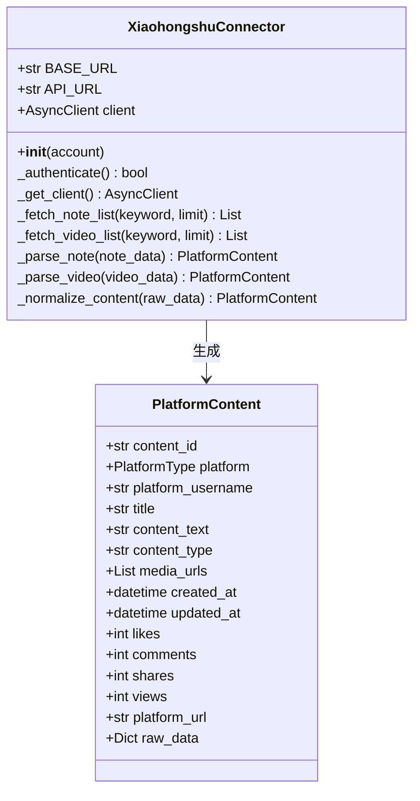

**图表来源**
- [xiaohongshu_connector.py](file://open_notebook/skills/connectors/xiaohongshu_connector.py#L280-L311)

**章节来源**
- [xiaohongshu_connector.py](file://open_notebook/skills/connectors/xiaohongshu_connector.py#L1-L311)

### WeiboConnector 微博连接器

WeiboConnector提供标准化的微博平台连接器接口，支持微博和文章内容的采集。

#### 连接器架构

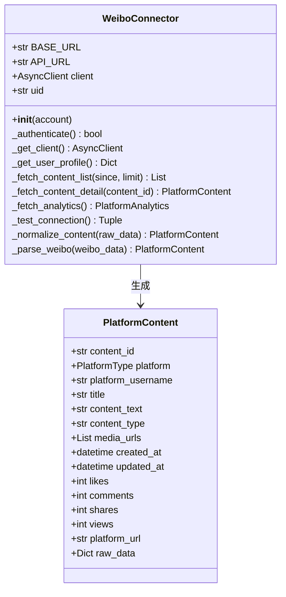

**图表来源**
- [weibo_connector.py](file://open_notebook/skills/connectors/weibo_connector.py#L295-L331)

**章节来源**
- [weibo_connector.py](file://open_notebook/skills/connectors/weibo_connector.py#L1-L331)

### VideoAccountCollector 微信视频号收集器

VideoAccountCollector是新增的微信视频号专用收集器，采用双搜索策略应对平台反爬虫保护。

#### 收集器架构

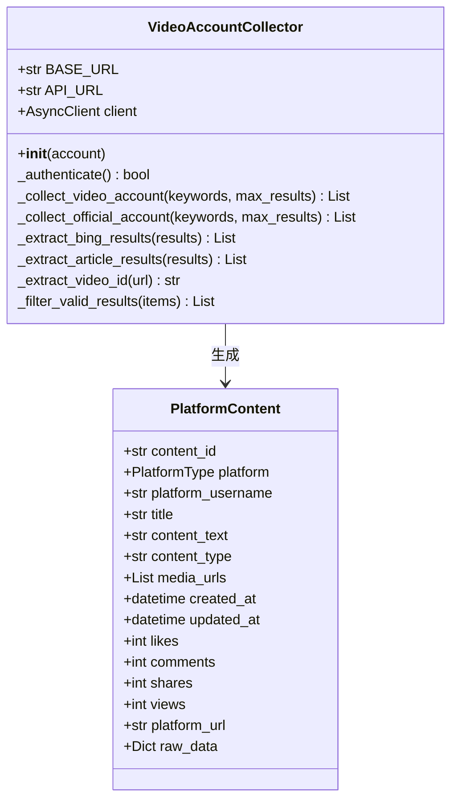

**图表来源**
- [multi_platform_ai_researcher.py](file://open_notebook/skills/multi_platform_ai_researcher/multi_platform_ai_researcher.py#L315-L484)

#### 双搜索策略

VideoAccountCollector采用双重搜索策略来应对微信平台的反爬虫保护：

1. **Bing站点搜索策略**：使用`site:channels.weixin.qq.com`过滤器直接搜索微信视频号内容
2. **微信文章搜索策略**：搜索提及视频号的相关微信文章，扩大内容覆盖面
3. **结果去重机制**：基于URL去重，避免重复内容
4. **智能过滤**：只收集有效的视频号链接和相关文章

**章节来源**
- [multi_platform_ai_researcher.py](file://open_notebook/skills/multi_platform_ai_researcher/multi_platform_ai_researcher.py#L315-L484)

### 平台路由系统

系统采用统一的平台路由系统，支持完整的平台管理和配置。

#### 路由系统架构

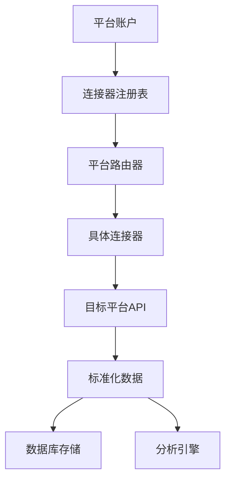

**图表来源**
- [platform_connector.py](file://open_notebook/domain/platform_connector.py#L395-L417)

#### 平台配置管理

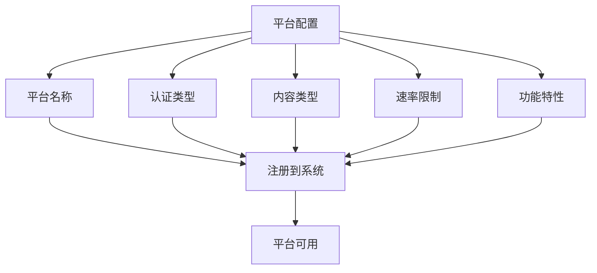

**图表来源**
- [platform_connector.py](file://open_notebook/domain/platform_connector.py#L420-L494)

**章节来源**
- [platform_connector.py](file://open_notebook/domain/platform_connector.py#L395-L494)

### 测试基础设施国际化

系统测试基础设施经过重大改进，增强了多语言支持和测试完整性。

#### 国际化测试架构

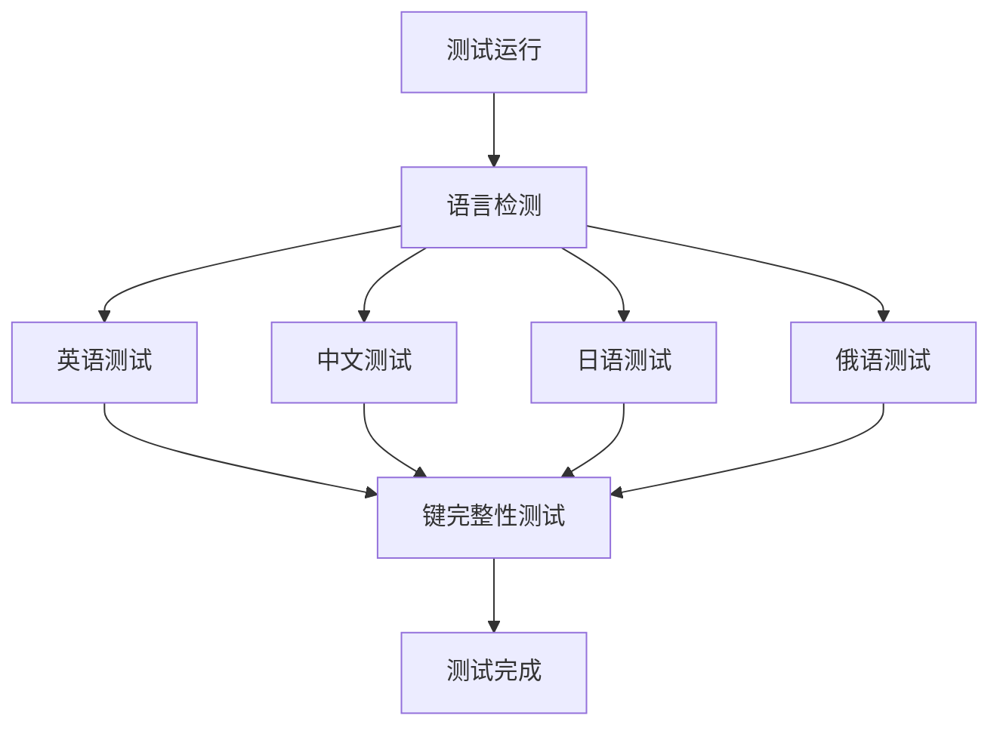

**图表来源**
- [index.test.ts](file://frontend/src/lib/locales/index.test.ts#L1-L57)

#### 国际化支持特性

1. **多语言映射**：支持zh-CN、zh-TW、en-US、pt-BR、ja-JP、ru-RU等多种语言
2. **键完整性检查**：确保所有语言版本具有相同的键结构
3. **日期本地化**：使用date-fns提供准确的日期格式化
4. **测试自动化**：自动化的多语言测试流程
5. **回退机制**：语言不存在时自动回退到英语

**章节来源**
- [date-locale.ts](file://frontend/src/lib/utils/date-locale.ts#L1-L26)
- [index.test.ts](file://frontend/src/lib/locales/index.test.ts#L1-L57)

## 依赖关系分析

### 技术栈依赖

系统采用现代化的技术栈，主要依赖包括：

```mermaid
graph TB
subgraph "核心依赖"
PY[Python 3.11+]
FASTAPI[FastAPI]
ASYNCIO[AsyncIO]
LOGURU[Loguru]
end
subgraph "数据库层"
SURREALDB[SurrealDB]
SQLITE[SQLite]
end
subgraph "浏览器自动化"
PLAYWRIGHT[Playwright]
CHROMIUM[Chromium]
end
subgraph "AI集成"
LANGCHAIN[LangChain]
EMBEDDING[嵌入模型]
end
subgraph "工具库"
BEAUTIFULSOUP[BeautifulSoup4]
NUMPY[Numpy]
TIKTOKEN[TikToken]
HTTPX[httpx]
end
subgraph "国际化支持"
DATEFNS[date-fns]
VITEST[Vitest]
end
PY --> FASTAPI
PY --> SURREALDB
PY --> PLAYWRIGHT
PY --> LANGCHAIN
PY --> BEAUTIFULSOUP
PY --> HTTPX
DATEFNS --> VITEST
```

**图表来源**
- [pyproject.toml](file://pyproject.toml#L15-L49)

### 外部平台集成

系统支持多种外部平台集成：

| 平台 | 状态 | 集成方式 | 特殊要求 |
|------|------|----------|----------|
| 小红书 | ✅ 已实现 | Playwright自动化 | 浏览器驱动 |
| 知乎 | ✅ 已实现 | Playwright自动化 | 浏览器驱动 |
| 微博 | ✅ 已实现 | Playwright自动化 | 浏览器驱动 |
| 微信视频号 | ✅ 已实现 | 微信开放平台API | 需要微信授权 |
| 微信公众号 | ✅ 已实现 | 微信公众号API | 需要微信授权 |
| 抖音 | ✅ 已实现 | 字节跳动开放平台API | 需要字节授权 |
| **飞书知识库** | ✅ **新增** | **飞书开放API** | **需要飞书授权** |
| **平台内容优化** | ✅ **新增** | **内置特征库** | **无需外部API** |
| **内容工作流** | ✅ **新增** | **自动化流程** | **无需外部API** |

**更新** 飞书知识库采集器、平台内容优化器和内容创建工作流作为新增平台，现已完成完整的API集成和数据采集功能。

**章节来源**
- [AI_TOOLS_RESEARCHER_GUIDE.md](file://skills/AI_TOOLS_RESEARCHER_GUIDE.md#L199-L213)
- [platform_connector.py](file://open_notebook/domain/platform_connector.py#L421-L494)

### 数据库架构

```mermaid
erDiagram
NOTEBOOK {
uuid id PK
string name
string description
datetime created_at
datetime updated_at
}
SOURCE {
uuid id PK
uuid notebook_id FK
string title
string source_type
string url
text content
json metadata
datetime created_at
datetime updated_at
}
TRANSFORMATION {
uuid id PK
uuid source_id FK
string transformation_type
json parameters
text result
datetime created_at
}
NOTE {
uuid id PK
uuid notebook_id FK
string title
text content
json metadata
datetime created_at
datetime updated_at
}
PLATFORM_ACCOUNT {
uuid id PK
string platform
string username
string auth_type
json auth_data
boolean is_authenticated
datetime auth_expires_at
uuid personal_ip_profile_id
}
PLATFORM_CONTENT_DATA {
uuid id PK
uuid platform_account_id FK
string platform_content_id
string title
string content_type
datetime platform_created_at
int views
int likes
int comments
int shares
int saves
string platform_url
string quadrant
json raw_data
datetime created_at
datetime updated_at
}
TEST_RESULT {
uuid id PK
string language
string test_type
boolean passed
datetime executed_at
}
LOCALE_CONFIG {
string language_code PK
string locale_name
string date_format
boolean is_active
}
NOTEBOOK ||--o{ SOURCE : contains
NOTEBOOK ||--o{ NOTE : contains
SOURCE ||--o{ TRANSFORMATION : processed_by
PLATFORM_ACCOUNT ||--o{ PLATFORM_CONTENT_DATA : contains
TEST_RESULT ||--|| LOCALE_CONFIG : tested_by
```

**图表来源**
- [repository.py](file://open_notebook/database/repository.py#L65-L104)

**章节来源**
- [repository.py](file://open_notebook/database/repository.py#L1-L195)

## 性能考虑

### 异步处理优化

系统采用异步编程模式，通过以下方式优化性能：

1. **并发数据采集**：多个平台可以并行处理，减少总等待时间
2. **异步数据库操作**：避免阻塞主线程，提高响应速度
3. **智能重试机制**：对网络请求失败的场景进行智能重试
4. **资源池管理**：浏览器实例和数据库连接的高效管理

### 缓存策略

```mermaid
flowchart TD
REQUEST[数据请求] --> CACHECHECK{检查缓存}
CACHECHECK --> |命中| RETURN[返回缓存数据]
CACHECHECK --> |未命中| FETCH[发起网络请求]
FETCH --> PARSE[解析数据]
PARSE --> VALIDATE[验证数据]
VALIDATE --> STORE[存储到缓存]
STORE --> RETURN
```

**图表来源**
- [config.py](file://open_notebook/config.py#L15-L17)

### 内存管理

系统采用渐进式数据处理策略：

1. **流式处理**：避免一次性加载大量数据到内存
2. **批量操作**：数据库操作采用批量插入和更新
3. **及时清理**：异步任务完成后及时释放资源
4. **监控告警**：实时监控内存使用情况

### 飞书知识库采集优化

飞书知识库采集器在性能方面有以下优化：

1. **访问令牌缓存**：自动管理飞书访问令牌，减少重复认证
2. **分页处理**：支持大规模数据的分页获取和处理
3. **速率限制**：合理控制API调用频率，避免触发限流
4. **智能筛选**：基于关键词的快速筛选，减少不必要的数据处理
5. **延迟处理**：适当的延迟避免API限流和服务器压力

### 平台内容优化器优化

平台内容优化器在性能方面有以下优化：

1. **特征库缓存**：平台特征数据缓存在内存中
2. **批量处理**：支持批量生成多平台内容版本
3. **智能推荐**：基于历史数据提供个性化优化建议
4. **轻量级算法**：使用高效的规则匹配算法

### 内容创建工作流优化

内容创建工作流在性能方面有以下优化：

1. **异步执行**：各阶段任务异步执行，提高整体效率
2. **智能调度**：根据平台特点智能安排执行顺序
3. **结果缓存**：中间结果缓存避免重复计算
4. **并行处理**：多平台素材收集并行执行

### 双搜索策略优化

微信视频号的双搜索策略在性能方面有以下优化：

1. **并行搜索**：Bing搜索和微信文章搜索可以并行执行
2. **智能截断**：限制每个搜索的返回结果数量，避免过度处理
3. **URL去重**：实时去重，减少重复处理
4. **选择性过滤**：只处理有效的视频号链接和相关文章

## 故障排除指南

### 常见问题及解决方案

#### 1. 数据采集失败

**问题症状**：
- 采集数量为0
- 报告为空
- 日志显示网络错误

**可能原因**：
- 网络连接不稳定
- 平台反爬虫机制
- 关键词匹配失败

**解决步骤**：
1. 检查网络连接状态
2. 验证代理设置
3. 更新关键词列表
4. 检查平台API状态

#### 2. 飞书同步失败

**问题症状**：
- 报告无法同步到飞书
- Webhook调用失败
- 访问令牌过期

**解决步骤**：
1. 验证飞书Webhook URL配置
2. 检查应用ID和密钥设置
3. 确认飞书工作台权限
4. 查看访问令牌状态

#### 3. 平台连接失败

**问题症状**：
- 平台认证失败
- 连接测试失败
- 内容同步失败

**解决步骤**：
1. 验证平台认证凭据
2. 检查平台API状态
3. 确认平台权限设置
4. 查看连接器错误日志

#### 4. 微信视频号搜索失败

**问题症状**：
- Bing搜索无结果
- 微信文章搜索无结果
- 双搜索策略失效

**解决步骤**：
1. 检查Bing搜索API状态
2. 验证微信文章搜索参数
3. 调整搜索关键词
4. 检查反爬虫防护设置

#### 5. 飞书知识库采集失败

**问题症状**：
- 无法获取文档列表
- 文档内容获取失败
- 会议列表查询失败

**解决步骤**：
1. 验证飞书App ID和Secret配置
2. 检查飞书API权限设置
3. 确认文档访问权限
4. 查看API响应状态码
5. 检查网络连接和防火墙设置

#### 6. 平台内容优化失败

**问题症状**：
- 内容优化建议不准确
- 平台特征分析错误
- 多平台版本生成失败

**解决步骤**：
1. 检查平台特征库完整性
2. 验证内容格式是否符合平台要求
3. 确认平台类型识别正确
4. 查看优化算法日志

#### 7. 内容创建工作流失败

**问题症状**：
- 选题发现失败
- 素材收集中断
- 文案生成错误
- 分发计划失败

**解决步骤**：
1. 检查各阶段依赖服务状态
2. 验证平台连接器配置
3. 确认内容优化器正常工作
4. 查看工作流执行日志

#### 8. 国际化测试失败

**问题症状**：
- 语言切换无效
- 键值缺失
- 日期格式错误

**解决步骤**：
1. 检查语言文件完整性
2. 验证键值一致性
3. 确认date-fns配置
4. 运行测试套件

#### 9. 数据库连接问题

**问题症状**：
- 无法保存数据
- 查询超时
- 连接拒绝

**解决步骤**：
1. 检查SurrealDB服务状态
2. 验证连接参数配置
3. 检查防火墙设置
4. 重启数据库服务

#### 10. 浏览器自动化问题

**问题症状**：
- 页面加载失败
- 元素选择器失效
- 浏览器崩溃

**解决步骤**：
1. 更新Playwright版本
2. 检查Chrome驱动兼容性
3. 调整页面等待时间
4. 检查反爬虫防护

### 调试工具

系统提供了完善的调试和监控功能：

```mermaid
flowchart TD
DEBUG[启用调试模式] --> LOG[查看详细日志]
LOG --> TRACE[跟踪执行流程]
TRACE --> ERROR[捕获异常信息]
ERROR --> FIX[修复问题]
FIX --> TEST[测试修复效果]
TEST --> MONITOR[监控系统状态]
```

**章节来源**
- [AI_TOOLS_RESEARCHER_GUIDE.md](file://skills/AI_TOOLS_RESEARCHER_GUIDE.md#L292-L320)

## 结论

跨平台AI工具研究员技能是一个功能强大、架构清晰的智能信息收集系统。它成功地解决了独立创业者在AI工具选择和使用方面的信息不对称问题，提供了从数据采集到智能分析的完整解决方案。

**更新** 最新版本显著增强了系统的功能性和实用性，主要体现在以下几个方面：

### 主要优势

1. **完整的六平台覆盖**：支持小红书、知乎、微博、微信视频号、微信公众号、抖音等6大主流社交媒体平台
2. **智能化分析**：内置多种分析维度，提供深度商业洞察
3. **自动化程度高**：支持定时任务，减少人工干预
4. **企业级集成**：新增飞书同步服务，支持团队协作
5. **可扩展性强**：模块化设计便于功能扩展和定制
6. **开源免费**：MIT许可证，完全开源免费使用
7. **平台路由系统**：完整的平台管理和配置系统
8. **双搜索策略**：微信视频号采用创新的双重搜索方法
9. **代码质量提升**：Weibo收集器代码清理，消除重复方法
10. **国际化测试完善**：增强的多语言支持和测试基础设施
11. **飞书知识库集成**：新增飞书知识库和会议记录采集功能，满足企业内部知识管理需求
12. **平台内容优化**：新增PlatformContentOptimizer类，提供多平台内容格式特征分析和优化建议
13. **完整内容创作流程**：新增ContentCreationWorkflow类，提供从选题到分发的完整内容创作自动化
14. **多平台内容比较**：支持6大平台的内容格式特征对比分析
15. **智能内容模板**：基于平台特点生成内容结构模板和优化建议

### 新增功能亮点

1. **平台内容优化器**：全新的平台内容优化功能，支持6大平台的内容格式特征分析和优化建议
2. **完整内容创建工作流**：从选题发现、素材收集、文案创作到多平台分发的全流程自动化服务
3. **飞书知识库采集器**：全新的飞书知识库采集功能，支持文档搜索、内容提取和会议管理
4. **AI工具智能识别**：基于关键词的自动筛选功能，精准识别AI工具相关内容
5. **访问令牌管理**：自动化的飞书API访问令牌管理，确保服务稳定性
6. **分页数据处理**：支持大规模数据的分页获取和处理，避免性能问题
7. **速率限制控制**：合理的API调用频率控制，避免触发平台限流
8. **完整的错误处理**：完善的异常处理和重试机制，提升系统可靠性
9. **多平台内容比较**：支持6大平台的内容格式特征对比分析
10. **智能内容模板**：基于平台特点生成内容结构模板和优化建议

### 发展前景

随着AI技术的不断发展，该系统还有很大的改进空间：

1. **平台扩展**：继续扩展更多国内外平台的支持
2. **分析增强**：引入更高级的机器学习算法进行内容分析
3. **用户体验**：优化Web界面和交互体验
4. **性能优化**：进一步提升系统的处理能力和响应速度
5. **生态建设**：构建更丰富的插件和扩展生态系统
6. **国际化深化**：支持更多语言和地区，提供本地化服务
7. **企业定制**：提供更多企业级定制功能和服务
8. **内容创作智能化**：引入更先进的AI生成技术
9. **知识图谱构建**：支持更复杂的知识管理和关联分析
10. **实时协作**：增强团队协作和实时同步功能

该系统为独立创业者和自由职业者提供了一个强大的信息武器，帮助他们在快速发展的AI时代保持竞争优势。最新的功能增强进一步巩固了其作为专业AI工具信息收集平台的地位，为用户提供更加可靠、高效和智能化的服务体验。

**新增功能特别说明**：平台内容优化器、内容创建工作流和飞书知识库采集系统的集成标志着系统从个人级信息收集向企业级内容创作和知识管理的重要转变。通过自动化的平台内容优化、完整的内容创作流程和企业内部知识库管理，系统能够帮助企业用户更好地管理和利用内部知识资产，实现从信息收集到内容创作再到知识管理的完整闭环。这些功能的加入使得系统不仅能够满足个人用户的需求，也能够服务于企业团队的协作和知识管理需求，真正实现了从"信息收集者"到"内容创作者"和"知识管理者"的全方位升级。