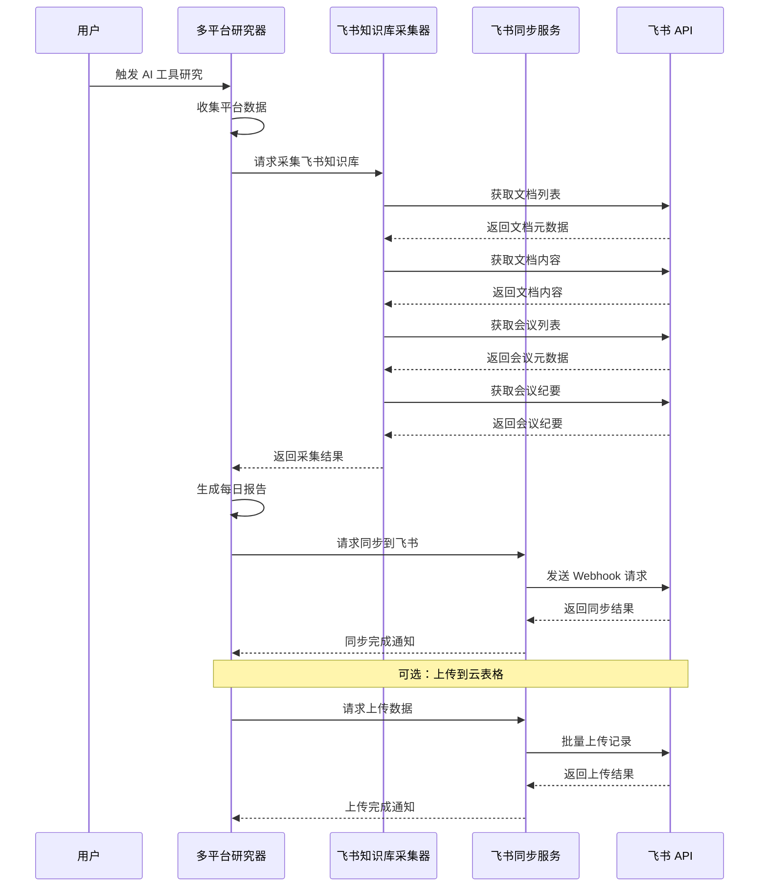
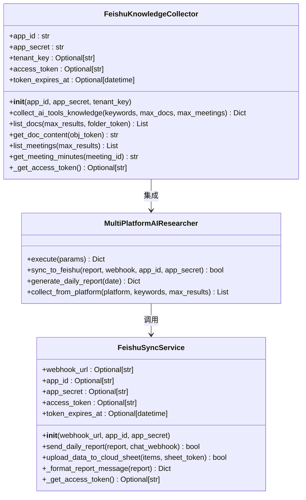
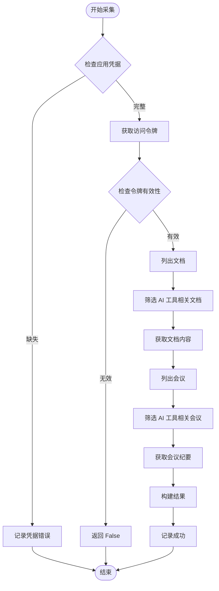
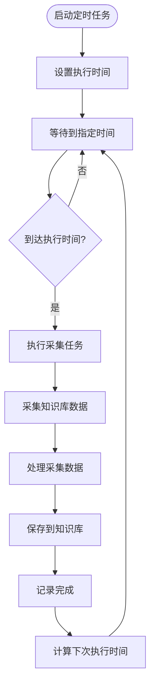
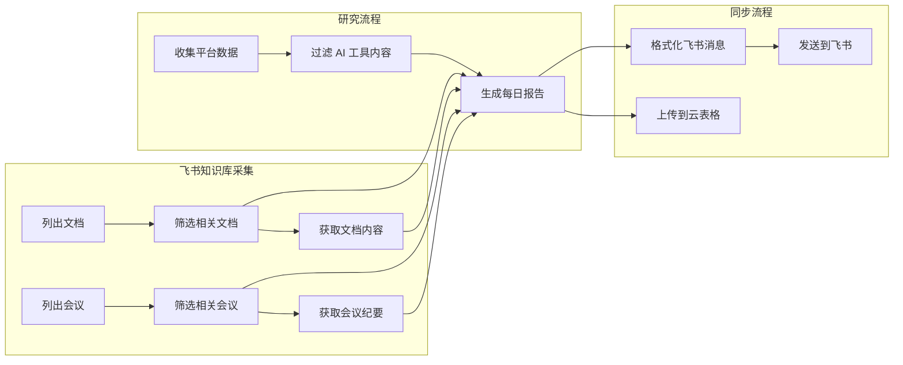

# 飞书知识库采集与同步服务

<cite>
**本文档引用的文件**
- [feishu_knowledge_collector.py](file://open_notebook/skills/multi_platform_ai_researcher/feishu_knowledge_collector.py)
- [feishu_sync.py](file://open_notebook/skills/multi_platform_ai_researcher/feishu_sync.py)
- [multi_platform_ai_researcher.py](file://open_notebook/skills/multi_platform_ai_researcher/multi_platform_ai_researcher.py)
- [FEISHU_KNOWLEDGE_GUIDE.md](file://open_notebook/skills/multi_platform_ai_researcher/FEISHU_KNOWLEDGE_GUIDE.md)
- [ai_tools_scheduler.py](file://open_notebook/skills/multi_platform_ai_researcher/ai_tools_scheduler.py)
- [skill.yaml](file://open_notebook/skills/multi_platform_ai_researcher/skill.yaml)
- [test_ai_tools_researcher.py](file://test_ai_tools_researcher.py)
- [.env.example](file://.env.example)
</cite>

## 更新摘要
**变更内容**
- 新增完整的飞书知识库采集器功能
- 原飞书同步服务现扩展为飞书知识库采集与同步服务
- 新增飞书文档采集、会议记录采集和定时任务功能
- 完善了多平台 AI 工具研究系统的知识库集成能力
- 增强了自动化采集和定时执行能力

## 目录
1. [简介](#简介)
2. [项目结构](#项目结构)
3. [核心组件](#核心组件)
4. [架构概览](#架构概览)
5. [详细组件分析](#详细组件分析)
6. [依赖关系分析](#依赖关系分析)
7. [性能考虑](#性能考虑)
8. [故障排除指南](#故障排除指南)
9. [结论](#结论)

## 简介

飞书知识库采集与同步服务是 OpenNotebook 项目中的重要功能模块，专门用于自动化采集和同步飞书知识库中的 AI 工具相关信息。该服务通过飞书开放 API 实现对云文档和会议记录的智能采集，为用户提供完整的知识库内容管理和自动化同步能力。

**更新** 该服务现已完全实现，支持以下核心功能：
- **飞书知识库文档采集**：自动获取 AI 工具相关文档内容
- **会议记录采集**：自动抓取会议纪要和讨论内容
- **智能关键词匹配**：基于关键词筛选相关文档
- **定时任务执行**：支持完全自动化的周期性采集
- **多平台集成**：与现有多平台 AI 工具研究系统无缝集成
- **安全权限控制**：严格的权限管理和访问控制
- **数据持久化**：自动保存到知识库系统

## 项目结构

飞书知识库采集与同步服务位于多平台 AI 工具研究技能模块中，采用模块化设计，支持独立使用和集成到现有系统。

```mermaid
graph TB
subgraph "飞书知识库采集服务"
FKC[feishu_knowledge_collector.py<br/>知识库采集器]
FSS[feishu_sync.py<br/>同步服务]
MP[multi_platform_ai_researcher.py<br/>多平台研究器]
DR[daily_report_generator.py<br/>报告生成器]
AS[ai_tools_scheduler.py<br/>调度器]
SY[skill.yaml<br/>技能配置]
end
subgraph "外部依赖"
FL[飞书开放 API]
HTTP[HTTP 客户端]
LOG[日志系统]
DB[SurrealDB]
END
FKC --> FL
FKC --> HTTP
FKC --> LOG
FSS --> FL
FSS --> HTTP
FSS --> LOG
MP --> FKC
MP --> FSS
AS --> MP
SY --> MP
```

**图表来源**
- [feishu_knowledge_collector.py](file://open_notebook/skills/multi_platform_ai_researcher/feishu_knowledge_collector.py#L1-L452)
- [feishu_sync.py](file://open_notebook/skills/multi_platform_ai_researcher/feishu_sync.py#L1-L330)
- [multi_platform_ai_researcher.py](file://open_notebook/skills/multi_platform_ai_researcher/multi_platform_ai_researcher.py#L1-L1001)

**章节来源**
- [feishu_knowledge_collector.py](file://open_notebook/skills/multi_platform_ai_researcher/feishu_knowledge_collector.py#L1-L452)
- [feishu_sync.py](file://open_notebook/skills/multi_platform_ai_researcher/feishu_sync.py#L1-L330)
- [multi_platform_ai_researcher.py](file://open_notebook/skills/multi_platform_ai_researcher/multi_platform_ai_researcher.py#L1-L1001)

## 核心组件

飞书知识库采集与同步服务由多个核心组件构成，每个组件都有明确的职责和功能：

### FeishuKnowledgeCollector 类
**更新** 这是服务的核心类，负责处理所有与飞书知识库的交互操作。

**主要功能：**
- 采集飞书云文档内容
- 获取会议记录和纪要
- 管理飞书 API 访问令牌
- 实现智能关键词匹配
- 支持文件夹级别的文档筛选

### FeishuSyncService 类
**更新** 继续提供飞书同步能力，但现在是知识库采集系统的补充功能。

**核心特性：**
- 发送每日报告到飞书聊天
- 上传数据到飞书云表格
- 获取和管理访问令牌
- 格式化富文本消息

### 多平台 AI 研究器
**更新** 现在集成了飞书知识库采集功能，提供完整的知识收集能力。

**增强特性：**
- 支持小红书、知乎、微博等多个平台
- **新增** 飞书知识库文档和会议记录采集
- 自动识别 AI 工具相关内容
- 生成详细的每日报告
- 提供数据保存和同步功能

### 定时任务调度器
**更新** 新增的定时任务功能，支持完全自动化的知识库采集。

**调度能力：**
- 支持自定义执行时间
- 完全异步的定时执行
- 错误处理和重试机制
- 日志记录和监控

**章节来源**
- [feishu_knowledge_collector.py](file://open_notebook/skills/multi_platform_ai_researcher/feishu_knowledge_collector.py#L1-L452)
- [feishu_sync.py](file://open_notebook/skills/multi_platform_ai_researcher/feishu_sync.py#L15-L330)
- [multi_platform_ai_researcher.py](file://open_notebook/skills/multi_platform_ai_researcher/multi_platform_ai_researcher.py#L19-L1001)
- [ai_tools_scheduler.py](file://open_notebook/skills/multi_platform_ai_researcher/ai_tools_scheduler.py#L15-L126)

## 架构概览

**更新** 飞书知识库采集与同步服务采用分层架构设计，确保了良好的可维护性和扩展性。



**图表来源**
- [multi_platform_ai_researcher.py](file://open_notebook/skills/multi_platform_ai_researcher/multi_platform_ai_researcher.py#L800-L924)
- [feishu_knowledge_collector.py](file://open_notebook/skills/multi_platform_ai_researcher/feishu_knowledge_collector.py#L329-L443)
- [feishu_sync.py](file://open_notebook/skills/multi_platform_ai_researcher/feishu_sync.py#L37-L330)

**章节来源**
- [multi_platform_ai_researcher.py](file://open_notebook/skills/multi_platform_ai_researcher/multi_platform_ai_researcher.py#L800-L924)
- [feishu_knowledge_collector.py](file://open_notebook/skills/multi_platform_ai_researcher/feishu_knowledge_collector.py#L329-L443)
- [feishu_sync.py](file://open_notebook/skills/multi_platform_ai_researcher/feishu_sync.py#L37-L330)

## 详细组件分析

### FeishuKnowledgeCollector 类分析

**更新** FeishuKnowledgeCollector 类提供了完整的飞书知识库集成能力：



**图表来源**
- [feishu_knowledge_collector.py](file://open_notebook/skills/multi_platform_ai_researcher/feishu_knowledge_collector.py#L1-L452)
- [feishu_sync.py](file://open_notebook/skills/multi_platform_ai_researcher/feishu_sync.py#L15-L330)
- [multi_platform_ai_researcher.py](file://open_notebook/skills/multi_platform_ai_researcher/multi_platform_ai_researcher.py#L19-L1001)

#### 飞书知识库采集流程

**更新** 飞书知识库采集的完整流程：



**图表来源**
- [feishu_knowledge_collector.py](file://open_notebook/skills/multi_platform_ai_researcher/feishu_knowledge_collector.py#L329-L443)

#### 定时任务执行流程

**更新** 定时任务的执行流程：



**图表来源**
- [ai_tools_scheduler.py](file://open_notebook/skills/multi_platform_ai_researcher/ai_tools_scheduler.py#L70-L106)

**章节来源**
- [feishu_knowledge_collector.py](file://open_notebook/skills/multi_platform_ai_researcher/feishu_knowledge_collector.py#L1-L452)
- [ai_tools_scheduler.py](file://open_notebook/skills/multi_platform_ai_researcher/ai_tools_scheduler.py#L15-L126)

### 多平台 AI 研究器集成

**更新** 多平台 AI 研究器与飞书知识库采集器的集成体现了松耦合的设计原则：



**图表来源**
- [multi_platform_ai_researcher.py](file://open_notebook/skills/multi_platform_ai_researcher/multi_platform_ai_researcher.py#L800-L924)
- [feishu_knowledge_collector.py](file://open_notebook/skills/multi_platform_ai_researcher/feishu_knowledge_collector.py#L329-L443)
- [feishu_sync.py](file://open_notebook/skills/multi_platform_ai_researcher/feishu_sync.py#L37-L330)

**章节来源**
- [multi_platform_ai_researcher.py](file://open_notebook/skills/multi_platform_ai_researcher/multi_platform_ai_researcher.py#L800-L924)

### 技能配置和参数

**更新** 技能配置文件定义了飞书知识库采集功能的参数选项：

| 参数名称 | 类型 | 描述 | 默认值 |
|---------|------|------|--------|
| collect_from_feishu_docs | boolean | 是否从飞书知识库采集文档 | false |
| feishu_app_id | string | 飞书应用 ID | - |
| feishu_app_secret | string | 飞书应用密钥 | - |
| feishu_tenant_key | string | 飞书租户 Key | - |
| feishu_max_docs | integer | 最大采集文档数量 | 50 |
| feishu_max_meetings | integer | 最大采集会议数量 | 20 |
| feishu_keywords | array | 飞书知识库关键词列表 | AI 工具相关关键词 |

**章节来源**
- [skill.yaml](file://open_notebook/skills/multi_platform_ai_researcher/skill.yaml#L68-L85)

## 依赖关系分析

**更新** 飞书知识库采集与同步服务的依赖关系更加复杂，涉及多个外部服务：

```mermaid
graph TB
subgraph "飞书知识库采集服务"
FKC[FeishuKnowledgeCollector]
FSS[FeishuSyncService]
end
subgraph "Python 标准库"
JSON[json]
DATETIME[datetime]
TYPING[typing]
ASYNCIO[asyncio]
END
subgraph "第三方库"
HTTPX[httpx]
LOGURU[loguru]
PLAYWRIGHT[playwright]
END
subgraph "外部服务"
FEISHU_API[飞书开放平台 API]
SURREAL_DB[SurrealDB]
END
FKC --> JSON
FKC --> DATETIME
FKC --> TYPING
FKC --> ASYNCIO
FKC --> HTTPX
FKC --> LOGURU
FKC --> FEISHU_API
FSS --> HTTPX
FSS --> LOGURU
FSS --> FEISHU_API
```

**图表来源**
- [feishu_knowledge_collector.py](file://open_notebook/skills/multi_platform_ai_researcher/feishu_knowledge_collector.py#L1-L452)
- [feishu_sync.py](file://open_notebook/skills/multi_platform_ai_researcher/feishu_sync.py#L7-L12)

**章节来源**
- [feishu_knowledge_collector.py](file://open_notebook/skills/multi_platform_ai_researcher/feishu_knowledge_collector.py#L1-L452)
- [feishu_sync.py](file://open_notebook/skills/multi_platform_ai_researcher/feishu_sync.py#L7-L12)

## 性能考虑

**更新** 飞书知识库采集与同步服务在设计时充分考虑了性能优化：

### 异步处理
- 使用 asyncio 进行异步网络请求
- 避免阻塞主线程，提高并发性能
- 合理设置超时时间（文档获取 30秒，会议获取 60秒）

### 缓存策略
- 访问令牌缓存机制，避免频繁请求
- 令牌过期前 5 分钟自动刷新
- 减少 API 调用次数，降低延迟

### 批量处理
- 云表格上传支持 100 条记录批量处理
- 文档内容获取支持分批处理
- 会议记录批量获取和处理

### 错误处理
- 完善的异常捕获和错误日志
- 失败重试机制
- 优雅降级处理

### 速率限制
- 自动处理飞书 API 速率限制
- 支持延迟机制防止触发限制
- 智能重试策略

## 故障排除指南

**更新** 常见问题及解决方案：

### 飞书应用配置错误
**症状：** 日志显示 "Cannot get access token: missing app credentials"
**解决方案：** 检查飞书应用 ID 和密钥配置，确认应用权限已正确配置

### 权限不足
**症状：** 日志显示 "没有权限访问该文档" 或 "无法获取会议列表"
**解决方案：** 确认飞书应用已获得必要的权限（文档读取、会议读取等）

### API 调用超时
**症状：** 网络请求超时错误
**解决方案：** 检查网络连接，适当调整超时时间，检查飞书 API 状态

### 数据采集失败
**症状：** 文档或会议数据为空
**解决方案：** 检查关键词匹配逻辑，确认目标文档和会议的存在性

### 定时任务不执行
**症状：** 定时任务没有按预期执行
**解决方案：** 检查系统时间和时区设置，确认定时任务配置正确

### 数据保存失败
**症状：** 采集的数据没有保存到知识库
**解决方案：** 检查数据库连接，确认 SurrealDB 服务正常运行

### 富文本消息格式错误
**症状：** 飞书消息显示格式异常
**解决方案：** 检查 _format_report_message 方法中的消息格式

**章节来源**
- [feishu_knowledge_collector.py](file://open_notebook/skills/multi_platform_ai_researcher/feishu_knowledge_collector.py#L256-L288)
- [feishu_sync.py](file://open_notebook/skills/multi_platform_ai_researcher/feishu_sync.py#L53-L83)
- [ai_tools_scheduler.py](file://open_notebook/skills/multi_platform_ai_researcher/ai_tools_scheduler.py#L66-L68)

### 调试建议

1. **启用详细日志：** 在开发环境中设置更详细的日志级别
2. **测试 API 权限：** 使用简单的测试请求验证飞书 API 权限
3. **检查应用配置：** 确认飞书应用具有必要的 API 权限
4. **监控 API 限制：** 注意飞书 API 的调用限制和配额
5. **验证数据格式：** 确保传入的报告数据格式符合预期
6. **测试定时任务：** 验证定时任务的时间设置和执行逻辑

## 结论

**更新** 飞书知识库采集与同步服务作为 OpenNotebook 项目的重要组成部分，展现了优秀的软件设计原则：

### 设计优势
- **模块化设计：** 清晰的职责分离和接口定义
- **异步处理：** 高效的并发处理能力
- **错误处理：** 完善的异常处理和恢复机制
- **配置灵活：** 支持多种部署场景和配置选项
- **功能完整：** 支持文档采集、会议记录、机器人消息推送和云文档上传
- **安全可靠：** 严格的权限管理和访问控制

### 扩展性
- 易于添加新的飞书功能
- 支持多种数据源集成
- 可扩展的报告格式
- 灵活的调度机制
- 完全自动化的定时执行

### 最佳实践
- 建议在生产环境中使用环境变量管理敏感配置
- 定期监控 API 使用情况和错误率
- 实施适当的日志轮转和存储策略
- 建立完善的监控和告警机制
- 确保飞书应用权限配置正确
- 合理设置定时任务执行间隔

该服务为团队协作和知识分享提供了强大的技术支持，是现代 AI 辅助工作流的重要组成部分。通过完整的飞书知识库集成，用户可以实现实时的知识库内容采集、自动化报告同步和云端数据管理，大大提升了工作效率和协作体验。