# 飞书知识库收集器

<cite>
**本文档引用的文件**
- [feishu_knowledge_collector.py](file://open_notebook/skills/multi_platform_ai_researcher/feishu_knowledge_collector.py)
- [feishu_sync.py](file://open_notebook/skills/multi_platform_ai_researcher/feishu_sync.py)
- [multi_platform_ai_researcher.py](file://open_notebook/skills/multi_platform_ai_researcher/multi_platform_ai_researcher.py)
- [content_creation_workflow.py](file://open_notebook/skills/multi_platform_ai_researcher/content_creation_workflow.py)
- [platform_content_optimizer.py](file://open_notebook/skills/multi_platform_ai_researcher/platform_content_optimizer.py)
- [daily_report_generator.py](file://open_notebook/skills/multi_platform_ai_researcher/daily_report_generator.py)
- [ai_tools_scheduler.py](file://open_notebook/skills/multi_platform_ai_researcher/ai_tools_scheduler.py)
- [FEISHU_KNOWLEDGE_GUIDE.md](file://open_notebook/skills/multi_platform_ai_researcher/FEISHU_KNOWLEDGE_GUIDE.md)
- [SYSTEM_OVERVIEW.md](file://open_notebook/skills/multi_platform_ai_researcher/SYSTEM_OVERVIEW.md)
- [skill.yaml](file://open_notebook/skills/multi_platform_ai_researcher/skill.yaml)
- [README.md](file://README.md)
</cite>

## 目录
1. [项目概述](#项目概述)
2. [系统架构](#系统架构)
3. [核心组件](#核心组件)
4. [飞书知识库采集器详解](#飞书知识库采集器详解)
5. [飞书同步服务](#飞书同步服务)
6. [多平台AI工具研究系统](#多平台ai工具研究系统)
7. [内容创作工作流](#内容创作工作流)
8. [平台内容优化器](#平台内容优化器)
9. [定时任务调度](#定时任务调度)
10. [数据报告生成](#数据报告生成)
11. [集成使用指南](#集成使用指南)
12. [部署与配置](#部署与配置)
13. [故障排除](#故障排除)
14. [总结](#总结)

## 项目概述

飞书知识库收集器是Open Notebook项目中的一个重要组成部分，专门用于自动化收集和处理飞书平台上的知识库内容。该项目实现了从飞书云文档和会议记录中自动提取AI工具相关信息的功能，为内容创作者和研究人员提供了一个完整的自动化解决方案。

### 主要功能特性

- **多源内容采集**：支持从飞书知识库、文档、会议记录等多个来源自动采集内容
- **智能关键词过滤**：基于AI工具相关关键词自动识别和筛选相关内容
- **定时任务支持**：提供完整的定时采集和报告生成功能
- **多平台集成**：与Open Notebook的其他模块无缝集成
- **飞书平台同步**：支持将采集结果同步到飞书群组和多维表格

### 技术架构

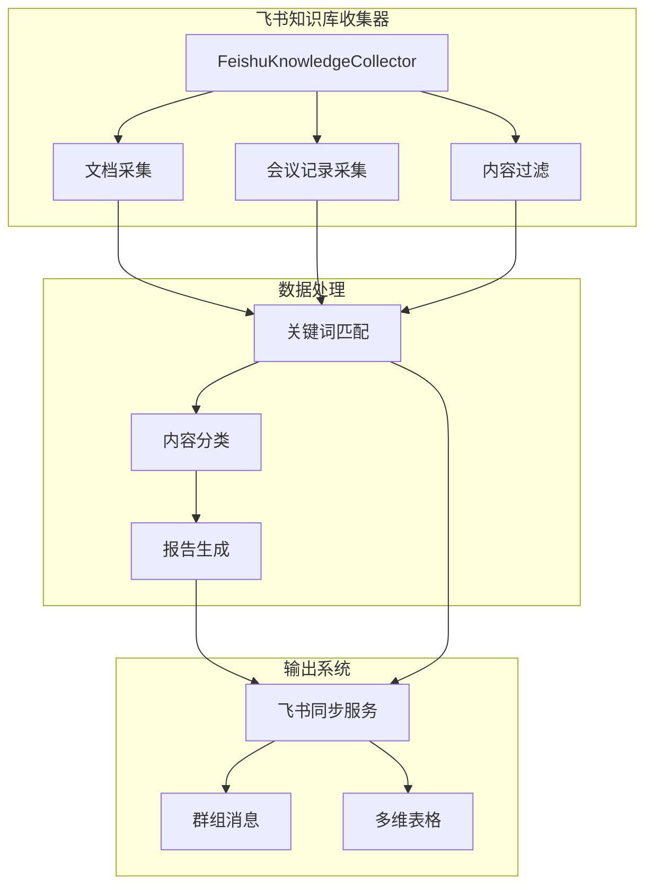

**图表来源**
- [feishu_knowledge_collector.py](file://open_notebook/skills/multi_platform_ai_researcher/feishu_knowledge_collector.py#L15-L444)
- [feishu_sync.py](file://open_notebook/skills/multi_platform_ai_researcher/feishu_sync.py#L15-L330)

## 系统架构

飞书知识库收集器采用模块化设计，主要由以下几个核心模块组成：

### 整体架构图

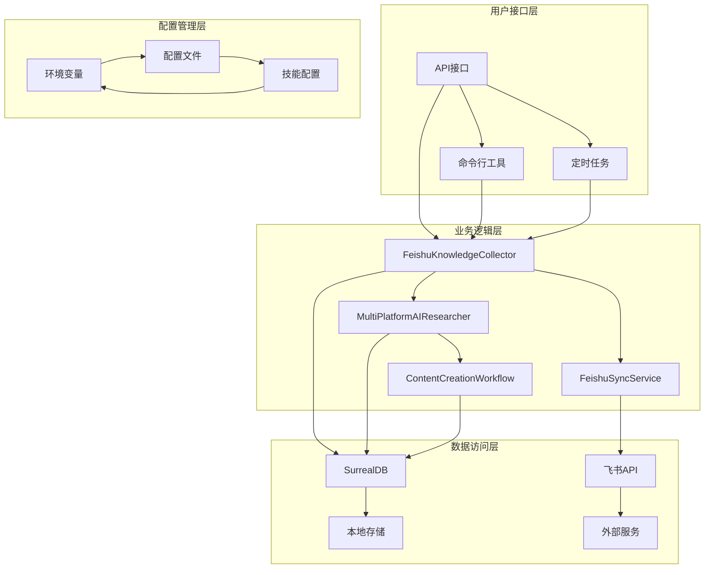

**图表来源**
- [SYSTEM_OVERVIEW.md](file://open_notebook/skills/multi_platform_ai_researcher/SYSTEM_OVERVIEW.md#L1-L414)
- [skill.yaml](file://open_notebook/skills/multi_platform_ai_researcher/skill.yaml#L1-L207)

### 数据流架构

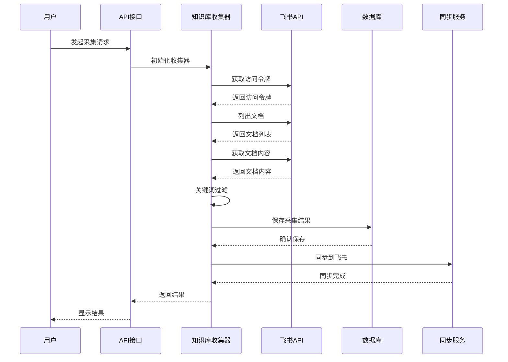

**图表来源**
- [feishu_knowledge_collector.py](file://open_notebook/skills/multi_platform_ai_researcher/feishu_knowledge_collector.py#L322-L401)
- [feishu_sync.py](file://open_notebook/skills/multi_platform_ai_researcher/feishu_sync.py#L37-L83)

## 核心组件

### 飞书知识库采集器类

FeishuKnowledgeCollector是整个系统的核心类，负责与飞书API进行交互，实现文档和会议记录的自动采集。

#### 类结构图

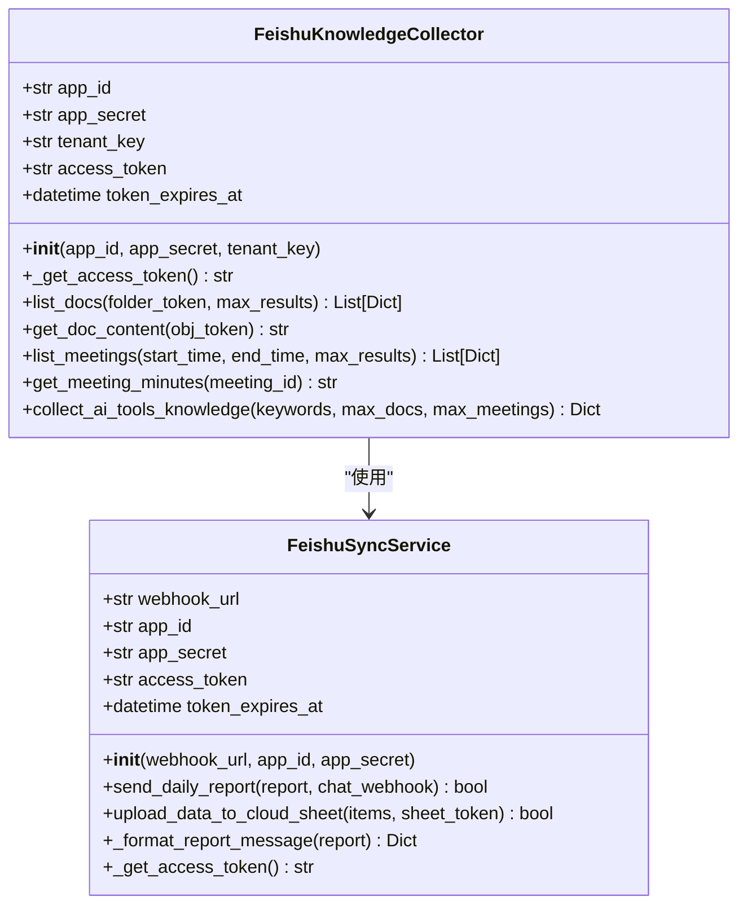

**图表来源**
- [feishu_knowledge_collector.py](file://open_notebook/skills/multi_platform_ai_researcher/feishu_knowledge_collector.py#L15-L444)
- [feishu_sync.py](file://open_notebook/skills/multi_platform_ai_researcher/feishu_sync.py#L15-L330)

### 多平台AI研究系统

MultiPlatformAIResearcher提供了更广泛的内容采集能力，不仅包括飞书知识库，还支持多个社交媒体平台的内容采集。

#### 系统组件关系

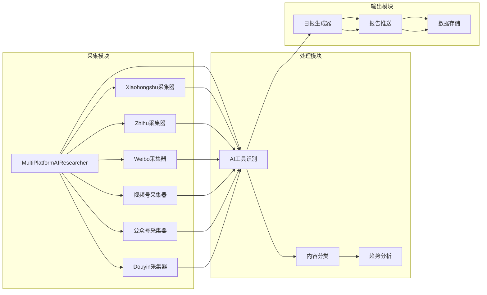

**图表来源**
- [multi_platform_ai_researcher.py](file://open_notebook/skills/multi_platform_ai_researcher/multi_platform_ai_researcher.py#L19-L800)
- [daily_report_generator.py](file://open_notebook/skills/multi_platform_ai_researcher/daily_report_generator.py#L14-L329)

## 飞书知识库采集器详解

### 初始化配置

飞书知识库采集器需要正确的配置才能正常工作，主要包括应用ID、应用密钥和租户信息。

#### 配置参数说明

| 参数名 | 类型 | 必需 | 描述 |
|--------|------|------|------|
| app_id | str | 是 | 飞书应用ID |
| app_secret | str | 是 | 飞书应用密钥 |
| tenant_key | str | 否 | 企业租户标识 |

### 访问令牌管理

系统实现了智能的访问令牌管理机制，包括令牌缓存、自动刷新和错误处理。

#### 令牌管理流程

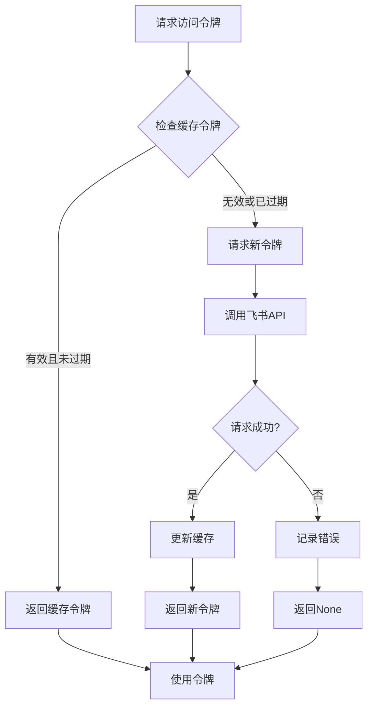

**图表来源**
- [feishu_knowledge_collector.py](file://open_notebook/skills/multi_platform_ai_researcher/feishu_knowledge_collector.py#L37-L73)

### 文档采集功能

文档采集功能支持按文件夹筛选和分页获取，能够处理大量的文档数据。

#### 文档采集流程

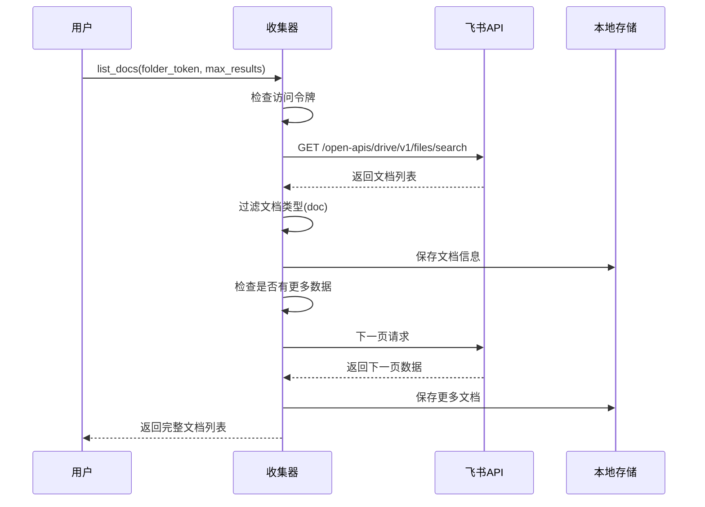

**图表来源**
- [feishu_knowledge_collector.py](file://open_notebook/skills/multi_platform_ai_researcher/feishu_knowledge_collector.py#L75-L160)

### 会议记录采集

会议记录采集功能支持按时间范围查询和会议纪要获取。

#### 会议采集参数

| 参数名 | 类型 | 默认值 | 描述 |
|--------|------|--------|------|
| start_time | str | 7天前 | 查询开始时间 |
| end_time | str | 当前时间 | 查询结束时间 |
| max_results | int | 50 | 最大结果数量 |

### AI工具知识采集

系统提供了专门的AI工具知识采集功能，能够自动识别和筛选AI相关的文档和会议。

#### 关键词配置

系统默认包含以下AI工具相关关键词：

- AI 工具
- 人工智能
- ChatGPT
- Kimi
- Midjourney
- Stable Diffusion
- Notion AI
- AIGC
- 大模型
- LLM

## 飞书同步服务

### 消息推送功能

FeishuSyncService提供了将采集结果推送到飞书群组的功能，支持富文本消息格式。

#### 消息格式设计

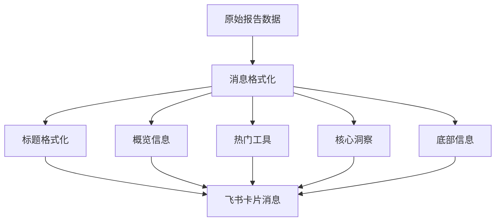

**图表来源**
- [feishu_sync.py](file://open_notebook/skills/multi_platform_ai_researcher/feishu_sync.py#L85-L165)

### 多维表格集成

系统支持将采集数据同步到飞书多维表格，便于数据管理和分析。

#### 数据同步流程


**图表来源**
- [feishu_sync.py](file://open_notebook/skills/multi_platform_ai_researcher/feishu_sync.py#L167-L242)

## 多平台AI工具研究系统

### 平台支持矩阵

系统支持6个主要的中国社交媒体平台：

| 平台名称 | 平台代码 | 内容类型 | 采集特点 |
|----------|----------|----------|----------|
| 小红书 | xiaohongshu | 图文笔记 | 使用专用技能 |
| 知乎 | zhihu | 长文回答 | Playwright爬虫 |
| 微博 | weibo | 短内容 | Playwright爬虫 |
| 视频号 | video_account | 短视频 | Bing搜索 |
| 公众号 | official_account | 长图文 | 搜狗搜索 |
| 抖音 | douyin | 短视频 | Web版本搜索 |

### 内容识别算法

系统实现了智能的内容识别算法，能够自动识别AI工具相关内容。

#### 识别流程

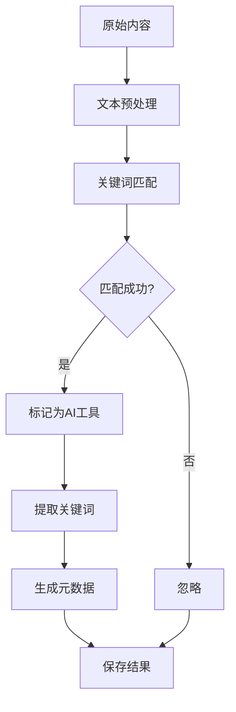

**图表来源**
- [multi_platform_ai_researcher.py](file://open_notebook/skills/multi_platform_ai_researcher/multi_platform_ai_researcher.py#L687-L718)

## 内容创作工作流

### 工作流阶段

内容创作工作流包含5个主要阶段：

1. **选题发现** - AI辅助的主题发现和选择
2. **素材收集** - 多平台内容素材的自动收集
3. **文案生成** - 针对不同平台的差异化文案生成
4. **发布管理** - 内容发布的计划和管理
5. **效果分析** - 内容效果的跟踪和分析

### 主题选择器

主题选择器基于模板和趋势数据生成内容主题建议。

#### 主题生成模板

系统内置了多种主题生成模板：

| 模板类型 | 示例模板 | 适用场景 |
|----------|----------|----------|
| 工具评测 | "{tool_name}实战：{use_case}完全指南" | 工具使用教程 |
| 经验分享 | "我用{tool_name}{time_period}，{result}" | 使用体验分享 |
| 工具合集 | "{number}个{adjective}的{tool_category}工具" | 工具推荐列表 |

### 素材收集器

素材收集器负责从各个平台收集相关内容素材，并进行去重和分类。

#### 素材评分机制

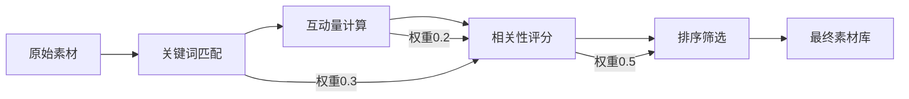

**图表来源**
- [content_creation_workflow.py](file://open_notebook/skills/multi_platform_ai_researcher/content_creation_workflow.py#L372-L393)

## 平台内容优化器

### 平台特性分析

系统针对6个主要平台进行了深入的特性分析，包括内容长度、风格要求、发布时间等。

#### 平台对比表

| 平台 | 最佳字数 | 调性风格 | 发布时间 | 内容类型 |
|------|----------|----------|----------|----------|
| 小红书 | 300字 | 亲切种草、emoji多 | 19:00 | 图文笔记 |
| 知乎 | 2000字 | 专业深度、逻辑严谨 | 21:00 | 长文回答 |
| 微博 | 140字 | 轻松活泼、跟热点 | 12:00 | 短内容 |
| 视频号 | 100字 | 真实自然、价值输出 | 20:00 | 短视频 |
| 公众号 | 2000字 | 专业深度、文笔流畅 | 21:00 | 长图文 |
| 抖音 | 50字 | 短平快、高能量 | 18:00 | 短视频 |

### 内容优化算法

系统提供了智能的内容优化功能，能够根据不同平台的特点对内容进行调整。

#### 优化流程

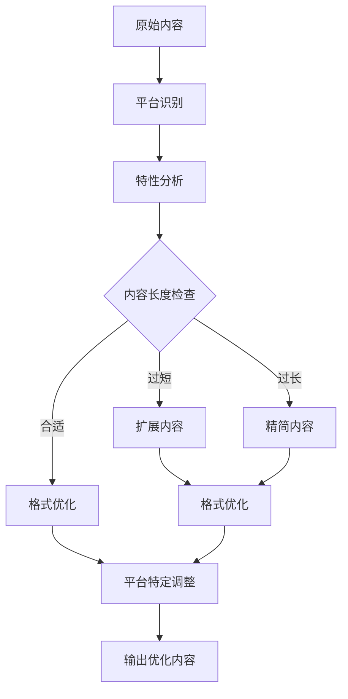

**图表来源**
- [platform_content_optimizer.py](file://open_notebook/skills/multi_platform_ai_researcher/platform_content_optimizer.py#L615-L676)

## 定时任务调度

### 调度器设计

DailyReportScheduler提供了灵活的定时任务调度功能，支持自定义执行时间和频率。

#### 调度流程

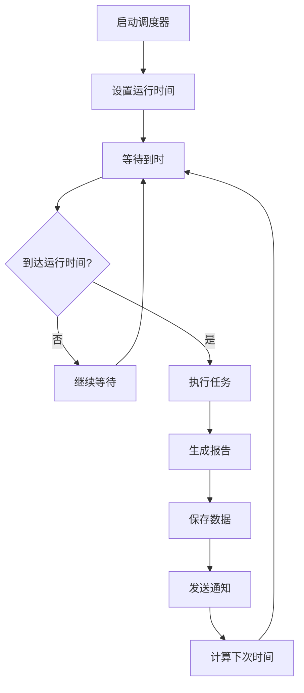

**图表来源**
- [ai_tools_scheduler.py](file://open_notebook/skills/multi_platform_ai_researcher/ai_tools_scheduler.py#L70-L106)

### 任务配置

系统支持灵活的任务配置选项：

| 配置项 | 类型 | 默认值 | 描述 |
|--------|------|--------|------|
| run_time | time | 09:00 | 任务执行时间 |
| timezone | str | Asia/Shanghai | 时区设置 |
| platforms | list | ['xiaohongshu'] | 平台列表 |
| keywords | list | ['一人公司 AI 工具'] | 关键词列表 |
| max_results | int | 20 | 每平台最大结果数 |

## 数据报告生成

### 报告结构

DailyReportGenerator负责生成结构化的日报报告，包含概览、趋势分析、洞察建议等内容。

#### 报告字段

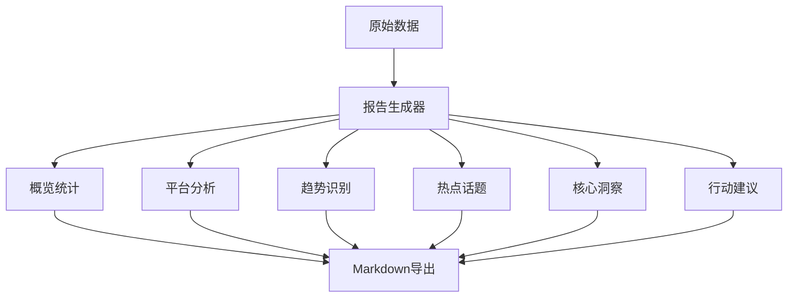

**图表来源**
- [daily_report_generator.py](file://open_notebook/skills/multi_platform_ai_researcher/daily_report_generator.py#L29-L69)

### 洞察生成算法

系统实现了智能的洞察生成算法，能够从大量数据中提取有价值的信息。

#### 洞察生成流程


**图表来源**
- [daily_report_generator.py](file://open_notebook/skills/multi_platform_ai_researcher/daily_report_generator.py#L207-L248)

## 集成使用指南

### 基础使用

以下是飞书知识库收集器的基础使用方法：

#### 快速开始示例

```python
from open_notebook.skills.multi_platform_ai_researcher.feishu_knowledge_collector import collect_from_feishu
import asyncio

async def main():
    result = await collect_from_feishu(
        app_id="cli_xxxxxxxxxxxxx",
        app_secret="xxxxxxxxxxxxxxxx",
        keywords=['AI 工具', 'ChatGPT', 'Kimi'],
        max_docs=50,
        max_meetings=20
    )
    
    print(f"✅ 完成！")
    print(f"文档总数：{result['total_docs']}")
    print(f"AI 工具相关：{result['ai_docs']}")
    print(f"会议总数：{result['total_meetings']}")
    print(f"AI 工具相关：{result['ai_meetings']}")

asyncio.run(main())
```

### 高级配置

#### 环境变量配置

```bash
# 飞书配置
FEISHU_APP_ID=cli_xxxxxxxxxxxxx
FEISHU_APP_SECRET=xxxxxxxxxxxxxxxx
FEISHU_TENANT_KEY=your-company-key

# 采集参数
FEISHU_MAX_DOCS=50
FEISHU_MAX_MEETINGS=20
FEISHU_KEYWORDS=AI 工具，ChatGPT,Kimi,Midjourney,Notion AI
```

### 定时任务集成

#### 全自动运行示例

```python
from open_notebook.skills.multi_platform_ai_researcher.feishu_knowledge_collector import (
    FeishuKnowledgeCollector
)
from open_notebook.skills.multi_platform_ai_researcher.feishu_sync import (
    FeishuSyncService
)
import asyncio
from datetime import time

class FeishuDailyScheduler:
    def __init__(self, app_id: str, app_secret: str):
        self.collector = FeishuKnowledgeCollector(app_id, app_secret)
        self.is_running = False
    
    async def run_daily_collection(self):
        """执行每日采集任务"""
        logger.info("开始执行飞书知识库每日采集...")
        
        result = await self.collector.collect_ai_tools_knowledge(
            max_docs=50,
            max_meetings=20
        )
        
        logger.info(f"采集完成：{result['ai_docs']} 篇文档，{result['ai_meetings']} 场会议")
        
        # 保存结果到数据库或发送到飞书群
        return result
    
    async def start_scheduler(self, run_time: time = time(9, 0)):
        """启动定时任务（每天早上 9 点）"""
        from datetime import datetime, timedelta
        
        logger.info(f"飞书采集器已启动，每天 {run_time.hour}:{run_time.minute:02d} 运行")
        
        self.is_running = True
        
        while self.is_running:
            now = datetime.now()
            scheduled_time = now.replace(
                hour=run_time.hour,
                minute=run_time.minute,
                second=0,
                microsecond=0
            )
            
            if now > scheduled_time:
                scheduled_time += timedelta(days=1)
            
            sleep_seconds = (scheduled_time - now).total_seconds()
            logger.info(f"下次运行时间：{scheduled_time}")
            
            await asyncio.sleep(sleep_seconds)
            await self.run_daily_collection()

# 使用示例
async def main():
    scheduler = FeishuDailyScheduler(
        app_id="cli_xxxxxxxxxxxxx",
        app_secret="xxxxxxxxxxxxxxxx"
    )
    
    # 立即执行一次
    await scheduler.run_daily_collection()
    
    # 启动定时任务
    # await scheduler.start_scheduler(run_time=time(9, 0))

asyncio.run(main())
```

## 部署与配置

### 飞书应用配置

要在飞书平台上使用知识库收集器，需要先在飞书开放平台创建自建应用并配置相应的权限。

#### 应用权限配置

需要在飞书开放平台申请以下权限：

**文档权限**：
- `docs:document:readonly` - 获取云文档列表
- `docs:document.content:readonly` - 读取云文档内容

**会议权限**：
- `vc:meeting:readonly` - 获取会议列表
- `vc:meeting.minutes:readonly` - 读取会议纪要

**应用权限**：
- `im:message:send` - 发送消息到群组

#### 配置步骤

1. 访问飞书开放平台 (https://open.feishu.cn)
2. 登录飞书账号
3. 进入「企业管理」→「自建应用」
4. 点击「创建应用」并填写应用信息
5. 在「权限管理」中添加上述权限
6. 获取 App ID 和 App Secret

### 环境变量设置

#### 必需环境变量

| 环境变量名 | 用途 | 示例值 |
|------------|------|--------|
| FEISHU_APP_ID | 飞书应用ID | cli_xxxxxxxxxxxxx |
| FEISHU_APP_SECRET | 飞书应用密钥 | xxxxxxxxxxxxxxxxxxxxxxxxxxxxxxxx |
| FEISHU_TENANT_KEY | 租户标识 | your-company-key |

#### 可选环境变量

| 环境变量名 | 用途 | 默认值 |
|------------|------|--------|
| FEISHU_MAX_DOCS | 最大文档数 | 50 |
| FEISHU_MAX_MEETINGS | 最大会议数 | 20 |
| FEISHU_KEYWORDS | 关键词列表 | AI 工具,ChatGPT,Kimi |

### Docker部署

#### docker-compose配置

```yaml
version: '3.8'
services:
  feishu-collector:
    image: open-notebook:latest
    environment:
      - FEISHU_APP_ID=${FEISHU_APP_ID}
      - FEISHU_APP_SECRET=${FEISHU_APP_SECRET}
      - FEISHU_TENANT_KEY=${FEISHU_TENANT_KEY}
      - FEISHU_MAX_DOCS=50
      - FEISHU_MAX_MEETINGS=20
    volumes:
      - ./logs:/app/logs
    restart: always
```

## 故障排除

### 常见问题及解决方案

#### 问题1：权限不足

**症状**：提示"没有权限访问该文档"

**解决方案**：
1. 确认已添加「获取云文档列表」权限
2. 确认文档对应用可见（公开或有权限）
3. 检查租户 key 是否正确

#### 问题2：访问令牌失效

**症状**：API调用返回401错误

**解决方案**：
1. 检查App ID和App Secret是否正确
2. 确认应用权限配置完整
3. 重新获取访问令牌

#### 问题3：速率限制

**症状**：API调用频繁失败

**解决方案**：
1. 单次请求不超过100条
2. 批量操作时添加延迟（`await asyncio.sleep(0.5)`）
3. 分批次处理大量数据

#### 问题4：会议纪要获取失败

**症状**：无法获取会议纪要内容

**可能原因**：
1. 会议没有生成纪要
2. 缺少「读取会议纪要」权限
3. 会议已结束超过查询期限

### 调试方法

#### 启用详细日志

```python
import logging
logging.basicConfig(level=logging.DEBUG)
```

#### API调用监控

```python
import httpx
import asyncio

async def debug_api_call():
    async with httpx.AsyncClient() as client:
        response = await client.get(
            "https://open.feishu.cn/open-apis/drive/v1/files/search",
            headers={"Authorization": "Bearer YOUR_TOKEN"}
        )
        print(f"Status Code: {response.status_code}")
        print(f"Response: {response.json()}")
```

## 总结

飞书知识库收集器是一个功能完整、设计合理的自动化内容采集系统。它具有以下特点：

### 核心优势

1. **完整的自动化流程**：从采集到分析再到输出的全流程自动化
2. **多平台集成**：支持飞书知识库与其他社交媒体平台的统一管理
3. **智能内容识别**：基于关键词和机器学习的AI工具内容识别
4. **灵活的配置选项**：支持环境变量、定时任务等多种使用方式
5. **完善的错误处理**：包含详细的错误处理和重试机制

### 技术特色

1. **模块化设计**：清晰的模块划分和职责分离
2. **异步处理**：充分利用异步IO提高性能
3. **缓存机制**：智能的访问令牌和数据缓存
4. **扩展性强**：易于添加新的平台和功能
5. **文档完善**：详细的使用指南和技术文档

### 应用场景

- **企业知识管理**：自动收集和整理企业内部知识库内容
- **市场研究**：跟踪AI工具领域的最新动态
- **内容创作**：为内容创作者提供丰富的素材来源
- **竞品分析**：监控竞争对手的动态和策略

该系统为Open Notebook项目提供了强大的内容采集能力，是构建完整AI内容生态系统的重要组成部分。通过持续的优化和扩展，它将继续为企业和个人用户提供价值。