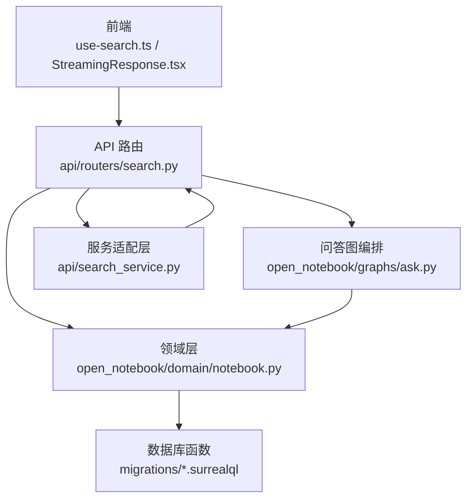
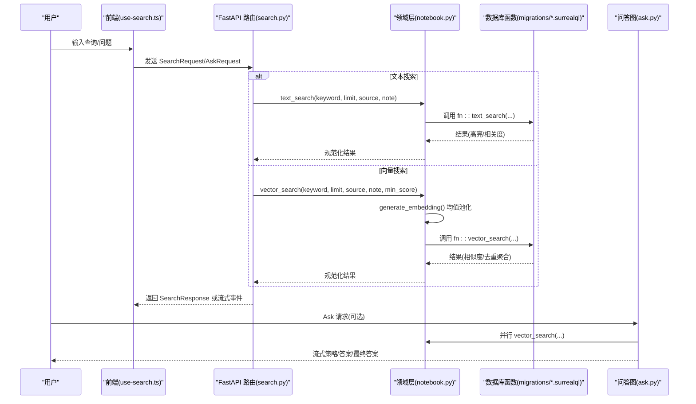
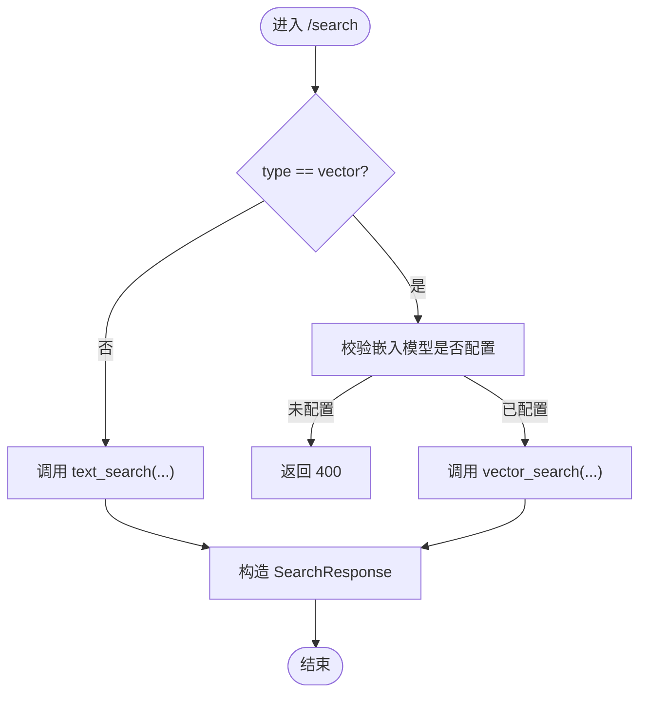
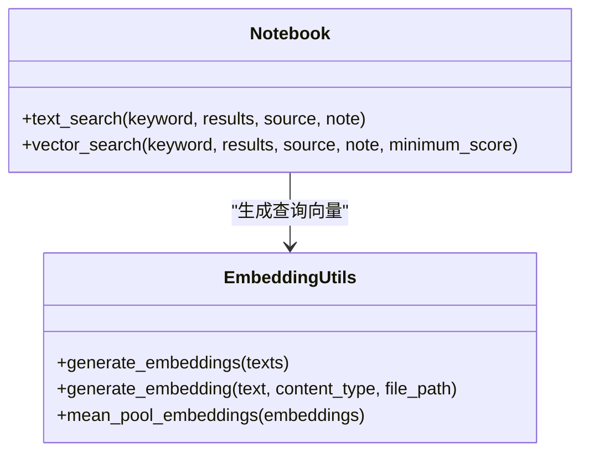
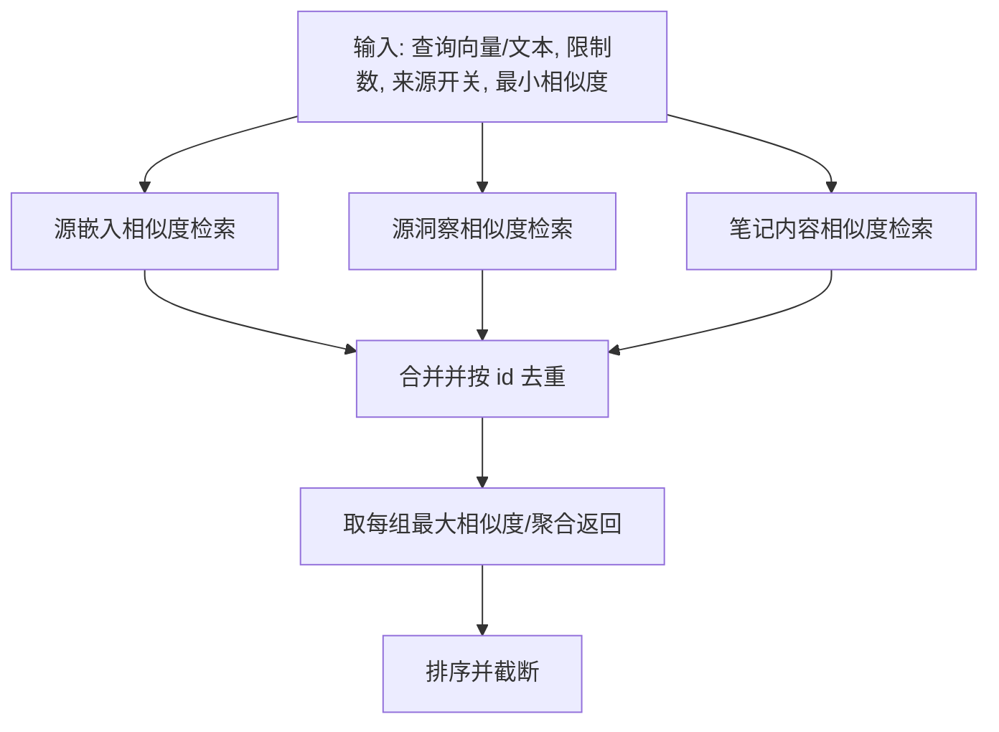
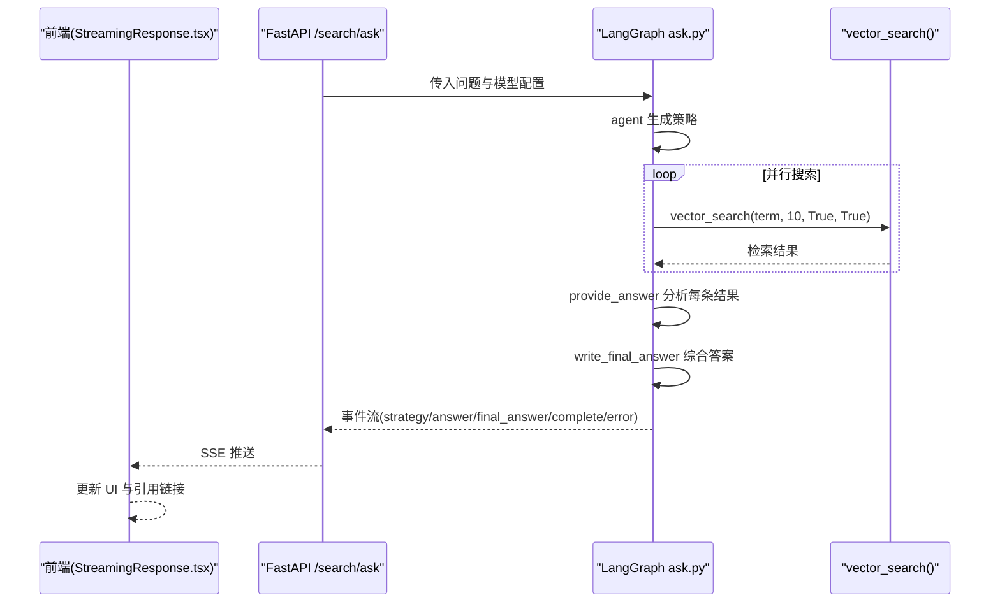
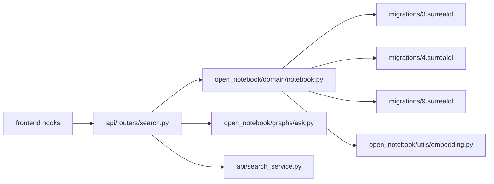

# 智能搜索与检索

<cite>
**本文引用的文件**
- [api/routers/search.py](file://api/routers/search.py)
- [api/search_service.py](file://api/search_service.py)
- [api/models.py](file://api/models.py)
- [open_notebook/domain/notebook.py](file://open_notebook/domain/notebook.py)
- [open_notebook/utils/embedding.py](file://open_notebook/utils/embedding.py)
- [open_notebook/graphs/ask.py](file://open_notebook/graphs/ask.py)
- [open_notebook/database/migrations/3.surrealql](file://open_notebook/database/migrations/3.surrealql)
- [open_notebook/database/migrations/4.surrealql](file://open_notebook/database/migrations/4.surrealql)
- [open_notebook/database/migrations/9.surrealql](file://open_notebook/database/migrations/9.surrealql)
- [frontend/src/lib/hooks/use-search.ts](file://frontend/src/lib/hooks/use-search.ts)
- [frontend/src/components/search/StreamingResponse.tsx](file://frontend/src/components/search/StreamingResponse.tsx)
- [docs/3-USER-GUIDE/search.md](file://docs/3-USER-GUIDE/search.md)
</cite>

## 目录
1. [简介](#简介)
2. [项目结构](#项目结构)
3. [核心组件](#核心组件)
4. [架构总览](#架构总览)
5. [详细组件分析](#详细组件分析)
6. [依赖关系分析](#依赖关系分析)
7. [性能考量](#性能考量)
8. [故障排查指南](#故障排查指南)
9. [结论](#结论)
10. [附录](#附录)

## 简介
本文件系统化梳理 Open Notebook 的“智能搜索与检索”能力，覆盖全文检索（关键词匹配）与向量检索（语义相似度）的混合机制，解释查询处理流程（查询扩展、关键词提取、意图识别）、结果呈现（高亮、来源标注、上下文预览）、性能优化策略（索引与嵌入、缓存与并发），以及高级搜索能力（布尔查询、范围筛选、时间过滤、内容类型限制）。同时结合前端交互与后端服务，说明搜索与内容源、笔记、聊天记录的关联关系。

## 项目结构
搜索功能由三层协作构成：
- 前端层：负责用户输入、结果排序与高亮展示、流式问答渲染。
- API 层：FastAPI 路由定义搜索与问答接口，调用领域层执行检索或图编排问答。
- 领域层：封装文本/向量检索、嵌入生成、模型管理等业务逻辑；通过数据库迁移脚本中的函数实现高性能检索。

图表来源
- [api/routers/search.py](file://api/routers/search.py#L17-L59)
- [open_notebook/domain/notebook.py](file://open_notebook/domain/notebook.py#L628-L679)
- [open_notebook/database/migrations/3.surrealql](file://open_notebook/database/migrations/3.surrealql#L79-L146)
- [open_notebook/graphs/ask.py](file://open_notebook/graphs/ask.py#L137-L147)
- [api/search_service.py](file://api/search_service.py#L12-L59)

章节来源
- [api/routers/search.py](file://api/routers/search.py#L17-L59)
- [open_notebook/domain/notebook.py](file://open_notebook/domain/notebook.py#L628-L679)
- [open_notebook/database/migrations/3.surrealql](file://open_notebook/database/migrations/3.surrealql#L79-L146)
- [open_notebook/graphs/ask.py](file://open_notebook/graphs/ask.py#L137-L147)
- [api/search_service.py](file://api/search_service.py#L12-L59)

## 核心组件
- 搜索路由与模型校验：根据请求类型选择文本或向量检索，校验嵌入模型可用性，返回统一响应结构。
- 文本检索与向量检索：文本检索基于关键词高亮与相关度排序；向量检索基于余弦相似度，支持最小相似度阈值。
- 嵌入生成与聚合：对长文本进行分块、批量嵌入、均值池化，保证大文本高效且稳定的向量表示。
- 问答图编排：自动拆解复杂问题、并行检索、合成答案，支持流式输出。
- 前端搜索钩子与流式渲染：统一结果评分、排序与高亮渲染，支持 Ask 的流式事件解析。

章节来源
- [api/routers/search.py](file://api/routers/search.py#L17-L59)
- [open_notebook/domain/notebook.py](file://open_notebook/domain/notebook.py#L628-L679)
- [open_notebook/utils/embedding.py](file://open_notebook/utils/embedding.py#L26-L208)
- [open_notebook/graphs/ask.py](file://open_notebook/graphs/ask.py#L48-L147)
- [frontend/src/lib/hooks/use-search.ts](file://frontend/src/lib/hooks/use-search.ts#L8-L34)
- [frontend/src/components/search/StreamingResponse.tsx](file://frontend/src/components/search/StreamingResponse.tsx#L16-L198)

## 架构总览
下图展示从用户输入到结果呈现的完整链路，包括文本/向量检索与问答图编排两条主路径。

图表来源
- [api/routers/search.py](file://api/routers/search.py#L17-L59)
- [open_notebook/domain/notebook.py](file://open_notebook/domain/notebook.py#L628-L679)
- [open_notebook/database/migrations/3.surrealql](file://open_notebook/database/migrations/3.surrealql#L79-L146)
- [open_notebook/graphs/ask.py](file://open_notebook/graphs/ask.py#L78-L147)

## 详细组件分析

### 组件A：搜索路由与服务适配
- 责任边界
  - 定义 /search 与 /search/ask 接口，参数校验与错误处理。
  - 在向量搜索前检查嵌入模型可用性，避免无效调用。
  - 提供非流式 Ask 接口与流式 Ask 接口，后者以 Server-Sent Events 推送阶段事件。
- 关键点
  - SearchRequest/AskRequest 的字段约束与默认值。
  - 流式事件类型：strategy、answer、final_answer、complete、error。
- 错误处理
  - 输入非法、数据库异常、未知异常分别映射为不同 HTTP 状态码。

图表来源
- [api/routers/search.py](file://api/routers/search.py#L17-L59)

章节来源
- [api/routers/search.py](file://api/routers/search.py#L17-L59)
- [api/models.py](file://api/models.py#L32-L59)

### 组件B：领域层检索与嵌入
- 文本检索
  - 通过 fn::text_search 实现标题、正文、洞察、笔记的多源联合检索，使用高亮与相关度排序。
- 向量检索
  - 通过 fn::vector_search 实现余弦相似度检索，支持最小相似度阈值与结果去重聚合。
  - generate_embedding 对长文本进行分块、批量嵌入、均值池化，确保稳定向量表示。
- 复杂度与性能
  - 文本检索：基于索引的关键词匹配，速度极快。
  - 向量检索：余弦相似度计算，受维度与数据规模影响，需合理设置最小相似度与结果上限。

图表来源
- [open_notebook/domain/notebook.py](file://open_notebook/domain/notebook.py#L628-L679)
- [open_notebook/utils/embedding.py](file://open_notebook/utils/embedding.py#L82-L208)

章节来源
- [open_notebook/domain/notebook.py](file://open_notebook/domain/notebook.py#L628-L679)
- [open_notebook/utils/embedding.py](file://open_notebook/utils/embedding.py#L26-L208)

### 组件C：数据库函数（文本/向量）
- 文本检索函数
  - 联合标题、正文、洞察、笔记的关键词匹配，使用高亮与相关度聚合。
- 向量检索函数
  - 联合源嵌入、源洞察、笔记内容的余弦相似度检索，按最大相似度去重聚合。
  - 支持最小相似度阈值与结果上限。
- 迁移演进
  - 不同版本迁移脚本展示了函数的演进与兼容性处理。

图表来源
- [open_notebook/database/migrations/9.surrealql](file://open_notebook/database/migrations/9.surrealql#L4-L66)
- [open_notebook/database/migrations/4.surrealql](file://open_notebook/database/migrations/4.surrealql#L75-L134)
- [open_notebook/database/migrations/3.surrealql](file://open_notebook/database/migrations/3.surrealql#L10-L73)

章节来源
- [open_notebook/database/migrations/3.surrealql](file://open_notebook/database/migrations/3.surrealql#L79-L146)
- [open_notebook/database/migrations/4.surrealql](file://open_notebook/database/migrations/4.surrealql#L5-L134)
- [open_notebook/database/migrations/9.surrealql](file://open_notebook/database/migrations/9.surrealql#L4-L66)

### 组件D：问答图编排与流式渲染
- 图结构
  - agent：生成搜索策略（最多五次搜索）。
  - provide_answer：对每次搜索结果进行分析与提炼。
  - write_final_answer：综合所有答案写出最终回答。
- 流式事件
  - strategy：推送策略推理与搜索项。
  - answer：推送阶段性答案片段。
  - final_answer：推送最终合成答案。
  - complete：完成信号。
  - error：异常信号。
- 前端渲染
  - 使用 Collapsible 卡片展示策略与阶段性答案，最终答案以 Markdown 渲染并支持引用点击跳转。

图表来源
- [api/routers/search.py](file://api/routers/search.py#L110-L155)
- [open_notebook/graphs/ask.py](file://open_notebook/graphs/ask.py#L48-L147)
- [frontend/src/components/search/StreamingResponse.tsx](file://frontend/src/components/search/StreamingResponse.tsx#L28-L159)

章节来源
- [open_notebook/graphs/ask.py](file://open_notebook/graphs/ask.py#L48-L147)
- [frontend/src/components/search/StreamingResponse.tsx](file://frontend/src/components/search/StreamingResponse.tsx#L16-L198)

### 组件E：前端搜索钩子与结果排序
- 功能
  - 统一处理搜索请求，为结果补充 final_score（优先使用 relevance/similarity/score）。
  - 按 final_score 降序排序，提升最相关结果的可见性。
- 错误提示
  - 通过国际化错误键映射，向用户反馈具体失败原因。

章节来源
- [frontend/src/lib/hooks/use-search.ts](file://frontend/src/lib/hooks/use-search.ts#L8-L34)

## 依赖关系分析
- 路由依赖领域层：/search 调用 text_search/vector_search；/search/ask 调用 ask 图。
- 领域层依赖数据库函数：通过 fn::text_search/fn::vector_search 执行检索。
- 嵌入工具依赖模型管理器：动态获取嵌入模型并批量生成向量。
- 前端依赖服务层：SearchService 封装 API 调用，use-search.ts 负责结果处理与排序。

图表来源
- [api/routers/search.py](file://api/routers/search.py#L17-L59)
- [open_notebook/domain/notebook.py](file://open_notebook/domain/notebook.py#L628-L679)
- [open_notebook/utils/embedding.py](file://open_notebook/utils/embedding.py#L105-L141)
- [open_notebook/database/migrations/3.surrealql](file://open_notebook/database/migrations/3.surrealql#L79-L146)
- [open_notebook/database/migrations/4.surrealql](file://open_notebook/database/migrations/4.surrealql#L5-L134)
- [open_notebook/database/migrations/9.surrealql](file://open_notebook/database/migrations/9.surrealql#L4-L66)
- [open_notebook/graphs/ask.py](file://open_notebook/graphs/ask.py#L137-L147)
- [api/search_service.py](file://api/search_service.py#L12-L59)

章节来源
- [api/routers/search.py](file://api/routers/search.py#L17-L59)
- [open_notebook/domain/notebook.py](file://open_notebook/domain/notebook.py#L628-L679)
- [open_notebook/utils/embedding.py](file://open_notebook/utils/embedding.py#L105-L141)
- [open_notebook/database/migrations/3.surrealql](file://open_notebook/database/migrations/3.surrealql#L79-L146)
- [open_notebook/database/migrations/4.surrealql](file://open_notebook/database/migrations/4.surrealql#L5-L134)
- [open_notebook/database/migrations/9.surrealql](file://open_notebook/database/migrations/9.surrealql#L4-L66)
- [open_notebook/graphs/ask.py](file://open_notebook/graphs/ask.py#L137-L147)
- [api/search_service.py](file://api/search_service.py#L12-L59)

## 性能考量
- 索引与函数优化
  - 文本检索使用高亮与相关度聚合，减少前端处理负担。
  - 向量检索通过最小相似度阈值与结果上限控制召回规模。
- 嵌入与批处理
  - 对长文本采用分块与均值池化，降低维度不一致风险，提升稳定性。
  - 批量嵌入减少 API 调用次数，提高吞吐。
- 缓存与并发
  - 前端统一排序与评分，避免重复计算。
  - 向量搜索与问答图采用并行策略，缩短端到端时延。
- 数据库层面
  - 函数内 union + group by 聚合，减少跨表扫描成本。

[本节为通用指导，无需特定文件引用]

## 故障排查指南
- 常见问题
  - 无结果：检查是否选择了正确的搜索类型（文本/向量），确认内容已处理并具备嵌入。
  - 结果过多：缩小关键词范围或启用最小相似度阈值。
  - 结果质量差：尝试更具体的表述或切换搜索类型。
- 错误映射
  - 输入非法：400，检查请求参数与模型配置。
  - 数据库异常：500，查看后端日志定位迁移或查询问题。
  - 未知异常：500，收集堆栈信息并复现步骤。

章节来源
- [api/routers/search.py](file://api/routers/search.py#L51-L58)
- [docs/3-USER-GUIDE/search.md](file://docs/3-USER-GUIDE/search.md#L266-L301)

## 结论
Open Notebook 的搜索体系以“文本检索 + 向量检索”的混合模式为核心，结合数据库函数的高性能检索与前端的统一排序与高亮渲染，形成从发现到验证再到合成的完整工作流。通过嵌入批处理与均值池化、最小相似度阈值、并行检索与流式问答，系统在准确性和性能之间取得平衡。建议用户根据任务目标选择合适的搜索类型，并结合笔记与聊天上下文进一步精炼结果。

[本节为总结，无需特定文件引用]

## 附录

### 高级搜索能力与最佳实践
- 布尔查询与范围筛选
  - 文本检索天然支持短语与词组匹配；向量检索通过最小相似度阈值与结果上限实现范围控制。
- 时间过滤与内容类型限制
  - 可通过前端筛选器限定来源或笔记集合，再交由领域层检索函数执行。
- 搜索技巧
  - 先文本检索快速定位，再向量检索拓展发现。
  - 使用 Ask 获取跨源综合答案，随后深挖细节。
  - 保存高质量结果为笔记，构建个人知识库。

章节来源
- [docs/3-USER-GUIDE/search.md](file://docs/3-USER-GUIDE/search.md#L211-L325)
- [docs/3-USER-GUIDE/search.md](file://docs/3-USER-GUIDE/search.md#L410-L452)

### 搜索结果呈现要点
- 高亮显示：数据库函数内置高亮标记，前端直接渲染。
- 来源标注：结果包含 parent_id 与标题，便于关联到源或笔记。
- 上下文预览：前端根据高亮片段与摘要展示上下文。

章节来源
- [open_notebook/database/migrations/3.surrealql](file://open_notebook/database/migrations/3.surrealql#L84-L142)
- [frontend/src/components/search/StreamingResponse.tsx](file://frontend/src/components/search/StreamingResponse.tsx#L162-L198)