# 核心功能特性

<cite>
**本文引用的文件**
- [README.md](file://README.md)
- [docs/index.md](file://docs/index.md)
- [docs/2-CORE-CONCEPTS/notebooks-sources-notes.md](file://docs/2-CORE-CONCEPTS/notebooks-sources-notes.md)
- [api/main.py](file://api/main.py)
- [frontend/src/app/layout.tsx](file://frontend/src/app/layout.tsx)
- [frontend/src/lib/config.ts](file://frontend/src/lib/config.ts)
- [open_notebook/domain/notebook.py](file://open_notebook/domain/notebook.py)
- [open_notebook/podcasts/models.py](file://open_notebook/podcasts/models.py)
- [open_notebook/utils/encryption.py](file://open_notebook/utils/encryption.py)
- [api/notebook_service.py](file://api/notebook_service.py)
- [api/podcast_service.py](file://api/podcast_service.py)
- [api/search_service.py](file://api/search_service.py)
- [api/chat_service.py](file://api/chat_service.py)
- [api/transformations_service.py](file://api/transformations_service.py)
- [open_notebook/workflows/engine.py](file://open_notebook/workflows/engine.py)
- [open_notebook/workflows/service.py](file://open_notebook/workflows/service.py)
- [open_notebook/domain/workflow.py](file://open_notebook/domain/workflow.py)
- [api/routers/workflows.py](file://api/routers/workflows.py)
- [api/routers/workflow_builder.py](file://api/routers/workflow_builder.py)
- [api/routers/workflow_templates.py](file://api/routers/workflow_templates.py)
- [open_notebook/workflows/templates.py](file://open_notebook/workflows/templates.py)
- [open_notebook/workflows/conversational.py](file://open_notebook/workflows/conversational.py)
- [open_notebook/database/migrations/14.surrealql](file://open_notebook/database/migrations/14.surrealql)
</cite>

## 目录
1. [简介](#简介)
2. [项目结构](#项目结构)
3. [核心组件](#核心组件)
4. [架构总览](#架构总览)
5. [详细组件分析](#详细组件分析)
6. [依赖关系分析](#依赖关系分析)
7. [性能考量](#性能考量)
8. [故障排查指南](#故障排查指南)
9. [结论](#结论)
10. [附录](#附录)

## 简介
Open Notebook 是一个开源、注重隐私的 AI 研究助手，旨在替代 Notebook LM 的云端模式，提供完全自托管、可本地部署、支持多模型与多模态内容的综合研究平台。其核心目标是让用户掌控数据主权、灵活选择 AI 提供商、在统一的知识库中进行智能检索与对话，并支持播客生成与内容转换等高级能力。

**更新** 工作流系统现已作为平台的新核心能力，从单一技能执行扩展为多步骤工作流编排，提供自然语言工作流生成、模板化工作流创建、调度执行和监控等功能。

与传统研究工具和 Notebook LM 相比，Open Notebook 的优势体现在：
- 隐私与控制：自托管、本地部署，数据不离开用户环境
- 模型与提供商选择：支持 16+ 提供商（OpenAI、Anthropic、Ollama、LM Studio 等）
- 多模态内容：PDF、视频、音频、网页、Office 文档等
- 专业播客：多说话人、可定制的播客模板与角色档案
- 智能搜索：全文与向量混合检索
- 内容转换：可扩展的"变换"工作流，实现结构化提取与摘要
- **工作流编排**：自然语言生成工作流、模板化工作流、多步骤技能编排
- **AI 聊天对话**：基于研究材料的上下文感知对话，支持会话管理与模型覆盖
- API 友好：完整的 REST API，便于自动化与二次开发
- 引用与审计：笔记可引用来源，便于学术与合规场景

## 项目结构
系统采用前后端分离架构：
- 后端：FastAPI 应用，提供 REST API；内置数据库迁移、密码认证中间件与 CORS 支持
- 前端：Next.js 应用，通过运行时配置动态解析后端 API 地址，提供多语言界面与主题切换
- 数据层：基于 SurrealDB 的对象模型与命令式处理（surreal-commands），支持异步任务与向量化
- 安全：对称加密存储敏感凭据，支持 Docker Secrets 与环境变量注入

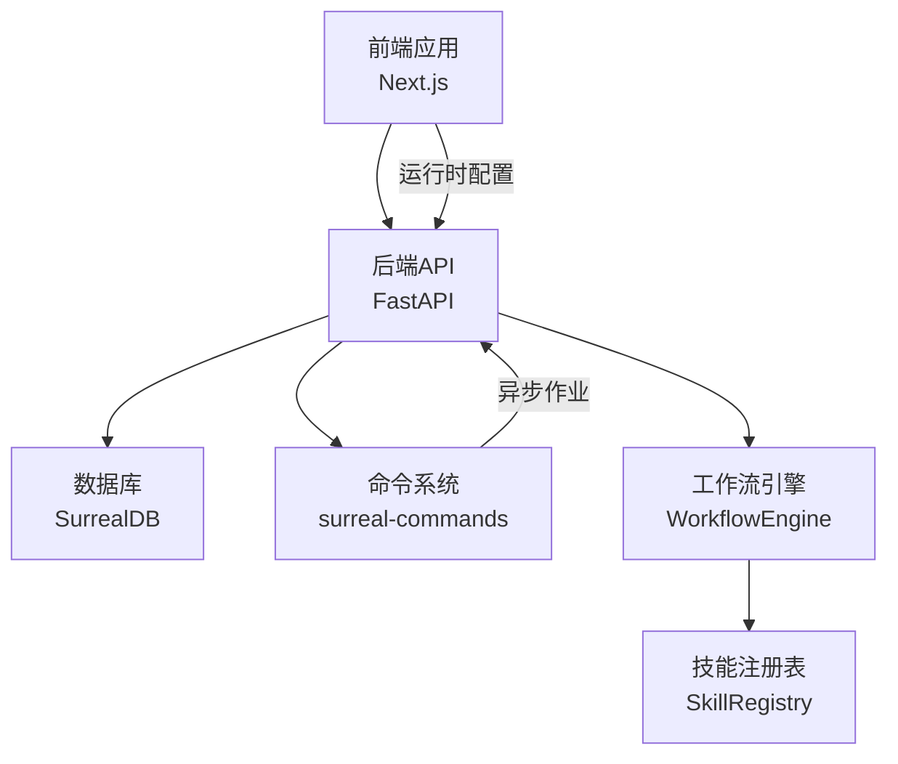

**图表来源**
- [api/main.py](file://api/main.py#L99-L190)
- [frontend/src/lib/config.ts](file://frontend/src/lib/config.ts#L59-L140)
- [frontend/src/app/layout.tsx](file://frontend/src/app/layout.tsx#L19-L45)
- [open_notebook/workflows/engine.py](file://open_notebook/workflows/engine.py#L130-L203)

**章节来源**
- [api/main.py](file://api/main.py#L99-L190)
- [frontend/src/lib/config.ts](file://frontend/src/lib/config.ts#L59-L140)
- [frontend/src/app/layout.tsx](file://frontend/src/app/layout.tsx#L19-L45)

## 核心组件
- 研究笔记本管理：以"笔记本-来源-笔记"的三层容器模型组织研究，支持隔离、共享上下文与细粒度权限
- 多模态内容支持：自动抽取、分块、嵌入与索引，支持文本、PDF、音频、视频、网页等
- **工作流系统**：自然语言工作流生成、模板化工作流创建、多步骤技能编排与执行
- **AI 聊天对话**：基于研究材料的上下文感知对话，支持会话管理与模型覆盖
- 智能搜索：全文与向量混合检索，支持最小相似度过滤与结果聚合
- 播客生成：通过"剧集档案"和"说话人档案"配置，支持 1-4 个说话人的多轨播客生成
- 内容转换：可扩展的"变换"工作流，支持自定义提示词与默认应用策略
- 隐私保护：对 API 凭据进行对称加密存储，支持密码保护与反向代理 CORS 配置
- 多 AI 提供商支持：通过统一接口适配多家模型与语音服务
- 本地部署选项：Docker Compose、单容器与从源码安装等多种部署方式

**章节来源**
- [docs/2-CORE-CONCEPTS/notebooks-sources-notes.md](file://docs/2-CORE-CONCEPTS/notebooks-sources-notes.md#L1-L285)
- [README.md](file://README.md#L194-L217)
- [README.md](file://README.md#L218-L237)

## 架构总览
下图展示了从用户交互到后端服务与数据库的整体流程，以及异步命令系统和工作流引擎的集成点。

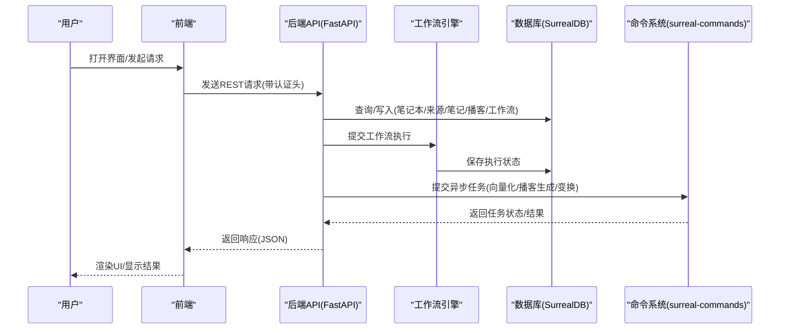

**图表来源**
- [api/main.py](file://api/main.py#L157-L180)
- [open_notebook/domain/notebook.py](file://open_notebook/domain/notebook.py#L411-L456)
- [open_notebook/podcasts/models.py](file://open_notebook/podcasts/models.py#L119-L131)
- [open_notebook/workflows/engine.py](file://open_notebook/workflows/engine.py#L144-L203)

**章节来源**
- [api/main.py](file://api/main.py#L157-L180)
- [open_notebook/domain/notebook.py](file://open_notebook/domain/notebook.py#L411-L456)
- [open_notebook/podcasts/models.py](file://open_notebook/podcasts/models.py#L119-L131)

## 详细组件分析

### 研究笔记本管理
- 组织模型：笔记本作为容器，来源为不可变证据，笔记为可编辑的加工产物
- 关系与边界：来源严格归属单一笔记本，避免上下文污染；笔记仅引用同笔记本内的来源
- 删除预览与级联删除：支持统计删除影响范围（独享来源/共享来源），并按需清理关联记录
- 上下文构建：支持短/长两种上下文模式，用于聊天与问答时的上下文裁剪

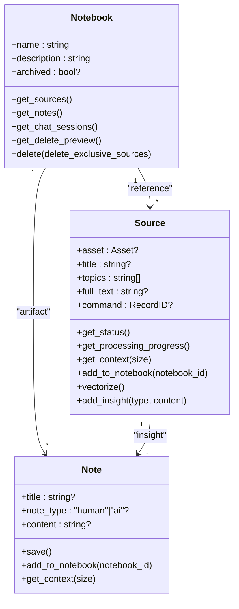

**图表来源**
- [open_notebook/domain/notebook.py](file://open_notebook/domain/notebook.py#L16-L231)
- [open_notebook/domain/notebook.py](file://open_notebook/domain/notebook.py#L288-L553)
- [open_notebook/domain/notebook.py](file://open_notebook/domain/notebook.py#L555-L609)

**章节来源**
- [docs/2-CORE-CONCEPTS/notebooks-sources-notes.md](file://docs/2-CORE-CONCEPTS/notebooks-sources-notes.md#L29-L285)
- [open_notebook/domain/notebook.py](file://open_notebook/domain/notebook.py#L16-L231)

### 工作流系统

**更新** 工作流系统是平台的新核心能力，提供从自然语言到结构化工作流的完整编排能力。

#### 工作流引擎
- **多步骤编排**：支持顺序、并行、条件分支和重试机制
- **依赖管理**：自动检测循环依赖，支持步骤间参数传递
- **执行监控**：实时跟踪执行状态、错误信息和资源创建
- **模板系统**：预定义工作流模板，支持快速实例化

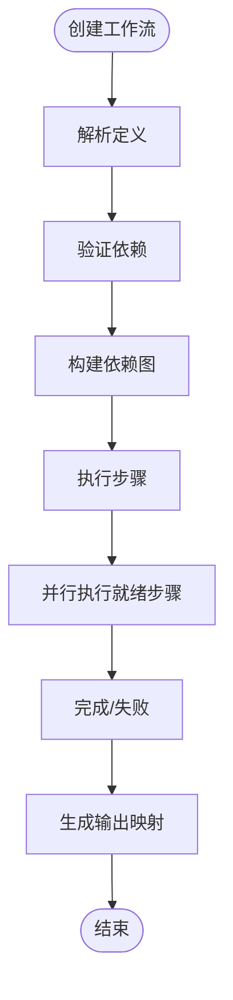

**图表来源**
- [open_notebook/workflows/engine.py](file://open_notebook/workflows/engine.py#L205-L298)

#### 工作流定义
- **步骤定义**：step_id、skill_type、name、description、parameters
- **依赖关系**：depends_on 指定前置步骤
- **执行条件**：condition 字段支持 Python 表达式
- **重试机制**：retry_on_fail 和 retry_delay_seconds
- **继续执行**：continue_on_fail 控制失败处理策略

#### 自然语言工作流生成
- **对话式构建**：通过 ConversationalWorkflowBuilder 将自然语言转换为结构化工作流
- **AI 驱动**：利用大模型理解用户意图并生成合适的工作流结构
- **模板匹配**：根据描述匹配最合适的预定义模板
- **迭代优化**：支持工作流的逐步完善和细化

#### 预定义工作流模板
- **内容监控**：RSS 订阅、新闻聚合、竞争对手监控
- **内容创作**：文章转社交媒体内容、研究摘要生成
- **内容组织**：自动标签、内容分类、索引生成
- **播客制作**：从源内容生成播客节目

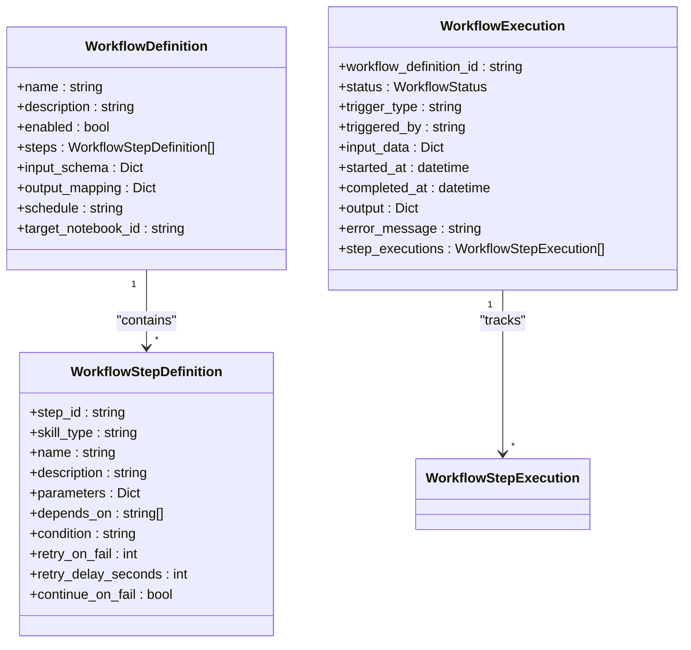

**图表来源**
- [open_notebook/domain/workflow.py](file://open_notebook/domain/workflow.py#L68-L138)
- [open_notebook/domain/workflow.py](file://open_notebook/domain/workflow.py#L184-L228)

**章节来源**
- [open_notebook/workflows/engine.py](file://open_notebook/workflows/engine.py#L1-L620)
- [open_notebook/workflows/service.py](file://open_notebook/workflows/service.py#L1-L240)
- [open_notebook/domain/workflow.py](file://open_notebook/domain/workflow.py#L1-L309)
- [api/routers/workflows.py](file://api/routers/workflows.py#L1-L453)
- [api/routers/workflow_builder.py](file://api/routers/workflow_builder.py#L1-L305)
- [api/routers/workflow_templates.py](file://api/routers/workflow_templates.py#L1-L215)
- [open_notebook/workflows/templates.py](file://open_notebook/workflows/templates.py#L1-L528)
- [open_notebook/workflows/conversational.py](file://open_notebook/workflows/conversational.py#L1-L426)
- [open_notebook/database/migrations/14.surrealql](file://open_notebook/database/migrations/14.surrealql#L1-L65)

### 多模态内容支持与向量化
- 流程：抽取 → 分块 → 嵌入 → 存储；支持多种输入类型与 OCR/STT
- 异步处理：通过命令系统提交向量化任务，避免阻塞主线程与连接池耗尽
- 进度查询：可获取命令状态、执行元数据与错误信息

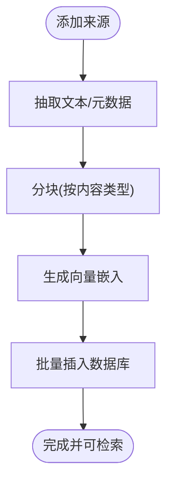

**图表来源**
- [open_notebook/domain/notebook.py](file://open_notebook/domain/notebook.py#L411-L456)

**章节来源**
- [open_notebook/domain/notebook.py](file://open_notebook/domain/notebook.py#L411-L456)

### AI 聊天对话
- 会话管理：支持创建、读取、更新、删除聊天会话；可为会话设置模型覆盖
- 上下文构建：根据笔记本与来源配置构建上下文，支持细粒度控制
- 执行流程：发送消息与上下文到后端，后端以长读超时适配本地推理

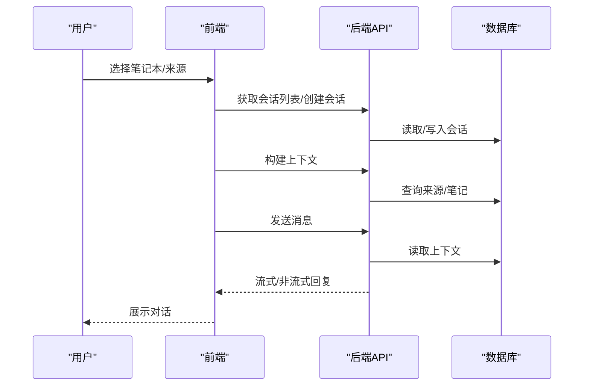

**图表来源**
- [api/chat_service.py](file://api/chat_service.py#L24-L165)

**章节来源**
- [api/chat_service.py](file://api/chat_service.py#L24-L165)

### 智能搜索
- 全文搜索：关键词匹配与排序
- 向量搜索：统一嵌入函数生成查询向量，支持最小相似度阈值
- 结果聚合：支持限制来源/笔记参与搜索，返回统一结构

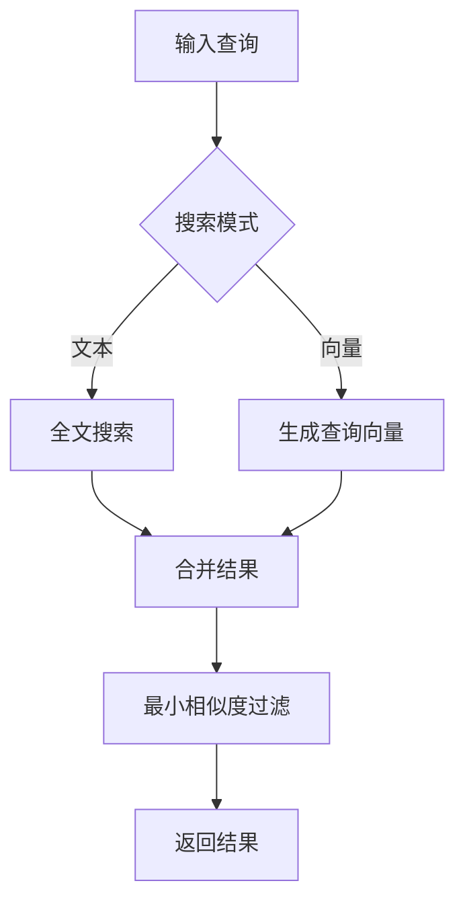

**图表来源**
- [api/search_service.py](file://api/search_service.py#L18-L54)
- [open_notebook/domain/notebook.py](file://open_notebook/domain/notebook.py#L628-L679)

**章节来源**
- [api/search_service.py](file://api/search_service.py#L18-L54)
- [open_notebook/domain/notebook.py](file://open_notebook/domain/notebook.py#L628-L679)

### 播客生成
- 配置模型：剧集档案与说话人档案分别定义 AI 生成与 TTS 参数
- 生成流程：提交生成任务，跟踪命令状态，最终产出音频与转录
- 多说话人：支持 1-4 个说话人，可自定义声音、背景与个性

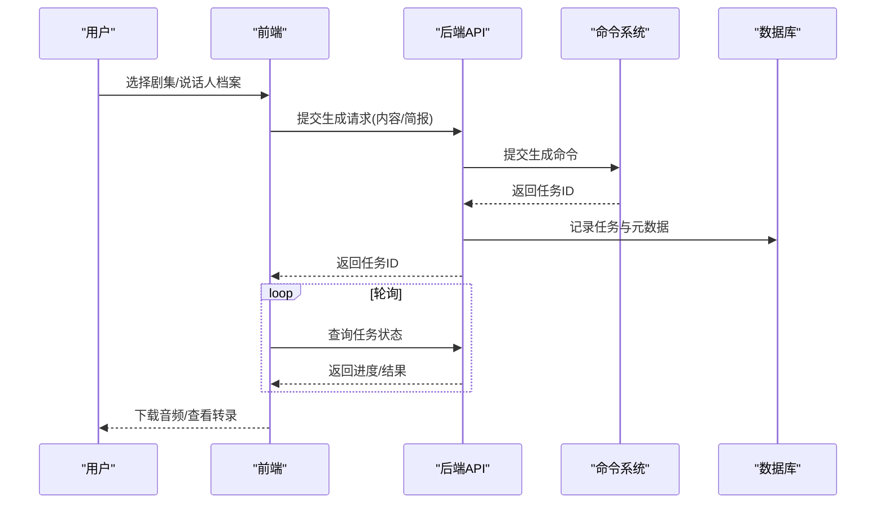

**图表来源**
- [api/podcast_service.py](file://api/podcast_service.py#L36-L133)
- [open_notebook/podcasts/models.py](file://open_notebook/podcasts/models.py#L10-L88)
- [open_notebook/podcasts/models.py](file://open_notebook/podcasts/models.py#L119-L131)

**章节来源**
- [api/podcast_service.py](file://api/podcast_service.py#L36-L133)
- [open_notebook/podcasts/models.py](file://open_notebook/podcasts/models.py#L10-L88)
- [open_notebook/podcasts/models.py](file://open_notebook/podcasts/models.py#L119-L131)

### 内容转换（变换）
- 变换模型：名称、标题、描述、提示词、默认应用策略
- 生命周期：创建、读取、更新、删除与执行
- 执行：对输入文本应用指定变换与模型，返回结构化结果

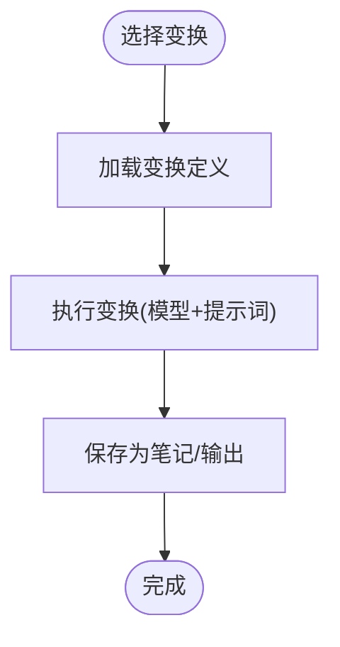

**图表来源**
- [api/transformations_service.py](file://api/transformations_service.py#L20-L137)
- [open_notebook/domain/transformation.py](file://open_notebook/domain/transformation.py)

**章节来源**
- [api/transformations_service.py](file://api/transformations_service.py#L20-L137)

### 隐私保护机制
- 对称加密：使用 Fernet（AES-128-CBC + HMAC-SHA256）对 API 凭据进行加密存储
- 密钥来源：支持环境变量或 Docker Secrets 文件注入，启动时惰性初始化
- 解密回退：对历史明文数据具备兼容回退逻辑
- 运行时安全：启动阶段检查加密密钥配置，缺失时发出警告并阻止不安全启动

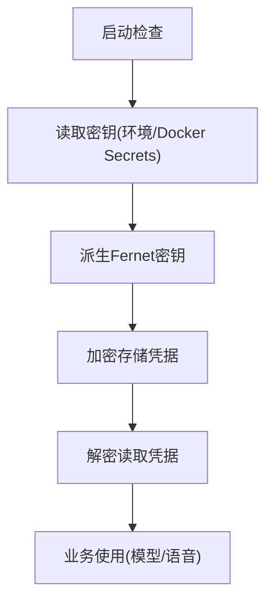

**图表来源**
- [open_notebook/utils/encryption.py](file://open_notebook/utils/encryption.py#L29-L126)
- [open_notebook/utils/encryption.py](file://open_notebook/utils/encryption.py#L128-L199)
- [api/main.py](file://api/main.py#L58-L64)

**章节来源**
- [open_notebook/utils/encryption.py](file://open_notebook/utils/encryption.py#L29-L126)
- [open_notebook/utils/encryption.py](file://open_notebook/utils/encryption.py#L128-L199)
- [api/main.py](file://api/main.py#L58-L64)

### 多 AI 提供商支持与本地部署
- 提供商矩阵：覆盖 OpenAI、Anthropic、Groq、Google、Vertex AI、Ollama、ElevenLabs、Azure、Mistral、Perplexity、Voyage、xAI、OpenRouter 等
- 本地推理：通过 Ollama 或 LM Studio 实现低成本本地 AI 使用
- 部署选项：Docker Compose、单容器、从源码安装，满足不同运维需求

**章节来源**
- [README.md](file://README.md#L194-L217)
- [README.md](file://README.md#L172-L177)

## 依赖关系分析
- 前端配置优先级：运行时配置 → 构建期环境变量 → 智能默认（相对路径重写）
- 中间件链：密码认证中间件优先于 CORS 中间件，确保错误响应携带 CORS 头
- 服务层封装：各领域服务（笔记本、播客、搜索、聊天、变换、工作流）通过统一客户端调用 API

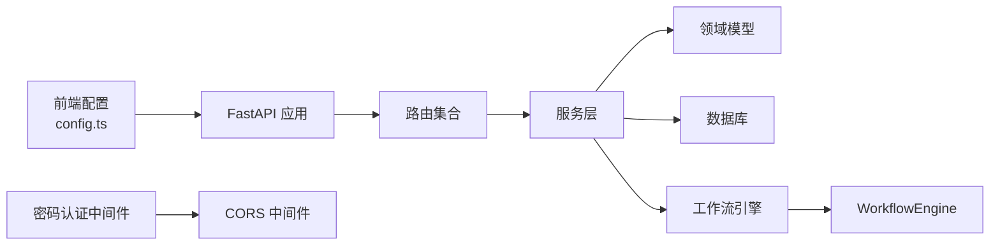

**图表来源**
- [frontend/src/lib/config.ts](file://frontend/src/lib/config.ts#L59-L140)
- [api/main.py](file://api/main.py#L105-L127)
- [api/main.py](file://api/main.py#L157-L180)

**章节来源**
- [frontend/src/lib/config.ts](file://frontend/src/lib/config.ts#L59-L140)
- [api/main.py](file://api/main.py#L105-L127)
- [api/main.py](file://api/main.py#L157-L180)

## 性能考量
- 异步命令系统：向量化与播客生成等重任务通过命令系统后台执行，避免阻塞 API
- 超时策略：聊天执行针对本地推理优化长读超时，平衡响应与稳定性
- 向量检索：统一嵌入函数与最小相似度过滤，减少无关结果干扰
- 数据库访问：通过对象模型与查询封装，减少重复逻辑与错误传播
- **工作流并发**：支持并行执行多个就绪步骤，提高整体执行效率
- **依赖检测**：自动检测循环依赖，防止死锁和资源浪费

**章节来源**
- [open_notebook/domain/notebook.py](file://open_notebook/domain/notebook.py#L411-L456)
- [api/chat_service.py](file://api/chat_service.py#L137-L144)
- [open_notebook/domain/notebook.py](file://open_notebook/domain/notebook.py#L648-L679)
- [open_notebook/workflows/engine.py](file://open_notebook/workflows/engine.py#L224-L273)

## 故障排查指南
- 运行时配置失败：确认 /config 与 /api/config 路由可达，检查运行时优先级与默认回退
- CORS 错误：确保后端异常处理器包含 CORS 头，或在反向代理层配置 CORS
- 加密密钥未配置：启动日志会警告 OPEN_NOTEBOOK_ENCRYPTION_KEY 未设置，需在环境或 Docker Secrets 中配置
- 任务状态查询：通过命令系统获取任务状态与错误信息，定位具体失败环节
- **工作流执行问题**：检查工作流定义的依赖关系、参数模板和技能可用性
- **模板匹配失败**：确认模板 ID 正确且模板已注册，检查输入参数格式

**章节来源**
- [frontend/src/lib/config.ts](file://frontend/src/lib/config.ts#L59-L140)
- [api/main.py](file://api/main.py#L130-L154)
- [open_notebook/utils/encryption.py](file://open_notebook/utils/encryption.py#L78-L87)
- [open_notebook/podcasts/models.py](file://open_notebook/podcasts/models.py#L119-L131)
- [open_notebook/workflows/engine.py](file://open_notebook/workflows/engine.py#L234-L248)

## 结论
Open Notebook 通过"笔记本-来源-笔记"的容器模型，结合多模态处理、智能搜索、上下文感知聊天、播客生成、内容转换和**工作流编排**等能力，为研究者提供了端到端的隐私优先解决方案。其多提供商支持与本地部署选项进一步增强了灵活性与成本控制；完善的 API 与异步任务体系提升了可扩展性与稳定性。配合对称加密与密码保护机制，用户可在保证数据安全的前提下，高效地组织、检索与生成知识。

**更新** 新增的工作流系统将平台从单一技能执行提升为多步骤工作流编排，通过自然语言生成、模板化创建和智能调度，大幅降低了复杂工作流的创建门槛，使用户能够专注于业务逻辑而非技术细节。

## 附录
- 快速开始与安装：参考 README 的快速安装步骤与 Docker Compose 示例
- 用户指南与概念：涵盖笔记本/来源/笔记的组织方式与使用方法
- **工作流指南**：自然语言工作流生成、模板使用和执行监控
- 开发与贡献：包含架构说明、API 参考与测试指南

**章节来源**
- [README.md](file://README.md#L97-L177)
- [docs/index.md](file://docs/index.md#L15-L66)