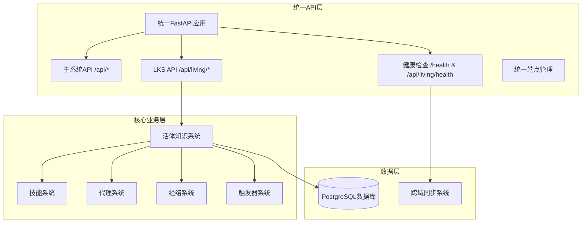
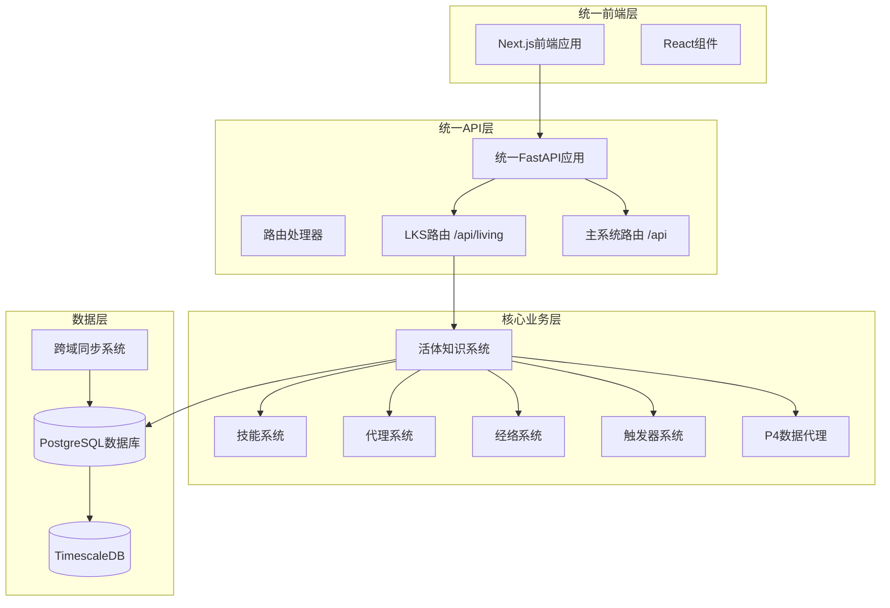
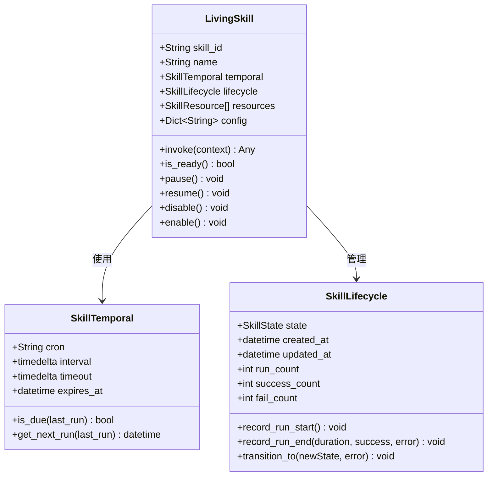
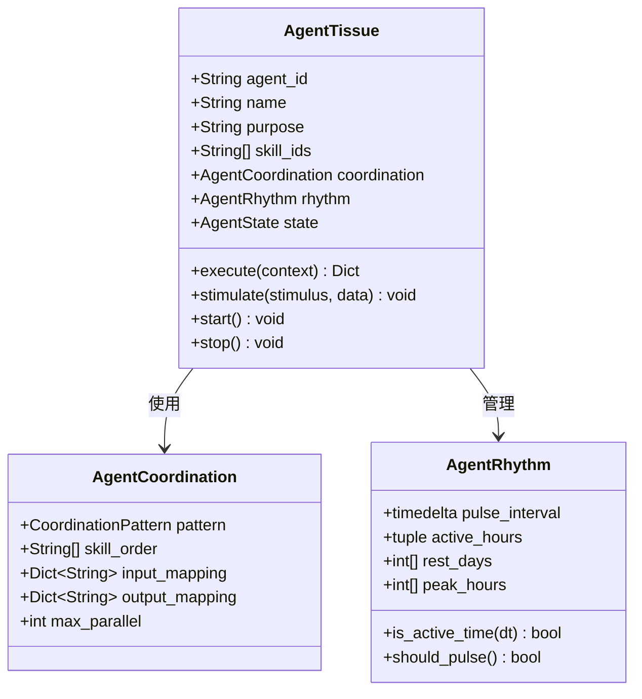
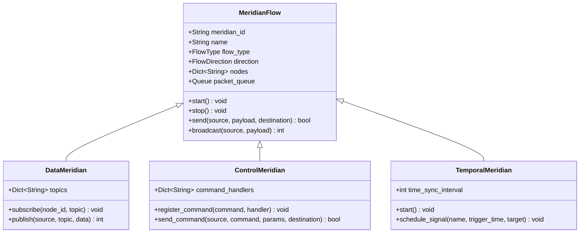
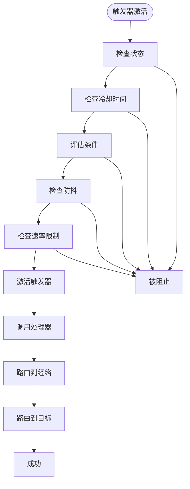
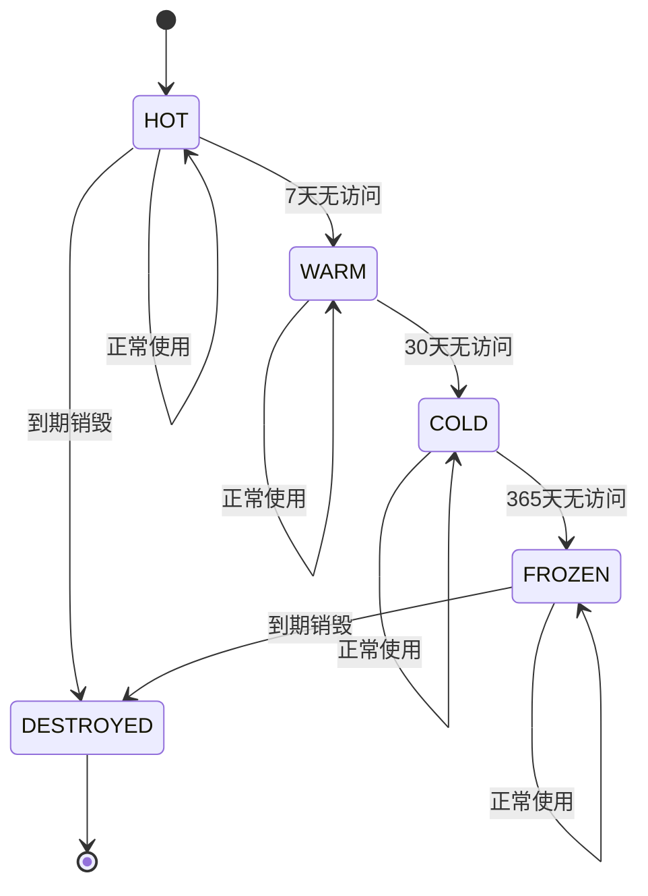
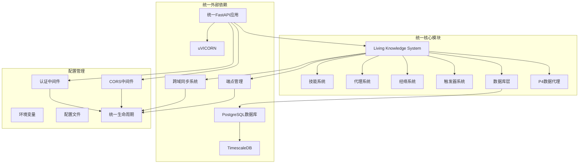

# 活体知识系统

<cite>
**本文档引用的文件**
- [README.md](file://README.md)
- [活体知识系统架构.md](file://docs/活体知识系统架构.md)
- [living_system_architecture.md](file://docs/living_system_architecture.md)
- [living_system_implementation_summary.md](file://docs/living_system_implementation_summary.md)
- [unified_main.py](file://api/unified_main.py)
- [main.py](file://api/main.py)
- [api_endpoints.py](file://open_notebook/skills/living/api_endpoints.py)
- [api_server.py](file://open_notebook/skills/living/api_server.py)
- [launcher.py](file://open_notebook/skills/living/launcher.py)
- [skill_cell.py](file://open_notebook/skills/living/skill_cell.py)
- [agent_tissue.py](file://open_notebook/skills/living/agent_tissue.py)
- [meridian_flow.py](file://open_notebook/skills/living/meridian_flow.py)
- [acupoint_trigger.py](file://open_notebook/skills/living/acupoint_trigger.py)
- [p4_data_agent.py](file://open_notebook/skills/living/p4_data_agent.py)
- [postgresql.py](file://open_notebook/skills/living/database/postgresql.py)
- [docker-compose.living.yml](file://docker-compose.living.yml)
- [Dockerfile.living](file://Dockerfile.living)
- [layout.tsx](file://frontend/src/app/layout.tsx)
</cite>

## 更新摘要
**所做更改**
- 更新了统一API架构，反映LKS与主系统的完全集成
- 新增了统一的API端点结构（/api/living/*）
- 添加了专门的LKS健康检查端点（/api/living/health）
- 更新了系统架构图以体现统一部署模式
- 增加了新的Docker Compose配置用于LKS集成

## 目录
1. [简介](#简介)
2. [统一架构概览](#统一架构概览)
3. [项目结构](#项目结构)
4. [核心组件](#核心组件)
5. [统一API端点](#统一api端点)
6. [健康检查系统](#健康检查系统)
7. [详细组件分析](#详细组件分析)
8. [依赖关系分析](#依赖关系分析)
9. [性能考虑](#性能考虑)
10. [故障排除指南](#故障排除指南)
11. [结论](#结论)

## 简介

活体知识系统（Living Knowledge System, LKS）是一个基于人体组织类比的知识管理系统，现已与Open Notebook主系统实现完全统一集成。该系统通过五个层级的架构设计，模拟生物体的各个系统，包括细胞层（技能）、组织层（代理）、器官层（系统）、经络层（数据流）和穴位层（触发器）。

**更新** 系统现已采用统一API架构，所有LKS功能通过统一的FastAPI应用提供，端点前缀为/api/living，实现了与主系统的无缝集成。

## 统一架构概览

系统采用统一的事件驱动架构模式，通过触发器接收外部事件，经由经络系统传输到相应的代理组织，最终由技能细胞执行具体任务。新的统一架构将LKS与主系统完全融合。



**图表来源**
- [unified_main.py](file://api/unified_main.py#L319-L370)
- [api_endpoints.py](file://open_notebook/skills/living/api_endpoints.py#L131-L170)

## 项目结构

该项目采用统一的分层架构设计，主要包含以下核心模块：



**更新** 新的统一架构将LKS API路由（/api/living/*）与主系统API路由（/api/*）完全集成到同一个FastAPI应用中。

**章节来源**
- [unified_main.py](file://api/unified_main.py#L319-L319)
- [docker-compose.living.yml](file://docker-compose.living.yml#L39-L77)

## 核心组件

活体知识系统的核心由五个层次组成，每个层次都有其特定的功能和职责：

### 1. 细胞层（Skill Cell）
细胞层是最基本的功能单元，类似于生物细胞，具有生命周期、时序属性和资源管理能力。

### 2. 组织层（Agent Tissue）
组织层由多个技能细胞组成，负责协调执行特定功能，具有节律管理和健康监控能力。

### 3. 器官层（Organ System）
器官层由多个代理组成，形成复杂的系统，如P0感知系统、P1判断系统等，负责高级功能。

### 4. 经络层（Meridian Flow）
经络层负责连接各个层次，提供数据流、控制流和时序流，确保系统内部通信。

### 5. 穴位层（Acupoint Trigger）
穴位层作为外部接入点，接收来自外部系统的触发信号，如Agently工作流、时间调度、Webhook等。

**章节来源**
- [活体知识系统架构.md](file://docs/活体知识系统架构.md#L4-L39)
- [living_system_architecture.md](file://docs/living_system_architecture.md#L5-L58)

## 统一API端点

**更新** 系统现已提供统一的API端点结构，所有LKS功能通过/api/living前缀提供：

### P0感知层端点
- `POST /api/living/p0/perceive` - P0感知层请求
- 支持多种感知类型：pain_scan（疼痛扫描）、emotion（情感分析）、trend（趋势发现）、scene（场景发现）

### P1判断层端点
- `POST /api/living/p1/assess` - P1判断层评估
- 返回综合价值评分、优先级和推荐操作

### P2关系层端点
- `POST /api/living/p2/analyze` - P2关系层分析
- `GET /api/living/p2/graph` - 获取知识图谱信息

### P3进化层端点
- `POST /api/living/p3/evolve` - P3进化层优化

### P4数据管理端点
- `POST /api/living/p4/data` - P4数据层管理
- `POST /api/living/pipeline/full` - 完整P0-P4处理管道

### 系统状态端点
- `GET /api/living/status` - 系统整体状态
- `GET /api/living/` - API根端点信息

**章节来源**
- [api_endpoints.py](file://open_notebook/skills/living/api_endpoints.py#L176-L565)

## 健康检查系统

**更新** 系统提供双重健康检查机制：

### 主系统健康检查
- `GET /health` - 主系统健康检查
- 检查SurrealDB、PostgreSQL、同步系统等核心组件状态

### LKS专用健康检查
- `GET /api/living/health` - LKS专用健康检查
- 专门检查PostgreSQL数据库连接和系统健康状态

### 健康检查响应格式
```json
{
  "status": "healthy",
  "database": "connected",
  "cells": {
    "total": 150,
    "running": 12,
    "healthy": 145
  },
  "agents": {
    "total": 25,
    "healthy": 25
  },
  "triggers_24h": {
    "total": 1200
  },
  "timestamp": "2026-02-17T10:30:00Z"
}
```

**章节来源**
- [unified_main.py](file://api/unified_main.py#L372-L406)
- [api_server.py](file://open_notebook/skills/living/api_server.py#L185-L207)

## 详细组件分析

### 技能细胞（LivingSkill）分析

技能细胞是系统的基本执行单元，具有完整的生命周期管理、时序调度和资源加载功能。



**图表来源**
- [skill_cell.py](file://open_notebook/skills/living/skill_cell.py#L211-L474)

技能细胞的关键特性包括：

1. **生命周期管理**：完整的状态转换（IDLE → RUNNING → COMPLETED/FAILED → EXPIRED）
2. **时序调度**：支持Cron表达式、间隔执行和延迟执行
3. **资源管理**：动态加载Python脚本、Jinja2模板等资源
4. **依赖管理**：支持前置技能依赖和触发链
5. **错误处理**：自动重试机制和错误记录

**章节来源**
- [skill_cell.py](file://open_notebook/skills/living/skill_cell.py#L1-L474)

### 代理组织（AgentTissue）分析

代理组织负责协调多个技能细胞的执行，具有多种协调模式和健康监控功能。



**图表来源**
- [agent_tissue.py](file://open_notebook/skills/living/agent_tissue.py#L127-L489)

代理组织的主要功能：

1. **协调模式**：支持序列、并行、流水线、条件、循环、投票、竞速等多种执行模式
2. **节律管理**：模拟生物钟，管理活跃时间和休息周期
3. **健康监控**：跟踪压力水平、能量水平和性能指标
4. **事件响应**：异步处理外部刺激和事件

**章节来源**
- [agent_tissue.py](file://open_notebook/skills/living/agent_tissue.py#L1-L489)

### 经络系统（MeridianFlow）分析

经络系统提供三种类型的流：数据流、控制流和时序流，确保系统内部的有效通信。



**图表来源**
- [meridian_flow.py](file://open_notebook/skills/living/meridian_flow.py#L63-L444)

经络系统的特点：

1. **多类型支持**：数据、控制、时序和能量流
2. **灵活路由**：支持单播、广播、多播和汇聚
3. **流量控制**：队列管理和拥塞控制
4. **监控能力**：实时监控和历史数据分析

**章节来源**
- [meridian_flow.py](file://open_notebook/skills/living/meridian_flow.py#L1-L444)

### 触发器系统（AcupointTrigger）分析

触发器系统作为外部接入点，提供多种触发方式和条件评估功能。



**图表来源**
- [acupoint_trigger.py](file://open_notebook/skills/living/acupoint_trigger.py#L213-L277)

触发器系统的核心功能：

1. **多种触发类型**：时间触发、事件触发、条件触发、手动触发、Agently触发
2. **智能调度**：支持Cron定时、延迟执行和周期性任务
3. **条件评估**：阈值、模式匹配、复合条件
4. **防抖和限流**：防止重复触发和系统过载

**章节来源**
- [acupoint_trigger.py](file://open_notebook/skills/living/acupoint_trigger.py#L1-L596)

### 数据管理（P4DataAgent）分析

P4数据代理负责数据生命周期管理，模拟免疫系统功能。



**图表来源**
- [p4_data_agent.py](file://open_notebook/skills/living/p4_data_agent.py#L314-L357)

数据管理的关键特性：

1. **生命周期管理**：热、温、冷、冻结四个存储层级
2. **质量监控**：完整性、一致性、及时性检查
3. **成本优化**：不同层级的成本计算和存储策略
4. **健康监控**：数据流监控和异常告警

**章节来源**
- [p4_data_agent.py](file://open_notebook/skills/living/p4_data_agent.py#L1-L601)

## 依赖关系分析

**更新** 统一架构下的依赖关系：



**图表来源**
- [unified_main.py](file://api/unified_main.py#L71-L210)
- [launcher.py](file://open_notebook/skills/living/launcher.py#L100-L189)

**章节来源**
- [unified_main.py](file://api/unified_main.py#L65-L210)
- [launcher.py](file://open_notebook/skills/living/launcher.py#L1-L345)

## 性能考虑

活体知识系统在设计时充分考虑了性能优化：

1. **统一架构**：所有组件在同一进程内运行，减少进程间通信开销
2. **异步架构**：所有核心组件都支持异步操作，提高并发处理能力
3. **连接池管理**：数据库连接池配置，减少连接开销
4. **缓存策略**：内存缓存和数据库缓存结合使用
5. **负载均衡**：支持多实例部署和负载分担
6. **监控指标**：内置性能监控和告警机制
7. **健康检查**：双重健康检查确保系统稳定性

## 故障排除指南

### 常见问题及解决方案

1. **统一API启动失败**
   - 检查数据库连接配置
   - 验证PostgreSQL服务状态
   - 确认网络连接和防火墙设置

2. **LKS端点访问失败**
   - 验证/api/living前缀是否正确
   - 检查认证中间件配置
   - 确认端点路由是否正确注册

3. **健康检查失败**
   - 检查主系统健康检查（/health）
   - 检查LKS健康检查（/api/living/health）
   - 验证数据库连接状态

4. **技能执行失败**
   - 查看技能生命周期状态
   - 检查依赖关系和前置条件
   - 验证资源文件加载情况

**章节来源**
- [living_system_implementation_summary.md](file://docs/living_system_implementation_summary.md#L146-L154)

## 结论

活体知识系统通过人体组织类比的设计理念，结合统一API架构，创造了一个高度模块化、可扩展且自组织的知识管理平台。系统的核心优势包括：

1. **架构创新**：基于人体生物学原理的五层架构设计
2. **统一集成**：LKS与主系统的完全统一，提供一致的API体验
3. **模块化设计**：清晰的组件边界和接口定义
4. **事件驱动**：灵活的触发器系统和异步处理机制
5. **数据管理**：完整的数据生命周期和质量保证
6. **可扩展性**：支持多种AI提供商和自定义扩展
7. **统一监控**：双重健康检查确保系统稳定性

**更新** 统一架构为知识管理提供了全新的思路，通过模拟生物体的自组织能力，实现了智能化、自动化的内容处理和知识管理功能。随着P1-P3系统的逐步完善，系统将具备更强大的认知能力和适应性，为用户提供更加智能的知识管理体验。

该系统现已完全集成到Open Notebook主平台，为用户提供统一的API接口和一致的用户体验，标志着活体知识系统从独立模块发展为完整生态系统的重要里程碑。