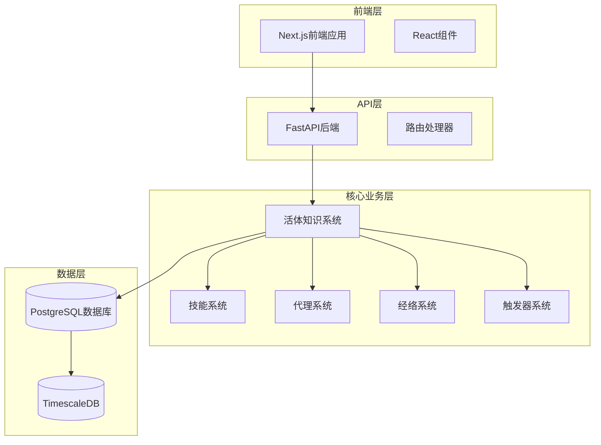
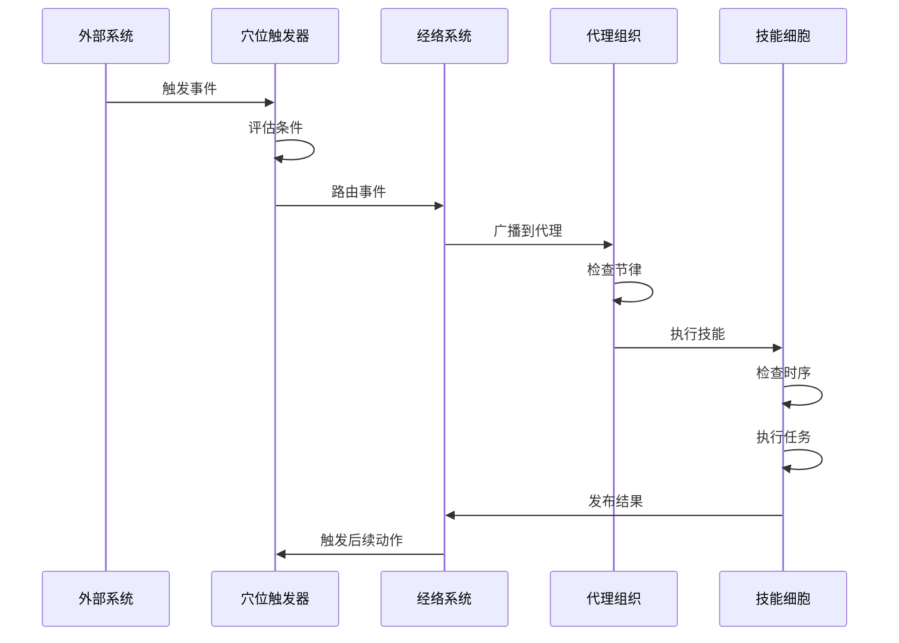
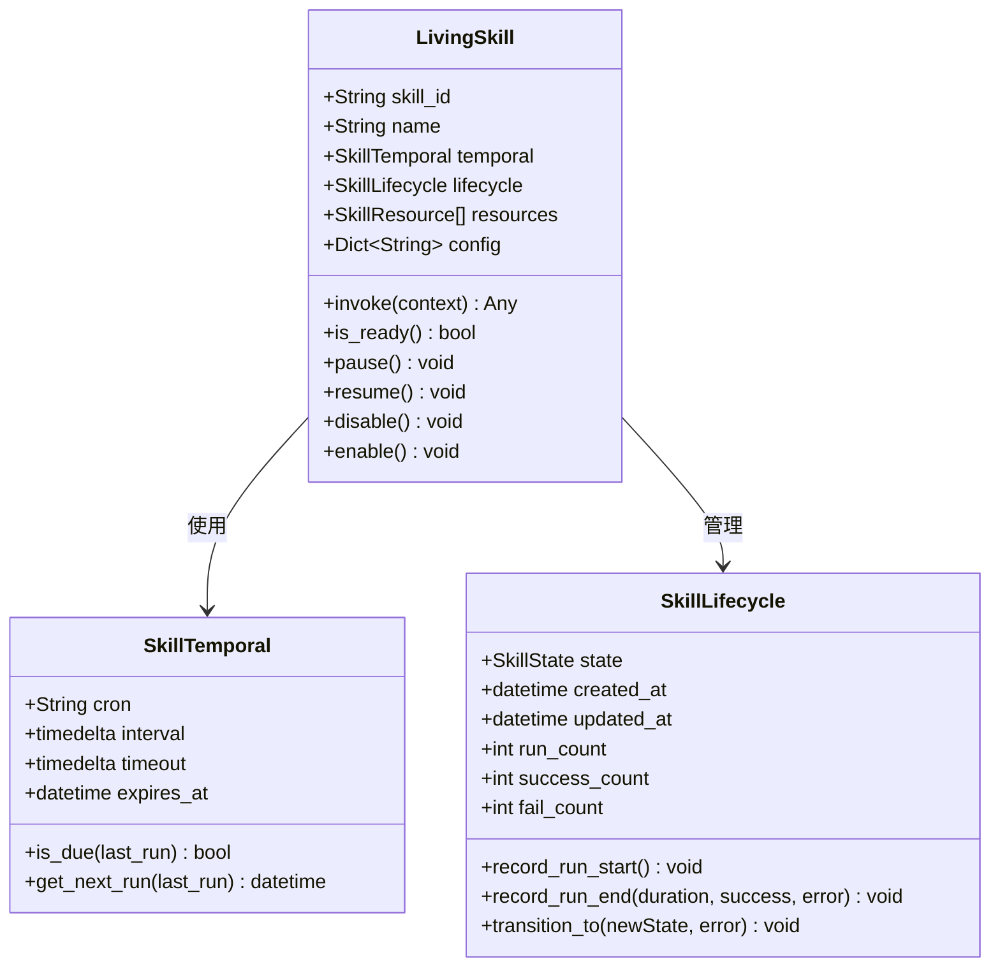
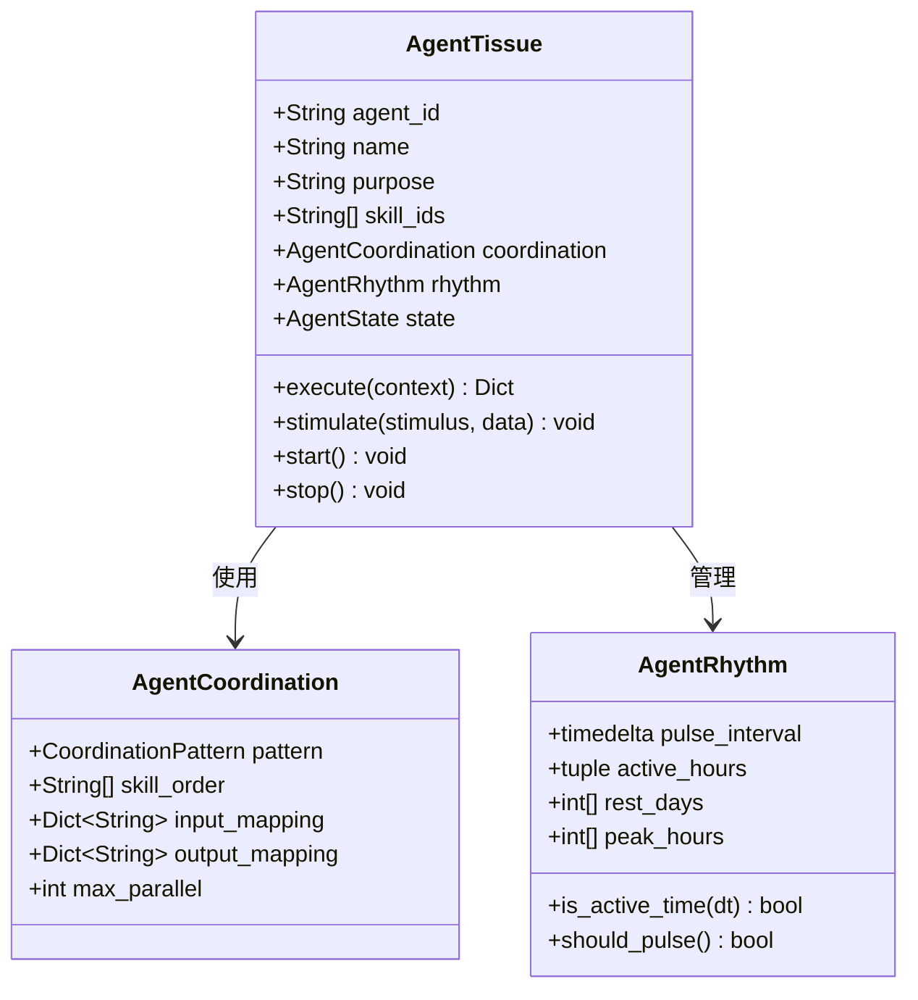
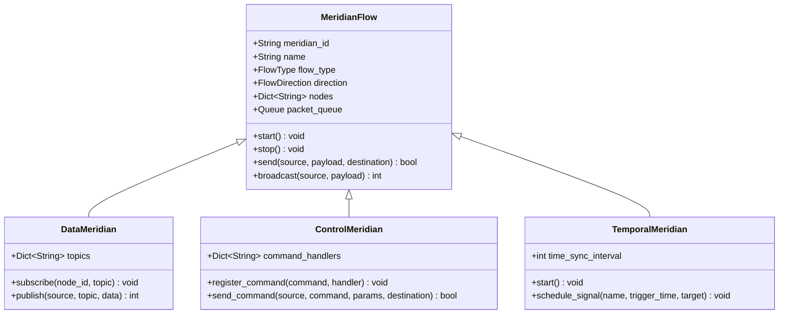
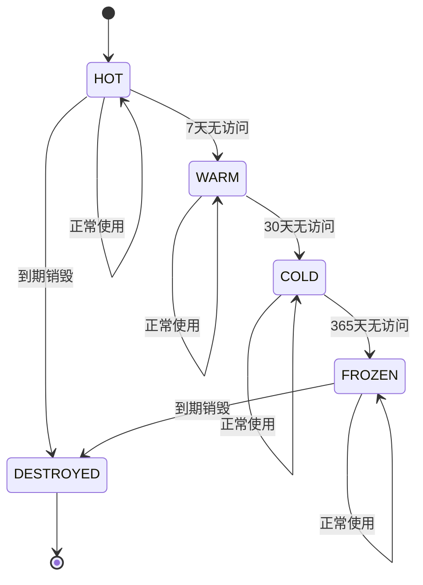
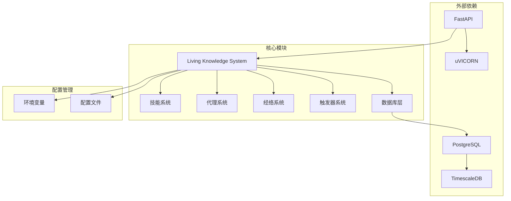

# 活体知识系统

<cite>
**本文档引用的文件**
- [README.md](file://README.md)
- [活体知识系统架构.md](file://docs/活体知识系统架构.md)
- [living_system_architecture.md](file://docs/living_system_architecture.md)
- [living_system_implementation_summary.md](file://docs/living_system_implementation_summary.md)
- [skill_cell.py](file://open_notebook/skills/living/skill_cell.py)
- [agent_tissue.py](file://open_notebook/skills/living/agent_tissue.py)
- [meridian_flow.py](file://open_notebook/skills/living/meridian_flow.py)
- [acupoint_trigger.py](file://open_notebook/skills/living/acupoint_trigger.py)
- [p4_data_agent.py](file://open_notebook/skills/living/p4_data_agent.py)
- [api_server.py](file://open_notebook/skills/living/api_server.py)
- [launcher.py](file://open_notebook/skills/living/launcher.py)
- [postgresql.py](file://open_notebook/skills/living/database/postgresql.py)
- [main.py](file://api/main.py)
- [layout.tsx](file://frontend/src/app/layout.tsx)
</cite>

## 目录
1. [简介](#简介)
2. [项目结构](#项目结构)
3. [核心组件](#核心组件)
4. [架构概览](#架构概览)
5. [详细组件分析](#详细组件分析)
6. [依赖关系分析](#依赖关系分析)
7. [性能考虑](#性能考虑)
8. [故障排除指南](#故障排除指南)
9. [结论](#结论)

## 简介

活体知识系统是一个基于人体组织类比的知识管理系统，实现了自组织、自运行的智能系统。该系统通过五个层级的架构设计，模拟生物体的各个系统，包括细胞层（技能）、组织层（代理）、器官层（系统）、经络层（数据流）和穴位层（触发器）。

系统的核心目标是提供一个隐私优先、可扩展的知识管理平台，支持多模态内容处理、智能搜索、上下文对话和内容转换等功能。它采用模块化设计，允许用户根据需要选择不同的AI提供商，并提供完整的API接口用于程序化访问。

## 项目结构

该项目采用分层架构设计，主要包含以下核心模块：

**图表来源**
- [main.py](file://api/main.py#L173-L273)
- [api_server.py](file://open_notebook/skills/living/api_server.py#L119-L158)

**章节来源**
- [README.md](file://README.md#L1-L358)
- [layout.tsx](file://frontend/src/app/layout.tsx#L1-L46)

## 核心组件

活体知识系统的核心由五个层次组成，每个层次都有其特定的功能和职责：

### 1. 细胞层（Skill Cell）
细胞层是最基本的功能单元，类似于生物细胞，具有生命周期、时序属性和资源管理能力。

### 2. 组织层（Agent Tissue）
组织层由多个技能细胞组成，负责协调执行特定功能，具有节律管理和健康监控能力。

### 3. 器官层（Organ System）
器官层由多个代理组成，形成复杂的系统，如P0感知系统、P1判断系统等，负责高级功能。

### 4. 经络层（Meridian Flow）
经络层负责连接各个层次，提供数据流、控制流和时序流，确保系统内部通信。

### 5. 穴位层（Acupoint Trigger）
穴位层作为外部接入点，接收来自外部系统的触发信号，如Agently工作流、时间调度、Webhook等。

**章节来源**
- [活体知识系统架构.md](file://docs/活体知识系统架构.md#L4-L39)
- [living_system_architecture.md](file://docs/living_system_architecture.md#L5-L58)

## 架构概览

系统采用事件驱动的架构模式，通过触发器接收外部事件，经由经络系统传输到相应的代理组织，最终由技能细胞执行具体任务。

**图表来源**
- [living_system_architecture.md](file://docs/living_system_architecture.md#L244-L264)
- [acupoint_trigger.py](file://open_notebook/skills/living/acupoint_trigger.py#L213-L277)

## 详细组件分析

### 技能细胞（LivingSkill）分析

技能细胞是系统的基本执行单元，具有完整的生命周期管理、时序调度和资源加载功能。

**图表来源**
- [skill_cell.py](file://open_notebook/skills/living/skill_cell.py#L211-L474)

技能细胞的关键特性包括：

1. **生命周期管理**：完整的状态转换（IDLE → RUNNING → COMPLETED/FAILED → EXPIRED）
2. **时序调度**：支持Cron表达式、间隔执行和延迟执行
3. **资源管理**：动态加载Python脚本、Jinja2模板等资源
4. **依赖管理**：支持前置技能依赖和触发链
5. **错误处理**：自动重试机制和错误记录

**章节来源**
- [skill_cell.py](file://open_notebook/skills/living/skill_cell.py#L1-L474)

### 代理组织（AgentTissue）分析

代理组织负责协调多个技能细胞的执行，具有多种协调模式和健康监控功能。

**图表来源**
- [agent_tissue.py](file://open_notebook/skills/living/agent_tissue.py#L127-L489)

代理组织的主要功能：

1. **协调模式**：支持序列、并行、流水线、条件、循环、投票、竞速等多种执行模式
2. **节律管理**：模拟生物钟，管理活跃时间和休息周期
3. **健康监控**：跟踪压力水平、能量水平和性能指标
4. **事件响应**：异步处理外部刺激和事件

**章节来源**
- [agent_tissue.py](file://open_notebook/skills/living/agent_tissue.py#L1-L489)

### 经络系统（MeridianFlow）分析

经络系统提供三种类型的流：数据流、控制流和时序流，确保系统内部的有效通信。

**图表来源**
- [meridian_flow.py](file://open_notebook/skills/living/meridian_flow.py#L63-L444)

经络系统的特点：

1. **多类型支持**：数据、控制、时序和能量流
2. **灵活路由**：支持单播、广播、多播和汇聚
3. **流量控制**：队列管理和拥塞控制
4. **监控能力**：实时监控和历史数据分析

**章节来源**
- [meridian_flow.py](file://open_notebook/skills/living/meridian_flow.py#L1-L444)

### 触发器系统（AcupointTrigger）分析

触发器系统作为外部接入点，提供多种触发方式和条件评估功能。

**图表来源**
- [acupoint_trigger.py](file://open_notebook/skills/living/acupoint_trigger.py#L213-L277)

触发器系统的核心功能：

1. **多种触发类型**：时间触发、事件触发、条件触发、手动触发、Agently触发
2. **智能调度**：支持Cron定时、延迟执行和周期性任务
3. **条件评估**：阈值、模式匹配、复合条件
4. **防抖和限流**：防止重复触发和系统过载

**章节来源**
- [acupoint_trigger.py](file://open_notebook/skills/living/acupoint_trigger.py#L1-L596)

### 数据管理（P4DataAgent）分析

P4数据代理负责数据生命周期管理，模拟免疫系统功能。

**图表来源**
- [p4_data_agent.py](file://open_notebook/skills/living/p4_data_agent.py#L314-L357)

数据管理的关键特性：

1. **生命周期管理**：热、温、冷、冻结四个存储层级
2. **质量监控**：完整性、一致性、及时性检查
3. **成本优化**：不同层级的成本计算和存储策略
4. **健康监控**：数据流监控和异常告警

**章节来源**
- [p4_data_agent.py](file://open_notebook/skills/living/p4_data_agent.py#L1-L601)

## 依赖关系分析

系统采用模块化设计，各组件之间通过清晰的接口进行交互。

**图表来源**
- [launcher.py](file://open_notebook/skills/living/launcher.py#L100-L189)
- [api_server.py](file://open_notebook/skills/living/api_server.py#L119-L158)

**章节来源**
- [launcher.py](file://open_notebook/skills/living/launcher.py#L1-L345)
- [postgresql.py](file://open_notebook/skills/living/database/postgresql.py#L1-L699)

## 性能考虑

活体知识系统在设计时充分考虑了性能优化：

1. **异步架构**：所有核心组件都支持异步操作，提高并发处理能力
2. **连接池管理**：数据库连接池配置，减少连接开销
3. **缓存策略**：内存缓存和数据库缓存结合使用
4. **负载均衡**：支持多实例部署和负载分担
5. **监控指标**：内置性能监控和告警机制

## 故障排除指南

### 常见问题及解决方案

1. **数据库连接失败**
   - 检查数据库配置参数
   - 验证PostgreSQL服务状态
   - 确认网络连接和防火墙设置

2. **技能执行失败**
   - 查看技能生命周期状态
   - 检查依赖关系和前置条件
   - 验证资源文件加载情况

3. **经络阻塞**
   - 监控队列长度和处理延迟
   - 检查节点连接状态
   - 分析流量模式和峰值

4. **触发器不响应**
   - 验证触发器状态和条件
   - 检查冷却时间和防抖设置
   - 确认目标节点可用性

**章节来源**
- [living_system_implementation_summary.md](file://docs/living_system_implementation_summary.md#L146-L154)

## 结论

活体知识系统通过人体组织类比的设计理念，创造了一个高度模块化、可扩展且自组织的知识管理平台。系统的核心优势包括：

1. **架构创新**：基于人体生物学原理的五层架构设计
2. **模块化设计**：清晰的组件边界和接口定义
3. **事件驱动**：灵活的触发器系统和异步处理机制
4. **数据管理**：完整的数据生命周期和质量保证
5. **可扩展性**：支持多种AI提供商和自定义扩展

该系统为知识管理提供了全新的思路，通过模拟生物体的自组织能力，实现了智能化、自动化的内容处理和知识管理功能。随着P1-P3系统的逐步完善，系统将具备更强大的认知能力和适应性，为用户提供更加智能的知识管理体验。