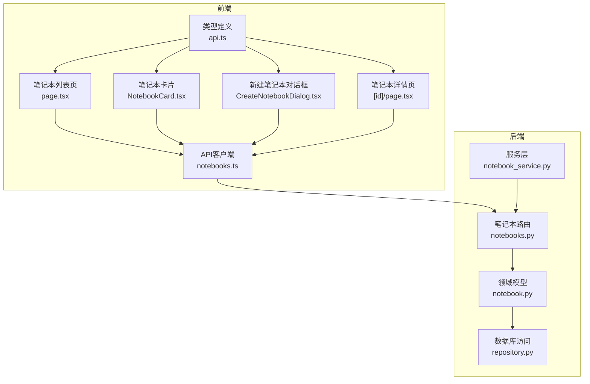
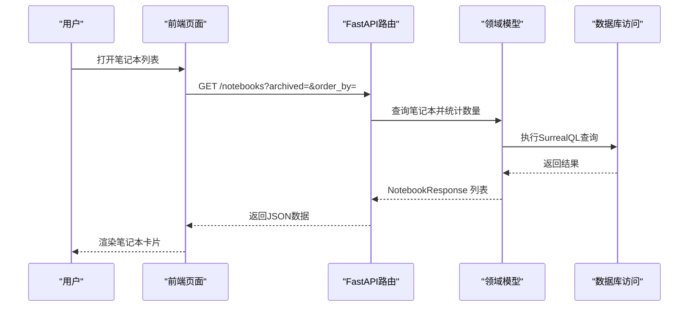
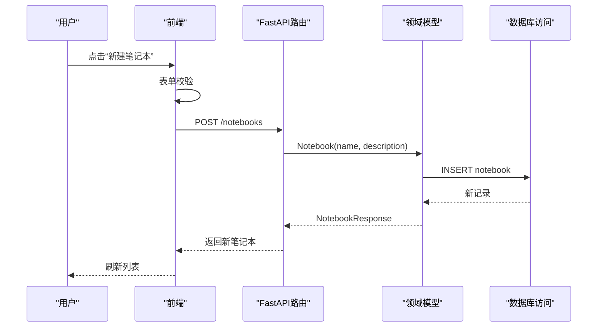
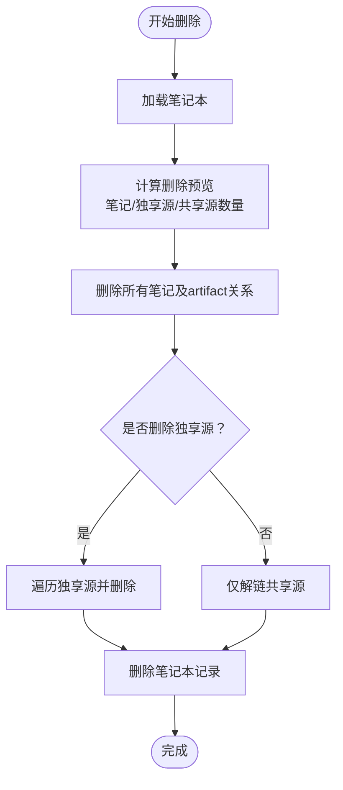
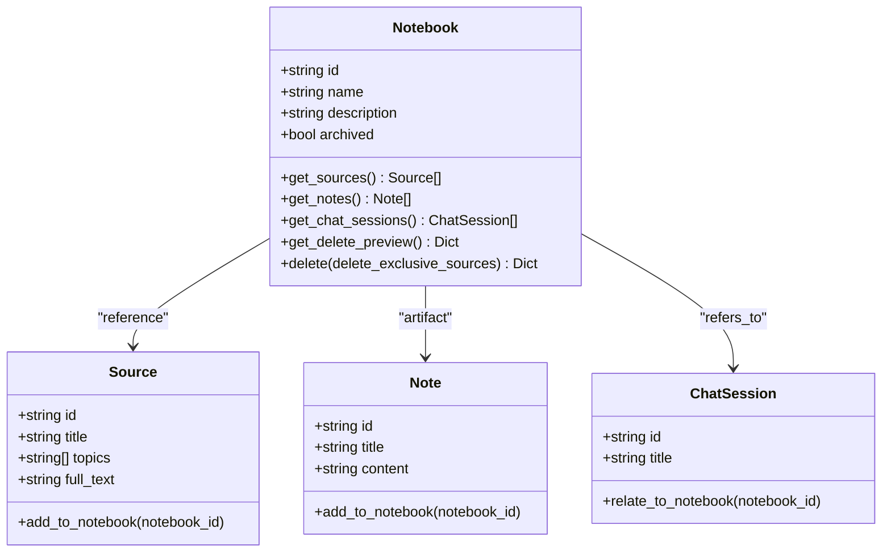
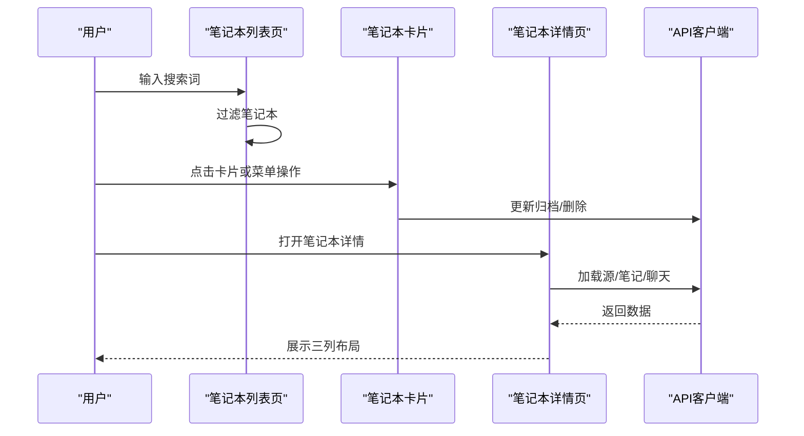
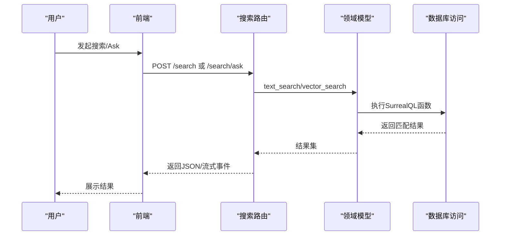
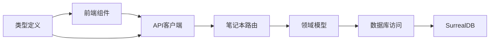

# 研究笔记本管理

<cite>
**本文引用的文件**
- [notebooks.py](file://api/routers/notebooks.py)
- [notebook_service.py](file://api/notebook_service.py)
- [notebook.py](file://open_notebook/domain/notebook.py)
- [repository.py](file://open_notebook/database/repository.py)
- [page.tsx（笔记本列表页）](file://frontend/src/app/(dashboard)/notebooks/page.tsx)
- [NotebookList.tsx](file://frontend/src/app/(dashboard)/notebooks/components/NotebookList.tsx)
- [NotebookCard.tsx](file://frontend/src/app/(dashboard)/notebooks/components/NotebookCard.tsx)
- [CreateNotebookDialog.tsx](file://frontend/src/components/notebooks/CreateNotebookDialog.tsx)
- [page.tsx（笔记本详情页）](file://frontend/src/app/(dashboard)/notebooks/[id]/page.tsx)
- [api.ts（类型定义）](file://frontend/src/lib/types/api.ts)
- [models.py（API模型）](file://api/models.py)
- [search.py（搜索路由）](file://api/routers/search.py)
- [notebooks.ts（API客户端）](file://frontend/src/lib/api/notebooks.ts)
- [notebooks-sources-notes.md](file://docs/2-CORE-CONCEPTS/notebooks-sources-notes.md)
</cite>

## 目录
1. [简介](#简介)
2. [项目结构](#项目结构)
3. [核心组件](#核心组件)
4. [架构总览](#架构总览)
5. [详细组件分析](#详细组件分析)
6. [依赖关系分析](#依赖关系分析)
7. [性能考量](#性能考量)
8. [故障排查指南](#故障排查指南)
9. [结论](#结论)
10. [附录](#附录)

## 简介
本文件面向Open Notebook的研究笔记本管理功能，系统性阐述笔记本的创建、编辑、删除与组织管理，覆盖多笔记本项目管理、笔记本信息维护、权限控制与协作机制。文档还详解笔记本与内容源、笔记、聊天记录之间的关系与数据流转，说明笔记本在研究工作流中的作用以及如何帮助用户组织不同主题的研究项目。同时提供笔记本模板、标签系统、搜索过滤等高级功能的使用方法，给出最佳实践建议（命名规范、分类策略、备份恢复），并展示与其他功能模块（内容关联、笔记生成、搜索）的集成方式。

## 项目结构
Open Notebook采用前后端分离架构：后端基于FastAPI提供REST接口，使用SurrealDB作为图数据库；前端采用Next.js构建仪表盘界面，通过React Hooks与API交互。笔记本管理涉及以下关键路径：
- 后端API路由：/api/routers/notebooks.py
- 领域模型：/open_notebook/domain/notebook.py
- 数据访问层：/open_notebook/database/repository.py
- 前端页面与组件：/frontend/src/app/(dashboard)/notebooks/*
- 类型与API客户端：/frontend/src/lib/types/api.ts、/frontend/src/lib/api/notebooks.ts

图表来源
- [notebooks.py](file://api/routers/notebooks.py#L1-L328)
- [notebook_service.py](file://api/notebook_service.py#L1-L88)
- [notebook.py](file://open_notebook/domain/notebook.py#L1-L679)
- [repository.py](file://open_notebook/database/repository.py#L1-L195)
- [page.tsx（笔记本列表页）](file://frontend/src/app/(dashboard)/notebooks/page.tsx#L1-L111)
- [NotebookCard.tsx](file://frontend/src/app/(dashboard)/notebooks/components/NotebookCard.tsx#L1-L138)
- [CreateNotebookDialog.tsx](file://frontend/src/components/notebooks/CreateNotebookDialog.tsx#L1-L113)
- [page.tsx（笔记本详情页）](file://frontend/src/app/(dashboard)/notebooks/[id]/page.tsx#L1-L245)
- [api.ts（类型定义）](file://frontend/src/lib/types/api.ts#L1-L242)
- [notebooks.ts（API客户端）](file://frontend/src/lib/api/notebooks.ts#L1-L44)

章节来源
- [notebooks.py](file://api/routers/notebooks.py#L1-L328)
- [notebook.py](file://open_notebook/domain/notebook.py#L1-L679)
- [repository.py](file://open_notebook/database/repository.py#L1-L195)
- [page.tsx（笔记本列表页）](file://frontend/src/app/(dashboard)/notebooks/page.tsx#L1-L111)
- [NotebookCard.tsx](file://frontend/src/app/(dashboard)/notebooks/components/NotebookCard.tsx#L1-L138)
- [CreateNotebookDialog.tsx](file://frontend/src/components/notebooks/CreateNotebookDialog.tsx#L1-L113)
- [page.tsx（笔记本详情页）](file://frontend/src/app/(dashboard)/notebooks/[id]/page.tsx#L1-L245)
- [api.ts（类型定义）](file://frontend/src/lib/types/api.ts#L1-L242)
- [notebooks.ts（API客户端）](file://frontend/src/lib/api/notebooks.ts#L1-L44)

## 核心组件
- 笔记本API路由：提供笔记本的增删改查、关联内容源、删除预览等接口，支持按归档状态筛选与排序。
- 领域模型：封装笔记本、内容源、笔记、聊天会话等实体及其查询与删除逻辑，负责数据一致性与级联操作。
- 数据库访问层：统一处理SurrealDB连接、查询、事务冲突重试与错误日志。
- 前端页面与组件：提供笔记本列表、卡片、新建对话框、详情页布局与列式视图，支持移动端与桌面端自适应。
- 类型与API客户端：定义请求/响应类型，封装HTTP调用，便于前端组件复用。

章节来源
- [notebooks.py](file://api/routers/notebooks.py#L20-L328)
- [notebook.py](file://open_notebook/domain/notebook.py#L16-L231)
- [repository.py](file://open_notebook/database/repository.py#L65-L195)
- [page.tsx（笔记本列表页）](file://frontend/src/app/(dashboard)/notebooks/page.tsx#L14-L111)
- [NotebookCard.tsx](file://frontend/src/app/(dashboard)/notebooks/components/NotebookCard.tsx#L25-L138)
- [CreateNotebookDialog.tsx](file://frontend/src/components/notebooks/CreateNotebookDialog.tsx#L35-L113)
- [api.ts（类型定义）](file://frontend/src/lib/types/api.ts#L1-L242)
- [notebooks.ts（API客户端）](file://frontend/src/lib/api/notebooks.ts#L10-L44)

## 架构总览
笔记本管理遵循“路由-服务-领域模型-数据库”的分层设计：
- 路由层接收HTTP请求，进行参数校验与异常处理；
- 服务层（可选）封装跨路由的业务逻辑；
- 领域模型负责实体行为与复杂查询（如删除预览、级联删除）；
- 数据库访问层统一封装SurrealDB操作，自动解析RecordID并处理错误。

图表来源
- [notebooks.py](file://api/routers/notebooks.py#L20-L60)
- [notebook.py](file://open_notebook/domain/notebook.py#L29-L62)
- [repository.py](file://open_notebook/database/repository.py#L65-L83)

章节来源
- [notebooks.py](file://api/routers/notebooks.py#L20-L60)
- [notebook.py](file://open_notebook/domain/notebook.py#L29-L62)
- [repository.py](file://open_notebook/database/repository.py#L65-L83)

## 详细组件分析

### 笔记本创建与编辑
- 创建：前端通过新建对话框提交名称与描述，后端校验必填字段，创建笔记本并返回带计数的响应对象。
- 编辑：支持更新名称、描述与归档状态，后端仅更新提供的字段，避免覆盖未变更项。
- 搜索与过滤：前端支持按名称关键词过滤笔记本列表，后端提供按归档状态与排序字段的查询能力。

图表来源
- [CreateNotebookDialog.tsx](file://frontend/src/components/notebooks/CreateNotebookDialog.tsx#L54-L58)
- [notebooks.py](file://api/routers/notebooks.py#L62-L88)
- [notebook.py](file://open_notebook/domain/notebook.py#L16-L27)
- [repository.py](file://open_notebook/database/repository.py#L85-L104)

章节来源
- [CreateNotebookDialog.tsx](file://frontend/src/components/notebooks/CreateNotebookDialog.tsx#L35-L113)
- [notebooks.py](file://api/routers/notebooks.py#L62-L88)
- [notebook.py](file://open_notebook/domain/notebook.py#L16-L27)
- [page.tsx（笔记本列表页）](file://frontend/src/app/(dashboard)/notebooks/page.tsx#L16-L48)
- [models.py（API模型）](file://api/models.py#L6-L29)

### 笔记本删除与级联清理
- 删除预览：计算将被删除的笔记数量、可删除的独享源数量与需解链的共享源数量，避免误删。
- 级联删除：先删除所有笔记及其“artifact”关系，再根据选项决定是否删除独享源或仅解链共享源，最后删除笔记本自身。
- 安全保障：通过事务冲突重试与异常捕获，确保删除过程的稳定性。

图表来源
- [notebook.py](file://open_notebook/domain/notebook.py#L88-L231)
- [notebooks.py](file://api/routers/notebooks.py#L91-L118)
- [repository.py](file://open_notebook/database/repository.py#L106-L132)

章节来源
- [notebook.py](file://open_notebook/domain/notebook.py#L88-L231)
- [notebooks.py](file://api/routers/notebooks.py#L91-L118)
- [models.py（API模型）](file://api/models.py#L666-L685)

### 笔记本与内容源、笔记、聊天的关系
- 关系模型：笔记本通过“reference”关系关联内容源，“artifact”关系关联笔记，“refers_to”关系关联聊天会话。
- 查询能力：领域模型提供按笔记本检索源、笔记、聊天会话的方法，支持排序与字段裁剪以优化性能。
- 数据隔离：每个源仅属于一个笔记本，笔记与聊天会话也限定在笔记本范围内，保证上下文隔离。

图表来源
- [notebook.py](file://open_notebook/domain/notebook.py#L29-L87)
- [notebook.py](file://open_notebook/domain/notebook.py#L406-L410)
- [notebook.py](file://open_notebook/domain/notebook.py#L593-L596)
- [notebook.py](file://open_notebook/domain/notebook.py#L617-L625)

章节来源
- [notebook.py](file://open_notebook/domain/notebook.py#L29-L87)
- [notebook.py](file://open_notebook/domain/notebook.py#L406-L410)
- [notebook.py](file://open_notebook/domain/notebook.py#L593-L596)
- [notebook.py](file://open_notebook/domain/notebook.py#L617-L625)

### 前端交互与布局
- 列表页：支持搜索关键词过滤、刷新、新建笔记本；分别渲染活跃与归档笔记本列表。
- 卡片组件：展示名称、描述、更新时间、源与笔记数量，支持归档/取消归档与删除操作。
- 详情页：桌面端采用三列布局（源、笔记、聊天），移动端使用标签页切换；支持上下文模式选择（无/洞察/全文）。

图表来源
- [page.tsx（笔记本列表页）](file://frontend/src/app/(dashboard)/notebooks/page.tsx#L21-L48)
- [NotebookCard.tsx](file://frontend/src/app/(dashboard)/notebooks/components/NotebookCard.tsx#L31-L98)
- [page.tsx（笔记本详情页）](file://frontend/src/app/(dashboard)/notebooks/[id]/page.tsx#L28-L245)
- [notebooks.ts（API客户端）](file://frontend/src/lib/api/notebooks.ts#L10-L44)

章节来源
- [page.tsx（笔记本列表页）](file://frontend/src/app/(dashboard)/notebooks/page.tsx#L14-L111)
- [NotebookList.tsx](file://frontend/src/app/(dashboard)/notebooks/components/NotebookList.tsx#L23-L90)
- [NotebookCard.tsx](file://frontend/src/app/(dashboard)/notebooks/components/NotebookCard.tsx#L25-L138)
- [page.tsx（笔记本详情页）](file://frontend/src/app/(dashboard)/notebooks/[id]/page.tsx#L28-L245)
- [notebooks.ts（API客户端）](file://frontend/src/lib/api/notebooks.ts#L10-L44)

### 搜索与知识问答集成
- 文本搜索与向量搜索：后端提供统一的搜索接口，支持文本关键词与语义向量两种模式；向量搜索需要配置嵌入模型。
- Ask问答：支持流式与非流式两种返回方式，内部通过图执行器完成策略制定、搜索与答案生成。
- 与笔记本的结合：搜索结果可在笔记本内保存为笔记，或用于聊天上下文构建。

图表来源
- [search.py（搜索路由）](file://api/routers/search.py#L17-L59)
- [notebook.py](file://open_notebook/domain/notebook.py#L628-L679)
- [repository.py](file://open_notebook/database/repository.py#L65-L83)

章节来源
- [search.py（搜索路由）](file://api/routers/search.py#L17-L59)
- [notebook.py](file://open_notebook/domain/notebook.py#L628-L679)

## 依赖关系分析
- 组件耦合：前端页面依赖API客户端与类型定义；API路由依赖领域模型与数据库访问层；领域模型依赖数据库访问层与SurrealDB。
- 外部依赖：SurrealDB（图数据库）、FastAPI（后端框架）、Next.js（前端框架）、loguru（日志）。
- 可能的循环依赖：当前结构清晰，未发现直接循环导入；注意领域模型中对数据库访问层的调用应保持单向。

图表来源
- [notebooks.ts（API客户端）](file://frontend/src/lib/api/notebooks.ts#L1-L44)
- [api.ts（类型定义）](file://frontend/src/lib/types/api.ts#L1-L242)
- [notebooks.py](file://api/routers/notebooks.py#L1-L328)
- [notebook.py](file://open_notebook/domain/notebook.py#L1-L679)
- [repository.py](file://open_notebook/database/repository.py#L1-L195)

章节来源
- [notebooks.ts（API客户端）](file://frontend/src/lib/api/notebooks.ts#L1-L44)
- [api.ts（类型定义）](file://frontend/src/lib/types/api.ts#L1-L242)
- [notebooks.py](file://api/routers/notebooks.py#L1-L328)
- [notebook.py](file://open_notebook/domain/notebook.py#L1-L679)
- [repository.py](file://open_notebook/database/repository.py#L1-L195)

## 性能考量
- 查询优化：领域模型在查询源、笔记时使用字段裁剪（omit）与排序，减少网络传输与前端渲染压力。
- 批量操作：删除时先聚合统计再执行批量删除，降低多次往返的开销。
- 异步处理：内容源向量化与笔记嵌入通过命令队列异步执行，避免阻塞HTTP请求。
- 并发安全：数据库访问层对事务冲突进行重试与降噪日志，提升高并发下的稳定性。

## 故障排查指南
- 常见错误与处理
  - 输入校验失败：当名称为空或描述为空时，后端抛出400错误；前端应提示用户修正。
  - 笔记本不存在：查询或更新时若找不到记录，返回404；前端应引导用户检查链接或重新加载。
  - 数据库操作异常：统一捕获并记录异常，返回500；检查数据库连接与SurrealDB状态。
  - 事务冲突：数据库层对冲突进行重试与日志降噪，若持续出现需检查并发写入策略。
- 排查步骤
  - 确认SurrealDB连接参数（地址、用户名、密码、命名空间、数据库名）正确。
  - 检查笔记本ID格式与存在性，确认“reference/artifact/refers_to”关系是否存在。
  - 查看后端日志中的异常堆栈，定位具体SQL或Python代码位置。
  - 使用删除预览接口确认将要删除的数据范围，避免误删。

章节来源
- [notebooks.py](file://api/routers/notebooks.py#L82-L88)
- [notebook.py](file://open_notebook/domain/notebook.py#L22-L27)
- [repository.py](file://open_notebook/database/repository.py#L77-L82)

## 结论
Open Notebook的笔记本管理以清晰的三层架构实现：前端负责交互与布局，后端提供稳健的REST接口，领域模型承载复杂业务逻辑与数据一致性保障。通过“笔记本-源-笔记-聊天”的层级化组织，系统实现了研究项目的强隔离与可审计性。配合搜索与问答能力，用户可以在同一工作流中高效地组织、检索与生成知识。建议在实际使用中遵循命名规范、合理规划笔记本边界，并利用删除预览与备份策略确保数据安全。

## 附录

### 最佳实践
- 命名规范
  - 使用明确的主题词作为笔记本名称，避免过长或模糊的标题。
  - 描述字段用于补充背景与目标，便于他人理解项目范围。
- 分类策略
  - 按研究阶段（文献调研、实验、总结）或主题（方法、数据、结果）划分笔记本。
  - 对内容源使用标签（topics）进行二次分类，便于快速筛选。
- 备份与恢复
  - 定期导出SurrealDB数据或使用其备份功能，确保笔记本、源、笔记与聊天记录的完整性。
  - 在迁移或升级前先做快照，验证恢复流程后再执行生产变更。
- 权限与协作
  - 将笔记本视为权限边界：拥有笔记本即获得其全部内容的访问权。
  - 对外部协作场景，建议通过复制/克隆的方式共享子集，而非直接分享数据库凭证。

### 高级功能使用
- 模板与批量处理
  - 使用“转换”模板对多个内容源进行批量提取，生成标准化的笔记。
- 搜索与过滤
  - 文本搜索适合精确关键词匹配；向量搜索适合语义相似度检索。
  - 在笔记本详情页中，可选择“无/洞察/全文”三种上下文模式，平衡性能与准确性。
- 与笔记生成的集成
  - 将搜索结果或聊天回答保存为笔记，自动建立引用关系，形成可追溯的知识沉淀。

章节来源
- [notebooks-sources-notes.md](file://docs/2-CORE-CONCEPTS/notebooks-sources-notes.md#L1-L285)
- [search.py（搜索路由）](file://api/routers/search.py#L17-L59)
- [page.tsx（笔记本详情页）](file://frontend/src/app/(dashboard)/notebooks/[id]/page.tsx#L55-L108)