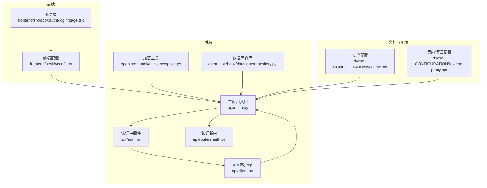
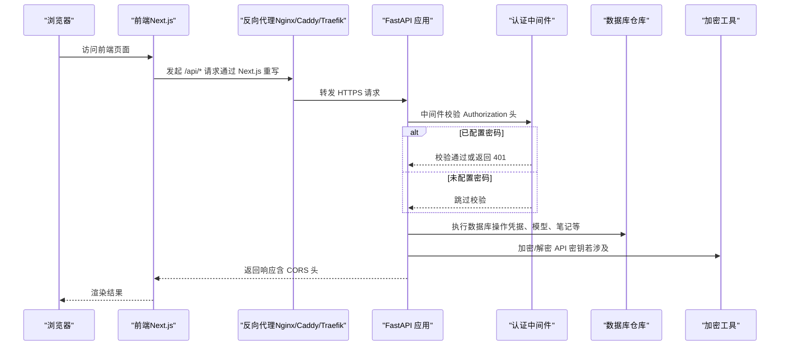
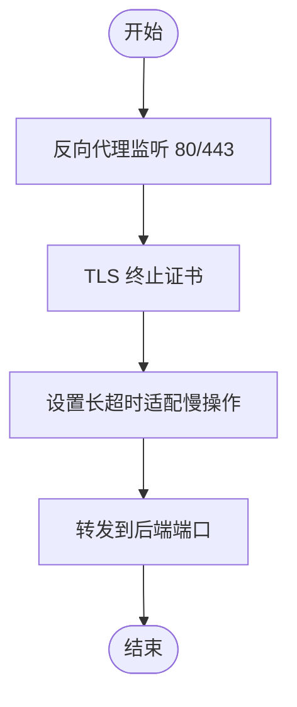
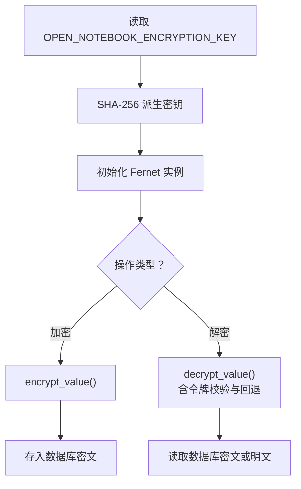
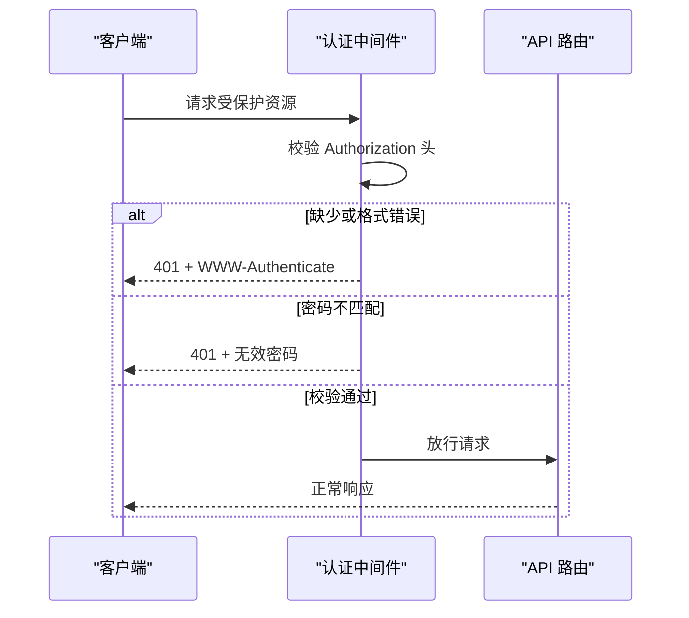
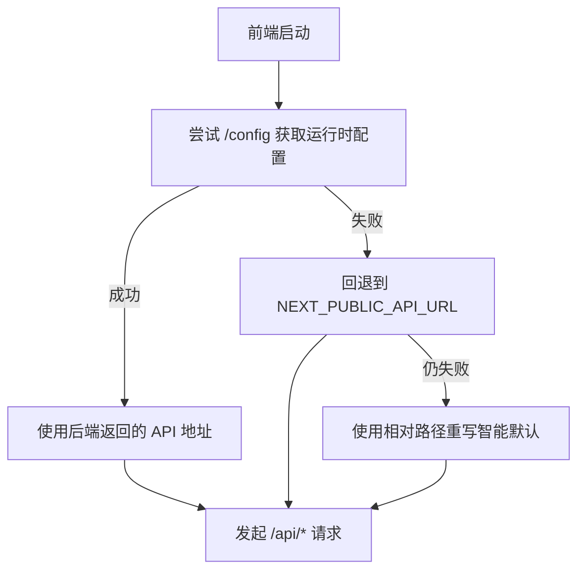
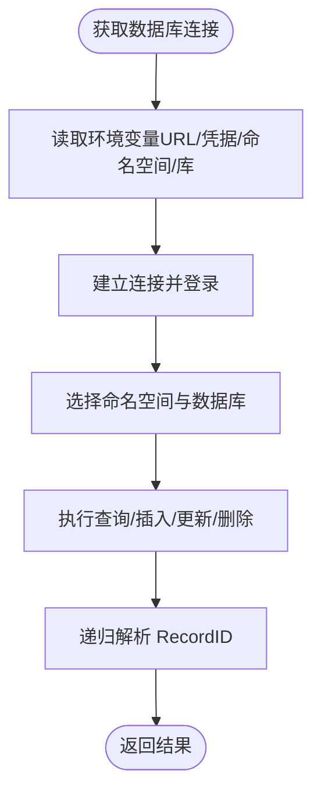
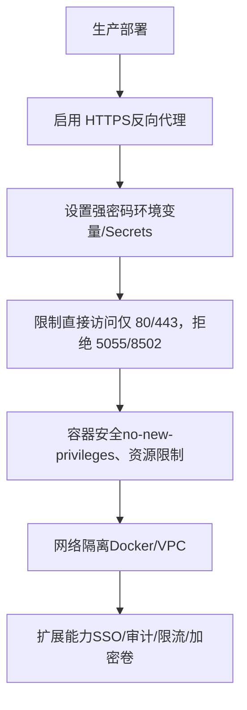
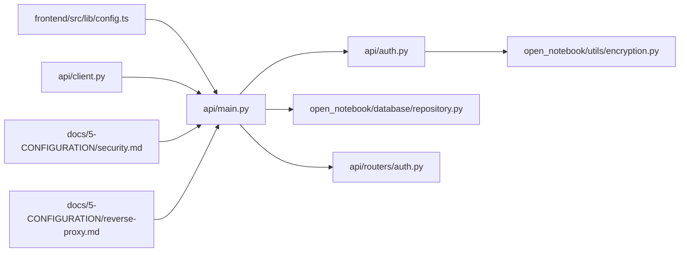

# 隐私保护与安全

<cite>
**本文引用的文件**
- [安全配置（security.md）](file://docs/5-CONFIGURATION/security.md)
- [反向代理配置（reverse-proxy.md）](file://docs/5-CONFIGURATION/reverse-proxy.md)
- [加密工具（encryption.py）](file://open_notebook/utils/encryption.py)
- [认证中间件（auth.py）](file://api/auth.py)
- [主应用入口（main.py）](file://api/main.py)
- [前端配置（config.ts）](file://frontend/src/lib/config.ts)
- [认证路由（auth.py）](file://api/routers/auth.py)
- [API 客户端（client.py）](file://api/client.py)
- [数据库仓库（repository.py）](file://open_notebook/database/repository.py)
- [URL 校验测试（test_url_validation.py）](file://tests/test_url_validation.py)
- [登录页（page.tsx）](file://frontend/src/app/(auth)/login/page.tsx)
</cite>

## 目录
1. [简介](#简介)
2. [项目结构](#项目结构)
3. [核心组件](#核心组件)
4. [架构总览](#架构总览)
5. [详细组件分析](#详细组件分析)
6. [依赖关系分析](#依赖关系分析)
7. [性能考量](#性能考量)
8. [故障排查指南](#故障排查指南)
9. [结论](#结论)
10. [附录](#附录)

## 简介
本章节面向安全与隐私主题，系统梳理 Open Notebook 在数据加密、认证授权、网络边界与本地化部署方面的实现与最佳实践。重点覆盖：
- 数据加密：传输加密（HTTPS）、存储加密（API 密钥对称加密）、端到端加密现状与建议
- 认证与授权：基于密码的访问控制、API 密钥管理、访问控制策略
- 数据主权与本地部署：如何确保敏感研究材料不离开用户控制范围
- 安全配置：HTTPS 设置、防火墙规则、审计日志现状与建议
- 安全最佳实践：密钥管理、定期更新、漏洞防护
- 威胁分析与防护：DDoS、SQL 注入、XSS 等
- 合规性：数据保护法规与行业标准的契合点

## 项目结构
围绕“隐私与安全”的关键目录与文件如下：
- 文档与配置：docs/5-CONFIGURATION/security.md、docs/5-CONFIGURATION/reverse-proxy.md
- 后端安全：api/auth.py、api/main.py、open_notebook/utils/encryption.py
- 前端安全：frontend/src/lib/config.ts
- 数据库与凭证：open_notebook/database/repository.py
- 测试与验证：tests/test_url_validation.py
- 登录与认证：frontend/src/app/(auth)/login/page.tsx、api/routers/auth.py、api/client.py

**图表来源**
- [主应用入口（main.py）](file://api/main.py#L1-L190)
- [认证中间件（auth.py）](file://api/auth.py#L1-L115)
- [加密工具（encryption.py）](file://open_notebook/utils/encryption.py#L1-L199)
- [数据库仓库（repository.py）](file://open_notebook/database/repository.py#L1-L195)
- [认证路由（auth.py）](file://api/routers/auth.py#L1-L27)
- [前端配置（config.ts）](file://frontend/src/lib/config.ts#L1-L149)
- [登录页（page.tsx）](file://frontend/src/app/(auth)/login/page.tsx#L1-L10)
- [API 客户端（client.py）](file://api/client.py#L1-L530)
- [安全配置（security.md）](file://docs/5-CONFIGURATION/security.md#L1-L397)
- [反向代理配置（reverse-proxy.md）](file://docs/5-CONFIGURATION/reverse-proxy.md#L1-L897)

**章节来源**
- [主应用入口（main.py）](file://api/main.py#L1-L190)
- [安全配置（security.md）](file://docs/5-CONFIGURATION/security.md#L1-L397)
- [反向代理配置（reverse-proxy.md）](file://docs/5-CONFIGURATION/reverse-proxy.md#L1-L897)

## 核心组件
- 传输加密（HTTPS）
  - 使用反向代理（Nginx/Caddy/Traefik）终止 TLS 并转发至后端，确保浏览器与代理之间为 HTTPS，代理与后端之间可为内部 HTTP 或同样启用 TLS。
  - 参考：[反向代理配置（reverse-proxy.md）](file://docs/5-CONFIGURATION/reverse-proxy.md#L1-L897)
- 存储加密（API 密钥）
  - 对数据库中存储的第三方 API 密钥采用对称加密（Fernet/AES-128-CBC/HMAC-SHA256），密钥由环境变量派生，支持 Docker Secrets。
  - 参考：[加密工具（encryption.py）](file://open_notebook/utils/encryption.py#L1-L199)、[安全配置（security.md）](file://docs/5-CONFIGURATION/security.md#L1-L397)
- 认证与授权（密码保护）
  - 全局中间件强制所有受保护路径需要 Bearer Token 形式的密码；未配置密码时跳过认证；健康检查等少数路径豁免。
  - 参考：[认证中间件（auth.py）](file://api/auth.py#L1-L115)、[主应用入口（main.py）](file://api/main.py#L105-L118)
- 前端连接与安全
  - 前端通过运行时配置优先读取后端返回的 API 地址，避免硬编码；支持相对路径重写以减少跨域复杂度。
  - 参考：[前端配置（config.ts）](file://frontend/src/lib/config.ts#L1-L149)
- 数据库与凭证
  - 数据库连接参数从环境变量读取，含用户名、密码、命名空间与数据库名；对记录 ID 进行递归解析，保证序列化一致性。
  - 参考：[数据库仓库（repository.py）](file://open_notebook/database/repository.py#L1-L195)

**章节来源**
- [加密工具（encryption.py）](file://open_notebook/utils/encryption.py#L1-L199)
- [认证中间件（auth.py）](file://api/auth.py#L1-L115)
- [主应用入口（main.py）](file://api/main.py#L105-L118)
- [前端配置（config.ts）](file://frontend/src/lib/config.ts#L1-L149)
- [数据库仓库（repository.py）](file://open_notebook/database/repository.py#L1-L195)

## 架构总览
下图展示了从浏览器到后端 API 的请求流，以及认证与加密的关键节点。

**图表来源**
- [主应用入口（main.py）](file://api/main.py#L105-L118)
- [认证中间件（auth.py）](file://api/auth.py#L30-L75)
- [数据库仓库（repository.py）](file://open_notebook/database/repository.py#L47-L63)
- [加密工具（encryption.py）](file://open_notebook/utils/encryption.py#L115-L126)
- [反向代理配置（reverse-proxy.md）](file://docs/5-CONFIGURATION/reverse-proxy.md#L1-L897)

## 详细组件分析

### 组件一：传输加密（HTTPS 与反向代理）
- 反向代理负责终止 TLS，推荐使用 Let’s Encrypt 自动证书或自签名证书配合自定义 CA Bundle。
- 建议仅暴露反向代理端口（如 80/443），内部服务绑定到回环地址，结合防火墙限制直接访问。
- 长耗时操作（转换、播客生成）需在代理层设置足够超时时间，避免中间设备默认超时导致失败。

**图表来源**
- [反向代理配置（reverse-proxy.md）](file://docs/5-CONFIGURATION/reverse-proxy.md#L25-L58)
- [反向代理配置（reverse-proxy.md）](file://docs/5-CONFIGURATION/reverse-proxy.md#L196-L254)

**章节来源**
- [反向代理配置（reverse-proxy.md）](file://docs/5-CONFIGURATION/reverse-proxy.md#L1-L897)
- [安全配置（security.md）](file://docs/5-CONFIGURATION/security.md#L266-L288)

### 组件二：存储加密（API 密钥对称加密）
- 使用 Fernet（对称加密，AES-128-CBC + HMAC-SHA256）保护数据库中的第三方 API 密钥。
- 加密密钥来自环境变量，支持 Docker Secrets 文件方式；任意字符串均可，内部通过 SHA-256 派生有效密钥。
- 解密时对“看起来像令牌”的字符串进行校验，错误密钥会明确提示；旧版明文数据具备兼容回退。

**图表来源**
- [加密工具（encryption.py）](file://open_notebook/utils/encryption.py#L104-L126)
- [加密工具（encryption.py）](file://open_notebook/utils/encryption.py#L167-L199)

**章节来源**
- [加密工具（encryption.py）](file://open_notebook/utils/encryption.py#L1-L199)
- [安全配置（security.md）](file://docs/5-CONFIGURATION/security.md#L7-L63)

### 组件三：认证与授权（密码保护）
- 全局中间件拦截所有请求，除健康检查与文档等少数路径外，均需 Authorization: Bearer {password}。
- 支持 Docker Secrets；未配置密码时跳过认证；401 错误携带 WWW-Authenticate: Bearer。
- 前端登录页用于首次访问时建立会话（浏览器内存），清除缓存即登出。

**图表来源**
- [认证中间件（auth.py）](file://api/auth.py#L30-L75)
- [主应用入口（main.py）](file://api/main.py#L105-L118)
- [认证路由（auth.py）](file://api/routers/auth.py#L13-L27)

**章节来源**
- [认证中间件（auth.py）](file://api/auth.py#L1-L115)
- [主应用入口（main.py）](file://api/main.py#L105-L118)
- [认证路由（auth.py）](file://api/routers/auth.py#L1-L27)
- [安全配置（security.md）](file://docs/5-CONFIGURATION/security.md#L139-L170)

### 组件四：前端连接与安全（API_URL 与 CORS）
- 前端优先从后端运行时配置获取 API 地址，其次使用构建期环境变量，最后采用智能默认（相对路径重写）。
- 反向代理需正确设置 X-Forwarded-* 头与安全头（如 X-Frame-Options、Strict-Transport-Security），避免混合内容与点击劫持等问题。
- 文件上传大体积限制需在代理层配置，否则可能在到达应用前被拒绝且缺少 CORS 头。

**图表来源**
- [前端配置（config.ts）](file://frontend/src/lib/config.ts#L59-L140)
- [反向代理配置（reverse-proxy.md）](file://docs/5-CONFIGURATION/reverse-proxy.md#L228-L254)

**章节来源**
- [前端配置（config.ts）](file://frontend/src/lib/config.ts#L1-L149)
- [反向代理配置（reverse-proxy.md）](file://docs/5-CONFIGURATION/reverse-proxy.md#L133-L157)

### 组件五：数据库与凭证（连接与安全）
- 数据库连接信息从环境变量读取，支持新旧两种格式；登录后选择命名空间与数据库。
- 记录 ID 递归解析为字符串，避免序列化异常；错误处理区分可重试冲突与不可重试错误。

**图表来源**
- [数据库仓库（repository.py）](file://open_notebook/database/repository.py#L12-L63)
- [数据库仓库（repository.py）](file://open_notebook/database/repository.py#L65-L104)

**章节来源**
- [数据库仓库（repository.py）](file://open_notebook/database/repository.py#L1-L195)

### 组件六：安全配置与加固（生产建议）
- 强制 HTTPS：始终通过反向代理终止 TLS；弱密码禁止使用；网络层面限制直接访问内部端口。
- Docker 安全：限制权限、限制资源、只绑定回环地址；生产环境开启防火墙策略。
- 企业级扩展：SSO/OAuth 通过反向代理实现；自定义中间件实现角色访问控制；接入审计日志聚合；限流与速率限制；磁盘加密与网络隔离。

**图表来源**
- [安全配置（security.md）](file://docs/5-CONFIGURATION/security.md#L243-L327)
- [反向代理配置（reverse-proxy.md）](file://docs/5-CONFIGURATION/reverse-proxy.md#L196-L254)

**章节来源**
- [安全配置（security.md）](file://docs/5-CONFIGURATION/security.md#L243-L327)

## 依赖关系分析
- 认证中间件依赖加密工具加载密码与豁免路径；主应用在启动阶段检查加密密钥是否配置。
- 前端配置依赖后端运行时配置；反向代理决定前端使用的 API 地址与协议。
- 数据库仓库依赖环境变量进行连接；API 客户端在存在密码时自动附加 Authorization 头。

**图表来源**
- [主应用入口（main.py）](file://api/main.py#L1-L190)
- [认证中间件（auth.py）](file://api/auth.py#L1-L115)
- [加密工具（encryption.py）](file://open_notebook/utils/encryption.py#L1-L199)
- [数据库仓库（repository.py）](file://open_notebook/database/repository.py#L1-L195)
- [认证路由（auth.py）](file://api/routers/auth.py#L1-L27)
- [API 客户端（client.py）](file://api/client.py#L1-L530)
- [安全配置（security.md）](file://docs/5-CONFIGURATION/security.md#L1-L397)
- [反向代理配置（reverse-proxy.md）](file://docs/5-CONFIGURATION/reverse-proxy.md#L1-L897)

**章节来源**
- [主应用入口（main.py）](file://api/main.py#L1-L190)
- [前端配置（config.ts）](file://frontend/src/lib/config.ts#L1-L149)

## 性能考量
- 反向代理超时：长耗时操作（转换、播客生成）需在代理层设置足够超时，避免中间设备默认超时导致失败。
- API 客户端超时：可通过环境变量调整，针对批量重建嵌入等场景可适当提高超时阈值。
- 数据库并发：事务冲突属于预期行为，日志按级别区分，避免噪声干扰。

**章节来源**
- [反向代理配置（reverse-proxy.md）](file://docs/5-CONFIGURATION/reverse-proxy.md#L554-L590)
- [API 客户端（client.py）](file://api/client.py#L16-L41)
- [数据库仓库（repository.py）](file://open_notebook/database/repository.py#L77-L82)

## 故障排查指南
- 无法访问或 401 未认证
  - 检查 Authorization 头格式与密码是否一致；确认未配置密码时不会强制认证。
  - 参考：[安全配置（security.md）](file://docs/5-CONFIGURATION/security.md#L346-L356)
- 健康检查失败
  - 健康检查不受认证中间件影响；若失败，检查容器状态与日志。
  - 参考：[主应用入口（main.py）](file://api/main.py#L187-L190)
- 文件上传 413 与 CORS
  - 代理层需允许更大请求体并为错误响应添加 CORS 头；升级到支持 proxyClientMaxBodySize 的版本。
  - 参考：[反向代理配置（reverse-proxy.md）](file://docs/5-CONFIGURATION/reverse-proxy.md#L671-L756)
- SSL 证书问题
  - 使用自定义 CA Bundle 或在可信网络内使用 HTTP；禁用 SSL 校验仅限开发环境。
  - 参考：[反向代理配置（reverse-proxy.md）](file://docs/5-CONFIGURATION/reverse-proxy.md#L472-L499)
- 登录与会话
  - 清理浏览器缓存与 Cookie，尝试无痕模式；确认密码正确。
  - 参考：[安全配置（security.md）](file://docs/5-CONFIGURATION/security.md#L357-L363)

**章节来源**
- [安全配置（security.md）](file://docs/5-CONFIGURATION/security.md#L330-L397)
- [反向代理配置（reverse-proxy.md）](file://docs/5-CONFIGURATION/reverse-proxy.md#L502-L756)
- [主应用入口（main.py）](file://api/main.py#L187-L190)

## 结论
Open Notebook 在隐私与安全方面提供了清晰的分层设计：传输加密通过反向代理实现，存储加密通过对称密钥保护敏感凭据，认证采用简单而有效的密码保护机制。结合生产加固（HTTPS、防火墙、Docker 安全、网络隔离）与企业级扩展（SSO、审计、限流、加密卷），可在保障易用性的同时满足多数研究场景的隐私与合规需求。对于更高级别的安全要求，建议通过反向代理或网关引入企业级身份与访问管理方案。

## 附录
- 最佳实践清单
  - 强制 HTTPS，使用可信证书；仅暴露 80/443 端口
  - 使用强密码并妥善保管密钥；定期轮换（注意密钥变更会导致旧密文不可读）
  - 限制容器权限与资源，启用只读根文件系统与 no-new-privileges
  - 配置防火墙与网络隔离，避免直接暴露内部端口
  - 开启审计与监控，定期备份数据与密钥
  - 对外部集成进行 URL 校验，防止 SSRF（已内置基础校验）
- 威胁与缓解
  - DDoS：通过反向代理限流与 WAF；必要时引入 CDN 与云原生防护
  - SQL 注入：当前使用结构化查询语言（SurrealQL），遵循最小权限与输入校验；保持依赖更新
  - XSS：前端严格输出转义与 CSP；反向代理设置安全头
- 合规性契合
  - 数据最小化与本地化：本地部署确保数据不出境
  - 传输加密：TLS 1.2+/1.3，强密码套件
  - 访问控制：密码保护与网络隔离
  - 可追溯性：建议接入审计日志聚合（企业扩展）

**章节来源**
- [安全配置（security.md）](file://docs/5-CONFIGURATION/security.md#L291-L327)
- [URL 校验测试（test_url_validation.py）](file://tests/test_url_validation.py#L1-L40)