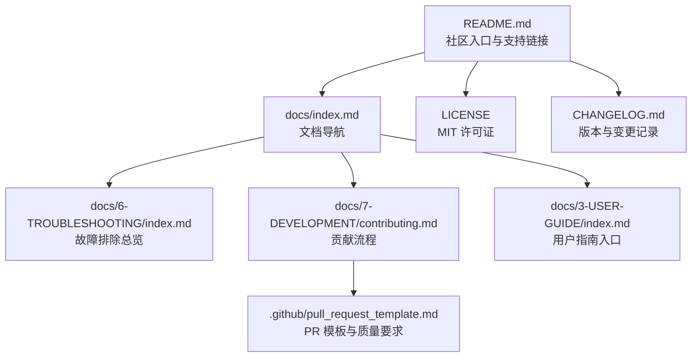
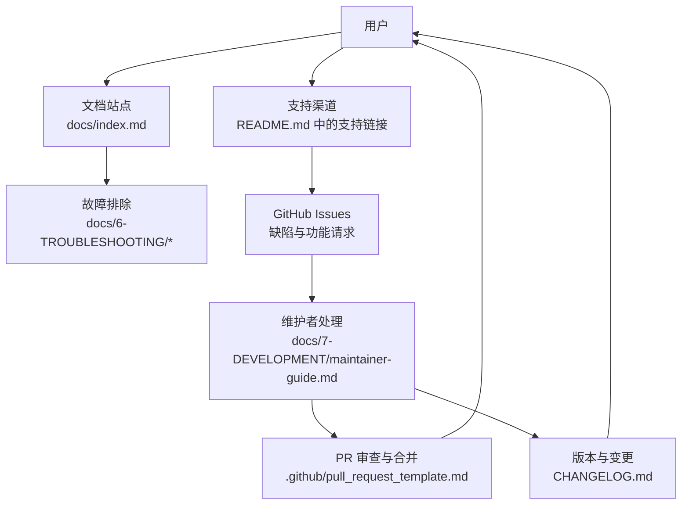
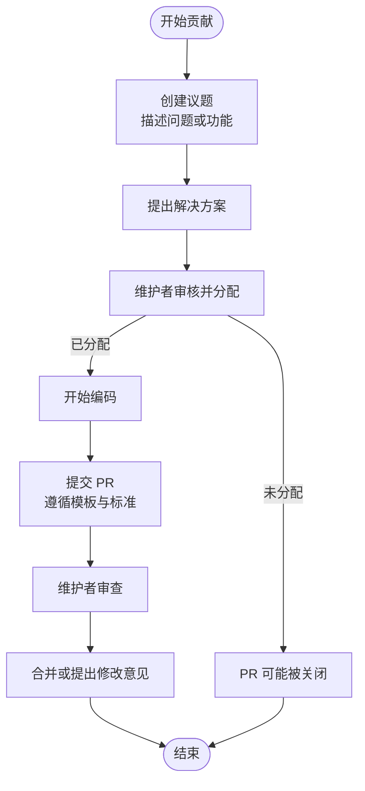
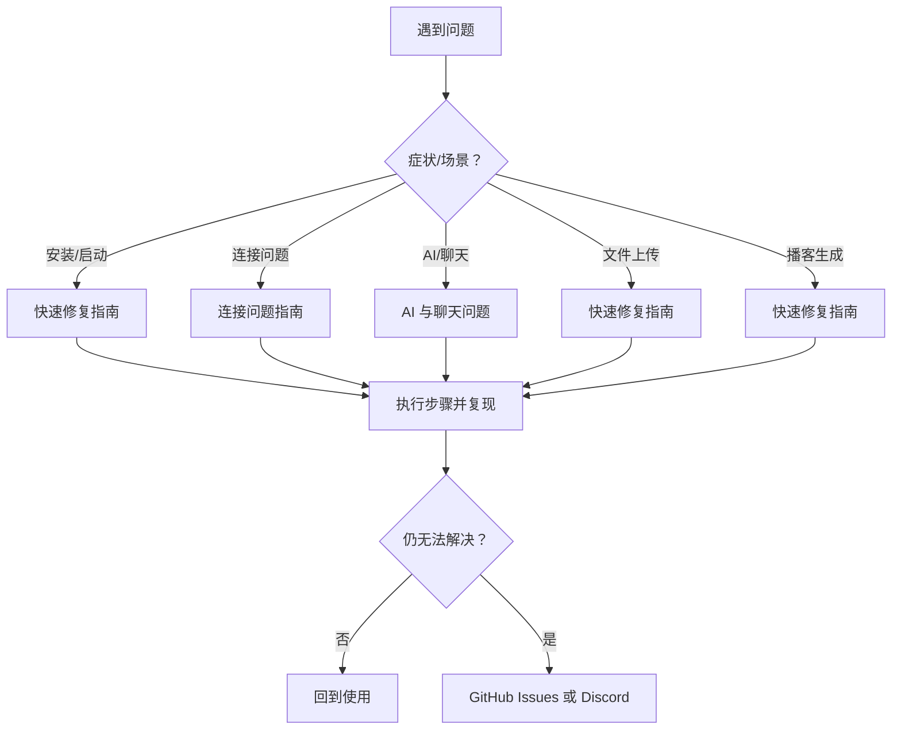
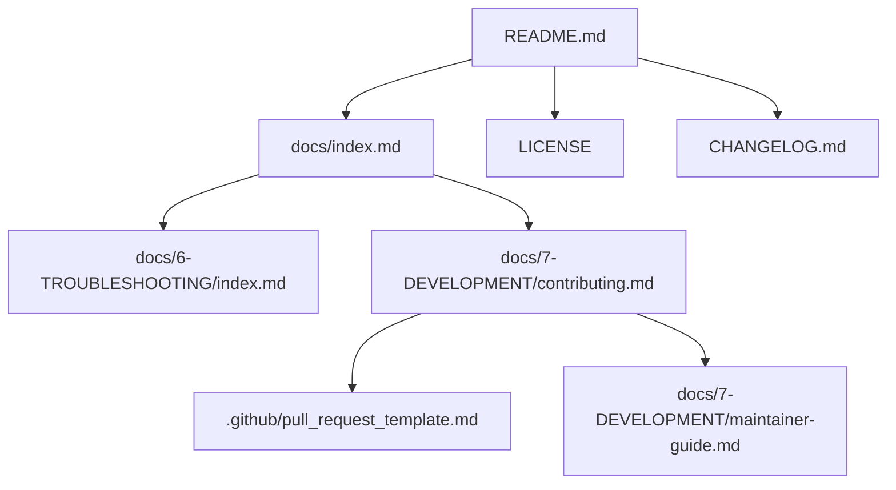

# 社区与支持

<cite>
**本文引用的文件**
- [README.md](file://README.md)
- [CONTRIBUTING.md](file://CONTRIBUTING.md)
- [MAINTAINER_GUIDE.md](file://MAINTAINER_GUIDE.md)
- [.github/pull_request_template.md](file://.github/pull_request_template.md)
- [docs/7-DEVELOPMENT/contributing.md](file://docs/7-DEVELOPMENT/contributing.md)
- [docs/7-DEVELOPMENT/maintainer-guide.md](file://docs/7-DEVELOPMENT/maintainer-guide.md)
- [docs/6-TROUBLESHOOTING/index.md](file://docs/6-TROUBLESHOOTING/index.md)
- [docs/6-TROUBLESHOOTING/faq.md](file://docs/6-TROUBLESHOOTING/faq.md)
- [docs/6-TROUBLESHOOTING/ai-chat-issues.md](file://docs/6-TROUBLESHOOTING/ai-chat-issues.md)
- [docs/6-TROUBLESHOOTING/connection-issues.md](file://docs/6-TROUBLESHOOTING/connection-issues.md)
- [docs/6-TROUBLESHOOTING/quick-fixes.md](file://docs/6-TROUBLESHOOTING/quick-fixes.md)
- [docs/index.md](file://docs/index.md)
- [docs/3-USER-GUIDE/index.md](file://docs/3-USER-GUIDE/index.md)
- [docs/0-START-HERE/index.md](file://docs/0-START-HERE/index.md)
- [LICENSE](file://LICENSE)
- [CHANGELOG.md](file://CHANGELOG.md)
</cite>

## 目录
1. [简介](#简介)
2. [项目结构](#项目结构)
3. [核心组件](#核心组件)
4. [架构总览](#架构总览)
5. [详细组件分析](#详细组件分析)
6. [依赖分析](#依赖分析)
7. [性能考虑](#性能考虑)
8. [故障排除指南](#故障排除指南)
9. [结论](#结论)
10. [附录](#附录)

## 简介
本章节面向社区与支持体系，系统梳理 Open Notebook 的社区建设、治理结构、贡献流程、问题报告与功能请求机制、开源许可与法律保障、维护团队与核心贡献者、社区活跃度指标，以及技术支持渠道与参与方式。目标是帮助用户建立对项目支持生态的完整认知，促进健康发展的社区与高效的技术支持。

## 项目结构
围绕社区与支持，项目在仓库中形成了“文档-模板-指南”的组织方式：
- 文档站点：docs/index.md 提供分层导航与快速入口，覆盖安装、使用、故障排除、开发等主题。
- 社区与支持：README.md 明确 Discord、GitHub Issues 等渠道；docs/6-TROUBLESHOOTING 提供系统化排障路径。
- 贡献与治理：CONTRIBUTING.md、MAINTAINER_GUIDE.md、.github/pull_request_template.md 与 docs/7-DEVELOPMENT 下的指南共同构成贡献与维护规范。
- 许可与合规：LICENSE 文件明确开源协议与免责声明。

图表来源
- [README.md](file://README.md#L180-L330)
- [docs/index.md](file://docs/index.md#L126-L290)
- [docs/6-TROUBLESHOOTING/index.md](file://docs/6-TROUBLESHOOTING/index.md#L1-L240)
- [docs/7-DEVELOPMENT/contributing.md](file://docs/7-DEVELOPMENT/contributing.md#L1-L200)
- [.github/pull_request_template.md](file://.github/pull_request_template.md#L1-L108)
- [LICENSE](file://LICENSE#L1-L17)
- [CHANGELOG.md](file://CHANGELOG.md#L1-L197)

章节来源
- [README.md](file://README.md#L180-L330)
- [docs/index.md](file://docs/index.md#L126-L290)

## 核心组件
- 社区与支持渠道
  - Discord 服务器：用于实时帮助、分享工作流与功能建议。
  - GitHub Issues：缺陷报告与功能请求。
  - 官方网站与文档：学习资源与使用指南。
- 贡献与治理
  - Issue-First 工作流：先建议题、获分配再编码，避免重复劳动。
  - 维护者指南：标签管理、PR 审查、沟通模板与常见场景处理。
  - PR 模板：测试验证、设计原则对齐、代码质量与文档更新要求。
- 故障排除与技术支持
  - 分类排障：按症状与组件定位问题。
  - 常见问题（FAQ）：使用、配置、成本、数据与最佳实践。
  - 快速修复清单：高频问题的一分钟解决方案。
- 开源许可与法律保障
  - MIT 许可证：允许使用、复制、修改、分发与再许可，需保留版权与许可声明。
- 版本与变更记录
  - CHANGELOG：记录重大变更、安全增强、修复与文档更新，便于用户评估升级影响。

章节来源
- [README.md](file://README.md#L180-L330)
- [docs/6-TROUBLESHOOTING/index.md](file://docs/6-TROUBLESHOOTING/index.md#L1-L240)
- [docs/6-TROUBLESHOOTING/faq.md](file://docs/6-TROUBLESHOOTING/faq.md#L1-L200)
- [docs/7-DEVELOPMENT/contributing.md](file://docs/7-DEVELOPMENT/contributing.md#L1-L200)
- [docs/7-DEVELOPMENT/maintainer-guide.md](file://docs/7-DEVELOPMENT/maintainer-guide.md#L1-L344)
- [.github/pull_request_template.md](file://.github/pull_request_template.md#L1-L108)
- [LICENSE](file://LICENSE#L1-L17)
- [CHANGELOG.md](file://CHANGELOG.md#L1-L197)

## 架构总览
社区与支持体系由“用户—文档—问题—维护者—贡献者”闭环构成，通过多渠道协同实现高效支持与持续演进。

图表来源
- [README.md](file://README.md#L180-L330)
- [docs/index.md](file://docs/index.md#L126-L290)
- [docs/6-TROUBLESHOOTING/index.md](file://docs/6-TROUBLESHOOTING/index.md#L1-L240)
- [docs/7-DEVELOPMENT/maintainer-guide.md](file://docs/7-DEVELOPMENT/maintainer-guide.md#L1-L344)
- [.github/pull_request_template.md](file://.github/pull_request_template.md#L1-L108)
- [CHANGELOG.md](file://CHANGELOG.md#L1-L197)

## 详细组件分析

### 社区建设与支持渠道
- Discord 服务器：用于实时帮助、分享工作流与功能建议。
- GitHub Issues：缺陷报告与功能请求，配合模板与标签管理。
- 官方网站与文档：提供多语言与多主题的使用与开发指南。
- 社区活跃度指标：README 展示星标、复刻、议题等徽章，体现社区热度。

章节来源
- [README.md](file://README.md#L180-L330)

### 治理结构与维护团队
- 维护者角色：负责议题初审、标签管理、PR 审查、沟通模板与常见场景处理。
- 标签体系：优先级、状态、类型与难度标签，确保任务可见性与可追踪性。
- 沟通模板：针对不同场景（接受、澄清、拒绝、停滞、信息缺失）提供标准化回复。

章节来源
- [docs/7-DEVELOPMENT/maintainer-guide.md](file://docs/7-DEVELOPMENT/maintainer-guide.md#L1-L344)

### 贡献流程与 Issue-First 工作流
- 流程要点：先建议题、提出方案、等待分配、再开始编码。
- 目的：避免重复劳动、确保方案契合架构与设计原则、节省时间与资源。
- 不符合流程的 PR 可能被关闭，尊重贡献者时间。

图表来源
- [docs/7-DEVELOPMENT/contributing.md](file://docs/7-DEVELOPMENT/contributing.md#L5-L21)
- [docs/7-DEVELOPMENT/contributing.md](file://docs/7-DEVELOPMENT/contributing.md#L47-L64)
- [.github/pull_request_template.md](file://.github/pull_request_template.md#L1-L108)

章节来源
- [docs/7-DEVELOPMENT/contributing.md](file://docs/7-DEVELOPMENT/contributing.md#L1-L200)
- [.github/pull_request_template.md](file://.github/pull_request_template.md#L1-L108)

### 问题报告与功能请求机制
- 缺陷报告：使用模板收集步骤、预期/实际行为、日志/截图、环境信息，并可勾选“希望自行修复”。
- 功能请求：使用模板说明价值、实现思路与是否自建。
- 初审与分配：维护者在 24-48 小时内完成初审与标签标注，必要时要求补充信息或讨论。

章节来源
- [docs/7-DEVELOPMENT/contributing.md](file://docs/7-DEVELOPMENT/contributing.md#L28-L46)
- [docs/7-DEVELOPMENT/maintainer-guide.md](file://docs/7-DEVELOPMENT/maintainer-guide.md#L12-L84)

### 技术支持与故障排除
- 症状导向：按症状快速定位到具体指南（如连接问题、AI/聊天问题、上传失败、播客生成失败等）。
- 诊断清单：检查服务运行、查看日志、端口暴露、健康检查、环境变量、重启与防火墙。
- 常见问题（FAQ）：覆盖使用、配置、成本、数据与最佳实践。
- 快速修复：高频问题的 1 分钟解决方案与命令示例。

图表来源
- [docs/6-TROUBLESHOOTING/index.md](file://docs/6-TROUBLESHOOTING/index.md#L23-L162)
- [docs/6-TROUBLESHOOTING/faq.md](file://docs/6-TROUBLESHOOTING/faq.md#L1-L200)
- [docs/6-TROUBLESHOOTING/quick-fixes.md](file://docs/6-TROUBLESHOOTING/quick-fixes.md)

章节来源
- [docs/6-TROUBLESHOOTING/index.md](file://docs/6-TROUBLESHOOTING/index.md#L1-L240)
- [docs/6-TROUBLESHOOTING/faq.md](file://docs/6-TROUBLESHOOTING/faq.md#L1-L200)

### 开源协议与法律保障
- 许可证：MIT 许可证，允许商业与非商业使用、复制、修改、分发与再许可，需在软件副本包含版权与许可声明。
- 法律保障：软件按“现状”提供，不提供任何明示或暗示担保；作者与版权持有人不对因使用而产生的任何索赔或损害承担责任。

章节来源
- [LICENSE](file://LICENSE#L1-L17)

### 维护团队、核心贡献者与社区活跃度
- 维护团队：通过维护者指南定义职责边界与协作流程。
- 核心贡献者：通过 PR 合并与贡献统计识别活跃贡献者。
- 社区活跃度：README 展示星标、复刻、议题等徽章；CHANGELOG 记录迭代频率与重大变更。

章节来源
- [docs/7-DEVELOPMENT/maintainer-guide.md](file://docs/7-DEVELOPMENT/maintainer-guide.md#L1-L344)
- [README.md](file://README.md#L1-L100)
- [CHANGELOG.md](file://CHANGELOG.md#L1-L197)

### 获取技术支持的多种途径
- 官方文档：docs/index.md 提供按问题类型与主题的导航。
- 用户指南：docs/3-USER-GUIDE/index.md 与 docs/0-START-HERE/index.md 提供入门与使用指导。
- 故障排除：docs/6-TROUBLESHOOTING/index.md 与各专题指南。
- 社区论坛：Discord 服务器（最快响应）。
- 问题跟踪：GitHub Issues（缺陷与功能请求）。

章节来源
- [docs/index.md](file://docs/index.md#L126-L290)
- [docs/3-USER-GUIDE/index.md](file://docs/3-USER-GUIDE/index.md#L198-L209)
- [docs/0-START-HERE/index.md](file://docs/0-START-HERE/index.md#L54-L64)
- [docs/6-TROUBLESHOOTING/index.md](file://docs/6-TROUBLESHOOTING/index.md#L142-L240)
- [README.md](file://README.md#L180-L330)

### 如何参与项目贡献
- 代码贡献：遵循 Issue-First 工作流，使用 PR 模板，满足测试、文档与设计原则要求。
- 文档改进：更新相关文档，保持一致性与准确性。
- 测试反馈：提供测试证据、截图或日志，确保变更可验证。
- 非技术贡献：翻译、UX 建议、用例反馈与社区推广。

章节来源
- [docs/7-DEVELOPMENT/contributing.md](file://docs/7-DEVELOPMENT/contributing.md#L26-L80)
- [.github/pull_request_template.md](file://.github/pull_request_template.md#L23-L104)

## 依赖分析
社区与支持体系的关键依赖关系如下：
- README.md 作为入口，串联社区渠道与文档导航。
- docs/index.md 提供多路径导航，降低学习门槛。
- docs/6-TROUBLESHOOTING/index.md 作为问题解决中枢，向下关联各专题指南。
- docs/7-DEVELOPMENT/contributing.md 与 .github/pull_request_template.md 形成贡献与 PR 质量控制闭环。
- docs/7-DEVELOPMENT/maintainer-guide.md 为维护者提供标准化操作手册。
- LICENSE 与 CHANGELOG 提供法律与版本依据。

图表来源
- [README.md](file://README.md#L180-L330)
- [docs/index.md](file://docs/index.md#L126-L290)
- [docs/6-TROUBLESHOOTING/index.md](file://docs/6-TROUBLESHOOTING/index.md#L1-L240)
- [docs/7-DEVELOPMENT/contributing.md](file://docs/7-DEVELOPMENT/contributing.md#L1-L200)
- [.github/pull_request_template.md](file://.github/pull_request_template.md#L1-L108)
- [docs/7-DEVELOPMENT/maintainer-guide.md](file://docs/7-DEVELOPMENT/maintainer-guide.md#L1-L344)
- [LICENSE](file://LICENSE#L1-L17)
- [CHANGELOG.md](file://CHANGELOG.md#L1-L197)

章节来源
- [README.md](file://README.md#L180-L330)
- [docs/index.md](file://docs/index.md#L126-L290)

## 性能考虑
- 支持响应效率：Issue-First 工作流减少无效劳动，维护者模板提升沟通效率。
- 文档检索效率：按症状与主题的导航与索引，缩短定位时间。
- 社区协作效率：标签与状态管理使任务可视化，降低协调成本。

## 故障排除指南
- 快速定位：根据症状选择对应指南（连接、AI/聊天、上传、播客）。
- 自助排查：执行诊断清单中的检查项，收集日志与环境信息。
- 进一步求助：在 GitHub Issues 或 Discord 提交问题，附带必要信息与已尝试步骤。

章节来源
- [docs/6-TROUBLESHOOTING/index.md](file://docs/6-TROUBLESHOOTING/index.md#L128-L240)
- [docs/6-TROUBLESHOOTING/faq.md](file://docs/6-TROUBLESHOOTING/faq.md#L1-L200)

## 结论
Open Notebook 的社区与支持体系以文档导航、症状导向排障、Issue-First 贡献流程与维护者标准化管理为核心，辅以 MIT 许可证与版本记录，形成高效、透明且可持续的生态闭环。用户可通过多渠道获得支持，贡献者可在清晰流程下参与共建，共同推动项目健康发展。

## 附录
- 贡献入口：参阅贡献指南与维护者指南。
- 支持入口：参阅文档导航与 README 中的支持链接。
- 许可与合规：参阅 LICENSE 文件。
- 版本与变更：参阅 CHANGELOG.md。

章节来源
- [docs/7-DEVELOPMENT/contributing.md](file://docs/7-DEVELOPMENT/contributing.md#L1-L200)
- [docs/7-DEVELOPMENT/maintainer-guide.md](file://docs/7-DEVELOPMENT/maintainer-guide.md#L1-L344)
- [docs/index.md](file://docs/index.md#L126-L290)
- [README.md](file://README.md#L180-L330)
- [LICENSE](file://LICENSE#L1-L17)
- [CHANGELOG.md](file://CHANGELOG.md#L1-L197)