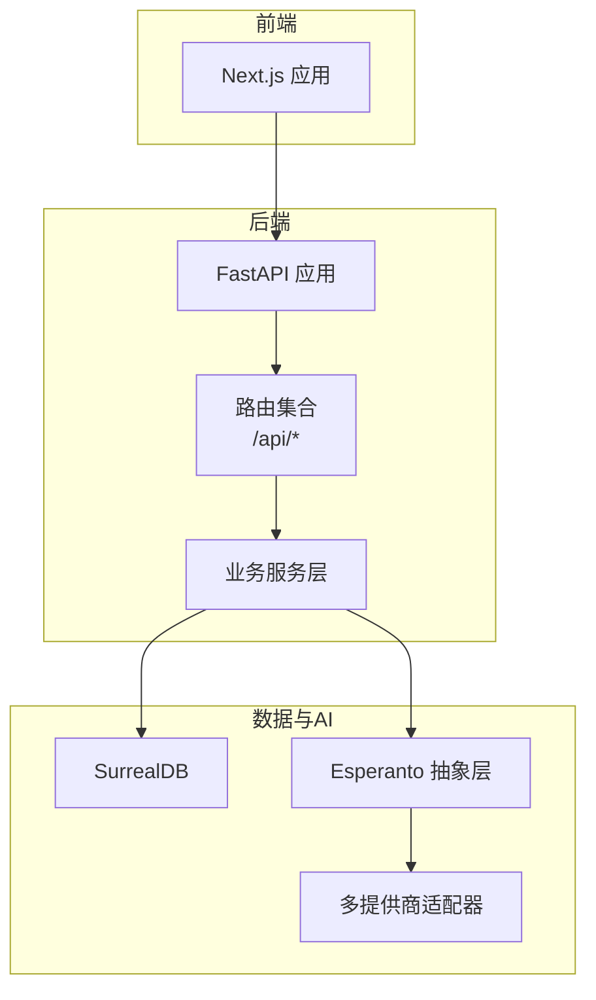
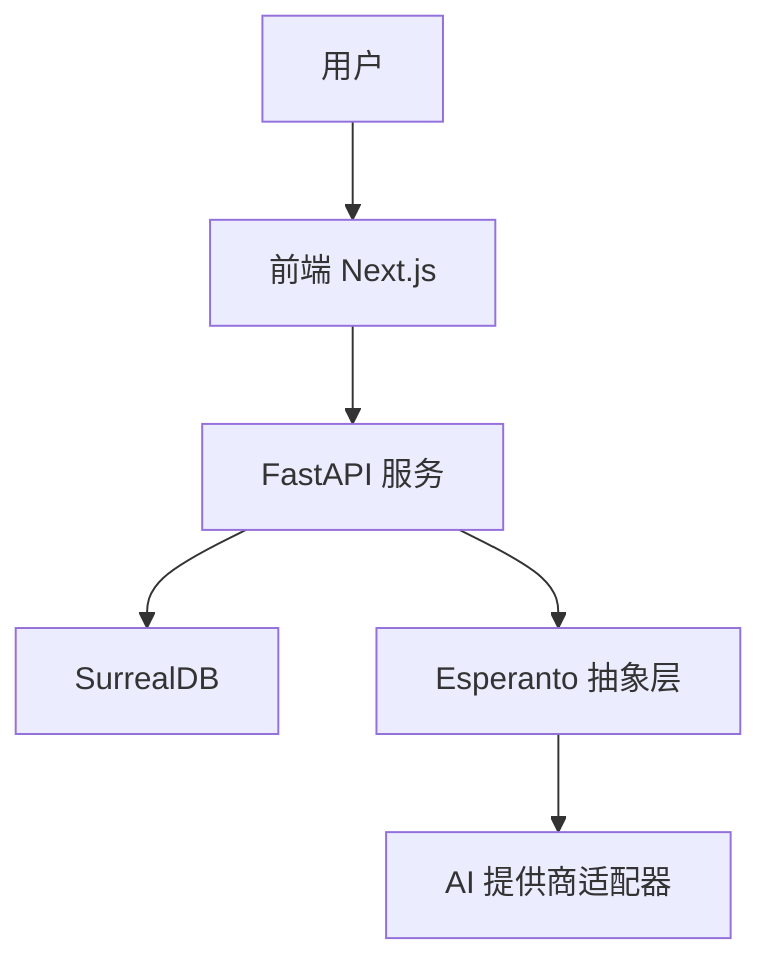
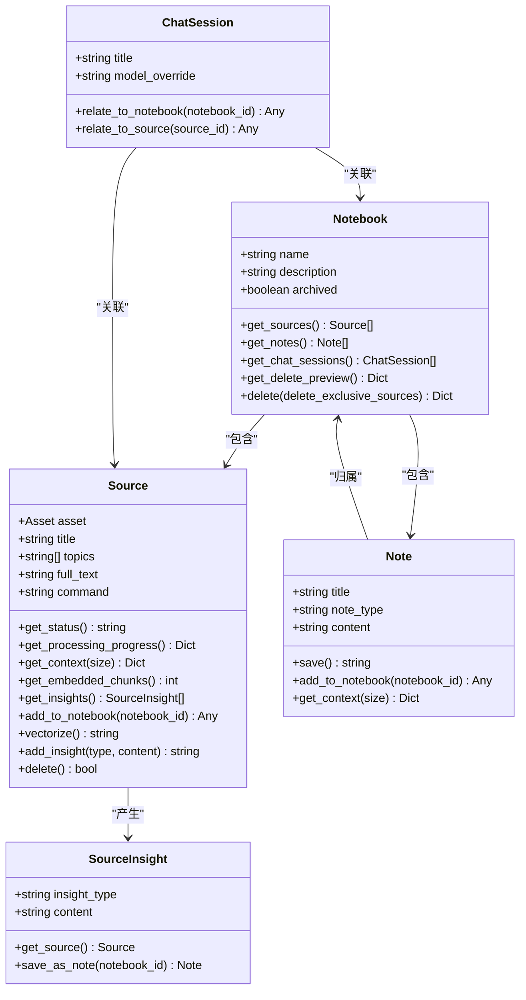
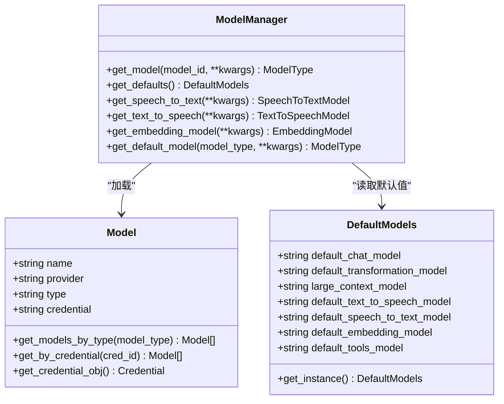
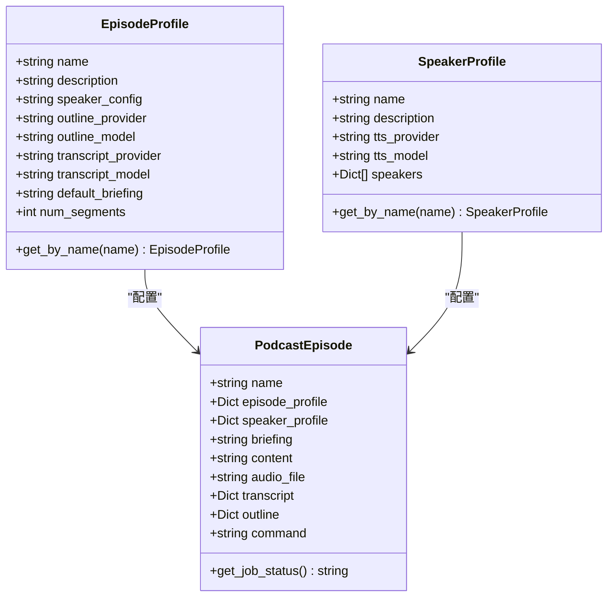
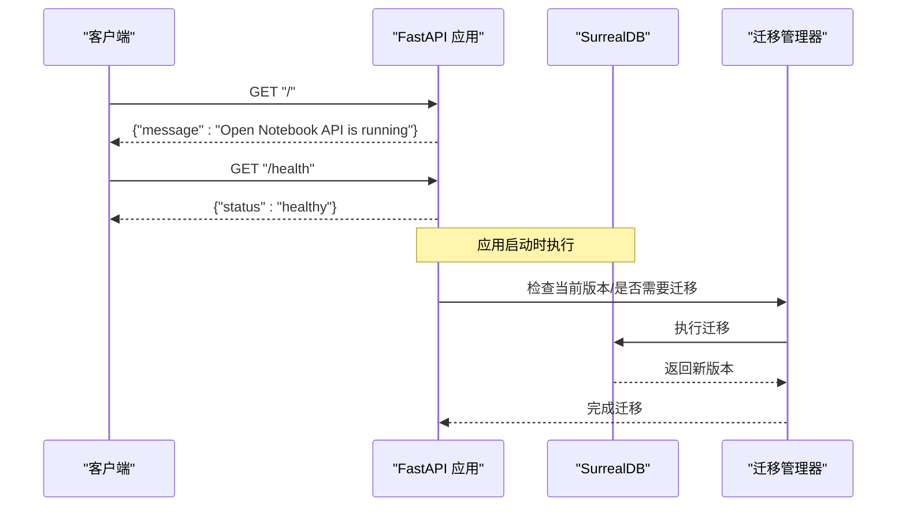
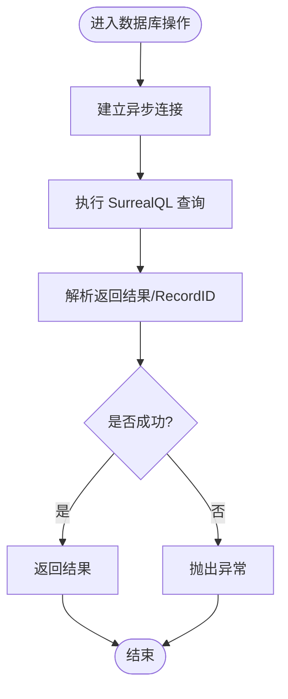
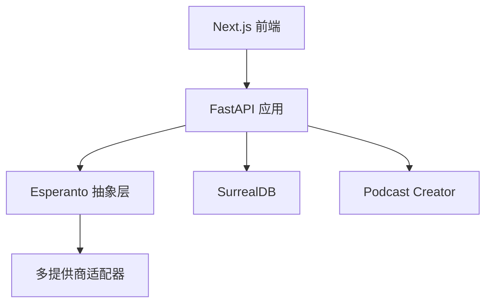

# 项目介绍

<cite>
**本文引用的文件**
- [README.md](file://README.md)
- [docs/index.md](file://docs/index.md)
- [docs/0-START-HERE/index.md](file://docs/0-START-HERE/index.md)
- [docs/2-CORE-CONCEPTS/index.md](file://docs/2-CORE-CONCEPTS/index.md)
- [docs/2-CORE-CONCEPTS/notebooks-sources-notes.md](file://docs/2-CORE-CONCEPTS/notebooks-sources-notes.md)
- [docs/3-USER-GUIDE/index.md](file://docs/3-USER-GUIDE/index.md)
- [api/main.py](file://api/main.py)
- [open_notebook/domain/notebook.py](file://open_notebook/domain/notebook.py)
- [open_notebook/podcasts/models.py](file://open_notebook/podcasts/models.py)
- [open_notebook/ai/models.py](file://open_notebook/ai/models.py)
- [open_notebook/database/repository.py](file://open_notebook/database/repository.py)
- [frontend/src/app/layout.tsx](file://frontend/src/app/layout.tsx)
- [pyproject.toml](file://pyproject.toml)
- [CHANGELOG.md](file://CHANGELOG.md)
</cite>

## 目录
1. [引言](#引言)
2. [项目结构](#项目结构)
3. [核心组件](#核心组件)
4. [架构总览](#架构总览)
5. [详细组件分析](#详细组件分析)
6. [依赖关系分析](#依赖关系分析)
7. [性能考量](#性能考量)
8. [故障排查指南](#故障排查指南)
9. [结论](#结论)
10. [附录](#附录)

## 引言
Open Notebook 是一个开源、隐私优先的 AI 研究助手，旨在成为 Google Notebook LM 的开源替代方案。项目以“数据主权、可移植性与完全自托管”为核心理念，帮助用户在本地或私有云环境中掌控自己的研究数据与 AI 能力，同时提供多模态内容组织、智能检索、上下文感知对话、内容转换与专业播客生成等能力。

- 核心价值主张
  - 隐私优先：数据完全自托管，不依赖云端；支持密码保护与加密存储。
  - 模型自由：支持 16+ AI 提供商（OpenAI、Anthropic、Groq、Google、Ollama、Azure 等），按需切换与成本优化。
  - 多模态研究：统一管理 PDF、视频、音频、网页、Office 文档等来源。
  - 专业播客：支持 1–4 位说话人、个性化角色配置与高质量 TTS/STT。
  - 智能检索：全文与向量双引擎搜索，支持语义相似度匹配。
  - 可编程化：提供完整的 REST API，便于自动化与二次集成。
  - 开源可扩展：开放源码、可定制、可扩展，避免厂商锁定。

- 目标用户
  - 研究员、分析师、学生与知识工作者，需要对研究资料进行系统化整理与跨模态消费。
  - 希望在本地或私有环境运行 AI 的团队与个人。
  - 追求隐私与数据主权的企业与机构。

- 解决的核心问题
  - 数据外泄与被锁定：通过自托管与开源架构，确保数据与模型选择权掌握在自己手中。
  - 成本压力：多提供商支持与本地推理选项，降低长期使用成本。
  - 使用体验碎片化：统一的笔记本-来源-笔记三层结构，配合智能检索与播客输出，形成完整研究闭环。

- 差异化对比（与 Notebook LM）
  - 隐私与控制：Open Notebook 支持自托管与本地部署，数据不出域；Notebook LM 仅限云端。
  - AI 提供商选择：Open Notebook 支持 16+ 提供商，Notebook LM 仅使用其自有模型。
  - 播客灵活性：Open Notebook 支持 1–4 位说话人与自定义角色，Notebook LM 限制为 2 人。
  - 内容转换：Open Notebook 提供强大的可定制内容转换模板，Notebook LM 选项有限。
  - API 与自动化：Open Notebook 提供完整 REST API，支持程序化接入；Notebook LM 无公开 API。
  - 部署方式：Open Notebook 可 Docker、云或本地部署；Notebook LM 仅云端托管。

**章节来源**
- file://README.md#L21-L91
- file://docs/0-START-HERE/index.md#L37-L46

## 项目结构
Open Notebook 采用前后端分离与模块化服务的组织方式：
- 后端 API：基于 FastAPI，提供 REST 接口与数据库迁移、认证中间件、异常处理与路由聚合。
- 域模型与服务：Python 层封装领域对象（笔记本、来源、笔记、播客配置、AI 模型与默认配置）与数据库访问。
- 前端：Next.js 应用，提供多语言界面、主题切换、国际化与错误边界等基础能力。
- 数据库：SurrealDB（SurrealQL 查询语言），负责实体存储、关系建模与查询执行。
- AI 与语音：通过 Esperanto 统一抽象不同提供商的 LLM、嵌入、STT/TTS，并支持凭据化配置与安全存储。

**图示来源**
- [api/main.py](file://api/main.py#L99-L190)
- [open_notebook/database/repository.py](file://open_notebook/database/repository.py#L47-L83)
- [open_notebook/ai/models.py](file://open_notebook/ai/models.py#L97-L267)
- [pyproject.toml](file://pyproject.toml#L15-L42)

**章节来源**
- file://api/main.py#L14-L36
- file://open_notebook/database/repository.py#L12-L27
- file://open_notebook/ai/models.py#L1-L15
- file://pyproject.toml#L1-L42

## 核心组件
- 笔记本-来源-笔记三层容器模型
  - 笔记本：研究项目的隔离容器，承载来源与笔记，提供上下文边界。
  - 来源：原始输入材料（PDF、网页、音视频、文本等），经抽取、分块、嵌入后索引。
  - 笔记：处理结果（手动撰写或 AI 生成），支持引用与可搜索。
- AI 模型与默认配置
  - 统一模型注册与凭据化管理，支持按类型获取默认模型（聊天、转换、嵌入、TTS/STT 等）。
- 播客系统
  - 支持 1–4 位说话人角色配置与剧集模板，提供大纲与脚本生成、作业跟踪与音频导出。
- 数据库与查询
  - 通过 SurrealDB 的异步连接与 SurrealQL 查询封装，提供创建、更新、删除、关联与 Upsert 等操作。
- 前端布局与国际化
  - 提供主题、语言切换、错误边界与连接守卫等基础设施，支撑多语言 UI。

**章节来源**
- file://docs/2-CORE-CONCEPTS/notebooks-sources-notes.md#L1-L285
- file://open_notebook/domain/notebook.py#L16-L231
- file://open_notebook/podcasts/models.py#L10-L148
- file://open_notebook/ai/models.py#L18-L267
- file://open_notebook/database/repository.py#L65-L195
- file://frontend/src/app/layout.tsx#L1-L46

## 架构总览
Open Notebook 的整体架构围绕“数据自托管 + 多提供商 + 可编程化”的目标展开：
- 用户通过前端上传来源、创建笔记、发起对话、生成播客。
- 后端 API 负责路由、鉴权、异常处理与数据库迁移。
- 业务服务层协调领域模型与数据库交互，触发嵌入、转换与播客生成等后台作业。
- AI 抽象层屏蔽提供商差异，统一模型加载与默认配置。
- 数据持久化采用 SurrealDB，支持复杂关系与查询优化。

**图示来源**
- [api/main.py](file://api/main.py#L99-L190)
- [open_notebook/database/repository.py](file://open_notebook/database/repository.py#L47-L83)
- [open_notebook/ai/models.py](file://open_notebook/ai/models.py#L97-L267)

## 详细组件分析

### 笔记本-来源-笔记模型
该模型是系统的核心心智模型，强调“隔离容器 + 不可变证据 + 可演化的洞察”。

**图示来源**
- [open_notebook/domain/notebook.py](file://open_notebook/domain/notebook.py#L16-L231)
- [open_notebook/domain/notebook.py](file://open_notebook/domain/notebook.py#L288-L553)
- [open_notebook/domain/notebook.py](file://open_notebook/domain/notebook.py#L555-L610)
- [open_notebook/domain/notebook.py](file://open_notebook/domain/notebook.py#L611-L679)

**章节来源**
- file://docs/2-CORE-CONCEPTS/notebooks-sources-notes.md#L1-L285
- file://open_notebook/domain/notebook.py#L16-L231

### AI 模型与默认配置管理
通过 Esperanto 抽象层，系统支持多提供商统一接入，并以凭据化方式安全存储密钥，按类型获取默认模型。

**图示来源**
- [open_notebook/ai/models.py](file://open_notebook/ai/models.py#L18-L95)
- [open_notebook/ai/models.py](file://open_notebook/ai/models.py#L97-L267)

**章节来源**
- file://open_notebook/ai/models.py#L18-L267

### 播客系统与角色配置
播客系统通过“剧集模板 + 说话人角色”实现灵活的音频内容生成，支持作业跟踪与结果导出。

**图示来源**
- [open_notebook/podcasts/models.py](file://open_notebook/podcasts/models.py#L10-L88)
- [open_notebook/podcasts/models.py](file://open_notebook/podcasts/models.py#L90-L148)

**章节来源**
- file://open_notebook/podcasts/models.py#L10-L148

### API 初始化与数据库迁移
后端 API 在启动时自动执行数据库迁移并进行安全检查（如加密密钥与凭据），同时挂载认证中间件与 CORS 中间件，确保跨域与安全策略一致。

**图示来源**
- [api/main.py](file://api/main.py#L47-L97)
- [api/main.py](file://api/main.py#L182-L190)

**章节来源**
- file://api/main.py#L47-L97
- file://api/main.py#L182-L190

### 数据库访问与查询封装
数据库访问通过异步连接与查询封装，提供创建、更新、删除、Upsert、关联与批量插入等能力，并对记录 ID 进行统一解析与转换。

**图示来源**
- [open_notebook/database/repository.py](file://open_notebook/database/repository.py#L47-L83)
- [open_notebook/database/repository.py](file://open_notebook/database/repository.py#L65-L195)

**章节来源**
- file://open_notebook/database/repository.py#L47-L83
- file://open_notebook/database/repository.py#L65-L195

### 前端布局与国际化
前端应用通过根布局注入主题脚本、错误边界、连接守卫与查询提供者，支持多语言与主题切换，保障用户体验与可维护性。

**章节来源**
- file://frontend/src/app/layout.tsx#L1-L46

## 依赖关系分析
- 技术栈与依赖
  - 后端：FastAPI、Esperanto、LangChain 生态、SurrealDB、Podcast Creator 等。
  - 前端：Next.js、React、Tailwind CSS、i18n 组件等。
  - 文档与示例：Docker Compose 示例、多提供商配置与本地部署路径。
- 关键外部集成点
  - AI 提供商：OpenAI、Anthropic、Groq、Google、Ollama、Azure、Vertex AI 等。
  - 语音服务：ElevenLabs、OpenAI-Compatible 等 TTS/STT 提供商。
  - 数据库：SurrealDB 提供统一的结构化存储与查询能力。

**图示来源**
- [pyproject.toml](file://pyproject.toml#L15-L42)
- [api/main.py](file://api/main.py#L99-L190)

**章节来源**
- file://pyproject.toml#L1-L42
- file://api/main.py#L99-L190

## 性能考量
- 搜索性能
  - 通过数据库索引与 SurrealQL 函数加速文本与向量检索，减少全表扫描。
  - 对长查询进行统一嵌入生成与分块处理，提升召回质量与响应速度。
- 并发与一致性
  - 数据库事务冲突采用调试级别日志记录，避免噪声；必要时重试。
  - 作业式处理（嵌入、转换、播客生成）避免阻塞主线程，提高吞吐。
- 前端体验
  - Next.js 16+ 与 React 19+ 带来更好的性能与兼容性；大文件上传与健康检查优化改善首次体验。

**章节来源**
- file://CHANGELOG.md#L121-L127
- file://CHANGELOG.md#L178-L197
- file://open_notebook/database/repository.py#L76-L82

## 故障排查指南
- 安装与部署
  - 使用官方 Docker Compose 快速启动，或参考本地 Ollama、Speaches 等示例配置。
  - 若出现“无法连接 API 服务器”，前端会等待健康检查；检查端口映射与网络代理。
- 认证与安全
  - 设置强加密密钥与默认密码；启用密码保护后，未登录用户无法访问。
  - 使用 URL 校验防止 SSRF，避免访问内网地址（Ollama 例外）。
- AI 与模型
  - 未配置模型时会提示前往设置页面；检查凭据是否正确、模型发现与注册流程是否完成。
  - 不同提供商的超时与上下文窗口存在差异，建议根据实际模型调整参数。
- 播客与语音
  - 检查 TTS/STT 提供商可用性与模型名称；确认角色配置与段落数范围合法。
- 数据库与迁移
  - 启动时自动执行迁移；若失败，查看日志并修复版本不一致问题。

**章节来源**
- file://README.md#L97-L177
- file://CHANGELOG.md#L24-L61
- file://CHANGELOG.md#L74-L91
- file://CHANGELOG.md#L154-L177

## 结论
Open Notebook 以“隐私优先、开源可扩展、多提供商支持、可编程化”的理念，构建了从研究资料到知识产出的完整闭环。通过笔记本-来源-笔记的容器模型、智能检索与播客生成能力，以及完善的凭据化与安全机制，它为研究人员、知识工作者与企业提供了可控、可扩展且高性价比的研究工具。未来将持续增强实时更新、异步处理与跨笔记本资源共享等能力，进一步提升协作与效率。

## 附录
- 快速开始路径
  - 云端提供商（OpenAI/Anthropic/Google 等）：5 分钟快速上手。
  - 本地推理（Ollama/LM Studio）：完全私有、零 API 成本。
  - Docker 单实例：共享主机部署。
- 文档导航
  - 入门与安装：0-START-HERE 与 1-INSTALLATION。
  - 核心概念：2-CORE-CONCEPTS（笔记本/来源/笔记、RAG、播客）。
  - 用户指南：3-USER-GUIDE（添加来源、笔记、播客、搜索、变换、引用）。
  - 配置与提供商：5-CONFIGURATION 与 4-AI-PROVIDERS。
  - 开发与贡献：7-DEVELOPMENT（架构、API 参考、测试）。

**章节来源**
- file://docs/index.md#L1-L290
- file://docs/0-START-HERE/index.md#L1-L64
- file://docs/2-CORE-CONCEPTS/index.md#L1-L71
- file://docs/3-USER-GUIDE/index.md#L1-L209