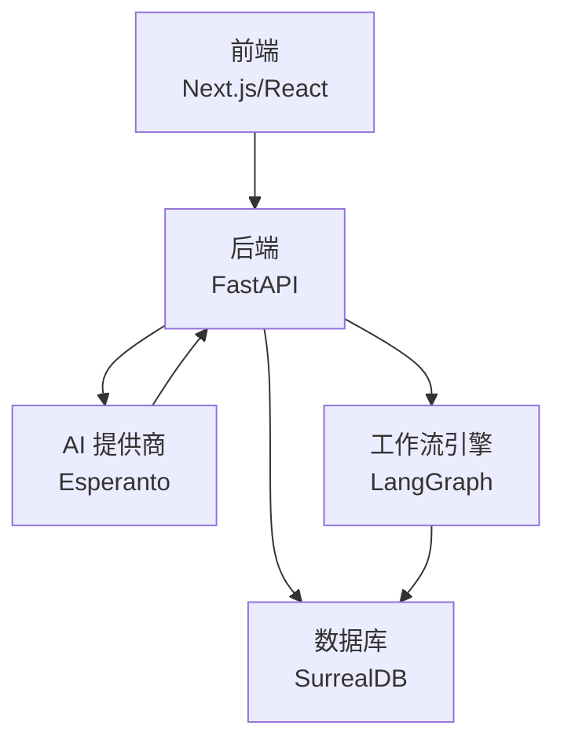
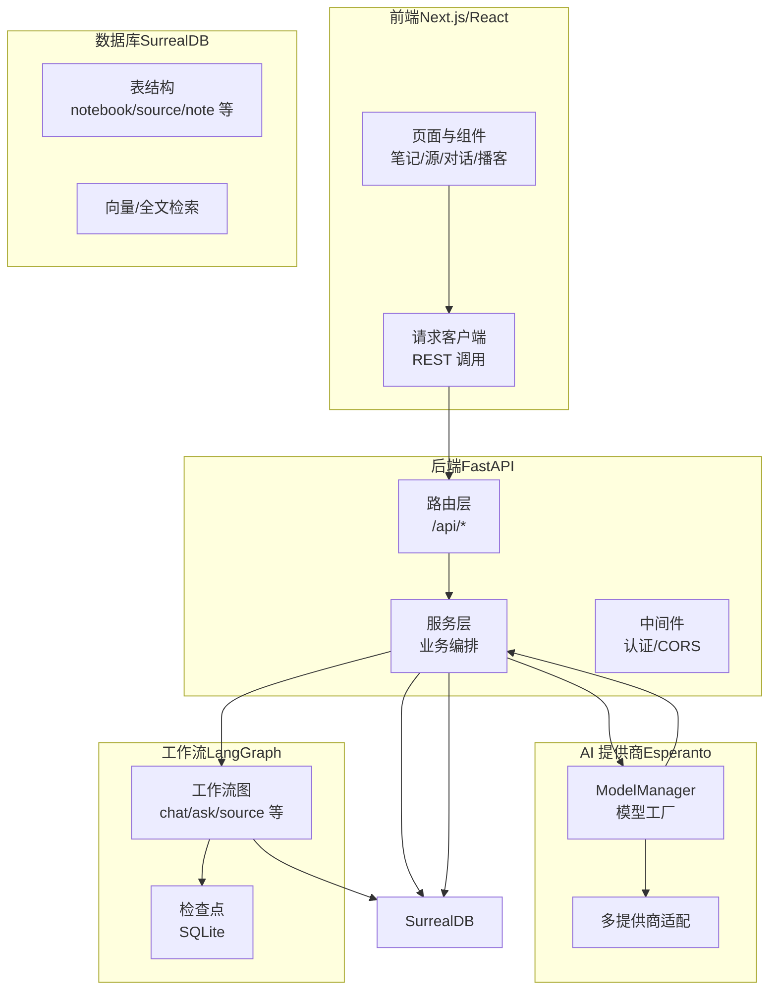
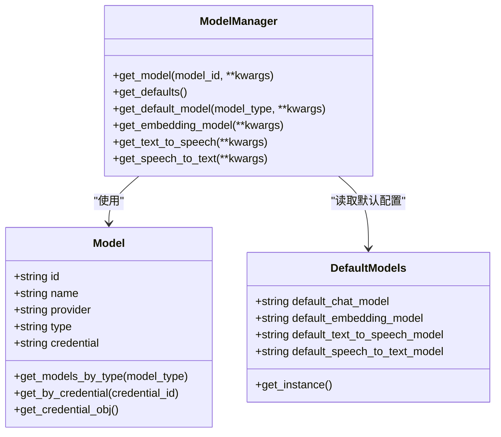
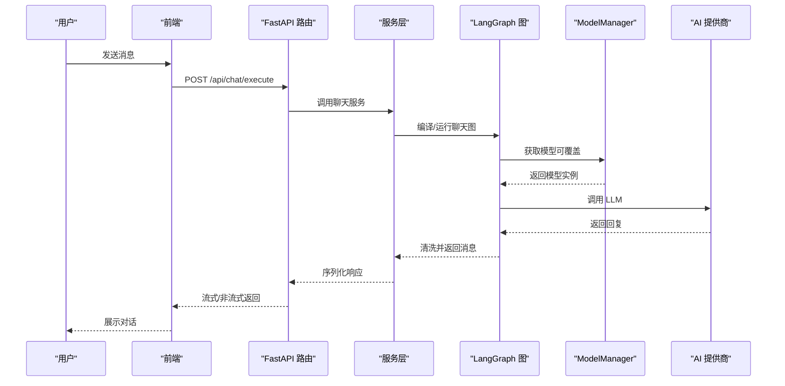
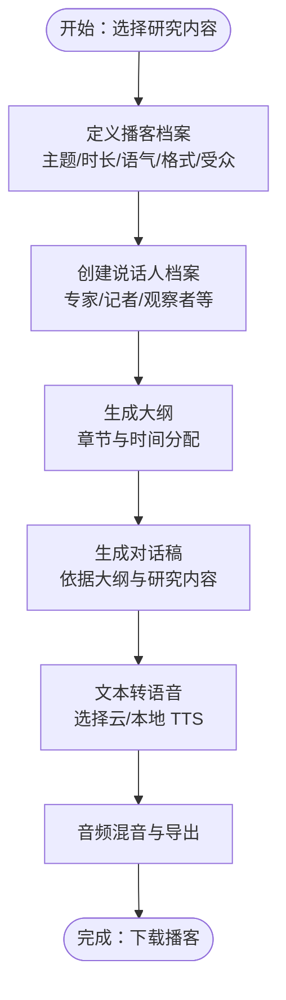
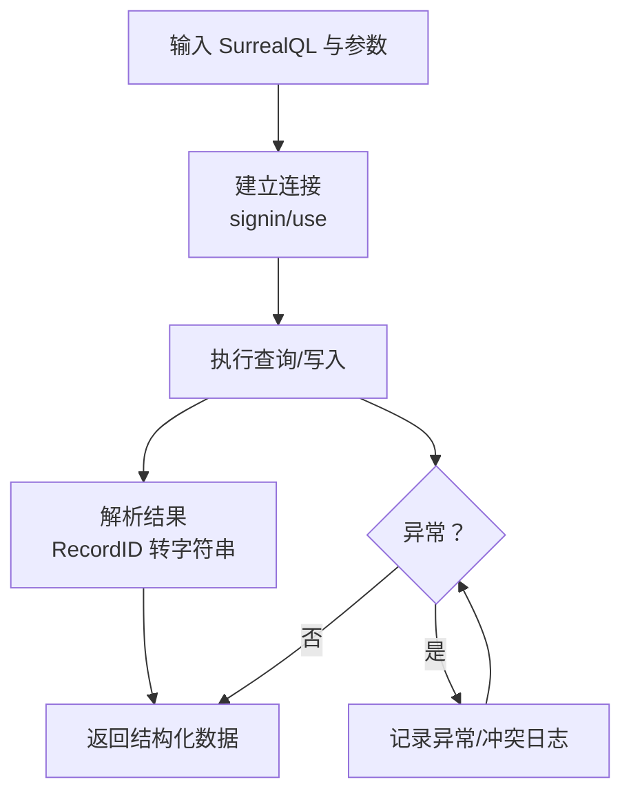
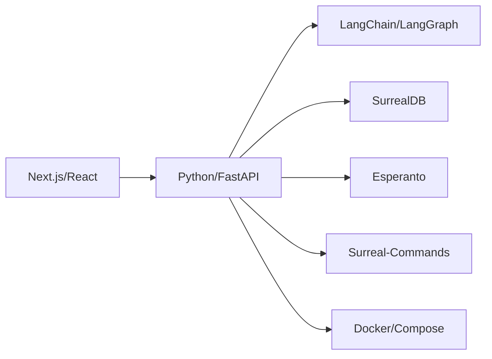

# 项目概述

<cite>
**本文引用的文件**
- [README.md](file://README.md)
- [README.dev.md](file://README.dev.md)
- [pyproject.toml](file://pyproject.toml)
- [frontend/package.json](file://frontend/package.json)
- [CHANGELOG.md](file://CHANGELOG.md)
- [api/main.py](file://api/main.py)
- [open_notebook/config.py](file://open_notebook/config.py)
- [open_notebook/database/repository.py](file://open_notebook/database/repository.py)
- [open_notebook/domain/notebook.py](file://open_notebook/domain/notebook.py)
- [open_notebook/ai/models.py](file://open_notebook/ai/models.py)
- [open_notebook/graphs/chat.py](file://open_notebook/graphs/chat.py)
- [docs/7-DEVELOPMENT/architecture.md](file://docs/7-DEVELOPMENT/architecture.md)
- [docs/2-CORE-CONCEPTS/podcasts-explained.md](file://docs/2-CORE-CONCEPTS/podcasts-explained.md)
</cite>

## 目录
1. [引言](#引言)
2. [项目结构](#项目结构)
3. [核心组件](#核心组件)
4. [架构总览](#架构总览)
5. [详细组件分析](#详细组件分析)
6. [依赖关系分析](#依赖关系分析)
7. [性能考量](#性能考量)
8. [故障排查指南](#故障排查指南)
9. [结论](#结论)
10. [附录](#附录)

## 引言
Open Notebook 是一个开源、注重隐私的研究与知识管理平台，旨在成为 Google Notebook LM 的开源替代方案。其核心价值主张包括：
- 隐私优先：数据自托管，不依赖云端，保障敏感研究的主权与安全
- 多模型支持：统一接入 16+ AI 提供商（OpenAI、Anthropic、Groq、Google、Ollama、Azure OpenAI、Mistral、ElevenLabs 等），灵活切换与成本优化
- 内容组织：支持多模态内容（PDF、视频、音频、网页、Office 文档等）的统一管理
- 智能搜索：全文与向量混合检索，结合语义相似度，提升知识发现效率
- 上下文对话：基于研究材料的 AI 对话，支持多轮会话与细粒度上下文控制
- 专业播客：多说话人、可定制角色与音色的播客生成，支持本地/云 TTS
- 可编程化：完整的 REST API，便于自动化与二次开发
- 多语言界面：支持中、英、日、俄、葡、德、西、韩等多种语言

与 Google Notebook LM 的对比中，Open Notebook 在隐私控制、AI 提供商选择、播客灵活性、内容转换能力、API 可用性、部署自由度等方面具备显著优势。

**章节来源**
- [README.md](file://README.md#L53-L96)
- [README.md](file://README.md#L72-L92)

## 项目结构
Open Notebook 采用三层架构（前端/后端/数据库），并围绕 LangGraph 工作流与 Esperanto 多提供商抽象构建核心能力。项目主要模块如下：
- 前端（Next.js/React）：现代化用户界面，负责笔记、源文件、对话、播客等交互
- 后端（FastAPI）：REST API 层，承载业务逻辑、工作流编排与数据库访问
- 数据库（SurrealDB）：多模型数据库，原生支持图关系、向量嵌入与全文检索
- 核心库（open_notebook）：领域模型、AI 提供商集成、LangGraph 工作流、数据库仓库层

**图表来源**
- [docs/7-DEVELOPMENT/architecture.md](file://docs/7-DEVELOPMENT/architecture.md#L40-L30)

**章节来源**
- [docs/7-DEVELOPMENT/architecture.md](file://docs/7-DEVELOPMENT/architecture.md#L3-L31)
- [README.dev.md](file://README.dev.md#L355-L370)

## 核心组件
- 领域模型与仓储：Notebook、Source、Note、ChatSession 等，封装业务规则与数据库操作；通过 SurrealDB 实现关系建模与查询
- AI 提供商集成：ModelManager 统一管理语言模型、嵌入模型、语音识别与合成模型，支持凭据化配置与按需覆盖
- LangGraph 工作流：源处理、聊天、问答、内容转换、提示词执行等，实现复杂多步骤的智能流程
- 数据库访问：Repository 抽象出查询、插入、更新、删除与关系建立，统一记录 ID 规范与事务处理
- 配置与持久化：LangGraph 检查点存储于 SQLite 文件，确保会话状态可恢复

**章节来源**
- [open_notebook/domain/notebook.py](file://open_notebook/domain/notebook.py#L16-L679)
- [open_notebook/ai/models.py](file://open_notebook/ai/models.py#L97-L267)
- [open_notebook/database/repository.py](file://open_notebook/database/repository.py#L65-L195)
- [open_notebook/config.py](file://open_notebook/config.py#L1-L18)
- [open_notebook/graphs/chat.py](file://open_notebook/graphs/chat.py#L19-L94)

## 架构总览
Open Notebook 的整体架构强调“隐私优先、异步优先、多提供商、工作流驱动”。三层架构与关键组件交互如下：

**图表来源**
- [docs/7-DEVELOPMENT/architecture.md](file://docs/7-DEVELOPMENT/architecture.md#L40-L203)
- [api/main.py](file://api/main.py#L99-L190)

**章节来源**
- [docs/7-DEVELOPMENT/architecture.md](file://docs/7-DEVELOPMENT/architecture.md#L40-L203)
- [api/main.py](file://api/main.py#L99-L190)

## 详细组件分析

### 组件 A：AI 提供商与模型管理（ModelManager）
ModelManager 作为统一入口，负责：
- 从凭据或环境变量加载模型配置
- 按类型创建语言模型、嵌入模型、语音识别与合成模型
- 支持默认模型与按需覆盖（per-request）
- 与 Esperanto 库协作，实现多提供商统一封装

**图表来源**
- [open_notebook/ai/models.py](file://open_notebook/ai/models.py#L18-L267)

**章节来源**
- [open_notebook/ai/models.py](file://open_notebook/ai/models.py#L97-L267)

### 组件 B：聊天工作流（LangGraph）
聊天工作流以状态机形式编排多轮对话，支持：
- 系统提示构建与消息累加
- 模型调用与响应清洗（去除思考标签）
- 会话状态持久化（SQLite 检查点）

**图表来源**
- [open_notebook/graphs/chat.py](file://open_notebook/graphs/chat.py#L19-L94)
- [open_notebook/ai/models.py](file://open_notebook/ai/models.py#L220-L264)

**章节来源**
- [open_notebook/graphs/chat.py](file://open_notebook/graphs/chat.py#L19-L94)

### 组件 C：播客生成（概念与流程）
Open Notebook 的播客功能将研究内容转化为音频对话，支持：
- 自定义说话人数量（1-4）
- 丰富的说话人档案（背景、个性、口音、TTS 选择）
- 异步生成，不阻塞主界面
- 云/本地 TTS 二选，兼顾质量与隐私

**图表来源**
- [docs/2-CORE-CONCEPTS/podcasts-explained.md](file://docs/2-CORE-CONCEPTS/podcasts-explained.md#L64-L156)

**章节来源**
- [docs/2-CORE-CONCEPTS/podcasts-explained.md](file://docs/2-CORE-CONCEPTS/podcasts-explained.md#L1-L395)

### 组件 D：数据库与查询（Repository）
Repository 封装了对 SurrealDB 的所有数据库操作：
- 连接管理与命名空间/数据库选择
- 查询、插入、更新、删除与关系建立
- 记录 ID 规范化与错误处理
- 并发冲突的调试级日志与重试策略

**图表来源**
- [open_notebook/database/repository.py](file://open_notebook/database/repository.py#L47-L195)

**章节来源**
- [open_notebook/database/repository.py](file://open_notebook/database/repository.py#L65-L195)

## 依赖关系分析
- 技术栈组合：Python/FastAPI、Next.js/React、SurrealDB、LangChain/LangGraph、Esperanto
- 关键外部依赖：AI 提供商 SDK（LangChain 各 Provider）、Podcast-creator、Surreal-commands、内容解析与分块工具
- 开发与发布：Makefile 提供开发命令，Docker 多阶段构建，支持单容器与完整部署

**图表来源**
- [pyproject.toml](file://pyproject.toml#L15-L42)
- [frontend/package.json](file://frontend/package.json#L14-L76)

**章节来源**
- [pyproject.toml](file://pyproject.toml#L15-L42)
- [frontend/package.json](file://frontend/package.json#L14-L76)

## 性能考量
- 异步优先：数据库、AI 调用、文件处理均采用异步模式，提高并发与响应速度
- 事件驱动与后台任务：源处理、播客生成等耗时任务通过作业队列异步执行，避免请求超时
- 向量化与索引：SurrealDB 原生向量与全文检索，配合内容分块与缓存目录，降低重复计算
- 会话持久化：LangGraph 使用 SQLite 检查点，减少重复推理开销
- 容器化与资源：Docker 多阶段构建，分层缓存优化镜像体积与启动时间

[本节为通用指导，无需特定文件引用]

## 故障排查指南
常见问题与定位建议：
- 服务无法启动
  - 检查数据库连接（SurrealDB）是否可用与凭据正确
  - 查看 API 启动日志中的迁移失败信息
- 端口占用
  - 使用系统工具查找占用端口并释放
- Docker 构建失败
  - 清理构建缓存与重建
- AI 连接问题
  - 确认凭据已注册并可测试连通
  - 检查模型发现与注册流程
- 前端无法连接后端
  - 确认 API 健康检查与代理配置

**章节来源**
- [README.dev.md](file://README.dev.md#L299-L352)

## 结论
Open Notebook 通过“隐私优先 + 多提供商 + 工作流驱动 + 数据库原生向量”的技术组合，提供了从研究到知识消费的全链路解决方案。其播客生成功能在保持高度可定制的同时，兼顾隐私与成本控制；REST API 与多语言界面降低了集成与使用的门槛。对于追求数据主权、灵活 AI 选择与高效知识管理的团队与个人，Open Notebook 是极具价值的开源替代方案。

[本节为总结性内容，无需特定文件引用]

## 附录

### 快速开始与安装要点
- 使用 Docker Compose 快速部署，设置加密密钥与数据库凭据
- 通过设置页面添加并测试 AI 凭据，自动发现与注册模型
- 支持本地 Ollama 与 Speaches 等本地化 AI/TTS 方案

**章节来源**
- [README.md](file://README.md#L97-L177)

### 技术栈与版本
- 后端：FastAPI、Python 3.11+、LangChain/LangGraph、Esperanto、SurrealDB
- 前端：Next.js 16、React 19、TypeScript、TailwindCSS
- 开发与发布：Makefile、Docker 多阶段构建、CI/CD

**章节来源**
- [pyproject.toml](file://pyproject.toml#L1-L99)
- [frontend/package.json](file://frontend/package.json#L1-L77)
- [README.dev.md](file://README.dev.md#L355-L370)

### 发展历程与路线图
- 近期完成：凭据化凭据管理、安全增强（加密密钥、默认密码警告、URL 校验）、HTML 粘贴检测、国际化扩展
- 即将推进：前端实时更新、异步处理优化、跨笔记本源复用、书签集成

**章节来源**
- [CHANGELOG.md](file://CHANGELOG.md#L8-L73)
- [README.md](file://README.md#L270-L288)