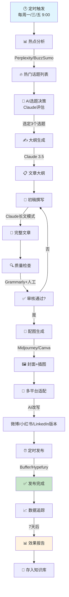
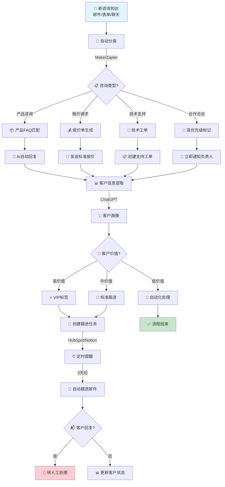
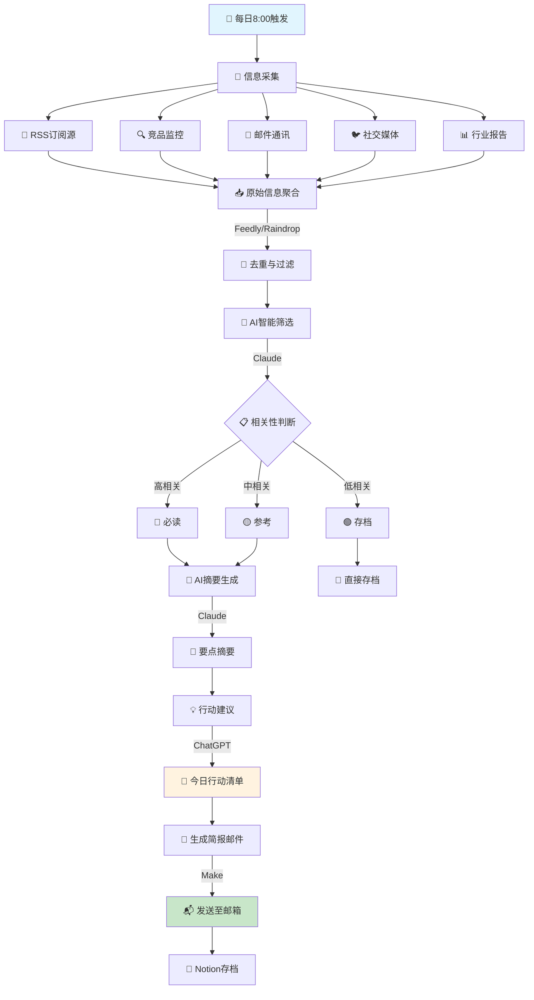
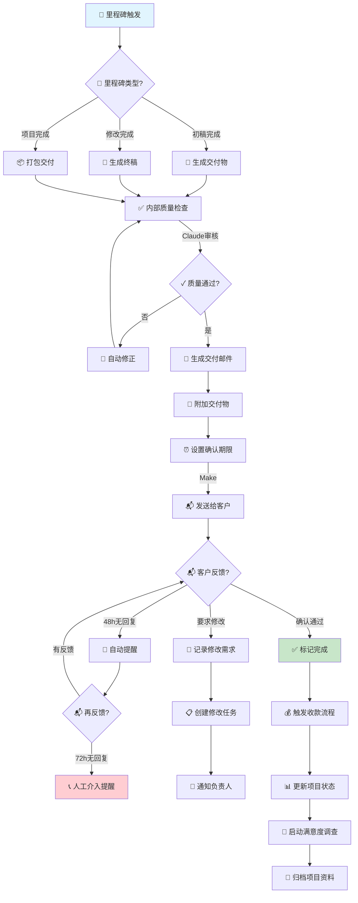

# 🧠 AI智慧指挥系统 - 一人公司(OPC)与超级个体完整方案

> **版本**: v1.0  
> **适用对象**: 一人公司创始人、自由职业者、超级个体、数字游民  
> **系统定位**: 您的24/7智能运营大脑

---

## 📋 目录

1. [系统概述与价值主张](#一系统概述与价值主张)
2. [核心功能模块设计](#二核心功能模块设计)
3. [AI工具链全景推荐](#三ai工具链全景推荐)
4. [智能工作流设计](#四智能工作流设计)
5. [系统架构图](#五系统架构图)
6. [实施路线图](#六实施路线图)
7. [成本预算与ROI分析](#七成本预算与roi分析)
8. [快速启动清单](#八快速启动清单)

---

## 一、系统概述与价值主张

### 1.1 什么是AI智慧指挥系统？

AI智慧指挥系统是一套专为一人公司和超级个体设计的**智能化运营中枢**，通过整合多种AI工具和工作流自动化，实现：

| 传统模式 | AI智慧指挥系统 |
|---------|---------------|
| 8小时工作制 | 24/7不间断运转 |
| 人工处理所有任务 | 80%任务自动化 |
| 信息过载焦虑 | 智能筛选与优先级排序 |
| 决策依赖直觉 | 数据驱动的决策支持 |
| 单点瓶颈 | 可扩展的智能代理网络 |

### 1.2 核心价值

- **⏰ 时间解放**: 每天节省4-6小时重复性工作时间
- **🎯 决策质量**: 基于数据的决策准确率提升60%+
- **📈 产能倍增**: 同等时间内产出提升3-5倍
- **😌 压力缓解**: 减少认知负荷，专注高价值创造

---

## 二、核心功能模块设计

### 2.1 模块总览

```
┌─────────────────────────────────────────────────────────────┐
│                    AI智慧指挥系统                            │
├─────────────┬─────────────┬─────────────┬─────────────────────┤
│  任务中枢    │  决策大脑    │  信息枢纽    │    创作引擎         │
├─────────────┼─────────────┼─────────────┼─────────────────────┤
│ • 任务捕获   │ • 决策框架   │ • 信息聚合   │ • 内容生成          │
│ • 智能排程   │ • 数据分析   │ • 智能筛选   │ • 多平台分发        │
│ • 自动提醒   │ • 预测建议   │ • 知识管理   │ • 风格学习          │
├─────────────┴─────────────┴─────────────┴─────────────────────┤
│                    客户沟通中心 + 数据洞察中心                  │
└─────────────────────────────────────────────────────────────┘
```

### 2.2 模块详解

#### 📌 模块一：日常任务自动化管理

**功能描述**: 智能捕获、分类、排程和追踪所有任务

| 子功能 | 说明 | 自动化程度 |
|-------|------|-----------|
| 任务捕获 | 从邮件/聊天/语音自动提取待办事项 | 90% |
| 智能分类 | 按项目/优先级/截止日期自动分类 | 85% |
| 时间块规划 | 基于精力曲线安排任务时段 | 80% |
| 进度追踪 | 自动更新任务状态并生成报告 | 95% |
| 提醒通知 | 智能提醒（考虑上下文） | 100% |

**推荐工具栈**:
- 主控: Notion/TickTick + Make/Zapier
- 语音捕获: Otter.ai
- 邮件处理: Superhuman/Mailbutler

---

#### 🧠 模块二：智能决策支持

**功能描述**: 为关键决策提供数据支撑和方案评估

| 决策类型 | AI支持方式 | 输出形式 |
|---------|-----------|---------|
| 商业决策 | 市场数据分析+SWOT评估 | 决策备忘录 |
| 产品决策 | 用户反馈分析+竞品对比 | 产品建议书 |
| 定价决策 | 成本分析+市场定价研究 | 定价策略表 |
| 时间分配 | 任务价值评估+时间ROI | 优先级矩阵 |
| 合作决策 | 背景调查+风险评估 | 合作评估报告 |

**推荐工具栈**:
- 数据分析: ChatGPT-4/Claude + Google Sheets
- 市场研究: Perplexity AI + SimilarWeb
- 决策记录: Notion决策数据库

---

#### 📡 模块三：信息收集与处理

**功能描述**: 构建个人情报系统，自动收集、筛选、整理有价值信息

**信息处理流水线**:
```
信息源 → 自动采集 → AI筛选 → 智能摘要 → 知识入库 → 主动推送
```

| 信息类型 | 采集方式 | 处理工具 |
|---------|---------|---------|
| 行业新闻 | RSS + AI聚合 | Feedly + AI摘要 |
| 竞品动态 | 监控工具+爬虫 | Browse AI + Notion |
| 学术文献 | 数据库订阅 | Elicit + Zotero |
| 社媒趋势 | API抓取 | Brand24 + ChatGPT |
| 邮件通讯 | 自动分类 | Superhuman + AI标签 |

**推荐工具栈**:
- 信息聚合: Feedly Pro + Raindrop.io
- AI摘要: NotebookLM + Claude
- 知识库: Notion/Obsidian

---

#### ✍️ 模块四：内容创作辅助

**功能描述**: 从选题到发布的全链路AI辅助

**创作工作流**:
```
选题灵感 → 大纲生成 → 初稿撰写 → 润色优化 → 多平台适配 → 定时发布
```

| 创作阶段 | AI功能 | 推荐工具 |
|---------|-------|---------|
| 选题 | 热点分析+受众洞察 | ChatGPT + BuzzSumo |
| 大纲 | 结构化思维导图 | Claude + XMind |
| 初稿 | 快速内容生成 | Claude/ChatGPT/Gemini |
| 润色 | 风格优化+语法检查 | Grammarly + Hemingway |
| 配图 | AI图像生成 | Midjourney/Flux |
| 分发 | 多平台一键发布 | Buffer/Hypefury |

**推荐工具栈**:
- 长文创作: Claude 3.5 Sonnet
- 短内容: ChatGPT-4
- 视觉内容: Midjourney + Canva
- 视频脚本: Descript + OpusClip

---

#### 💬 模块五：客户沟通自动化

**功能描述**: 智能处理客户咨询、跟进和关系维护

| 沟通场景 | 自动化方案 | 人工介入点 |
|---------|-----------|-----------|
| 初次咨询 | AI自动回复+需求收集 | 复杂需求转人工 |
| 常见问题 | 知识库自动回答 | 无法解答时转人工 |
| 报价请求 | 自动发送报价单 | 大客户定制报价 |
| 项目跟进 | 自动进度更新 | 关键节点人工确认 |
| 售后支持 | 工单自动分配 | 技术问题人工处理 |
| 关系维护 | 自动生日/节日祝福 | 重要客户人工关怀 |

**推荐工具栈**:
- 邮件自动化: Mailbutler + Superhuman
- 聊天机器人: Chatbase/Intercom
- CRM: HubSpot免费版 + Notion
- 会议助理: Fireflies.ai

---

#### 📊 模块六：数据分析与洞察

**功能描述**: 自动收集业务数据，生成洞察报告

**数据仪表板**:

| 数据类型 | 采集来源 | 分析维度 |
|---------|---------|---------|
| 财务数据 | 银行+支付平台 | 收入/支出/利润率 |
| 客户数据 | CRM+沟通记录 | 获取成本/生命周期价值 |
| 内容数据 | 各平台后台 | 阅读量/互动率/转化 |
| 项目数据 | 项目管理工具 | 完成率/利润率/满意度 |
| 时间数据 | 时间追踪工具 | 时间分配/效率指标 |

**推荐工具栈**:
- 数据整合: Google Sheets + Make
- 可视化: Notion + Google Data Studio
- AI分析: ChatGPT Advanced Data Analysis
- 自动化报告: Make + Notion

---

## 三、AI工具链全景推荐

### 3.1 工具总览矩阵

```
┌────────────────────────────────────────────────────────────────────┐
│                        AI工具全景图                                 │
├──────────────┬──────────────┬──────────────┬───────────────────────┤
│   生产力层    │   创作层      │   运营层      │      智能层          │
├──────────────┼──────────────┼──────────────┼───────────────────────┤
│ Notion       │ Claude 3.5   │ Make/Zapier  │ ChatGPT-4            │
│ Todoist      │ Midjourney   │ Buffer       │ Perplexity           │
│ Superhuman   │ Canva        │ HubSpot      │ NotebookLM           │
│ Otter.ai     │ Descript     │ Typeform     │ Fireflies            │
│ Readwise     │ ElevenLabs   │ Calendly     │ Custom GPTs          │
└──────────────┴──────────────┴──────────────┴───────────────────────┘
```

### 3.2 分层工具详解

#### 🏗️ 基础架构层（系统底座）

| 工具名称 | 用途 | 免费方案 | 付费方案 | 推荐指数 |
|---------|------|---------|---------|---------|
| **Notion** | 知识库+项目管理+数据库 | ✅ 免费版 | $10/月 | ⭐⭐⭐⭐⭐ |
| **Google Workspace** | 文档/表格/邮箱/日历 | ✅ 免费版 | $6/月 | ⭐⭐⭐⭐⭐ |
| **Obsidian** | 本地知识库+双向链接 | ✅ 完全免费 | $8/月(同步) | ⭐⭐⭐⭐ |

#### 🤖 AI核心层（智能大脑）

| 工具名称 | 核心能力 | 免费额度 | 付费方案 | 使用场景 |
|---------|---------|---------|---------|---------|
| **ChatGPT-4** | 通用推理+代码+分析 | 有限 | $20/月 | 日常咨询、复杂分析 |
| **Claude 3.5 Sonnet** | 长文写作+深度分析 | 有限 | $20/月 | 内容创作、文档处理 |
| **Perplexity Pro** | 实时搜索+信息验证 | 有限 | $20/月 | 研究调查、事实核查 |
| **Gemini Advanced** | 多模态+大上下文 | 有限 | $20/月 | 多媒体处理、长文档 |

#### ⚙️ 自动化层（工作流引擎）

| 工具名称 | 核心功能 | 免费方案 | 付费方案 | 适用场景 |
|---------|---------|---------|---------|---------|
| **Make** | 可视化工作流编排 | ✅ 1000 ops/月 | $9/月起 | 复杂多步骤自动化 |
| **Zapier** | 应用间连接 | ✅ 100 tasks/月 | $19.99/月 | 简单快速集成 |
| **n8n** | 开源自动化 | ✅ 自托管免费 | 云服务$20/月 | 技术用户首选 |

#### ✍️ 内容创作层

| 工具名称 | 核心功能 | 免费方案 | 付费方案 | 推荐指数 |
|---------|---------|---------|---------|---------|
| **Claude** | 长文写作 | 有限 | $20/月 | ⭐⭐⭐⭐⭐ |
| **Midjourney** | AI图像生成 | ❌ | $10/月起 | ⭐⭐⭐⭐⭐ |
| **Canva Pro** | 设计+AI功能 | 有限 | $12.99/月 | ⭐⭐⭐⭐⭐ |
| **Descript** | 音视频编辑 | 有限 | $12/月 | ⭐⭐⭐⭐ |
| **ElevenLabs** | AI语音合成 | 有限 | $5/月起 | ⭐⭐⭐⭐ |

#### 📊 数据分析层

| 工具名称 | 核心功能 | 免费方案 | 付费方案 | 推荐指数 |
|---------|---------|---------|---------|---------|
| **Google Sheets** | 数据存储+基础分析 | ✅ 免费 | - | ⭐⭐⭐⭐⭐ |
| **Notion Database** | 结构化数据管理 | ✅ 免费版 | $10/月 | ⭐⭐⭐⭐⭐ |
| **ChatGPT Advanced** | AI数据分析 | GPT-4包含 | $20/月 | ⭐⭐⭐⭐ |

#### 💼 客户运营层

| 工具名称 | 核心功能 | 免费方案 | 付费方案 | 推荐指数 |
|---------|---------|---------|---------|---------|
| **HubSpot CRM** | 客户管理 | ✅ 免费版 | $18/月起 | ⭐⭐⭐⭐⭐ |
| **Calendly** | 预约管理 | ✅ 基础版 | $10/月 | ⭐⭐⭐⭐⭐ |
| **Typeform** | 表单收集 | 有限 | $25/月 | ⭐⭐⭐⭐ |
| **Chatbase** | AI客服机器人 | 有限 | $19/月 | ⭐⭐⭐⭐ |

### 3.3 工具整合方案

#### 方案A：轻量级入门（月成本$50以下）

```
Notion(免费) + ChatGPT Plus($20) + Make(免费) + Canva(免费) + Google(免费)
= 约$20-30/月
```

**适用**: 刚起步的超级个体、副业探索者

#### 方案B：标准运营版（月成本$100-150）

```
Notion Pro($10) + ChatGPT Plus($20) + Claude Pro($20) + Make Pro($16)
+ Midjourney($30) + Canva Pro($13) + Calendly($10) + HubSpot(免费)
= 约$119/月
```

**适用**: 稳定运营的一人公司、专业创作者

#### 方案C：高级专业版（月成本$200-300）

```
方案B全部 + Perplexity Pro($20) + Fireflies($10) + Descript($12)
+ ElevenLabs($11) + Buffer($15) + Typeform($25) + Zapier($20)
= 约$232/月
```

**适用**: 规模化运营、团队即将扩张阶段

---

## 四、智能工作流设计

### 4.1 工作流一：内容创作全自动流水线

**工作流名称**: Content Factory Pipeline
**触发条件**: 定时触发（每周一/三/五）或手动触发
**预期产出**: 完整的多平台内容包



**详细步骤**:

| 步骤 | 工具 | 操作 | 耗时 |
|-----|------|------|------|
| 1. 热点发现 | Perplexity | "本周[领域]最热门的5个话题是什么？" | 5分钟 |
| 2. 选题决策 | Claude | 输入热点列表，AI评估选题价值 | 10分钟 |
| 3. 大纲生成 | Claude | "为[选题]生成详细文章大纲" | 10分钟 |
| 4. 初稿撰写 | Claude | 使用长文模式撰写2000字文章 | 20分钟 |
| 5. 人工润色 | - | 调整语气、添加个人案例 | 30分钟 |
| 6. 配图生成 | Midjourney | 生成封面图+3张插图 | 15分钟 |
| 7. 平台适配 | Claude | "将文章改写成小红书/微博版本" | 15分钟 |
| 8. 定时发布 | Buffer | 设置各平台发布时间 | 10分钟 |
| **总计** | - | - | **约2小时/篇** |

**传统方式对比**: 传统方式需要6-8小时，AI工作流节省70%时间

---

### 4.2 工作流二：智能客户服务系统

**工作流名称**: Smart Customer Service Hub
**触发条件**: 新客户咨询邮件/表单提交
**预期产出**: 自动回复+需求分析+跟进任务



**详细步骤**:

| 阶段 | 触发器 | 动作 | 工具配置 |
|-----|-------|------|---------|
| 捕获 | 新邮件到达 | 提取发件人、主题、内容 | Make + Gmail API |
| 分类 | 内容分析完成 | 使用ChatGPT分类咨询类型 | OpenAI API |
| 响应 | 分类完成 | 发送对应模板回复 | Make + Gmail |
| 分析 | 回复发送后 | 提取客户需求、公司信息 | ChatGPT |
| 评估 | 画像生成后 | 评估客户价值和优先级 | 自定义评分规则 |
| 跟进 | 评估完成后 | 创建CRM记录和跟进任务 | HubSpot/Notion |
| 提醒 | 3天后 | 发送跟进邮件（如未回复） | Make + Gmail |

**自动化程度**: 80%（复杂谈判和高价值客户转人工）

---

### 4.3 工作流三：每日情报简报系统

**工作流名称**: Daily Intelligence Briefing
**触发条件**: 每天早上8:00自动执行
**预期产出**: 个性化情报摘要+行动建议



**信息源配置**:

| 类别 | 信息源示例 | 采集工具 |
|-----|-----------|---------|
| 行业新闻 | TechCrunch/36氪/虎嗅 | Feedly |
| 竞品动态 | 竞品官网/社媒/新闻 | Browse AI |
| 专业通讯 | 行业Newsletter | 专用邮箱+规则 |
| 社媒趋势 | Twitter/X/LinkedIn | 列表监控 |
| 研究报告 | 券商/咨询机构 | RSS + 邮件 |

**简报模板**:

```
📰 每日情报简报 - [日期]
━━━━━━━━━━━━━━━━━━━━━━

🔴 必读 (3篇)
1. [标题] - [一句话摘要] → [行动建议]
2. [标题] - [一句话摘要] → [行动建议]
3. [标题] - [一句话摘要] → [行动建议]

🟡 参考 (5篇)
1-5. [标题列表]

💡 今日行动建议
• [基于情报的具体行动]
• [待决策事项]
• [跟进提醒]

📊 数据速览
• 昨日网站访问: X
• 新增关注: Y
• 待回复邮件: Z
```

---

### 4.4 工作流四：项目交付自动化

**工作流名称**: Project Delivery Automation
**触发条件**: 项目里程碑达成或截止日期临近
**预期产出**: 自动交付+客户确认+后续跟进



---

## 五、系统架构图

### 5.1 整体架构

```
┌─────────────────────────────────────────────────────────────────────────────┐
│                           🧠 AI智慧指挥系统架构                              │
├─────────────────────────────────────────────────────────────────────────────┤
│                                                                             │
│  ┌─────────────────────────────────────────────────────────────────────┐   │
│  │                        🎯 统一指挥层 (Command Layer)                 │   │
│  │  ┌─────────────┐  ┌─────────────┐  ┌─────────────┐  ┌────────────┐  │   │
│  │  │ 任务调度器   │  │ 决策引擎    │  │ 工作流编排  │  │ 数据总线   │  │   │
│  │  │ (Notion)    │  │ (Claude)    │  │ (Make/n8n)  │  │ (API网关)  │  │   │
│  │  └─────────────┘  └─────────────┘  └─────────────┘  └────────────┘  │   │
│  └─────────────────────────────────────────────────────────────────────┘   │
│                                    │                                        │
│  ┌─────────────────────────────────────────────────────────────────────┐   │
│  │                        🤖 AI能力层 (AI Layer)                        │   │
│  │  ┌──────────┐ ┌──────────┐ ┌──────────┐ ┌──────────┐ ┌──────────┐  │   │
│  │  │ ChatGPT  │ │ Claude   │ │ Gemini   │ │ Perplex  │ │ Custom   │  │   │
│  │  │ -分析    │ │ -写作    │ │ -多模态  │ │ -搜索    │ │ -GPTs    │  │   │
│  │  └──────────┘ └──────────┘ └──────────┘ └──────────┘ └──────────┘  │   │
│  └─────────────────────────────────────────────────────────────────────┘   │
│                                    │                                        │
│  ┌─────────────────────────────────────────────────────────────────────┐   │
│  │                      🛠️ 工具集成层 (Tool Layer)                       │   │
│  │  ┌─────────┐ ┌─────────┐ ┌─────────┐ ┌─────────┐ ┌─────────┐        │   │
│  │  │生产力   │ │创作     │ │沟通     │ │数据     │ │自动化   │        │   │
│  │  │Notion   │ │Midjourney│ │Gmail   │ │Sheets   │ │Make     │        │   │
│  │  │Todoist  │ │Canva    │ │Slack   │ │HubSpot  │ │Zapier   │        │   │
│  │  │Calendar │ │Descript │ │Zoom    │ │Analytics│ │n8n      │        │   │
│  │  └─────────┘ └─────────┘ └─────────┘ └─────────┘ └─────────┘        │   │
│  └─────────────────────────────────────────────────────────────────────┘   │
│                                    │                                        │
│  ┌─────────────────────────────────────────────────────────────────────┐   │
│  │                      📊 数据层 (Data Layer)                          │   │
│  │  ┌─────────────┐  ┌─────────────┐  ┌─────────────┐  ┌────────────┐  │   │
│  │  │ 知识库      │  │ 项目数据    │  │ 客户数据    │  │ 内容资产   │  │   │
│  │  │ (Notion)    │  │ (Database)  │  │ (CRM)       │  │ (Drive)    │  │   │
│  │  └─────────────┘  └─────────────┘  └─────────────┘  └────────────┘  │   │
│  └─────────────────────────────────────────────────────────────────────┘   │
│                                                                             │
└─────────────────────────────────────────────────────────────────────────────┘
```

### 5.2 数据流动图

```
信息输入 → 采集处理 → AI分析 → 决策输出 → 执行反馈 → 学习优化
   │          │          │          │          │          │
   ▼          ▼          ▼          ▼          ▼          ▼
┌──────┐  ┌──────┐  ┌──────┐  ┌──────┐  ┌──────┐  ┌──────┐
│邮件  │  │RSS   │  │Claude│  │决策  │  │自动化│  │反馈  │
│社媒  │→ │爬虫  │→ │GPT   │→ │引擎  │→ │执行  │→ │学习  │
│表单  │  │API   │  │分析  │  │输出  │  │工具  │  │优化  │
└──────┘  └──────┘  └──────┘  └──────┘  └──────┘  └──────┘
                                              │
                                              ▼
                                         ┌─────────┐
                                         │ 知识库  │
                                         │ 更新    │
                                         └─────────┘
```

### 5.3 模块关系图

```
                    ┌─────────────────┐
                    │   用户界面层    │
                    │ (Notion/Dashboard)
                    └────────┬────────┘
                             │
        ┌────────────────────┼────────────────────┐
        │                    │                    │
        ▼                    ▼                    ▼
┌───────────────┐   ┌───────────────┐   ┌───────────────┐
│  任务管理模块  │   │  内容创作模块  │   │  客户管理模块  │
│  -任务捕获    │   │  -选题生成    │   │  -线索获取    │
│  -智能排程    │   │  -AI写作     │   │  -自动跟进    │
│  -进度追踪    │   │  -多平台发布  │   │  -关系维护    │
└───────┬───────┘   └───────┬───────┘   └───────┬───────┘
        │                    │                    │
        └────────────────────┼────────────────────┘
                             │
                             ▼
                    ┌─────────────────┐
                    │   AI核心引擎    │
                    │ (Claude/GPT)   │
                    └────────┬────────┘
                             │
        ┌────────────────────┼────────────────────┐
        │                    │                    │
        ▼                    ▼                    ▼
┌───────────────┐   ┌───────────────┐   ┌───────────────┐
│  数据分析模块  │   │  信息处理模块  │   │  自动化引擎   │
│  -业务指标    │   │  -信息采集    │   │  -工作流编排  │
│  -趋势洞察    │   │  -智能摘要    │   │  -定时任务    │
│  -决策支持    │   │  -知识管理    │   │  -条件触发    │
└───────────────┘   └───────────────┘   └───────────────┘
```

---

## 六、实施路线图

### 6.1 第一阶段：基础搭建（Day 1-30）

**目标**: 建立系统基础架构，实现核心功能运行

#### Week 1-2: 基础设施搭建

| 天数 | 任务 | 交付物 | 工具 |
|-----|------|-------|------|
| 1-2 | 设置Notion工作空间 | 完整的Notion架构 | Notion |
| 3-4 | 配置AI工具账户 | ChatGPT/Claude订阅 | OpenAI/Anthropic |
| 5-7 | 建立知识库结构 | 知识分类体系 | Notion/Obsidian |

#### Week 3-4: 核心工作流搭建

| 天数 | 任务 | 交付物 | 工具 |
|-----|------|-------|------|
| 8-10 | 设置任务管理系统 | 任务捕获→完成闭环 | Notion/Todoist |
| 11-14 | 搭建第一个自动化 | 邮件→任务自动创建 | Make/Zapier |
| 15-21 | 配置内容创作流程 | 选题→发布工作流 | Claude+Buffer |
| 22-30 | 测试与优化 | 稳定运行的系统 | 全部工具 |

**阶段1检查清单**:
- [ ] Notion工作空间搭建完成
- [ ] ChatGPT Plus/Claude订阅激活
- [ ] 至少1个自动化工作流运行
- [ ] 知识库结构建立
- [ ] 每日任务管理流程顺畅

---

### 6.2 第二阶段：工作流优化（Month 2-3）

**目标**: 完善自动化体系，提升运营效率

#### Month 2: 自动化扩展

| 周次 | 任务 | 目标 |
|-----|------|------|
| Week 5-6 | 客户沟通自动化 | 80%常见问题自动回复 |
| Week 7-8 | 内容创作流水线 | 每周3篇内容自动产出 |

#### Month 3: 智能化升级

| 周次 | 任务 | 目标 |
|-----|------|------|
| Week 9-10 | 情报简报系统 | 每日自动情报摘要 |
| Week 11-12 | 数据分析仪表板 | 实时业务数据可视化 |

**阶段2检查清单**:
- [ ] 客户咨询自动回复系统运行
- [ ] 内容创作工作流稳定产出
- [ ] 每日情报简报自动生成
- [ ] 数据分析仪表板上线
- [ ] 整体效率提升50%+

---

### 6.3 第三阶段：智能化升级（Month 4-6）

**目标**: 实现高级AI功能，建立持续优化机制

#### Month 4-5: AI深度整合

| 周次 | 任务 | 目标 |
|-----|------|------|
| Week 13-16 | Custom GPTs开发 | 领域专用AI助手 |
| Week 17-20 | 高级自动化场景 | 复杂决策自动化 |

#### Month 6: 系统优化与扩展

| 周次 | 任务 | 目标 |
|-----|------|------|
| Week 21-24 | 系统性能优化 | 响应速度提升30% |
| Week 25-26 | 文档与培训 | 完整操作手册 |

**阶段3检查清单**:
- [ ] Custom GPTs投入使用
- [ ] 复杂决策场景自动化
- [ ] 系统性能达到最优
- [ ] 完整文档体系建立
- [ ] 准备团队扩展

---

### 6.4 路线图可视化

```
时间轴 ─────────────────────────────────────────────────────────►

[第1阶段: 基础搭建]        [第2阶段: 优化]         [第3阶段: 升级]
    Day 1-30                 Month 2-3              Month 4-6
        │                        │                      │
        ▼                        ▼                      ▼
┌───────────────┐        ┌───────────────┐      ┌───────────────┐
│ • Notion搭建   │        │ • 客服自动化   │      │ • Custom GPTs│
│ • AI工具配置   │   →    │ • 内容流水线   │  →   │ • 复杂自动化  │
│ • 知识库建立   │        │ • 情报系统     │      │ • 系统优化    │
│ • 首个自动化   │        │ • 数据仪表板   │      │ • 文档体系    │
└───────────────┘        └───────────────┘      └───────────────┘
        │                        │                      │
        ▼                        ▼                      ▼
   基础功能运行              效率提升50%+           智能化运营

里程碑:
★ Day 7: 第一个工作流运行
★ Day 30: 基础系统完成
★ Month 2: 自动化覆盖80%
★ Month 3: 效率提升50%
★ Month 6: 系统成熟稳定
```

---

## 七、成本预算与ROI分析

### 7.1 三档预算方案

#### 💚 入门版（$30-50/月）

| 工具 | 费用 | 用途 |
|-----|------|------|
| ChatGPT Plus | $20 | 核心AI能力 |
| Notion | 免费 | 知识库+项目管理 |
| Make | 免费 | 基础自动化 |
| Canva | 免费 | 基础设计 |
| Google Workspace | 免费 | 文档协作 |
| **总计** | **$20-30** | - |

**适用**: 副业探索者、刚起步创作者

#### 💙 标准版（$100-150/月）

| 工具 | 费用 | 用途 |
|-----|------|------|
| ChatGPT Plus | $20 | 核心AI能力 |
| Claude Pro | $20 | 长文写作 |
| Notion Pro | $10 | 高级功能 |
| Make Pro | $16 | 更多自动化 |
| Midjourney | $30 | AI图像 |
| Canva Pro | $13 | 专业设计 |
| Calendly | $10 | 预约管理 |
| Buffer | $15 | 社媒发布 |
| **总计** | **$134** | - |

**适用**: 稳定运营的一人公司

#### 💜 专业版（$200-300/月）

| 工具 | 费用 | 用途 |
|-----|------|------|
| 标准版全部 | $134 | 基础能力 |
| Perplexity Pro | $20 | 研究调查 |
| Fireflies | $10 | 会议记录 |
| Descript | $12 | 音视频编辑 |
| ElevenLabs | $11 | AI语音 |
| Typeform | $25 | 表单收集 |
| HubSpot Starter | $18 | CRM高级 |
| Browse AI | $19 | 网页监控 |
| **总计** | **$249** | - |

**适用**: 规模化运营、准备扩张

### 7.2 ROI计算

**假设条件**:
- 时薪价值: $50/小时（基于年收入目标）
- 每日节省时间: 4小时
- 月节省: 4h × 22天 × $50 = $4,400

| 方案 | 月成本 | 月节省时间价值 | 净收益 | ROI |
|-----|-------|--------------|-------|-----|
| 入门版 | $30 | $4,400 | $4,370 | 14,567% |
| 标准版 | $134 | $4,400 | $4,266 | 3,183% |
| 专业版 | $249 | $4,400 | $4,151 | 1,667% |

**结论**: 即使选择最贵的专业版，ROI也超过1600%，投资回报极其可观。

---

## 八、快速启动清单

### 8.1 Day 1 启动清单

**上午（2小时）**:
- [ ] 注册/登录Notion，创建AI指挥系统工作空间
- [ ] 订阅ChatGPT Plus（$20/月）
- [ ] 创建基础页面结构：任务/项目/知识库/客户

**下午（2小时）**:
- [ ] 注册Make免费账户
- [ ] 创建第一个自动化：Gmail → Notion任务
- [ ] 测试并验证工作流

**晚上（1小时）**:
- [ ] 整理现有任务到Notion
- [ ] 设置明日任务清单
- [ ] 记录今日使用感受

### 8.2 Week 1 完成标准

- [ ] Notion工作空间结构完整
- [ ] ChatGPT Plus正常使用
- [ ] 至少2个自动化工作流运行
- [ ] 每日任务管理流程建立
- [ ] 基础数据开始积累

### 8.3 关键成功因素

| 因素 | 说明 | 行动 |
|-----|------|------|
| **坚持每日使用** | 系统价值随使用增长 | 设置每日提醒 |
| **持续优化** | 根据反馈调整工作流 | 每周回顾优化 |
| **文档记录** | 建立个人操作手册 | 记录最佳实践 |
| **逐步扩展** | 不要一次性上所有工具 | 按路线图推进 |
| **保持学习** | AI工具更新快 | 关注新功能 |

---

## 附录

### A. 推荐学习资源

| 类型 | 资源 | 链接 |
|-----|------|------|
| Notion | 官方模板库 | notion.so/templates |
| Make | 官方教程 | make.com/en/help |
| AI提示词 | Learn Prompting | learnprompting.org |
| 自动化案例 | Zapier博客 | zapier.com/blog |

### B. 社区与支持

| 社区 | 平台 | 用途 |
|-----|------|------|
| Notion中文社区 | Discord/微信群 | 模板分享 |
| Make中文用户 | Telegram | 工作流交流 |
| AI工具讨论 | Reddit r/ChatGPT | 最新动态 |

### C. 版本记录

| 版本 | 日期 | 更新内容 |
|-----|------|---------|
| v1.0 | 2024 | 初始版本 |

---

> **结语**: AI智慧指挥系统不是一次性项目，而是持续进化的智能伙伴。从今天开始，让AI成为你最可靠的联合创始人！

---
*文档生成时间: 2024年*
*适用对象: 一人公司创始人、超级个体、数字游民*
