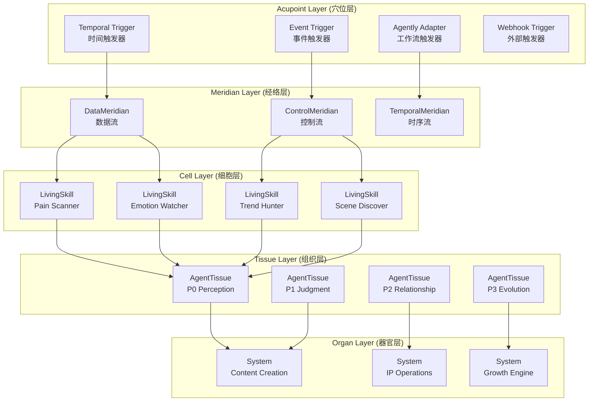
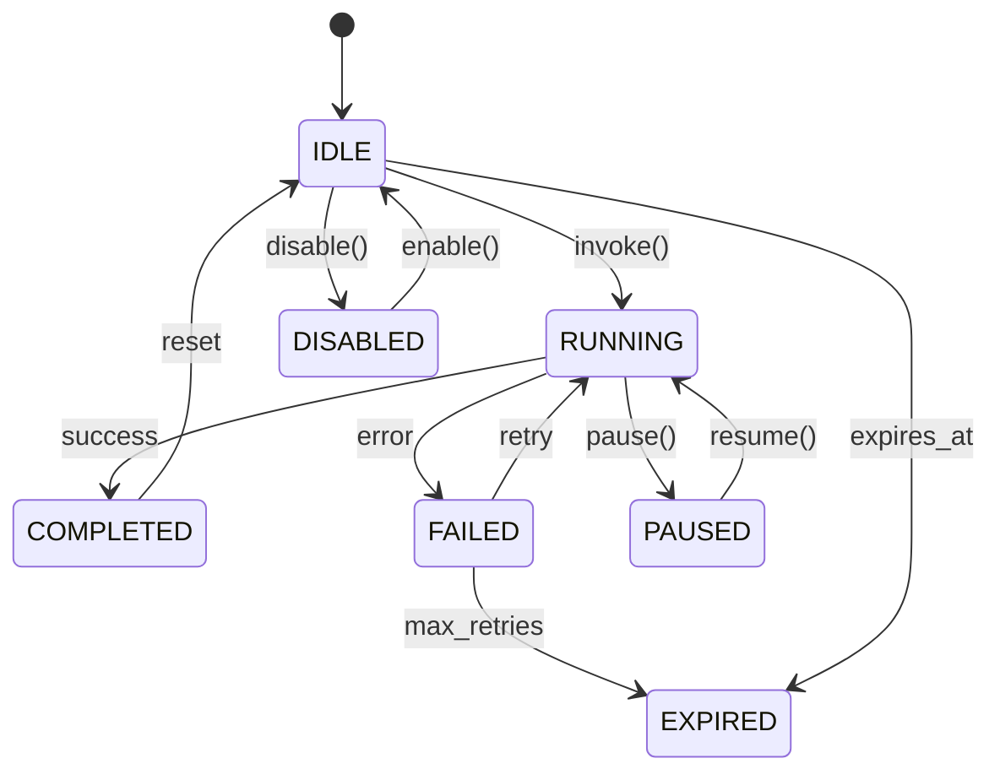
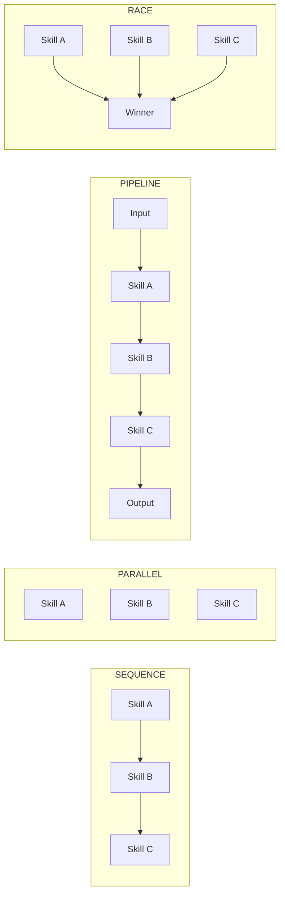
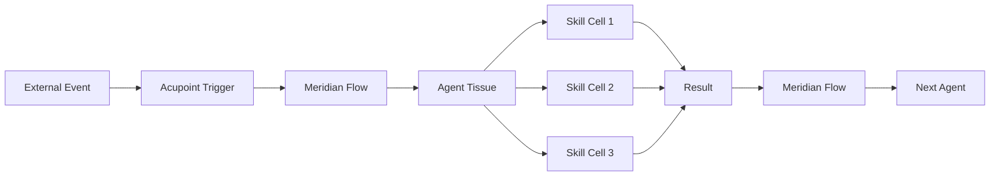
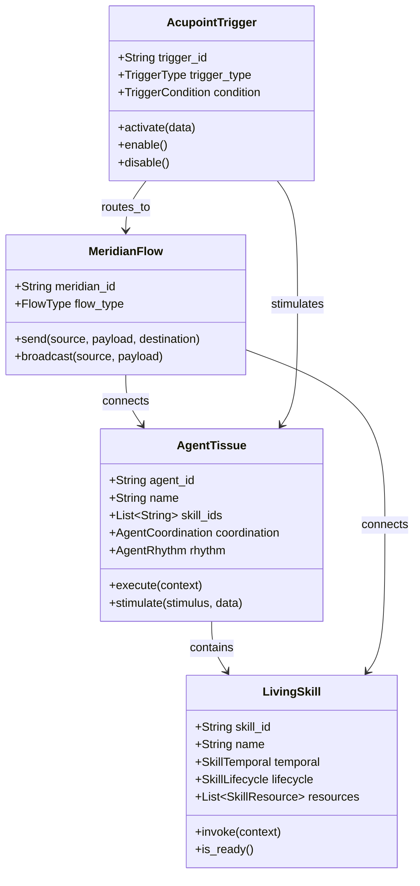
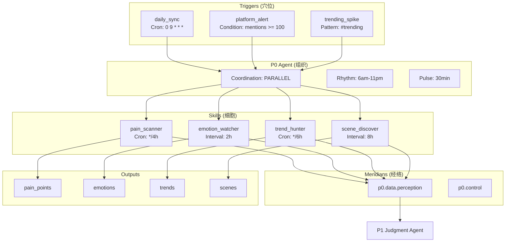
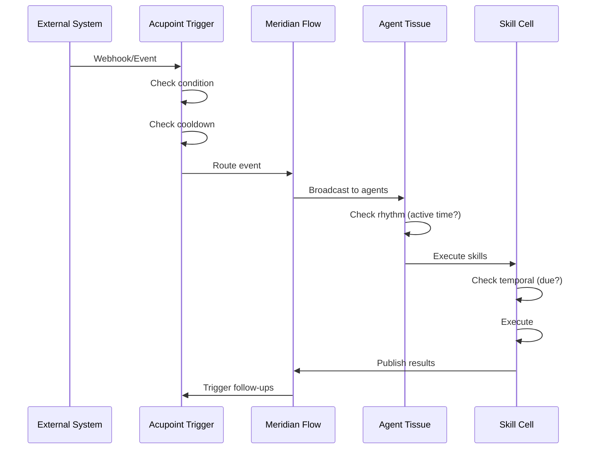

# Living Knowledge System Architecture

## 五层架构总览

```mermaid
graph TB
    subgraph "Acupoint Layer (穴位层)"
        A1[Temporal Trigger<br/>时间触发器]
        A2[Event Trigger<br/>事件触发器]
        A3[Agently Adapter<br/>工作流触发器]
        A4[Webhook Trigger<br/>外部触发器]
    end

    subgraph "Meridian Layer (经络层)"
        M1[DataMeridian<br/>数据流]
        M2[ControlMeridian<br/>控制流]
        M3[TemporalMeridian<br/>时序流]
    end

    subgraph "Cell Layer (细胞层)"
        S1[LivingSkill<br/>Pain Scanner]
        S2[LivingSkill<br/>Emotion Watcher]
        S3[LivingSkill<br/>Trend Hunter]
        S4[LivingSkill<br/>Scene Discover]
    end

    subgraph "Tissue Layer (组织层)"
        T1[AgentTissue<br/>P0 Perception]
        T2[AgentTissue<br/>P1 Judgment]
        T3[AgentTissue<br/>P2 Relationship]
        T4[AgentTissue<br/>P3 Evolution]
    end

    subgraph "Organ Layer (器官层)"
        O1[System<br/>Content Creation]
        O2[System<br/>IP Operations]
        O3[System<br/>Growth Engine]
    end

    A1 --> M1
    A2 --> M2
    A3 --> M3

    M1 --> S1
    M1 --> S2
    M2 --> S3
    M2 --> S4

    S1 --> T1
    S2 --> T1
    S3 --> T1
    S4 --> T1

    T1 --> O1
    T2 --> O1
    T3 --> O2
    T4 --> O3
```

## Skill 生命周期

```mermaid
stateDiagram-v2
    [*] --> IDLE
    IDLE --> RUNNING: invoke()
    RUNNING --> COMPLETED: success
    RUNNING --> FAILED: error
    RUNNING --> PAUSED: pause()
    PAUSED --> RUNNING: resume()
    COMPLETED --> IDLE: reset
    FAILED --> RUNNING: retry
    FAILED --> EXPIRED: max_retries
    IDLE --> DISABLED: disable()
    DISABLED --> IDLE: enable()
    IDLE --> EXPIRED: expires_at
```

## Agent 协调模式

```mermaid
graph LR
    subgraph "SEQUENCE"
        S1[Skill A] --> S2[Skill B] --> S3[Skill C]
    end

    subgraph "PARALLEL"
        P1[Skill A]
        P2[Skill B]
        P3[Skill C]
    end

    subgraph "PIPELINE"
        I1[Input] --> PL1[Skill A] --> PL2[Skill B] --> PL3[Skill C] --> O1[Output]
    end

    subgraph "RACE"
        R1[Skill A] --> RW[Winner]
        R2[Skill B] --> RW
        R3[Skill C] --> RW
    end
```

## 数据流架构

```mermaid
flowchart LR
    A[External Event] --> B[Acupoint Trigger]
    B --> C[Meridian Flow]
    C --> D[Agent Tissue]
    D --> E[Skill Cell 1]
    D --> F[Skill Cell 2]
    D --> G[Skill Cell 3]
    E --> H[Result]
    F --> H
    G --> H
    H --> I[Meridian Flow]
    I --> J[Next Agent]
```

## 时序调度

```mermaid
gantt
    title Skill Execution Timeline
    dateFormat HH:mm
    section Pain Scanner
    Execute           :a1, 09:00, 10m
    Cooldown          :a2, after a1, 4h
    section Emotion Watcher
    Execute           :b1, 09:00, 5m
    Execute           :b2, 11:00, 5m
    Execute           :b3, 13:00, 5m
    section Trend Hunter
    Execute           :c1, 09:00, 15m
    Cooldown          :c2, after c1, 6h
```

## 组件关系

```mermaid
classDiagram
    class LivingSkill {
        +String skill_id
        +String name
        +SkillTemporal temporal
        +SkillLifecycle lifecycle
        +List~SkillResource~ resources
        +invoke(context)
        +is_ready()
    }

    class AgentTissue {
        +String agent_id
        +String name
        +List~String~ skill_ids
        +AgentCoordination coordination
        +AgentRhythm rhythm
        +execute(context)
        +stimulate(stimulus, data)
    }

    class MeridianFlow {
        +String meridian_id
        +FlowType flow_type
        +send(source, payload, destination)
        +broadcast(source, payload)
    }

    class AcupointTrigger {
        +String trigger_id
        +TriggerType trigger_type
        +TriggerCondition condition
        +activate(data)
        +enable()
        +disable()
    }

    AgentTissue --> LivingSkill : contains
    MeridianFlow --> LivingSkill : connects
    MeridianFlow --> AgentTissue : connects
    AcupointTrigger --> AgentTissue : stimulates
    AcupointTrigger --> MeridianFlow : routes_to
```

## P0 感知系统详细架构

```mermaid
graph TB
    subgraph "Triggers (穴位)"
        T1[daily_sync<br/>Cron: 0 9 * * *]
        T2[platform_alert<br/>Condition: mentions >= 100]
        T3[trending_spike<br/>Pattern: #trending]
    end

    subgraph "P0 Agent (组织)"
        A1[Coordination: PARALLEL]
        A2[Rhythm: 6am-11pm]
        A3[Pulse: 30min]
    end

    subgraph "Skills (细胞)"
        S1[pain_scanner<br/>Cron: */4h]
        S2[emotion_watcher<br/>Interval: 2h]
        S3[trend_hunter<br/>Cron: */6h]
        S4[scene_discover<br/>Interval: 8h]
    end

    subgraph "Meridians (经络)"
        M1[p0.data.perception]
        M2[p0.control]
    end

    subgraph "Outputs"
        O1[pain_points]
        O2[emotions]
        O3[trends]
        O4[scenes]
    end

    T1 --> A1
    T2 --> A1
    T3 --> A1

    A1 --> S1
    A1 --> S2
    A1 --> S3
    A1 --> S4

    S1 --> M1
    S2 --> M1
    S3 --> M1
    S4 --> M1

    S1 --> O1
    S2 --> O2
    S3 --> O3
    S4 --> O4

    M1 --> P1[P1 Judgment Agent]
```

## 事件驱动流程

```mermaid
sequenceDiagram
    participant Ext as External System
    participant AT as Acupoint Trigger
    participant MF as Meridian Flow
    participant AG as Agent Tissue
    participant SK as Skill Cell

    Ext->>AT: Webhook/Event
    AT->>AT: Check condition
    AT->>AT: Check cooldown
    AT->>MF: Route event
    MF->>AG: Broadcast to agents
    AG->>AG: Check rhythm (active time?)
    AG->>SK: Execute skills
    SK->>SK: Check temporal (due?)
    SK->>SK: Execute
    SK->>MF: Publish results
    MF->>AT: Trigger follow-ups
```
